# 3

# 提高效率和质量的自动化

在 CALMR（文化、自动化、精益流、度量、恢复）方法中的因素中，自动化是最与 DevOps 方法相关的。DevOps 从业人员投入了大量精力来跟踪技术趋势，尤其是在环境和工具方面。这些具有不同功能的工具被联系在一起，形成了工具链或管道。

我们通过首先看看每个管道所需的基础工具类型，开始对我们管道中不同类型的工具进行探讨。这些工具包括敏捷项目管理、版本控制系统和审查/文档工具。

**持续集成**（**CI**）工具来源于构建管理工具。我们将考察创建构建的工具，以及在构建执行时运行的其他工具。这些包括自动化测试工具、打包工具和工件仓库。

持续集成的扩展是将构建包部署到预发布和生产环境中。我们将考察在**持续部署**（**CD**）中使用的工具类型，包括配置管理、**基础设施即代码**（**IaC**）和漏洞扫描工具。

自动化仍然依赖于人力。我们将探讨开发团队和运维团队如何对齐，以使用 DevOps 拓扑结构创建必要的自动化和环境。

最后，我们将看到人们如何在 SAFe®中为持续交付管道创建自动化，通过检查系统团队在**敏捷发布** **列车**（**ART**）中的工作来实现这一点。

简而言之，本章将涵盖以下主题：

+   管道和工具链

+   持续集成

+   持续部署

+   DevOps 拓扑结构

+   系统团队

# 管道和工具链

工具链是产品开发生命周期中 DevOps 实践所使用的一组工具。在 DevOps 中，工具链的经典表示是一个无限循环，分解成多个功能。每个功能或阶段都通过自动化得到了增强。由 Kharnagy 创建并依据创作共用署名-相同方式分享（Creative Commons Attribution ShareAlike）许可的此无限循环表示如图所示：

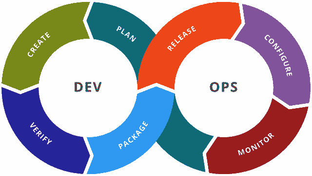

图 3.1 – DevOps 工具链

如果我们将这个无限循环的两端分开，我们就能看到管道的基础。管道协调着所有阶段的操作，唯一例外是监控阶段。这标志着我们对每个管道阶段的探讨开始，如下图所示：

图 3.2 – DevOps 管道

我们通过查看那些其产物启动管道的活动：计划和创建，开始检查管道。这些基础步骤在*图 3.3*中进行了说明：

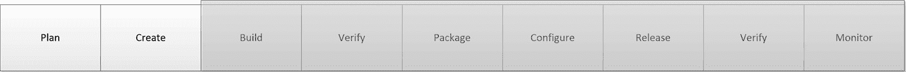

图 3.3 – 管道基础

我们通过了解基础工具来开始对 CI/CD 管道的检查。我们将探讨能够帮助我们规划价值流并监控整个开发过程进展的工具。同时，我们还将检查作为代码、测试、配置脚本和文档存储库的工具。

## 使用敏捷项目管理工具进行规划

要查看从请求到发布的进展，我们需要找到一种方式来理解我们必须做什么，以及这些步骤的进展如何。实现这一目标的方法有很多，从物理看板到 Excel 表格。随着团队在远程和地理分布的工作方式下展开合作，敏捷项目管理工具成为了流行的选择。

敏捷项目管理工具允许创建和更新工作项。工作项的进展可以通过看板或问题列表进行显示。记录工作项及其进展有助于轻松收集进度指标，例如交付周期。

此外，工作项可以与版本控制中的分支和 CI/CD 管道工具中的执行进行关联。这允许在整个管道中跟踪更改何时发布。

领先的敏捷项目管理工具包括 Atlassian 的 Jira 和 Trello，微软的 Azure DevOps，Digital.ai Agility（前身为 VersionOne），IBM 工程工作管理（前身为 IBM Team Concert）以及 Broadcom Rally。此外，许多版本控制工具，如 GitHub 和 GitLab，也包括敏捷项目管理功能。

## 创建代码和文档

版本控制自 1990 年代以来就是软件开发的重要组成部分。通过版本控制，多个开发人员可以在同一代码库上工作，而不必担心删除彼此的更改。为此，开发人员会创建一个包含其更改的分支。当需要共享这些更改时，他们会将更改合并回共享分支，并解决任何差异。合并也是其他开发人员审查即将合并到共享分支中的代码更改的有效时机。

如今，代码不再是唯一保存在版本控制中的工件。用于自动化测试的测试脚本也可以保存在版本控制中。用于配置暂存和生产环境的文本文件同样会保存在版本控制中。简而言之，任何涉及更改或发布的文本都会保存在版本控制中。正如我们在 *第一章* 中看到的，*介绍 SAFe® 和 DevOps*，在观察 Flickr 时，开发与运维之间的常见版本控制系统是最理想的。

最流行的代码版本控制系统是 Git，它由 Linus Torvalds 发明，曾作为 Linux 操作系统的仓库。Git 是一个分布式版本控制系统，允许整个仓库的副本轻松复制，甚至可以复制到开发人员那里。尽管复制非常简便，但仍然有 Git 托管解决方案，允许组织将仓库集中到一个*源*。最受欢迎的 Git 托管产品包括 Atlassian 的 Bitbucket、GitHub、GitLab 和 Azure DevOps。

文档是产品开发中另一个重要的制品。**非功能性需求**（**NFRs**）可以在规格中详细说明，架构可以通过模型和图表来指定，**用户界面/用户体验**（**UI/UX**）指南可以通过线框图和草图来展示。这些初步设计可能从规划开始，并在迭代学习周期中继续发展。

文档仓库和 Wiki 软件用于存储需求规格、架构模型、UI 线框图以及产品和用户文档。常见的仓库包括 Atlassian 的 Confluence 和 GitLab Pages。

一旦代码更改已添加到版本控制中的仓库，CI/CD 流水线的工作就可以开始。我们来看看构成持续集成的活动。

# 持续集成

当代码更改准备好时，自动化可以开始构建用于预发布和生产环境的必要包。作为构建过程的一部分，可以运行测试以确定功能是否正确以及是否安全。当测试表明功能正确且安全时，将创建一个包，并根据使用的技术存储在制品仓库中。

该流水线部分在下图中进行了说明：

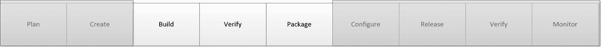

图 3.4 – 流水线：持续集成

让我们看看流水线中的 CI 部分如何管理构建、执行初步测试并打包构建。我们将从定义持续集成、持续交付和持续部署开始。

## 持续集成与持续交付与持续部署

我们将看到，持续集成捕获了在更改提交到版本控制系统后可以自动运行的活动。包括任何更改的代码，可以被编译或打包成计算机可以使用的形式。构建步骤之后会运行测试，以确保没有引入任何漏洞或安全隐患。在成功或失败时，可以生成通知。成功后，代码更改可以与现有代码库合并。我们将在**第十一章**中详细探讨这些步骤，**解决方案开发的持续集成**。

持续交付通过允许将新合并的变更打包并交付到暂存环境、尽可能与生产环境相似的测试环境或生产环境，进一步推动了持续集成的步骤。一旦交付到环境中，就可以运行进一步的测试，以验证新特性的正确性或执行更深层的安全扫描。这些测试的成功使得组织可以在变更准备好时发布它们。有关持续交付的详细步骤（标为持续部署），将列在*第十二章*，*持续部署* *到生产*中。

持续部署是在持续交付的基础上再进一步的步骤：当生产环境中的测试完成时，新特性会自动发布，让客户立即使用。

无论你最终的自动化目标是持续集成、持续交付，还是通过持续部署完全自动化发布，你通常会使用相同的工具来建立你的流水线。现在我们来看看这类工具。

## 编排变更

流水线编排工具（通常称为 CI/CD 工具）最初是作为构建管理工具的。这些工具在手动触发或在版本控制系统中发生提交时，执行构建脚本并执行其他操作。

早期的 CI/CD 工具将要执行的任务作为 UI 的一部分来维护。而如今的 CI/CD 工具允许通过文本文件使用 YAML 或其他格式来定义任务。

CI/CD 工具的强大之处在于它们的灵活性。通过与其他工具的轻松集成来执行其他功能，如自动化测试和部署，使得 DevOps 运动取得了整体成功。通过在工作节点中加入代理软件，实现执行的可扩展性也是一个重要因素，允许在任何环境中创建任务。

CI/CD 工具可以在*本地*环境、私有云中，或作为**软件即服务**（**SaaS**）产品进行设置。最受欢迎的本地或私有云环境中的 CI/CD 工具仍然是 Jenkins，这是一个开源项目，最初作为 Hudson 开发。其他受欢迎的工具包括 CircleCI 和 Atlassian 的 Bamboo。许多 Git 托管产品已经将 CI/CD 流水线扩展作为其系统的一部分推出，包括 GitLab、GitHub 上的 GitHub Actions、Azure DevOps 以及 Bitbucket Cloud 上的 Bitbucket Pipelines。

## 验证质量

到目前为止，流水线能做的最重要的功能之一就是设置并执行自动化测试。由于*左移*理念的兴起，自动化测试越来越受到关注，人们意识到越早进行测试、测试越频繁，最终产品的质量就越好。DevSecOps 运动倡导尽早并频繁地进行自动化测试，作为建立*持续安全*的一种方式。早期测试可以通过模拟输入并评估输出，或通过检查代码，在不要求在环境中执行代码的情况下进行。

这些*第一层*测试称为单元测试和静态分析。我们现在来详细了解它们。

### 单元测试（测试驱动开发）

单元测试是编写的脚本，用来验证代码中的函数在给定模拟输入时是否能产生预期输出。单元测试框架，如 JUnit 和 NUnit，专门针对用于创建代码的编程语言。单元测试可以作为一个定义的阶段直接从流水线中运行。

测试管理软件也可以用于执行单元测试。每个单元测试都会作为测试用例保存在测试管理软件中，结果也会被记录。测试管理软件还可以设置与敏捷项目管理工具的集成，当测试失败时记录缺陷。

流行的测试管理软件包括 IBM 的工程测试管理、XBlend 的 XRay 和 SmartBear 的 Zephyr。

### 静态分析

静态分析是指在不执行代码的情况下对代码进行检查。通常，使用工具来分析和审计代码。静态分析有其他名称，具体取决于预期的输出：

+   Linting 是一种使用特定工具（lint）进行的静态分析。Linting 检查代码，寻找可能的代码错误，并可用于强制执行编码标准。

+   **静态应用安全测试**（**SAST**）是应用于寻找代码中可能存在的安全漏洞的静态分析。

+   依赖扫描查看代码调用的库的依赖关系，以检查是否存在已知的安全漏洞。

+   许可证扫描查看代码调用的依赖项，审查这些库所使用的开源许可证类型。这有助于确保组织遵守所使用的开源许可证类型，并判断是否需要归属和分发更改。

能执行上述分析（包括 SAST）的工具有：SonarSource 的 SonarQube，Snyk，Synopsys 的 Coverity，mend.io（前身为 WhiteSource），Perforce 提供的 Klocwork，以及 GitLab。

## 部署打包

在第一阶段测试通过后，流水线可以准备代码更改。打包这些更改取决于多个因素，包括所使用的语言和部署技术。

构件库工具可以实现对大规模包镜像的版本控制。这些可能会在前面提到的版本控制软件中造成存储问题，因为这些构件是大型二进制文件。这些二进制镜像可能包括标准包，如 Java 中的 WAR 文件或 Node.js 中的 NPM 镜像，甚至是**虚拟机**（**VM**）镜像。Docker 作为一种部署技术的流行促使了对私有库中 Docker 镜像的识别和版本控制的需求，导致构件库工具增加了额外的功能。

常见的构件库工具包括 JFrog 的 Artifactory 和 Sonatype 的 Nexus。此外，GitLab 和 Azure DevOps 也可以充当二进制镜像的构件库。

# 持续部署

在流水线的持续集成阶段，我们看到最后一步是将变更打包成二进制镜像。持续部署从这一步骤继续，将该镜像应用于测试和生产环境。

自动化可能在这些环境中添加或更新资源时发挥作用。IaC 工具可以配置这些资源。

现在代码变更已进入环境，可以进行更详细的测试，以发现质量和安全方面的问题。在这里，测试可能还会检查这些变更如何影响性能和所需变更的验证。

随着变更添加到环境中，我们需要意识到这些变更的影响。因此，我们将测量整体环境的性能，包括存储和分析日志。

持续部署阶段在下图中展示：

图 3.5 – 流水线：持续部署

让我们来看看在这些环境中执行的活动。我们可能需要配置环境来设置新特性。接下来是将变更实际部署到环境中。最后，可以在环境中进行更多更深层次的测试，以确保功能、 安全性和价值的正确性。

## 使用 IaC 配置环境

通常，变更可能涉及在环境中创建新资源。配置管理工具中的部分配置可能会调用其他工具，允许自动创建资源。这些资源的创建由脚本引导，通常是 YAML 格式。由于依赖这些脚本，这些工具被称为 IaC。

公有云环境的兴起，如**亚马逊网络服务**（**AWS**）、微软的 Azure 和谷歌云平台，带来了与每个云环境相关的工具。其中最著名的是与 AWS 配合使用的 CloudFormation。

其他供应商提供的 IaC 工具更加灵活，能够在多种物理服务器、私有云和公有云环境中工作。其中最著名的是 Hashicorp 的 Terraform。

## 使用配置管理和功能标志进行发布

配置管理工具负责识别和设置开发与生产环境的配置。流水线可以调用配置管理工具，引入已经通过持续集成阶段的构建包。

最初，配置管理工具用于指定物理（裸金属）服务器或虚拟机镜像的配置。它们已经扩展到包括 Docker 容器和 Kubernetes 集群。

配置的描述通常以期望的配置状态为标准，但不详细说明达到该状态的必要步骤。这有助于在系统中实现幂等性。

流行的配置管理工具包括 Progress Chef 提供的 Chef、Puppet 以及 Red Hat 提供的 Ansible。Ansible 相较于 Chef 和 Puppet 有一个优势，它通过 **安全外壳**（**SSH**）连接环境资源，这避免了在资源上安装代理软件。

### 使用功能标志发布可见性

即使代码更改进入生产环境，这些更改可能对最终用户不可见，或者不会影响现有的功能。这可能是由于代码切换或*功能标志*，它们阻止了代码更改的可见性。这允许逐步推出更改，比如金丝雀发布。它还允许通过停用相关的功能标志，快速回滚到先前的状态。

流行的功能标志工具包括 LaunchDarkly、Flagsmith 和 CloudBees Feature Management。

## 通过在环境中进行高级测试，进行额外的验证。

现在，变更已经构建、打包并放置到环境中，测试可以在更深层次进行。测试输入可以放入环境中，以确定代码是否按预期工作，是否引入了任何漏洞，以及系统是否按预期运行。

这些测试类型衡量正确的功能性、安全性和接受度，其描述如下。

### 功能和用户界面测试

功能测试最关心的是代码的正确性。它的存在主要是为了检查代码是否有效并满足基本要求。通常，功能测试超越了单个代码功能的范围，这些功能已经在单元测试中进行过验证。以下场景使用了特定类型的功能测试：

+   **健全性测试**是运行一小组功能测试，用于验证代码功能。

+   **冒烟测试**通常涉及运行简短的高层次功能测试，以增强对新构建或新部署的信心。

+   **回归测试**是一种更广泛的功能测试执行，用于验证新代码功能与现有系统功能是否兼容。

自动化功能测试工具依赖于编码特性所在的语言、代码将部署的环境以及技术平台（如 Web、移动端等）。常见的工具包括 Micro Focus 的 UFT、Worksoft Certify 和 Tricentis Tosca。

UI 测试是对图形用户界面的功能性测试。它确保页面上的元素（如按钮和字段）能够正确连接到底层代码功能，并确保这些代码功能的正确性。

许多流行的 UI 测试工具基于 Selenium，这是一个可以捕捉在网页上执行的操作，并生成可以被自动化重复执行的脚本的平台。此类工具包括 SmartBear 的 TestComplete、CrossBrowserTesting 和 Sauce Labs。

### 负载/性能测试

性能测试，如负载测试，并非用于衡量功能的正确性。性能测试的目标是验证任何非功能性需求（NFR），如可靠性和可扩展性。我们希望看到系统（包括任何新的代码更改）如何通过大量系统请求（如登录和表单评估）来承受资源需求的增加。

性能测试的常用工具包括 Micro Focus 的 LoadRunner 和 JMeter 用于传统应用程序，以及 Sauce Labs 的 Sauce Performance 用于 Web 和移动应用程序的性能测试。

### 动态应用安全测试

**动态应用安全测试**（**DAST**）继续强调 DevSecOps 中的安全性。通过 DAST，自动化测试通过对 Web 应用环境进行模拟攻击来进行安全扫描，寻找漏洞。

领先的 DAST 扫描器是 OWASP Zed Attack Proxy，它被 GitLab 用来在其流水线中提供 DAST 扫描功能。

### IaC 扫描

针对 DevSecOps 的附加测试继续提供扫描 IaC 文件的能力，以发现是否存在配置错误或安全漏洞。

领先的工具，如 Snyk 和 GitLab，可以扫描多个 IaC 工具，包括 Ansible、Terraform、Dockerfiles 以及公共云的配置服务，如 CloudFormation、Google Deployment Manager 和**Azure 资源** **管理器**（**ARM**）。

### 容器扫描

容器是一种技术，将应用程序及其所需的库封装为虚拟镜像。该虚拟镜像可以是操作系统提供的功能所代表的基础资源的扩展。

Docker 是实现容器的技术。开发者在 Docker 镜像中定义应用程序和库。镜像可以放入一个仓库中，通过 Docker Engine 在任何环境中拉取并执行。

容器扫描允许扫描 Docker 镜像及其依赖的镜像，以寻找安全漏洞。可以执行容器扫描的工具包括 GitLab 和 Snyk。

### 验收测试（行为驱动开发）

验收测试是用一种称为 Gherkin 的业务可读语言编写的测试脚本。每个测试由三条主要的条款组成，每条条款以一个关键字开始：

+   **给定**：本条款描述了初始条件

+   **当**：本条款描述了测试的输入

+   **然后**：本条款描述了期望的行为

Cucumber 是执行 Gherkin 测试的工具。Cucumber 提供开源版本，并且付费版本可以通过 CucumberStudio 和 Cucumber for Jira 获得。所有版本都由 SmartBear 支持。

## 监控环境

我们现在离开那些作为管道一部分的工具，转向那些持续运行的工具。对预生产和生产环境的持续评估由独立于管道的工具完成。这些工具执行以下功能：

### 性能监控/报告

稳定性是运维的关键目标。为此，他们将通过收集能够指示关键组件健康状况的指标来监控环境的健康状况。以下是可能包括的指标：

+   CPU 利用率

+   内存利用率

+   存储利用率

+   进程数量

+   网络统计

+   应用状态

流行的监控工具包括 Prometheus 用于收集指标，Grafana 用于在仪表板上显示这些指标。如果环境在公共云中，AWS 上有 CloudWatch，Azure 上有 Azure Monitor。基于云的**监控即服务**（**MaaS**）产品可以整合来自多个环境和来源的监控。这类产品包括 Datadog 和 New Relic。

### 日志收集

监控的另一个方面来自于收集由系统和应用程序生成的日志消息。当环境中出现问题时，这些消息可能为问题提供上下文。

来自不同系统、不同系统组件和不同应用程序的日志通过日志聚合工具被收集到一个源中。这些工具包括搜索功能，在必要时可以根据重要的关键词进行过滤。

日志聚合工具可以是驻留在本地或私有云中的软件应用程序，也可以是公共云提供的一个功能，或者是一个**SaaS**产品。流行的日志聚合工具包括 Elasticsearch、Logstash 和 Kibana（ELK 堆栈）组合，用于本地/私有云环境中的数据收集和分析。日志收集是 AWS CloudWatch 服务的一部分。Splunk 和 Datadog 是流行的基于 SaaS 的产品，执行日志聚合。

### 警报

当问题发生时，及时通知关键人员非常重要。警报工具可以提供多种通知渠道，包括电子邮件、短信和即时消息。这些工具还可能提供容忍机制，以防止向运维人员发送过多的警报信息，从而避免出现*警报疲劳*。这些工具还可以为事件管理创造问题，以便遵循**IT 服务管理**（**ITSM**）流程。

领先的告警工具包括 PagerDuty 和 Atlassian 的 Opsgenie。

到目前为止，我们已经讨论了创建 DevOps 自动化中涉及的技术。现在让我们把注意力集中到人员方面，具体来说，谁可以负责安装和配置像 CI/CD 管道这样的自动化。

# DevOps 拓扑结构

随着越来越多的工具和技术可供开发与运维使用，可能很难弄清楚在向 DevOps 方法转型过程中，哪些责任归属谁。谁负责创建 CI/CD 管道？我们如何定义数据库？我们如何部署到生产环境？

2013 年，Matthew Skelton 最初描述了三种需要避免的团队*反类型*以及五种可能的团队结构。后来，随着更多的贡献，反类型数量增加到了八个，团队结构的有益类型增加到了九个。以下是这些反类型的列表，详细内容可以在[`web.devopstopologies.com`](https://web.devopstopologies.com)查看：

+   开发与运维孤岛

+   永久性的 DevOps 团队孤岛

+   开发不需要运维

+   DevOps 作为开发工具团队

+   重新命名的系统管理员

+   运维嵌入开发团队

+   开发与 DBA 孤岛

+   假的 SRE

以下是该网站提供的 9 种 DevOps 拓扑结构。

### 开发与运维协作

这种结构被视为理想的 DevOps 方法，开发与运维在一起工作，并有着顺畅的协作。实现这一结构可能需要进行大规模的组织文化变革，朝着创造性文化的方向发展。

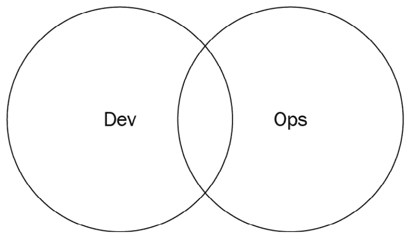

图 3.6 – 开发与运维协作（基于 devopstopologies.com 的工作图示 – 依据 CC BY-SA 许可）

### 完全共享的运维职责

一些拥有单一基于网络的产品的组织，如 Netflix 或 Facebook，可能能够采用前面提到的开发与运维协作模型，并更加全面地集成运维。在这种模型中，开发与运维之间几乎没有隔阂。因此，每个人都专注于使命。

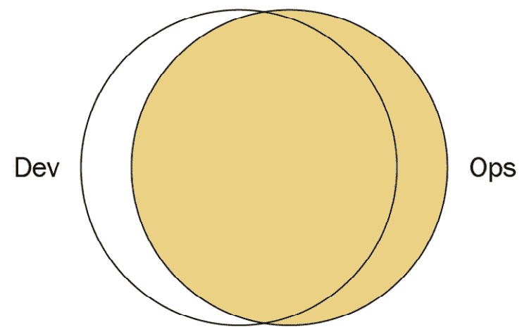

图 3.7 – 完全共享的运维职责（基于 devopstopologies.com 的工作图示 – 依据 CC BY-SA 许可）

### 运维作为基础设施即服务

可能有一些组织仍然保留传统的运维部门。此外，一些组织可能会将应用部署到公共云环境中，例如 AWS 或 Azure。在这两种情况下，开发部门中的一小部分人员可能会将运维视为*服务*，并为这些资源的部署、指标、配置和监控设置工具。在这种模式下，没有与运维的直接协作。

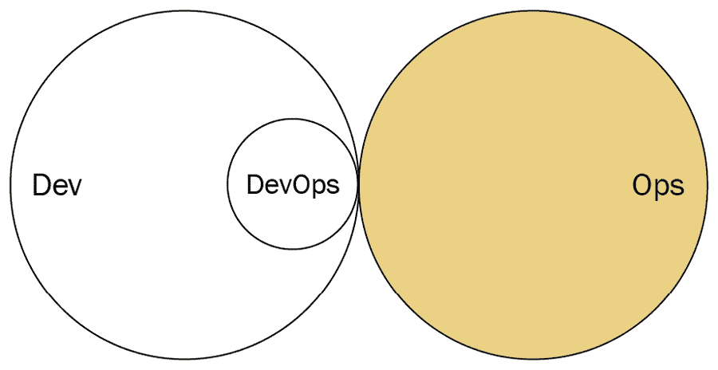

图 3.8 – 运维作为基础设施即服务（图表基于 devopstopologies.com 的工作 – 采用 CC BY-SA 许可）

### DevOps 作为外部服务

一些较小的团队和组织可能没有足够的人员或经验来推进 DevOps 方法。在这种情况下，他们可能会外包给外部供应商来创建测试环境、自动化和配置监控。DevOps 供应商也可能会培训开发和运维团队，以便转向不同的模型，例如开发和运维协作。

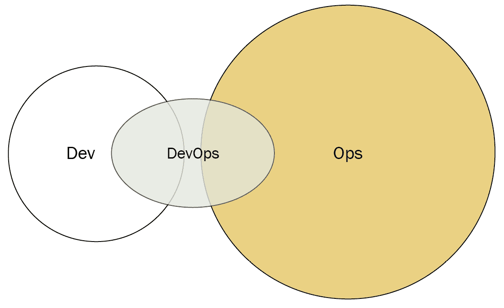

图 3.9 – DevOps 作为外部服务（图表基于 devopstopologies.com 的工作 – 采用 CC BY-SA 许可）

### DevOps 团队（有使用期限）

可能存在某些情况下，拥有一个专门的 DevOps 团队是有效的。其思想是，DevOps 团队可以充当开发和运维团队之间的*桥梁*。DevOps 团队可以指导开发人员如何与基础设施合作，也可以指导运维人员如何进行敏捷开发。在某些时刻，DevOps 团队将解散，允许开发和运维在 Dev 和 Ops 协作模型中进行合作。

当 DevOps 团队没有解散，而是形成了一个独立的“孤岛”时，就存在危险。这实际上是 DevOps 拓扑网站中提到的反面类型之一（DevOps 团队孤岛）。

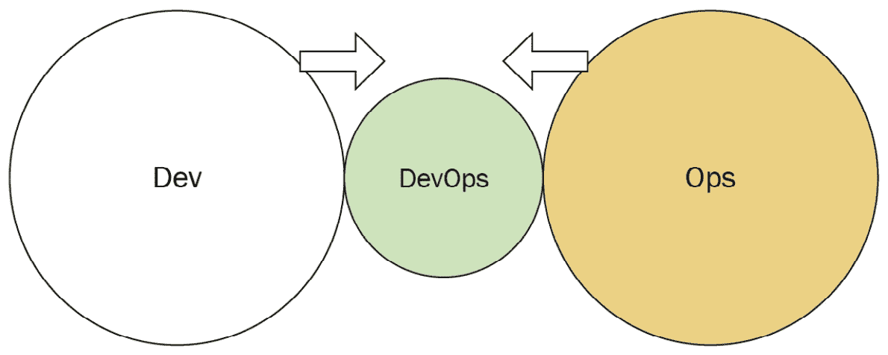

图 3.10 – 有使用期限的 DevOps 团队（图表基于 devopstopologies.com 的工作 – 采用 CC BY-SA 许可）

### DevOps 倡导团队

如果开发（Dev）和运维（Ops）两个部门逐渐脱节，DevOps 倡导团队会充当两者之间的协调者。与有使用期限的 DevOps 团队不同，这个 DevOps 团队是持续存在的，确保开发和运维都遵循当前的 DevOps 实践。

与有使用期限的 DevOps 团队一样，DevOps 倡导团队也有转变为 DevOps 团队孤岛的风险。

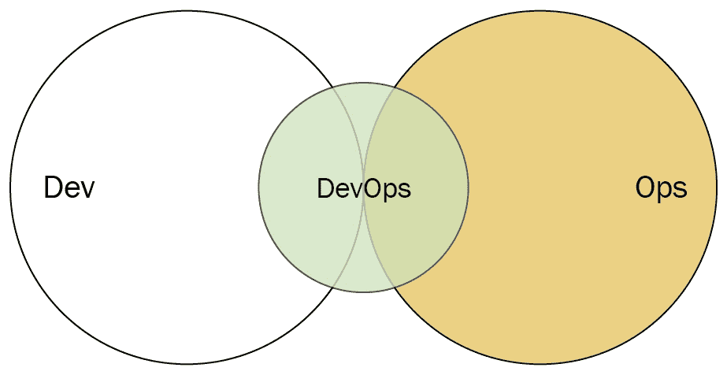

图 3.11 – DevOps 倡导团队（图表基于 devopstopologies.com 的工作 – 采用 CC BY-SA 许可）

### SRE 团队

早在 2004 年，Google 就已经将其软件工程师作为运维人员使用。这些**站点可靠性工程师**（**SREs**）负责生产环境的支持，主要通过开发软件来保持资源和服务的运行。SREs 接受开发提供的应用，但前提是开发提供了足够的日志和度量数据，证明它符合质量标准。如果代码不符合标准，SREs 可以拒绝部署。

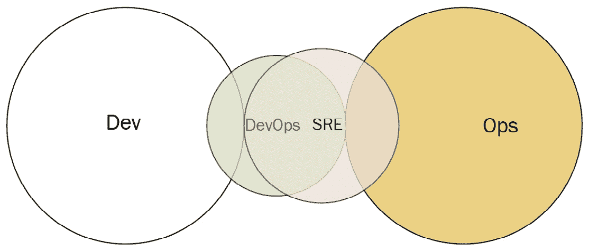

图 3.12 – SRE 团队（基于 devopstopologies.com 网站的工作图示 – 按照 CC BY-SA 许可）

### 容器驱动的协作

由于容器抽象了许多基础设施细节，因此大部分开发与运维之间的协作是无需的。在这种情况下，如果有良好的工程文化，运维大多数时候可以接受基于容器的部署。如果没有得到密切监控，就有可能转变为一种反模式，期望运维毫无疑问地部署来自开发的任何内容。

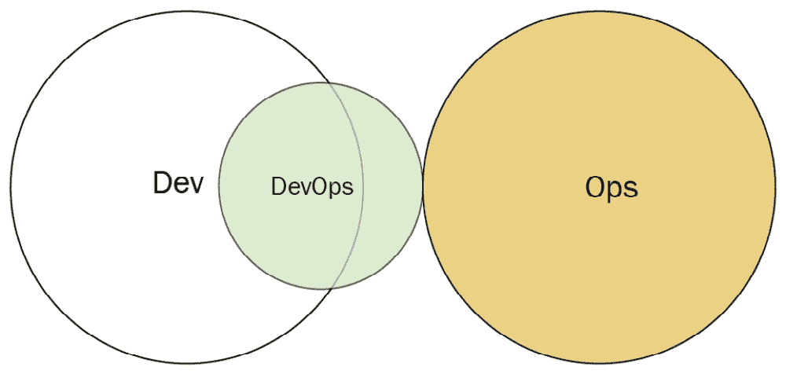

图 3.13 – 容器驱动的协作（基于 devopstopologies.com 网站的工作图示 – 按照 CC BY-SA 许可）

### 开发与 DBA 的协作

如果一个组织开发的应用程序依赖于一个或多个中央数据库，那么开发人员与**数据库管理员**（**DBA**）之间的协作可能至关重要。为了实现这种协作，开发中的数据库开发人员与运维中的 DBA 密切合作。

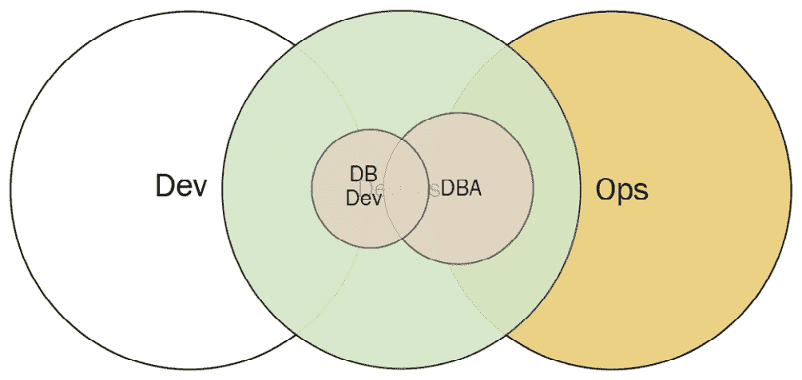

图 3.14 – 开发与 DBA 的协作（基于 devopstopologies.com 网站的工作图示 – 按照 CC BY-SA 许可）

现在我们已经看到组织负责 CI/CD 流水线的团队的可能配置，让我们更详细地看看 ART 中的这个团队：系统团队。

# 系统团队

系统团队是 ART 中的一个团队，负责持续交付流水线的工具和自动化工作。他们与 ART 中的其他团队合作，帮助交付有价值的解决方案。

系统团队可能会遵循几种 DevOps 拓扑之一。系统团队可以作为一个有到期日期的 DevOps 团队来设立。他们将建立持续交付流水线，并在解散之前指导开发和运维人员如何使用它。系统团队的另一种模型可能是作为一个 DevOps 倡导团队来设立。

作为自动化和开发过程的管理者，他们对 ART 中的其他团队负有深厚的责任。这些责任如下所述。

### 解决方案开发的基础设施建设

系统团队通常负责设置 CI/CD 流水线的预构建、持续集成和持续部署部分，并将技术整合，使其成为持续交付流水线的无缝一部分。他们努力尽可能应用自动化。这也可能涉及与其他团队的紧密合作，因此他们可能会参加其他团队的活动。

### 解决方案集成的先锋

作为维护 CI 阶段的一部分，系统团队可能会参与在代码更改提交到版本控制后，确定构建过程。他们会维护正确的构建脚本和 CI 配置文件。如果尚未实现构建自动化，他们可能是执行构建和集成活动的团队。

### 设置端到端测试

为了支持其他团队，系统团队可能会协助测试人员创建和优化自动化测试。他们还可能与其他团队合作，将不同的测试整合成定义明确的测试套件，用于不同类型的测试，如冒烟测试。

### 协助演示

ART 集成所有团队的工作，并在某一时刻演示解决方案的工作状态。这种集成和演示称为 *系统演示*，并以固定的节奏进行。

作为持续交付流水线的维护者，系统团队确保所有团队的技术环境正常工作，以便系统演示能够顺利进行。

### 促进发布

因为系统团队对整个过程有全面的了解，所以可能会被要求验证部署到生产环境和最终发布的有效性。

系统团队可以被视为 ART 的 *DevOps* 团队。它可能会遵循 DevOps 拓扑中的一种模式，以便与其他敏捷团队进行协作。它的主要职责是配置自动化，但它也可能以其他方式协助敏捷团队，整个 ART 一起努力交付价值。

# 总结

自动化在 DevOps 中起着关键作用。我们查看了构成 DevOps 工具链的重要工具，尤其是那些从构建、测试到部署进行编排的部分，这些部分构成了 CI/CD 流水线或 *流水线*。

CI 通常包括在代码更改提交到版本控制后发生的活动。这可能包括初步测试，并在通过后，它们可能会一起构建并打包成一个基于语言和技术的产物。

CD 从 CI 结束的地方继续，利用构建产物将其应用到测试或生产环境中。在这里，环境将重新配置，可能会引入新的资源。还会进行额外的测试，以确保安全性、正确性和预期价值的验证。

DevOps 拓扑描述了开发和运维团队之间可能的协作模型，并可能包括专门从事 DevOps 的人员。一些拓扑不是长期存在的，以免它们变成 *反类型*，从而扼杀协作。

在 SAFe 中，系统团队充当 ART 上的 DevOps 团队。该团队负责为 ART 上的其他团队构建和维护持续交付流水线。

自动化确实使 ART 或任何 DevOps 团队能够更快地交付，但如果开发过程未优化以实现精益流程，则无济于事。在下一章中，我们将探讨来自精益思维运动的实践，以促进流程。

# 问题

通过回答这些问题来测试您对本章概念的理解。

1.  什么测试是静态分析的示例（选择两个）？

    1.  单元测试

    1.  Linting

    1.  DAST

    1.  依赖扫描

    1.  验收测试

1.  什么允许代码更改在生产环境中隐藏，直到*启用*？

    1.  版本控制

    1.  持续集成

    1.  特性标志

    1.  持续部署

1.  监控包括性能监控、警报等活动，以及什么？

    1.  负载测试

    1.  版本控制

    1.  日志收集

    1.  单元测试

# 进一步阅读

+   DevOps 拓扑结构的原始公式，包括三种反类型和五种类型：[`blog.matthewskelton.net/2013/10/22/what-team-structure-is-right-for-devops-to-flourish/`](https://blog.matthewskelton.net/2013/10/22/what-team-structure-is-right-for-devops-to-flourish/)

）

+   DevOps 拓扑结构的更新公式：[`web.devopstopologies.com`](https://web.devopstopologies.com)

）

+   *团队拓扑：为快速流程组织商业和技术团队*，作者马修·斯克尔顿和曼努埃尔·佩斯 – DevOps 拓扑结构的演变，探索各种团队的拓扑结构。
