# 利用精益流程保持工作的推进

在 *第一章*，*介绍 SAFe® 和 DevOps* 中，我们看到将精益思维方法（如精益软件开发和看板）纳入敏捷运动。Jez Humble 认为这非常重要，足以将其纳入 CAMS 模型，并从中创建了 CALMS 模型，基于此我们得到了 SAFe® CALMR 模型。Scaled Agile 讨论了这种精益敏捷心态，强调精益思维和源自《敏捷宣言》的敏捷心态。精益思维如何在 DevOps 和 SAFe 中体现出来呢？

在本章中，我们将看到，保持产品开发以可预测的速度进行需要建立精益流程。适当的流程使自动化能够成功。为此，我们将探讨以下实践来建立精益流程：

+   确保所有工作和工作进展都是可视化的

+   限制我们的 **进行中的工作/过程** (**WIP**)

+   保持每个工作批次的适当小规模

+   监控我们的工作队列

+   运用系统思维改变传统的项目和团队定义

# 使工作可视化

工作可以被定义为团队或 **敏捷发布列车** (**ART**)（作为团队的团队）可能为开发产品或解决方案所付出的努力。但并非所有这些工作都专注于客户价值。

Gene Kim、Kevin Behr 和 George Spafford 合著的《凤凰项目：关于 IT、DevOps 以及如何帮助你的业务成功》识别了四种工作类型，概括如下：

+   **业务项目**：旨在为客户带来价值的新特性请求

+   **内部项目**：有助于组织持续高效开发产品的工作

+   **维护**：维护现有产品所需的工作

+   **未计划工作**：偶尔发生的错误、缺陷和紧急情况

SAFe 将这些工作类别中的一些放入 **使能器**。这里的想法是使能器帮助创造未来的业务价值。SAFe 定义的四种使能器如下：

+   **基础设施**：这个使能器旨在增强产品开发和交付的方式。示例包括需要纳入 **持续交付** (**CD**) 流水线的新自动化测试。

+   **架构**：这个使能器旨在增强业务功能和用户故事所依赖的架构。SAFe 定义了架构使能器的顺序，作为推动未来业务价值的架构跑道。示例包括为预发布和生产环境创建新的数据库服务器 **虚拟机** (**VM**)。

+   **合规性**：这个使能器描述了在某些受监管行业中可能需要的额外工作。示例包括 **验证和确认** (**V&V**)、审批和文档。

+   **探索**：有时，为了理解最佳方法、学习新技术或完善客户需求，需要额外的研究。探索启用器被创建来识别研究所需的工作。一个例子是敏捷团队用来研究新技术或评估开发选项的 Spike，例如确定适合网络流媒体的技术。

考虑到不同的工作类别，展示团队或 ART 的所有工作有一个统一的方式是非常重要的。传统上，具有技术背景的企业家常常依赖电子表格，因为它们的排列灵活，可以允许添加诸如工作类别或状态等信息。此外，在团队成员之间共享电子表格变得困难，因为可能需要同步的更改。

多米尼卡·德·格兰迪斯（Dominica DeGrandis）在她的书《让工作可视化：揭示时间盗窃以优化工作和流程》中指出，大多数人是视觉-空间学习者，也就是说他们能够理解并响应以视觉方式呈现的信息。这是设立看板的原因之一。

看板是一个分为多个列的空间。每一列代表工作项在工作流中的一个状态。工作项通过便签卡表示，并用颜色编码来代表适当的工作类别。

*图 4.1* 展示了一个简单的看板。请注意三个列，分别代表待办工作（**Backlog**）、进行中工作（**Doing**）和已完成工作（**Done**）：

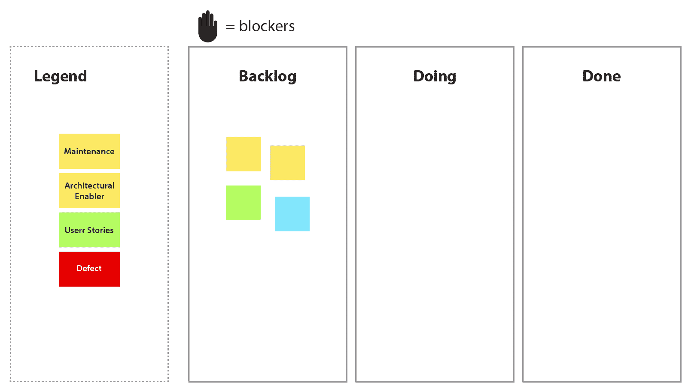

图 4.1 – 简单看板

看板上的额外功能可以帮助团队管理他们的工作。让我们来看看看板上的其他功能。

## 通过额外列指定工作流

通常，单一的*进行中*列无法提供团队或 ART 正在做的所有工作的可视化，尤其是当整体流程中存在瓶颈时。将*进行中*列拆分成多个步骤来突出开发过程中的主要环节，这样瓶颈就容易被识别。

虽然通常会将离散的过程步骤分隔到不同的进行中列中，但需要记住，团队不应将所有问题都从一列移动到另一列，否则就会让流程退化为瀑布模型。问题的移动应该是持续进行的。

*图 4.2* 展示了将我们的**进行中**列划分为分析、实施和审查阶段的示意图：

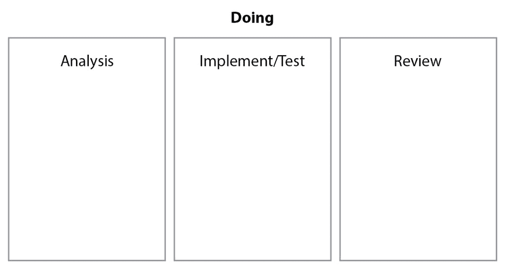

图 4.2 – 将进行中列扩展为多个阶段

## 标记阻碍因素和紧急问题

有时候，工作问题可能因为某些外部事件或依赖关系被阻塞。当这些阻碍或阻塞发生时，可以在工作问题上附加一个图标，作为提醒，告诉团队在解决阻塞之前需要继续关注该问题。

同样，任何紧急问题可能需要整个团队的注意。团队可能需要集中力量解决紧急问题，直到其得到解决。紧急问题可以通过特殊指示器标记，或通过它在*加速*泳道中的位置来识别，该泳道横跨看板的所有列。在下面的截图中，展示了一个在加速通道中通过特殊指示器标记的紧急问题：

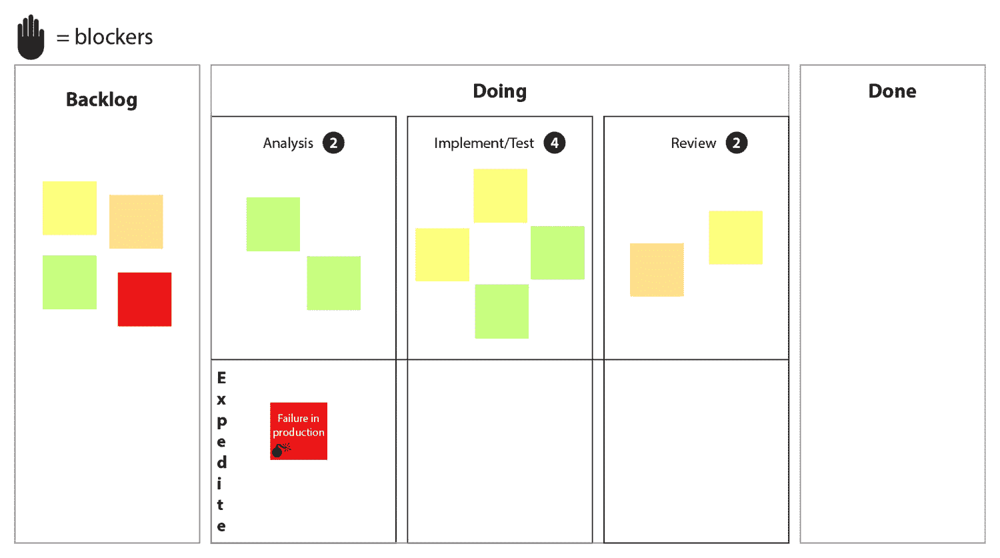

图 4.3 – 在加速通道中具有紧急指示器的工作问题

## 指定退出标准的政策

在流程的每个阶段，团队需要对退出标准达成明确一致的协议。明确的退出标准可以避免混淆，确保在该阶段问题是否真正完成。这种每个列的协议被称为政策。

列政策应当在团队章程或工作协议中明确列出，以确保这些政策是明确的并且已经达成一致。例如，**就绪定义**（**DoR**）是指所有问题都已解答，且需求足够详细，开发可以开始。另一个例子是**完成定义**（**DoD**），即团队达成的协议，明确何时一个故事算完成，开发工作可以停止。这些政策避免了工作是否真正完成与*完成完成*之间的混淆。

我们将在接下来的部分中讨论更多看板的补充内容，确保精益流动的发生。在接下来的部分中，我们将探讨 WIP 过多的问题以及看板如何通过提供可视化和执行团队行为的约束来帮助解决这一问题。

# 限制在制品（WIP）

WIP 是指团队或 ART 正在进行中的工作。它已经开始，但尚未完成。如果我们在看板上查看 WIP，它看起来像下面的截图：

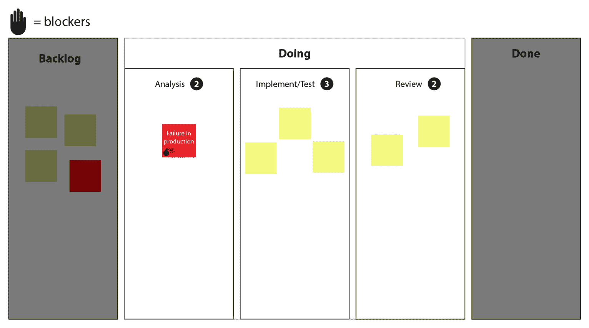

图 4.4 – 强调 WIP 的看板

重要的是确保这些列中的工作得到监控，以防止其压垮团队或 ART。根据 Dominica DeGrandis 的说法，过多的 WIP 可能带来以下影响：

+   太多的多任务处理，会导致团队花费过多时间进行上下文切换，无法完成工作

+   在现有工作完成之前，新的工作项就开始了

+   工作完成时间过长（长交付周期/周期时间）

确保团队不让 WIP 失控的一个关键方法是，在每个列之间设置 WIP 限制或约束，从**待办事项**列（工作尚未接受）到**完成**列（已完成的工作）。以下截图展示了一个 Kanban 看板上 WIP 限制的示例：

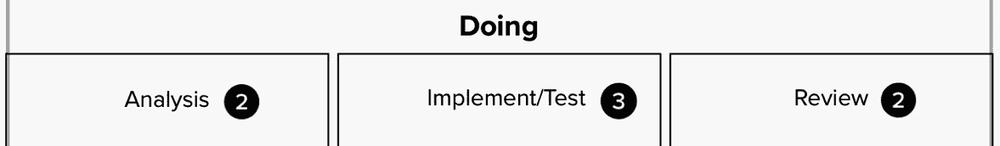

图 4.5 – 列上的 WIP 限制

为了理解 WIP 限制如何帮助团队实现精益流动，考虑以下团队行为的比较。

首先，想象一下没有 WIP 限制的 Kanban 看板。团队中的一名开发人员刚刚完成了一个用户故事的开发。它符合该列的政策标准，可以被拉到下一个列。如果开发人员将该故事移到下一个列，并拉取一个新的故事来工作，那么这个开发人员做了什么来减少正在进行的工作量吗？如果已经有流动存在，这可能是可以接受的，但如果团队的过程中存在瓶颈，这个行为可能会加剧瓶颈，阻碍整个团队的交付。这种情况在我们的 Kanban 看板上可以看到，截图如下：

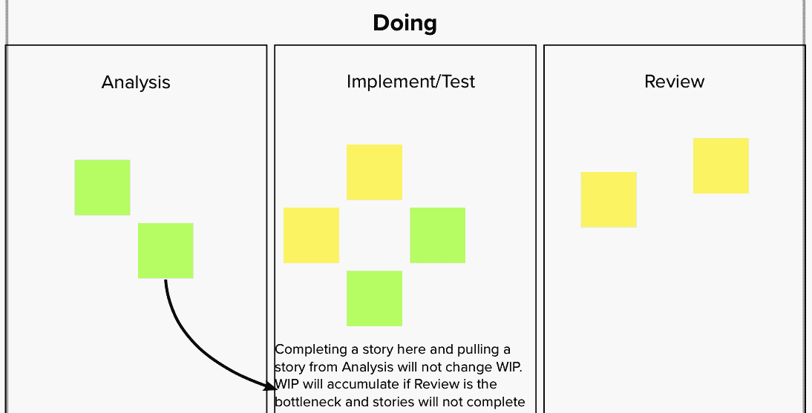

图 4.6 – 没有 WIP 限制的场景，导致 WIP 没有减少

现在，让我们想象在 Kanban 看板上设置了 WIP 限制。那个已经完成用户故事的开发人员无法将任何内容移入**实施/测试**列。此外，任何人都不能将任何内容从**实施/测试**列移入**审查**列。为了帮助解决瓶颈问题，开发人员采取行动，协助其他团队成员将一个故事从**审查**列移至**完成**列。这一做法引入了吞吐量并建立了流动。我们可以在以下截图中看到这一场景：

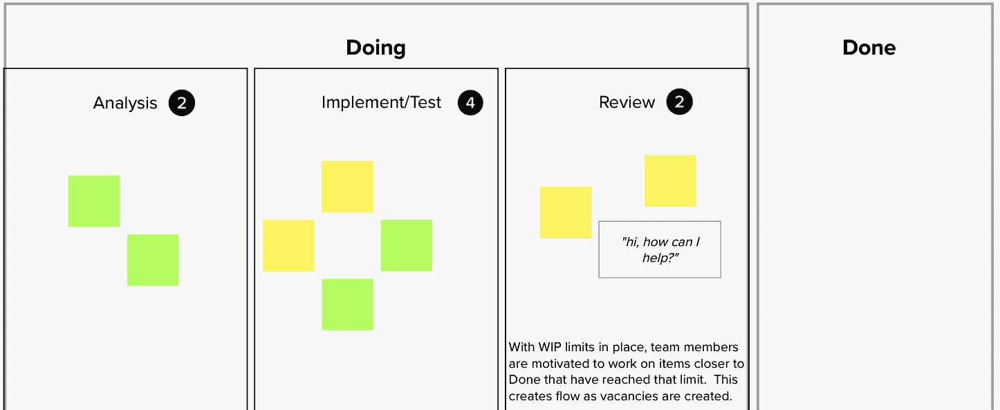

图 4.7 – 具有 WIP 限制的场景，导致流动

团队可以在开始工作时选择初始的 WIP 限制。经过一段时间后，如果仍然看到瓶颈，他们可以降低 WIP 限制，直到瓶颈消失，这时流动得以实现。即使瓶颈消失，其他瓶颈仍会出现。由 Eliyahu M. Goldratt 在他的书《目标》中提出的约束理论指出，应该逐步解决随后的瓶颈，一次移除一个瓶颈，以优化整个过程的流动。

根据 David J. Anderson 在他的书《Kanban: Successful Evolutionary Change for Your Technology Business》中的描述，WIP 限制是必要的机制。WIP 限制为团队创造了紧张感，鼓励团队采取行动以推进工作并促使流动，就像我们之前的场景中所看到的那样。这种紧张感还可能凸显出组织中的约束和系统性障碍。公开讨论这些约束和障碍，寻找解决方案，从而推动持续改进。

我们已经看到，通过施加列约束或工作项限制来限制 WIP（在制品）可能帮助我们解决开发过程中的瓶颈。我们过程中的另一个瓶颈来源是工作项的大小。让我们看看如何保持工作项的适当大小，以实现和维持流动。

# 保持小批量

批量大小通常指的是标准工作单元的大小。敏捷运动的一个成就就是成功地将交付集中在较小的增量上。这迫使我们重新审视可以交付的批量大小。减少批量大小以及限制 WIP 是实现精益流动的重要组成部分。唐纳德·莱因特森在他的书《产品开发流原则：第二代精益产品开发》中指出了批量大小的影响。让我们来探讨一下小批量在其中的作用。

## 小批量减少周期时间

敏捷开发的一个关键收获是以短周期交付价值。这一做法缩短了团队交付增量价值的周期时间，使得团队可以在周期结束前仅交付他们能够完成的工作。这使得我们可以说批量大小与周期时间直接相关。

保持大批量工作会产生几个不利影响。工作可能无法在周期结束时交付。交付的工作可能存在缺陷，需要修复或返工，从而增加周期时间。这些缺陷的出现也增加了批量大小，形成了*滚雪球效应*。批量大小和周期时间的增长会导致成本超支和进度延误。

## 小批量减少风险

正如我们在前一个小节中看到的，大批量工作可能带有需要修复的缺陷，这会影响整体批量大小和周期时间。尽管在小批量中工作无法消除缺陷的可能性，但它将保持可能缺陷的数量较小，从而便于管理。

小批量的一个副作用是它们导致较短的周期时间。较短的周期时间为客户反馈提供了机会。反馈的机会消除了团队在交付价值时可能走错方向的任何风险。

## 小批量限制 WIP

批量大小和 WIP 是直接相关的。直接改变其中之一会以相关的方式改变另一个。让我们看几个这个相关性在实际中的例子。

大批量意味着有大量的 WIP 项。如前所述，大量的 WIP 会增加多任务处理，因上下文切换增加而阻碍工作的完成。这种效应是另一个增加周期时间的因素。

大批量也会在系统中创建瓶颈。这种流动的不稳定性妨碍了工作有效推进，从而增加了周期时间。

Reinertsen 在他的书《产品开发流程的原则：第二代精益产品开发》中也提到，当在批量大小与通过解决瓶颈来限制在制品（WIP）之间进行优化时，应首先从减少批量大小开始。这通常是一个更容易实施的步骤。减少瓶颈以允许适当的流动可能涉及到更深层次的流程和技术变革。

## 小批量大小提高了性能

尽管看起来违背直觉，但大批量并不会在管理费用上创造效率。与小批量相比，大批量的时间处理管理活动实际上更大。大批量的管理费用会积累。而小批量的管理费用可以由于较短的周期时间而轻松减少。

小批量大小提高了效率。这看起来可能有些违反直觉，但由于小批量可以迅速获得反馈，随后的工作批次能够利用这些反馈，从而减少返工。而大批量的工作一次性暴露所有问题，导致更多的工作量，并且失去了隐含的效率。

我们已经看到使用小批量的优势以及使用大批量时发生的情况。那么接下来的问题是，“我如何确保自己不在使用大批量？”让我们来看看如何找到最优的批量大小。

## 寻找理想的批量大小

我们已经识别出使用小批量大小的好处。那么接下来的问题是，“什么样的批量大小足够合适？”

Reinertsen 提出了从经济学的角度来看待批量大小。当评估开发成本并确定理想的工作大小时，你需要考虑两个成本：

+   **持有成本**：保持（而非发布）已开发内容的成本

+   **事务成本**：开发工作的成本

这方面的一个例子来自于将工作发布到生产环境中的过程。下图展示了如果我们考虑发布更改的成本与在最佳时机收集更改的成本时，事务成本和持有成本曲线之间的关系：

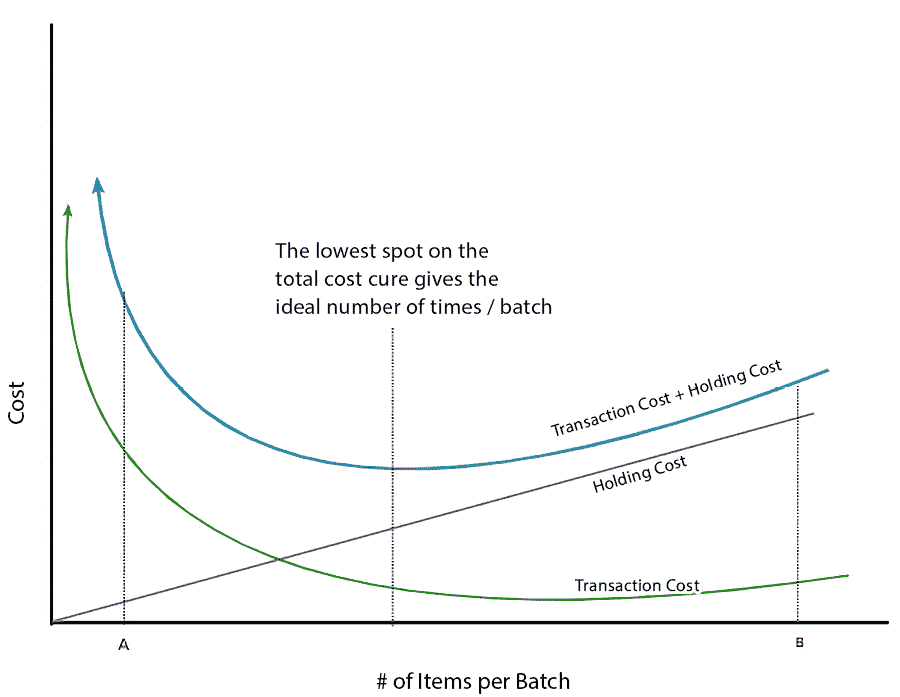

图 4.8 – 事务成本与持有成本曲线

在我们之前的图示中，一个小变更的例子——例如发布一行软件代码——被表示为**A**点。在**A**点，我们可以承担非常低的持有成本来立即发布，但在**A**点的高成本来自于事务成本。我们花费了大量时间在一行简单的代码上进行测试和部署。

这是否意味着我们应该始终考虑合并更改以减少成本？让我们看一下前面图示中的**B**点，这个点收集了我们在更长时间周期内的更改——例如，一个月。现在，成本发生了变化。由于我们在执行测试并发布大量更改时，交易成本较低，但现在我们的持有成本很高。也许在延迟发布更改时，我们错过了一个重要的市场窗口，因而失去了销售机会，因为我们的竞争对手先发布了类似的更改。

如果我们想找出实际发布一组更改的*盈亏平衡*点，我们将进行*U 型曲线优化*。我们会将持有成本和交易成本的总和绘制在同一图表上，如前面的图示所示。在总成本曲线（持有成本和交易成本之和）的图表上，找到曲线的最低点。这就是批量中理想的项目数量。

我们如何改进这个理想的批量数量？如果我们引入新的工作方式或新技术，这可能会影响交易成本，给我们带来新的总成本曲线，并进行 U 型曲线优化。以发布更改到生产环境为例，使用自动化测试和部署工具可以实现更快、更可靠的部署，并在 CD 流水线中进行更频繁的测试，从而降低交易成本，并增强我们在一个迭代内更频繁发布故事的信心。新的成本曲线可能会类似于以下图示：

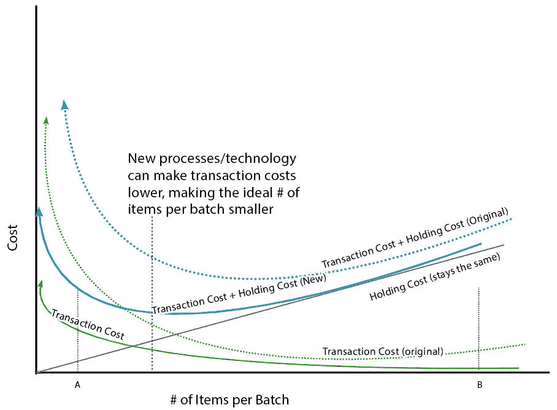

图 4.9 – 优化后的新成本曲线

我们可以从前面的图示中看到，在**A**点，持有成本保持不变，但交易成本已降低。同时，我们可以看到，总成本曲线的最低点已向左移动，理想点也向“小”批量规模移动。

那么，我们的团队和 ARTs 能做些什么，以便实现更低的交易成本曲线呢？采用自动化测试和自动化部署等实践和技术就是一个符合条件的例子。这些技术允许更小的批量通过，并鼓励流动。

在本节和上一节中，我们探讨了 WIP 和批量大小作为实现精益流动的因素。在下一节中，我们将看到这些因素如何与其他因素共同作用，决定你的系统是否具备精益流动。

# 监控队列

为了实现精益流动，你需要仔细研究排队理论，这是一门数学领域，研究排队和排队等待的行为（想象一下星巴克或你当地超市的结账区域！）。一些数学公式将有助于我们确保理解如何确保精益流动。它们包括：

+   利特尔定律

+   金曼公式

让我们看看如何利用这些排队理论的元素来实现精益流动。

## 我们的队列在哪里？

产品开发队列与产品制造队列之间的一个主要区别在于，产品开发（尤其是软件开发）的工件是非物理的，直到完成时很难察觉进度，而在制造过程中，你可以在车间里直观地判断产品的完成度。这种*不可见性因素*使得人们容易忽视这些队列，往往会自食其果。

长队列如果不受 WIP 限制或小批次大小的约束，会产生一系列问题，如 Reinertsen 所总结的。这些问题包括：

+   更长的周期时间

+   更大的风险

+   更多的开销

+   更多的变动

+   更低的质量

+   更低的积极性

我们在讨论大批量问题时，曾提到过与开销、风险和质量相关的问题。如果我们把工作的大小视为系统的队列，那么我们接下来将讨论的数学公式是适用的，并能够模拟我们精益流程的状态。

长队列如何降低工作场所的积极性？假设你正在准备工作，且下一步的流程每当你完成当前任务后就会立即准备好。这样你会有一种紧迫感，想要尽快完成自己的任务。但如果你交付完工作后，它排在其他任务后面，需要等待几周才能被处理，这种紧迫感就不存在了。

现在我们已经确定了批次大小和 WIP 作为队列，是时候看看数学公式如何展示队列、周期时间和变动之间的关系。

## 小法则与周期时间

我们已经看到 WIP 和批次大小如何与周期时间相关，周期时间是指我们接受工作后交付完成的时间。数学上，周期时间、WIP 和批次大小通过小法则相互关联。

小法则是一个将周期时间、WIP 或批次大小与吞吐量联系起来的表达式。小法则的公式如下：

*L* 代表队列的长度。这可以理解为在制品（WIP）或批次大小。*L* 是团队或 ART 处理的工作吞吐量。*W* 给出了周期时间或客户的等待时间。

此时，如果我们关心的是如何计算周期时间，那就是简单的数学问题。以以下方式书写，你可以看到周期时间（*W*）与队列大小（*L*）是直接相关的：

这是一个简单的例子，假设 Scrum 团队的积压工作。如果他们的积压工作中有 9 个用户故事，每个故事估计为 5 个故事点，而他们的速度（衡量每个迭代周期交付的故事点数量）是每个迭代 15 个故事点，我们可以用小法则来预测完成这些积压故事所需的迭代次数，具体如下图所示：

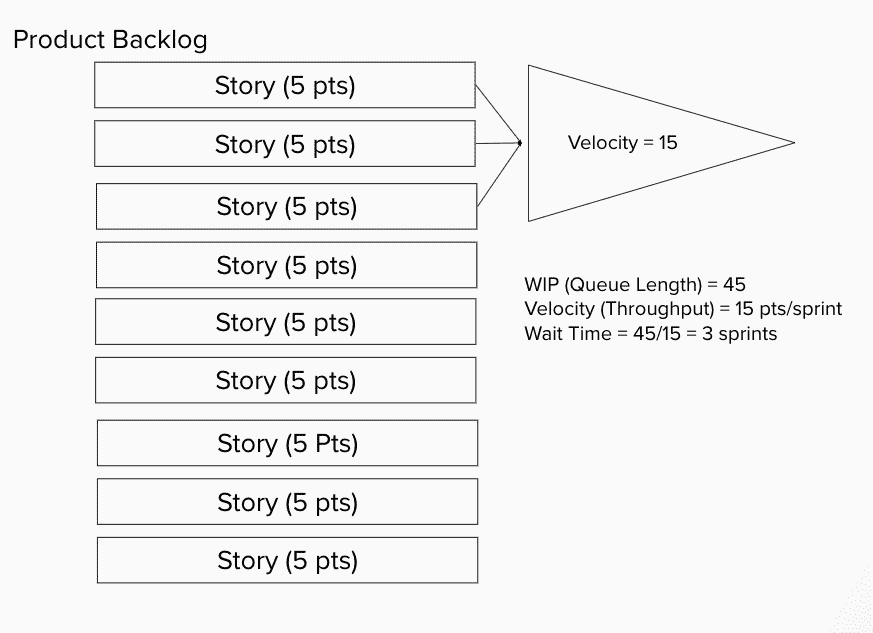

图 4.10 – 小法则的示意图

## 金曼公式

金曼公式是一个数学模型，用于描述等待时间如何与周期时间、可变性和利用率相关联。公式如下所示：

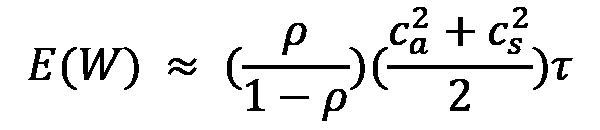

公式中的每一项代表一个独立的量。第一项 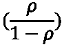 代表执行工作的人员的利用率。第二项 (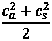) 代表系统的可变性。第三项 (*t*) 代表服务时间或周期时间。

我们希望研究等待时间、利用率、可变性和周期时间之间的关系。如果我们为每个术语代入一个字母，我们将得到以下（更简单的）公式，通常称为*VUT 公式*：

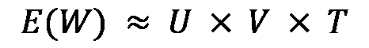

所以，这个公式向我们展示了客户的总等待时间与利用率、可变性和周期时间是直接成正比的。

我们之前讨论过队列大小、批量大小和限制在制品（WIP）如何影响周期时间。现在让我们看看金曼公式的其他变量，了解利用率和可变性如何影响等待时间。

### 利用率及其影响

我们从利用率开始。当我们提到利用率时，我们是指系统整体容量的百分比。管理层可能希望达到较高的利用率——毕竟，我们不希望工人浪费时间。但是通过金曼公式，我们看到随着利用率的增加，等待时间也会增加。我们可以通过绘制利用率与队列大小的关系图来看到这一效果。结果曲线是一条非线性图形，利用率在 60%左右时开始上升，在 100%时趋近于无穷大。以下是该图示：

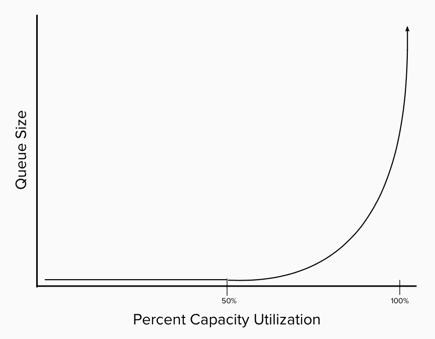

图 4.11 – 利用率与队列大小的比较

另一种观察这一百分比利用率的方式是将其视为负载/容量。如果负载关注的是新工作进入的速率，那么容量则关注的是工作流出并交付给客户的速率。这确保了适当的利用率，以避免我们接收超过处理能力的工作。

为了实现精益流动，必须引入调度松弛或空闲时间，以保持利用率在合理水平（例如，不能达到 100%）。这一思想源于丰田生产系统。*Muri* 或过度负担被视为精益中需要消除的三大*浪费*之一。接下来我们将讨论另一种浪费：*Mura*，即不均衡。我们也将其称为可变性。

### 可变性、其影响与行动

让我们来解释一下什么是变异性。到目前为止，我们一直假设，像在工厂车间制造产品一样，所有工作都涉及相同的努力。但事实上，情况往往并非如此。每一项工作可能涉及不同程度的努力，甚至是不同的努力。有些工作可能包含未知因素，需要更详细的调查。有些工作可能存在缺陷。变异性是描述每一项工作的*个性*的特性。

根据金曼公式（Kingman’s Formula），我们可以看到变异性的影响会对等待时间产生复合效应。下图中曲线显示了高变异性与低变异性对利用率的影响：

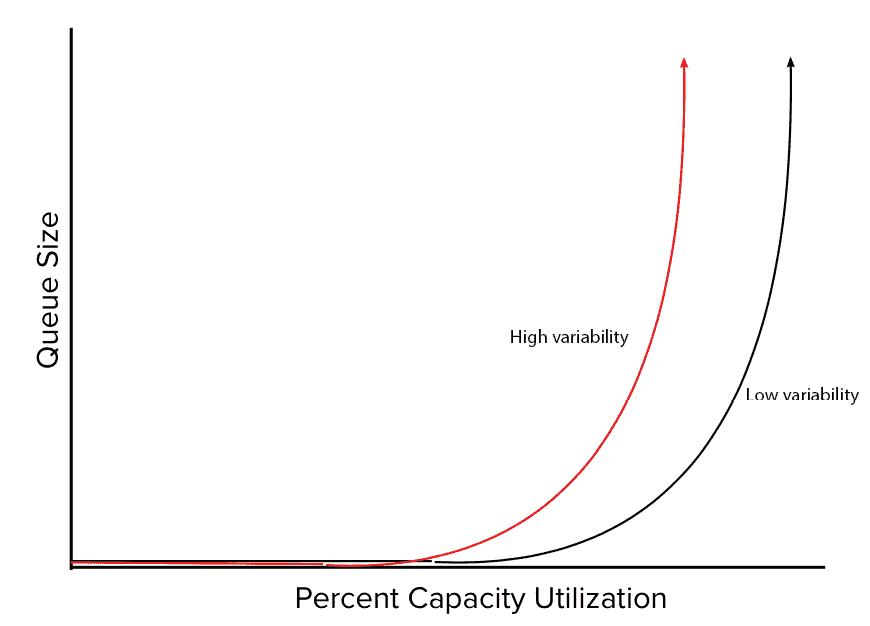

图 4.12 – 变异性对利用率和队列大小的影响

从前面的图中我们可以看到，这种影响是线性的，但组合起来会产生不希望的结果。对于高变异性，稍微降低利用率并不会遏制队列的增长。为了保持队列的控制，你必须以更低的利用率进行工作。那么该怎么办呢？

重要的是要理解，并非所有的变异性都是不好的。有些变异性可能是学习新事物所必需的。因此，关键是管理变异性，使其不会影响队列大小，从而影响等待时间。管理变异性的方法包括以下几点：

+   限制 WIP

+   使用较小批量进行工作

+   在系统中设置缓冲区

+   建立标准化流程

我们之前已经讨论过限制 WIP 和使用较小批量工作的方法，因此接下来让我们探讨一些管理变异性的其他方式。

#### 设置过程缓冲区

精益生产通过建立缓冲区来限制变异性。这些缓冲区用于限制以下因素：

+   库存

+   产能

+   时间

在产品开发中，WIP 限制和小批量工作分别充当了库存和产能缓冲区。为了设置时间缓冲区，可以在看板中那些存在变异性的 WIP 列上建立缓冲区状态。我们看板上的一个示例如以下截图所示：

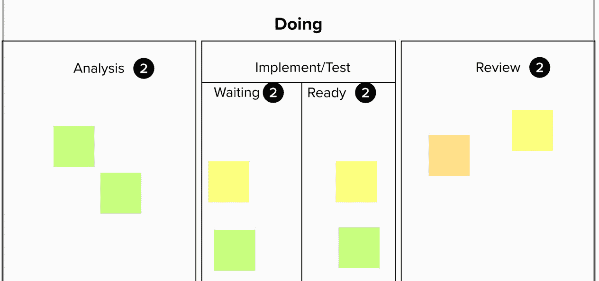

图 4.13 – 看板中实施/测试列的缓冲区状态

请注意，在每个缓冲区状态下都会设立 WIP（在制品）限制，以确保保持产出。

#### 建立标准化流程

在上一节中，我们讨论了使用几种类型的缓冲区，以确保在多个阶段管理变异性。缓冲区管理的变异性通常是那种可以容忍，甚至由工作性质所鼓励的类型。

然而，由于开发过程中存在低效，可能会出现一定的变动。例如，鼓励某种类型的测试自动化——例如，代码的单元测试——而不是努力自动化**行为驱动开发**（**BDD**）测试以确保正确性。这样做的效果是保持较长的周期时间。

建立标准化流程可以确保减少周期时间中不必要的变动。标准化流程包括建立标准、检测任何可能的问题，并持续发现这些问题的根本原因。

我们已经看到了一些可以用来建模开发过程的实践，以确保工作按进度完成。这些实践需要有能够从头到尾审视整个过程的人来支撑。在下一节中，我们将更深入地探讨建立这种视角以及所需的系统性变革。

# 从基于项目的工作转向基于产品的工作

在采用价值流思维时，重要的是要改变开发的视角和思维方式，从基于项目的管理转变为基于产品的管理。

在《从项目到产品：如何在数字化颠覆时代通过流框架生存与发展》一书中，Mik Kersten 对比了德国莱比锡 BMW 工厂在组装 BMW 车型时，IT 与软件整合的成功，和诺基亚未能在智能手机行业继续主导地位的失败，后者是在 iPhone 和安卓手机推出之后发生的。他指出，尽管诺基亚成功采纳了敏捷实践，但它似乎没有促进整个产品开发过程的变化，也未能影响整个组织。他认为，在这个*软件时代*，基于价值流的产品导向开发能够创造和维护成功的产品。

Mik Kersten 强调了七个关键领域，其中项目管理和产品管理之间的差异十分明显。这些差异如下所示：

+   预算

+   时间框架

+   成功

+   风险

+   团队分配

+   优先级

+   可见性

现在让我们分别看看这些差异。

## 项目预算与价值流资金

在项目管理中，*铁三角*是一个广为人知的结构。在管理中，你需要查看三个因素或*方面*，看是否可以修正其中一个或多个因素，以完成一个项目或产品。这三个因素如下：

+   资源（人员、设备、设施等）

+   范围

+   时间

项目预算通常是一种赌注。项目能否在预计的时间框架（时间）内并且用预期的资源完成所有必要的任务（范围）？由于这个预算是批准所必需的，它通常是对三角形其他部分资源最大数量的猜测。有时这些猜测不足，导致成本超支，并可能导致另一个项目（及另一个预算）。

对价值流的资金支持更为简便。在预算期间，资源和时间保持恒定。在预算期结束时（通常是季度而非年度），开发结果和客户反馈将决定是否需要继续投入努力和能力，以满足交付功能的需求。如果需要，将为新的时间段创建一个增加分配的新预算。

## 确定的结束点与产品生命周期

项目的一个决定性特征是其生命周期。项目有一个开始，伴随大量活动组织团队并启动工作。接着进入开发阶段，直到项目结束：产品交付为止。此时，项目完成，项目和资金结束，开发产品的团队被解散。产品交给一个专门的维护团队，该团队可能未参与产品的开发，结果导致组织无法从中吸取全面的经验教训。

价值流从整个产品的*生命周期*进行时间线管理。从产品初始功能的开发和发布开始的相同团队和 ARTs，负责产品的维护和持续健康。维护的一部分包括识别并清除技术债务，确保产品的可行性。这一直持续到产品的生命周期结束。

## 成本中心与业务成果

基于项目的开发进度衡量往往与组成团队的成本中心的表现一致。这种脱节的进度视角集中于各个部门的表现，而非整体系统。

采用成本中心方式的另一个后果是，由于预算通常较大，项目利益相关者往往倾向于创建大型项目，而不是在交付后评估努力的价值。

价值流使用不同的成功指标。它们关注通过努力交付所产生的成果。通过允许增量交付并从客户反馈中学习，价值流可以调整以交付更好的业务成果。

## 前期风险识别与分散风险

在基于项目的开发中，交付风险尽早被识别，以便创建应急预案。但通常，仍有风险未被识别，因为在开发进行时，还有未知的风险需要发现。

在基于产品的开发中，随着学习的深入，风险会被逐步识别。增量交付允许在定期检查点进行调整。虽然这些调整可能会涉及一些开销，但这部分开销会分摊到产品生命周期中，随着时间的推移，它所占的比例变得非常小。

## 将人力调配到工作中与将工作调配到人力中

基于项目的开发从成本中心资源池中创建团队。这种通过创建团队来处理项目的方法假设资源池中的个体拥有相同的才能和技能。然而，这种假设从未成立。

这种人员重新分配的另一个后果是干扰了团队的福祉和生产力。1965 年，心理学家布鲁斯·塔克曼创建了**形成、风暴、规范、表现和告别**（**FSNPA**）团队创建模型，阐明了团队在成为高效团队过程中所经历的各个阶段。持续的重新分配和团队调整妨碍了团队达成高效表现的能力，团队未能作为一个整体协同工作。

基于产品的开发强调团队的长周期。这使得团队能够专注于获取产品知识，并作为一个整体一起成长。这提升了团队的交付能力和士气。

## 执行计划与学习

在基于项目的开发中，遵守项目计划是至关重要的。对计划的调整会导致成本超支，并因执行任何变更所需的额外开销而重新分配资源。

基于产品的开发通过设置逐步交付特性来欢迎变化，并为学习和假设验证创造了空间。在每次交付价值增量后，收集反馈和结果，并进行必要的调整。

## 不一致性与透明的商业目标

在基于项目的开发中，业务利益相关者与开发产品的 IT 部门之间往往存在脱节。这种脱节源于 IT 专注于产品，而业务方则专注于通过一系列步骤完成项目，且没有调整的余地。

在基于产品的开发中，业务和 IT 开发方面的目标是相同的：实现业务目标。这种目标的透明性促使了目标的一致性，并便于进度和反馈的共享。

# 总结

在本章中，我们研究了作为 CALMR 模型一部分的精益流。我们知道，达成一个精益流工作流程，其中工作进展稳定，团队既不被过度负担也不处于轻松状态，这有助于模型中其他部分的成功。为此，我们仔细分析了可以帮助团队实现精益流的精益实践。

我们研究的第一个实践是确保团队承诺的所有工作及其进展都是可见的。为了确保这种可见性，我们查看了团队可以做的工作类型。然后，我们将这些工作映射到看板上，突出了看板的功能，使我们能够看到任何一项工作进展的情况以及紧急工作的去向。我们了解了如何在看板上可视化工作进行中的状态，并通过设置工作进行中（WIP）限制来保持 WIP 在可控范围内。

从那里，我们开始查看工作或批量大小。我们努力理解确保批量大小尽可能小的重要性。我们查看了批量大小与周期时间、WIP 和性能之间的关系。牢记这一点，我们还研究了批量大小的经济学，以及如何通过 U 型曲线优化确定理想的批量大小。

然后我们通过仔细研究排队理论来看其他因素的作用。我们看到 Little’s Law 描述了周期时间与 WIP 或批量大小之间的关系。通过考察 Kingman 的公式，我们看到了其他因素及其与周期时间的关系。在接触其中一个因素——利用率时，我们看到高利用率会导致周期时间增加。我们还进一步了解了另一个因素——变异性，以及如何管理它。

最后，为了让价值流能够通过精益流传递工作，我们比较了基于项目的开发与基于产品的开发之间的差异。这些差异在更短的周期时间内创造了更强的团队和更强的产品。

为了确保工作在精益流中进展顺利，我们需要定期进行测量。我们还希望确保交付的工作不会对临时环境和生产环境产生不良影响。为此，我们将在下一章中检查测量，这是我们 CALMR 模型的下一个元素。

# 问题

通过回答这些问题来测试你对本章概念的理解。

1.  以下哪些是 SAFe 中的启用因素？（选择两个）

    1.  探索

    1.  测量

    1.  可视化

    1.  合规性

    1.  实际

1.  Kanban 板的哪个功能可以用来可视化紧急工作的情况？

    1.  WIP 限制

    1.  快速通道

    1.  列策略

    1.  扩展的工作流列

1.  过多的 WIP 会导致什么后果？

    1.  过多的多任务处理

    1.  减少的周期时间

    1.  新的工作在旧的工作完成后开始

    1.  短队列

1.  大批量大小会导致什么结果？

    1.  低 WIP

    1.  降低风险

    1.  高周期时间

    1.  高性能

1.  根据 Reinertsen 的说法，长队列会导致哪些问题？（选择两个）

    1.  更短的周期时间

    1.  更高的开销

    1.  较小的风险

    1.  更高的质量

    1.  更多的变异性

1.  哪种方法是管理变异性的方法？

    1.  更大的批量大小

    1.  建立缓冲区

    1.  “一次性”流程

    1.  增加在制品（WIP）

1.  根据 Mik Kersten 的说法，哪些因素在基于产品的开发中存在？

    1.  将人力移至工作地点

    1.  一开始识别所有风险

    1.  专注于业务成果

    1.  项目规划

# 进一步阅读

这里有一些资源供你进一步探索这一主题：

+   *《让工作可视化：揭示时间盗窃以优化工作和流动》*（*Dominica DeGrandis*著）：探讨五种时间盗贼以及精益实践如何消除它们。过多的 WIP 被认为是其中一种时间盗贼。

+   *《目标》*（*Eliyahu M. Goldratt*著）：探讨约束理论以及如何消除流程中的瓶颈。

+   *看板：为你的技术业务成功演变的变革* 由 *David J. Anderson* 著作：关于看板的权威资料。有关看板板和限制 WIP 的进一步探索请见此处。

+   *产品开发流的原则：第二代精益产品开发* 由 *Donald Reinertsen* 著作：深入探讨精益实践背后的经济学，无论是限制在制品（WIP）、识别理想批量大小，还是利用率和变异性的影响。

+   *项目到产品：如何在数字化破坏的时代，通过流动框架生存和发展* 由 *Mik Kersten* 著作：探讨价值流及其绩效的衡量。

+   探讨团队合作模型，包括布鲁斯·塔克曼（Bruce Tuckman）的 FSNPA 模型：[`www.atlassian.com/blog/teamwork/what-strong-teamwork-looks-like`](https://www.atlassian.com/blog/teamwork/what-strong-teamwork-looks-like)
