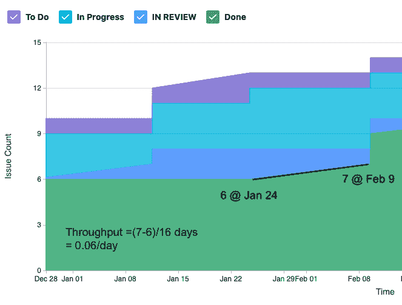

# 第五章：测量过程和解决方案

我们通过测量来查看我们的努力进展了多少。这些测量具有多个维度。我们会检查是否达成了精益流动并正确交付工作。之后，我们部署工作，看看变化是否在环境中有效，以及环境是否安全。最后，我们评估这些变化是否创造了价值，是否值得继续开发。

本章中，我们将研究用于回答上述问题的测量指标。我们将研究以下度量标准：

+   我们是否按计划交付解决方案

+   我们解决方案交付前后环境的健康状况

+   我们的解决方案是否实现了假设的价值

# 测量解决方案交付

在*第四章*，*利用精益流动保持工作持续推进*中，我们研究了建立和维持精益流动的实践。我们需要通过指标来评估是否实现了精益流动，以及是否能够在我们的承诺中保持可预测性。

用于评估精益流动的常见指标如下所示：

+   周期时间

+   WIP

+   吞吐量

+   过程中的阻塞点或瓶颈

获取这些指标的一个有用工具是累积流图。我们将仔细查看累积流图，以便找到这些指标。

## 周期时间

对于一个价值流来说，周期时间是指工作被接受并经过整个开发过程后交付所需的时间。

我们在*第四章*，*利用精益流动保持工作持续推进*中看到，许多因素可能影响周期时间。这些因素包括过多的 WIP、大批量大小、高利用率和波动性。

另一个可能影响周期时间的因素是开发过程中是否存在浪费。这种浪费可能表现为延迟或*等待时间*，当工作从一个阶段移交到下一个阶段时。

定期测量周期时间可以帮助我们看到价值流交付工作的时间。周期时间的增加可以帮助我们确定根本原因是否是上述因素之一。一旦确定，可以采取纠正措施，将周期时间恢复到之前的时间长度。

## 交付时间

交付时间和周期时间常常互相混淆。它们之间的主要区别在于视角：交付时间是从客户的角度看，而周期时间是从价值流的角度看，是一个内部度量指标。

交付时间是指客户在请求工作后等待交付工作项的时间长度。如以下图所示，交付时间由周期时间和任何*等待时间*组成，等待时间是指价值流接受并开始工作的时间。

图 5.1 – 周期时间和交付时间的示意图

从前面的示意图中，我们可以通过两次改进来缩短交付时间。我们可以改善等待时间，或者我们可以改善周期时间。大多数组织都力求改善周期时间，并在此过程中改善交付时间。

## WIP

到目前为止，我们应该已经熟悉 **WIP** 或 **在制品/过程中的工作** 这一概念，它指的是价值流已经开始但尚未完成的工作。我们已经看到了过多 WIP 的不良影响和后果。

WIP（在制品）在下图所示的看板上是可见的。

图 5.2 – 突出显示 WIP 的看板

在前面的示例中，我们可以数出项目并确定我们的 WIP 是六。

## 吞吐量

到目前为止，我们看到了单位（无论是时间还是数量）的度量。吞吐量是我们唯一关注的度量，它本质上是一个速率。换句话说，就是在给定时间单位内完成的工作量。

吞吐量基本上是指在一段固定时间内完成的工作单元数量。Scrum 实践者知道这个指标为速度（velocity）：在一个迭代周期（固定时间，一般为两周）内完成的故事点的总和。其他敏捷方法论会以其他工作单元（如故事、特性等）作为标准时间单位（如周、月）内交付的度量。

我们可以看到，周期时间与价值流的吞吐量之间存在反向关系。吞吐量越大，周期时间越短。

## 阻塞点和瓶颈

为了确保精益流动，我们需要找出并解决那些阻碍流动的障碍。这些障碍可能是临时的，或者是系统性的，阻止一项或多项工作在流程中继续推进。

对这些阻塞点的关注可能需要每天检查，看阻塞是否仍在发生，并在几天内没有解决阻塞时进行升级处理。

## 使用累积流图进行测量

累积流图是检查周期时间、交付时间、吞吐量和 WIP 的一种简便方法。你还可以通过它检查和发现过程中的瓶颈。

累积流图是展示价值流在一段时间内所处理过工作的历史图表。累积流图的 *x* 轴表示时间，*y* 轴表示工作的数量。累积流图中的每一条带状区域代表工作流中的一个步骤，这些步骤来自看板上的列。下面是一个累积流图的示例。

图 5.3 – 累积流图

通常，我们应该看到带状区域从左到右上升并扩展。代表工作流中某一过程步骤的带状区域的入口和出口线应该大致平行，表明流动正在发生。如果入口和出口线分开，形成一个大的扩展区域，那就表明该过程部分存在瓶颈。在下图中，我们可以看到这样的瓶颈。

图 5.4 – 累计流图中的瓶颈注释

让我们来看一下如何使用累计流图来衡量周期时间、在制品（WIP）和吞吐量。

### 使用累计流图衡量在制品（WIP）

要衡量某个价值流在某一时刻的在制品（WIP），请执行以下操作：

1.  从对应于待办事项或**待做**（To Do）列的带状区域与第一个**进行中**（In Progress）列的带状区域之间的边界开始。在我们的示例中，这是**待做**（To Do）带和**进行中**（In Progress）带之间的边界。我们只关注已经开始的工作，因此，这些工作已经超过了**待做**（To Do）状态。

1.  标注下这是多少工作单位。

1.  画一条垂直线穿过其他带状区域，直到你到达表示**进行中**（In Progress）列和表示**完成**（Done）列之间的边界。在我们的示例中，我们通过了**进行中**（In Progress）带和**审查中**（IN REVIEW）带。标注下这是多少工作单位。

1.  将第二个数字从第一个数字中减去。

下图展示了所描述方法的示意。

图 5.5 – 在制品（WIP）计算

请注意，您可以使用相同的方法在较小的范围内，通过观察形成目标列带状区域的两条线，来找到某一时刻**进行中**（In Progress）列中问题的数量。

### 使用累计流图衡量周期时间

要衡量周期时间，请执行以下操作：

1.  找到并标记当一个问题从表示**待做**（To Do）或待办事项（Backlog）列的带状区域移动时，并标记其日期。

1.  画一条水平线，直到它触及表示**完成**（Done）列的带状区域。标注第二个日期。

1.  将第二个日期减去第一个日期，你将得到一个问题的周期时间度量。

图 5.6 – 周期时间计算

步骤在上面的图示中有说明。

### 使用累计流图衡量吞吐量

累计流图中的吞吐量通过找出一条线并确定其斜率来完成：

1.  标记线上的一个点，并标注日期和问题的数量。

1.  在线上较高的位置，标注日期和问题的数量。

1.  分子将是第二个点的问题数量减去第一个点的问题数量。

1.  分母将是两个时间点之间的时间段。

以下是该计算的示例。

图 5.7 – 吞吐量计算

请注意，没有吞吐量的区域将显示为水平线。

所以，对于我们的示例，我们已经找到以下测量数据：

+   1 月 22 日，我们的待处理事项有六个问题

+   我们处理一个问题的周期时间为一个月

+   我们将问题从**正在审查**到**已完成**的吞吐量为 0.06/天

在评估了确保精益流程和及时交付解决方案的测量后，我们需要更仔细地关注确保在部署和发布前质量的存在。为此，让我们看看从预发布和生产环境中捕获的重要测量数据。

# 查看完整堆栈遥测数据

现在，我们将注意力从产品开发过程转移到产品本身。在整个开发过程中，我们在 CI/CD 管道中进行了测试。这些测试通过是产品按预期工作的指示。现在，随着产品在多个环境中的部署，我们希望确保其正常运行。为此，我们在这些环境中监控性能。

监控是衡量我们环境的行为。我们测量或捕获以下三种关键类型的数据：

+   **日志**：日志是标志着一个重要事件发生的指示。这些事件可能会被分类以确定其严重性。

+   **追踪**：追踪展示了应用程序内部的路径和应用程序在给定业务事务中发送的消息。也可能包括时间信息。追踪信息有助于在故障排除时确定正确的功能和性能。

+   **指标**：指标是系统及其组件当前状态的指示器。定期测量有助于确定长期的良好或不良趋势。

我们通过监控收集这些类型的数据文档，以回答以下关于包含系统及其组件的环境的问题：

+   **安全性**：是否存在安全漏洞？系统是否已被黑客攻击？

+   **性能**：系统是否正常运行？事务是否按预期路径进行？

+   **可靠性**：系统是否正常运行并且表现良好？

为了回答这些问题，监控从多个角度进行测量。以下是几个关键角度：

+   应用性能监控

+   基础设施监控

+   日志管理

+   网络监控

+   可观测性

让我们更仔细地看看这些完整堆栈遥测数据的元素。

## 应用性能监控

在查看应用程序是否在某个环境中正常运行时，通常会考虑两个角度：

+   用户如何感知应用程序的性能？这通常表现为用户负载或响应时间。

+   我们的资源（例如，分配的内存）被应用程序使用了多少？这通常通过与之前的状态或配置相比的容量变化来衡量。

2010 年，Gartner 开始将这些度量标准扩展为五个维度，称为 APM 概念框架。这些维度如下：

+   最终用户体验（例如，响应时间）

+   运行时应用架构（例如，垃圾回收事件）

+   商业交易

+   中间件组件（例如，数据库读取和写入）

+   应用分析

许多通过应用性能监控来衡量其性能的应用程序是基于 Web 的应用程序，具有 Web 浏览器或移动应用用户界面。之所以如此，是因为它能轻松收集跨越五个维度的度量标准。

许多监控工具，尤其是《第三章》中详细描述的工具，*自动化以提高效率和质量*，具有涵盖这五个维度的功能。

随着容器和微服务的日益流行，应用性能监控不得不创建准确的性能测量，以衡量容器或微服务中的表现。因此，应用性能监控与基础设施监控之间存在一些重叠。

## 基础设施监控

基础设施监控用于衡量整个系统或环境的资源。通常会根据以下利用率来进行识别：

+   CPU 利用率

+   内存（RAM）利用率

+   存储可用性

从历史上看，基础设施监控对本地设备（如*裸金属*服务器）至关重要。随着云环境的发展，基础设施监控工具需要衡量动态分配的资源，这些资源将根据需求即时创建和销毁。

## 网络监控

网络监控衡量组织网络的性能，以发现性能下降或故障情况。通常，网络监控系统会跟踪以下领域：

+   网络资源的可用性（例如，连接正常运行时间，连接速度）

+   网络硬件状态

+   网络接口状态

网络监控的一个日益重要的领域是确保网络在完整性、可访问性和隐私方面的安全性。确保安全的网络防御措施包括以下内容：

+   **网络访问** **控制**（**NAC**）

+   防火墙

+   防病毒/反恶意软件软件

+   **虚拟专用** **网络**（**VPNs**）

+   邮件安全

+   应用安全

+   云安全

## 日志管理

所有执行监控的工具将创建所有活动和测量的日志，从关键警报到信息通知。日志管理收集这些事件并执行以下活动：

+   聚合到中央位置

+   存储

+   日志轮换与处置

+   分析

+   搜索与报告

在开发过程中以及之后，适当管理的日志对于多种目的都是必需的。这些目的包括：

+   确定测试是否通过

+   排查应用程序和环境故障

+   评估客户反馈

在收集日志、跟踪和指标数据时，这些数据很重要，但在出现问题时能够快速筛选这些数据也同样重要。为此，我们转向了可观察性。让我们讨论一下如何使用这些监控信息。

## 可观察性

通过监控收集日志、跟踪和指标所产生的数据海洋，现在引出了以下新的问题：

+   当出现问题时，我能否迅速在日志、跟踪和指标中找到数据，以了解根本原因并找到解决方案？

+   我是否可以使用在日志、跟踪和指标中收集的数据来预测问题何时可能发生，并尝试防止它们发生？

可观察性通过从收集数据转向理解数据本身，帮助回答这些问题，以识别其当前状态。这样做不仅仅是监控，还包括以下活动：

+   日志、跟踪和指标的分析

+   寻找日志、跟踪、指标与特定事件（如故障）之间的关联

+   通过仪表盘进行数据的可视化和探索

+   当问题发生时，发出警报和通知

可观察性通过让团队了解变更对环境产生的因果关系，帮助加强更高层次的系统思维。通过理解哪些变更对环境有益，团队可以融入正确的变更以获得更好的结果。

在确保解决方案具有足够的质量后，我们面临更大的考验：开发的解决方案是否能为客户提供足够的价值，足以让他们喜欢它？为了评估这一点，我们需要对基于结果的度量标准进行衡量。这是下一节的主题。

# 测量价值主张

将客观的度量应用于像价值这样的主观质量是困难的。我们能做的是通过测量客户采取的行动或客户在特定事件（如评审）期间所提供的调查反馈或想法来进行评估。

在查看价值的度量时，一些指标可能收集得太晚，导致价值流无法及时知道何时调整方向。比如**损益表**（**Profit & Loss**，**P&L**）或**投资回报率**（**Return on Investment**，**RoI**）。因此，需要其他能够作为领先指标的度量。这种收集领先指标以便做出调整或继续发展的做法，Eric Ries 在他的《精益创业》一书中称之为*创新会计*。

## 创新会计框架

Ries 将假设和学习的方法描述为**创新会计**框架。在这个框架中，团队会设定客户需求的假设，发展这些假设，然后进行衡量并决定后续行动。这是在三个阶段的循环中完成的，具体包括：

1.  查看当前情况，并通过**最小可行产品**（**MVP**）或开发*足够*的产品或功能来向客户展示并获得反馈，以验证假设。

1.  根据指标，针对 MVP 进行小范围调整。

1.  如果指标表明成功，继续优化 MVP。如果指标显示其他结果，则转向新的方向。

在创新会计框架中，收集的指标必须小心挑选，以避免成为**虚荣指标**。虚荣指标讲述了一个美好的故事，但没有提供有意义的见解。为了避免指标沦为虚荣指标，Ries 建议它们具备以下三个特征：

+   **可操作性**：这个指标是否显示出明确的因果关系？换句话说，你是否能够通过执行相同的操作来复制这个结果？

+   **可访问性**：价值流中的每个人是否都能访问相同的数据，且这些数据是否被所有人理解？

+   **可审计性**：报告是否具有可信度？

与创新会计相关的指标将依赖于价值流所开发的最终产品及其与客户的互动。我们将看看一些主要的指标集合，这些集合用于衡量价值。

## 海盗指标

对于许多面向最终用户客户的产品，如**软件即服务**（**SaaS**）或基于网络的产品，*海盗*指标提供了最佳的指导，帮助判断开发和营销努力是否取得了成果。

海盗指标由 Dave McClure 在 2007 年提出。这个名称来自于五个阶段的首字母缩写（**AARRR**），发音类似于海盗的叫声。这些阶段如下：

+   获取

+   激活

+   保留

+   推荐

+   收入

让我们仔细看看每个阶段。

### 获取

在这个阶段，指标用于确定新访客的数量。这里的指标用于捕捉以下方法吸引新用户的效果。

+   **搜索引擎** **优化**（**SEO**）

+   社交媒体

+   广告

+   营销活动

### 激活

在激活阶段，我们查看多少新用户在首次接触产品或网站后愿意更加投入。这里的指标关注以下用户行为，作为新用户已经越过获取阶段，进入激活阶段的指示：

+   在登录页面后访问额外页面

+   查看或尝试额外的产品特性

+   在网站上花费更多时间

+   注册新闻通讯/邮件列表

+   注册免费试用

通过记录用户行为的测试结果，如 A/B 测试，来创建这些类型的指标。

### 留存

在这一阶段，我们希望了解能在用户首次接触后，保持他们多久。我们想要衡量以下事项是否发生：

+   返回访问网站

+   打开电子邮件新闻通讯

+   在一段时间内的重复使用产品情况（通常是第一个月）

通常，这些指标用于衡量营销邮件和活动的效果。

### 推荐

这一阶段看的是已建立的客户是否将消息传递给朋友或同事。确定进入此阶段的指标包括：

+   进入获取阶段的推荐人数

+   进入激活阶段的推荐人数

### 收入

最后，这一阶段关注那些已达到更高层次并购买了增强产品功能或网站内容的客户。我们查看以下客户是否做到了：

+   支付最低收入

+   为了使营销工作在各个阶段都能*收支平衡*，需要支付足够的收入。

## Google HEART 框架

HEART 框架由 Kerry Rodden、Hilary Hutchinson 和 Xin Fu 在 Google 提出。它旨在衡量 Google 提供的大型 Web 应用的**用户体验**（**UX**）设计的有效性。

该框架要求团队成员评估以下维度：

+   **快乐感**：这些通常是主观的衡量标准，例如用户满意度、感知的易用性和推荐可能性。

+   **参与度**：这跟踪用户与产品及其功能的互动程度。

+   **采用**：这跟踪在某一时间段内的新用户数量。

+   **留存**：这跟踪在某一时间段内，多少用户在后续时间段仍然保持活跃。

+   **任务成功**：这衡量的是产品或某个特定功能的整体可用性。用户能否使用产品或功能完成预期目标？

对于每个维度，团队会设定三个特征。以下是这些特征的列表：

+   **目标或任务**：产品或功能的目标是什么？

+   **信号**：我们如何知道自己是否达成了目标？

+   **指标**：我们可以收集哪些指标来获取我们想要的信号？

团队通常会将各维度和特征整理成表格。以下示意图展示了一个例子。

|  | **目标** | **信号** | **指标** |
| --- | --- | --- | --- |
| 快乐感 |  |  |  |
| 参与度 |  |  |  |
| 采用 |  |  |  |
| 留存 |  |  |  |
| 任务成功 |  |  |  |

表格 5.1 – Google HEART 框架

下一个指标框架旨在寻找客户需求与组织努力之间的一致性。我们现在来看看这个框架。

## 适用性指标

在《*Fit for Purpose: How Modern Businesses Find, Satisfy, & Keep Customers*》一书中，作者 David J. Anderson 和 Alexei Zheglov 描述了**Fit for Purpose**（**F4P**）框架，这是一种将客户需求（*目的*）与组织可能提供的产品和解决方案（*适配*）对齐的方法。

Anderson 和 Zheglov 识别了四种组织通常收集的指标分类，并展示了它们在框架中的位置。这些分类如下：

+   适配度标准

+   一般健康指标

+   改进驱动因素

+   虚荣指标

现在让我们来看看每个类别。

### 适配度标准

适配度标准描述了客户用来判断您的产品或解决方案是否符合他们需求或目的的度量标准。这些适配度标准将基于以下几个维度：

+   设计

+   实施

+   服务交付

客户将使用阈值来评估适配度标准。第一个是最低接受水平，低于该水平他们会认为产品或服务未能满足他们的需求。第二个阈值是卓越服务或在所有三个维度上超出预期的情况。

许多组织从这些指标作为适配度标准开始，直到他们对客户或市场细分有更多了解：

+   交付时间及其可预测性。

+   质量及其可预测性。

+   安全，包括符合相关法律和标准（如果处于受监管行业）。

+   价格。需要注意的是，价格通常不是一个独立变量。换句话说，价格可能会为了其他适配度标准的更高期望而被牺牲。

客户对其适配度标准的反馈通常通过 F4P 调查获取，调查问客户他们寻求的三个目的是什么，产品或服务在多大程度上满足了这些目的，以及其他备注。

### 一般健康指标

一般健康指标是组织内部的度量标准。它们可用于判断是否适合改进客户用来评估组织是否符合其目标的一个或多个维度（设计、实施、服务旅程）。虽然这些是重要的指标，应该收集并分析，但在判断是否创造了足够的价值以至于客户会选择该产品时，它们是次要的，重要性低于适配度标准。

一般健康指标的例子包括价值流的周期时间、Scrum 团队的速度、运营团队的恢复/恢复平均时间。

### 改进驱动因素

改进驱动因素是组织用于改进目的的度量标准。它们是组织采用特定行为的衡量标准。通常与之相关联的是目标，当目标实现时，这个指标应该转化为一般健康指标。

一个改进驱动因素的例子可能是自动化测试的数量。这个指标旨在鼓励注重测试自动化。

### 虚荣指标

我们之前在谈论创新会计时讨论过虚荣度量。许多组织确实会收集虚荣度量，这些度量能够提供情感上的提升。但就像含有*空洞热量*的糖果或垃圾食品一样，这些度量并没有真正揭示组织的行动是否为客户带来了他们想要的真实价值。

一个例子是一个组织的网站产生的总访问量。在没有深入了解细节的情况下，这是一个始终会增长的数字，且与组织在市场营销或搜索引擎优化方面的任何努力无关。

## 净推荐值

净推荐值是客户支持中常用的一个度量。通常以一个单一调查问题的形式出现：你有多大可能推荐这个产品或服务给朋友或同事？这个问题后面会有 1-10 的响应范围。然后，用户根据回答将受访者分为以下几类：

+   推动者（9-10）

+   中立者（7-8）

+   反对者（1-6）

然后通过查看推动者和反对者的百分比，计算得出分数，并将反对者的百分比从推动者的百分比中减去。然后将这个百分比表示为一个整数。

我们现在已经完成了对用于衡量我们为客户提供的价值的流行度量框架的探讨。这些大多涉及与客户的直接接触，如果这种接触能够频繁进行，会更有益。

# 总结

在本章中，我们查看了在开发过程和之后进行的度量。我们发现必须在三个领域进行度量，以确定我们的价值流是否得到优化，并朝着价值方向运作。

第一个衡量领域检查了团队和价值流，看看它们是否朝着优化流程的方向努力。定义并使用累积流图来确定周期时间、交付时间、WIP 和产出等度量。

第二个衡量领域检查了应用程序所在的环境。可用工具确保应用程序及其环境资源的正常运行，例如基础设施，包括存储和网络。

第三个衡量领域是解决方案所提供的价值。度量框架，例如海盗指标（AARRR）、谷歌 HEART 框架和 F4P 指标，关注客户的行为和想法，以确定所开发的解决方案是否符合客户期望，提供价值。

在下一章中，我们将通过查看*恢复*来完成对 CALMR 的检查。我们将探讨价值流如何使用方法来减少生产中失败的风险，并且如果发生问题，如何快速解决生产中的问题。

# 问题

通过回答这些问题来测试你对本章概念的理解。

1.  交付时间衡量等待时间和 ______________？

    1.  产出

    1.  阻碍因素

    1.  周期时间

    1.  进行中

1.  在衡量吞吐量和周期时间时，如果周期时间减少，吞吐量会发生什么变化？

    1.  吞吐量上升

    1.  吞吐量下降

    1.  吞吐量保持不变

    1.  吞吐量先上升，再下降

1.  WIP 在累积流图中是如何表现的？

    1.  水平线

    1.  垂直线

    1.  上升坡度

    1.  下降坡度

1.  基础设施监控需要哪些度量（选择 2 个）？

    1.  垃圾回收率

    1.  CPU 利用率

    1.  响应率

    1.  存储可用性

    1.  网络可用性

1.  在适用框架中，客户看重哪种类型的度量？

    1.  适用标准

    1.  一般健康指标

    1.  改进驱动因素

    1.  虚荣指标

# 进一步阅读

+   [`www.gartner.com/DisplayDocument?id=1436734&ref=g_sitelink`](http://www.gartner.com/DisplayDocument?id=1436734&ref=g_sitelink) – 一份 Gartner 报告，描述了 APM 概念框架。

+   [`500hats.typepad.com/500blogs/2007/09/startup-metrics.html`](https://500hats.typepad.com/500blogs/2007/09/startup-metrics.html) – Dave McClure 的博客页面，描述了海盗指标（AARRR）。

+   [`research.google/pubs/pub36299/`](https://research.google/pubs/pub36299/) – Kerry Rodden、Hilary Hutchinson 和 Xin Fu 提交的论文，概述了 Google 的 HEART 框架。

+   **《精益创业》** 由 Eric Ries 编著 - 精益创业周期的探讨。周期的一部分包括对创新会计的讨论，以及哪些度量是真正有益的，而不是虚荣指标。

+   **《Fit for Purpose: How Modern Businesses Find, Satisfy, & Keep Customers》** 由 David J. Anderson 和 Alexei Zheglov 编著 - 适用度度量的探讨。
