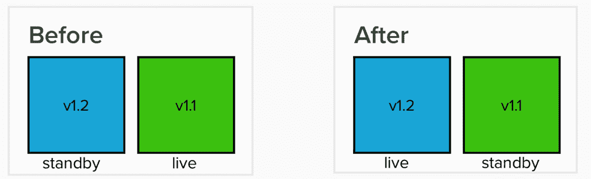
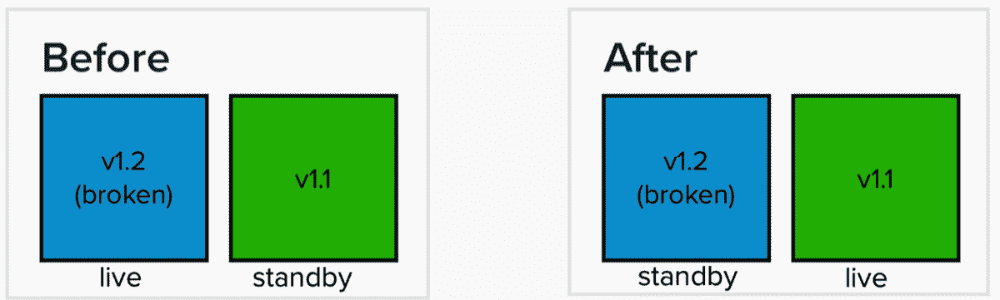
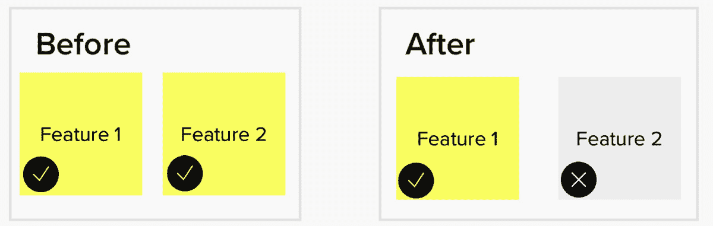

# 6

# 从生产失败中恢复

我们生活在一个不完美的世界。我们首先看到漏洞逃入我们的生产环境。然后，我们可能会发现，当我们开始向 DevOps 实践过渡时，我们在理解上的一些空白会影响我们在生产环境中的交付方式。随着这些问题得到解决，我们可能会遇到其他超出我们控制范围的问题。我们能做些什么呢？

在本章中，我们将探讨如何减轻和处理生产环境中发生的故障。我们将研究以下主题：

+   生产环境中的错误成本

+   尽可能防止错误的发生

+   通过混沌工程进行故障演练

+   使用事件管理流程解决生产中的问题

+   通过回滚或前移修复来解决生产失败

# 从失败中学习

生产失败可能在产品开发过程中的任何阶段发生，从首次部署到支持成熟的产品。当这些生产失败发生时，根据其影响，可能会对客户所看到的价值产生不利影响，并有可能毁掉企业的声誉。

通常，我们不会在生产失败发生之前看到这些失败带来的教训，直到失败发生后，或者通过阅读其他组织（甚至竞争对手！）发生类似失败的情况。

我们将研究一些著名的生产失败案例，希望通过事后回顾来汲取经验教训。以下是一些示例：

+   `healthcare.gov` 在 2013 年的上线

+   2022 年 Atlassian 云服务中断

其他的教训将来自本章的其他部分。

## healthcare.gov（2013 年）

2010 年，美国通过了《患者保护与平价医疗法案》。该法案的关键部分，通称为*奥巴马医保*，是通过一个名为[healthcare.gov](http://healthcare.gov)的网站平台，让个人通过多个市场找到并注册负担得起的健康保险计划。该平台要求在 2013 年 10 月 1 日上线。

[healthcare.gov](http://healthcare.gov)在那一天上线后立刻遇到了问题。上线初期，网站需求为 250,000 次，是预期的五倍，导致网站在前两小时内崩溃。到第一天结束时，只有六个用户成功提交了健康保险计划的申请。

一场大规模的故障排除工作随之展开，最终使得网站能够承载 35,000 个并发用户，并在 2013 年 12 月注册期结束前为 120 万用户登记了健康保险计划。

关于[healthcare.gov](http://healthcare.gov)灾难的几份报告之一由 Dr. Gwanhoo Lee 和 Justin Brumer 编写。在报告中（见[`www.businessofgovernment.org/sites/default/files/Viewpoints%20Dr%20Gwanhoo%20Lee.pdf`](https://www.businessofgovernment.org/sites/default/files/Viewpoints%20Dr%20Gwanhoo%20Lee.pdf)），他们具体指出了这样一个庞大工程的挑战，包括以下几点：

+   在有限时间内开发复杂的 IT 系统

+   政策问题导致实施过程中的不确定性

+   高风险的合同，且时间有限

+   缺乏领导力

Lee 和 Brumer 还指出了从门户网站设计和开发的早期阶段开始的一系列失误，这些失误最终导致了项目的失败。包括以下几点：

+   政府政策与门户网站技术实施之间缺乏对齐

+   不充分的需求分析

+   未能识别和减轻风险

+   缺乏领导力

+   对坏消息的漠视

+   僵化的组织文化

+   对项目管理基础知识的忽视

### 修复 healthcare.gov

在[healthcare.gov](http://healthcare.gov)的首次灾难性发布后，其中一项举措就是 Tech Surge，即由硅谷软件开发人员接管，重构了[healthcare.gov](http://healthcare.gov)网站的主要部分。Tech Surge 中的团队作为小型团队以初创公司心态运作，习惯于使用敏捷方法，进行紧密合作，使用 DevOps 工具如 New Relic，并利用云基础设施。

Tech Surge 的一个分支是由 Loren Yu 和 Kalvin Wange 领导的一小组程序员，他们被称为**Marketplace Lite**(**MPL**)。他们最初是作为 Tech Surge 的一部分，和**医疗保险和医疗补助服务中心**(**CMS**)的现有团队一起工作，向他们展示新的工作方法，例如通过聊天而非电子邮件进行协作，同时重写网站的登录和注册新计划部分。

MPL 继续在[healthcare.gov](http://healthcare.gov)上工作，因为许多其他开发者的合同到期了，Tech Surge 的其他开发者也在继续合作。它继续与 CMS 一起改进系统测试，并逐步推出修复措施，正如当时**政府问责局**(**GAO**)报告中所示。这些努力开始取得了显著成果。MPL 重新编写的其中一部分，即用于注册新医疗保险的工具*App 2.0*，仅限呼叫中心进行*软启动*，但它取得了极大的成功，成为了注册新申请的主要工具，适用于那些有简单病史的人群。

MPL 和技术冲击小组的工作，以及随后在进一步的注册期间[healthcare.gov](http://healthcare.gov)的成功推出，为敏捷和 DevOps 思维及实践提供了一个试验场。18F 等机构和美国数字服务局接过接力棒，开始指导其他联邦机构将敏捷和 DevOps 应用于技术项目。

## Atlassian 云故障（2022）

2022 年 4 月 5 日，Atlassian 超过 200,000 个客户组织中的 775 个失去了对 Atlassian 云站点的访问，这些站点服务了如 Jira 服务管理、Confluence、Statuspage 和 Opsgenie 等应用程序。许多客户在服务恢复之前，已经无法访问其站点长达 14 天，直到 4 月 18 日剩余的站点恢复服务。

站点故障的根本原因追溯到 Atlassian 用来删除旧版 Insight 实例的脚本，Insight 是 Jira 的一个流行独立插件，Atlassian 在 2021 年收购了该插件。Insight 最终被捆绑进 Jira 服务管理中，但遗留的应用痕迹仍然存在，需要被删除。

出现了沟通错误，负责运行脚本的团队接收到的是站点 ID 列表作为脚本的输入，而不是 Insight 实例 ID 列表。结果是站点被立即删除。

Atlassian 的云架构由多个租户服务组成，这些服务处理多个客户的应用程序。全面恢复服务将会影响那些站点未被删除的客户。Atlassian 知道如何恢复单个站点，但从未预料到需要恢复当前面对的大量站点。Atlassian 开始恢复客户站点。恢复大量站点需要 48 小时。手动恢复所有缺失的站点将需要数周时间；显然，Atlassian 需要实现自动化。

自动化工作是为了帮助 Atlassian 找到一种方法，以便一次性恢复多个站点。自动化从 4 月 9 日开始运行，成功地在 12 小时内恢复了一个站点。到 4 月 18 日最后一个站点恢复时，大约 47%的站点已经通过自动化得到了恢复。

更大的问题是与受影响客户的沟通。Atlassian 最初是通过一个客户支持票得知这一事件的，但当时并没有立即意识到受影响的客户总数。这是因为删除站点时，也删除了包含客户信息的元数据，而这些信息通常会被客户用于创建支持票。恢复丢失的客户元数据对于客户通知非常重要。

Atlassian 无法直接联系受影响客户，导致了一个重大沟通问题的加剧。那些未被 Atlassian 联系的客户开始在社交媒体平台（如 Twitter 和 Reddit）上寻求有关事件的消息。Atlassian 于 4 月 7 日发布了一条通用推文。Atlassian 的首席技术官 Sri Viswanath 于 4 月 12 日发布了更详细的博文。在事件解决后，事后复盘报告于 4 月 29 日公开发布。

### 来自 Atlassian 停机事件的教训

Atlassian 的停机事件在技术和客户服务方面都带来了挑战。事后复盘总结了四个主要的学习点，Atlassian 必须改进这些方面，以防止类似的停机事件发生。这些教训包括：

+   将删除生产数据的过程更改为*软删除*，这样更容易恢复，并且数据只有在经过一定时间后才会被删除。

+   针对多个站点、多个产品的数据，针对更大范围受影响客户的具体流程。

+   考虑大规模事件的事故管理。Atlassian 为某个客户的网站制定了流程。现在，它需要考虑影响大量客户的大规模事故。

+   在事故发生期间改善客户沟通。Atlassian 在掌握事故原因和纠正措施后才开始沟通。这种延迟沟通让事故在社交媒体上扩展开来。

但我们也能从中汲取更广泛的教训。生产中的故障可以发生在从第一次部署到产品生命周期的任何阶段。无论是刚开始使用 Agile 和 DevOps 的公司，还是像 Atlassian 这样的公司，在使用 Agile 和 DevOps 取得成功之后，都有可能发生故障。对于这些公司来说，处理生产故障的关键在于确保流程能尽可能根除故障，进行故障演练以确定最佳流程，并在发生故障时建立合适的处理流程。

为了帮助我们应对这一挑战，我们转向了一个不断发展的学科，称为**站点可靠性工程**（**SRE**）。这一学科由 Google 的 Ben Treynor Sloss 创建，最初目的是将软件开发方法应用于系统管理。SRE 最初被视为一种混合方法，利用开发团队用于传统系统管理操作的方法，它已经发展成 DevOps 中的一个独立分支，确保在自动化部署之后，系统操作的持续可靠性。

第一步是规划和预防。我们从查看 SRE 用于防止生产故障的保障措施开始。

# 预防——拉动安灯（Andon）绳。

**安灯绳**在精益思想中占有特殊的地位。作为丰田生产系统的一部分，如果你怀疑生产线上有问题，你可以拉动围绕生产线的安灯绳，这会停止生产线。人们会赶到安灯绳拉动的地方，查看缺陷并确定首先如何修复缺陷，然后采取哪些步骤防止未来再次发生类似问题。

丰田生产系统的创始人大野耐一通过安灯绳实践*自働化*，赋予每个人停止工作来检查和实施持续改进的权力。

对于站点可靠性工程师，以下的理念和原则被用作实施安灯绳并确保持续改进的方法：

+   通过查看**服务级别指标**（**SLI**）、**服务级别目标**（**SLO**）和误差预算来规划风险容忍度

+   通过发布工程执行发布标准

+   与发布协调工程合作进行产品发布

让我们更详细地探讨这些理念。

## SLI、SLO 和误差预算

许多人熟悉**服务级别协议**（**SLA**）的概念，即如果服务未达到可用性或响应性的门槛，供应商将需要支付约定的性能水平，通常以信用额度的形式进行补偿。

如果我们查看 SLA 期望实现或维持的目标或阈值，这称为 SLO。一般来说，SLO 有三个部分：

1.  要测量的质量/组件

1.  测量周期

1.  质量必须达到的要求阈值，通常以期望值或范围的形式写出

要测量的质量或组件被称为 SLI。常见的 SLI 包括以下几种：

+   延迟

+   吞吐量

+   可用性

+   错误率

对于每个 SLO，在测量周期内未达到阈值的时间称为误差预算。通过密切监控误差预算，SRE 可以评估风险是否可接受，以便推出新版本。如果误差预算几乎耗尽，SRE 可能会决定将焦点从功能开发转向更多的技术工作，例如增强可恢复性和可靠性的支持工具。

团队通常希望了解误差预算，以可允许的时间为单位。以下表格可能会提供有关每月和每年最大可允许误差的指导：

| **SLO 百分比** | **每月允许** **误差预算** | **每年允许** **误差预算** |
| --- | --- | --- |
| 99%（1%误差范围） | 7 小时 18 分钟 | 87 小时 39 分钟 |
| 99.5%（0.5%误差范围） | 3 小时 39 分钟 | 43 小时 49 分钟 45 秒 |
| 99.9%（0.1%误差范围） | 43 分钟 50 秒 | 8 小时 45 分钟 57 秒 |
| 99.95%（0.05%误差范围） | 21 分钟 54 秒 | 4 小时 22 分钟 48 秒 |
| 99.99%（0.01% 误差范围） | 4 分 23 秒 | 52 分 35 秒 |

表 6.1 – 按允许的每月和每年时间划分的误差预算

实施 SLOs 的过程通常从评估产品或服务开始。从那里，查看构成产品的组件或微服务：哪些部分如果不可用，会导致客户的不满？

在发现对客户满意度至关重要的组件后，选择那些用于捕获和设定目标（SLOs）的测量指标（SLIs），确保这些测量指标能真实反映潜在问题，并且目标是现实可达的（任何测量指标的 100% 都是无法实现的）。从一小组 SLOs 开始，将这些 SLOs 告诉客户，让他们理解 SLOs 在提升产品质量和期望方面的作用。

SLIs、SLOs 和误差预算应作为政策文档，但该政策是可以调整和改变的。经过一段时间后，重新评估 SLIs、SLOs 和误差预算，检查这些测量指标是否有效，并根据需要修订 SLIs 和 SLOs。

## 发布工程

为了确保 SLOs 得以保持，站点可靠性工程师需要确保发布给客户的任何内容都是可靠的，且不会导致服务中断。为此，他们与软件工程师合作，确保发布的内容风险较低。

Google 将这种协作称为发布工程。SRE 的这一方面遵循以下原则：

+   自助服务

+   高速度

+   封闭构建

+   政策/程序执行

现在让我们来看一下发布工程哲学的这四个部分。

### 通过自助服务模型实现发布自主权

为了实现敏捷，参与的团队必须是独立且自我管理的。发布工程过程允许团队自行决定发布节奏和实际发布的时间。自动化有助于团队在需要时按需发布。

### 追求高速度

如果团队选择更频繁地发布，通常是以更小批次的高测试覆盖率代码进行发布。更频繁的小批量发布降低了中断的风险。如果你有较大的误差预算，这尤其有帮助。

### 确保封闭构建

我们希望在构建和发布过程中保持一致性和可重复性。构建输出应与创建者无关，确保输出相同。这意味着，从测试到生产的依赖项和工具（如库和编译器）的版本应保持标准化。

当然，如果生产环境中出现问题，一种有用的故障排除策略是所谓的 *cherry-picking*（挑拣），团队从最后一个已知的 *良好* 生产版本开始，从版本控制中获取并逐个插入每个更改，直到发现问题。强有力的版本控制流程确保构建是封闭的，并且支持挑拣操作。

### 严格执行政策和程序

需要访问控制标准的自动发布过程，以确保在正确的构建机器上使用正确的源创建构建。关键是避免添加本地编辑或依赖项，只使用存储在版本控制中的经过验证的代码。

我们讨论的这四个原则实际上在处理发布过程中的以下部分时得到了应用：

+   **持续集成/持续** **部署** (**CI/CD**)

+   配置管理

我们第一次看到这些部分作为 CI/CD 管道的自动化实现出现在 *第三章*， *提升效率与质量的自动化*。现在，让我们看看如何将这些过程与自动化联系起来。

### CI/CD

发布过程从提交版本控制开始。这会启动构建过程，自动执行不同的测试，具体取决于分支。发布分支会运行单元测试以及适用的系统和功能测试。

测试通过后，构建会被标记，以便跟踪构建日期、依赖项、目标环境和修订号。

### 配置管理

配置管理工具使用的文件存储在版本控制中。配置文件的版本与发布版本一起记录，作为审计轨迹的一部分，以便我们知道哪个版本的配置文件与哪个版本的发布相关联。

## 发布协调工程

向客户发布新产品或功能时，可能会比现有产品的迭代发布面临更高的期望。为了促进新服务的发布，谷歌在 SRE 内创建了一个特殊的咨询职能，称为 **发布协调工程** (**LCE**)。

LCE 的工程师执行多个职能，旨在确保发布过程顺利进行。这些职能包括以下内容：

+   审核产品或服务以确保可靠性

+   协调多个参与发布的团队

+   确保完成与发布相关的技术任务

+   确认发布是 *安全的*

+   培训开发人员与新服务的集成

为了帮助发布协调工程师确保发布顺利进行，创建了一个发布检查清单。根据产品的不同，工程师会定制该检查清单，添加或删除以下检查项：

+   共享架构和依赖

+   集成

+   容量规划

+   可能的故障模式

+   客户行为

+   流程/自动化

+   开发过程

+   外部依赖

+   发布规划

我们已经看到 SRE 使用的技术和流程，以确保产品发布或代码发布已准备就绪。我们已通过 SLIs、SLOs 和错误预算看到了容错能力。但我们是否知道当发生故障时，SRE 是否已做好准备？

判断的一种方式是模拟故障并观察反应。这是 SRE 使用的另一个工具，称为混沌工程。让我们看看其中涉及的内容。

# 准备工作 – 混沌工程

2015 年 9 月 20 日，**亚马逊网络服务**（**AWS**）在美国东部 1 区（US-EAST-1）发生了停机事故，超过 20 个服务出现故障。这些服务影响了许多大公司如 Tinder、Airbnb、IMDb 的应用，以及亚马逊自己的服务，如 Alexa。

在 AWS 发生故障期间，能够避免问题并保持完全运行的客户之一是 Netflix，这家流媒体服务公司。它能够做到这一点，因为它创建了一系列名为*猩猩军团*的工具，相关内容可以在[`netflixtechblog.com/the-netflix-simian-army-16e57fbab116`](https://netflixtechblog.com/the-netflix-simian-army-16e57fbab116)的博客文章中找到，这些工具模拟了 AWS 可能出现的问题，使得 Netflix 的工程师能够设计出增强系统弹性的解决方案。

在多次 AWS 故障中，猩猩军团证明了它的价值，使 Netflix 能够继续提供服务。很快，像 Google 这样的其他公司也开始希望应用相同的技术。这股支持浪潮最终促成了混沌工程学科的诞生。

让我们更深入地了解混沌工程的以下几个方面：

+   原则

+   实验

## 混沌工程原则

混沌工程的关键是进行生产环境中的实验。尽管在生产环境中进行可靠性实验似乎充满风险，但这种风险通过对系统弹性的信心得到了缓解。

为了引导信心，混沌工程从以下原则开始：

+   基于生产环境稳态行为构建假设

+   创建模拟现实世界事件的变量

+   在生产环境中运行实验

+   自动化实验

+   最小化实验的后果

让我们详细讨论这些原则。

### 基于稳态行为进行实验

在设计实验时，我们真正想要关注的是系统的输出，而不是系统中各个组件的表现。这些输出形成了环境在稳态下行为的基础。混沌工程的重点在于验证行为，而不是验证单个组件的功能。

那些将混沌工程视为 SRE（站点可靠性工程）关键部分的成熟组织知道，这种稳态行为通常构成了 SLO（服务水平目标）的基础。

### 创建模拟现实世界事件的变量

基于已知的稳态行为，我们考虑现实世界中可能发生的*假设*场景。你考虑的每个事件都成为一个变量。

Netflix 的“猩猩军团”中的一个著名工具，*Chaos Monkey*，基于 AWS 中虚拟服务器节点不可用的事件。因此，它只测试这一条件。

### 在生产环境中运行实验

在预备环境或*类似生产环境*中运行实验是有益的，但最终，你需要在生产环境中运行实验，以查看它对实际流量处理的影响。

在 Netflix，Chaos Monkey 每天在生产环境中运行。它会查看每个正在运行的集群，并随机停用其中一个节点。

### 自动化实验

从混沌工程实验中学习的好处，只有当实验持续且频繁地运行时，才能显现出来。为了实现这一点，自动化实验是必要的。

Chaos Monkey 在初次推出时并未受到 Netflix 工程师的欢迎。每天，这个程序会故意在生产环境中制造错误，这让他们感到不太舒服，但它确实不断暴露出实例可能消失的问题。有了这个问题，工程师们就有了找到解决方案并增强系统弹性的任务。

### 最小化后果

因为你是在生产环境中进行实验，所以也有可能影响到同样使用该环境的客户。你的任务是确保实验带来的后果得到最小化。

Chaos Monkey 每天运行一次，但仅限于工作时间。这是为了确保如果发现对生产环境的任何负面影响，能够在大多数工程师在场时发生，而不是在凌晨 3 点等非工作时间，这时只有少数工作人员值班。

在这些原则的基础上，接下来让我们应用它们并探讨创建实验。

## 在混沌工程中运行实验

在生产环境中进行实验需要规划和开发流程。实验的目标是找出那些可以增强弹性的薄弱环节，以确保 SLO（服务水平目标）得到保持。目标不是*破坏* *系统*。

在《混沌工程：实践中的系统弹性》一书中，理查德·克劳利写了一个章节，讲述了为 Slack 创建*灾难剧院*流程的内容。他概述了以下步骤：

1.  确保有一个*安全网*到位。

1.  准备演练。

1.  执行演练。

1.  对演练结果进行总结。

现在让我们详细检查每个步骤。

### 确保环境已准备好应对混沌

混沌工程的目标是找出系统弹性中的弱点，而不是关闭环境。如果现有环境没有容错能力，那么进行实验是没有意义的。

确保服务有备用容量。这个备用容量应该容易上线。

一旦备用容量和资源被识别并分配好，制定一个计划，允许移除故障资源并自动用备用容量进行替换。

### 准备演练

对于克劳利来说，一个演练从一个问题开始：哪个关键组件或服务会失败，从而影响系统的弹性？这成为演练的基础。

Crowley 然后以此为基础，展开工作，扩展为在开发、预生产和生产环境中运行的演习。他制定了一个检查清单，确保以下每个项目都在演习中得到满足：

+   描述将要故障的服务器或服务，包括故障模式，以及如何模拟故障。

+   确定开发和生产环境中的服务器或服务，并确认在开发环境中模拟的方法是否可行。

+   确定如何检测故障。是否会生成警报并显示在仪表板上？是否会生成日志？如果无法想象如何检测它，仍然值得执行演习以确定检测故障的方法。

+   确定冗余和缓解措施，这些措施应当能够消除或减少故障的影响。同时，确定在故障发生时应运行的操作手册。

+   确定应该邀请哪些相关人员为演习提供他们的知识。这些人员也可能是演习发生时的第一响应者。

准备工作最终在与相关人员的会议中完成，讨论演习所需的后勤工作。当所有准备工作就绪时，便是时候开始演习了。

### 运行演习

演习应当在执行前广泛告知所有参与人员。毕竟，他们将参与这次演习，目标是创建一个更具弹性的环境。

Crowley 执行演习时使用以下检查清单：

1.  确保每个人都知道演习正在被录音。如果每个人都同意，可以进行录音。

1.  审查在准备阶段创建的计划，并根据需要进行调整。

1.  在开发环境中宣布演习开始。

1.  在开发环境中制造故障。记录时间戳。

1.  查看是否为故障生成了警报和日志。记录时间戳。

1.  如果有自动恢复步骤，给它们一些时间来执行。

1.  如果使用了操作手册，按照操作手册的指引解决开发环境中的故障。记录时间戳以及是否有任何偏离操作手册的情况。

1.  确定是否有“开始/不开始”决策，以便在生产环境中复制此故障。

1.  在生产环境中宣布演习开始。

1.  在生产环境中制造故障。记录时间戳。

1.  查看是否为故障生成了警报和日志。记录时间戳。

1.  如果有自动恢复步骤，给它们一些时间来执行。

1.  如果使用了操作手册，按照操作手册的指引解决生产环境中的故障。记录时间戳以及是否有任何偏离操作手册的情况。

1.  宣布演习结束并宣布“全清”。

1.  进行总结。

1.  如果有录音，将其分发。

演习完成后，演习的关键部分是进行总结，这一过程从宣布演习结束开始。我们来看看如何创建一个学习总结。

### 事后总结以便学习

Crowley 建议在练习体验仍然新鲜时进行事后总结。在总结过程中，只呈现事实，并总结系统表现得如何（或未能表现）。

Crowley 提出了以下启动问题，以帮助展示学到的内容。这些问题可以作为模板使用：

+   事件检测和恢复的时间是多少？

+   当我们在生产环境中运行练习时，最终用户注意到了吗？我们如何知道？有没有解决方案可以让答案是*没有*？

+   哪些恢复步骤可以自动化？

+   我们的盲点在哪里？

+   我们需要对仪表板和运行手册做哪些更改？

+   我们需要在哪些方面进行更多练习？

+   如果这种情况意外发生，我们的值班工程师该怎么做？

练习的结果和总结中的回答可以形成接下来增强系统韧性的建议。可以重复进行练习，以确保系统能正确识别并解决故障。

**灾难剧场**可以作为执行混乱工程练习的有效框架。该练习的灵活性取决于你的系统已经有多强的韧性。

即使定期进行混乱工程练习，生产环境中仍然可能发生不良事件，影响到客户。让我们看看如何通过事件管理来解决这些生产问题。

# 问题解决 – 促成恢复

对于 SRE 来说，健全的事件管理流程在生产环境出现问题时非常重要。一个好的事件管理流程能够帮助你达成这些必要的目标，通常被称为*三大 C*：

+   **协调**响应

+   **沟通**事件参与者、组织中的其他人员以及外部感兴趣方之间的互动

+   **控制**事件响应

Google 在 Andrew Stribblehill 所写的《*站点可靠性工程：Google 如何运营生产系统*》的*管理事件*章节中，识别了他们的事件指挥系统所需的元素。这些元素包括以下内容：

+   明确的事件管理角色

+   一个（虚拟或物理的）指挥所

+   一个实时更新的事件状态文档

+   清晰的交接给他人

让我们详细看看这些元素。

## 事件管理角色

一旦确认你所面对的确实是一起事件，就应该组建一个团队来处理问题，并共享信息，直到事件解决。团队会有明确的角色，以便正确协调。让我们详细了解这些角色。

### 事件指挥官

事件指挥官可能最初是报告事件的人。事件指挥官通过将必要的角色委派给其他人来体现*三大 C*。任何未被委派的角色都假定属于事件指挥官。

事件指挥官将与其他响应人员合作以解决事件。如果有任何障碍，事件指挥官将促使其去除。

### 运营负责人

运营负责人将与事件指挥官一起工作。他们将运行解决事件所需的工具。只有运营负责人可以对系统进行更改。

### 通讯负责人

通讯负责人是事件及其响应的对外代表。他们负责与外部团体和利益相关者的沟通。他们还可能确保事件文档保持更新。

### 事件规划/后勤

规划和后勤将与运营人员一起解决事件的长期问题，如安排角色间的交接、订餐和在缺陷跟踪系统中输入票证。他们还将跟踪系统如何偏离常态，以便在事件解决时恢复正常。

## 事件指挥中心

一个*战情室*是所有事件响应团队成员集中合作解决方案的地方。这里应该是外部人员可以与事件指挥官和其他事件响应团队成员会面的地方。

由于分布式开发，这些指挥中心通常是虚拟的，而不是一个实体房间。**互联网中继聊天**（**IRC**）聊天室或 Slack 渠道可以作为集中在一个*地方*的媒介。

## 事件状态文档

事件指挥官的主要责任是记录与事件相关的所有活动和信息在事件状态文档中。这是一个动态文档，旨在频繁更新。一个 Wiki 页面可能足够，但通常它一次只能由一个人编辑。

适当的替代方案可能是 Confluence 页面或一个共享在公共 Google Drive 或 Microsoft SharePoint 文件夹中的文档。

Google 维护了一个事件状态文档模板，可以作为起点使用。

## 设置清晰的交接

正如我们在本章中看到的 Atlassian 事件，事件可能持续几天甚至几周。因此，角色的交接至关重要，特别是事件指挥官。必须确保每个人都清楚交接已发生，以最小化任何混淆。

在事件处理中，可能有一些有助于解决问题的行动，包括回滚或*前进修复*。如果根本原因被诊断为最近做出的新更改，这些方法可能有效。我们将在下一部分中详细介绍这些替代方案。

# 坚持不懈 – 回滚或前进修复

如果生产故障的原因是一个新更改，快速解决方案可能包括恢复到更改之前的系统状态，或者如果找到了修复方法，立即通过 CI/CD 流水线运行并立即部署。

一些回滚或修复推进的方法包括以下几种。让我们详细了解它们。

## 使用蓝绿部署回滚

蓝绿部署利用两个生产环境：一个是在线环境，另一个是备用环境。在线环境是客户使用的环境，而备用环境则作为备份。更改在备用环境中进行，然后将备用环境切换为在线环境。你可以看到这种部署方式的示意图：

图 6.1 – 蓝绿部署：环境切换

正如前面的图示所示，两个环境仍然存在，但只有一个环境能接收客户流量。这个安排将持续，直到更改部署到备用环境中，或者需要回滚，如下图所示：

图 6.2 – 蓝绿部署：回滚

蓝绿部署在环境是无状态时效果最佳——也就是说，不需要考虑数据的状态。当数据的状态需要在数据库或易失性存储等工件中考虑时，就会出现复杂情况。

## 使用特性标志回滚

我们在*第三章*，《为了效率和质量的自动化》中看到，特性标志允许变更传播到部署中，但在标志被*开启*之前，变更是不可见的。以同样的方式，如果新特性是生产故障的根本原因，可以将标志*关闭*，直到新特性被修复，如下图所示：

图 6.3 – 使用特性标志回滚

使用特性标志回滚可以快速恢复到以前的行为，而不需要对源代码或配置做出广泛的修改。

## 使用 CI/CD 流水线推进

向前推进或*修复推进*是通过开发错误修复来解决事件的方法，允许其通过 CI/CD 流水线，从而能够部署到生产环境中。这是一种有效的解决事件的方法，特别是当更改较小的时候。

修复推进应被视为*最后的手段*。如果修复推进是唯一可行的选择，可能是因为你的产品架构与依赖组件耦合过于紧密。例如，如果新版本依赖于数据库架构的更改，并且在发现生产故障之前，客户数据已经存储在新的表中，那么在不丢失客户数据的情况下可能无法回滚。

打算通过滚动更新发布的变更应遵循与常规发布相同的流程。*快速修复*可能不遵循完整流程，也可能没有同样的审查和测试覆盖，可能会通过在系统其他部分引入错误，增加技术债务。

# 总结

本章我们探讨了生产环境出现问题时的应对。我们通过两个事件开始了本章内容：2013 年[healthcare.gov](http://healthcare.gov)的初始发布和 2022 年 Atlassian 云宕机。我们从这两个事件中学到预防和规划未来事件的重要性。

接下来，我们通过查看 SRE 学科的重要部分，探索了准备工作的方式。SRE 通过设定 SLI 和 SLO 来开始这一过程，从而让我们通过错误预算了解风险的容忍度。SRE 还关注发布新变更和推出新产品的过程。

我们通过混沌工程学科练习灾难应对。我们理解了这一学科背后的原则，并学会了如何通过灾难剧场（Disasterpiece Theater）过程来设计实验。

最终，即使有充分的准备，生产故障仍然会发生。我们分析了 Google 事件管理过程中关键部分，并研究了处理事件的技术，如回滚或前向修复。

至此，我们已完成*第一部分：方法论 – 通过 CALMR 看 SAFe**®*和 DevOps*。接下来，我们将在*第二部分：实施 – 向价值流迈进*中，探讨 DevOps 的一个关键活动——价值流管理。

# 问题

通过回答这些问题，测试你对本章概念的理解。

1.  什么是 SLI 的例子？

    1.  速度

    1.  可用性

    1.  周期时间

    1.  可扩展性

1.  如果你的组织设置了 99%可用性的 SLO，并且每月的可接受停机时间是 7.2 小时，那么你的错误预算是多少？

    1.  0.072 小时/月

    1.  0.72 小时/月

    1.  7.2 小时/月

    1.  72 小时/月

1.  以下哪个*不是*发布工程的原则？

    1.  自服务模型

    1.  高速

    1.  依赖构建

    1.  政策/程序的执行

1.  是哪个公司创造了混沌猴和类人猿军团？

    1.  Netflix

    1.  Google

    1.  亚马逊

    1.  苹果

1.  以下哪些是混沌工程的原则（选择两个）？

    1.  去中心化决策

    1.  围绕价值组织

    1.  最小化实验的后果

    1.  在生产环境中运行实验

    1.  应用系统思维

1.  在 Google 的事件指挥系统中，哪个角色是事件状态文档的主要作者？

    1.  运维负责人

    1.  事件指挥官

    1.  通讯负责人

    1.  规划/物流

# 深度阅读

这里有一些资源，供您进一步探索这个话题：

+   [`www.businessofgovernment.org/sites/default/files/Viewpoints%20Dr%20Gwanhoo%20Lee.pdf`](https://www.businessofgovernment.org/sites/default/files/Viewpoints%20Dr%20Gwanhoo%20Lee.pdf)——*管理关键任务政府软件项目：来自 Healthcare.gov 项目的经验教训*，作者为 *Dr. Gwanhoo Lee* 和 *Justin Brumer*。深入探讨了 Healthcare.gov 灾难的根本原因。

+   [`www.theatlantic.com/technology/archive/2015/07/the-secret-startup-saved-healthcare-gov-the-worst-website-in-america/397784/`](https://www.theatlantic.com/technology/archive/2015/07/the-secret-startup-saved-healthcare-gov-the-worst-website-in-america/397784/)——关于 Tech Surge 和 MPL 特别努力的报道。

+   [`www.gao.gov/assets/gao-15-238.pdf`](https://www.gao.gov/assets/gao-15-238.pdf)——GAO 报告，描述了 [healthcare.gov](http://healthcare.gov) 启动初期存在的问题以及朝着所需修复的进展。

+   [`oig.hhs.gov/oei/reports/oei-06-14-00350.pdf`](https://oig.hhs.gov/oei/reports/oei-06-14-00350.pdf)——关于 [healthcare.gov](http://healthcare.gov) 初始启动的案例研究，以及 Tech Surge 带来的变革，这些变革促成了后续版本的成功发布。由 **卫生与公共服务部**（**HHS**）**监察长办公室**（**OIG**）创建。

+   [`www.atlassian.com/engineering/post-incident-review-april-2022-outage`](https://www.atlassian.com/engineering/post-incident-review-april-2022-outage)——由现任 CTO Sri Viswanath 撰写的 Atlassian 云服务中断后的事后回顾。

+   *站点可靠性工程：谷歌如何运行生产系统*，编辑 *Betsy Beyer*、*Chris Jones*、*Jennifer Petoff* 和 *Niall Richard Murphy*——关于 SRE 的参考书，详细介绍了 SRE 主题的原则和论文。

+   [`medium.com/kudos-engineering/managing-reliability-with-slos-and-error-budgets-37346665abf6`](https://medium.com/kudos-engineering/managing-reliability-with-slos-and-error-budgets-37346665abf6)——描述 SLI、SLO 和错误预算之间关系的文章。

+   [`www.techrepublic.com/article/aws-outage-how-netflix-weathered-the-storm-by-preparing-for-the-worst/`](https://www.techrepublic.com/article/aws-outage-how-netflix-weathered-the-storm-by-preparing-for-the-worst/)——描述 Netflix 如何通过为最坏情况做准备来避免 2015 年 9 月 AWS 中断影响的文章。

+   [`netflixtechblog.com/the-netflix-simian-army-16e57fbab116`](https://netflixtechblog.com/the-netflix-simian-army-16e57fbab116)——Netflix 博客文章，解释了 Simian Army。

+   [`principlesofchaos.org`](https://principlesofchaos.org)——混沌工程原则的资源库。

+   *混沌工程：实践中的系统韧性*，作者 *Casey Rosenthal* 和 *Nora Jones*——混沌工程的参考书，描述了混沌实验的原则和论文。

+   《*网站可靠性工作簿：实施 SRE 的实用方法*》由*Betsy Beyer*、*Niall Richard Murphy*、*David K. Rensin*、*Kent Kawahara*和*Stephen Thorne*编辑—实现 SRE 实践的参考书。

+   [`www.linkedin.com/pulse/service-recovery-rolling-back-vs-forward-fixing-mohamed-el-geish/`](https://www.linkedin.com/pulse/service-recovery-rolling-back-vs-forward-fixing-mohamed-el-geish/)—Mohamed El-Geish 撰写的博客文章，讨论了恢复策略、回滚与前向修复。

# 第二部分：实现—迈向价值流

在 Gene Kim、Kevin Behr 和 George Spafford 合著的《*凤凰项目：IT、DevOps 与帮助你的业务获胜的小说*》一书中，我们介绍了三种方法。这些方法概述了我们如何向 DevOps 和 CALMR 转变。

第一种方法强调朝着流动的方向努力。为此，我们将围绕价值流进行组织和结构化，目的是可视化执行步骤和参与这些步骤的人。作为一个价值流工作将帮助我们优化流动。在[*第七章*]中，我们将看到如何建立我们的价值流。

在第一种方法之后，我们来到了第二种方法，重点强调反馈循环的放大。为了找到我们的反馈，我们会查看可以用来评估价值流的指标，在*第八章*中有详细介绍。

最后，我们来到了第三种方法。第三种方法强调向持续实验和学习转变。*第九章*将讨论如何打造一个持续学习的组织，并介绍通过持续学习改进价值流的方法。

本部分旨在建立一种简单的方法来实现价值流管理，这是 DevOps 中的关键实践。

本书的这部分包含以下章节：

+   *第七章*，*映射你的价值流*

+   *第八章*，*衡量价值流绩效*

+   *第九章*，*通过持续学习迈向未来*
