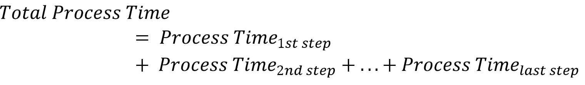

# 绘制你的价值流图

价值流是 SAFe® 的重要组成部分。在我们回顾 *第二章* 时，曾在“*共享责任文化*”部分看到过这一点，我们探讨了 SAFe 精益敏捷原则，并得出了*原则 #10：围绕价值进行组织*。同样地，价值流在 DevOps 中也扮演着关键角色。在《凤凰项目：IT、DevOps 和帮助你的企业成功的小说》中，作者 Gene Kim、George Spafford 和 Kevin Behr 提出了“三种方式”这一概念。第一种方式是利用价值流来建立流程，这正是我们在本章中要探讨的内容。

我们将探讨如何发现组织的价值流并寻找未来的优化空间。总的来说，我们将关注以下活动：

+   使组织的思维模式与价值流保持一致

+   为开发价值流设定背景

+   绘制开发价值流图

+   寻找改进领域

让我们来看看如何让组织从价值流的角度去思考运营。

# 使组织的思维模式保持一致

关注价值流将要求组织进行重大变革，这可能最终导致文化的改变。这些变革努力通常是持续改进旅程的开始。

我们将首先评估一个此类转型的例子：通过实施路线图采用 SAFe。在审视这个路线图时，我们将看到识别价值流在其中发挥了关键作用。

另一个转型指南的例子是由 Cecil “Gary” Rupp 在《通过价值流管理推动 DevOps：使用成熟的 VSM 方法改善 IT 价值流交付，以便在数字经济中竞争》一书中提出的，涉及八个步骤，构成了**价值流管理**（**VSM**）计划。正如本书中所描述的，VSM 计划是 VSM 联盟的参考方法，VSM 联盟是一个致力于推进方法来改善 VSM 的个人和组织群体。

我们将看到，这两种变革指南之间有显著的重叠。因此，可以在 SAFe 转型中实施 VSM（价值流管理）计划，两者互为补充。考虑到这一点，让我们从 SAFe 的实施路线图开始，来审视价值流。

## 向 SAFe 过渡

实施路线图是组织采用 SAFe 的主要模式。该路线图从建立变革代理联盟开始，培训他们适应新的工作方式，然后通过价值流来实施这一过程。路线图可以进行定制，以适应组织的需求。

实施路线图的步骤如下：

1.  达到转折点以采用 SAFe。

1.  培训倡导者和变革代理。

1.  培训高管和领导者适应新的工作方式。

1.  为变革代理创建一个精益敏捷卓越中心。

1.  识别价值流。

1.  制定实施计划。

1.  准备启动第一个 **敏捷发布** **列车** (**ART**）。

1.  培训 ART 并启动。

1.  指导 ART 执行。

1.  启动额外的价值流和 ART。

1.  将 ART 指导扩展到投资组合。

1.  通过检查和适应加速并继续前进。

我们可以看到，这个路线图与之前讨论过的科特变革模型（第二章，《共享责任文化》）一致，特别是在以下表格中所示。

| **科特变革** **模型步骤** | **适用的实施** **路线图步骤** |
| --- | --- |
| 创建紧迫感 | 达到采纳 SAFe 的临界点 |
| 引导强大的联盟 | 培训倡导者和变革代理人，培训高层和领导者新的工作方式，创建精益敏捷卓越中心 |
| 创建愿景 | 识别价值流，创建实施计划 |
| 传播愿景 | 创建实施计划，准备启动第一个 ART |
| 授权他人执行愿景 | 准备启动第一个 ART，培训 ART 并启动 |
| 庆祝短期胜利 | 指导 ART 执行 |
| 整合胜利来创造更多变化 | 启动额外的价值流和 ART，将 ART 指导扩展到投资组合 |
| 将新变化扎根于文化中 | 启动额外的价值流和 ART，将 ART 指导扩展到投资组合，加速并继续通过检查和适应 |

表 7.1 — 科特变革模型与 SAFe 实施路线图的映射

我们可以看到，识别价值流是启动第一个 ART 和随后的 ART 的重要部分。考虑到这一点，我们可以看看启动 VSM（价值流管理）计划的步骤，以帮助识别价值流。

## 转向价值流

VSM 方法论在《推动 DevOps 与价值流管理：通过经过验证的 VSM 方法提高 IT 价值流交付，以在数字经济中竞争》一书中由 Cecil “Gary” Rupp 提出。在这本书中，作者将精益思维中的改进 Kata 模型应用于创建和维持一个或多个价值流。

VSM 方法论概述如下步骤：

1.  承诺精益

1.  选择价值流

1.  学习精益

1.  映射当前状态的价值流

1.  映射价值流的理想未来状态

1.  制定改进（Kaizen）计划，以达到未来状态

1.  实施改进计划

1.  重复这个过程

现在我们理解了映射价值流的整体战略，接下来让我们仔细看看在下一部分中识别价值流的过程。

# 为开发价值流设定背景

开发价值流所做的工作应用于解决方案，而这个解决方案在客户与组织之间获取价值的更大背景中起着作用。这一更大的背景通过组织可能拥有的运营价值流来体现。

我们初步了解了*操作*价值流和*开发*价值流之间的差异，*操作*价值流详细描述了客户的需求以及公司的解决方案如何满足这些需求，而*开发*价值流则展示了开发和维护解决方案所需的步骤，在*第二章*，*共享责任文化*中有提到。在本节中，我们将展示如何利用有用的工具（如 Gemba 走动）来创建一个操作价值流。最后一步是找到操作价值流所使用的解决方案，这些解决方案将成为开发价值流的基础。

## 为价值流识别做好准备

绘制操作和开发价值流可能是一个庞大的工作量，面对组织的复杂性时，这可能会令人沮丧。在进行这项工作之前，一些准备工作是必要的。

价值流绘制通常通过组织内部的不同成员参加的工作坊进行。在举办这样的工作坊之前，您可能想确保组织已经确定以下事项：

+   价值流的范围

+   将会面以识别价值流的团队成员

+   通过 Gemba 走动了解客户的观点

让我们更详细地审视这些内容。

### 确定范围

组织的规模可以是小型的，也可以是庞大的，这取决于组织的历史或设计、生产和维护的产品或解决方案的数量。在发现组织和开发价值流之前，组织应该为发现设定适当的范围。

卡伦·马丁和迈克·奥斯特林在他们的书籍《价值流图绘制：如何可视化工作并与领导对齐进行组织转型》中将范围列出为价值流章程。在书中，他们为价值流章程收集了以下内容：

+   价值流。

+   **特定条件**：限制允许的场景数量可能会有帮助。如果是这种情况，您可能需要设置仅带来期望场景的小范围条件。

+   **触发事件**：启动价值流活动的事件。

+   **需求率**：这是触发事件发生的频率。

+   流程中的第一步和最后一步。

+   边界/限制。

+   **改进时间框架**：这有助于确定应该首先进行的可能的未来状态改进。

+   当前状态的问题和需求。

+   可衡量的目标条件。

+   对客户和业务的价值。

+   负责的团队成员。

让我们在下一节中看看绘制价值流图所需的成员和角色。

### 创建团队

一次价值流图绘制活动可能需要几天时间。在这期间，许多人将被召集提供他们的专业知识，并填写操作和开发价值流所需的价值流章程项目。

在《价值流映射：如何可视化工作并为组织变革提供领导力对齐》中详细列出以下角色：

+   **执行赞助人**：这可能是最终对结果负责的 C 级领导者。他们将监督整个过程，并跟踪价值流朝未来状态的进展。

+   **价值流冠军**：这是一个负责价值流绩效的人。他们在价值流映射中将扮演关键角色。

+   **促进者**：这是确保价值流映射顺利进行的人。

+   **物流协调员**：此人负责为价值流映射做好所有必要的安排。这可能包括为面对面映射会议预订房间或准备虚拟会议所需的网络协作会议配置。

+   **会议参与者**：映射团队的成员将组成其余的团队。这将是一个多样化的团队，他们了解价值流战略要素，并直接经历开发价值流将采取的战术步骤。

应向这些人展示宪章，以便他们为映射研讨会做好准备。可能会出现关于可能情况的问题。他们应被带到研讨会上，以便向所有人传达。

### 通过 Gemba 漫步理解客户的视角

因为操作价值流直接涉及客户，理解客户的视角非常重要，以便解决方案更有价值。通过 Gemba（也称为*现场考察*）漫步是实现这一点的一种方式。

通过 Gemba 漫步，VSM 团队成员将前往客户现场，从客户的视角查看价值流的工作方式，并确定是否需要任何改进。

在进行 Gemba 漫步时，通常有利于从价值流的最后一步开始向前工作。这有助于保持客户视角的关注，重视向客户交付的价值。

Gemba 漫步应该经常发生，以理解不仅客户的心态和价值流从客户角度的影响，还有价值流改进是否达到了预期效果的情况。

*通过价值流管理推动 DevOps：使用经过验证的 VSM 方法论提高 IT 价值流交付，以在数字经济中竞争* 概述了以下步骤作为 Gemba 漫步策略：

1.  确定目标和目标。

1.  提前通知客户 Gemba 漫步访问及其原因。

1.  VSM 团队成员应该以小组形式访问。

1.  追踪价值流的流程。

1.  发现过程及其相关活动中的任何问题。不要归咎于个人。

1.  记录您发现的内容。

1.  识别根本原因。*五个为什么*技术，即反复问*为什么？*五次，是一种有效的追溯根本原因的方法。

1.  倾听。

1.  跟进推荐意见。

1.  重复走一遍以确认推荐的变更已经实施。

1.  重复走一遍，以发现其他 Kaizen（持续改进）机会。

剩余的价值流识别将在专门的研讨会上与团队成员一起进行。让我们仔细看看在研讨会中如何识别一个运营价值流。

## 创建运营价值流

在价值流研讨会的初期活动中，你需要识别运营价值流以及作为开发价值流最终产品的解决方案。

运营价值流通常根据其如何为客户提供价值，分为以下四类：

+   **数字化支持的产品或服务**：该运营价值流处理客户对产品或服务的在线请求。电子商务销售就是一个很好的例子。

+   **制造**：该运营价值流负责创建客户购买的实体产品。

+   **软件产品**：该运营价值流负责交付给客户的软件产品。

+   **支持**：该运营价值流关注支持客户的活动工作流，通常是内部客户。

下面的图表展示了这四类运营价值流的示例：

图 7.1 – 运营价值流示例

识别运营价值流的类别可以让绘图团队查看客户的旅程，并识别所需的可能解决方案。然后，他们可以概述客户为寻找价值所采取的步骤，并为每个步骤创建一个注释。

然后，团队会制定一系列步骤，形成他们的组织价值流，如下图所示，这是我们在*第二章*中首次呈现的运营价值流，*共享责任的文化*。

图 7.2 – 运营价值流示例

确定价值流步骤可能需要在绘图团队之间进行反复讨论，尤其是当存在多种条件时。评估最常见的条件可能更有意义。如果在运营价值流的候选数量上没有达成共识，可以考虑将所有候选方案提出，并观察它如何影响开发价值流。

当我们能够识别以下特征时，我们就能很好地定义一个运营价值流：

+   运营价值流的类型

+   名称

+   价值流描述

+   客户（们）

+   触发因素

+   客户所获得的价值

+   组织所获得的价值

当操作价值流的步骤确定后，接下来的任务是找出操作价值流依赖的解决方案。

## 寻找解决方案

一旦操作价值流的步骤被识别，下一步是查看每个步骤并确定该步骤是否通过解决方案来实现。SAFe 将解决方案定义为产品、系统或服务。解决方案可以是客户直接接触的内容，也可以仅限于内部使用。

解决方案与操作价值流步骤的映射不是一对一的。有些步骤可能需要相同的解决方案，而有些步骤可能不需要解决方案。

也有可能一个解决方案支持多个操作价值流。这样的解决方案及其相应的开发价值流可能在组织中是集中管理的。

我们为示例操作价值流识别了以下解决方案：

图 7.3 – 解决方案和操作价值流示例

一旦我们找到了解决方案，就离找到创造和维持这些解决方案的开发价值流更近了。我们将在下一节探讨如何确定这些开发价值流。

# 映射开发价值流

在 SAFe 中，发现开发价值流让我们更接近将这些价值流建模为 ART 或甚至更大的解决方案列车。

在映射解决方案如何作为开发价值流进行开发时，我们将集中于以下几个方面：

+   过程和工作流

+   参与该过程的人，如供应商和客户

让我们通过考虑用于开发解决方案的过程来开始我们的映射之旅。

## 寻找过程和工作流

在查看开发价值流时，我们可以首先将开发价值流视为一个*黑盒*，只有输入和输出可见。从那里开始，我们可以拼凑出中间的步骤。

开发价值流的初步“黑盒”通过识别以下特征形成：

+   开发价值流的触发点

+   开发价值流的第一步

+   开发价值流的最后一步

+   解决方案的需求率

黑盒的映射可以从确定解决方案开始，如下图所示：

图 7.4 – 开发流黑盒的初步映射

当价值流映射团队的成员就触发点、第一步、最后一步和需求率达成一致时，便可以开始填写第一步和最后一步之间发生的所有步骤。

### 连接各个环节

目前，映射团队开始填充开发价值流的第一步和最后一步之间的各个步骤。《价值流映射：如何可视化工作并对组织转型进行领导对齐》的作者建议步骤数应在 5 到 15 步之间，或者**过程模块**。

需要记住的是，在映射过程中，我们需要查看这些开发价值流的当前状态，确保不会遗漏过程中存在的瓶颈和弱点。如果不了解当前开发价值流的工作方式，很难想象出我们开发价值流的*理想未来状态*。

以下图表详细说明了我们示例开发价值流的各个步骤：

图 7.5 - 包含步骤的开发价值流

一旦确定了各个步骤，团队现在的任务是详细描述每个步骤。让我们看看这部分过程涉及的内容。

### 详细阐述每个步骤

现在步骤已经确定，我们应该看看每个步骤内部发生了什么。以下特征对于理解单个步骤中的内容非常重要：

+   批量大小（如果已定义）

+   缺陷

+   现有队列形式的在制品（WIP）

+   必要的批准

+   步骤指标，如前置时间、周期时间和等待时间

+   资源

请注意，前面的列表代表了步骤之间信息和材料自由流动的障碍。记录当前状态对于确定未来状态非常重要。我们将在*寻找改进机会*部分讨论这些问题。

在全面评估每个过程步骤后，下一步是确定谁负责执行每个过程步骤，以及谁将接收完成的产品。让我们来看看这个部分。

## 找到过程背后的人

确定涉及的人有助于查看潜在的未来状态开发价值流，以确定是否涉及了正确的团队或人员，以及现有团队是否能够承载工作量。

我们将专注于价值流中每个步骤内的以下两个角色：

+   执行过程步骤中工作的人。

+   过程步骤中工作完成后的接收人。他们可能是内部*客户*，因为他们接收来自过程步骤末端的信息和材料，继续下一步的工作，或者他们可能是外部客户。

通过我们收集的信息，我们对当前开发价值流的现状有了很好的了解。接下来，我们将看看是否存在改进的机会。

# 寻找改进的机会

一旦确定了开发价值流的当前状态，映射团队可以寻找改进的领域，并创建一个未来状态的开发价值流。他们还将创建一项改进计划，朝着这个未来状态迈进。

为了达到未来状态，映射团队需要对当前状态的开发价值流应用度量。这些度量将在每个步骤中收集，然后整合到评估整个开发价值流的度量中。

当前状态的开发价值流和未来状态的开发价值流的完整图景被保存在一个 DevOps 转型画布中。这个画布将整个研讨会的工作集中在一个地方，让我们能够看到当前的状态和目标的方向。

让我们通过检查当前状态度量来开始审视未来的状态，看看我们的开发价值流步骤。

## 流程步骤度量

在研讨会中，我们在每个步骤中识别度量，以确定该步骤是否为阻碍流动的瓶颈。通过进行这些测量，我们旨在找出瓶颈，并在未来状态的开发价值流中获得最佳结果。

我们为当前状态的开发价值流中的每个步骤衡量以下度量：

+   交付时间

+   流程时间

+   **完成百分比和** **准确性**（**%C&A**）

现在让我们仔细看看这些度量。

### 流程时间和交付时间

在查看单个流程步骤时，我们想知道从它离开前一个步骤或触发点，到它离开当前步骤的时间总和。这个总时间被称为**交付时间**。

在交付时间内，可能会有等待时间，团队在执行流程步骤时可能在等待批准或审查。或者，也可能有价值添加工作的时间。这些流程步骤中的活动期间被称为**流程时间**。

我们之前在*第四章*，*利用精益流保持工作流畅*中讨论过周期时间，在那里我们看到周期时间与批次大小和团队已经处理的队列大小有关。如果团队在处理一批项目，周期时间将通过以下公式与流程时间相关：

使用这个公式，如果团队一次只处理一项工作，它的周期时间和流程时间将是相等的。

让我们看一个来自我们开发价值流的例子，重点关注价值流中的两个步骤：构建和集成测试。如果构建和测试是手动进行的，没有自动化，那么在构建步骤完成后，可能会有延迟，直到有人接手完成的构建并开始集成测试。集成测试需要 3 小时才能完成。构建到集成测试的典型交接延迟是 5 小时。这使得集成测试的流程时间等于 3 小时。因此，集成测试的交付时间是流程时间（3 小时）加上交接延迟时间（5 小时），即总共为 8 小时。

需要注意的是，提前时间和过程时间之间可能涉及不同的时间尺度。过程时间涉及工作日历（每周 5 个工作日），每个工作日包含 8 小时。提前时间通常使用标准的 7 天一周日历，每天包含 24 小时。在过程时间中可能会有例外，特别是在地理分布的开发环境下，允许*跟随太阳*的工作方式。团队还应明确区分工作周与日历周之间的不同。

### %C&A

另一个过程步骤指标并不是由执行过程步骤的人员决定的，而是由过程步骤的信息或材料的接收者决定的，以便他们能够执行下一个过程步骤。

这些客户或接收者将被询问他们收到的交付物中有多少比例是无缺陷的，并且可以直接使用。这一比例被称为%C&A。

了解%C&A 很重要，因为它有助于识别改进的机会。低%C&A 得分的过程步骤将有更长的提前时间，因为需要进行返工。

让我们看一下开发价值流中的两个步骤：构建和集成测试。如果构建步骤产生的构建失败率是 20%，那么当它进入集成测试步骤时，%C&A 将是*100% - 20% =* *80%*。

一旦确定了所有过程步骤的单个过程步骤指标，就可以计算整个开发价值流的复合价值流指标。

## 价值流指标

在发现单个过程步骤指标后，映射团队成员可以计算整个当前状态开发价值流的指标。这些指标是复合指标；也就是说，它们是通过将单个过程步骤指标相加或相乘得出的。

以下一组指标用于确定开发价值流的整体表现：

+   总过程时间

+   总提前时间

+   活动比率

+   滚动的%C&A

让我们看看如何计算这些指标。

### 总过程时间和总提前时间

我们希望评估开发价值流从最初的触发到功能发布所需的时间。这可以通过将每个过程步骤的提前时间相加来计算。这个总和称为**总提前时间**：

另一个需要关注的复合指标是开发价值流中有多少时间是活跃的开发时间。为此，我们可以将每个过程步骤的过程时间加在一起。这个总和称为**总过程时间**：

总过程时间和总提前时间用于计算下一个我们要看到的指标。

### 活动比率

一旦我们知道了总流程时间和总交付时间，我们可能想要查看开发价值流的生产力。为此，我们将查看总流程时间与总交付时间的比例。这个比例被称为 **活动比率**：

我们现在有了衡量开发价值流生产力的标准。接下来我们将查看的度量标准显示了质量是否嵌入到价值流中。

### 滚动 %C&A

记住，%C&A 是负责*下一个*流程步骤的人员根据交付物是否可用于后续处理而给出的每个流程步骤的测量标准。为了确定整个价值流的 %C&A，我们需要查看滚动的 %C&A。

为了确定滚动的 %C&A，我们将所有流程步骤的 %C&A 相乘。然后我们将该值乘以 100 得到一个百分比：

诸如流程时间、交付时间和 %C&A 等度量标准提供了重要数据，帮助我们确定瓶颈出现的位置。为了改善我们的开发价值流，我们需要看到*理想*的未来开发价值流是什么样子的。现在，让我们来探索如何做到这一点。

## 识别未来的开发价值流

在识别开发价值流的过程中，可能会有很多关于价值流步骤应是什么样子与实际是什么样子的讨论。这种不同的看法有助于理解“理想的”开发价值流，并且可能为开发价值流的演变提供输入。

映射未来状态价值流可能会在当前价值流映射完成并开始运行以收集数据后进行。这些数据对于突出流程中的瓶颈和其他薄弱环节非常有价值。

Karen Martin 和 Mike Osterling 在 *Value Stream Mapping: How to Visualize Work and Align Leadership for Organizational Transformation* 中建议，在接近未来价值流时，应该考虑以下视角：

+   确定价值流中的正确步骤

+   寻找流程流动

+   寻找持续改进

让我们详细查看这些视角。

### 修复流程和步骤

精益思维的一个关键点是消除浪费。我们可以通过寻找那些不增值的流程和步骤并将其移除，来将这一点应用到我们的未来状态价值流映射中。我们首先将步骤分为增值、必要的非增值和不必要的非增值工作。我们尝试优先去除不必要的非增值工作。接下来，我们重新评估必要的非增值工作，看看它是否可以减少，或者是否可以重新分类为不必要的非增值工作并予以消除。

在去除这些步骤时，重要的是考虑这些步骤最初的目的，并确保即使去除步骤后，这个目的仍然可以成立。一个例子是价值流末端的检查步骤。这个步骤的目的是确保质量。如果价值流中包含了各个层级的自动化测试步骤，那么检查步骤就可以被去除，而不会影响质量。

修复价值流的另一种方法可能是增加额外的流程和步骤。如果重点是消除浪费，增加步骤可能看起来有悖常理，但即使是暂时性地增加步骤，也能让团队在价值流中建立新的工作方式，以便以后去除不必要的非增值工作。如果我们关注提高质量，我们可能希望在价值流中增加测试步骤，同时保留检查步骤，这样当我们对测试结果有信心时，就可以去除检查步骤。

### 寻求流程

仅仅确保价值流中有正确的步骤可能还不够。我们还希望确保工作在价值流中的各个步骤之间流动，没有问题或延迟。因此，我们会确保价值流中正在发生流动。

我们为每个价值流步骤收集的指标（处理时间、交付时间和%C&A）对于修复流程非常重要。它们有助于确定哪些步骤是价值流中的瓶颈。我们寻找那些交付时间包含长时间等待的步骤。我们还关注那些%C&A 百分比较低的步骤，因为这些步骤表明可能正在进行返工。

一旦我们找到了瓶颈步骤，就可以应用 Eliyahu M. Goldratt 在其著作《目标》中提出的*约束理论*。约束理论详细阐述了处理瓶颈并实现流动的以下步骤：

1.  确定瓶颈。

1.  决定如何克服瓶颈。

1.  聚焦于克服瓶颈，服从所有其他的关注点。

1.  克服瓶颈。

1.  一旦瓶颈被克服，可能会出现其他瓶颈。返回到*第一步*来处理它们。

在特定步骤中消除瓶颈可能会在其他步骤中引入新的瓶颈，但总体的指标（总处理时间、总交付时间和滚动%C&A）将显示出改进。

### 寻求持续改进

优化步骤和消除瓶颈的结合可能为我们提供更好的价值流，但现在我们还需要确保有方法确保绩效在改善。因此，我们将建立两个到五个**关键绩效指标**（**KPI**），并定期跟踪它们的测量值。这些 KPI 可能涉及成本、质量、安全和士气等方面的测量。

在收集并计算当前和未来状态开发价值流的信息后，将这些信息放置在一个地方进行参考可能会有所帮助，特别是在我们寻求改善我们的价值流时。我们将看一个这样的地方——DevOps 转型画布。

## DevOps 转型画布

DevOps 转型画布可以作为绘制开发价值流的背景，也可以用于识别未来状态和实施步骤，以带我们走向那里。

DevOps 转型画布包含当前状态价值流的区域，并且具有以下特征：

+   触发器

+   第一步

+   最后一步

+   需求率

+   价值流指标（总流程时间，总交付时间，活动比例，以及滚动 %C&A）

为了识别理想的未来状态，DevOps 转型画布包括以下领域，供工作坊期间填写：

+   目标价值流指标（总流程时间，总交付时间，活动比例，以及滚动 %C&A）

+   边界/限制

+   改进项

一个示例的 DevOps 转型画布如下所示。

图 7.6 – DevOps 转型画布

在工作坊完成后，工作开始于改善我们的开发价值流，并衡量改进的效果。这是我们将在下一章深入探讨的主题。

# 总结

在本章中，我们对价值流进行了全面的探讨。我们看到，将我们的活动与价值流对齐是 DevOps 中采用的一项关键方法，并且是通过实施路线图转型 SAFe 的重要组成部分。

我们首先审视了我们组织的现状。我们准备好让团队着手绘制我们的价值流，并通过 Gemba 走访了解我们是如何接收工作的。从这个检查中，我们看到了我们的流程以及其中的任何不足。

然后，我们着手发现并绘制我们的价值流。我们首先绘制了连接我们与客户之间的操作价值流。从那里开始，我们着手研究操作价值流如何通过解决方案为客户创造价值。有了这些解决方案，我们继续研究创建和维护这些解决方案的开发价值流。最后，我们查看了指标，以了解开发价值流的现状，并在努力迈向未来状态开发价值流时衡量我们的改进。

现在我们已经确定了我们的开发价值流，我们将寻找反馈，以查看我们的改进是否产生了预期的效果。下一章将向我们展示如何收集这些反馈。

# 问题

1.  以下哪项在进行价值流绘制时没有被识别？

    1.  触发器

    1.  需求率

    1.  位置

    1.  第一步

1.  以下哪项标识完成一个过程步骤所需的时间，从前一个过程步骤移交开始计算？

    1.  需求率

    1.  交付时间

    1.  流程时间

    1.  周期时间

1.  谁决定过程步骤的%C&A？

    1.  客户

    1.  在过程步骤中工作的人

    1.  在下一个过程步骤中工作的人

    1.  在前一个过程步骤中工作的人

对于剩余问题，使用以下示意的价值流：

图 7.7 – 价值流示意图

1.  总过程时间是多少？

    1.  0.5 小时

    1.  2 小时

    1.  1 小时

    1.  5 小时

1.  总交付时间是多少？

    1.  5 小时

    1.  3 小时

    1.  1 小时

    1.  10 小时

1.  活动比率是多少？

    1.  1.0

    1.  0.66

    1.  0.25

    1.  0.5

1.  滚动的%C&A 是什么？

    1.  100%

    1.  490%

    1.  90%

    1.  400%

# 进一步阅读

+   *《凤凰项目：关于 IT、DevOps 和帮助你的企业赢得胜利的小说》*，作者：Gene Kim, George Spafford, 和 Kevin Behr – 一本关于 DevOps 的“必读”入门书籍。书中介绍了我们用来审视 VSM 的三种方法。

+   [`www.scaledagileframework.com/implementation-roadmap/`](https://www.scaledagileframework.com/implementation-roadmap/) – SAFe 上的一篇文章，讨论了实施路线图。

+   [`www.scaledagileframework.com/development-value-streams/`](https://www.scaledagileframework.com/development-value-streams/) – SAFe 上的一篇文章，讨论了开发价值流及其与运营价值流的关系。

+   *《通过价值流管理推动 DevOps：使用经过验证的 VSM 方法改善 IT 价值流交付，竞争数字经济》*，作者：Cecil “Gary” Rupp – 这是一本关于 VSM 的参考书，包含了价值流映射的指导。VSM 联盟使用的资源。

+   *《价值流映射：如何可视化工作并为组织变革对齐领导力》*，作者：Karen Martin 和 Mike Osterling – 关于如何进行价值流映射的参考书。

+   *《目标》*，作者：Eliyahu M. Goldratt – 本书介绍了约束理论。
