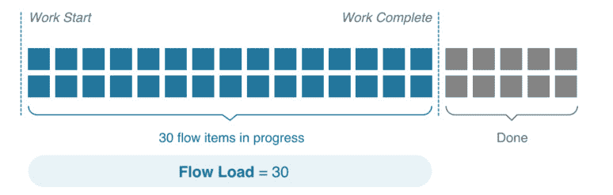

# 测量价值流表现

在上一章中，我们通过参考《凤凰项目：关于 IT、DevOps 以及帮助企业成功的小说》中的三种方法，开始了对价值流的探索。第一种方法是通过建立价值流来实现流动。

本章超越了价值流的建立，转向验证它们的表现。对于本章，我们关注第二种方法：*增强反馈回路*。要遵循第二种方法，我们需要寻找并关注来自价值流的反馈。

我们可以使用度量标准作为反馈机制。出现了几种度量框架，如**DevOps 研究与评估**（**DORA**）指标和 Flow 框架®，它们可以作为反馈回路。

本章将涵盖以下主题：

+   创建良好的度量标准

+   查看 DORA 指标

+   查看 Flow 框架®和 Flow 指标

+   在 SAFe®中的度量标准理解

让我们首先了解如何获得有效的反馈。

# 创建良好的度量标准

我们最初在*第五章*《测量流程与解决方案》中看到过可以应用的不同类型的度量标准，我们在该章中查看了以下三个领域的度量：

+   开发过程

+   环境

+   提供的客户价值

可以充分覆盖这三个测量领域的度量标准集称为**关键绩效指标**（**KPI**）。

KPI 是用来衡量个人、团队、价值流或在我们案例中的**敏捷发布列车**（**ART**）是否实现其目标的度量标准。KPI 在特定时间点以及在给定时间段内进行评估，以突出趋势和目标的偏移或接近。

KPI 应该是客观的度量标准，而非受意见或解释影响。

在审视这些度量时，我们提醒大家避免使用虚荣指标，这些指标提供了不错的信息，但实际上并没有提供有意义的数据。比如网站的点击次数或某个服务的累计订阅者数量。

要设置 KPI，让我们看看下面的图示步骤，正如`kpi.org`所建议的那样。

图 8.1 — KPI 建立过程

让我们详细看看每一步。

## 描述目标或预期结果

在审视预期目标时，理解它是战略性目标还是更具战术性的结果非常重要。理想的目标应该是一个简洁、具体的结果，而不是一个广泛的目标。

这样，KPI 与**目标和关键结果**（**OKR**）是不同的。OKR 通常描述广泛的战略目标，预期的结果作为衡量该战略目标是否实现的标准。以下表格显示了一个 OKR 的示例：

| **目标** | **关键结果** |
| --- | --- |
| 我们通过卓越的可用性和服务在每个机会中让客户满意 | 到第三季度，我们的可用性得分从 6 提高到 9 |
| 到第三季度，我们的客户满意度得分从 7 提高到 10 |
| 每月活跃用户的比例从 56%提高到 65% |

表格 8.1 — OKR 示例

KPI 指示是否达成了具体目标。一个 KPI 的例子是测量**净推荐值**（**NPS**）调查结果，通常来自忠实客户。

如果你已按照上一章节所示进行价值流映射，*第七章*，*映射你的价值流*，那么你期望的价值流未来状态就是你的 ART 或价值流可以努力实现的有效战术目标。

## 了解衡量目标的方法

为了实现你的目标，你需要了解衡量标准是如何工作的。是否有直接的衡量标准与目标相对应？如果有，这些应当是你使用的指标。

然而，如果你无法直接衡量目标，会发生什么呢？在这种情况下，你可能需要考虑提出假设，并通过实验来衡量假设的结果。

## 为每个目标选择衡量标准

既然目标已经设定，并且为每个目标定义了可能的衡量标准，是时候缩小选择范围，选取最重要的测量标准了。在大多数情况下，五到七个 KPI 就足以充分反映价值流的情况。集中精力关注几个关键的衡量标准，比沉浸在大量数据中要更有效。

我们希望我们的 KPI 具备以下特征：

+   回答有关我们表现的问题，以符合我们的目标

+   提供制定策略所需的清晰信息

+   有效且可以验证

+   鼓励员工表现出期望的行为

+   不难获取

现在我们有了衡量标准，接下来需要确定我们的价值流的理想值是什么。

## 如有必要，定义复合指标

可能有些衡量标准单独无法提供所有的信息来达成预期结果。这在目标是无形的情况下尤其重要，比如客户满意度。

如果是这种情况，你可能需要将单个衡量标准汇总成一个复合指标，以便于分析。

## 定义目标或阈值

我们希望看到自己在 KPI 上的表现。为了评估我们的表现，我们需要为每个 KPI 设定一个目标值。这个目标值应处于最佳表现的阈值范围内。阈值还应定义为表现不佳的标准。

## 定义并记录已选的衡量标准

现在我们已经定义了 KPI，并为良好、满意和差的表现设定了目标值和阈值。接下来是扩展和详细说明有关 KPI 的其他信息。

以下附加信息在收集和分析 KPI 时可能有帮助：

+   其预期目标

+   KPI

+   KPI 的描述

+   衡量标准的类型

+   计算该度量标准的公式

+   计量单位

+   测量数据的存储位置

+   谁负责测量并对其负责

+   数据来源

+   收集和报告的频率

+   负责验证的人员

+   负责验证的人员

+   KPI 展示的方法

对于开发价值流，可能可以从一套标准的 KPI 开始。这种标准由 DORA 制定，并在年度调查中进行考察。让我们来看一下这些指标，并看看它们在新的开发价值流中的适用性。

# DORA 指标

自 2014 年以来，DORA 的 Nicole Forsgren、Gene Kim、Jez Humble，以及 Puppet 的 Alanna Brown 每年都会发布一份详细说明 DevOps 采纳状态的报告。每年，他们都会详细介绍 DevOps 采纳的总体情况以及受访者在采纳 DevOps 实践方面的成熟度。

2016 年，他们概述了一些旨在衡量不同组织中 DevOps 实践吞吐量和稳定性的指标。这些指标被称为 **DORA 指标**。

年度报告作为 DevOps 实践融入程度及其效果的晴雨表。每年，报告都会指出 DevOps 运动的以下几个方面：

+   关键 KPI

+   基于 KPI 的组织绩效水平

+   即将到来的趋势

现在让我们逐一查看这些方面。

## DORA KPI 指标

《加速：DevOps 状态报告》通过以下四个指标来确定参与组织的绩效水平：

+   交付时间

+   部署频率

+   变更失败率

+   平均修复时间

前两个指标衡量组织的速度，或组织将变更交付到生产环境的速度。第三和第四个指标则衡量组织的稳定性，或者说组织在保持生产环境运行方面的能力。

让我们更详细地了解这些指标。

### 交付时间

我们在前一章节中讨论过交付时间，*第七章*，*映射您的价值流*。在这一章节中，我们看到每个过程步骤都有一个交付时间。总交付时间是所有过程步骤的交付时间之和。

DORA 指标关注的是变更的交付时间 —— 即从提交代码到版本控制库到将代码部署到生产环境的时间。这是总交付时间的一个子集。书籍《加速：构建与扩展高性能技术组织》的作者，Nicole Forsgren、Jez Humble 和 Gene Kim（所有人都是 DORA 指标定义的关键贡献者）指出，交付时间应该排除与设计相关的任何交付时间。这主要是因为设计交付时间何时开始计时存在不确定性。交付时间更容易测量且抗干扰性强。

让我们来看一下下面这个示例价值流的插图：

图 8.1 — DORA 前置时间的示例价值流

在上图中，我们看到通过持续集成，自动化在非生产环境中执行测试。如果没有发现错误，则该过程需要 4 小时，之后变更会被部署到暂存环境中。

在暂存环境中，可能没有进行自动化测试。这或许可以解释为什么从暂存环境到生产环境的迁移时间需要 40 小时。

所以，对于这个价值流，我们将每个阶段的时间加总（4 小时 + 40 小时），得出总前置时间为 44 小时。

### 部署频率

DORA 指标考察的是组织成功将代码部署到生产环境的频率。

如果我们继续使用我们的价值流示例，其前置时间为 44 小时，或 1.83 天（因为前置时间是按照 24/7 日历进行度量的），我们可以看到他们每月大约部署 16 次。

### 变更失败率

该指标是对部署过程质量的考察。它衡量发布到生产环境时，服务是否会出现降级或失败的情况，需要通过回滚、修补或实施热修复来进行修复。

确定变更失败率来源于检查部署记录，并查看是否有任何部署直接导致了生产环境的失败。

假设在我们的价值流中，我们查看了过去 12 次部署。在这 12 次部署中，生产环境遇到了三次问题。

我们的变更失败率将通过以下计算得出：

= 3/12 = 25%

### 恢复时间

该指标考察的是在生产环境中发生的服务故障。在这些故障中，恢复服务需要多长时间？

通常，当发生多个故障时，恢复时间指标以**平均恢复时间**（**MTTR**）表示，即恢复的平均时间。

在我们的价值流中，对于过去 12 次部署中的三次失败，如果每次失败的修复时间分别是 3 小时、2 小时和 7 小时，那么平均修复时间将是以下计算结果：

 = 4 小时

对于前述的四个指标，DORA 进行了响应的聚类分析，并确定了四个绩效水平。我们来看看这些级别。

## DORA 指标绩效水平

每年在《加速：DevOps 状态》报告中，DORA 会分析反馈，查看受访者的表现水平。从四个 DORA 指标的 KPI 出发，他们创建了以下四个绩效水平：

+   精英

+   高

+   中等

+   低

每年的调查报告都会改变各个层级的标准。这是由于不仅每个组织的实践有了整体改善，行业整体的实践也在提升。2021 年的报告显示，Elite 或 High performer 层级的受访者人数相比往年有所增加，这表明持续改进在采用 DevOps 实践中的重要作用。

2022 年《DevOps 状态报告》在这些绩效水平上发生了重大变化。首次移除了 Elite 层级。调查结果表明，表现最好的群体的表现不再达到去年 Elite 层级的标准。需要更多的数据来寻找可能的原因。

## 《DevOps 状态报告》中的新兴趋势

为了适应变化的时代，调查还包括了一些关于组织环境的辅助问题，以便观察新兴的方面。最近的两份报告（2021 年和 2022 年）包含了以下附加内容：

+   自 2018 年以来，DORA 增加了另一个指标：可靠性。这个指标不仅衡量软件交付的表现，还衡量组织维护其环境或运营表现的能力。

+   DORA 自 2019 年以来一直在研究云基础设施的采用，指出云技术的采用是一项促进技术，能够提高所有四个 DORA 指标的 KPI。

+   2021 年的报告开始调查 SRE 实践的采用情况，作为寻找与可靠性相关性的一个途径。

+   除了调查技术 DevOps 实践外，DORA 还扩大了调查范围，涵盖了集成到开发过程中的文档和安全实践。

+   由于 COVID-19 大流行对既定工作模式的冲击，调查中增加了衡量组织在避免员工倦怠的同时，能够继续交付的复原力的问题。

+   作为安全实践调查的一部分，2022 年《DevOps 状态报告》调查了公司是否采取措施确保其软件供应链的安全。这些措施属于两个标准化框架之一：**软件工件供应链等级**（**SLSA**）和 **安全软件开发** **框架**（**SSDF**）。

DORA 指标提供了一个很好的初步视角来衡量 KPI，但通常并非所有价值流所做的工作都直接与提供客户价值相关。为了衡量这些 KPI，采用 Flow Framework® 并衡量 Flow Metrics® 可能是一个不错的选择。接下来，我们来看看 Flow Framework® 模型。

# Flow Framework® 和 Flow Metrics®

Flow Framework® 模型在 Mik Kersten 的书籍 *Project to Product: How to Survive and Thrive in the Age of Digital Disruption with the Flow Framework* 中有详细描述。在这本书中，Kersten 解释了如何从基于项目的设计转向使用长期价值流进行产品开发。

为了衡量价值流的表现，Kersten 提出了流程框架®，这是一种流程文档结构，并使用流程度量®来衡量这些文档。

Kersten 最初制定了流程框架®，以衡量他所在公司 Tasktop 的软件交付流。通过审视 Tasktop 的价值流，Kersten 确定了他希望监控的以下四个结果：

+   价值

+   成本

+   质量

+   幸福感

他将这些项目与四个流程项相关联，这些流程项是 Tasktop 的价值流所做的工作类型。为了跟踪这些流程项的进展，Kersten 找到了四个这些流程项所表现出的流程度量®。

让我们通过检查四个流程项来开始了解流程框架®。

## 流程项

Kersten 确定了价值流所做的以下四种类型的工作：

+   待交付功能

+   缺陷修复

+   风险规避

+   技术债务减少

每个项目在利益相关者和这些项目的价值方面都有独特的差异。

### 功能

功能是带来直接商业价值的项目。客户从价值流中拉取功能，以提供他们想要或需要的解决方案。这项工作被认为是价值流将交付的主要类型的工作。

在 SAFe® 中，流程框架®的功能可以映射到功能，即将工作项分解为用户故事和启用故事，这些故事的时间框定为一个 **程序增量** (**PI**)。

### 缺陷修复

价值流可能还会致力于修复发现的任何缺陷。这些修复可能是开发过程中发现的缺陷，也可能是已进入生产环境的缺陷。无论缺陷何时被发现，客户都会作为解决方案的一部分来拉取修复。

SAFe 没有直接识别修复缺陷的单独工作，但这类工作通常作为价值流使用的工作跟踪系统的一部分进行追踪。例如，当使用 Jira 的价值流识别出一个单独的问题类型（缺陷），以追踪修复缺陷的工作量。

### 风险规避

价值流可能会在合规、安全、治理和隐私等重要 **非功能需求** (**NFRs**) 的组织中工作。这些非功能需求可能与它们所在的行业相关，这些行业可能有重要的合同要求或需要遵守的法规。旨在降低风险的项目由价值流交付给不同的利益相关者。这些利益相关者通常是组织内部的人员，如安全或治理团队。

在 SAFe 中，旨在满足非功能需求并减轻或消除风险的项目被称为合规启用项。时间框定为 PI 的合规启用项被识别为 ART 在一个 PI 内完成的功能，而以故事大小为单位的合规启用项则由 ART 内的个别团队进行处理。

### 技术债务减少

降低技术债务是价值流进行的重要工作。如果技术债务未能管理到可控水平，其他流动框架®项（特性、缺陷修复和风险规避）的交付将会受到架构不足的影响。

SAFe 将流动框架®的债务项归类为使能项。在讨论流动框架®的风险时，我们已经看到过合规使能项。其他类型的使能项有助于维持产品或解决方案的架构。

基础设施使能项由 ART 和团队使用，以增强开发过程。这类工作包括自动化测试和部署的集成与维护。

架构使能项直接改善 ART 产品或解决方案的架构。为了使这些改进能为未来特性所利用，一系列架构使能项被创建，这些被称为架构跑道。

探索使能项允许 ART 团队成员研究未知技术或确定最佳的功能实现方法。尖峰（Spikes）是探索使能项的常见例子。

使用流动框架®进行测量的价值流将其工作划分为这四个流动项。现在，我们将看看应用于这些项的度量。

## 流动度量

在流动框架®中，我们希望看到我们的价值流在所有工作类型中的表现。为此，我们将对每个流动项应用以下度量：

+   流动速度®

+   流动时间®

+   流动负荷®

+   流动效率®

此外，我们还有一个指标——流动分布®，这样我们可以看到价值流在哪些流动项上投入最多。

现在，让我们深入了解每个指标。

### 流动速度®

流动速度®查看在标准时间单位内完成的流动项数量，无论其类型如何。以下图表说明了一个价值流的流动速度®：

图 8.3 — 流动速度®的插图（版权 © 2018 Tasktop Technologies, Incorporated. 保留所有权利。经许可发布）

这类似于在 Scrum 中测量速度。一个稳定且运行良好的价值流将保持在多个时间周期内流动速度®的一致性。

### 流动时间®

流动时间®是完成单个流动项所需的时间，从它被接受到价值流中，到它从价值流中发布为止。流动时间®包括活跃时间和等待时间。以下图表说明了流动时间®：

图 8.4 – Flow Time® 插图（版权 © 2018 Tasktop Technologies Incorporated。保留所有权利。经许可发布）

Flow Time® 和交付时间的区别在于后者是一个客户指标。使用 Flow Time® 时，我们旨在确定开发我们的产品或解决方案所需的时间长度。

### Flow Load®

我们在 *第四章*中讨论了大量 WIP 带来的问题，*利用精益流动保持工作进行*。Flow Load® 是 WIP 的一种衡量标准。如以下示意图所示，我们可以看到正在进行的 Flow Items 数量与 Flow Load® 的关系：

图 8.5 – Flow Load® 插图（版权© 2018 Tasktop Technologies Incorporated。保留所有权利。经许可发布）

记住，正如大量 WIP 会导致更长的交付时间和较低的性能，高 Flow Load® 值是性能降低的标志，这将导致更长的 Flow Times® 和降低的 Flow Velocity®。

### Flow Efficiency®

我们之前看过 Flow Time®，并看到它包括了价值流在积极工作时和在某个过程步骤上等待时的时间。你可以通过观察积极时间与 Flow Time® 的比率来计算效率。

以下示意图通过计算 Flow Efficiency® 来完成我们之前关于 Flow Time® 的示例：

图 8.6 – Flow Efficiency® 插图（版权 © 2018 Tasktop Technologies Incorporated。保留所有权利。经许可发布）

Flow Efficiency® 类似于在 *第七章*中介绍的活动比率，*绘制你的价值流*。不同之处在于 Flow Efficiency® 关注的是价值流的开发视角。

### Flow Distribution®

在查看到目前为止的 Flow Metrics® 时，我们还没有考虑正在测量的 Flow Item 类型。接下来我们将通过 Flow Distribution® 来指导我们判断价值流的工作是否平衡。

Flow Distribution® 查看某个价值流完成的 Flow Items 数量，并衡量每种类型的 Flow Item 占总 Flow Items 数量的百分比。Flow Distribution® 的计算通过以下示意图演示：

图 8.7 – Flow Distribution® 插图（版权 © 2018 Tasktop Technologies Incorporated。保留所有权利。经许可发布）

在 SAFe 中，通过查看 Flow Distribution®，ART 可以确定特性和使能器的适当分配比例，从而在交付客户价值和确保所需改进之间保持适当平衡。

# 在 SAFe 中的度量

在查看组织的价值流（作为 ART 实现时）时，Scaled Agile 建议从以下三个方面评估其表现：

+   成果

+   Flow

+   能力

让我们看看在 SAFe 中如何衡量这三个方面。

## 在 SAFe 中衡量成果

衡量成果的主要机制来源于建立和衡量价值流的 KPI。

我们在 *第五章*，*衡量过程和解决方案* 中看到了一些衡量客户成果的 KPI 框架，如 **海盗**（**ARRRR**）指标和适用性指标。为团队或 ART 确定 KPI 集合在本章前面已讨论过。

验证来自 Epic 的效益假设可能会导致理想的结果。Epic 开发通过创建 **最小可行产品** (**MVP**) 并使用前导指标来衡量假设的价值，从而进行实验性地完成。密切监控前导指标会产生证据，验证或否定 Epic 假设，允许我们在进一步的 Epic 开发中进行 *转向或坚持*。

ART 上的敏捷团队还希望衡量他们在每个迭代中创建的迭代目标，以及他们为每个 PI 创建的 PI 目标。这些目标帮助团队集中精力，不是完成每个特性和故事，而是确保交付客户价值。

## 在 SAFe 中衡量 Flow

团队或 ART 决定采用的一些价值流 KPI 将与确保交付价值的表现相关。Scaled Agile 推荐使用 Flow Framework® 中的 Flow Metrics® 来确保 Flow 成功地实现产品交付。前面部分已经讨论了这些 Flow 项目和对应的 Flow Metrics®。

此外，Scaled Agile 还推荐一种额外的 Flow 指标：Flow 可预测性。该指标衡量团队和 ART 规划 PI 并实现 PI 目标的能力。

为了衡量 Flow 可预测性，团队和 ART 使用 SAFe **程序可预测性度量** (**PPM*)。计算 PPM 时，团队查看 PI 规划期间确定的 PI 目标的原始业务价值。然后，他们将这些值的总和与在 PI 结束时的检查与适应研讨会上确定的已承诺和未承诺 PI 目标的实际业务价值进行比较。该度量通过以下公式确定：

以下表格显示了团队 PPM 计算的一个示例：

|  | **PI 目标** | **计划（原始）** **业务价值** | **实际** **业务价值** |
| --- | --- | --- | --- |
| 承诺目标 | 将索引速度提高 50% | 9 | 4 |
| 构建并发布电子商务功能 | 10 | 10 |
| 构建并发布智能搜索功能 | 8 | 4 |
| 未承诺目标 | 向数据库中添加 2,000 个新产品并对其进行索引 | 7 | 7 |
| 使用比特币支持购买 | 5 | 0 |

表 8.2 — 团队 PPM 计算示例

在前表中，承诺和未承诺 PI 目标的实际业务价值总和为 25。计划的业务价值总和为 27。然后，团队的 PPM 为 25/27：

图 8.8 — 团队预测性汇总示例到 PPM（© Scaled Agile, Inc. 版权所有）

上图显示了创建 PPM 的汇总过程。ART 通过对组成 ART 的各个团队的 PPM 值取平均来获得 PPM。

## 在 SAFe 中衡量能力

从更宏观的角度来看，采用 SAFe 的企业致力于实现业务敏捷性，在这里，战略与执行相结合，通过频繁交付客户价值来实现业务成果。

在 SAFe 中，业务敏捷性通过自我评估组织不同部门所实践的以下七项核心能力来衡量：

+   团队和技术敏捷性

+   敏捷产品交付

+   企业解决方案交付

+   精益组合管理

+   组织敏捷性

+   持续学习文化

+   精益敏捷领导力

团队和 ART 使用 DevOps 健康雷达评估他们在采纳 DevOps 原则和实践方面的能力。让我们来看看如何使用 DevOps 健康雷达。

### DevOps 健康雷达

DevOps 健康雷达是一个工具，列出了与持续交付管道的四个方面相关的所有活动。DevOps 健康雷达的示意图如下：

图 8.9 — DevOps 健康雷达（©Scaled Agile, Inc. 版权所有）

对于持续交付管道的每个 16 项活动，团队和 ART 根据其在执行活动方面的成熟度进行自我评分。评分范围从 Sit（1 到 2），Crawl（3 到 4），Walk（5 到 6），Run（7 到 8）到 Fly（9 到 10），即顶峰。

团队和 ART 应定期使用 DevOps 健康雷达自我评估，以跟踪其 DevOps 性能的成熟度。此评估可在 Scaled Agile Framework 网站上免费获取，网址为 [`www.scaledagileframework.com/?ddownload=38794`](https://www.scaledagileframework.com/?ddownload=38794)。我们将在*第三部分*中探讨持续交付管道及其活动。

# 摘要

在本章中，我们希望通过通过扩大反馈回路来采用第二种方法，确保我们走在正确的道路上。我们将为价值流使用的关键反馈回路通常是度量指标。

在选择指标时，我们希望将其视为 KPI。我们了解了如何从期望的目标开始，查看与这些目标相符的指标，精炼要收集的指标集合，并将它们收集为 KPI。

我们首先查看了作为 KPI 集合的一部分可以使用的一个标准指标：DORA 指标，它构成了年度《加速 DevOps 状态报告》的基础。通过收集这些指标并持续改进，可以通过与其他组织的比较，识别一个具有基准绩效水平的价值流，这些数据来自年度报告。

如果要查看除了提供客户价值之外的其他类型工作，可以查看 Tasktop 创建的 Flow Framework®。通过 Flow Framework®，我们概述了定义价值流所做工作的四个流动项，并为每个流动项设置了四个流动指标®，同时将流动分布®应用于一组流动项。

现在我们已经了解了如何查看反馈的测量指标，我们将进入第三种方式，应用持续实验和学习。在下一章中，我们将探索如何实现这一点的方法。

# 问题

1.  一个价值流应拥有的最佳 KPI 数量是多少？

    1.  2 到 4

    1.  5 到 7

    1.  6 到 9

    1.  10 到 12

1.  哪一项不是 KPI 的特征？

    1.  是有效的并且可以验证

    1.  鼓励员工做出期望的行为

    1.  回答关于向目标进展的问题

    1.  很难收集

1.  哪一项不是 DORA 指标 KPI？

    1.  周期时间

    1.  部署频率

    1.  变更失败率

    1.  平均修复时间

1.  DORA 指标的哪些 KPI 衡量稳定性？（选择两个）

    1.  交付时间

    1.  周期时间

    1.  部署频率

    1.  变更失败率

    1.  平均修复时间

1.  哪一项不是 Flow Framework® 中的流动项？

    1.  特性

    1.  项目

    1.  风险规避

    1.  技术债务减少

1.  哪一项不是 Flow Framework® 中的流动指标®？

    1.  流程速度®

    1.  流程负载®

    1.  流程可预测性®

    1.  流程时间®

# 进一步阅读

要了解更多关于本章中讨论的主题，请查看以下资源：

+   *《凤凰项目：IT、DevOps 和助力业务成功的小说》* 由 Gene Kim、George Spafford 和 Kevin Behr 编写

+   [`f.hubspotusercontent00.net/hubfs/8944057/The%20State%20of%20Value%20Stream%20Management%20Report%202021.pdf`](https://f.hubspotusercontent00.net/hubfs/8944057/The%20State%20of%20Value%20Stream%20Management%20Report%202021.pdf) – 来自价值流管理联盟的 2021 年《价值流管理状态报告》

+   [`kpi.org/KPI-Basics`](https://kpi.org/KPI-Basics) – 介绍如何定义 KPI 以及如何制定你的 KPI 集合

+   [`www.devops-research.com/research.html#reports`](https://www.devops-research.com/research.html#reports) – DORA 和 Puppet Labs 发布的《加速 DevOps 状态报告》的所有版本的登陆页面

+   [`cloud.google.com/blog/products/devops-sre/the-2019-accelerate-state-of-devops-elite-performance-productivity-and-scaling`](https://cloud.google.com/blog/products/devops-sre/the-2019-accelerate-state-of-devops-elite-performance-productivity-and-scaling) – DORA 发布的 2019 年《加速 DevOps 现状报告》的发现

+   [`cloud.google.com/blog/products/devops-sre/announcing-dora-2021-accelerate-state-of-devops-report`](https://cloud.google.com/blog/products/devops-sre/announcing-dora-2021-accelerate-state-of-devops-report) – 2021 年《加速 DevOps 现状报告》的发现

+   *《从项目到产品：如何在数字化颠覆的时代中生存与发展，运用 Flow Framework》* 由 Mik Kersten 撰写 – 这是 Flow Framework®各个方面的参考书，包括 Flow 项目和 Flow 指标

+   [`flowframework.org/flow-metrics/`](https://flowframework.org/flow-metrics/) – 来自 Flow Framework® Institute 的 Flow 指标分析

+   [`www.scaledagileframework.com/devops/`](https://www.scaledagileframework.com/devops/) – 这是[scaledagileframework.com](http://scaledagileframework.com)网站上的一篇文章，其中提供了 DevOps 健康雷达的描述等内容。

+   [`www.scaledagileframework.com/metrics/`](https://www.scaledagileframework.com/metrics/) – 这篇来自[scaledagileframework.com](http://scaledagileframework.com)网站的文章阐述了 KPI、Flow 指标和其他评估形式之间的相互作用
