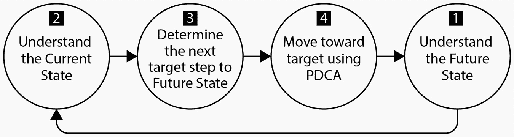
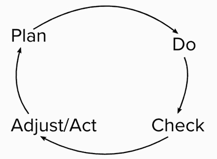

# 9  

# 带着持续学习迈向未来  

到目前为止，我们已经通过《凤凰项目：关于 IT、DevOps 与帮助你的企业成功的小说》中提到的*三种方式*来研究价值流管理。通过第一种方式——建立流动性，我们探讨了如何确定并绘制我们的开发价值流。在第二种方式中，我们通过采用有意义的 KPI 来加强我们价值流中的反馈回路。  

现在我们来看第三种方式：持续学习和实验。DevOps 的一个关键部分是认识到转型之旅没有终点。也就是说，你的组织将不断改进并设定进一步的目标，以创造更强大的价值流。随着你不断发现和优化，未来的价值流将会更加完善且没有尽头。  

在本章中，我们将通过讨论以下主题来研究如何为你的价值流寻找未来状态：  

+   采用持续学习文化  

+   利用改进 Kata 来识别未来状态的价值流  

+   将精益改进周期的所有部分作为改进 Kata 的一部分来实施  

让我们从深入探讨持续学习开始我们的探索。  

# 理解持续学习  

1990 年，彼得·先锋（Peter Senge）出版了《第五项修炼：学习型组织的艺术与实践》。在书中，他描述了公司要成为学习型组织所需具备的特质或学科。  

学习型组织允许员工通过自己的努力促进学习。这种学习推动组织的持续转型，使其不断追求改进。在今天的商业环境中，学习速度比竞争对手更快的组织具有显著的优势。  

先锋（Senge）识别了学习型组织必须具备的以下五个特点或学科：  

+   个人精通  

+   心智模型

+   共同愿景  

+   团队学习  

+   系统思维  

当组织在前四个学科上取得进展时，第五个学科——系统思维，将帮助组织进入下一阶段，成为学习型组织。  

让我们仔细看看每个学科，看看如何在该学科上变得精通，并朝着成为学习型组织的目标前进。  

## 个人精通  

组织无法学习，除非组织内部的个体学习。组织内部的个体寻求成长并持续学习。先锋称这种动力为**个人精通**，它是传播到整个组织的种子。  

建立个人精通的个体将发现两个在其发展中起作用的工具：  

+   **愿景**：个体学习他们对自己重要的东西  

+   **视角变化**：将当前现实视为有助于或阻碍愿景的因素  

随着个人发展愿景并通过个人精通看到当前现实，他们会遇到愿景与当前现实之间的张力。这些张力是自然存在的，包括*创造性张力*，即愿景与当前现实之间的差距，以及*情感张力*，即个人在面对创造性张力时所感受到的情绪。

除了创造性张力和情感张力，个人还可能意识到*结构性冲突*。这些结构性冲突是当无法应对创造性和情感张力时，感到无力或不配的压倒性情绪。

在遇到前述的张力和结构性冲突时，以下反应可能会作为应对机制出现：

+   让我们的视野逐渐消退，以实现一个*更简单*的目标

+   冲突操控，即我们专注于避免我们不想要的东西

+   采用*意志力策略*，即个人通过压倒性的力量克服张力、冲突及其他阻力，以实现愿景

为了确保我们通过意志力策略来发展个人精通，个人必须诚实并拥抱真理。这使得能够从多个角度看待创造性的张力，并允许从多个角度出击以实现愿景。另一种有效的策略是学习不仅仅发生在意识层面。擅长个人精通的人允许潜意识发挥作用。一个例子就是不断重复一项新技能，直到它成为*肌肉记忆*。

随着个人发展个人精通并朝着愿景前进，以下一些变化会逐渐显现：

+   理性和直觉开始融合。这使得能够从多个角度看待问题。

+   个人开始看到自己与世界之间更多的联系。

+   同情心开始建立。

+   个人看到整体，并开始致力于那个整体。

这些特质是组织从个人身上所需要的。因此，组织必须朝着允许并鼓励员工走向个人精通的方向努力。它们需要创造一种鼓励愿景创造的氛围。它们必须赋予个人自由去探究并寻求真理。有时，这可能涉及质疑现状。这些自由会造就更好的个人，进而促进组织的成长。

随着个人在个人精通方面的成长，他们可能会改变他们的愿景和对当前现实的认知。这种变化会影响他们已经创造并使用的心智模型。接下来，我们将探讨这些心智模型的意义。

## 心智模型

我们之前看到，当个人发展个人精通时，他们会遇到创造性的张力，或者他们会看到他们的愿景与当前现实之间的差距。这种创造性的张力可能源自他们对世界运作方式的认知。这些认知，简单来说，就是作为学习型组织的**心智模型**。

思维模型塑造了学习者的感知，并服务于以下两个主要目的：

+   它帮助个人理解周围的世界

+   它告知个人如何采取行动

思维模型为个人和组织提供有关当前情况下某个特定问题有效的解决方案。因此，学习型组织通过在面对新信息时改变其思维模型而受益。

以下是个人和学习型组织在增加或改变思维模型时所需要的内容：

+   促进个人意识和反思技能的工具

+   试图制度化实践并将其与思维模型联系起来的基础设施

+   促进探究并允许对现有思维进行挑战的文化

森吉（Senge）确定了几个工具，帮助轻松改变思维模型。让我们仔细看看这些工具。

### 反思性实践

反思性实践是学习过程中进行反思的行为，以判断新信息是否符合现有的思维模型，或者是否需要创建新的思维模型。

反思是调整思维模型的关键工具。那些允许反思的人在这个领域做得很好。

### 宣称的理论与实际使用的理论

培养反思性实践技能使得进行比较变得容易。一个这样的比较是，宣称的理论与该理论应用之间是否存在差距。

以下是典型的比较方法，用以判断现有思维模型是否有效：

+   **质疑抽象跃迁**：看看你所看到的是否基于事实，还是仅仅是一个泛化的观点。

+   **左栏分析**：将某人所思考的内容（写在左栏）与他们所说的内容（写在右栏）进行比较。这个由克里斯·阿吉里斯（Chris Argyris）创造的练习使我们能够看到思想与实际说法之间的差异，揭示我们的先入之见和偏见。

左栏分析可以帮助人们了解他们真正的想法和感受，并以更透明的方式传达这些想法。正确使用时，这种方式可以让对话更具生产力，因为它带来了透明度。

为了进行左栏分析，找一张纸将其分为两栏。选取一次最近的对话，将对话中说的话写在右栏。回忆你对所说内容的想法和感受，并将它们记录在左栏，将想法与所说的内容对齐。

以下表格展示了一个左栏分析的例子。

| **我** **在想什么** | **说了什么** |
| --- | --- |
| 他难道不知道我已经够忙了吗？我不确定还能应付更多。 | 老板：你能帮我个忙吗？我：我想可以。什么忙？ |
| 真的吗？三个月前我就已经失败了！他真想让我在纽约的更大人群面前再失败一次吗？ | 上司：由于你三个月前在会议上表现出色，我和市场团队想知道你是否愿意下个月在纽约的会议上发言。 我：那确实很吸引人。 |
| 我怎么才能逃避这个任务？ | 上司：太好了！让我给你发关于会议的详细信息。 我：好的，谢谢！ |

表格 9.1 – 左列分析，展示了思考与言语之间的区别

定期检查和调整思维模型的能力是第五项学科——系统思维的一个重要推动力。在面对新信息时不调整思维模型，会阻止组织看到整体，从而无法以整个系统的视角进行思考。

一个发展思维模型的例子来自 Scrum。Scrum 团队通常会用故事点来估算故事的工作量。Scrum 团队通常通过计划扑克来估算故事点。在计划扑克中，团队成员聚集在一起，协作发展*1 点故事*的概念，这个概念指的是完成一个故事所需的最小努力量，并作为相对比较其他故事的基准。

在计划扑克中，团队成员聚集在一起，并被分发一套卡片，上面标有故事点数。产品负责人朗读故事，团队成员分别选择一张卡片，上面显示他们认为该故事所需的故事点数。Scrum Master 作为协调员，随后倒数计时，所有成员同时揭示他们的选择。那些选择不同值的成员被邀请解释他们选择的原因。这个全体成员的讨论帮助团队构建一个关于如何看待整个团队工作的模型。

随着组织中对思维模型的认同逐步建立，它就成为了共享愿景的基础。让我们看看这个共享愿景有多重要。

## 共享愿景

在*第二章*《共享责任的文化》中，我们探讨了生成型文化。请记住，生成型文化的成员专注于共同的使命。共享的使命激励成员，团结团队成员，赋予他们专注力，去做任何必要的事情。

这个共享的使命可以被看作是**共享愿景**，这是 Senge 所说的学习型组织的一项学科。共享愿景简单来说，就是对“我们到底在建设什么？”这个问题的回答。

许多组织从外部导向或注重外部的愿景开始，比如*超越其他竞争者*。这种类型的愿景存在问题，它们往往是短暂的；一旦实现了目标，接下来怎么办？最好的愿景是内在的，或者说是专注于内部的，这些愿景会让学习型组织在不同情况下不断前进。

另一种可能无法作为共享愿景延续的愿景是*消极愿景*。消极愿景描述的是组织想要避免的事情，而不是它想要成为的样子。这种思维方式分散了组织所需的能量，剥夺了组织实现长期愿景的机会。回避策略也意味着组织无法改变其命运。这类愿景仅在短期内有效，无法为组织提供任何长期愿景。

共享愿景来自个人愿景。由个人掌控力产生的个人愿景来源并不一定来自领导者或预定的过程。组织中的任何人，只要保持清晰的愿景，并积极质疑当前现实，都能分享他们所发现的东西并邀请他人跟随。

随着愿景的传播，分享愿景并邀请他人跟随时可能会出现多种反应。以下是可以预见的几种反应：

+   招募

+   认同

+   承诺

+   合规性

+   不合规

+   冷漠

在上述列表中，前三项（招募、认同和承诺）是有利的反应，能够帮助将个人的愿景转化为共享愿景。列表中的其他反应（合规、不合规、冷漠）则是达成广泛共识的挑战，而这种共识是愿景成为组织*共享*的必要条件。

将一个愿景从个人转变为组织的过程确实包含了几个挑战。大量不同的观点可能削弱专注力，并在组织内引发冲突。共享愿景和当前现实之间的差距可能让组织中的人感到沮丧。人们可能会忘记自己是集体的一部分，从而失去彼此之间的联系。

分享愿景可能需要创新的合作方式。在《哈佛商业评论》的一篇文章中（[`hbr.org/2011/07/are-you-a-collaborative-leader`](https://hbr.org/2011/07/are-you-a-collaborative-leader)），Salesforce 公司的 CEO 马克·贝尼奥夫邀请了 5000 名员工参加一场*虚拟*的离线管理会议。结果立竿见影：公司全员参与的对话迅速展开。对话持续了数周，并促成了一个更具赋能感和使命感的公司。

共享愿景的其他建议来自 Empuls 的 Veena Amin 撰写的博客文章（[`blog.empuls.io/organizational-vision/`](https://blog.empuls.io/organizational-vision/)）。在文章中，她给出了以下建议：

+   **统一组织**：领导者的任务是找到并汇聚组织的各个部分，传达愿景。

+   **让每个人都参与进来**：一旦大家都聚集在一起，领导者应与每个人沟通，即使他们的角色在组织中看似不重要或不核心。

+   **设定上下文**：优秀的领导者会找到一种方式，将愿景与组织当前的状态联系起来。

+   **转变控制**：愿景的完善需要一种合作方式，这通常意味着要牺牲控制权。为了实现这一点，可能需要在组织层面移除一些控制。

在共同愿景的创建过程中，组织通过应对这些挑战，改进了其他领域的能力。通过个人掌握，愿景将朝着理想现实迈进。个人掌握的过程改变了组织的心智模式。我们会看到，通过团队学习，启动个人掌握并实现心智模式的改变，以达成共同愿景的过程。让我们来探讨团队学习的内容。

## 团队学习

当从当前现实到共同愿景的个人掌握之旅时，个人需要通过学习来完成这段旅程。一开始，这种学习是个体进行的。有效的团队最终会汇聚在一起，作为一个集体进行学习。这种汇聚就是**团队学习**。

实现团队学习不是通过团体培训来完成的。团队学习的主要机制来自于组织之间频繁的对话机会。这种对话可以采取以下形式：

+   **对话**：这种对话形式允许组织达成共同理解

+   **讨论**：这种对话形式通常是不同观点的交换，随后进行审视，通常是为了看哪种观点占上风

在这两种形式中，组织试图超越个人的理解，达到共同的理解。通常会交换多个观点。对话与讨论的关键区别在于：对话允许不同的选择出现，而讨论则只有一个观点：*获胜*。

赛基谈到了实现团队学习的对话所需的三项必备条件：

+   能够提出假设，审视它们，并超越这些假设

+   所有参与者都能够把彼此看作同事和平等的人

+   拥有一个专门的引导者，可以为团队保持对话的上下文。

通过前述组件，领导者可以通过对话保持团队的学习。他们帮助团队保持对目标的所有权。

团队学习的另一种机制是意识到防御性惯例。随着团队意识到当前现实与共同愿景之间的差距，防御性惯例可能会出现。一位优秀的引导者可以识别防御性惯例并以以下方式处理它们：

+   直接向组织询问问题的原因

+   将防御性惯例视为团队学习未发生的信号

团队学习的一个例子是“群体编程”。这一实践由 Woody Zuill 开发，是“结对编程”实践的延伸。在群体编程中，团队的一名成员担任“驾驶员”角色，而其他成员则担任“导航员”。“驾驶员”执行主要任务，通常是编写代码，并从“导航员”那里获得反馈。在一段时间后，“驾驶员”角色会轮换给其他团队成员。

群体编程作为一种团队学习方法非常有效，因为团队在合作的过程中，他们同时学习并分享新的见解。

随着团队一起学习并获得对共同愿景的共识，改变思维模型，第五种学科——系统思维出现了。让我们来看一下这个最终的学科，它使学习型组织能够真正繁荣。

## 系统思维

**系统思维**是学习型组织通过其他四个学科的适当实践和技能发展所获得的视角转变。学习型组织可以看待自己，看到组成部分和相互联系。

系统思维源自于在开始和改进其他四个学科（个人修炼、思维模型、共享愿景和团队学习）的努力积累。在某些时刻，组织达到了某个学科的成熟水平，能够扩展到系统思维。

当个人调适到个人修炼的状态时，他们开始看到整体以及自己在集体中的角色。这种意识是系统思维的必要部分。

集体整体的意识会影响个人已建立的思维模型。个人的思维模型转变为学习型组织中共享的集体思维模型，并且定义了角色。

对集体思维模型的改变为组织的共享愿景铺平了道路。组织成员对这一共享愿景产生了承诺。他们与团队领导一起合作，通过对话学习如何将共享愿景传递到整个组织，并扩展这一愿景，使其包括学习型组织中的每个人。

可视化系统思维的一种方式是冰山模型。正如 ecochallenge.org 网站上的这篇文章所详细介绍的那样（[`ecochallenge.org/iceberg-model/`](https://ecochallenge.org/iceberg-model/)），系统思维类似于冰山，只有 10%暴露在水面上，而 90%在水面下，这部分影响着可见部分。

冰山模型详细描述了以下四个层次：

+   **事件层次**：这是系统思维中唯一可见的层次。这代表了我们对外部世界的感知。

+   **模式层次**：这个层次试图解释我们在事件层次的感知。

+   **结构层次**：这个层次解释了我们观察到的模式背后的原因。

+   **思维模型**：这代表了创造结构的态度、信念和假设。

作为一个采用五大领域的学习型组织，成员们在不断发现的过程中，更多地了解自己以及如何改进。组织定期纳入新的学习，持续改进。让我们通过**改进 Kata**来看一下这一过程的样貌。

# 应用改进 Kata

改进 Kata 是源自丰田生产系统的模式之一，并在 Mike Rother 的书籍《*丰田 Kata：为改进、适应性和卓越结果管理人员*》中有详细描述。在改进 Kata 中，我们通过以下四个步骤朝着改进的方向前进：

1.  我们设想我们的理想未来状态。

1.  我们审视当前的状态或状况。

1.  我们确定下一个目标，使我们更接近理想的未来状态。

1.  我们进行实验，在**计划-执行-检查-调整**（**PDCA**）或精益改进循环中评估和学习，看看结果是否将我们更接近理想的未来状态。

改进 Kata 四个步骤的示意图如下：

图 9.1 – 改进 Kata

使用改进 Kata 的一个例子是敏捷*回顾会*。回顾会是团队定期举行的会议，在会议中，团队会考虑以下问题：

+   做得好的方面是什么？

+   做得不好的方面是什么？

+   我们应采取哪些行动（包括保持有效的做法）来实现改进？

前两个问题让我们探索当前状态和未来状态。第三个问题则启动了向理想未来状态前进的行动。在 Scrum 中，这些行动被添加到团队的工作待办事项中，团队可以在这些事项上工作。通过这种方式，团队利用 PDCA 学习循环朝着理想状态前进。

通过目标逐步实现理想的未来状态，需要不断的实验。这些实验是在遵循 PDCA 格式的学习循环中进行的。让我们看看在每个**精益** **改进循环**中会发生什么。

# 关闭精益改进循环

持续改进是精益思维的核心。改进应融入到未来的工作中，并通过有效性进行衡量。

为了使我们的价值流采用这种方法，必须将其工作视为一个学习循环。这个循环最流行的模型是精益改进循环或**PDCA**循环。

这个循环与 W. Edwards Deming 相关，他称之为谢瓦特循环（Shewhart cycle），以纪念 Walter Shewhart。这一循环在下图中有所说明：

图 9.2 – PDCA 循环

如前面的图所示，该循环有四个活动阶段：

1.  **计划**：确定采取什么迭代步骤。这可能是一个在待办事项列表中优先级较高的步骤。制定实施该步骤后可能发生的结果假设。

1.  **执行**：将该步骤添加到你的价值流工作流程中。

1.  **检查**：检查（或持续检查）你为价值流测量的指标。

1.  **行动**（**或调整**）：执行这一步骤是否达到了假设？如果达到了，就保留该步骤。如果没有，可能需要通过制定另一个假设来进行调整。

这个周期可以在短期和长期内执行。在 SAFe®中，实践 Scrum 的 ART 团队将每个冲刺进行这个周期的操作，并与其他 ART 团队一起，在每个程序增量（PI）中执行这个周期。

# 总结

本章中，我们探讨了价值流如何通过采纳持续学习和实验来遵循第三种方法。我们看到，这一切始于组织成为学习型组织的旅程。它们通过个人精通、心理模型、共享愿景、团队学习和最终的系统思维五大学科来磨练自己的学习。

学习型组织朝着共同愿景迈进的一种方法是遵循改进卡塔。在改进卡塔中，在确定了理想的未来状态之后，识别当前状态。然后，价值流识别一个目标并进行实验。实验在 PDCA 周期中进行，学习成果用于判断价值流是否更接近或远离理想的未来状态。

精益改进周期或 PDCA 周期被用作改进卡塔的实验框架。价值流规划实验，执行实验，并检查结果是否验证了实验的假设。根据结果，价值流会做出调整。

这完成了本书的*第二部分*，我们讨论了如何在价值流中对齐工作，如何衡量价值流交付价值的效果，以及如何根据价值流的指标，走上持续学习的道路以改进价值流。在*第三部分*，我们将探讨在 SAFe 中，作为 ART 的价值流如何通过流程和技术的结合（称为持续交付管道）来执行交付价值的任务。

# 问题

通过回答这些问题来测试你对本章概念的理解。

1.  在个人精通中，是什么与愿景产生了冲突？

    1.  虚拟现实

    1.  当前现实

    1.  渴望的现实

    1.  过去的现实

1.  哪些类型的讨论有助于团队学习？（选择两个）

    1.  冲突

    1.  对话

    1.  讲座

    1.  讨论

    1.  独白

1.  改进卡塔的第一步是什么？

    1.  确定理想的未来状态

    1.  确定当前状态

    1.  确定一个目标

    1.  执行 PDCA 周期，以迭代达到目标

1.  PDCA 周期中的*C*代表什么？

    1.  结论

    1.  停止

    1.  检查

    1.  资本

# 进一步阅读

+   *《凤凰项目：关于 IT、DevOps 和帮助你的业务成功的小说》* by Gene Kim, George Spafford, and Kevin Behr – 我们使用这本书及其三种方法讨论价值流的创建和维护。

+   *《第五项修炼：学习型组织的艺术与实践》* by Peter M. Senge – 在学习如何成为学习型组织时的参考书。

+   [`valshebnik.com/blog/left-hand-column/`](https://valshebnik.com/blog/left-hand-column/)：本文优秀地描述了左手列分析，包括定义、示例和危险。

+   [`hbr.org/2011/07/are-you-a-collaborative-leader`](https://hbr.org/2011/07/are-you-a-collaborative-leader)：本文探讨了领导者如何与公司合作和分享。

+   [`blog.empuls.io/organizational-vision/`](https://blog.empuls.io/organizational-vision/)：本文探讨了分享组织愿景的益处、技巧和窍门。

+   [`ecochallenge.org/iceberg-model/`](https://ecochallenge.org/iceberg-model/)：描述冰山模型的文章，展示系统思维。

+   *《丰田方式：管理人员的改进、适应性和优异成果》* by Mike Rother – 关于改进方式的详细方法。

# 第三部分：优化 – 启用持续交付管道

在 SAFe®中，持续交付管道是过程和自动化的结合，允许价值流（作为**敏捷发布列车**（**ARTs**）实施）按节奏开发和部署，但在适合组织时按需发布。

我们将从持续探索开始探索持续交付管道。通过持续探索，我们将把新解决方案或增强的想法设置为实验，以便详细阐述、研究和为 PI 计划设置优先级。

在持续集成阶段的持续交付管道中，我们将开发我们的实验。在编码后，我们将开始自动化过程，以允许测试和打包（如果测试成功）。

在持续部署期间，我们将努力将我们的解决方案部署到生产环境。我们将努力在不干扰生产环境和客户的情况下部署这些变更，同时允许在生产环境中进行测试。我们将讨论如何在*第十二章*中执行部署和发布分离的方法。

最后，我们将按需发布。这使我们能够向客户交付价值。我们将监控发布，确保验证我们实验的假设，并且在安全性或可用性方面不会对生产环境造成不良影响。

本书的这一部分包括以下章节：

+   *第十章*，*持续探索与发现新功能*

+   *第十一章*，*解决方案开发的持续集成*

+   *第十二章*，*持续部署到生产环境*

+   *第十三章*，*按需发布以实现价值*
