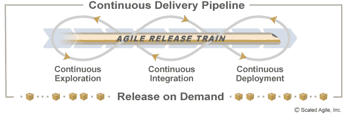
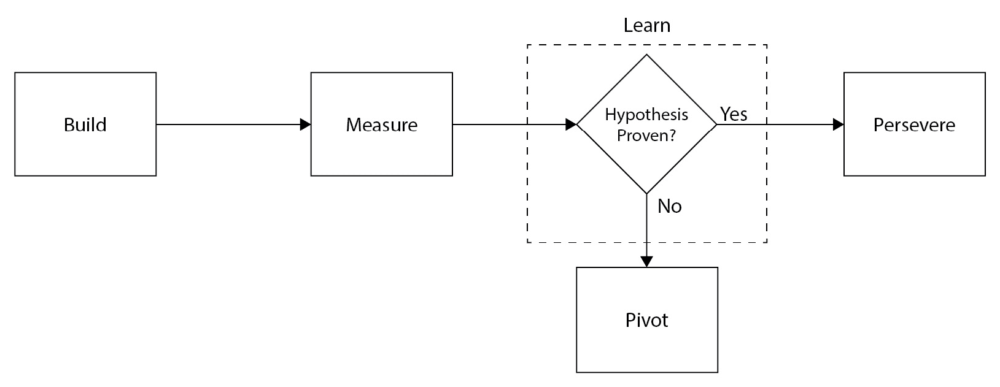
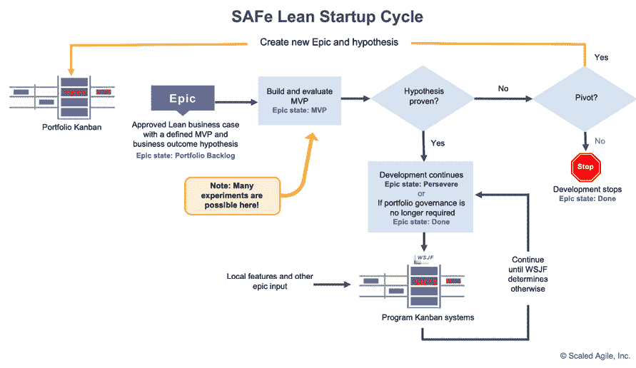
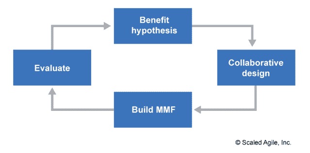
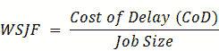
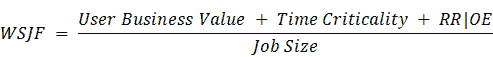

# 持续探索与发现新特性

在持续探索阶段，产品管理团队与**敏捷发布列车**（**ART**）内外的人一起工作，寻找能够为客户提供价值的特性，探索客户的需求与愿望，验证新特性在当前架构中的可行性，并为 ART 准备待开发的新特性。

正如我们在以下插图中看到的，持续探索是持续交付管道的第一阶段，它为后续的开发建立了*触发点*：



图 10.1 – 持续交付管道（© Scaled Agile，版权所有）

简而言之，本章将讨论以下活动：

+   假设客户价值

+   协作与研究

+   关于架构的讨论

+   综合工作

产品管理在持续探索阶段所做的工作对 ART 来说非常重要，因为它有助于为 ART 执行共享任务或愿景设定背景。让我们来看一下产品管理为即将到来的**项目增量**（**PI**）所做的准备工作。

# 假设客户价值

“*如果我问人们他们想要什么，他们会说更快的马。*” 这句常被（可能错误地）归于亨利·福特的话，突出了产品经理在寻找新特性或新产品时遇到的问题。客户可能根本不知道自己想要什么，或者无法想象那些来自不同思路或创新方法的产品和特性。

通过解决产品开发中的未知问题的一种方法，是采用埃里克·里斯（Eric Ries）在《精益创业：当今企业家如何利用持续创新创造极为成功的企业》一书中强调的方法。在这本书中，里斯展示了一种与客户协作进行迭代式产品开发的方法，其中一些方法体现在他提出的学习循环中，即**构建-衡量-学习循环**。

构建-衡量-学习循环是一个迭代式的产品开发循环，在这个过程中，精益创业公司通过实验发现与客户产生共鸣的产品和特性。该循环的以下部分是在客户参与下完成的：

+   **构建**：通常，第一次迭代中出现的**最小可行产品**（**MVP**）是启动与客户学习过程的关键。

+   **衡量**：与客户的对话或度量指标的应用，帮助确定什么有效，什么无效

+   **学习**：凭借从先前收集到的度量数据中获得的知识，做出是否调整方向或坚持下去的选择

构建-衡量-学习循环在以下图示中得以说明：



图 10.2 – 构建-衡量-学习循环

构建-衡量-学习循环与精益改进或 PDCA 循环的周期相同，后者在《第九章》中讨论过，*通过持续学习迈向未来*。构建发生在 PDCA 循环的*计划*和*执行*阶段。衡量则是我们在 PDCA 循环中的*检查*步骤。一旦完成衡量步骤，我们通过转型或坚持来*学习*（或*调整*）。

在明确了构建-衡量-学习循环的三个部分后，让我们来审视第一个循环以及它如何使用 MVP。

## 使用 MVP 进行构建

创建 MVP 是精益创业公司学习之旅的第一步。它为这些初创公司提供了一种检查手段，用来判断他们是否走在正确的道路上。虽然不同的人对 MVP 的定义有不同的看法，包括我们稍后会探讨的 SAFe®，但我们先来看看 Eric Ries 在《精益创业：今天的企业家如何运用持续创新创建极具成功的企业》中提出的定义。

根据 Ries 的说法，MVP 不一定非得是一个实际的产品，或者是最终形式的产品。唯一的必要条件是它能向顾客传达产品或服务的某种信息。

以下是 Ries 引用的作为 MVP 示例的几个例子：

+   Dropbox 制作了一个视频，帮助顾客理解基于云的文件存储和同步的概念，并解释其相对于竞争对手的优势。

+   Groupon 最初是一个 WordPress 博客，顾客通过电子邮件请求提供作为新博客文章发布的 PDF 优惠券。

+   总部位于奥斯丁的初创公司 Food on the Table 开始提供服务，通过与第一位顾客紧密合作，聚合顾客购物清单和食谱中的食材，并在当地杂货店完成采购，从而定义服务内容和工作方式。

这些例子表明，MVP 是为了回答以下问题而构建的：

+   我们的产品或服务应该是什么样子？

+   我们的产品或服务能与顾客产生共鸣吗？

+   我们能提供这个产品或服务吗？

初创公司通过与顾客对话，并将创新会计应用到对他们来说重要的指标中，来回答这些问题。让我们来看一下创新会计中使用的衡量标准。

## 使用创新会计进行衡量

创建 MVP 的目的是验证或推翻 Ries 所说的“*信念假设*”。在看“构建-衡量-学习”循环时，MVP 经历三个里程碑。这些里程碑有助于评估 MVP 的进展，并说明学习中的关键检查点：

1.  **确立基准**：创建 MVP 是一个基准，用于验证“*信念假设*”是否有效。这个假设也可以被视为一个假设，实验（MVP）可以验证它。

1.  **调整引擎**：根据客观数据，我们应该着眼于做出调整，帮助我们更接近目标。

1.  **转型或坚持**：根据我们收集的数据，可能促使我们继续当前的路径并进行进一步的优化，或者进行转型。转型可能会让我们为产品或服务选择不同的道路。

对于客观数据，我们要避免虚荣指标。我们之前在*第五章*中讨论过 Ries 最初对指标的标准，即*衡量过程和解决方案*。以下品质在此重复：

+   **可操作性**：这个指标是否显示了清晰的因果关系？换句话说，通过执行相同的操作，你能否复制出相同的结果？

+   **可访问性**：价值链中的每个人是否都能访问相同的数据，并且这些数据是否能被所有人理解？

+   **可审计性**：报告是否有可信度？

当然，最好的数据来源是直接的消费者反馈。在许多情况下，如果你无法理解指标所传达的信息，你可能需要通过采访客户来获得进一步的洞察。

通过从真实的指标或客户反馈中收集到的客观数据，接下来需要做出决策，以确保初创企业的持续性。我们是否需要为我们的 MVP（转型）走不同的方向，还是继续当前的方向并增加更多的改进（坚持）？让我们来分析决定中涉及的因素。

## 学会转型或坚持

根据客户反馈或客观数据，精益创业法有一个问题需要回答：我们当前产品或服务的方向是否能让我们实现目标，并为客户提供价值？如果可以，那我们就继续沿着这条道路走，增加更多的功能。如果不行，我们则需要毫不犹豫地转向另一个方向，或者进行转型。

转型可能是对产品或服务的一个或多个方面进行改变。Ries 列举了以下几种转型，旨在帮助产品或服务提供更好的价值：

+   **缩小范围转型**：产品或服务的某一功能比其他任何功能都更能引起客户的共鸣。你将专注于这个功能，并使其成为产品或服务的核心。

+   **放大范围转型**：产品或服务本身并未提供足够的客户价值，但如果作为另一个产品或服务的功能捆绑在一起，可能会证明其价值。

+   **客户细分转型**：产品或服务不仅满足了最初目标客户的需求，还能满足其他客户的需求。

+   **客户需求转型**：在与客户合作时，你可能会发现通过不同的产品或服务可以提供更大的价值。例如，Potbelly 三明治店最初是一家提供食物的古董店。

对于大多数类型的转型，产品或服务会发生变化，通常会发生到完全不同于原始产品或服务的程度，但也有一些转型，MVP、产品或服务会被放弃。

面对任何类型的转型前景时，保持客观判断是否转型或坚持非常重要。许多初创公司失败的原因是他们没有及时转型，或者转型过晚。

现在我们已经了解了如何创建我们的 MVP 并通过构建-测量-学习循环验证我们的假设，让我们来看一下 SAFe®如何将构建-测量-学习和创新会计纳入 SAFe 精益创业循环，这一循环将实验应用于史诗的执行。

## SAFe®精益创业循环

在 SAFe 中，**史诗**是一项重要的产品开发工作，不限定在特定的时间框架内。史诗描述了一个组织可能希望对产品进行的长期变更。ART 团队将史诗作为实验，用以指导可能的产品开发。

请注意，虽然史诗和项目可能有相似的定义，但史诗的范围是灵活的。项目有明确的开始和结束日期，以及固定的范围，所有需求必须通过完成构建交付物的任务来满足。而史诗实际上为实验奠定了基础，实验可能会也可能不会完成。

史诗由**精益商业案例**描述，精益商业案例是一个简短的文档，概述了史诗的需求、可能的解决方案选择以及实验提案。实验以史诗假设声明的形式编写，描述了提议的价值、业务成果的假设、通过领先指标衡量实验的结果以及可能作为约束的任何**非功能需求**（**NFRs**）。MVP 被包含在精益商业案例中，作为实验的实施内容。

史诗的假设声明通过概述提案、其潜在收益、拟议的衡量标准和约束条件，为实验设定了基调。以下是一个史诗假设声明的示例，详细描述了一个提议的披萨无人机配送服务：

| **史诗描述** |
| --- |

+   针对居住在城市地区的客户…

+   希望快速便捷披萨配送的客户，

+   PizzaBot 2022…

+   是基于无人机的自动化披萨配送系统…

+   那些能快速、轻松地从餐厅配送披萨的客户。

+   与当前基于汽车的披萨配送（标准配送方式）不同，

+   我们的解决方案通过使用更便宜的电力而非汽油来降低开销成本。

|

| **商业成果** |
| --- |

+   更好的客户体验，配送时间更快（披萨更热）

+   通过减少送货司机并节省燃料来降低开销成本

|

| **领先指标** |
| --- |

+   平均配送时间减少

+   开销成本减少

+   更高的 NPS 调查分数

|

| **非功能需求** | 必须遵守有关商业空中无人机使用的当地条例 |
| --- | --- |

表格 10.1 – 史诗假设声明示例

史诗中的 MVP 与 Ries 的定义有所不同。在这里，MVP 指的是一套最小的功能特性，用于构建一个初步产品，供客户使用。这些特性将由 ART 开发。

领先指标度量用于验证我们实验的假设。它们可以告诉我们是否走在正确的道路上。我们希望我们的度量是可操作的、可访问的和可审计的，这样它们就不是虚荣指标。我们还希望它们是真正的领先指标，即在最早的时刻就能可靠地预测潜在价值，而无需等待趋势的出现。

SAFe 精益创业周期确实以 Eric Ries 提出的构建-测量-学习循环为模型。在 SAFe 精益创业周期中，ART 与史诗按以下方式合作：

+   **构建**：开发并发布 MVP 给客户

+   **测量**：史诗的精益商业案例中定义的领先指标度量决定了客户的反馈

+   **学习**：根据领先指标度量，必须做出决策，决定是坚持继续开发 MVP 之外的功能；还是转变方向，按照现有状态完成史诗，并创建一个包含新假设的新史诗；或者停止该史诗，不再开发 MVP 之外的内容。

以下图表展示了 SAFe 精益创业周期，概述了史诗的路径以及根据假设验证可能发生的路径：



图 10.3 – SAFe 精益创业周期（©Scaled Agile，保留所有权利）

这一活动的结果是史诗的待办事项列表。每个史诗都概述了一个实验，其中包含潜在价值的假设陈述和一个 MVP，使我们能够执行该实验。

基于构建-测量-学习循环的 SAFe 精益创业周期，产品管理建立价值假设和 MVP 作为验证假设的实验，但产品管理并非单独进行此操作。他们与他人合作，在周期的构建部分共同完善假设和实验。我们将在下一节探讨这种协作。

# 协作与研究

产品管理需要来自不同人员的输入，每个人对解决方案的需求都有独特的看法。优秀的产品经理知道，他们必须与这些人合作，发现能够构成利益假设基础的特性，或者 MVP 必须具备的功能。

在这里，我们将看看良好的产品管理需要形成 MVP 的两个方面。以下方面构成了产品管理开展 MVP 相关活动的基础：

+   与客户和利益相关者的合作

+   研究以引出产品特性和非功能需求（NFRs）

让我们从产品管理协调的主要协作开始。

## 与客户和利益相关者的合作

最好的产品是团队共同创造的。从早期阶段到设计、实施和测试阶段——最终导致发布，这一过程都是如此。

产品开发与以下人员合作，定义产品的特性：

+   客户

+   系统架构师或工程师

+   业务负责人

+   产品负责人或团队

让我们来审视产品管理与这些团队合作所创造的关系。

### 客户

客户是价值的最终裁定者。毕竟，他们是你为之构建产品的人。他们的反馈是评估产品是否满足需求的最直接来源。

除了那些可能不知道自己需要什么解决方案的客户，产品管理团队还必须关注那些只专注于做增量改进的客户，因为这种做法可能不会有助于产品的长期战略。

### 系统架构师

系统架构师从架构角度最了解产品。他们理解由启用工具确定的能力，以及由非功能需求（NFRs）识别的约束。

产品管理团队与系统架构师合作，了解新特性的平衡、使用启用工具进行长期开发、以及维护和减少技术债务的重要性，这一点至关重要。同时，系统架构师也需要了解客户的需求和关注点。因此，产品管理、系统架构师与客户之间的密切合作至关重要。

### 业务负责人

业务负责人是从组织角度来看最关键的利益相关者。他们需要确保 ART 开发的解决方案与组织的使命和整体战略保持一致。

产品管理与业务负责人合作，了解 ART 可能处理的特性优先级。

### 产品负责人和敏捷团队

ART 上的敏捷团队负责开发、部署、发布和维护解决方案。每个敏捷团队中的关键人物是产品负责人，他们作为内容权威，帮助团队详细描述故事和验收标准，并接受完成的故事。

因为团队最接近实际工作和实施，他们对产品和用户关注点的洞察不容忽视。优秀的产品经理会采纳敏捷团队的反馈。

现在我们已经了解了产品管理与哪些角色进行合作并接受反馈。接下来，我们应该审视这些反馈将以什么形式呈现。

## 研究活动

产品管理通过以下几种研究活动与客户、业务负责人和产品负责人合作，获取客户需求的洞察，并了解产品如何创造价值：

这些类型的活动可以分为以下几类：

+   与客户的主要市场调研

+   通过前往现场（Gemba walks）和客户拜访，了解客户体验

+   次级市场调研，以进一步深入了解客户的思维方式

+   精益用户体验（Lean UX）来建立实验

让我们来逐一审视这些活动。

### 主要市场调研

初级市场调研特点是产品管理和客户之间的直接合作。此类直接合作可能包括以下方法：

+   焦点小组

+   用户调查或问卷

+   创新游戏

焦点小组、调查和问卷直接询问产品或服务的问题。它们可能会涉及潜在的未来需求，但有时客户无法超越短期产品使用的想象。

这就是创新游戏的作用所在。创新游戏是*《创新游戏：通过协作游戏创造突破性产品》*（作者：卢克·霍曼）中描述的几项活动。在书中，游戏有助于发现未被言明的需求、客户如何看待成功以及你的产品如何与客户需求契合。

初级市场调研通常在组织内部进行，但也可以在其他地方收集到更多的见解。此时，Gemba 走访和客户现场访问就显得尤为重要。我们现在来了解一下它们。

### Gemba 走访

*Genchi genbutsu*在日语中意为“*亲自去看并理解*”。Gemba 走访是一项体验*genchi genbutsu*的活动。它最早应用于丰田生产系统，是精益思维的核心内容。在 Gemba 走访中，人们会亲自到产品使用的地方，了解实际环境。

*《精益创业：今天的企业家如何利用持续创新创造极其成功的企业》*（作者：埃里克·里斯）中的一个 Gemba 走访的例子。2004 年丰田赛那迷你货车的设计由横谷裕司主导。他在北美市场的经验较少，而赛那的目标市场正是北美。因此，他提出了一项计划：在一辆现有的赛那迷你货车中，进行一次覆盖加拿大各省、美国五十个州及部分墨西哥的公路旅行，同时采访客户。

横谷发现，北美客户比日本客户进行更多的长途汽车旅行。另一个发现是，迷你货车需要更好地服务于通常占据车内三分之二空间的乘客：孩子们。根据这些数据，横谷添加了更多具有*儿童吸引力*的功能，以便更好地适应长途旅行。

这些功能的选择产生了深远的影响。2004 年款赛那车型的销量比前一年增长了 60%。

### 二级市场调研

二级市场调研是指不涉及与客户直接合作的活动。这些活动有助于了解客户和市场。

一些让你了解客户需求和愿望的活动包括以下内容：

+   创建人物角色，虚构的客户代表

+   使用同理心图了解客户的想法和情感

+   通过旅程地图检查客户的旅程，包括情感

这些文档在与客户会面时可以进行完善和修改。

### 精益用户体验（Lean UX）

在开发功能时，我们希望使用类似于 Build-Measure-Learn 的 PDCA 学习循环。这种增量学习循环帮助我们将史诗细化为功能。

这种类型的一个循环来源于 Jeff Gothelf 和 Josh Seiden 所著的《*Lean UX: Designing Great Products with Agile Teams*》一书。书中提到的 **精益用户体验**（**Lean UX**）是一种心态和过程，通过逐步发现产品功能并验证客户价值。

Scaled Agile 已将这一过程模型调整为适用于 **用户界面**（**UI**）和 **用户体验**（**UX**）团队以外的领域。以下来自 Scaled Agile 的图表展示了这一过程：



图 10.4 – 精益 UX 过程图（© Scaled Agile, Inc. 保留所有权利）

让我们逐步分析过程的每个步骤。

#### 构建效益假设

在开发初期，无法知道哪些功能能够让客户感到满意，因为环境中的不确定因素和风险尚未明确。增量设计周期的第一部分旨在建立一个假设，假设该功能被开发并发布后，能够实现预期的可衡量的业务结果。如果该功能是史诗的 MVP 一部分或是史诗进一步开发的一部分，那么这个效益假设可能与史诗的假设相关。

#### 协作设计

有了效益假设，ART（产品管理、系统架构师、业务负责人、产品负责人和敏捷团队）成员与客户需要共同合作，生成作为产品设计元素的工件。

#### 构建最小可市场化功能

**最小可市场化功能**（**MMF**）是指功能包含的最少量功能，以验证或推翻某个效益假设。ART 可以通过迭代方式实现这一点，以便了解他们在效益假设上的进展情况。

有时，MMF 可能是一个轻量级的工件，没有功能，目的是生成客户反馈，如原型或线框图。其他时候，MMF 可能会被开发并发布，以便客户可以评估并提供反馈。

#### 评估

MMF 发布后，我们等待看看客户的反应。我们可以通过观察和 A/B 测试收集客观数据，也可以通过调查问卷向客户询问反馈。

根据数据，我们可以决定效益假设是否得到了验证。这可能会让我们继续开发、重构，甚至调整方向放弃该功能。

合作和研究活动的结果让我们理解客户的需求，并根据这些需求设计功能。以下工件可能是这一活动生成的：

+   了解客户需求

+   风格指南

+   标志

+   UI 资产

+   原型

+   模型或线框图

+   角色画像

+   客户旅程地图

当产品管理团队努力理解产品特性时，系统架构师需要了解产品的架构，并知道哪些使能者是维持产品功能流动所必需的。我们来看看系统架构师在持续探索中的角色。

# 架构解决方案

作为产品架构的维护者，系统架构师需要跟踪产品的功能，并通过创建使能者来增强这些功能，同时理解由非功能需求（NFRs）所识别的系统限制。

与 ART 团队或组织中的其他成员合作，系统架构师将探索产品的以下方面，以确保满足非功能需求（NFRs）：

+   可发布性

+   安全性

+   可测试性

+   操作需求

让我们更详细地审视这些方面。

## 架构可发布性

通常，按照组织的决策，将新功能发布给客户是可取的。我们仍然希望将生产环境部署作为开发节奏的一部分，但实际发布则变成了一项商业决策。因此，我们希望将部署和发布分离。

架构可能在实现部署与发布的分离中发挥关键作用。部署与发布的分离依赖于诸如功能标志（Feature Flags）等技术，而架构必须能够支持这些技术。这些功能标志可以轻松实现新功能的持续部署，而在关闭时不会干扰当前的功能。当功能标志被开启时，新功能被认为已经发布。功能标志的应用包括金丝雀发布和暗发布（Dark Launches）。具有松耦合组件的架构允许每个组件拥有独立的发布计划，这使得需要不同发布策略的组件能够各自独立实施。

最终，发布策略通常与组织的战略或商业目标相关。发布可能需要响应市场需求或超越竞争对手。能够灵活发布是一个竞争优势。我们将在*第十三章*中看到这一远见的好处，*按需发布以实现价值*。

## 设计安全性

尽管 DevSecOps 强调将安全性测试“左移”，即在开发过程中提前测试安全漏洞和问题，但 DevSecOps 方法在此开始，架构师会在绘制新功能时将安全性考虑在内。这使得安全性从一开始就被纳入设计，而不是事后补充的思考。

为确保在初步设计中包括安全性问题，必须执行以下实践：

+   **威胁建模**：审视当前产品的基础设施、架构、应用程序以及拟发布的功能，以识别可能的安全漏洞、攻击者和攻击路径。

+   **合规管理**：确保产品符合已知的行业安全法规标准，如 HIPAA、FedRAMP 和 PCI。这些标准中的要求主要涉及安全性和隐私保护。

这些实践的输出通常作为 NFRs 维护并向 ART 传达。NFRs 是 ART 开发的特性的工作约束。这些约束应该作为开发继续进行的持续测试套件的一部分。

## 确保可测试性

测试是确保功能正确、质量高、安全性好并且准备部署的主要方式。如果一个解决方案不能进行测试，ART 无法了解其进展或者是否可以实现价值。

正如我们之前所看到的，松耦合架构允许通过在不同时间表上发布组件来提高灵活性。这种灵活性延伸到设计允许更多测试发生的系统。具有定义良好接口的组件的系统，允许通过使用尚未准备好与其他组件集成的组件，替换为返回有效输出的虚拟代码或逻辑，来进行更频繁的系统级测试。

使用**Strangler 模式**，现有的遗留架构可以演变为基于现代松耦合**应用程序编程接口**（**API**）的架构。由 Martin Fowler 创造的 Strangler 模式将遗留的单体系统建立了一个面向这些实体的接口。新的代码逐步替换接口的各个部分。最终，所有遗留系统的功能都被新代码所取代。

另一个考虑测试性的设计方面是能够在各个层次上执行自动化测试，从单个代码函数到用户故事，最终到功能。自动化测试允许更频繁地执行测试。频繁的测试可以增加对系统质量和安全性的信心。

可测试的架构对于实施工作的敏捷团队有益。**测试驱动开发**（**TDD**）试图首先创建测试，形成对系统行为的初始理解。**行为驱动开发**（**BDD**）继续在更高层次上理解系统的行为。

## 维护操作

一旦特性通过了所有测试，架构设计的考虑因素不应该改变。系统架构师必须确保该架构在非生产或者暂存环境以及最终的生产环境中轻松运行。

这其中的第一个方面是可测量性。架构应允许在不同环境（如分阶段和生产环境）中监控其资源，以判断当前系统是否存在不良性能。当阈值被违反时，应设计警报。这种从低到高资源使用的测量能力通常被称为全栈遥测（full-stack telemetry）。

另一个方面是能够将所有度量记录到日志中，以便在发生事件时便于检索。架构师应该理解架构中哪些方面能够提供可作为日志捕获的洞见，以便运营人员可以将这些度量添加到日志工具中，该工具包括时间戳和搜索功能。

可发布性在确保架构易于操作方面起着作用。特性标记（Feature Flags），作为将生产环境的部署与客户发布分离的常见工具，可以作为回滚机制，在发生事件时通过停用受影响的特性来实现回滚。另一个需要考虑的回滚机制是在生产环境中建立蓝绿部署。CI/CD 管道中的可靠自动化，包括强大的自动化测试，可以支持 *修复前进*（fix-forward）的情况，其中事件修复可以尽快推送到生产环境。

架构师工作的输出包括解决方案意图，证明史诗（epic）效益假设所需的最小架构概念，以及 NFRs（非功能性需求），它们作为所有从史诗中派生的特性和故事的约束条件。

此时，产品管理和系统架构师已经完成了对特性在价值和架构影响方面的初步思考。其他人需要发挥他们的作用，从进一步细化和优先级排序，到为 PI 规划做好特性准备。让我们现在来看这些步骤。

# 综合工作

产品管理已收集了关于客户需求的知识和额外的研究，这些内容可能有助于预期的价值。系统架构师已着手确保当前已有或即将提供支持的架构功能。产品管理与业务所有者、产品所有者、敏捷团队及其他相关方合作，完成以下活动：

+   完成特性的定义

+   使用 BDD 来概述验收标准

+   使用 **加权最短作业优先法** (**WSJF**) 对程序待办事项中的特性进行优先级排序

+   为 PI 规划做准备

综合的目标是为即将到来的 PI 做好 ART 的准备。为此，我们将创建以下工件：

+   对 ART 将要开发的内容有清晰的愿景

+   一份路线图，详细说明产品的演进，通过展示可能的解决方案何时交付

+   已定义特性的待办事项列表

让我们详细审视一下在综合阶段完成的这些活动。

## 完成特性

记住，我们一开始是从作为实验进行的重大产品工作（epics）开始的。我们通过开发 MVP（最小可行产品）来开始我们的实验。MVP 将是一个功能集，用于验证史诗的利益假设。使用精益 UX 方法，我们进一步将 MVP 细分为 MMFs（最小市场功能），这些最初是基于在了解客户需求和期望后产生的*假设*。产品管理和系统架构师的研究为此添加了更多细节。现在是时候完成完善工作，以便其他 ART 团队可以接手。

一个好的功能将包含以下三个部分：受益人、利益假设和验收标准。让我们更详细地讨论这些部分。

### 受益人

当我们考虑组织或客户的价值时，现在必须考虑我们产品或服务的最终用户。有时，最终用户不是购买该产品或服务的人。在这些情况下，我们可能需要挑战客户对于最终用户需求和期望的假设。

### 利益假设

我们希望在开发和发布该功能时，能够说明其对客户或组织的好处。因此，我们可以使用以下格式来创建我们的利益假设：

*如果{proposition}，{**则利益}*

我们的*命题*是对功能的描述。*利益*是预期的价值输出。

我们可能希望包括一些我们认为能够证明或反驳我们利益假设的指标。如果是这样，我们可以使用以下格式来包含我们的衡量标准：

*我们相信{proposition}将导致{benefit}，并且当{metric}时，这将得到证明*。

例如，假设我们之前在本章中定义的空中披萨无人机的史诗。一个可能的功能是增加一个内置加热单元，在送披萨的过程中保持披萨的温度。以下陈述可以作为该功能的利益假设：

*我们相信，内置加热单元的无人机将通过确保披萨送达时不会变冷来提高客户满意度，并且当我们查看 NPS* *调查结果时，这将得到证明。*

在这里记住要避免使用虚荣指标——这些指标可能会产生正面反应，但通常无法表明是否真正实现了预期的价值。

### 验收标准

验收标准是确认实现已完成并且利益得以交付的衡量标准。它们是包含该功能后的系统行为描述。

通常，要评估一个利益假设是否已被验证，可以将多个验收标准映射到一个单一的利益假设声明上。

由于验收标准描述了系统的行为，我们将在下一部分中讨论如何使用 BDD（行为驱动开发）技术编写验收标准。

## 使用 BDD 编写验收标准

在上一节中，我们探讨了接受标准的作用。接受标准的一个关键作用是，它们描述了功能包含时系统的行为。这种描述会转化为组件的期望行为，以用户故事或代码功能的形式呈现。

我们在 Gherkin 格式中指定期望的行为。Gherkin 格式采用以下结构：

```
GIVEN (the initial conditions)
WHEN (an input that triggers the specific scenario occurs)
THEN (the desired behavior happens)
```

`WHEN` 和 `THEN` 可能包含一个或多个条款，描述相应的条件和行为。

延续我们关于为披萨无人机配置内置加热单元功能的示例，我们可能希望以下语句作为接受标准：

*假设加热单元已安装并* *加热完毕…*

*…当披萨在配送过程中被放入加热单元时…*

*…那么，当披萨送达时，它将是热的。*

采用这种格式的接受标准可以作为自动化验收测试的基础。这些自动化验收测试使用 Cucumber 进行执行，Cucumber 是一种运行 BDD 测试的测试工具。

## 使用 WSJF 优先排序

一旦产品管理根据受益方、效益假设和接受标准指定了功能，就会将其放入**项目待办事项**中。

项目待办事项是 ART 可以处理的功能列表。由于 ART 在一次性处理的功能数量上有限，因此产品管理需要对功能进行优先排序，使工作更具聚焦性。

有多种标准可以用来确定在项目待办事项中功能的优先级。SAFe 提倡参考原则 1：采取经济视角，我们最初在*第二章*中看到过这一点，*共享责任文化*，在对功能进行排序时需要关注这一点。

我们从关注功能的**延迟成本**（**CoD**）开始经济视角的分析。延迟成本是指如果我们推迟发布功能，价值将会减少多少。延迟成本可以由以下几个因素构成，且这些因素可以相对估算：

+   **用户业务价值**：与项目待办事项中的其他功能相比，预计该功能将产生多少价值？

+   **时间紧迫性**：如果一个功能未能及时实现，是否会导致价值下降？我们是否错过了一个重要的市场机会？

+   **风险减少或机会启用**（**RR/OE**）：是否有其他重要方式能使某个功能降低风险，或者让组织接触到新市场？

SAFe 关注的另一个因素是工作的大小。我们希望优先处理最短的工作。处理时间较短的工作并快速获取价值比从较大的工作开始更容易。

SAFe 将对延迟成本和工作大小的关注结合成一个公式，称为 WSJF。这个公式可以具体如下所示：



如果我们查看前面的公式并代入我们的 CoD 因素，可以将公式改写如下：



产品管理可以与业务负责人、系统架构师以及其他相关方在精炼会议中合作，确定每个特性的 WSJF 值。参与者根据四个组成部分（用户商业价值、时间紧迫性、RR/OE 和工作量）的相对价值进行判断，通常使用修改过的斐波那契数列（1，2，3，5，8，13，20，40，100）来评估。

让我们看看产品管理如何与其他方合作，计算不同特性的 WSJF 值。

小组将召开会议，审查所有特性。然后他们会决定哪个特性的用户商业价值最小 – 该特性的用户商业价值将标记为*1*。接着他们会查看其他特性，并决定它们的用户商业价值与参考特性相比如何。如果它们被认为相同，它们也会获得*1*。如果其他特性更大，他们将在斐波那契数列上标出一个数字，表示它比参考特性大多少。

下表展示了在进程中确定用户商业价值的协作过程：

| **特性名称** | **用户商业** **价值** | **时间紧迫性** | **RR&#124;OE** | **延迟** **成本** | **工作量** | **WSJF** |
| --- | --- | --- | --- | --- | --- | --- |
| 内置加热单元 | 8 |  |  |  |  |  |
| 无人机防御系统 | 1 |  |  |  |  |  |
| 反推力推进器 | 5 |  |  |  |  |  |

表 10.2 – WSJF 协作示例 – 用户商业价值定义

该过程会重复进行时间紧迫性、RR/OE 和工作量的计算。对于上表，表示用户商业价值、时间紧迫性、RR/OE 和工作量的列，必须至少有一个*1*。下表继续展示我们的示例，其中时间紧迫性、RR/OE 和工作量也已定义：

| **特性名称** | **用户** **商业价值** | **时间** **紧迫性** | **RR&#124;OE** | **延迟** **成本** | **工作量** | **WSJF** |
| --- | --- | --- | --- | --- | --- | --- |
| 内置加热单元 | 8 | 8 | 1 |  | 1 |  |
| 无人机防御系统 | 1 | 13 | 3 |  | 2 |  |
| 反推力推进器 | 5 | 1 | 1 |  | 5 |  |

表 10.3 – WSJF 示例继续 – 时间紧迫性、RR|OE 和工作量定义

CoD 通过将用户商业价值、时间紧迫性和 RR/OE 相加来计算。WSJF 通过将 CoD 除以工作量来计算。下表完成了我们特性 WSJF 的确定：

| **特性名称** | **用户商业** **价值（UBV）** | **时间紧迫性（TC）** | **RR&#124;OE** | **延迟成本（CoD） =** **UBV+TC+RR&#124;OE** | **工作量（JS）** | **WSJF（CoD/JS）** |
| --- | --- | --- | --- | --- | --- | --- |
| 内置加热单元 | 8 | 8 | 1 | 17 | 1 | 17（第一） |
| 无人机防御系统 | 1 | 13 | 3 | 17 | 2 | 8.5（第二） |
| 反推力推进器 | 5 | 1 | 1 | 7 | 5 | 1.4（第三） |

表 10.4 – WSJF 确定示例 – 完整

在项目待办事项中的新功能定期进行优化会议，使产品管理能够了解需要优先完成的功能。这将影响项目愿景和产品管理将在 PI 规划中与 ART 沟通的路线图。

## 准备 PI 规划

有了优先级排序的项目待办事项，产品管理和 ART 的其余成员可以了解即将到来的 PI 的初步工作范围。理想情况下，这些活动应该至少在实际 PI 规划事件前一个月完成，以便及早发现任何意外情况。

业务负责人将准备一份演示文稿，帮助 ART 了解业务背景，并说明所选功能的开发如何与整体业务战略对接。

系统架构师还将准备一份演示文稿，概述重要的架构说明和变更。这可能还包括 ART 为发布开发的任何重要使能器。

剩下的就是综合结果的输出。产品管理将在 PI 规划之前努力组装以下文档：

+   ART 能够交付的解决方案的愿景

+   功能的路线图及其在产品演进中的定位

+   ART 承诺在下一个 PI 中开发的优先级功能列表

产品管理概述了项目愿景，旨在将 ART 的重点放在共同的使命上。这个愿景将在业务负责人演示之后，通过演示文稿传达给整个 ART。

计划在下一个 PI 中处理的功能集将传达给 ART 上的敏捷团队。团队可以选择他们希望参与的功能，并开始仔细查看这些功能。他们可能希望开始将这些功能分解为故事，就像我们在*第十一章*中看到的那样，*持续集成解决方案开发*，并且可能还会寻找任何风险或依赖关系。

# 摘要

在本章中，我们审视了触发持续交付管道的活动。通过持续探索，ART 检查市场和客户的需求与期望，生成新产品或新功能的创意。

这个过程始于认识到，开发实际上是一个系列的增量构建-测量-学习循环，开始时通过创建一个关于客户价值的假设来进行。

接下来，产品管理和系统架构师开始协作过程。产品管理与客户合作，更深入地了解客户和市场需求。系统架构师研究假设，以了解这些变更对架构的影响。

当研究完成后，ART 会将所学到的知识转化为特性，并对这些特性进行详细阐述，将其放入程序待办列表中并进行优先排序。一组最高优先级的特性将被选定用于即将到来的 PI。这些选定的特性将被传达给 ART，以便为下一个 PI 规划阶段做好准备。

在 PI 规划之后，ART 开始进行开发工作。这一开发工作将进入持续交付管道的下一个阶段——持续集成。我们将在下一章详细探讨持续集成的内容。

# 问题

1.  以下哪个不是持续探索的活动？

    1.  假设

    1.  协作与研究

    1.  开发

    1.  综合

1.  产品管理在持续探索阶段与谁合作（请选择三个）？

    1.  发布列车工程师

    1.  客户

    1.  产品负责人

    1.  Scrum 主席

    1.  系统架构师

    1.  解决方案列车工程师

1.  创新会计被应用于“构建-测量-学习”周期的哪个阶段？

    1.  构建

    1.  测量

    1.  学习

    1.  所有阶段

1.  精益 UX 过程创建一个 __________ 来验证或证伪利益假设。

    1.  最具价值产品

    1.  可度量的特性

    1.  最小可行产品

    1.  最小市场化特性

1.  系统架构师在评估新特性架构变更时关注哪些领域（请选择三个）？

    1.  安全

    1.  成本

    1.  可测试性

    1.  重用

    1.  可发布性

# 进一步阅读

+   一系列来自 `scaledagileframework.com` 网站的文章，作为持续交付管道的参考：[`www.scaledagileframework.com/continuous-delivery-pipeline/`](https://www.scaledagileframework.com/continuous-delivery-pipeline/)

+   持续交付管道系列中的参考文章，讲述持续探索：[`www.scaledagileframework.com/continuous-exploration/`](https://www.scaledagileframework.com/continuous-exploration/)

+   来自 [scaledagileframework.com](http://scaledagileframework.com) 的参考文章，详细介绍了史诗故事和 SAFe 精益创业周期：[`www.scaledagileframework.com/epic/`](https://www.scaledagileframework.com/epic/)

+   来自 [scaledagileframework.com](http://scaledagileframework.com) 的参考文章，详细介绍了如何在 SAFe 中使用创新会计和领先指标度量：[`www.scaledagileframework.com/guidance-applied-innovation-accounting-in-safe/`](https://www.scaledagileframework.com/guidance-applied-innovation-accounting-in-safe/)

+   本文描述了 Scaled Agile 为 SAFe 适配的精益 UX 过程：[`www.scaledagileframework.com/lean-ux/`](https://www.scaledagileframework.com/lean-ux/)

+   关于 Strangler 模式的解释，并举例说明如何实施：[`www.techtarget.com/searchapparchitecture/tip/A-detailed-intro-to-the-strangler-pattern`](https://www.techtarget.com/searchapparchitecture/tip/A-detailed-intro-to-the-strangler-pattern)

+   关于在 SAFe 中编写 Feature 的指南，并结合了 Feature 编写画布：[`medium.com/product-manager-tools/writing-effective-features-58a240e69222`](https://medium.com/product-manager-tools/writing-effective-features-58a240e69222)

+   *精益创业：今天的创业者如何通过持续创新创造极具成功的企业* 由 Eric Ries 著 – 这本书定义了 Build-Measure-Lean 循环、创新会计、商业转型（pivot）以及什么是最小可行产品（MVP）。

+   *精益 UX：与敏捷团队设计伟大产品* 由 Jeff Gothelf 和 Josh Seiden 著 – 这本书最初解释了精益 UX 流程，一种迭代的产品设计方法。

+   *创新游戏：通过协作游戏创造突破性产品* 由 Luke Hohmann 著 – 这本书解释了创新游戏，一系列由产品管理团队和客户共同进行的协作练习，用以挖掘客户需求和期望。
