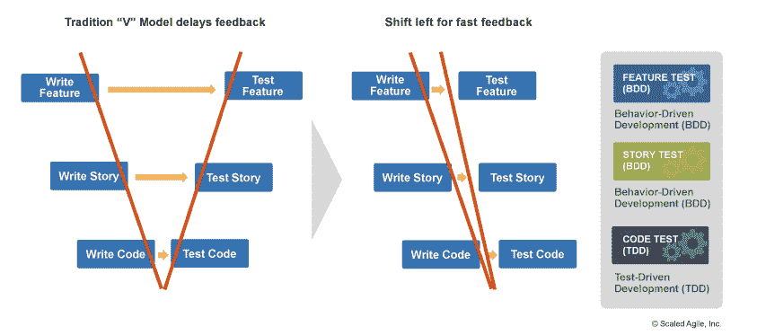
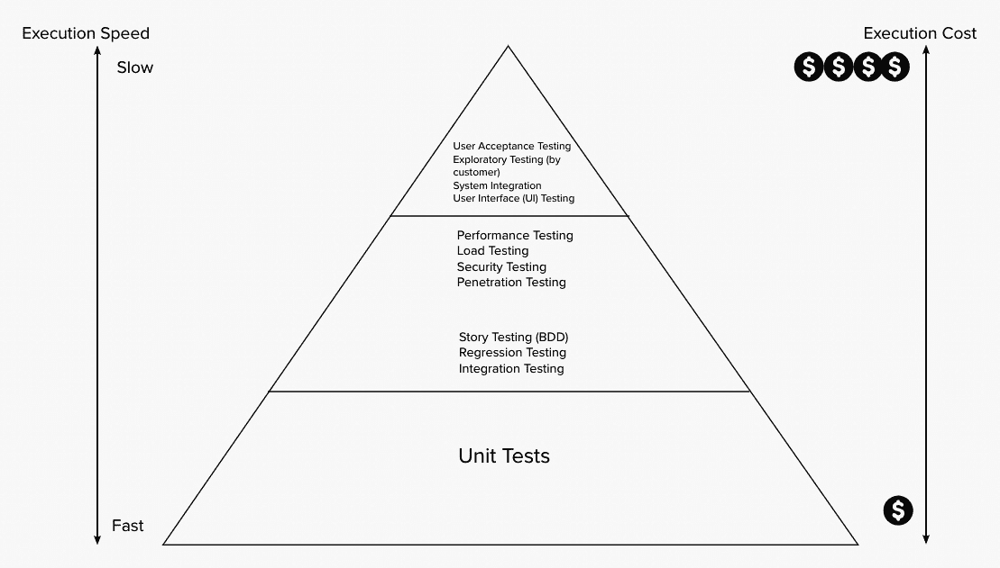
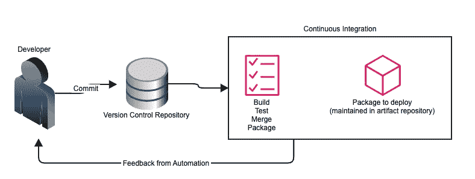
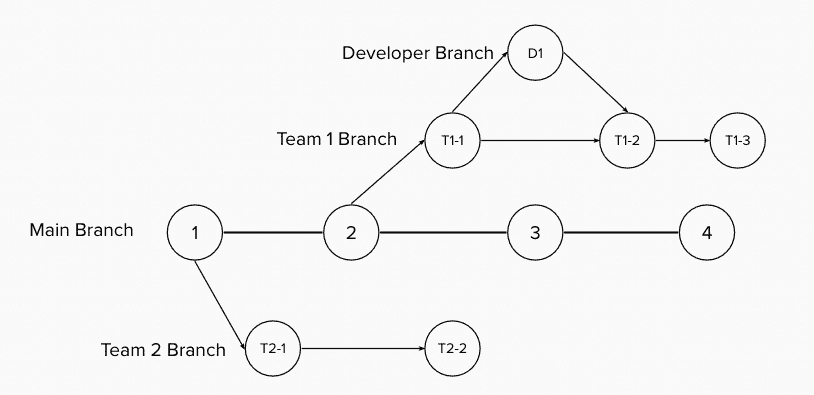
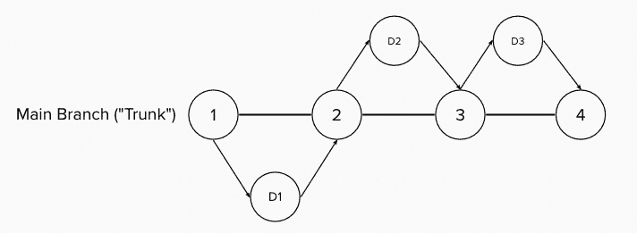
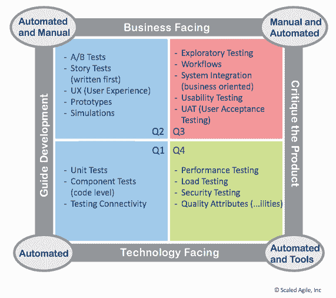
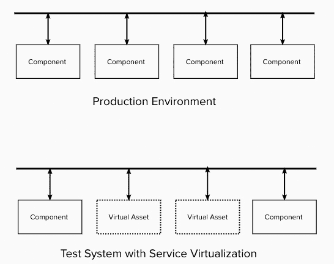
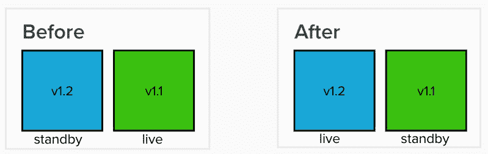

# 第十一章：解决方案开发的持续集成

在 PI 规划后，ART 上的团队开始工作。他们将查看持续探索的产出以及为 PI 选择的功能，并将其带入持续交付管道的下一个阶段，即**持续** **集成**（**CI**）。

本章将介绍在持续交付管道的 CI 阶段中进行的以下活动：

+   开发解决方案

+   构建解决方案包

+   执行端到端测试

+   将包移到预发布环境

我们还将发现，持续交付管道中描述的过程将在 CI 阶段与自动化相结合，形成**CI**/**持续部署**（**CD**）管道。

现在，让我们加入 ART，随着他们根据持续探索阶段创建的功能开发解决方案。

# 开发解决方案

ART 团队的工作方式与使用瀑布方法的产品开发团队有很大不同。强调精益思维并聚焦于系统决定了新的工作方式。

我们将研究今天敏捷团队使用的以下工程实践：

+   将工作分解

+   协作开发

+   在构建质量

+   版本控制

+   面向系统的设计

这些实践旨在实现工作流的持续流动，为下一个构建状态做好准备。

## 将工作分解为故事

我们在*第四章*中学习到的精益流程的重要部分是保持批次规模小。一个功能，在 PI 规划之前呈现给我们，是一个大批次的工作，计划在 PI 结束时完成。为了确保工作流的顺畅，功能必须分解成更小的工作批次。

用户故事通常描述了在冲刺或迭代结束时需要交付的小块用户功能，通常为两周。它们通常以用户语气的形式表达，简要说明该故事是为谁准备的，以及所需的功能和预期的价值。以下是用户语气形式的示例：

*作为*客户，*我想要*每月收到一份详细的服务收据，*以便*我可以了解并整理我的开支。

故事的一个关键部分是其接受标准。接受标准概述了故事的正确行为，是团队判断故事是否完成的方式。

接受标准可以使用 Gherkin 格式编写。这有助于概述前置条件、输入、所需的行为和输出。这些在以 GIVEN-WHEN-THEN 开头的条款中进行描述。

以下是我们故事的接受标准示例，采用 Gherkin 格式编写。注意它是如何描述初始条件、输入和输出的：

| **初始条件** | **假设我已经配置了** **通知日期…** |
| --- | --- |
| 输入 | …当通知日期过去时… |
| 输出或期望的行为 | …然后我收到一封包含我项目清单的电子邮件通知。 |

表格 11.1：Gherkin 格式的验收标准

使能故事也可以来自功能。这些故事不直接为用户提供价值，但为未来用户故事的开发和架构能力提供便利，从而创造未来的业务价值。SAFe®列出了以下四种类型的使能者。

+   基础设施

+   架构

+   探索

+   合规性

将一个功能拆分成*用户*故事和*使能*故事可以通过多种方式完成。以下方法可以用来创建可以在短冲刺中完成的故事。

+   **工作流步骤**：首先设置故事来执行工作流的必要步骤。其他步骤可以在后续冲刺中发布。

+   **业务规则的变异**：根据不同的业务规则划分故事，例如不同的服务等级、不同的产品线等。

+   **重大工作量**：检查可以遵循的可能故事。首先选择看起来最难完成的故事。

+   **简单与复杂**：在评估功能时，是否有一个可以编写的故事来提供核心功能？那就是要先做的第一个故事。后续的故事将进一步详细说明核心功能。

+   **数据中的变异**：从一个适用于某种数据类型的故事开始，然后转到处理其他数据类型的不同故事。

+   **不同的数据输入方法**：首先创建一个手动输入数据的故事，然后逐步推进自动化数据输入的后续故事。

+   **不同的系统特性**：系统特性的一种示例可能是我们的应用程序将与不同的设备或接口配合使用，并为每个设备或接口建立一个故事。

+   **按操作**：将故事划分为处理不同操作的部分。常见的划分方法是**创建、读取、更新和删除**（**CRUD**）。

+   **使用场景**：为每个使用场景创建一个故事。

+   **设置突发任务与后续工作**：突发任务是用来安排开发时间，研究一种技术方法或解决未知问题。一旦研究完成，就继续进行实现该方法的故事。

请注意，可能需要进一步拆分大型故事，以便在短冲刺结束时完成并交付该故事。前述方法可以用来将较大的故事拆分成较小的故事。

## 协作开发

虽然团队可以选择如何开发他们的故事，但高效能团队发现，与其单独工作，不如团队成员一起合作，能够生产出更高质量的产品，并实现有效的知识共享，从而创造出更强大、更具协作性的团队。

在本节中，我们将讨论两种允许团队共同开发产品的实践，促进更好的质量和更强的团队凝聚力：配对编程和集体编程（或集群编程）。

### 配对编程

对偶编程是一种源自**极限编程**（**XP**）的实践。与其让两位开发者在两台电脑前分别工作，不如让他们在一台共享电脑前共同工作，相互交换想法，同时进行编码和审查工作。

当两位开发者一起工作时，以下模式是他们协作的体现。

+   **驾驶员/导航员**：在这种模式中，一位开发者掌控电脑（驾驶员），而另一位开发者通过评论屏幕上输入的内容来审查并提供指导（导航员）。在会议的某些时段，角色会进行交换。这是对偶编程中最常用的模式。通常，当一位开发者是专家级程序员，而另一位是新手时，这种模式尤其有效。

+   **无结构模式**：在这种临时的对偶编程风格中，开发者之间没有固定的角色。协作往往是没有明确指导和松散的。通常，在两位开发者都不确定哪种方法有效时会采用这种模式。这种模式适合技术水平相近的开发者，但对于两位初学者来说，可能会遇到一些问题。

+   **乒乓编程**：这种模式通常由一位开发者编写测试，另一位开发者则为通过测试而进行工作。两位开发者在编写测试和编写通过测试的代码之间频繁切换角色。这种风格适合两位经验丰富的开发者。

对偶编程已被证明是一种有效的协作方式。在对偶编程过程中编写的代码通常会进行审查和调试，从而产生高质量的代码。知识在开发者之间共享，加速了初学者或不熟悉代码库的开发者的学习。如果代码出现问题，通常不仅仅有一个开发者了解代码，可以帮助修复问题。

一个常见的误解是对偶编程需要双倍的努力或资源。然而，这一观点并没有得到对偶编程有效性研究的支持，包括犹他大学进行的一项研究（[`collaboration.csc.ncsu.edu/laurie/Papers/XPSardinia.PDF`](https://collaboration.csc.ncsu.edu/laurie/Papers/XPSardinia.PDF)），该研究发现，虽然开发成本增加了 15%，但在后期阶段发现的缺陷减少了 15%，且代码功能实现时所用的代码行数更少，这表明设计质量更高。

### 团队编程或集体编程

集体编程可以看作是对偶编程的最高级形式。不同于只有一对开发者，整个团队都围坐在一台电脑前进行操作。团队成员们在相同的时间和空间里，在同一台电脑上共同工作。

这种典型的模式是一种驱动者/导航者模式的变体。团队中的一个人控制计算机，输入并创建代码或其他工作部分。团队的其他成员作为导航者审查并指导驱动者。经过一段时间（通常为 10 分钟），控制权会轮换到团队中的另一成员。轮换会持续进行，直到所有团队成员都有机会担任驱动者。

集体编程有利于整个团队。代码的知识共享适用于整个团队，而不仅仅是一对开发人员。整个团队都在场时，沟通变得更容易。决策基于最当前和相关的信息。

## 通过“向左转移”来构建质量

在此期间，不仅产品在开发中，同时确保产品质量的方法也在同时开发。这与传统开发方式有所不同，传统开发是在代码开发后才创建并运行测试。这一变化通常被称为*向左转移*，如下面的开发过程表示所示。这是 SAFe 中的一项重要实践，更多细节可参考 SAFe 文章《内建质量》([`www.scaledagileframework.com/built-in-quality/`](https://www.scaledagileframework.com/built-in-quality/)):

图 11.1 – 与“向左转移”比较的测试（© Scaled Agile, Inc.，版权所有）

在前面的图示中，我们可以看到，传统的测试可能在故事和功能最初构思后很长一段时间才进行测试。这个延迟的反馈可能需要长达 3 到 6 个月的时间，这可能太晚了，无法知道我们是否朝着正确的方向前进。

从右侧的图示中，我们看到可以通过 TDD 和 BDD 测试加速反馈，以评估功能和故事的行为是否符合预期。理想情况下，这些测试应当自动化，以便能够反复快速运行。

我们还可以从前面的图示中看到，测试有多个层级，其中一些应通过自动化反复运行，而另一些可能需要一些时间或只能手动运行。我们如何知道哪些测试应该自动化，哪些测试应该频繁运行呢？

Mike Cohn 在他的书《成功的敏捷》中将测试层级描述为“测试金字塔”。他最初描述了以下三个从下到上的层级。

+   单元测试

+   服务测试

+   UI 测试

其他类型的测试可以添加到测试金字塔中并加以应用。这使得我们可以如下图所示查看测试金字塔：

图 11.2 – 测试金字塔

请注意，在金字塔的底部，单元测试是执行速度最快且成本最低的。将它们的执行自动化并频繁运行是明智之举，理想情况下应该在每次提交版本控制时，尤其是在构建阶段执行。

随着你向金字塔的上方移动，测试的执行时间逐渐增加，成本也变得更高。这些测试可能不会像单元测试那样频繁运行。它们可能通过自动化执行，但只会在进入测试阶段时运行。这些测试的例子包括来自 BDD 的故事测试、集成测试、性能测试和安全测试。

金字塔顶部的测试需要最久的执行时间，且也是最昂贵的。这些大多是手动测试。这些测试可能会在发布前运行。此处的测试示例包括用户验收测试和由客户进行的探索性测试。

大多数测试旨在验证代码的正确性和功能性，以及验证故事和特性的行为。创建测试以衡量这些标准的主要方法包括：TDD 和 BDD。让我们来看看这些测试是如何开发的。

### TDD

TDD 是源自 XP 的一种实践。在 TDD 中，你会遵循以下流程：

1.  创建测试。这是为了理解行为。

1.  观察测试失败（即使没有写任何代码）。这让我们对测试执行环境有信心，并展示了测试失败时系统的行为。

1.  编写通过测试所需的最简单代码。

1.  确保所有测试通过。这意味着任何新创建的代码都需要经过修订，直到测试通过为止。

1.  根据需要重构测试和代码。

随着新功能的开发，这个流程会重复进行。这个流程的图形表示如下：

 根据 CC BY-SA 许可证授权)](img/B18756_11_03.jpg)

图 11.3 – TDD（[`en.wikipedia.org/wiki/Test-driven_development#/media/File:TDD_Global_Lifecycle.png`](https://en.wikipedia.org/wiki/Test-driven_development#/media/File:TDD_Global_Lifecycle.png) 根据 CC BY-SA 许可证授权）

通常使用 TDD 编写的测试是单元测试；小型、易于执行的测试，旨在验证代码模块的正确功能。更广泛的测试使用 BDD 来开发验证特性和故事的系统行为的测试。现在让我们来看看 BDD。

### BDD

BDD 通常被视为 TDD 的扩展，但与 TDD 侧重于验证单个代码功能和组件的正确行为不同，BDD 力求验证系统作为可执行规格的正确行为，这些规格通过特性和故事来表达。在本章的早些时候，我们创建了故事的接受标准，这是 BDD 的一种应用。

查看正确的系统行为涉及三个互相协作的视角，这些视角帮助确定最终的规格、开发内容以及作为正确测试的内容。以下是这三种视角：

+   了解业务需求并寻找新功能的可取性和可行性的客户

+   了解可行技术方法的开发人员

+   查看系统行为的边界条件和边缘案例的测试人员

BDD 通过使用规范将这三种视角结合在一起。这些规范使用**领域特定语言**（**DSL**）编写，采用自然语言语法，使技术人员和非技术人员能够协同开发规范。这些 DSL 之一是 Gherkin，它将行为划分为以下三个部分：

+   **GIVEN** 概述了场景中期望行为所需的初始条件

+   **WHEN** 描述了触发场景的输入

+   **THEN** 描述了场景的期望行为

可以使用**AND**将多个 GIVEN、WHEN 和 THEN 条款连接在一起，以表示多个条件、输入和行为。

使用 DSL 的规范可以变成多个工件。产品负责人和产品管理人员与开发团队的其他成员一起创建功能和故事的验收标准。验收标准的创建可以看作是对期望系统行为的发现。

创建规范的下一个阶段是制定。在此阶段，开发人员和测试人员共同合作，创建验收测试。他们可以根据写好的验收标准，详细阐述每个条款中的具体标准，包括允许的初始条件和测量输入与输出的值，从而使得某一特定场景的规范变成一项测试。理想情况下，验收测试应使用与验收标准相同的领域特定语言（DSL）编写。

我们可以通过采用故事的验收标准，并添加特定的前置条件、输入和期望的输出或行为，来创建自动化测试。让我们看看之前看到的验收标准如何转化为测试，见下表：

| **验收标准** | **测试** |
| --- | --- |
| GIVEN 我已配置通知日期… | 给定日期状态不是 x… |
| …WHEN 通知日期过去… | …当日期状态变为 x 之后一个工作日… |
| …THEN 我收到一封包含明细收据的电子邮件通知。 | …然后向所有用户发送包含 xxx 内容的电子邮件通知。 |

表 11.2 – 将验收标准转换为测试

规范的最后一个阶段是自动化。用 DSL 编写的验收测试可以在支持自动化测试的工具中执行。用 Gherkin 编写的验收测试可以通过如 Cucumber、JBehave、Lettuce Behave 和 Behat 等工具执行。

## 版本控制

版本控制软件允许团队中的多个开发者在相同的代码库、测试脚本或其他文本上并行开发，而不受其他开发者更改的干扰。版本控制系统中的每个更改都会被记录。通过合并操作整合更改，解决工作内容中的变动。

使用版本控制的重要实践包括以下几个方面：

+   **将所有内容都保存在版本控制中**：许多设计决策作为工件被记录在版本控制中，超越了源代码的范畴。代码、测试脚本、配置文件以及任何其他基于文本的工件可以一起标记，表示它们是同一个发布版本的一部分。版本控制还允许检索先前的版本，回滚任何更改或查看设计决策的演变过程。

+   **每个人都使用相同的版本控制系统**：正如我们在*第一章*《引入 SAFe®与 DevOps》中看到的，照片分享网站 Flickr 的开发和运维人员之间使用的是相同的版本控制系统。这使得当生产故障发生时，任何人都可以轻松检索工件。

我们将在下一部分中介绍构建过程中进行的其他版本控制最佳实践。

## 面向系统的设计

特性和故事并不是团队在为其产品开发新能力时唯一需要考虑的标准。**非功能需求**（**NFRs**）是可能影响每个特性和故事的质量，它们作为一种约束或限制。这些 NFRs 可能涉及安全性、合规性、性能、可扩展性和可靠性等方面。

有两种实践可确保符合某些 NFRs：面向运维的设计和威胁建模。让我们来看看这些实践。

### 面向运维的设计

开发与运维之间的协作是 DevOps 运动的一个标志。确保运维可以轻松检查系统资源，是在开发初期容易纳入的内容，而不是事后才考虑的。

确保产品维护所需能力的关键部分是应用遥测。作为一个系统，产品必须允许轻松衡量系统资源，包括应用程序如何使用服务器内存和存储等资源。除了系统度量，应用遥测还应允许衡量商业数据，用作验证收益假设的领先指标。

其他考虑因素包括确保新特性带来的变化可以轻松回滚，或者修复可以通过持续交付管道向前推进。在进行这些操作时，需要注意可能代表系统状态的组件，例如数据库。这些组件可能无法轻松回滚。

### 威胁建模

向 DevSecOps 方法迈进需要一种*向左转*的安全思维方式。这种思维方式可以在持续交付流水线的设计和开发阶段考虑安全问题，从而对产品有一个更全面的视角。

我们首先在*第十章*《持续探索与发现新特性》中看到，威胁建模是架构系统的一部分。作为持续集成过程中威胁建模的一部分，我们可能会问以下问题：

+   我们在做什么？这有助于你了解工作的范围。

+   这可能会出什么问题？这让你可以通过头脑风暴或结构化的威胁建模过程（例如**应用安全框架**（**ASF**）或**欺骗、篡改、拒绝、信息泄露、服务拒绝或特权提升**（**STRIDE**））开始你的评估，后者识别可能的网络安全威胁类型。

+   我们能做些什么来解决出现的问题？根据评估，制定对策或缓解步骤。

+   到目前为止，我们为现有系统做得够好吗？持续评估评估、对策和缓解步骤。

向 DevSecOps 发展基于评估过程中识别的对策和缓解步骤。

随着开发更改的完成，它们必须与现有产品集成并进行测试。这可能会开始将自动化纳入 CI/CD 流水线。接下来，让我们看看如何通过构建过程开始进入 CI/CD 流水线。

# 构建解决方案包

CI/CD 流水线可以通过版本控制系统中的操作触发，例如将新更改保存为提交。在版本控制系统接受更改之前，它们应该经过测试过程，以确保不会对当前的代码库产生不良影响。这个测试和版本控制集成的过程是 CI 过程中的一个重要部分，其中实践分为版本控制视角和测试视角。

让我们来看看这些视角以及其中的实践。

## 版本控制实践

良好的版本控制实践确保在将更改引入版本控制之前，通过测试对其进行评估，然后再将其保存并与现有代码库合并。这确保了代码库的健壮性，不会出现阻止代码库正确构建或打包的更改。

版本控制实践可以进一步分为三种类型，帮助确保随着更改的引入，代码库保持健壮。让我们详细看看这些实践是什么。

### 代码的持续集成（CI）

CI 实践源于通过自动化构建脚本或 CI 工具优化构建过程。通过提交操作将更改保存到版本控制中，会触发以下一系列步骤：

1.  应用程序将被构建，并整合保存的变更。如果构建过程中出现错误，将发送关于该错误的通知。变更将无法与代码库合并。

1.  如果构建成功，测试将会在包含代码变更的构建上运行。这些测试通常是小型测试，测量功能的一个小部分，可以快速执行且不占用太多时间。如果检测到测试失败，将会发送通知，并且变更将无法与代码库合并。

1.  另一种可以执行的测试是对代码库的扫描。扫描可以查找代码风格标准的偏差、语法错误以及已知的安全漏洞。根据发现的严重性，变更将无法与代码库合并，并且会就所有发现的内容发送通知。

1.  在构建、测试和扫描步骤成功完成后，代码变更将被记录到版本控制系统中。代码变更将通过版本控制系统合并到主干，整合到代码库的其余部分。

上述步骤在下图中进行了概述：

图 11.4 – CI 自动化

在执行上述一系列步骤时，团队最终意识到，成功的代码集成依赖于以下因素：

+   **频繁执行集成**：许多团队最初通过每晚执行构建和测试过程，检查前一天保存的变更。随着变更越来越多，*夜间构建*通常会增长，直到无法在第二天或更晚之前完成。更频繁的构建，通常是每天多次执行，允许团队成员看到构建结果并迅速采取行动。

+   **在较少变更上执行集成**：一个包含多个开发者变更的*夜间构建*会在构建失败时产生问题。诊断哪个开发者的变更导致了构建失败变得更为复杂。基于较少变更执行构建，每次构建都基于保存的变更，可以在出现错误时更快速地进行故障排查。

无论成功与否，CI 都会产生以下输出：

+   **快速反馈**：CI 的结果应该在几分钟内产生。任何导致 CI 无法成功完成的错误都会在短时间内给出反馈，从而减少延迟。

+   **成功时可部署的工件**：通过成功构建，将生成一个可以部署到非生产环境中的构建包。

CI 工具，如 Jenkins、GitLab 管道和 GitHub Actions，构成了实现代码持续集成（CI）的自动化基础。

### 主干开发

一个团队中的多个开发人员，甚至多个团队（如 ART 中的团队）通常必须在同一个代码库上工作，该代码库保存在版本控制中。版本控制系统通过允许更改分支出来，支持同一代码库的并行开发。开发人员或团队可以在分支上工作，直到准备好合并并与其他开发人员或团队共享之前，他们的更改不会影响其他团队或 ART。

图 11.5 – 分支结构示例

在前面的示例中，**团队 1**和**团队 2**都有自己基于主分支不同版本的代码库分支（通常称为*主干*）。**团队 1**的开发人员创建了一个更改（**D1**）并将其作为更改**T1-2**合并回**团队 1**的分支。在独立的团队分支下，我们如何知道**团队 2**的必要更改是否可见，并且能被**团队 1**使用呢？

另一个问题出现在**团队 1**和**团队 2**在各自的分支上开发，但没有从主干接收更新，直到他们发布或冲刺结束时才合并。跟踪多个团队的多项更改，并解决大量合并冲突，带来了巨大的挑战。

为了保持简单并确保所有团队都能看到变化，我们希望避免出现长期存在的或永久性的分支。开发人员和团队可以创建分支以支持并行开发，但当准备好后，必须将其合并回主分支，并在此过程中销毁分支。这一过程被称为基于主干的开发。下图展示了基于主干的开发流程：

图 11.6 – 基于主干的开发分支结构

基于主干的开发使得合并操作更容易进行，因为每个验证过的更改都会合并到主分支，而不是一组更改。

### 有门控的提交

使用基于主干的开发，我们尽可能频繁地将更改合并到代码库的主分支中。这个主分支是 ART 上所有团队使用的。由于主分支的完整性对多个团队至关重要，我们如何确保任何错误的更改不会破坏当前的代码库呢？

为了确保代码库的健壮性，我们必须遵循一个有门控的提交过程，在允许更改合并到主分支之前，必须成功通过构建和测试过程。也可以采取额外的措施，比如对更改进行审查。

在基于 Git 的环境中，Bitbucket、GitLab 和 GitHub 等 Git 服务器将有门控的提交定义为拉取请求或合并请求，这些请求允许在请求合并操作时进行更严格的审查。

## 测试实践

我们看到，构建过程依赖于测试来确保对代码库的更改不会对产品的功能或安全性产生不利影响。执行的测试证明是非常重要的，因为理想情况下，构建过程应该在每次保存的更改后执行，如果成功，下一步将是将更改合并到主分支，对于 ART 来说，这个分支对团队或多个团队是可见的。

构建过程涉及两种类型的测试，这些测试会针对潜在的新版本代码库运行：自动化单元测试和静态应用安全分析。

让我们更深入地了解作为构建过程一部分的每种测试类型。

### 自动化单元测试

单元测试通常与代码同时编写，如果不是提前编写。这些单元测试可能由个人开发者在其工作站上运行，在代码开发过程中进行。如果是这种情况，为什么还要在构建过程中再次运行它们呢？

CI 的主要思想是确保一个标准、可靠的流程。通过 CI/CD 流水线实现自动化，确保所有开发者都遵循这一流程。在构建过程中增加单元测试，并在自动化的 CI/CD 流水线上运行，确保每个开发者的代码变更都会每次执行单元测试。

同时确保任何已更新的单元测试也是潜在代码变更的一部分，并且被纳入版本控制中的代码库。这可以确保代码更改能够通过正确的测试进行验证，防止因为不正确的测试导致 CI/CD 流水线停止。确保代码创建者和测试创建者之间的协作开发是必要的，以确保这种情况不发生。

### 应用安全的静态分析

静态分析是一种通过工具扫描代码库文本（包括正在检查的潜在代码更改）来查找特定文本模式的过程。这些文本模式可以用于识别以下问题：

+   编码错误

+   已知的安全漏洞

+   不遵守编码指南或编码标准

这种分析是在无需执行应用程序的情况下进行的。因此，静态分析是一种高效的检查构建过程中问题的手段。

正如我们在*第三章*《*提高效率和质量的自动化*》中所看到的，静态分析可以分为以下两类：

+   **静态代码分析**：查看代码中可能存在的编码错误。Linting 就是静态代码分析的一种示例。

+   **静态安全分析**：查看代码中可能存在的安全漏洞和攻击向量。执行静态安全分析的应用程序可能进行以下扫描：

    +   **依赖扫描**：扫描代码依赖和对第三方库的引用，以查找漏洞

    +   **静态应用安全测试**（**SAST**）：扫描代码以查找攻击向量和漏洞

    +   **许可合规**：扫描库以确定其开源许可模型

    +   **容器扫描**：扫描 Docker 容器以查找嵌入的漏洞

    +   **秘密检测**：扫描代码以查找嵌入的凭证、密钥和令牌

我们的应用程序已经通过了第一组测试，但它是否已经准备好应对生产环境中的严苛要求？为了回答这个问题，我们需要进行系统级测试。接下来的部分将探讨支持系统级测试的实践。

# 端到端测试

此时，我们已经对单独的代码片段进行了测试，并确保了功能的正确性，同时保持了安全性。在此，我们开始将新的代码变更与现有代码库集成，并通过端到端测试来评估整个系统。

允许对系统进行真实端到端测试的实践将在接下来的部分中讨论。让我们深入了解。

## 等效的测试环境

系统级测试应在尽可能接近生产环境的环境中进行。尽量在与生产环境相似的环境中测试解决方案，可以更有信心地确保解决方案在实际投入生产环境时能够正常工作。测试环境与生产环境的相似性越高，发现问题并开始排查根本原因时，涉及的变量就越少。

确保测试环境与生产环境等效的一个关键因素是使用配置管理。通过配置管理，操作系统版本、关键驱动程序版本和应用程序版本等关键资源会被记录在基于文本的配置文件中。理想情况下，配置文件会通过版本控制进行管理，并带有标签，标明解决方案的版本及其在测试环境和生产环境中的应用。

因为为生产环境分配完全相同的资源可能会非常昂贵，所以重要的视角是，资源的确切版本，而不是资源的确切数量，是保持等效性的关键。

## 测试自动化

系统级测试可以涵盖多个层次，其中大部分可以实现自动化。在不同层次的测试中，哪些测试可以被自动化？

除了前面提到的测试金字塔，我们可能还需要考虑需要理解测试结果的人员。第二个考虑因素是，测试是验证解决方案是否符合要求，还是让开发人员看到他们的设计方法是否正确。

敏捷测试矩阵查看各种类型的测试，并根据这些考虑因素对其进行组织。下图展示了在 SAFe 文章中看到的敏捷测试矩阵，关于*敏捷测试* ([`www.scaledagileframework.com/agile-testing/`](https://www.scaledagileframework.com/agile-testing/))：

图 11.7 – 敏捷测试矩阵（© Scaled Agile, Inc.，保留所有权利）

从前面的图示可以看出，第一个考虑因素是从业务或技术的角度来看待的。开发人员从技术测试的角度，确保解决方案的正确功能和正常操作。最终用户从面向业务的测试角度，确保对解决方案的理解并验证其效益假设。

我们还可以看到第二个考虑因素：测试是否涉及完整的解决方案或实现。指导开发的测试有助于 TDD 和 BDD 方法，其中测试先于代码编写。批判产品的测试则关注解决方案是否符合用户需求。

在每个考虑因素的两个领域中，我们可以将测试分为以下四个象限：

+   **Q1**：这些包含单元测试和组件测试。这些测试可能作为 TDD 方法的一部分创建。

+   **Q2**：这些包含功能性测试以及故事和特性的测试。这些测试可以使用 BDD 方法创建，以实现自动化测试。否则，其中一些验证可能需要手动进行。

+   **Q3**：这些是整个解决方案的验收测试。这些可能是发布前的最终验证。这些测试通常由 alpha 和 beta 用户手动执行。

+   **Q4**：这些测试整体系统的质量，包括非功能性需求（NFRs）。这些测试验证生产环境中的系统。

我们将看到，第 3 象限的测试是在*第十二章* *持续部署到生产环境* 中的 CD 阶段进行的。第 4 象限的测试是在*第十三章* *按需发布以实现价值* 中提到的按需发布阶段进行的。

## 测试数据的管理

确保测试环境与生产环境之间相似的一个关键部分是用于测试解决方案的数据。使用在生产环境中可能找到的数据，可以提供更现实的测试结果，从而增加对解决方案的信心。

现实的测试数据可以来自合成测试数据或真实的生产数据。测试数据可能来自生产数据的备份，这些数据被恢复到测试环境中。测试数据应该删除任何被视为私密的信息。

合成测试数据是由数据生成工具（如 DATPROF Privacy 和 Gretel）创建的*虚假数据*。它的优点是无需进行匿名化步骤来删除私人信息。

无论数据是匿名化的生产数据还是合成数据，测试数据应该使用版本控制来维护，使用工件库软件来存储大规模的基于二进制的数据。  

## 服务虚拟化  

服务虚拟化使得即使测试环境缺少生产环境中可用的资源，测试环境也能像生产环境一样工作。生产环境可能依赖于一些关键组件，这些组件由于以下因素而无法复制：  

+   该组件尚未完成  

+   该组件由第三方供应商或合作伙伴开发  

+   在测试环境中对组件的访问有限  

+   该组件在测试环境中配置困难  

+   需要访问该组件的多个团队具有不同的设置  

+   该组件太昂贵，无法用于性能或负载测试  

由组件组成的系统，如果它们通过公认的接口进行通信，可以利用服务虚拟化来模拟一个或多个组件的行为。如果虚拟化服务是一个数据库，它可以返回合成的测试数据。  

在测试环境中模拟的组件称为虚拟资产。虚拟资产是通过以下方法由工具创建的，这些方法可以测量真实组件的行为：

+   记录一个组件在共享通道或总线上通信时的消息、响应和响应时间  

+   检查组件的日志  

+   查看服务接口规范  

+   手动输入数据并测量行为  

一旦虚拟资产创建完成，它就会在测试环境中占据一席之地。生产环境与测试环境之间使用虚拟资产的区别示例如下：  

  

图 11.8 – 生产环境与测试环境  

用于创建虚拟资产的流行工具包括 Smartbear 的 SoapUI 和 ReadyAPI、MockLab、Parasoft Virtualize 和 WireMock。  

一个重要的区别需要考虑的是，尽管服务虚拟化看起来类似于*模拟*或桩化组件，但这两个概念并不相同。添加模拟组件或桩通常是在开发过程中进行的，当组件尚未准备好发布时。模拟对象的行为只返回一种类型的输出——成功信息——因此其他组件的开发不会受到阻碍。服务虚拟化允许在各种场景下提供正确的行为。  

使用虚拟资产的环境应在配置管理工具中进行维护。虚拟资产的配置文件和接口定义文件应保存在版本控制中，紧密存放，并贴有标签以标识它们作为应用程序版本的测试资产。  

## 测试非功能性需求  

在进行端到端系统测试时，我们需要记住系统的约束条件，这些条件我们之前已经确定为非功能性需求（NFRs）。非功能性需求影响每个用户故事和功能，作为必须遵守的约束。诸如安全性、性能、可靠性和可扩展性等质量属性，应该通过测试进行检查，以验证这些约束没有被破坏。

非功能性需求的测试通常是自动化的，涉及专门的测试工具。ART 上的敏捷团队通常与系统团队合作，确保建立工具链，以便作为端到端测试的一部分执行非功能性需求的测试。

在对变更执行完所有测试组合后，我们可能还希望有一个机会来查看我们的变更是否准备好部署到生产环境。我们将变更放入阶段环境，这是生产环境的替代品，用于在将变更部署到生产之前进行最终检查。让我们来看看将变更部署到阶段环境的活动。

# 移动到阶段环境

我们可能希望验证能否将变更部署到类似生产的环境中，并验证我们的解决方案是否仍然有效。为了进行这最后的检查，我们采用了一些实践。

让我们深入了解这些实践。

## 阶段环境

阶段环境是生产环境的复制品，在 PI 过程中有多种用途。它是系统演示的地方，展示当前系统的状态。用户验收测试可以在这个环境中进行，它尽可能接近生产环境。

随着产品的变更开发，阶段环境展示了在部署到生产之前的变更状态。至少，每个迭代或冲刺期间，阶段环境都会进行变更。只要构建过程和端到端测试成功完成，更频繁的变更也是允许的。

阶段环境也可以作为生产环境的替代环境，采用蓝绿部署配置，这种配置可以在生产故障时轻松回滚。现在，让我们来看一下这种配置。

## 蓝绿部署

在蓝绿部署中，你有两个相同的环境。两个环境中，一个是生产环境并面对流量，另一个是空闲的，处于待命状态。

空闲环境接收最新的变更，并进行彻底的测试。适当时，变更将通过将空闲环境切换为上线状态，并使另一个环境处于空闲状态来发布。以下图示说明了这一过渡：

图 11.9 – 蓝绿部署发布新版本

如果发现问题，可以切换回滚变更。对于不追踪状态的系统来说，这种来回切换很容易。否则，蓝/绿部署必须精心设计，以确保能够存储状态的组件，如数据库，在过渡时不会被损坏。

## 系统演示

在每个 PI（程序增量）的每个冲刺或迭代结束时，在每个团队的迭代评审后，团队会聚集在一起整合他们的工作成果。与系统团队合作，他们展示目前在暂存环境中该 PI 中产品的当前状态。商业负责人、客户和 ART 的其他关键利益相关者会出席此演示活动，以查看进展并提供反馈。这个活动为 ART 目前的努力提供了快速反馈。

请注意，系统演示并不妨碍将变更部署到生产环境中。这可以继续作为 CD（我们将在下一章讨论）的一部分自动发生，但反馈可能会阻止变更发布给客户，直到基于反馈的变更进入生产并按需发布。

在暂存环境中的成功测试让我们有信心，变更具有正确的功能，并且在生产环境中足够稳定，但唯一真正证明这一点的方式是将我们的变更部署到实际的生产环境中。

# 总结

在本章中，我们继续探索持续交付管道，关注 CI（持续集成），它实现了在持续探索中创建的功能。功能被拆分成更易消化的故事。产品的开发不仅包括产品本身，还包括验证产品的测试。安全性和面向运维的设计也纳入了开发中。

构建阶段将自动化引入管道中。当版本控制发生提交时，单元测试会运行以确保功能的持续正确性。构建还会扫描代码错误并查找安全漏洞。如果一切正常，提交将被允许与版本控制仓库的主分支或干线合并。

成功的构建可以触发在类似生产环境的测试环境中进行进一步测试。在这里，会进行系统级的端到端测试，以防止任何生产故障。这里的测试尽可能自动化。准确的测试数据和服务虚拟化可能为生产环境提供合理的仿真进行测试。

当构建和测试完成后，变更可能会出现在一个暂存环境中，它是生产环境的副本，或者是蓝/绿部署的一部分。暂存环境也是在系统演示期间展示变更的地方，这是一个在每次冲刺或迭代结束时，ART（敏捷释放训练）团队获得系统开发反馈的活动。

在进入暂存环境后，我们必须将更改移入生产环境。这是在 CD 中发生的，我们将在下一章中探讨它。

# 问题

1.  协同开发的两个例子是什么？

    1.  独立编程

    1.  配对编程

    1.  挑战编程

    1.  Mob 编程

    1.  跨团队编程

1.  TDD 的第一步是什么？

    1.  编写测试

    1.  编写代码

    1.  重构测试

    1.  重构代码

1.  在进行基于主干的开发时，成功的构建和测试将使提交的更改与哪个分支合并？

    1.  发布分支

    1.  修复分支

    1.  主分支

    1.  完整测试分支

1.  根据测试金字塔，哪种类型的测试执行速度最快？

    1.  单元测试

    1.  安全测试

    1.  故事测试

    1.  用户验收测试

1.  应该存储在版本控制中的基于文本的文档是什么？

    1.  代码

    1.  测试

    1.  配置文件

    1.  A 和 C

    1.  以上所有

1.  可以用什么方法让测试环境与生产环境相似？

    1.  使用旧的生产服务器

    1.  清理后的生产数据备份

    1.  服务虚拟化

    1.  B 和 C

    1.  以上所有

1.  与生产环境完全相同的暂存环境可以用来做什么？

    1.  用户验收测试

    1.  用于蓝绿部署的空闲环境

    1.  系统演示

    1.  以上所有

# 进一步阅读

+   Scaled Agile 指南，说明如何将功能分解为故事及良好故事的内容：[`www.scaledagileframework.com/story/`](https://www.scaledagileframework.com/story/)

+   一份常用模式的指南，说明如何将功能分解为故事或将大故事拆分成小故事：[`www.humanizingwork.com/wp-content/uploads/2020/10/HW-Story-Splitting-Flowchart.pdf`](http://www.humanizingwork.com/wp-content/uploads/2020/10/HW-Story-Splitting-Flowchart.pdf)

+   一篇好文章，详细介绍了配对编程的实践：[`www.techtarget.com/searchsoftwarequality/definition/Pair-programming`](https://www.techtarget.com/searchsoftwarequality/definition/Pair-programming)

+   犹他大学进行的研究，详细描述了配对编程的好处：[`collaboration.csc.ncsu.edu/laurie/Papers/XPSardinia.PDF`](https://collaboration.csc.ncsu.edu/laurie/Papers/XPSardinia.PDF)

+   Woody Zuill 的原文，详细描述了 mob 编程的工作原理及其好处：[`www.agilealliance.org/resources/experience-reports/mob-programming-agile2014/`](https://www.agilealliance.org/resources/experience-reports/mob-programming-agile2014/)

+   Scaled Agile 的一篇文章，关于“将测试向左移”和采用 TDD 和 BDD：[`www.scaledagileframework.com/built-in-quality/`](https://www.scaledagileframework.com/built-in-quality/)

+   来自 **开放 Web 应用程序安全项目** (**OWASP**) 的文章，详细描述了威胁建模：[`owasp.org/www-community/Threat_Modeling`](https://owasp.org/www-community/Threat_Modeling)

+   这篇来自 OWASP 的文章详细介绍了用于威胁建模的流程，包括 ASP 和 STRIDE：[`owasp.org/www-community/Threat_Modeling_Process`](https://owasp.org/www-community/Threat_Modeling_Process)

+   一篇扩展了 Mike Cohn 测试金字塔的文章：[`martinfowler.com/articles/practical-test-pyramid.html`](https://martinfowler.com/articles/practical-test-pyramid.html)

+   Scaled Agile 关于敏捷测试和敏捷测试矩阵的文章：[`www.scaledagileframework.com/agile-testing/`](https://www.scaledagileframework.com/agile-testing/)

+   Smartbear 公司（两款领先服务虚拟化工具的供应商）撰写的关于服务虚拟化的文章，内容包括什么是服务虚拟化，它的好处，以及它与存根的比较：[`smartbear.com/learn/software-testing/what-is-service-virtualization/`](https://smartbear.com/learn/software-testing/what-is-service-virtualization/)

+   Scaled Agile 关于系统演示的指导：[`www.scaledagileframework.com/system-demo/`](https://www.scaledagileframework.com/system-demo/)
