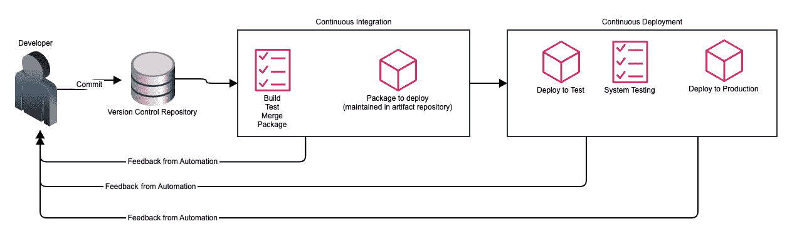
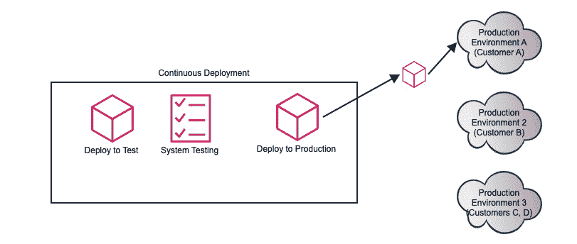
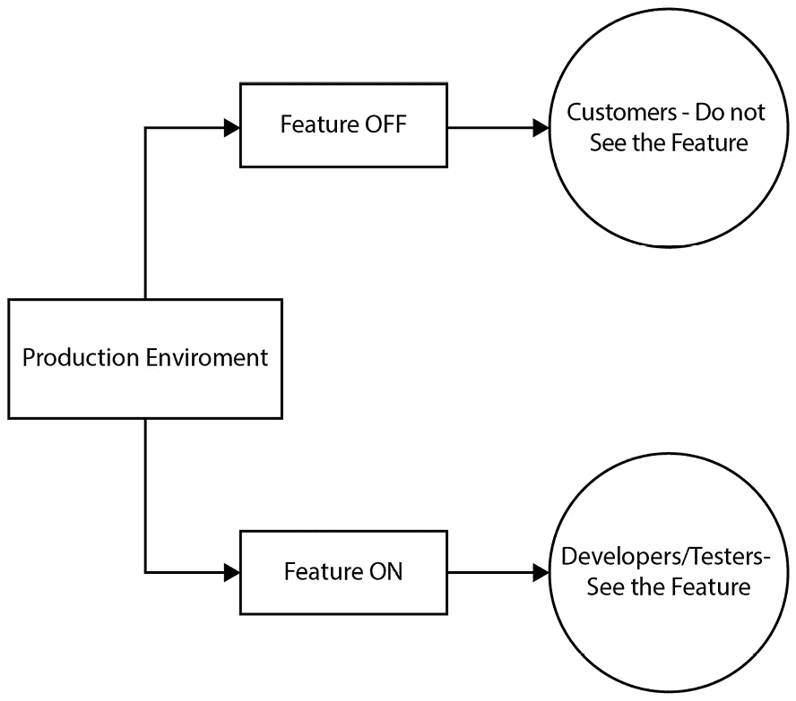
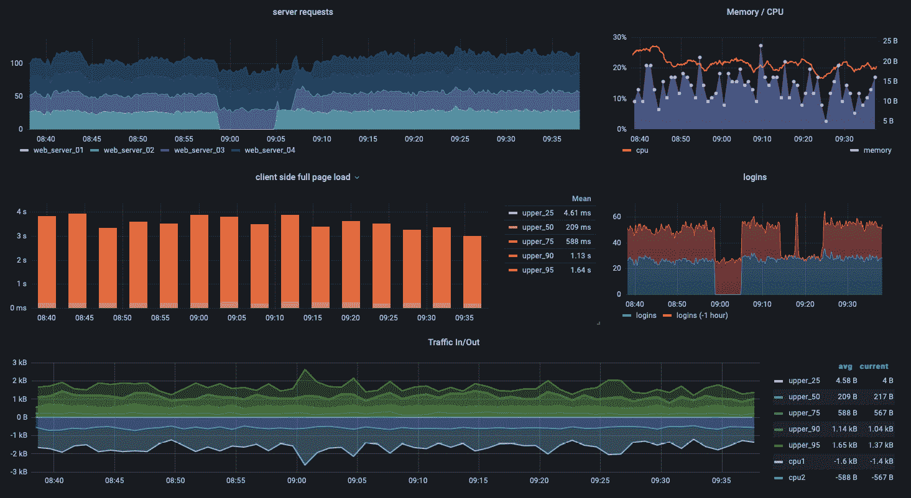
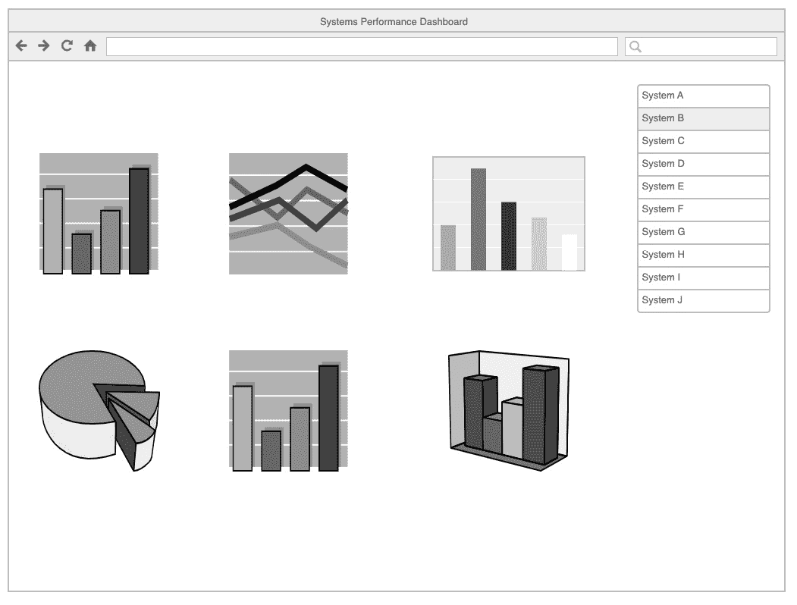

# 第十二章：持续部署到生产环境

在我们继续沿着持续交付管道前进时，我们设计了特性来测试在持续探索过程中获得的效益假设。这些特性的实现发生在持续集成阶段，我们在这一阶段创建了故事、开发了变更和测试，并将变更通过构建和测试过程。最终，我们的变更被放置在一个预发布环境中。

在持续部署中，我们完成了变更到生产环境的整个过程。然而，活动并不在部署到生产环境后就结束。

在本章中，我们将探讨使得在持续部署中能够实现以下操作的实践：

+   将变更部署到生产环境

+   验证变更在生产环境中的正常运行

+   监控生产环境

+   响应和从生产故障中恢复

需要记住的是，我们将部署与发布分开。我们在*第十章*，*持续探索与发现新特性*中看到了使得新变更能够自动部署到生产环境的架构问题。虽然我们持续将变更部署到生产环境，但直到我们发布这些变更，客户才会看到它们。本章将讨论如何只允许特定人员查看生产环境中的这些变更。我们将在下一章，*第十三章*，*按需发布以实现价值*中讨论按需发布。

让我们从第一项活动开始，探索持续部署：将变更部署到生产环境。

# 部署到生产环境

部署的目标是将我们的解决方案（无论是新产品还是对现有产品的增强功能）投入生产环境。在持续部署中，我们希望尽可能频繁地推动这一解决方案，同时将对生产环境的风险降到最低。

以下实践使我们能够更频繁地部署并降低生产环境中的故障风险：

+   设置暗启动

+   使用特性标志

+   自动化部署

+   基础设施即代码

+   选择性部署

+   自助部署

+   版本控制

+   蓝绿部署

我们在前面的章节中，特别是*第十一章*，*解决方案开发的持续集成*中已经讨论过版本控制。我们也在同一章中讨论了蓝绿部署。

让我们来看看其余的实践，它们是如何在降低风险的同时增加部署频率的。

## 增加部署频率

我们在*第一章*，*介绍 SAFe®和 DevOps*中看到了一组实践，这些实践使得 Flickr 能够在 Velocity 大会上宣布他们可以一天进行 10 次部署。他们通过创建脚本，确保在所有测试通过后进行自动部署。

当今的自动化和实践是 Flickr 最初成功的自动化部署的演变。为此，我们将研究今天正在使用哪些实践以及如何使用。

让我们从今天的部署自动化开始探索。

### 部署自动化

允许 Flickr 自动化其部署的脚本将从代码提交到部署的时间从天缩短到了小时。随着这一脚本的现代演变，CI/CD 管道进一步将部署时间从小时缩短到分钟甚至秒钟。让我们来看看它是如何做到的。

在整体的持续交付管道中，我们看到在持续集成过程中引入了自动化。自动化可以尽可能地在不需要人工干预的情况下完成构建、测试、合并和打包操作，如下图所示。

图 12.1 – CI 和 CD 自动化

我们继续在持续部署过程中使用自动化，如前面的图所示。在持续部署中，我们将应用程序包从持续集成的尾部提取并部署到测试环境。在测试环境中执行系统级测试后，应用程序包将被部署到生产环境。这种自动化可以通过将持续集成和持续部署结合在一起的工具来完成，如 Jenkins 以及 GitLab 和 Bitbucket 的管道。持续部署自动化也可以在像 ArgoCD 这样的工具中与持续集成分开进行。多个技术和实践方面的支持有助于在持续部署中实现有效的自动化。

第一个重要的部分是版本控制。我们已经看到版本控制对文本工件的重要性，它是 CI/CD 管道的触发器，并且能够将所有工件连接起来，以便理解特定部署或发布过程中涉及的一切。

工件库可以充当大规模二进制工件的版本控制工具，这些工件无法存储在基于文本的版本控制系统中。它们存储中间构建、代码库、虚拟机镜像和可能作为构建过程的一部分创建的 Docker 容器。如果某个组件不需要重建和测试，其工件可以直接从工件库中获取，从而节省时间和精力。

更改的大小是另一个可以减少自动化部署到生产环境所需时间的因素。我们在*第四章*，*利用* *精益流程保持工作持续推进*中看到，批量大小是促进流程流动的一个重要因素。一个小的独立更改会比一个大型更改处理得更快，因为后者可能会启动大量的重建和测试流程，影响 CI/CD 管道的效率。

自动化尽可能多的步骤，包括部署推送，将显著减少部署的前置时间。允许自动化继续进行构建和测试的后续步骤，贯穿整个持续集成和持续部署阶段，能够保持持续的工作进度，避免由于需要手动操作才能进行下一步而导致的延误。这可能将部署时间缩短到秒级，而非分钟级。

### 基础设施即代码

部署自动化的关键部分是创建和配置生产环境中的资源。**基础设施即代码**（**IaC**）使我们能够通过基于文本的描述来定义所需的基础设施及其资源配置。这些配置文件与配置管理工具一起使用，用于创建新资源、更新资源配置，或者在需要时销毁资源。如*第三章*中提到的，*提高效率与质量的自动化*，流行的 IaC 工具包括 Hashicorp 的 Terraform 和适用于 Amazon Web Services 环境的 AWS CloudFormation。

版本控制在建立顺畅的基础设施即代码（IaC）流程中扮演着关键角色，确保配置文件的演变得到记录和维护。如果产品的更改需要对生产环境中的配置进行更改，则配置文件的更改会在预发布环境中创建并进行测试。版本控制中的标签将用于将所有与更改相关的工件连接起来，从源代码到测试，再到配置文件的更改。

构建和测试配置文件的过程与开发产品或其测试没有区别。这有助于确保在生产环境中创建的资源是可靠的，并与任何产品更改保持同步。

### 选择性部署

在某些组织中，生产环境可能会被划分为多个生产环境。这种划分可能基于以下一些因素：

+   基础设施/资源

+   地理

+   客户

选择性部署利用了环境隔离，通过仅在生产环境的某一个实例上进行部署来实现。以下示例展示了一个面向单个客户的环境的选择性部署。

图 12.2 – 向客户 A 的生产环境进行选择性部署

我们前面的例子允许在有限的生产能力中与客户 A 进行测试，而其他生产环境中的客户看不到变化。在多个环境中的部署允许灵活的发布策略，例如金丝雀发布，其中变化首先发布到特定区域或客户，然后才发布到整个客户群。我们将在**第十三章**中更详细地讨论金丝雀发布，*按需发布以实现价值*。

一个现实世界中选择性部署的例子发生在 Facebook。随着 Facebook 的流行增长，发布工程团队通过开发一个*从主分支推送*系统来跟上开发活动，这使得发布更频繁。正如在[`engineering.fb.com/2017/08/31/web/rapid-release-at-massive-scale/`](https://engineering.fb.com/2017/08/31/web/rapid-release-at-massive-scale/)中详细介绍的那样，部署开始时针对 50%的 Facebook 员工，然后是 0.1%的 Facebook 生产流量，最终推广到 10%的 Facebook 生产流量。

### 自助部署

可能有正当理由，导致你的组织无法允许自动化部署到生产环境中。通常，这是为了遵守合规政策。

如果是这种情况，自助部署（通常称为一键部署）允许任何人，通常是开发人员，将通过持续集成的更改部署到生产环境中。这种方法仍然使用自动化来执行实际部署，因此开发人员没有对生产环境的无限制访问权限。

使用自动化的部署仍然会被记录和审计，以便追踪完整的活动。每次自动化部署的可追溯性可能会让业务合规部门对自动化部署的推进充满信心。

## 降低风险

Jez Humble 在《*持续交付：通过构建、测试和部署自动化实现可靠的软件发布*》一书中著名地说过以下关于部署的话：“*如果它让你痛苦，就更频繁地做它，并把痛苦提前*。”我们已经看到了一些更频繁进行部署的关键方法。现在我们将看看一些可能帮助我们应对部署痛苦的实践。

以下实践可以帮助我们降低在生产环境中引入故障的风险：

+   黑暗启动

+   功能标志

+   蓝绿部署

+   版本控制

蓝绿部署和版本控制在前几章中已有讨论。在本章中，让我们将重点放在其他的风险缓解措施上。

### 功能标志

功能标志（或功能切换）是实现黑暗启动和金丝雀发布的主要机制。通过选择功能的可见性，即是否启用或禁用标志，你可以有效地将新功能的部署与功能的发布分离，后者使功能对所有用户可用。

功能标志还允许在生产中出现问题时迅速回滚。只需在发现问题的第一时间禁用功能标志。

设置功能标志时，重要的是要测试功能标志在两个状态下的行为：测试功能标志启用时的效果，然后是禁用时的效果。这个测试应该在预生产环境中完成，远在部署到生产环境之前。

功能标志的存在确实增加了整体解决方案的复杂性，因为它增加了更多的行为测试组合。使用过多的功能标志，尤其是对于那些已经发布很久的过时功能标志，会增加测试的复杂性并产生技术债务。过时的功能标志应该在第一时间被移除。

### 暗推出

暗推出允许在生产环境中仅对开发人员、测试人员以及通常是 beta 或特定客户可见新功能，而不是对所有客户群体可见。为了实现暗推出，组织通常使用功能标志，根据需要可见性的用户群体来允许或禁止功能的可见性。

以下插图详细展示了开发人员和测试人员如何使用功能标志进行暗推出的示例。

图 12.3 – 使用功能标志进行暗推出的示例

在我们之前的示例中，新功能在生产环境中对开发人员和测试人员可见。这种可见性使他们可以在不影响客户的情况下对该功能进行实验，而客户并不会看到该功能。

开发人员和测试人员可以通过以下方式使用暗推出：

+   测试新的应用基础设施

+   动态控制哪些早期客户可以看到新功能

+   新功能的实验

暗推出通常与金丝雀发布同义。暗推出和金丝雀发布之间的主要区别在于，功能标志允许选择一部分客户查看新功能，以了解他们对金丝雀发布中新功能的反应。

我们现在需要确认这些变更不会对我们当前的生产环境产生不良影响，即使这些部署的变更没有正式发布。为此，我们需要进行测试。让我们来看看我们在生产环境中的测试过程。

# 验证功能的正常运行

产品的变更，以新功能的形式，已经进入生产环境，但这并不意味着工作已经完成。实际上，工作才刚刚开始。我们需要确保我们的功能按预期运行。这不仅从功能角度来看是对的，还涉及到与非功能性需求（NFR）相关的其他方面。

以下做法帮助我们验证生产环境中的正确行为：

+   生产环境测试

+   在生产环境中的测试自动化

+   测试数据管理

+   测试非功能性需求（NFR）

有些做法在前一章已经介绍过，但现在我们看到生产环境，我们可以更仔细地检查这些做法。让我们看看所有这些做法及其在生产中的应用。

## 生产测试

在功能开关的配合下进行暗发布，测试可以继续在生产环境的资源上进行。尽管在生产环境中的测试并不完全模拟生产环境的条件，但测试人员仍然应谨慎进行生产环境中的测试。生产测试有以下优势：

+   允许在实时、真实的场景中监控应用程序性能

+   监控应用程序在实时流量下的性能

+   进一步检测漏洞和恶意攻击

+   有助于维护应用程序的质量

在生产中运行的测试应该是测试金字塔顶部的测试，并结合前一阶段的持续集成中运行的部分测试作为基本的 sanity check。我们真正关注的是确认我们即将发布的功能行为是否符合预期。测试金字塔中的其他所有方面应该已经在测试环境和预发布环境中进行了测试。生产中的测试是对早期测试的补充，而不是替代。

成功的生产测试需要详细理解以下因素：

+   在生产环境中使用真实浏览器和设备。测试环境中可能使用了仿真器或模拟器，但它们可能无法展现与“真实设备”相同的行为。

+   允许生产环境中的真实流量来衡量在负载下的应用程序性能。毕竟，这才是应用程序将面对的流量。

+   使用功能开关让少部分开发者、测试人员和测试客户体验新功能。功能开关还允许在出现问题时快速禁用所有用户的该功能。

+   在进行生产测试时，必须持续监控生产环境。这可以在问题出现的第一时间快速关闭任何测试。此外，可能还需要恢复测试操作。

+   使用专用的测试用户账户，以便日志能够区分测试交易和真实交易。

在生产中执行的关键测试之一是 A/B 测试。在 A/B 测试中，功能开关可能会将测试中的新功能（选项“A”）分配给测试用户，以此评估该新选项在行为上是否与当前应用程序（选项“B”）有所不同。

## 生产环境中的自动化测试

在生产环境中进行测试时，功能开关管理非常重要。功能开关不仅决定功能是否可见，还决定该功能对哪些用户可见。

功能标志管理的一个关键用例发生在 Facebook。在 [`www.facebook.com/notes/10158791573022200`](https://www.facebook.com/notes/10158791573022200) 的博客文章中，Meta（Facebook 母公司）的一名工程师描述了他们如何使用 Gatekeeper 为每个 UI 变更建立 A/B 测试，测试对象为真实的 Facebook 用户。Gatekeeper 确保真实用户参与单一 UI 元素的测试，并确保 A/B 测试之间不会发生冲突。

因为 Facebook 在评估小规模变化时知道一些用户可能会有不理想的用户体验，但 Facebook 仍然致力于提供更好的整体产品。为此，如果足够多的用户不使用该 UI 元素变化，就会视为测试失败，并且不会向所有 Facebook 用户推广。

## 测试数据管理

虽然 A/B 测试可以用来确定特定功能是否会被最终用户使用，但其他测试可能需要在生产环境中进行，以查看该功能的预期流程和信息是否得以实现。

合成交易使用自动化测试脚本验证应用程序在生产环境中的端到端性能。脚本模拟用户完成交易时的操作。这些合成交易及应用程序作出的响应会被合成监控工具记录。允许合成监控和使用合成交易进行测试，能够让位于功能标志后的测试人员验证应用程序的以下特征：

+   **功能性**：应用程序是否按正确的路径运行？

+   **可用性**：应用程序在生产环境中的性能是否足够？

+   **响应时间**：这是衡量应用程序在生产环境中性能的另一个指标。

合成监控使你能够了解应用程序的关键流程以及它们的表现如何。这些内容还可以提供发布时用监控工具检查的重要事项。

## 测试 NFRs

将新功能部署到生产环境，并通过功能标志让少数用户可见，允许在发布之前评估关键的 NFRs。

合成交易和监控允许在生产环境中进行性能测试。接收生产环境中真实流量的样本能够进行漏洞测试。

在生产环境中对 NFRs 的测试是发布前功能验证的重要最后一步。这是一个关键步骤，不能忽视。合成交易和功能标志可以使 NFRs 的低风险测试成为可能，从而确保生产环境的稳健性。

当我们在生产环境中执行测试时，我们发现验证过程的关键部分是持续监控。接下来我们将探索进行持续监控所需的内容。

# 监控生产环境

监控生产环境让我们了解环境的 NFR（非功能需求）是否仍然得到保持，以及部署的新功能是否按照 NFR 中识别的约束条件正常工作并执行。

有一些实践对提供持续监控至关重要。让我们看看这些实践是什么，以及如何确保它们在我们的生产环境中得到建立。

## 全栈遥测

我们需要在不同层级上监控我们解决方案的重要指标，原因有很多。在较低层级，我们希望确保我们的生产环境稳定，并且没有失败的风险。当我们提升到更高层次来审视我们的系统时，我们希望确保我们拥有可以判断最初启动开发的商业假设是否成立的衡量指标。最终，在商业层面，我们所做的衡量可以判断开发是否与我们的战略保持一致，或者是否需要做出战略上的调整。

为了满足我们所需的各个层级的度量标准，这些度量被称为全栈遥测。以下表格详细说明了各个层级和示例度量标准。

| **测量层级** | **示例度量标准** |
| --- | --- |
| 商业 | 价值流关键绩效指标（Cycle Time, Lead Time）和解决方案关键绩效指标（收入、NPS、转化率）。 |
| IT 服务管理（ITSM） | 服务级别目标和其他服务 KPI（服务器正常运行时间和网络可用性）。 |
| 产品或解决方案 | 垃圾回收指标、响应时间、可用性和应用日志。 |
| 基础设施 | CPU 利用率、RAM 利用率、网络指标和事件日志。 |

表 12.1 – 解决方案层级的样本度量标准

所需的度量标准必须在持续交付管道的持续探索阶段设计，以确保它们能够在持续部署及之后的阶段轻松收集。计划中的度量标准应包括用于衡量利益假设的商业数据，以及能够告诉我们生产环境中系统状态的技术数据。

## 可视化显示

通过全栈遥测可以收集大量数据。使数据有用的是组织数据的方式，以便用户能够一目了然地了解环境状态，并及时识别何时需要采取快速行动。

仪表盘提供了一种可视化收集数据的关键方式。这种可视化有助于识别趋势，或理解某个重要指标是否已超出阈值，这可能表示生产中的故障。

以下是一个示例仪表盘。这是 Grafana 的云版本的公共仪表盘，Grafana 是一款用于创建仪表盘的产品。

图 12.4 – 来自 grafana.org 的示例仪表盘

仪表盘的重要性毋庸置疑，但同样重要的是这些仪表盘要对组织中的每个人都可见。透明度使得价值流中的每个人都能获取所有必要的信息，而无需等待批准或争论是否被*允许*查看单独的度量数据。

## 联邦监控

在复杂的组织中，显示数据可视化的透明度可能会很困难，尤其是当涉及多个业务线、业务单元和其他小组时。为了确保信息不被孤立，可能需要考虑如何确保信息是联邦化的，并且容易共享和交流。以下图是显示联邦信息的仪表盘示意图。

图 12.5 – 联邦仪表盘示例

在前面的图中，仪表盘显示了所选系统（系统 B）的测量数据。通过在控制面板中选择相应的系统，可以查看其他系统的信息。

在联邦结构中共享信息可以提供更多的透明度，同时鼓励各个业务单元的敏捷性。来自其他来源的数据应与本地业务单元的信息结合，提供对业务单元系统的更全面视图。仪表盘和其他信息展示机制可以显示系统数据，并允许深入查看数据及其来源。

通过仪表盘上共享和可见的各种数据，组织可以持续监控其生产环境。这可以为他们做好准备，应对在发布新功能时可能发生的生产故障。让我们来看看发生生产故障时他们可以采用的做法。

# 灾难发生时的响应和恢复

快速恢复的能力是 DevOps 方法的关键特性之一。DORA 的关键指标之一是**恢复服务的时间**，表现卓越的 DevOps 组织能够在几分钟内完成恢复。准备恢复是 CALMR 方法的一个重要部分。

为了促进恢复，我们需要了解以下做法：

+   主动检测

+   跨团队协作

+   混沌工程

+   会话回放

+   回滚并向前修复

+   不可变基础设施

在生产环境中，主动响应至关重要，因为这里是最终用户所在的环境。这里的问题是显而易见的，并且会影响我们的客户。没有及时处理的问题可能会影响到持续交付管道中其他部分的工作。

让我们来看看在生产环境中可以采取的主动做法。

## 主动检测

因为我们使用功能标志将部署与发布分离，所以可以主动测试并寻找问题，而不会干扰客户，或者更糟糕的是让客户发现问题。为测试人员启用功能标志，可以让他们在生产环境中检查新功能。

利用这个独特机会，在不干扰客户流量的前提下将新功能放入生产环境，测试人员可以进行额外的测试，执行“假设”场景，并最终计划灾难恢复程序，涉及到新功能的发布。

## 跨团队协作

对客户可见且初期信息较少的问题，可能会成为相互指责的温床。压力在一个非常显眼的问题上增加，伴随着愤怒客户的反馈。解决方案在早期可能并不明显。正是这种类型的压力，可能会考验跨团队协作的有效性，但它已被证明是解决此类问题最有效的方式。

拥有来自不同领域的开发和运维人员是我们在*第一章*，*引入 SAFe®和 DevOps*中最初讨论的 Flickr 成功的关键之一。跨部门的协作至今仍然是成功的关键。

要实现真正的协作，我们需要朝着我们在*第二章*，*共同责任文化*中识别的以任务为导向、心理安全的创造性文化迈进。随着这种文化的转变，集体拥有感就会产生，团队在不同领域之间协作，共同识别问题的根本原因，并迅速找到解决方案。这样，问题就会成为学习的机会。

## 混沌工程

在发布功能之前，你可以主动进行一个混沌工程练习，利用功能标志来确保影响不会被现有用户看到，这是一项值得做的练习。

最著名的混沌工程案例来自 Netflix。正如在[`netflixtechblog.com/the-netflix-simian-army-16e57fbab116`](https://netflixtechblog.com/the-netflix-simian-army-16e57fbab116)的博客文章中所详细描述的那样，Netflix 运行了一套名为“Simian Army”的工具，模拟亚马逊 Web 服务云中的生产故障。其中最著名的工具是 Chaos Monkey，它模拟虚拟服务器宕机。实验通常在工作日进行，工程师们会实时监控并处理发现的问题。

你可以进行类似于 Chaos Monkey 执行的练习。通过模拟故障情况来测试新功能是否足够健壮。在实验结束后，通过复盘来确定下一步行动。

完整的方法详细介绍请参见*第六章*，*从生产故障中恢复*。如果在错误预算中有足够的时间，可以对已经发布的现有功能进行混沌工程练习。如果功能管理非常健全，可以对未发布的功能进行练习。

## 会话重放

一个有用的故障排除工具是会话回放。会话回放是记录单个用户交易并回放这些交易的能力。执行会话回放具有以下优点：

+   开发人员可以了解用户在网站的可用性方面可能遇到的问题，并且可以洞察用户如何真正使用某个功能。

+   开发人员可以查看用于在网站上执行欺诈性交易的操作，这有助于关闭潜在的漏洞。

+   对于生产故障，开发人员可以查看用户执行的具体操作序列，从而导致故障发生。

在客户端执行的会话回放展示了终端用户的操作视角。这些工具允许开发人员看到光标的位置、点击的内容以及输入的内容，像视频回放一样。Dynatrace 和 Datadog 是提供会话回放功能的工具示例。

基于服务器的会话回放捕获所有网站流量，包括键入内容和点击的内容，但不包括滚动和鼠标移动。

使用会话回放时，必须关注会话数据。此类数据通常包含私人信息，如密码，并且可能需要大量存储空间。

## 回滚和向前修复

当生产故障发生时，恢复稳定环境的两种快速方法包括回滚和向前修复。

回滚是将生产环境恢复到先前的版本，即不包含可能导致生产故障的最新更改的版本。正如我们在*第六章*《从生产故障中恢复》中看到的那样，回滚的两种常见方法是蓝绿部署和功能标志。

蓝绿部署是一种简便的方法，可以将生产环境回滚到空闲环境，并将原先空闲的环境恢复为活跃状态。在回滚过程中，必须特别注意表示状态的组件，如数据库或易变存储。这些组件在回滚时需要谨慎处理。

功能标志是一种简便的方法，用来在新功能发布导致生产环境故障时隐藏该功能的可见性。将功能标志切换回关闭状态不需要进行大量的代码或配置更改。

向前修复是解决生产环境稳定性的另一种方法。为了进行向前修复，你需要在持续交付流水线中开发并传播故障修复，以便将其部署并发布到生产环境。当执行向前修复时，建议你通过持续交付流水线使用标准部署流程，并且不要跳过任何测试。绕过测试进行“快速修复”可能会导致更大的技术负担。

## 不可变架构

自动化部署到测试、预发布环境，最终到生产环境的一个主要原因是为了使架构不可变。也就是说，环境中的任何变化都不能手动进行。

任何环境中的变化必须通过持续交付管道进行，并且每个变化所需的工件必须记录在版本控制中。与版本控制和持续交付管道的紧密耦合防止了配置漂移或不同环境之间的变化差异。

# 总结

在本章中，我们继续探索将持续交付管道引入生产环境的过程。在持续探索阶段完成设计后，我们的特性进入了持续集成阶段进行开发和测试，现在准备部署到生产环境。自动化在执行将变化引入生产环境的步骤中起着关键作用，可能使用基础设施即代码（IaC）来创建和配置新的生产资源。

即使在生产环境中引入了新变化，测试仍然会进行，以便在发布之前建立信心。功能标志允许工程师和选定的测试客户在生产环境中对新变化进行测试，同时对普通用户隐藏。以合成事务形式存在的测试数据允许进行功能测试和非功能性需求（NFRs）测试。

在生产环境中的监控让我们能够看到生产中测试的成功或失败。我们希望确保从系统资源到可能作为领先指标的那些度量数据都能反映出我们希望实现的收益假设。我们希望这些数据在仪表盘上可见，且对所有人透明。如果监控显示生产环境出现问题，我们将准备采取行动。整个价值流协同工作，找到根本原因。我们可以回滚到之前的版本，或修复问题，并通过持续交付管道传播修复。

我们的变化现在已经进入生产环境。接下来，我们等待最后一个事件：发布给我们的用户，以便他们能利用这些变化。为此，我们将在下一章中探讨我们的持续交付管道的最后阶段——按需发布。

# 问题

1.  什么有助于减少部署到生产环境的交付时间？（选择 3 项）

    1.  单元测试

    1.  小批量变化

    1.  版本控制

    1.  行为驱动开发

    1.  自动化部署

1.  哪种实践可以让你执行金丝雀发布？

    1.  基础设施即代码

    1.  蓝绿开发

    1.  选择性部署

    1.  自助部署

1.  功能标志允许……（选择 3 项）

    1.  测试人员在生产环境中查看未发布的特性

    1.  让你更快地运行单元测试

    1.  开发人员开始部署到生产环境

    1.  在生产环境故障发生时回滚新特性

    1.  进行 A/B 测试的精选客户群体

    1.  CI/CD 管道的执行

1.  在生产环境中运行合成事务可以帮助衡量……（选择 3 项）

    1.  周期时间

    1.  功能性

    1.  可扩展性

    1.  可用性

    1.  响应时间

1.  全栈遥测应该衡量哪些操作级别？

    1.  IT 服务管理

    1.  商业

    1.  解决方案

    1.  基础设施

    1.  上述所有

1.  服务器端会话重播中可以回放哪些信息？

    1.  向下滚动网页

    1.  网页表单上的输入字段

    1.  将鼠标光标从左向右移动

    1.  水平滚动到按钮

1.  在不可变架构中如何进行生产环境的更改？

    1.  管理员更改生产环境中的文件。

    1.  管理员更改配置文件并执行 IaC 工具来创建更改。

    1.  管理员更改配置文件，将更改提交到版本控制，并执行 CI/CD 管道。

    1.  管理员重新启动生产服务器。

1.  请列举两个有助于实现不可变架构的实践。

    1.  特性标志

    1.  版本控制

    1.  CI/CD 管道

    1.  蓝绿部署

    1.  行为驱动开发

# 进一步阅读

+   来自 Scaled Agile 特性指导的总结，关于持续交付管道中的持续部署：[`www.scaledagileframework.com/continuous-deployment/`](https://www.scaledagileframework.com/continuous-deployment/)

)

+   来自 Meta（Facebook 母公司）工程师的观点，描述了 Facebook 如何进行测试、部署和发布：[`engineering.fb.com/2017/08/31/web/rapid-release-at-massive-scale/`](https://engineering.fb.com/2017/08/31/web/rapid-release-at-massive-scale/)

+   *持续交付：通过构建、测试和部署自动化实现可靠的软件发布*，作者 Jez Humble 和 David Farley——关于创建 CI/CD 管道的权威指南，详细讲解了集成、部署和发布。

+   来自 LaunchDarkly 的博客文章，LaunchDarkly 是特性标志管理的供应商，描述了特性标志的使用和好处：[`launchdarkly.com/blog/guide-to-dark-launching/`](https://launchdarkly.com/blog/guide-to-dark-launching/)

+   一篇文章描述了在生产环境中进行测试的优势：[`www.softwaretestingmaterial.com/testing-in-production/`](https://www.softwaretestingmaterial.com/testing-in-production/)

+   一篇详细的博客文章，描述了在生产环境中进行测试的用途和优势：[`www.tothenew.com/blog/testing-in-production-environment-what-why-and-how/`](https://www.tothenew.com/blog/testing-in-production-environment-what-why-and-how/)

+   一篇文章描述了 Facebook 如何使用 Gatekeeper 监控生产环境中的用户测试：[`www.facebook.com/notes/10158791573022200/`](https://www.facebook.com/notes/10158791573022200/)

+   一篇博客文章，描述了在测试新特性时使用合成事务：[`www.netreo.com/blog/synthetic-transactions/`](https://www.netreo.com/blog/synthetic-transactions/)

+   一篇来自 Netflix 工程师的博客文章，描述了他们如何使用一套称为“猴子军团”的工具进行混沌工程：[`netflixtechblog.com/the-netflix-simian-army-16e57fbab116`](https://netflixtechblog.com/the-netflix-simian-army-16e57fbab116)
