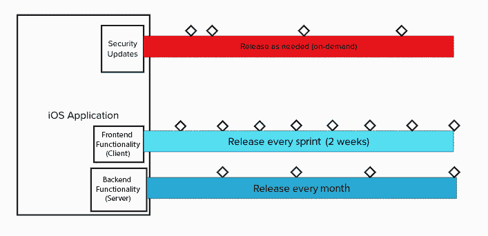
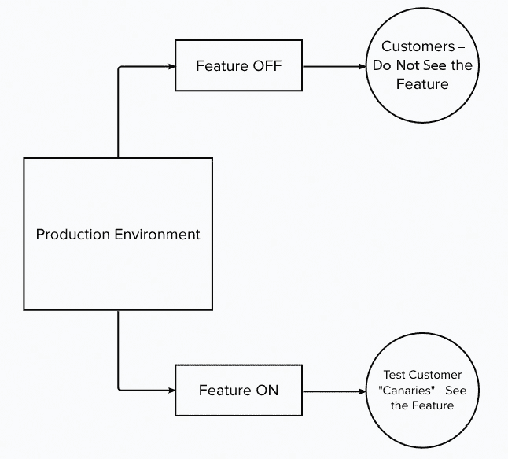
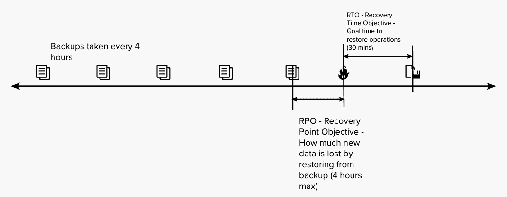

# 第十三章：按需发布以实现价值

我们现在已经完成了持续交付管道的旅程。我们从一个为客户提供价值的假设开始，并将其转化为在持续探索中开发的功能。在持续集成中，我们逐个故事地开发功能，并将这些变更应用到版本控制中，利用持续交付管道的自动化构建和测试这些变更，直到它们准备好进入生产环境。在持续部署中，我们将变更传播到生产环境，但始终将其隐藏，直到我们准备好发布。

现在我们准备将变更发布给客户。按需发布我们的变更包括以下四个活动：

+   将这些价值发布给客户

+   在运营中稳定我们的解决方案

+   衡量价值

+   学习结果

让我们从查看发布过程开始。

# 向客户发布价值

到目前为止，我们已将变更放入生产环境，并测试它们以确保功能、安全性和可靠性。现在我们准备发布。我们希望将变更发布给客户，原因如下：

+   我们认为现在是客户可以利用的时机，并且组织认为市场需求较高时

+   我们有信心这些变更不会对生产环境产生负面影响

即便有这些原因，我们也许不希望一次性发布所有内容。1985 年 4 月 23 日，可口可乐公司宣布对其旗舰软饮配方进行首次重大更改。*新可乐*在超过 200,000 次盲测中，成功击败了可口可乐的主要竞争对手百事可乐。然而，发布后，反应迅速且负面。对新配方的强烈反对迫使可口可乐在仅 79 天后重新推出原始配方，命名为*可口可乐经典*。从那时起，许多公司在向整个市场发布之前，采取了逐步发布的策略。

如果我们希望采用逐步发布的方式，我们将使用以下实践：

+   功能开关

+   黑暗发布

+   通过组件架构解耦发布

+   金丝雀发布

在前面的章节中，我们已经讨论了功能开关和黑暗发布，参考*第十二章*，*持续部署到生产环境*。让我们来看一下通过组件架构解耦发布和金丝雀发布的其他实践。

## 通过组件架构解耦发布

在*第十章*，*持续探索与发现新特性*中，我们讨论了如何将架构设计作为开发新特性时的关键活动之一。其一部分是确保可发布性，以符合组织的商业优先事项。

实现这种可发布性的一种方法是将你的产品或解决方案架构成主要的解耦组件。这些组件可以有各自独立的发布节奏。

在*第二章*，*共享责任文化*一章中，我们首次介绍了运营和开发价值流的概念。我们讨论了开发价值流是如何设计、开发、测试、发布并维护一个产品或解决方案的，并且我们识别出几个开发价值流，它们的解决方案是我们视频流服务的运营价值流所依赖的。

回到这个例子，我们来检查一下其中一个开发价值流，即维护移动应用程序的价值流。这个价值流有多个组成部分，每个部分的发布节奏不同，如下图所示。

图 13.1 – 移动应用程序价值流的解耦发布计划

在我们的移动应用程序价值流示例中，我们会在漏洞出现后，随着它们通过持续交付管道的流动，发布安全更新。

其中一个组成部分是移动设备上看到的界面和逻辑，也就是我们所说的前端。这里的开发可以以较快的节奏发布，实际上是在每个冲刺的结束时发布。

另一个组成部分是处理视频流服务数据中心或云端的逻辑和处理，称为后端。在这个例子中，该组件的发布周期是每月一次。

## 金丝雀发布

“金丝雀发布”这一术语来源于矿业中的做法——带一只金丝雀进入煤矿。金丝雀会作为有毒气体存在的警告。由于其体积较小，如果它在煤矿中死亡，说明矿井中存在有毒气体，矿工应该立即撤离。

就现代产品开发而言，金丝雀发布是将产品或新特性发布给一个小范围的用户群体，以便在全体用户之前获取他们的反馈。

要设置金丝雀发布，再次使用功能标志来决定谁可以在生产环境中看到变更。这一功能标志配置如以下图所示。

图 13.2 – 使用功能标志的金丝雀发布配置

另一种执行金丝雀发布的方式是在分布式生产环境中。如果生产环境位于不同的地理区域，变更会首先在一个生产环境中发布，供一部分用户使用，而其他生产环境则保持其版本不变。如果一切顺利，最终其他区域的生产环境将会被升级。

金丝雀发布的优势在于，它们允许进行 A/B 测试，在该测试中，接受变更的*A*组可以与未变更的*B*组或对照组进行比较，以查看新的变更是否对用户行为产生了预期的影响。将金丝雀发布作为实验进行时，确实需要能够测量用户和系统行为的能力，这是全栈遥测的一部分。

可能会有一些情况不适合进行金丝雀发布，以下是一些原因：

+   如果解决方案是关键任务、医疗或安全系统的一部分，且对故障的容忍度较低

+   如果最终用户对被当作*小白鼠*或测试版测试人员做出负面反应

+   如果变更需要对后端配置进行修改，如数据库架构，而这些修改与当前生产版本不兼容

随着我们将发布从最初的金丝雀用户扩展到整个用户群体，我们希望能够确保我们的生产环境保持弹性。这可能需要我们稳定解决方案并确保其正常运行。在接下来的部分中，我们将探讨实现这一目标的步骤。

# 稳定并运营解决方案

我们的目标是确保生产环境保持稳定，能够承受新的变更，并持续提供可持续的价值交付。为了维持这一活动，我们希望应用以下实践：

+   网站可靠性工程

+   故障转移和灾难恢复

+   持续安全监控

+   为运营架构设计

+   监控非功能性需求（NFRs）

我们之前在*第十二章*中探讨了如何测试和监控 NFRs，*持续部署到生产环境*。让我们来看看剩余的实践。

## 网站可靠性工程

我们首次在*第六章*中了解了**网站可靠性工程**（**SRE**），*从生产故障中恢复*。在这一章中，我们看到网站可靠性工程师使用以下四种实践来维护生产环境，特别是当大规模系统需要高可用性时：

+   使用**服务级指标**（**SLI**）和**服务级目标**（**SLO**）制定错误预算

+   通过发布工程创建发布标准

+   与发布协调工程团队合作进行产品发布

+   通过混沌工程和事件管理程序进行恢复演练

在*第六章*中，我们看到，如果可用性 SLO 为*四个九*（99.99%的可用性或更高），那么每月允许的停机时间为 4 分钟 23 秒。为了保持这一可用性，SRE 会使用前述的实践来确保系统的可靠性，并且会定义和排练标准的事件管理政策，以最小化问题发生时的停机时间。

谷歌采纳的其他原则和实践能帮助我们更好地理解 SRE 学科及其如何推动 DevOps 方法。为了理解这些额外的原则和实践，可能需要了解 SRE 在谷歌的起源。

SRE（站点可靠性工程）始于 2004 年，由 Ben Treynor Sloss 在谷歌发起。他的初衷是重新思考系统管理的操作方式。他希望从软件开发的角度来解决运营中发现的问题。从这个角度出发，除了之前提到的实践之外，还出现了以下原则：

+   消除繁重工作，即找到重复性的任务并查看是否能够消除这些任务

+   增加自动化使用，作为一种有效消除繁重工作的方式

+   监控生产环境的各个方面，这有助于实现可观察性

Sloss 为其初始 SRE 团队招募的人员将一半时间用于开发，另一半时间则用于操作，跟踪他们从头到尾开发的变化。这使他们能够培养必要的操作技能，并保持开发专长。

自 2004 年以来，随着技术的进步，许多实践被引入 SRE 学科。然而，许多站点可靠性工程师仍然坚持之前提出的原则。在可靠性作为关键非功能性需求的情况下，采纳这些原则和实践可能会带来实际的好处。

## 容错和灾难恢复

穆菲定律（Murphy’s Law）著名地指出：“*任何可能出错的事情，都会出错*。”从这个意义上讲，问题不在于系统是否会遭遇灾难，而在于*何时*遭遇灾难。我们已经探索了防止灾难的方法，并使用混沌工程来模拟灾难，但是否还有其他准备灾难的方式？

灾难恢复专注于确保在自然或人为灾难发生时，确保对业务重要的技术方面尽快恢复。灾难恢复包括以下要素，以为最坏的情况做好准备：

+   **灾难恢复团队**：一群负责创建、实施和管理灾难恢复计划的人员。灾难恢复计划概述了团队在紧急情况下需要遵循的职责，包括与其他员工和客户的沟通。

+   **风险评估**：灾难恢复团队应识别可能发生的场景，并为每种情况制定相应的响应措施。例如，如果发生网络攻击，灾难恢复计划中的步骤应该是什么？

+   **资产识别与评估**：灾难恢复团队应识别所有系统、应用程序、数据及其他资源。识别过程中需要评估它们对业务连续性的重要性，以及恢复它们的相关指引。

+   **资源备份**：灾难恢复计划应确定需要备份的资源、备份频率、备份存储位置以及备份保存的时间。

+   **演练**：灾难恢复计划的所有部分应定期进行演练。应尝试恢复备份，以发现备份过程中的缺陷，并确定备份是否有效。在演练过程中发现的任何缺陷应进行修复，以改进灾难恢复计划。演练应检查不断变化的威胁，看看是否需要在灾难恢复计划中加入新的措施。

灾难恢复计划将根据以下两个度量目标来确定整体策略：

+   **恢复点目标**（**RPO**）是指数据的状态，通常从上次备份的时间开始计算，当资源恢复时恢复点的状态。

+   **恢复时间目标**（**RTO**）是指灾难发生后可接受的停机时间。

让我们通过以下图示的示例来解释这些目标。

图 13.3 – RPO 和 RTO 的示意图

在前面的图示中，我们每四小时备份一次资源。我们已经练习了对资源进行灾难恢复，并且能够在 30 分钟内可靠地恢复操作。当灾难发生时，如果是熟悉的情况并且已经经过演练，我们的服务恢复时间将与我们的 RTO 目标相匹配，为 30 分钟。

对于 RPO，我们需要查看上次备份的时间点。在我们的示例中，上次备份与灾难之间的时间差可能高达四小时。备份频率越高，RPO 就越低。

灾难恢复机制可以采取多种形式。组织可以选择使用以下方法之一或多种组合：

+   **备份**：备份是最简单的灾难恢复形式。请注意，这确保了数据的安全，但对于基础设施没有任何帮助。

+   **冷站点**：冗余的第二生产环境。这可以确保业务连续性，但无法恢复数据。蓝绿部署就是一个冷站点的例子。

+   **热站点**：一个冗余的第二生产环境，其数据与活动生产环境定期同步。

+   **灾难恢复即服务（DRaaS）**：供应商将组织的处理能力从组织自身的基础设施转移到其自身的（通常是云基础设施）中。

+   **备份即服务（BaaS）**：备份由第三方供应商执行，并存储在异地或云基础设施中。

+   **数据中心灾难恢复**：这些是组织场所上的设备，用于应对如火灾或停电等灾难。这些设备的例子包括备用发电机或灭火设备。

## 持续安全监控

在我们持续交付流水线的前期阶段，我们对安全的关注重点是预防。我们希望确保我们设计和开发的变更不会引入安全漏洞。因此，我们在流水线中执行的自动化安全测试检查了代码变更。

随着代码发布，我们的关注点从预防转向检测来自恶意行为者的威胁。我们寻找利用当前未知漏洞的攻击或入侵。

**国家标准与技术研究院**（**NIST**）将**持续安全监控**（**CSM**）视为信息安全持续监控。在 2011 年 9 月发布的白皮书中（[`nvlpubs.nist.gov/nistpubs/Legacy/SP/nistspecialpublication800-137.pdf`](https://nvlpubs.nist.gov/nistpubs/Legacy/SP/nistspecialpublication800-137.pdf)），他们将信息安全持续监控定义如下：

*信息安全持续监控（ISCM）被定义为保持对信息安全、漏洞和威胁的持续意识，以支持组织的风险* *管理决策。*

白皮书进一步定义了通过以下步骤实施 CSM 的过程：

1.  通过查看风险容忍度来定义策略，包括资产的可见性、漏洞意识、当前威胁信息，以及对任务或业务的影响。

1.  建立一个程序，包括指标的定义、状态监控频率和技术架构。

1.  实施该程序并收集与安全相关的信息，用于度量、评估和报告。尽可能实现信息的收集、分析和报告自动化。

1.  分析发现并报告。

1.  响应发现的问题。

1.  审查并更新监控程序。

需要监控的资产不仅包括由组织直接维护的资产，还可能扩展到第三方和供应商。监控工具可能会查看以下资产：

+   **已知资产**：属于组织资产清单的一部分

+   **未知资产**：被遗忘的资产，包括开发网站或旧的营销网站

+   **恶意资产**：由恶意行为者创建的资产，可能伪装成组织的域名

+   **供应商资产**：第三方供应商拥有的资产

一旦识别出资产，应检查其可能的威胁和漏洞。以下是一些常见的威胁和漏洞：

+   **不必要的开放 TCP/UDP 端口**：任何开放的端口如果相关服务配置错误或未修补，可能会成为问题，从而可能暴露出漏洞。

+   **中间人攻击**：这是一种网络攻击，攻击者介于两方之间，双方认为它们有直接连接，但攻击者可能监听甚至修改信息，然后再传输给另一方。

+   **邮件安全差**：这可能会让你的组织暴露在邮件欺骗攻击中。

+   **域名劫持**：攻击者在未获得域名所有者许可的情况下，改变了一个组织的域名注册。

+   **跨站脚本攻击**（**XSS**）**漏洞**：攻击者可以在网页上注入客户端脚本，从而绕过访问控制。

+   **泄露的凭证**：通过数据泄露事件发现，它们允许攻击者访问组织系统。

+   **数据泄露**：私人或敏感数据的暴露。

+   **域名拼写欺骗**：这是一种网络域名抢注形式，攻击者注册与已知组织域名相似的域名，期望有人错误输入网址并进入攻击者的网站。

识别这些攻击可能是自动化监控后进行的评估的一部分。缓解步骤和行动将明确谁在组织内执行修复步骤并协调响应。

## 针对运维的架构设计

在持续交付管道的这个阶段执行的支持活动将对系统架构产生深远的影响，甚至可能推动产品或解决方案未来的方向。这些可能是系统架构师在持续探索阶段考虑新功能时所做的架构决策的一部分。

在这一阶段做出的决定可能会被纳入持续探索阶段，具体项目包括以下内容：

+   由站点可靠性工程师创建的修复和新自动化工具

+   因灾难恢复计划中发现的缺陷而导致的更改，这些缺陷影响了测试、预发布或生产环境的配置。

+   CSM 发现的新漏洞，产品架构必须防止这些漏洞未来的发生。

因此，系统架构师成为了有意架构与突发设计的平衡点，监督着产品或解决方案的预期架构，同时也考虑环境等因素对架构变更的需求。

这个阶段的学习不仅限于架构方面。我们还必须从产品性能的角度评估我们的开发是否实现了收益假设。为此，我们需要衡量我们解决方案的价值。让我们在下一部分中探讨这个问题。

# 衡量价值

在持续交付管道的设计与开发过程中，我们已对我们的更改进行了一系列测试。现在我们将查看最终测试，以回答以下问题：我们的开发努力是否为客户带来了价值，达到了既能使客户受益，又能使组织受益的程度？

为了帮助我们回答这个问题，我们将查看以下活动：

+   创新会计

+   证明/反驳收益假设

我们将首先回顾创新会计及其来源：精益创业循环。基于这些知识，我们将看到领先指标和滞后指标如何验证或反驳我们在持续探索中创建的收益假设。

## 创新会计

我们首先在*第五章*中看到了创新会计，*衡量过程和解决方案*。在本章中，根据埃里克·里斯的《精益创业：当今企业家如何利用持续创新创造极为成功的企业》，我们了解到，衡量标准对于评估收益假设是否成立非常重要。

里斯在他后续的书《创业之道：现代公司如何利用企业家管理转变文化并推动长期增长》中进一步扩展了创新会计。在书中，他对创新会计给出了以下定义：

*创新会计（IA）是一种评估进展的方法，当一个成熟公司通常使用的所有衡量标准（收入、客户、投资回报率、市场份额）都* *几乎为零*时，才适用此方法。*

他提出了三层创新会计，每一层都有不同的衡量标准。现在我们来看看这些层级。

### 第一层级：仪表盘衡量标准

这些衡量标准作为起点。里斯建议设置一个仪表盘。在这个初步的仪表盘上，显示的是开发团队认为重要的面向客户的衡量标准。这些衡量标准基于每位客户的投入。以下是用于学习的每位客户的衡量标准：

+   转化率（通常是指从免费版到付费版产品的客户百分比）

+   每位客户的收入

+   每位客户的生命周期价值

+   客户保持率

+   每位客户的成本

+   推荐率

+   渠道采用

像这样的衡量标准有助于强化开发可以在观察到其努力成果后影响这些标准的观点。这里可见的衡量标准有助于保持开发过程与反馈保持一致。

### 第二层级：商业案例衡量标准

在第二层级中，我们会使用一组不同的衡量标准深入探讨。在这里，我们尝试量化“*信念飞跃假设*”，正如里斯所说的那样。信念飞跃假设分为以下两类：

+   **价值假设**：这些描述了用户从产品或解决方案中获得的价值

+   **增长假设**：新用户如何找到产品？

这些类型的假设对于任何新开发都是必需的，否则就不会有新的开发。这些假设通过最小可行产品（MVP）及其他验证性实践得到检验。

以下衡量标准展示了假设和假设的分类：

+   客户保持率（价值假设）

+   推荐率（价值假设）

+   口碑推荐（增长假设）

价值假设关注客户行为。它们基于用户的积极行为来实现。增长假设则关注可持续增长。

### 第三层级：净现值

在这个层级，我们关注的是长时间段的表现。随着你获得新的数据，并重新评估或比较当前数据与预测数据的差异，变化会逐步显现。我们关注的是产品未来表现的长期驱动因素。

以下度量指标可能为长期提供指导：

+   网站用户数量

+   访客转化为用户的百分比

+   付费用户的百分比

+   用户支付的平均价格

这些度量指标通常涉及的不仅仅是开发团队。财务团队可能也会参与进来，目标是在此时将重点转向产品的财务表现。

## 证明/反驳收益假设

现在我们已经了解了创新会计中的步骤，接下来我们来看看它们如何与我们在持续探索中创建的收益假设对照。

在我们穿越持续交付管道的旅程中，我们在持续探索中创建了我们的收益假设。为了衡量假设的有效性，我们可能会在仪表板中加入第二级度量标准。我们的仪表板通过我们在测试、预发布和生产环境中设计的全栈遥测，自动获取这些度量数据。

我们可能会从持续部署阶段的测试中获得一些迹象，但真正的测量结果会来自按需发布，首先是在 A/B 测试或金丝雀发布中，随后是一般发布。我们希望看到表现与初始收益假设之间的所有关联。

我们现在在此步骤中收集和分析的数据，不仅仅是为了改进产品，也为了改进我们的价值流和开发流程。让我们探索下一个部分，看看这两者是如何实现的。

# 从结果中学习

根据我们的学习，我们现在需要找出最佳的下一步。无论是从产品角度，还是从价值流角度来看，这都是正确的。

对于我们的产品来说，关键在于确定最佳方向。这可能意味着是否该调整方向，改变我们的整体产品战略，或者坚持原有方向继续前进。

对于我们的价值流，这段时间用于反思如何改进。我们可以从中学到哪些经验，以便改进？

以下实践用于确定产品未来方向以及价值流的未来方向：

+   《精益创业》中的调整方向或坚持原有方向

+   不断改进

+   价值流映射会议

我们进行这种学习是为了能够在持续交付管道的起始阶段重新聚焦，设定执行的想法。我们通过改进价值流来提升持续交付管道的表现。

让我们来看一下这些可以帮助我们改进的实践。

## 调整方向或坚持原有方向

在 *第十章* *持续探索与寻找新功能* 中，我们观察了 Eric Ries 的 Build-Measure-Learn 循环在 SAFe® 精益创业循环中的应用，在这里我们看到了 Epics 是如何通过效益假设来创建的。这些 Epics 通过**最小可行产品**（**MVP**）进行实施，MVP 作为实验来验证或反驳效益假设。MVP 通过创新会计和领先指标的追踪进行评估，这些指标将用于决定是转变方向还是坚持下去。

我们现在正处于作出这一决定的时刻。对于我们的 ART，MVP 可能是通过持续交付管道初期创建的一些功能。我们已经开发了这些功能，进行了测试，并通过管道中的持续集成和持续部署阶段将其部署到生产环境中。现在，在按需发布中，我们将 MVP 作为功能展示给用户群体，看看效益假设是否得以验证。根据我们通过完整堆栈遥测收集的创新会计指标，我们做出了以下两个决定：

+   **转变方向**：我们的功能未能达到预期效益假设。是时候朝着不同的方向前进了。这可能包括停止该产品方向的开发。

+   **坚持下去**：我们的效益假设已经得到验证。我们应该继续开发更多功能来增强我们的 MVP。

请注意，即使在我们为 MVP 作出坚持决策之后，我们的功能仍然会被评估，以确定它们是否证明是有价值的，并且产品方向仍然能与客户产生共鸣。

## 不懈改进

我们第一次看到不懈改进是在我们首次检查 SAFe 精益之屋时，在 *第二章* *共享责任文化* 中提到。我们提到，在不懈改进中，我们寻求通过那种“潜在的危险感”来寻找变得更好的机会。

在整个开发过程中，团队和 ART 一直在寻找改进价值流动的机会。团队定期在每次迭代结束时举行回顾会议，以识别团队层面的问题，而 ART 在每个项目增量结束时举行**检查与调整**（**I&A**）活动，以便审视系统性问题。

其他改进可能会出现在持续交付管道本身。更新的工具、额外的测试以及持续的维护使 ART 能够保持或改进他们创建实验的方式，以验证效益假设。

## 额外的价值流映射会议

不懈改进的另一个重要部分来自于价值流管理和持续学习，这些理念最早在 *第九章* *通过持续学习走向未来* 中进行了讨论。

我们最初在价值流映射中执行的一个活动，不仅是绘制当前的价值流图，还包括识别一个理想的*未来状态*价值流。改进行动可以通过向着理想价值流的小步迭代变化来实现。

另一个改进步骤是至少每年举行一次价值流映射会议，以评估当前迭代中的价值流。这使得 ART 能够查看目前阻碍价值流动的瓶颈。在这次价值流映射会议中，可以为新的改进确定一个新的未来状态价值流。

# 总结

在本章中，我们已达到持续交付管道的最后阶段：按需发布。在使用功能标志让测试人员查看开发环境中的新变化后，我们可以使用它们将这些变化逐步发布给少量用户进行金丝雀发布。我们可能还希望设置架构，使每个组件具有不同的发布节奏。发布后，我们希望确保这些变化不会破坏环境，并且我们的整体解决方案是稳定的。为此，我们遵循 SRE 的原则和主要实践，包括准备灾难恢复。

在稳定环境中发布变更后，是时候通过全栈遥测来衡量业务结果了。我们在持续探索过程中选择了我们的度量标准，依靠创新会计原则。通过查看每个人都可以看到的仪表板上的这些度量，我们可以尝试确定我们在持续探索中创建的利益假设是否有效。

基于利益假设是否有效，我们必须决定是转型、改变方向，还是坚持并继续在相同的产品方向上发展。在做出决定后，ART 通过回顾、I&A 以及定期绘制价值流图来查看其他改进机会。

这使我们接近*第三部分*的结尾。接下来，我们将在本书的最后一章中看看新兴趋势，以及在 DevOps 采纳过程中取得成功的一些技巧和窍门。

# 问题

1.  以下哪些是 SRE 的关键实践或原则？（选择 3 个）

    1.  使用功能标志进行 A/B 测试

    1.  通过自动化减少无谓劳动

    1.  在生产环境中运行单元测试

    1.  通过错误预算了解自己能承受多少风险

    1.  混沌工程

    1.  在生产环境中测试

1.  以下哪些应成为灾难恢复计划的一部分？（选择 3 个）

    1.  确定灾难恢复团队

    1.  资源识别

    1.  供应商联系信息

    1.  服务器原理图

    1.  备份计划

    1.  重要文件的纸质版本

1.  数据库每两小时进行一次备份。如果数据库服务器崩溃，预期的 RPO 是多少？

    1.  2 小时

    1.  4 小时

    1.  8 小时

    1.  16 小时

1.  CSM 可以检测哪些问题？（选择 2 个）

    1.  中间人攻击

    1.  许可证违规

    1.  跨站脚本（XSS）漏洞

    1.  弱密码

1.  哪些做法不是持续改进的例子？（选择 2 项）

    1.  回顾会议

    1.  代码审查

    1.  检查与适应（I&A）

    1.  向持续交付管道添加测试

    1.  代码注释

# 进一步阅读

+   关于 New Coke 推出的描述：[`www.coca-colacompany.com/company/history/the-story-of-one-of-the-most-memorable-marketing-blunders-ever`](https://www.coca-colacompany.com/company/history/the-story-of-one-of-the-most-memorable-marketing-blunders-ever)

)

+   另一篇关于 New Coke 推出的描述，增加了竞争格局的视角：[`www.vox.com/2015/4/23/8472539/new-coke-cola-wars`](https://www.vox.com/2015/4/23/8472539/new-coke-cola-wars)

+   [`blog.getambassador.io/cloud-native-patterns-canary-release-1cb8f82d371a`](https://blog.getambassador.io/cloud-native-patterns-canary-release-1cb8f82d371a) – 介绍金丝雀发布并详细说明实现、好处和使用实例的博客文章

+   关于金丝雀发布的有趣参考资料：[`martinfowler.com/bliki/CanaryRelease.html`](https://martinfowler.com/bliki/CanaryRelease.html)

)

+   来自 LaunchDarkly 的博客文章，LaunchDarkly 是一个功能标志管理解决方案的供应商，介绍了如何使用功能标志进行金丝雀发布：[`launchdarkly.com/blog/what-is-a-canary-release/`](https://launchdarkly.com/blog/what-is-a-canary-release/)

)

+   来自 Google 的 YouTube 视频，详细介绍了站点可靠性工程的历史，包括 Ben Treynor Sloss 的视角：[`www.youtube.com/watch?v=1NF6N2RwVoc&t=6s`](https://www.youtube.com/watch?v=1NF6N2RwVoc&t=6s)

)

+   VMWare 关于不同类型灾难恢复的详细资料：[`www.vmware.com/topics/glossary/content/disaster-recovery.html`](https://www.vmware.com/topics/glossary/content/disaster-recovery.html)

)

+   来自 NIST 的白皮书，详细介绍了信息安全持续监控（Information Security Continuous Monitoring），这是在谈论 CSM 时常用的内容：[`nvlpubs.nist.gov/nistpubs/Legacy/SP/nistspecialpublication800-137.pdf`](https://nvlpubs.nist.gov/nistpubs/Legacy/SP/nistspecialpublication800-137.pdf)

+   来自 Upgard 的博客文章，Upgard 是 CSM 工具的供应商，定义了主要的安全漏洞：[`www.upguard.com/blog/continuous-security-monitoring`](https://www.upguard.com/blog/continuous-security-monitoring)

+   *The Startup Way: How Modern Companies Use Entrepreneurial Management to Transform Culture and Drive Long-Term Growth* by Eric Ries – *精益创业*的续集；进一步定义了如创新会计等概念

+   一篇博客文章，概述了关于创新会计的更多思考：[`www.boldare.com/blog/lean-startup-innovation-accounting/`](https://www.boldare.com/blog/lean-startup-innovation-accounting/)
