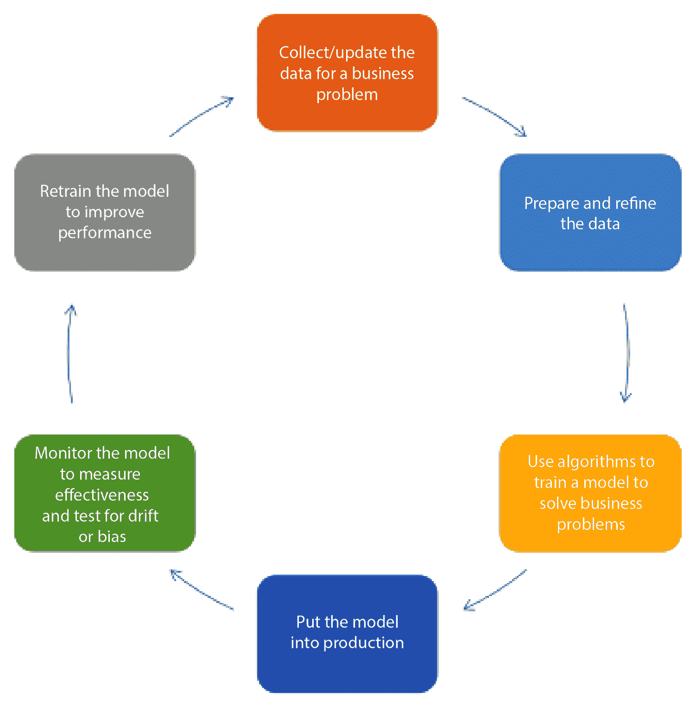
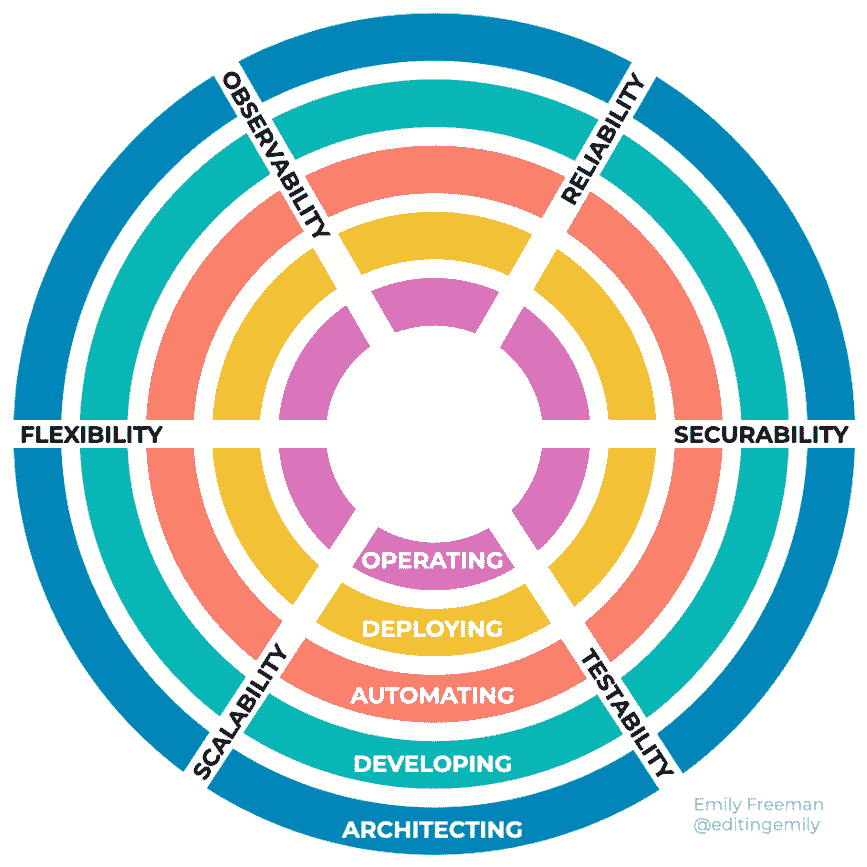
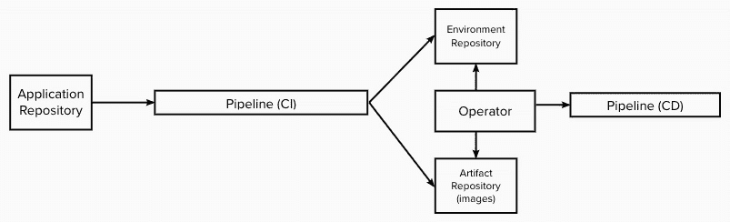

# 第十四章：避免陷阱并迈向未来

自 2009 年在 Velocity 大会上 Flickr 的演讲以来，DevOps 运动在许多方面发生了演变和变化。技术的最新进展，如容器和 Kubernetes，已经改变了许多核心实践。新方式的出现，如**站点可靠性工程**（**SRE**），也改变了人们扮演的角色。

在本章中，我们将讨论如何开始将全书讨论的原则和实践融入其中，从而成功地迈向 DevOps 转型或转向 SAFe®。

我们将探讨一些可能在 DevOps 演进中发挥重要作用的新兴趋势。我们将关注 XOps，它试图将更多组织部分融入 DevOps 和 DevSecOps 中所看到的协作方法中。我们还将看看与标准线性价值流不同的另一种视角。

我们还将探讨一些新兴技术，它们有望改变我们的工作方式。通过 IT 运维中的 AI，也称为 AIOps，我们将探讨**人工智能**（**AI**）和**机器学习**（**ML**）在预测问题和漏洞中日益增长的作用。我们还将考察版本控制与**持续集成/持续部署**（**CI/CD**）的融合，在此过程中我们将关注 GitOps。

最后，我们将看一些常见问题，并给出一些答案。

# 避免陷阱

在朝着 DevOps 方法前进的过程中，显然并非每个人都会走相同的路径。不同的组织处于不同的阶段，准备好接受所需的思维方式转变，以便实现成功的 DevOps 旅程。

话虽如此，我们将根据本书前几章所学，来看一组启动或重启 DevOps 方法的步骤。你会发现，从一个步骤到下一个步骤之间通常没有直接的路径。

让我们来看看 DevOps 旅程中的以下步骤：

+   了解系统

+   从小做起

+   开始自动化

+   衡量、学习并调整

现在让我们开始我们的旅程吧。

## 了解系统

无论我们是从头开始，还是在失败后重新开始，我们都需要从精益思维中的改进 Kata 步骤入手，评估我们当前的状况。这一评估应当是对现有流程、流程背后的人以及工具是否支持流程的全面审视。

观察所有这些方面的一种方式是进行价值流映射，正如在*第七章*中首次讨论的那样，*映射你的价值流*。正如我们在那一章中最初提到的，进行价值流映射工作坊可以帮助你发现以下几个方面：

+   从头到尾的工作流过程步骤

+   执行这些过程步骤的人

+   可能的改进领域

价值流映射工作坊还提供了一个从系统更广阔视角审视整个开发工作范围的视角。这个系统视角不仅仅是一个过程步骤和改进的系列，还包括工具在此过程中的作用，或者在尚未纳入时工具可以如何在过程里发挥作用。

价值流映射工作坊会生成两个价值流：当前价值流和一个包含增强和改进、降低周期时间和交付时间并提高**完成度和准确度**（**%C&A**）的*理想*价值流。记录这些增强项，以便价值流中的人员作为**持续****学习**（**CL**）的一部分来处理它们。

## 从小做起

在价值流映射工作坊后，查看来自*理想*价值流的改进和增强清单。从这些增强项中，价值流中的人员应选择他们认为最重要的改进来进行处理。

每次只允许一个改进的做法有助于集中精力。我们在*第四章*，*利用* *精益流动保持工作流动*中看到，通过小批量工作避免了多任务处理可能带来的问题，从而防止了工作无法完成的情况。

一种可能的改进是通过提高流动性来减少开发产品的周期和交付时间。*第四章*中的实践——如小批量、监控队列和限制在制品——也能帮助实现这一目标。遵循这些实践可能会带来更高的敏捷性，随着 DevOps 方法的实施，这种敏捷性会不断提升。

价值流中的人员可以关注的另一个改进领域是工具的使用。需要考虑的第一个基础工具是版本控制。价值流中的团队应该评估是否将所有文件放入版本控制系统。如果他们已经在使用版本控制系统，他们应该确保使用的是统一的版本控制系统，并且每个人都拥有必要的访问权限。

除了选择版本控制系统外，价值流中的人员还应该选择一个分支模型，概述他们如何从主干分支并何时将变更合并回主分支或主干。

## 开始自动化

改善价值流的一个关键步骤是建立 CI/CD 管道。如果组织尚未建立 CI/CD 管道，可以建立一个，许多版本控制系统自带这样的管道。其他组织可能希望安装一个独立的 CI/CD 管道工具，以获得更多的灵活性。无论哪种方式都可以，因为最重要的是创建这样一个管道。

CI/CD 管道可以在版本控制中通过提交触发。当发生提交时，添加必要的后续操作，每次添加一个操作。这些操作可能从构建或编译提交中来的更改开始。完成的构建可以让合并进入更高级别的分支，并可能将构建产物保存到制品库中。

## 开始自动化测试

一旦定义了 CI/CD 管道的端点，你就可以用自动化测试填充管道中的其他中间步骤。你可以创建自动运行的测试，来发现功能和安全性方面的问题。

从创建以下类别的自动化测试开始，逐一进行：

+   单元测试

+   功能测试

+   系统测试

+   安全测试（**静态应用安全测试**（**SAST**）、**动态应用安全测试**（**DAST**）和其他扫描）

自动化测试的开发现在鼓励创建多个部署环境，例如测试环境、预发布环境和生产环境。单元测试通过后，可以为其他测试级别部署测试环境。

## 创建环境、部署和监控

测试的建立让我们能够建立不同的预生产环境，所有这些环境在实践允许的情况下都是等效的。

引入新的预生产环境还允许我们为这些预生产环境引入监控。监控可以先在测试环境上启动，直到我们对部署到预发布环境甚至最终生产环境的监控有足够的信心。

构建预生产环境让我们能够建立所需的工具进行构建。配置管理工具和**基础设施即代码**（**IaC**）可以被添加来定义和配置环境。建立标准配置允许像回滚这样的功能得以实现。

## 衡量、学习并调整方向

在每一步中，我们应该评估我们所增加的每个步骤是否有助于将我们带到理想的未来状态价值流。根据需要做出调整。这些微小的课程修正促使了 CL（持续学习）。

可能会有人质疑是否是时候进行调整。正当理由总是避免*沉没成本*谬误，在这种谬误中，人们会固守原有方案，尽管有压倒性的证据表明应该做出改变。

最后一点：有一个流传已久的故事称，约翰·F·肯尼迪曾指出，中文中的*危机*一词是由*危险*和*机会*这两个词组成的。虽然中文中*危机*一词的前半部分确实可以单独表示*危险*，但后半部分则单独翻译为*变化的节点*或*转折点*。

采用 SAFe 或采用 DevOps 很像观察组成*危机*的各个角色。观察*危险*和观察*转折点*能帮助我们远离*危机*。

在本书中，我们谈到了 DevOps 从 2009 年初期到今天的演变。现在，让我们来谈谈开始出现的趋势。

# DevOps 中的新兴趋势

DevOps 运动成功的一个主题是组织内两个独立职能——开发和运维之间的协作，目的是频繁发布产品，同时保持生产环境的稳定。

随着运动的成长，它的成功鼓励了更多富有创意的协作努力，推动了除了增加部署频率和稳定性之外的其他方面的进展。我们将探讨的一些重新构想的努力包括以下内容：

+   XOps

+   革命模型

+   平台工程

让我们开始探索 DevOps 的潜在未来。

## XOps

DevOps 运动的成功鼓励了组织其他部分（除了开发和运维）加入，以便除了开发频率和稳定性外，还能提升其他方面的速度和质量。值得注意的运动包括以下几个：

+   **DevSecOps**：在管道的各个阶段纳入安全性，以确保安全性不会被忽视。目前，许多人认为 DevSecOps 方法中执行的实践已经完全融入到 DevOps 运动中。

+   **BizDevOps**：被誉为 DevOps 2.0，这一运动增加了商业团队、开发人员和运维人员之间的协作，目的是最大化商业收入。

此外，其他工程学科也通过采用 DevOps 中首次提出的相同实践获得了成功。这些面向相邻学科的 DevOps 基础运动包括**DataOps**和**ModelOps**。

让我们看看 DevOps 方法在这些工程学科中的运作方式。

### DataOps

DataOps 是将敏捷开发原则、DevOps 实践和精益思维融入数据分析和数据分析领域的过程。

数据分析遵循类似于产品开发的流程。以下步骤是数据分析中典型流程的一部分：

1.  由指导分析的人或客户指定的数据需求

1.  数据收集

1.  使用统计软件或电子表格处理数据

1.  数据清理以去除重复或错误

1.  **探索性数据分析**（**EDA**）

1.  数据建模以发现关系

1.  通过使用数据产品应用程序创建输出

1.  报告

随着数据量的指数增长，新的方法被投入使用，以便快速获取洞察。以下使用的方法类似于 DevOps 在产品开发中看到的步骤：

+   建立一个数据管道，使得数据能够通过数据分析过程处理成报告和分析结果

+   通过**统计过程** **控制**（**SPC**）验证数据流经数据管道的情况

+   在数据清理、数据分析和数据建模阶段，加入自动化测试以确保数据的正确性

+   测量数据流经数据管道的情况

+   将数据分离为开发、测试和生产环境，以确保数据管道自动化功能的正确运行

+   数据科学家、分析师、数据工程师、IT 和质量保证/治理之间的协作

基于大量数据轻松发现关系为企业提供了竞争优势。使用 DataOps 实践和原则，能够使从数据中创造洞察的人员实现更高的可靠和无误数据分析的部署率。

### ModelOps

当前技术领域中最大的趋势之一是 AI。这一趋势促使机器学习（ML）和决策模型的建立，利用大量数据不断提升性能。这些 ML 模型的开发可以为任何想要了解更多客户信息及其产品如何提供帮助的组织带来竞争优势。

现在开发有效的模型经历一个类似于**软件开发生命周期**（**SDLC**）的开发周期。2018 年 12 月，IBM Research AI 的 Waldemar Hummer 和 Vinod Muthusamy 提出了 ModelOps 的初步概念，将 AI 工作流通过 DevOps 方法中的技术，使其变得更加可重用、平台无关且可组合。

模型生命周期涵盖了如何为企业创建、训练、部署、监控 AI 模型，并根据数据反馈对模型进行再训练。以下图表展示了模型生命周期的路径：

图 14.1 – ModelOps 生命周期（作者 Jforgo1 – 自创作品，CC BY-SA 4.0，https://commons.wikimedia.org/w/index.php?curid=99598780）

由于模型生命周期和 SDLC 之间的相似性，快速部署变更、监控其对环境的影响，并学习以改进的期望行为，使得使用 ModelOps 开发的 AI 模型可以与使用 DevOps 创建的 AI 应用对齐，并且两者都依赖于使用 DataOps 开发的数据分析。

## 革新模型

软件开发中的价值流概念以传统的 SDLC 过程为模型。这个过程源自瀑布开发模式，假设开发是按照从一个活动到下一个活动的逐步线性运动进行的。随着产品的复杂度增加，DevOps 扩展了责任范围，线性的一次性活动进程是否还合理呢？

**亚马逊 Web 服务**（**AWS**）社区参与主管 Emily Freeman，也是《*DevOps for Dummies*》的作者，提出了一种不同的开发流程视角。她并未采用直线式的方法，而是提出了一个模型，在该模型中，优先级随着活动的进行而向前和向后移动，沿着活动的圆圈变化。她将这个模型称为**革新**。让我们更深入地了解一下。

Freeman 提出了以下五个软件开发角色，作为同心圆向外辐射：

+   运营

+   部署

+   自动化

+   开发

+   架构设计

这些圆圈的交集是工程师在每个活动中必须考虑的六个特性。这些特性，如下所示，作为同心圆的辐条被绘制出来：

+   可测试性

+   安全性

+   可靠性

+   可观察性

+   灵活性

+   可扩展性

在各个部分就位后，让我们展示以下模型图：

图 14.2 – 革新模型

为确保这六个特性得到充分满足，工程师或团队成员会从外向内跳跃不同角色（或圆圈），逐一进行处理。角色是由工程师临时承担的，直到不再需要为止。在 Freeman 在主题演讲中所描述的一个事件管理场景中（[`www.youtube.com/watch?v=rNBXfgWcy5Q`](https://www.youtube.com/watch?v=rNBXfgWcy5Q)），团队成员需要在运营、开发和部署之间切换，以调查是否具备足够的可靠性、可观察性、灵活性、可扩展性和可测试性。

## 平台工程

近年来，云原生环境中涉及的大量工具和技术得到了快速发展。为了设置和维护产品所在的测试、预生产和生产环境所需的知识水平，已经让负责其运营的人力捉襟见肘。

从历史上看，DevOps 最初是将运营融入到敏捷开发过程中，以便在保持稳定性的同时，也能维持开发速度。随着时间的推移，运营部门已经开始采用敏捷开发思维，结合 SRE（站点可靠性工程）来解决大型系统的可靠性问题。Honeycomb.io 的首席技术官 Charity Majors（这家公司在开发监控和可观察性平台方面处于领先地位）在一篇博客文章中（[`www.honeycomb.io/blog/future-ops-platform-engineering`](https://www.honeycomb.io/blog/future-ops-platform-engineering)）写道，下一步是将运营所负责的环境视为可以通过敏捷开发思维来开发的产品本身。

平台工程（由 Humanitec 的 Luca Galante 定义，参考 [`platformengineering.org/blog/what-is-platform-engineering`](https://platformengineering.org/blog/what-is-platform-engineering)）设计工具链和工作流，以使用这种敏捷开发思维模式提供自服务能力。通过平台工程开发的产品是 **内部开发平台**（**IDP**），它是开发者用于构建产品和解决方案的操作环境中所用技术的抽象。

开发者将使用以下五个组件的 IDP 来建立其产品或解决方案所需的能力：

+   **应用配置管理 (ACM)**：这包括自动创建清单文件，这些文件被配置管理工具用来部署应用程序更改。

+   **基础设施编排**：这建立了 CI 管道与部署环境之间的集成，包括可能的集群创建/更新、IAC 和镜像注册表。

+   **环境管理**：这将 IDP 的 ACM 与底层基础设施的环境集成，允许开发者根据需要创建完全配置好的环境。

+   **部署管理**：这设置了 CD 管道。

+   **基于角色的访问控制（RBAC）**：这允许对环境及其资源进行细粒度的访问控制。

我们已经看到随着人们开始应用变化于流程中，趋势开始显现，但 DevOps 将继续随着技术的进步而变化。让我们来看一下由技术进步驱动的 DevOps 趋势。

# DevOps 中的新技术

如今的 DevOps 已经超出了 2009 年最初设想的范围，这在一定程度上是由于技术的进步，推动了云原生环境中的部署。今天的进步承诺将增添前所未有的新能力。

我们将要讨论的 DevOps 技术变化，源自于部署到云原生环境和新兴技术应用的改进。我们将着眼于这些基于技术的 DevOps 趋势：**AIOps** 和 **GitOps**。

让我们从展望未来的 AIOps 开始。

## AIOps

我们在上一节讨论了利用 AI 创建能够从大量数据中学习的应用程序的兴起。一个可以从基于大量数据的深入洞察中受益的领域可能是采用 DevOps 方法的产品开发，该方法通过全栈遥测收集数据。这与我们之前讨论的 DataOps 或 ModelOps 不同，因为这次我们将机器学习和数据可视化应用到实际的开发过程当中。

IT 运维中的人工智能（或 AIOps）旨在增强我们之前在 CI、CD 和按需发布阶段所识别的传统实践，加入基于机器学习（ML）的工具，以处理来自我们全栈遥测的数据。AIOps 工具的引入可以帮助理解 IT 环境中的以下领域：

+   **系统**：测试、预发布和生产环境可能是云原生和本地资源的复杂组合。云资源可能来自一个或多个供应商。资源可能是物理计算服务器（“裸金属”）的组合，或者使用虚拟化形式，如**虚拟机**（**VMs**）或容器。如此多样化的资源组合确保了环境的稳定性和可靠性。

+   **数据**：全栈遥测产生大量数据。其中一些数据可能对做出关键决策至关重要，而一些则不然。我们如何判断数据量是否庞大？

+   **工具**：为了获取全栈遥测，可能会使用各种工具来收集数据并管理系统。这些工具可能无法互相协作，或者功能受限，从而形成数据孤岛。

为了应对这一挑战，采用机器学习的工具可能会采用以下类型的 AI 算法：

+   **数据选择**：分析数据以去除冗余和无关信息

+   **模式发现**：分析数据以确定关系

+   **推理**：查看见解以识别根本原因

+   **协作**：使自动化通知团队发现的问题

+   **自动化**：旨在自动响应重复出现的问题

这些工具在识别安全漏洞、查找生产故障的根本原因，甚至识别可能预测生产环境中即将发生的问题方面都有应用。随着技术的进步，AIOps 成为 DevOps 和 IT 运维的标准组成部分的前景也在不断增加。

## GitOps

随着 CI/CD 管道的接受度逐渐提高，许多人开始思考如何建立这些管道，以便将功能部署到云原生的测试、预发布和生产环境中。2017 年，Weaveworks 提出了 *GitOps* 这一术语，建议一种基于 Git 提交触发的 CI/CD 方法，Git 是一种流行的版本控制程序。

GitOps 从版本控制开始。应用程序和环境配置各自有独立的代码库。应用程序代码库将包含产品的代码，包括如何在 Dockerfile 中构建该产品作为容器。环境代码库将包含 CI/CD 管道工具的配置文件和脚本，以及环境的部署记录。

GitOps 中的部署可以是推送式或拉取式。推送式部署使用常规的 CI/CD 流水线工具，从 CI 推向 CD。拉取式部署则使用操作员监控环境仓库的变化。当发生这些变化时，操作员根据环境仓库的变化将其部署到环境中。

下图展示了从 Git 仓库到 CI 流水线，再到操作员和部署流水线的进展：

图 14.3 – GitOps 拉取式部署

GitOps 在那些希望使用 Kubernetes 设置部署的群体中受到了极大的关注。Kubernetes 是一种打包 Docker 容器以设置微服务集群的技术。随着 Kubernetes 的流行，GitOps 已成为一种成熟的实践，用于将 Kubernetes 集群持续部署到基于云的环境中。

# 常见问题解答

现在我们来看一些可能会出现的问题，即使是在阅读了本书的早期部分之后。

## 什么是 DevOps？

DevOps 是一个用于开发和维护产品的技术运动。它结合了精益思维和敏捷开发原则与实践，扩展了关注点，不仅仅局限于开发，还包括新产品及其功能的部署、发布和维护。DevOps 推广使用自动化和工具来允许频繁测试功能和安全性，并允许一致的部署和发布。当产品进入发布阶段时，DevOps 模型呈现出由开发人员和运维人员执行的操作实践，这些实践可以在生产环境出现问题时快速恢复，体现了一种任务导向的生成性文化。

## 什么是规模化敏捷框架（Scaled Agile Framework®）？

规模化敏捷框架（SAFe）是一套由 Scaled Agile, Inc. 开发的价值观、原则和实践。SAFe 主要被中型和大型组织采纳，帮助其为“团队中的团队”和企业的投资组合引入精益和敏捷的工作方式。正如 Scaled Agile, Inc. 所定义的：

SAFe for Lean Enterprises 是全球领先的业务敏捷框架。SAFe 将精益、敏捷和 DevOps 的力量整合成一个全面的操作系统，帮助企业在数字时代通过更快、更可预测且更高质量地交付创新产品和服务而蓬勃发展。——© Scaled Agile, Inc.

## 我是否需要采纳 SAFe 才能转向 DevOps？

不。我们在谈论 DevOps 时会提到 SAFe，因为在 SAFe 中工作的一个关键视角是专注于为其“团队中的团队”创建和组织价值流，这些团队被称为**敏捷发布火车**（**ART**）。SAFe 还通过其 CD 流水线专注于流程和自动化。这两者与成功的 DevOps 方法一致。

采用 SAFe 最适合当你的价值流可以通过一个由 5 到 12 个常规大小团队组成的团队来完成，并且这个*团队中的团队*正在共同开发一个单一的产品或解决方案时。这被称为*Essential* *SAFe*配置。

## DevOps 仅适用于那些为云环境开发的公司吗？

尽管 DevOps 在最近的许多技术进步中是为了帮助开发、测试、部署、发布和维护云环境上的产品而产生的，但作为一项技术运动，DevOps 对产品所基于的任何技术都是中立的。

DevOps 的原则和实践在那些开发和维护云环境、嵌入式硬件、主机和物理服务器环境产品的组织中取得了成功。诸如采纳精益思维、价值流管理和 SRE 等实践，并不依赖于最终产品所使用的技术。

## 做 ___________ 最好的工具是什么？

一个常见的问题是询问在执行特定功能（如 CI/CD、自动化测试、配置管理或安全测试）时，最受欢迎的工具是什么。我总是避免选择单一的工具，原因有很多。

主要原因是每个行业和组织都有所不同。一个适用于某个行业或组织的工具，可能在另一个行业或组织中并不适用。

另一个原因是技术不断发展，发布了可能现在被认为是“最佳”的新工具。

## DevSecOps 如何融入 DevOps？

在本章前面，我们看到 DevSecOps 是 XOps 的首个模型之一，最终发生的事情是将安全思维和实践融入到 DevOps 的更广泛定义中。通过 DevSecOps，我们在*传统* DevOps 中，除了开发速度和操作稳定性外，增加了安全作为重点。在本书中，我们列出了几个地方，在这些地方包括安全实践将我们从 DevOps 带向 DevSecOps。

在*第六章*《从生产故障中恢复》中，我们看到混沌工程可以用来模拟灾难，如安全漏洞，并评估应对这些安全故障的潜在反应。

在*第十章*《持续探索与发现新特性》中，我们发现安全性是在为产品创建新特性时的主要考虑因素之一。这一考虑通常由系统架构师处理，常常与组织的安全团队进行咨询。

我们在*第十一章*《解决方案开发的持续集成》和*第十二章*《持续部署到生产》中进一步扩展了安全性，在这两章中，我们探讨了在不同形式的安全测试中加入，以检测潜在的漏洞。在 CI 过程中，我们进行了威胁建模，以识别任何潜在的攻击向量。

最后，在 *第十三章*，《按需发布以实现价值》中，我们探讨了在生产环境中进行持续安全监控和持续安全实践，以保持警觉，并在漏洞被利用时修复环境。

# 摘要

在本章的最后，我们展望了未来。首先，我们看到了 DevOps 在产品开发方面的新兴趋势。结合 AI 和数据工程的新进展为正在开发的产品添加了新的组成部分。像 AI 模型和数据管道这样的工件的开发表明，在 DataOps 和 ModelOps 等新领域中，采用 DevOps 方法可以带来很大的好处。我们还审视了可能影响 DevOps 和价值流管理的软件开发与维护的新视角。

技术的变化也改变了 DevOps。我们考察了如何将 AIOps 产品纳入其中，这些产品包括 AI 用于分析在测试和维护中收集的数据，以发现漏洞和潜在的故障。我们探索了将版本控制与 CD 结合起来的 GitOps 运动。

然后，我们从 DevOps 的未来转向将 DevOps 融入到您组织的未来中。我们探讨了如何采用 DevOps 实践，包括绘制您的价值流并在开发过程的不同领域中逐步应用自动化。最后，我们回答了一些可能遇到的问题及其解答。

我们已经探讨了 DevOps 的不同方面，从了解人们的动机到理解正在进行的过程，并考察了可以帮助实现更高绩效水平的工具。SAFe 采纳了这三个方面，使得多个团队能够作为一个价值流共同工作，开发、部署和维护为客户创造价值的产品。我们希望这次探索能为您继续进行 DevOps 之旅提供指导。

# 进一步阅读

欲了解更多信息，请参考以下资源：

+   一篇关于 XOps 及其各种组成部分的博客文章：[`www.expressanalytics.com/blog/everything-you-need-to-know-about-xops/`](https://www.expressanalytics.com/blog/everything-you-need-to-know-about-xops/)

+   关于 XOps 及其主要组成部分和受欢迎程度的描述：[`datakitchen.io/gartner-top-trends-in-data-and-analytics-for-2021-xops/`](https://datakitchen.io/gartner-top-trends-in-data-and-analytics-for-2021-xops/)

+   来自 Scaled Agile, Inc. 的指导文章，详细介绍了如何在您的价值流中使用 DataOps：[`www.scaledagileframework.com/an-agile-approach-to-big-data-in-safe/`](https://www.scaledagileframework.com/an-agile-approach-to-big-data-in-safe/)

+   来自 IBM Research AI 的 Waldemar Hummer 和 Vinod Muthusamy 撰写的初步白皮书，详细介绍了他们的 ModelOps 过程：[`s3.us.cloud-object-storage.appdomain.cloud/res-files/3842-plday18-hummer.pdf`](https://s3.us.cloud-object-storage.appdomain.cloud/res-files/3842-plday18-hummer.pdf)

+   ModelOp.com 制作的 ModelOps 基础指南：[`www.modelop.com/wp-content/uploads/2020/05/ModelOps_Essential_Guide.pdf`](https://www.modelop.com/wp-content/uploads/2020/05/ModelOps_Essential_Guide.pdf)

+   来自 Scaled Agile, Inc.的指导文章，关于如何在价值流中使用 ModelOps：[`www.scaledagileframework.com/succeeding-with-ai-in-safe/`](https://www.scaledagileframework.com/succeeding-with-ai-in-safe/)

+   Emily Freeman 的《革命模型》官方文档：[`github.com/revolution-model`](https://github.com/revolution-model)

+   主题演讲，Emily Freeman 讨论《革命模型》：[`www.youtube.com/watch?v=rNBXfgWcy5Q`](https://www.youtube.com/watch?v=rNBXfgWcy5Q)

+   来自 honeycomb.io 的 CTO Charity Majors 的博客文章，介绍了平台工程：[`www.honeycomb.io/blog/future-ops-platform-engineering`](https://www.honeycomb.io/blog/future-ops-platform-engineering)

+   来自 Humanitec 的 Luca Galante 的文章，描述了平台工程：[`platformengineering.org/blog/what-is-platform-engineering`](https://platformengineering.org/blog/what-is-platform-engineering)

+   IDP 及其组件的定义：[`internaldeveloperplatform.org`](https://internaldeveloperplatform.org)

+   来自 Moogsoft 的博客文章，这是一家 DevOps 工具供应商，详细介绍了 AIOps 的应用：[`www.moogsoft.com/resources/aiops/guide/everything-aiops/`](https://www.moogsoft.com/resources/aiops/guide/everything-aiops/)

+   GitOps 入门：[`www.gitops.tech`](https://www.gitops.tech)

+   来自 Atlassian 的 Warren Marusiak 的博客文章，概述了采用 DevOps 的方法：[`community.atlassian.com/t5/DevOps-articles/How-to-do-DevOps/ba-p/2137695`](https://community.atlassian.com/t5/DevOps-articles/How-to-do-DevOps/ba-p/2137695)

+   来自 Scaled Agile, Inc.的文章，定义了 Scaled Agile 框架：[`www.scaledagileframework.com/safe-for-lean-enterprises/`](https://www.scaledagileframework.com/safe-for-lean-enterprises/)

# 评估答案

本节包含来自所有章节的问题答案。

# *第一章* – 介绍 SAFe®与 DevOps

1.  C

1.  C, D

1.  B

1.  B

1.  C

# *第二章* – 共享责任文化

1.  D

1.  B

1.  C

1.  A, E

1.  C

1.  C

# *第三章* – 提高效率与质量的自动化

1.  B, D

1.  C

1.  C

# *第四章* – 利用精益流动保持工作进展

1.  A, D

1.  B

1.  A

1.  C

1.  B, E

1.  B

1.  C

# *第五章* – 测量过程与解决方案

1.  C

1.  A

1.  B

1.  B, D

1.  A

# *第六章* – 从生产故障中恢复

1.  B

1.  C

1.  C

1.  A

1.  C, D

1.  B

# *第七章* – 绘制你的价值流

1.  C

1.  B

1.  C

1.  D

1.  D

1.  D

1.  C

# *第八章* – 测量价值流表现

1.  B

1.  D

1.  A

1.  D, E

1.  A

1.  C

# *第九章* – 通过持续学习迈向未来

1.  B

1.  B, D

1.  A

1.  C

# *第十章* – 持续探索与发现新特性

1.  C

1.  B, C, E

1.  B

1.  D

1.  A, C, E

# *第十一章* – 解决方案开发的持续集成

1.  B, D

1.  A

1.  C

1.  A

1.  E

1.  B, C

1.  D

# *第十二章* – 持续部署到生产环境

1.  B, C, E

1.  B

1.  A, D, E

1.  B, D, E

1.  E

1.  B

1.  C

1.  B, C

# *第十三章* – 按需发布以实现价值

1.  B, D, E

1.  A, B, E

1.  A

1.  A, C

1.  B, E
