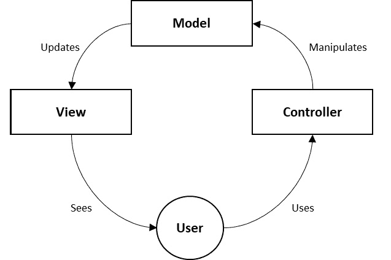
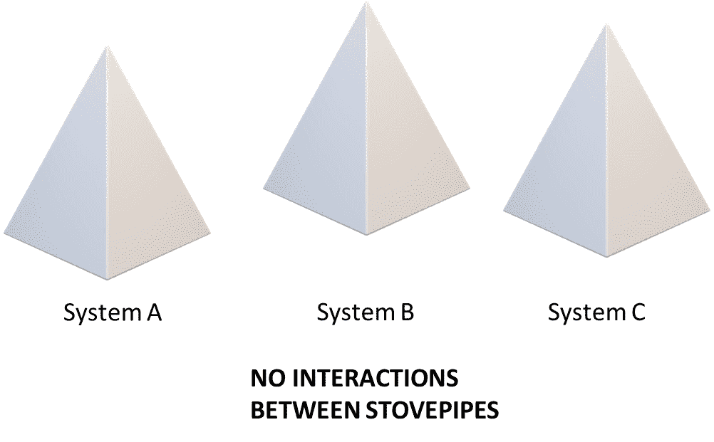
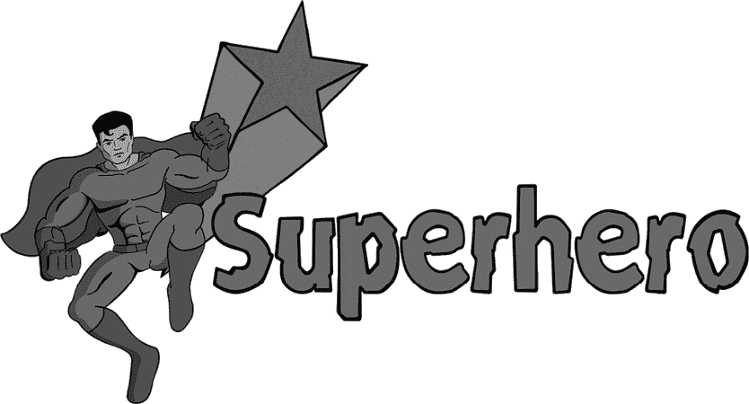

# 1

# 为什么我们需要理解 Salesforce 反模式？

Salesforce 反模式告诉我们很多 Salesforce 项目中常见的系统性错误——这些错误在实施时可能看起来是个好主意，但最终在长期内会带来严重的弊端。我们将在本书中学习最常见的错误类型，并学习如何思考这些问题。然而，为了做到这一点，我们必须理解反模式是什么，以及理解它们如何帮助我们架构和设计更好的系统。

因此，本章将从解释反模式是什么开始，逐步介绍几种不同的定义和看待它们的方式。接下来，你将了解它们如何帮助你加深对架构的理解，通过了解这些常见错误是如何发生的，以及它们在当时看起来为何是一个好主意。我们将在本章结束时解释本书将涵盖的内容以及你如何接近所提供的内容。

在本版中，我们扩展了对 Salesforce 反模式的探讨，涵盖了新的模式和见解，解决了 Salesforce 生态系统中的最新趋势和发展。这些新增内容基于第一版读者的反馈和我们对 Salesforce 架构不断变化的研究。值得注意的是，我们加入了与 AI 和 DevOps 实践相关的新模式，如“ *AI 架构就像普通架构* ”和“ *让我们在其中加入 AI* ”，同时也更新了现有模式，以反映当前的最佳实践。

在本章中，我们将涵盖以下主要话题：

+   理解反模式

+   反模式从哪里来？

+   反模式如何加深你的架构技能？

+   通过示例学习反模式

# 理解反模式

大多数开发人员和架构师都熟悉模式的概念——它是对一个架构领域中经常出现的问题的良好解决方案，以一种正式化和可重用的方式描述。以下是一些经典的例子：

+   **单例模式（Singleton）**：一种软件设计模式，它将某一类型的实例数量限制为 1

+   **火忘模式（Fire-and-forget）**：一种异步集成模式，它从计算上下文中发送消息并继续执行，而不等待响应

+   **模型-视图-控制器（MVC）**：一种将应用程序分为三个层次并明确规定各自职责的架构模式：

    1.  首先，模型维护应用程序的状态，并负责任何数据的更改。

    1.  第二，视图通过某种界面将该模型的特定表示展示给最终用户。

    1.  第三，控制器实现了响应用户界面事件或模型变化的业务逻辑，并在视图与模型之间进行必要的调解。

    此模式在下图中显示：

图 1.1 – MVC 模式图

这些模式已经在多个抽象层次和不同的平台上被定义。

参考文献

请查看以下资源，以便从 Salesforce 角度了解可以应用的各种模式的良好入门：

集成模式指南列出了设计 Salesforce 集成时应该使用的所有主要模式：[`developer.salesforce.com/docs/atlas.en-us.integration_patterns_and_practices.meta/integration_patterns_and_practices/integ_pat_intro_overview.htm`](https://developer.salesforce.com/docs/atlas.en-us.integration_patterns_and_practices.meta/integration_patterns_and_practices/integ_pat_intro_overview.htm)。在 Salesforce 的世界里，这可能是最常被引用的一套模式，因为它们在集成设计中无处不在。

Packt 出版的《Apex 设计模式》一书，由 Anshul Verma 和 Jitendra Zaa 编写，提供了针对 Apex 语言的软设计层级和具体代码层级的模式。

Salesforce Architects 网站虽然是新的，但涵盖了各个领域的一系列模式，从代码级别的具体内容到参考架构、解决方案工具包，以及选择治理的良好模式：[`architect.salesforce.com/design/#design-patterns`](https://architect.salesforce.com/design/#design-patterns)。

关键在于，我们在 Salesforce 平台上有很多良好的模式可供选择，其中许多是由 Salesforce 本身提供的，尽管也有一些是由更广泛的社区提供的。许多适用于其他平台的模式同样对我们有用，我们通过研究它们学到了很多。

但这是一本关于反模式的书，而不是模式。那么，为什么我要从讨论模式开始呢？事实证明，这两者几乎是不可分的，并且源于同一传统。因此，理解反模式首先需要理解什么是模式。反模式的一种常见形式就是*设计模式*的误用。我们将在下一节中探讨这一点。

## 从模式到反模式

软件架构中的设计模式运动源自克里斯托弗·亚历山大（Christopher Alexander）的工作，他是一位建筑师，专门设计建筑物而非系统。在他的著作《建筑的永恒方式》中，他介绍了一种物理架构的模式模板，包含一个名称、问题陈述和一个标准化格式的解决方案。

亚历山大模板所提供的修辞结构很快被另一类建筑师——软件开发者采纳。他们意识到，标准化的方式可以用来描述问题解决集，从而传播良好的实践。随着经典的《设计模式：可重用面向对象软件的元素》一书的出版，模式的使用在软件开发中成为主流，并至今仍然如此。

有关模式的研究激发了一群软件工程领域的从业者和研究者，他们开始像设计模式一样，思考软件系统的失败模式。这一过程经历了较长时间，无法指认出反模式运动中的任何一位人物是可以视为真正奠基性的人物。

然而，许多关于该主题的研究论文都以安德鲁·科宁（Andrew Koening）在 1995 年《面向对象编程杂志》中的定义为起点。该定义认为，反模式与模式非常相似，容易混淆。然而，使用反模式并不会带来解决方案，反而会带来负面后果。

这个定义捕捉了大部分的精髓，并且可以与另一位早期先驱吉姆·科普林（Jim Coplien）的一些思考结合起来。他认为，单纯的好模式不足以定义一个成功的系统。你还必须能够展示反模式的缺失。

总的来说，反模式是指在失败的软件系统或项目中出现的模式，它看起来像是一个好的解决方案，但实际上却会带来麻烦。以下是一些常见的反模式，它们已经存在了很长时间，并且至今仍然具有相关性：

+   **锅炉管** : 一种系统或模块，由于其接口设计，几乎不可能进行更改。以下图示为例：

图 1.2 - 锅炉管反模式

+   **Blob** : 一种设计，其中单个类有效地封装了所有业务逻辑和功能，导致重大维护问题。

+   **密切耦合** : 一种设计，使用了另一个类或模块中过多的方法来实现某个功能，导致形成了深度依赖关系，难以理解或修改。

我们将在后续章节从 Salesforce 的角度深入探讨这些反模式，强调一个不幸的事实：尽管 Salesforce 是一个优秀的平台，它仍然是一个容易犯下几十年来困扰软件系统的错误的软件系统。如果情况不是这样，那就不需要这本书——或者说 Salesforce 架构师也不需要存在。

除了对反模式有基础性的理解外，认识到这些模式如何与 Salesforce 生态系统中的最新趋势相符也是至关重要的。随着对 AI 和 DevOps 日益增长的关注，出现了新的反模式，专门应对这些领域中的挑战。例如，“*让我们加点 AI*”模式警告我们，避免在没有明确合理需求的情况下将 AI 纳入解决方案中，因为这会导致不必要的复杂性和维护挑战。

DevOps 实践也引入了新的反模式，例如“*不频繁提交*”，它强调了不经常集成代码更改的风险，这会导致集成地狱和部署问题。通过理解这些新趋势及其相关的反模式，架构师可以更好地应对现代 Salesforce 实现的复杂性。

讨论完反模式的历史起源后，接下来我们将讨论它们如何在现实世界中产生。

## 反模式是从哪里来的？

反模式往往反复出现，因为推动技术项目陷入困境的环境至少在某种程度上是可预测的。同样可以预测的是，处于这些环境中的人们的反应。由于身处困境的人们常常做出相同的错误决策，我们就有了可以研究的系统性模式。

一般来说，关于反模式最重要的记忆点是，它们在当时看起来像是一个好主意。它们不仅仅是一些坏习惯，应该有更多经验的人避免应用。你可以合理地辩解说，当应用这些反模式时，它们本应带来良好或至少是可以接受的结果。

有时，应用反模式的决定源于经验不足，而有时则是源于绝望。但往往，更多的是经验丰富的专业人士说服自己认为，在这种情况下，他们所做的才是正确的选择，或者这个情况是不同的。

反模式通常源于技术项目中可预测的情况，但最近的技术趋势引入了新的环境，在这些环境中这些模式得以展现。例如，**人工智能**（**AI**）和机器学习在 Salesforce 项目中的快速应用，导致了新反模式的出现，例如“*AI 架构就像普通架构*”。这些模式通常源于对将 AI 集成到 Salesforce 解决方案中的独特需求和挑战缺乏理解。

类似地，向 DevOps 实践的转变也突显了与持续集成和部署相关的新反模式。例如，“*不频繁提交*”模式出现在团队未能频繁集成代码更改时，从而导致了重大的集成挑战和部署延迟。

我们将在本书中提供的例子中，尽量反映这种起源的多样性。然而，为了做到这一点，我们需要解释如何以一致的方式呈现这些例子，以便促进学习。

## 反模式模板

模式和反模式的一个关键特征是它们都是使用可识别的模板编写的。多年来，已经提出了许多模板，有些比其他的更加复杂。

本书中的模板包含了几乎所有现有反模式模板中反复出现的基本内容。然而，我们不会包含大量的可选元素。其他模板中包含的大多数附加元素用于简化分类或交叉引用，这些元素对于创建可搜索的模式或反模式目录非常有用，但在印刷书籍中则较少实用。因此，我们将省略这些元素，并包含以下内容：

+   **名称**：一个易于记住的标识符，用于唯一识别该模式并帮助架构师之间的讨论。

+   **类型**：在本书中，我们将根据**认证技术架构师**（**CTA**）复审委员会考试相关的领域对反模式进行分类。这既是为了帮助那些在 CTA 旅程中的人，也因为这对 Salesforce 架构师来说是一种熟悉的分类方法。

+   **示例**：我们将通过举例说明反模式如何发生，来介绍每个反模式。示例将是虚构的，但与现实中的事件相关。这将为反模式设定框架，并让你在深入探讨之前立即理解其中涉及的问题。

+   **问题**：本节将正式描述反模式试图解决的问题。这些是反模式旨在解决的实际问题，尽管在实践中使用它将证明是一个糟糕的主意。

+   **建议的解决方案**：反模式声称如何解决上一节中描述的问题，并且在某些情况下，这种解决方案看起来可能很有诱惑力。

+   **结果**：在结果部分，我们将概述应用反模式及其主要变体后，你可以期待得到的结果。我们将解释为什么这是一种不好的解决方案，尽管它在开始时看起来可能不错。

+   **更好的解决方案**：模板中的最后一部分将告诉你，在面对反模式所基于的问题时应该怎么做。并非所有问题都有简单的解决方案，但通常你能做得比应用反模式更好。

现在我们已经理解了反模式是什么，以及它们在本书中的结构安排，我们将继续解释作为架构师的你，如何通过使用它们来提升自己的技能。

# 反模式如何深化你的架构技能？

尽管理论上理解什么是模式和反模式，以及它们如何一般性地提供帮助是很好的，但你无疑希望从本书中获得的不仅仅是理论讨论。

在这一部分，我们将讨论从错误中学习的价值，无论是你自己的错误还是他人的错误，并展示我们将如何通过反模式在具体实例的背景下提升你的架构技能。

## 伟大的架构师如何从错误中学习

我们工作在一个失败是常态的行业中。Standish Group CHAOS 报告（这是在这方面最常引用的资料）在 2020 年估计，全球 66%的技术项目最终部分或完全失败。

这比我 20 多年前刚开始职业生涯时要好一点。当时，这个数字只有 70 出头。然而，尽管敏捷开发、云计算、人工智能以及 Salesforce 等伟大的软件平台出现了，情况有所改善，但改善的幅度仍然很小。

这令人沮丧，但它只证明了我的一位英雄——弗雷德·布鲁克斯——所说的“ *软件的复杂性是一个本质特性，而非偶然特性* ”，这不幸意味着我们永远无法找到一颗万金油来解决软件架构和设计中的所有问题。相反，我们面临的是如何合理管理这种复杂性的艰巨工作。做到这一点，是架构师的主要工作。

合乎逻辑的是，在一个高失败率和不可简化复杂度的领域，我们需要有良好的规则和指导方针来引导我们走上正确的道路。这就是模式和最佳实践的作用。它们是不可或缺的，但它们还不够。

要在我们的专业领域做到卓越，并能够设计出突破行业趋势的软件，我们不仅要从自己的失败中学习，还要从我们周围看到的那些失败的项目和糟糕的实践中学习。

这通常并不难做到。通常，当架构师被召入项目时，意味着已经有一个问题需要解决。把这些情况当作学习机会，并以这种视角进行分析，往往会带来巨大的收获。

然而，在这个方向上还有进一步的步骤，这就是反模式所提供的。它们涵盖了事物经常出错的方式，这种方式不仅允许事后学习，还能够进行实时干预。

虽然项目可能会失败，但它们并非随机地出错。其实有系统性的模式一次又一次地重复。学习事物如何以系统性方式出错，可以为你的工具箱增添一套全新的应对策略，帮助你将项目打造成那 34%没有失败的项目之一。

理解反模式不仅帮助你避免常见的陷阱，还增强你应对现代 Salesforce 架构复杂性的能力，包括人工智能和 DevOps 实践。这些见解对准备参加 CTA 复审委员会考试的人特别有价值，因为它们展示了对现代 Salesforce 架构中的挑战和最佳实践的深刻理解。

我们将通过一个解释性的例子开始这段学习之旅。

## 一个例子——英雄反模式

学习最好的方式就是通过示例。我们在本书中不会有机会涵盖很多管理层的反模式，所以我将用这个领域中的经典例子来展示模板是如何工作的，以及如何解读它以获得最大的收获。

首先，我们将展示反模式，然后提供分析，看看我们能从中学到什么。

## Hero（开发生命周期和部署规划）

Tom 是制造行业中一个大型绿色田地 Salesforce 实施项目的项目经理，涉及销售与服务云，面向 2,000 名用户。这个项目原本计划非常简单——一个基础的 MVP，用于启动平台——并且项目的范围和人员配置也是如此。该项目计划在 6 个月后进入全面生产，实施阶段为 4 个月，随后进行测试、培训、部署和超关怀阶段。

实施的前 3 个月飞快过去，项目管理仪表盘上的一切依旧保持绿色。团队稳步推进，与外部咨询公司（提供专业资源的合作伙伴）的关系也保持良好。

然而，当 Tom 交付第一轮业务审查时，情况开始迅速发生变化。事实证明，许多详细需求在最初的范围中被遗漏，许多边缘案例也未被当前的配置所涵盖。业务方面的反馈是，除非包括一大批额外的功能，否则无法让系统上线。

Tom 去向指导委员会请求更大的预算和按计划增加的时间表，以应对业务需求。指导委员会同意了增加预算的请求，但告诉他，时间表是不可更动的。他必须在当前的时间框架内找到完成任务的方法。

Tom 从头开始重新规划项目。如果他从外部合作伙伴那里增加一些新资源，并向现有团队要求加班，他可以通过压缩测试和切换计划让一切适配。他将新计划发给团队，并附上一封激励人心的邮件，呼吁每个人都迎接挑战。

在接下来的一个月，项目再次出现延误，Tom 的新计划看起来越来越不可能成功。并不是发生了什么重大问题，而是许多小问题没有按时完成，或者因为误解需要重新做。特别是，他从外部合作伙伴带来的新顾问似乎犯了很多基本错误。

Tom 打电话给他的老板，IT 高级总监，告诉她当前的情况，并请求帮助延长项目时间表。她告诉他，时间表已经向公司董事会承诺，如果不能按时完成，某些人将会被辞退。她说，现在是团队全力以赴，完成任务的时候了。

汤姆回到团队，传达了消息，再次呼吁每个人都尽全力把事情推进。遗憾的是，大多数人已经在尽自己所在情况下最大的努力。而且与外部合作伙伴的关系已经恶化，他们不愿意再加班，除非能获得额外的资金，而汤姆的预算无法支持这一要求。

然而，还是有一些亮点。特别是两位年轻的技术人员——凯莉和内加什，展现出愿意超越常规去完成工作的态度。在最后一个月的交付过程中，他们几乎全天候工作，汤姆在背后为他们加油：

图 1.3 – 当你陷入英雄反模式时可能会有的危险感觉

在他们二人的合作下，最终在最后阶段清除了足够的新特性和变更请求，汤姆变得有信心认为他能满足足够的项目需求，从而避免项目启动成为一场灾难。虽然会有例外情况，但他可以稍后找到应对方法。只要即将到来的上线顺利进行，项目仍然有可能成功。

然而，**用户验收测试**（**UAT**）却给项目带来了麻烦，因为发现了重大质量问题。指导委员会召开了危机会议，最终决定将上线推迟一周。团队必须在这段时间内全力以赴解决问题。

尽管每个人都在努力，但责任不成比例地落在凯莉和内加什身上，他们两人开始表现出持续工作带来的压力。汤姆在每个机会中鼓励他们，并公开表扬他们。他还承诺项目完成后会给予他们现金奖励和额外的假期。

重测的日子终于到来，尽管许多问题已经得到令人满意的修复，但仍然有相当多的遗留问题，包括一些之前已修复但现在又重新出现的问题。

指导委员会召开了另一次危机会议，决定尽管问题存在，仍然推进上线。这些问题将在超照护期内修复，但在短时间内是可以容忍的。

接下来几周，汤姆、凯莉和内加什的生活都充斥着不断的紧张节奏。随着问题的不断出现、修复与重现，他们从一个紧急情况忙到另一个。凯莉和内加什开始承受不住压力，但由于没有其他了解配置的资源，他们实际上被迫继续坚持下去。

最终，问题得以平息。重要的漏洞已经修复，业务部门为遗漏的事项采取了手动解决方案，生活也逐渐恢复正常。汤姆召集团队举行庆功会，但气氛却显得比较低调。

在度完额外假期后，Kayleigh 和 Negash 都接受了大公司咨询公司的邀请，导致公司失去了支持其新实施平台大部分功能的人。

### 问题

英雄反模式通常声称修复一个紧急的交付问题，这个问题可能发生在项目环境中，如我们的例子，或者在正常运营过程中。当它发生在正常运营模式时，通常是在一个系统问题解决已变成日常事务的背景下。

通常，问题发生在以下几个因素特征的背景下：

+   解决紧急问题所需的资源有限，且有充分的理由说明此时无法引入新的资源。

+   项目有一个紧迫的时间表，人们认为这是不可更改的，或者问题已经上线，紧急且影响到重要业务用户，以至于造成了大量的噪音。

+   对问题的了解集中在少数几个人头上——也就是一些愿意承担角色的人，如 Kayleigh 和 Negash，或者通常是唯一具有技术知识能在当时解决问题的首席开发人员。

+   这种情况被认为是某种特殊的情况：要么这是一个新项目，没有先例，要么问题被认为如此独特，以至于无法为其做计划。

+   危机元素在容易滋生英雄反模式的情况下通常非常明显。有时，公司的未来成功甚至生存的关键部分会因此受到影响。

这些因素都会让问题看起来在有限的时间内修复更为重要，并使英雄反模式显得具有吸引力。

### 提议的解决方案

英雄反模式提议通过允许个人或小团体承担过多的责任来有效地解决前一部分描述的问题，要求他们在必要时付出一定的代价，完成任务。

这对于管理层和参与其中的人来说，出于多种原因，可能都具有吸引力：

+   这种努力往往会在短期内取得一些成果，给人一种势头和成功感。

+   每个人，或者至少几乎每个人，都希望成为英雄，并获得表扬和奖励。对一些人来说，这值得为了额外的努力而带来的不便。

+   总是可以想象，当前的情况在某种程度上是独特的，不代表组织内部存在更深层次的流程或文化问题，从而将所做的事情合理化为例外。

+   即使我们承认存在潜在问题，通常也可以把这些问题暂时搁置，认为以后再解决。当然，在依赖英雄反模式的组织中，“以后”永远不会到来。

英雄反模式有几种常见变种，值得一提：

+   超人模式，一种变体，通常是指将某个人（通常是高级技术人员）美化并视为唯一能解决特定系统严重问题的人。通常，这种神话会自我延续。

+   新手，前面示例中展示的变体，指的是初级团队成员承担额外责任，迎接摆在他们面前的挑战。

+   没有时间进行知识转移，英雄们因似乎永无止境的时间紧迫而无法将必要的知识传授给其他人。

虽然这个反模式很有诱惑力，许多人在职业生涯中多次落入其陷阱，但它几乎总是会带来负面的长期后果，这是我们接下来要探讨的内容。

### 结果

尽管英雄反模式往往能带来短期的良好结果，这也是它持续吸引力的主要来源，但依赖这一反模式来完成任务的组织，往往会随着时间积累一长串负面结果。

以下是一些最常见的负面结果：

+   创建单点故障，极大地增加了组织的风险，如果英雄“被丢到车下”，且英雄在与组织谈判时会拥有很大的杠杆作用。

+   随着时间的推移，英雄会开始感受到压力，就像我们示例中的凯莉和内戈什一样，但他们改变局势的选择非常有限。这种情况非常容易导致职业倦怠，带来第一个问题的所有后果，以及由于压力而导致英雄犯严重错误的风险。

+   英雄无法扩展。这意味着组织将无法以比英雄能处理的更大的带宽来部署项目。在某些情况下，这可能会严重限制新计划的开展。

+   英雄是不可复制的。你无法轻易复制英雄或他们的特殊能力，因此你在创建一个可预测、可重复的流程时，选择非常有限。

+   英雄可能会积累严重的技术债务。这通常因为他们必须在压力下迅速行动，且没有真正的监督而未得到有效管理。这可能导致长期的维护问题。

+   英雄完成任务的过程透明度很低，导致缺乏可预测性和可管理性。

+   英雄没有时间解释事情是如何实施的，因此通常缺乏或完全没有文档。

+   剩余的团队成员可能会感到失去权力、被忽视和缺乏动力，因为所有的注意力都集中在英雄身上，其他人几乎没有机会以非英雄方式做出贡献。

在所有的反模式实例中，你不一定会看到所有这些负面结果，而且遗憾的是，这份清单也并非详尽无遗。但希望这些足够让你在应用这个反模式时三思，并且思考更好的选择，这是我们接下来要探讨的内容。

### 更好的解决方案

英雄反模式的根本问题在于，你依赖于那些通常拥有隐藏知识的特定个体，他们辛勤工作（通常是过度辛勤工作）来完成任务，而不是依赖于可重复、透明和可管理的流程，这些流程将使你在环境和参与人员发生变化时仍能继续交付。

因此，摆脱英雄反模式的主要方法是着手改进流程，并系统地在团队中传播技能和知识。在我们的例子中，潜在的问题包括范围管理、初步的发现工作、治理以及对现场实际问题的理解，还有项目的结构方式，导致它以大爆炸的方式上线，而不是以小的增量发布。

在不同的组织中，具体的干预措施如何提供最大杠杆作用会有所不同，但以下是一些值得关注的方面：

+   向 DevOps 文化转型，实施更小的增量发布，这些发布具有较低的风险特征

+   拥有多功能团队，进行频繁的直接协作和同行评审，以便传播知识

+   鼓励并奖励领导和专家更多地去指导和培养年轻人，而不是扑灭最新的火灾

+   在项目中引入更好的风险管理和治理，以确保当事情出错时（如预期那样），你可以拥有适当的应急措施

+   挑战那些将取得大胜利的文化规范，这些胜利往往是在逆境中取得的，而不是专注于定期进行稳定、不戏剧化但可重复的进展

+   在规划、构建和运营系统时，强调角色和流程，而不是个人，尤其是在与更广泛的利益相关者沟通时

+   通过捕捉技术债务、风险以及依赖此模式时组织失去的可复制努力的机会，揭示英雄反模式的成本

+   确保在项目开始时规划好详细的需求和边缘案例，以减少你需要英雄的可能性

事实上，完全避免英雄反模式并不总是可能的。有时，事情已经陷入困境，而只有一个人能够解决问题。我们需要认识到，这并不是一个好情况，而是一个反模式，我们需要努力解决，以避免它的再次发生。你越是这样做，就越不需要依赖英雄，也就越少需要扑灭火灾。

在讲解完第一个真实的反模式示例后，让我们更深入地分析一下，看看如何最大化从中学到的东西。

## 分析该示例

英雄反模式是一个经典的模式，几乎所有经验丰富的 IT 专业人士在职业生涯中都会遇到它。然而，尽管它很有趣，但在本书中，我们将更多地关注提取更大的模式，以便从这些例子中汲取经验，提升我们的架构技能。

在本书中，我们将在每章的结尾部分设置一个小节，为你提取关键的学习要点，帮助你在未来的架构之路上不断进步。我们将在实现“心到实战”的实践过程中做到这一点，同时，我们还会为那些准备参加 CTA 考试的人列出专门的学习要点。

考虑到英雄反模式，以下是一些你可能提取出的实际学习要点：

+   当你面临一个需要团队中某些人或所有人付出额外努力的危机时，花时间回顾一下导致这种情况的过程失败。将这些记录下来，以备未来参考。

+   依赖少数几个极其熟练的人，长期来看可能会带来危险，即使现在这种做法有效。

+   你可能会感受到超越常规的压力，这可能反映了一个技术优先级不正确的文化。如果可能，你可能想要挑战这种文化。

+   尽力赋能并培养初级员工，避免陷入必须成为英雄的境地。

+   在项目和技术层面上，积极倡导良好的治理，并记录和弥补因“特殊”情况而积累的技术债务。

查看 CTA 评审委员会，你可以注意到以下几点教训：

+   小心建议“大爆炸”式的交付方法。它们可能是正确的选择，但通常会导致本示例中提到的问题。除非有特定原因，否则应优先使用敏捷、增量式的方法。

+   确保你包括必要的治理职能，包括**项目管理办公室**（**PMO**）、指导委员会、设计主管，可能还有变更咨询委员会。在这个例子中，如果后两者到位，许多问题本可以避免。

+   清楚地表达风险和风险管理。提前列出风险，并准备好讨论如何管理和缓解它们。

虽然我们能直接提取许多学习要点，但我们鼓励你深入探讨这一方法，看看你还能从中获得多少收获。从反模式中学习是一个持续且非常有益的过程，特别适合有抱负的架构师。

除了从英雄反模式中获得的传统教训外，还需要考虑这种模式如何与现代趋势（如人工智能和 DevOps）相交叉。例如，在 DevOps 环境中，依赖单一“英雄”来管理部署可能会导致显著的瓶颈和集成问题，从而突出持续集成和频繁检查等实践的重要性。

类似地，在 AI 项目中，当依赖单一的数据科学家或 AI 专家来交付复杂的 AI 解决方案，而没有足够的支持或知识传递时，就会出现 Hero 反模式。这可能导致精疲力尽和缺乏可扩展性，强调了多功能团队合作的必要性。

有了这些知识，我们已经对反模式有了基础性的理解，并且知道它们如何帮助我们更好地掌握 Salesforce 架构。接下来只需要在深入探讨系统架构领域的反模式之前，总结一下我们的进展。

# 摘要

呼，刚才讲了这么多背景知识！感谢你坚持下来。现在你已经了解了关于反模式的关键事实，并且可以继续阅读本书，掌握如何从反模式中学习。

在进入接下来的章节之前，记住以下几点：

+   重要的是不要仅仅将反模式视为不良实践。不良实践是显而易见的，但反模式则是阴险的。它们伪装成好的解决方案，在某些情况下，即使是经验丰富的专业人士也可能会被其说服。这也是为什么反模式如此有趣的原因。

+   虽然本书中会介绍很多独立的反模式，但重要的是通过比较和对比这些反模式，提炼出其中的相似之处和元模式。我们将在本书的分析部分为你做一些这样的工作，你也应该尝试为自己做这项活动。

+   虽然我们将重点讨论 Salesforce 环境中的内容，但你将学习到的许多模式同样适用于其他平台。一些模式甚至是经典的，许多经验丰富的架构师都会了解。

在本书的后续部分，记住反模式不仅仅是不良实践，它们是具有欺骗性的解决方案，在某些情况下可能看起来很有吸引力。在这第二版中，我们扩展了探讨内容，加入了与 AI 和 DevOps 相关的新反模式，以反映 Salesforce 生态系统中的最新趋势和挑战。通过理解这些模式及其含义，你可以提升自己的架构技能，更好地应对现代 Salesforce 项目的复杂性，无论是在实际项目中，还是为 CTA 审核委员会的考试做准备。

现在这些都讲完了，我们准备详细讨论第一个架构领域：系统架构。
