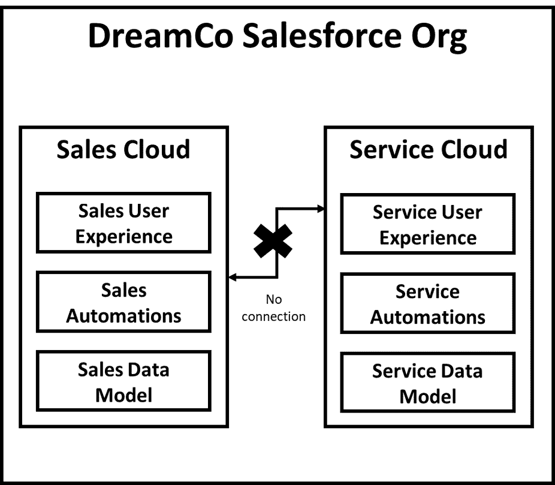
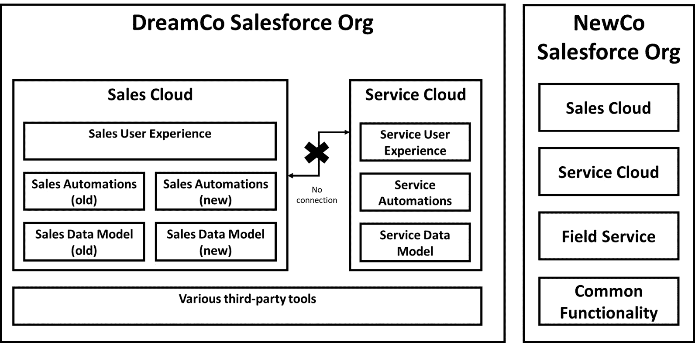
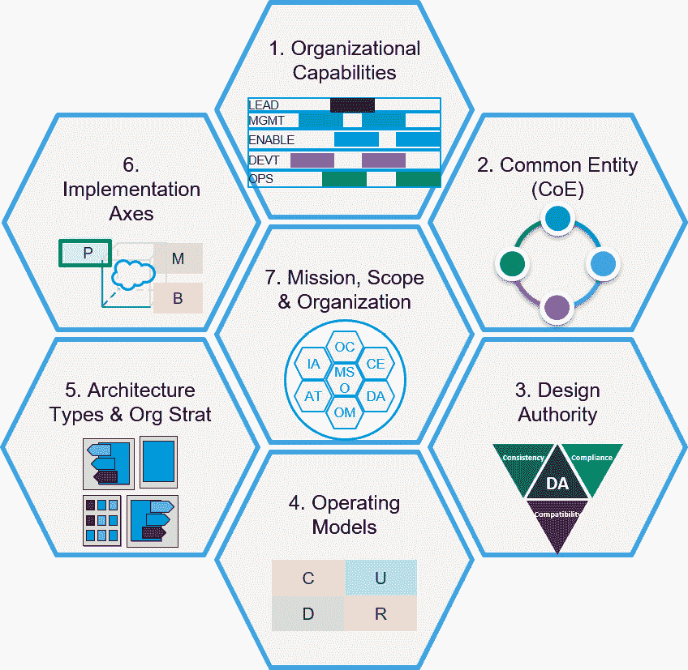
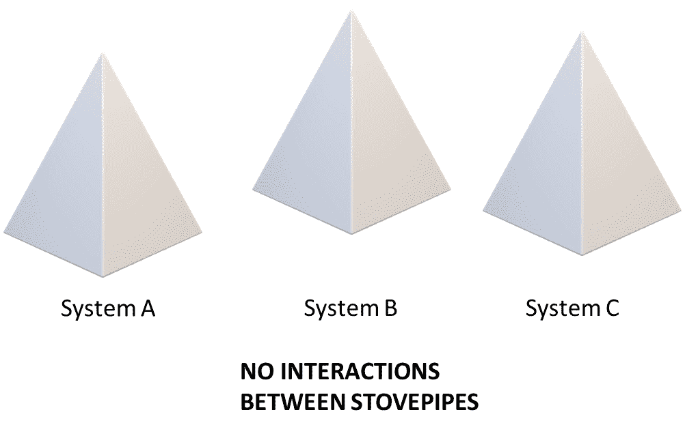
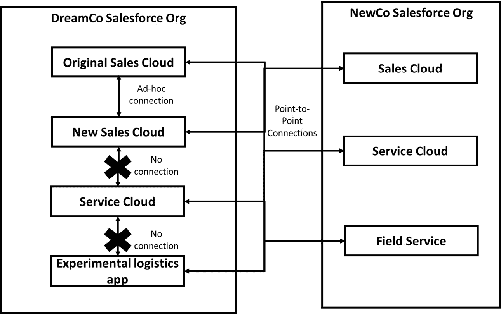
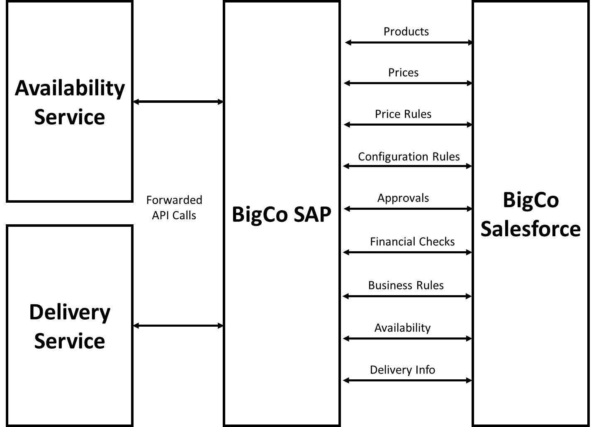
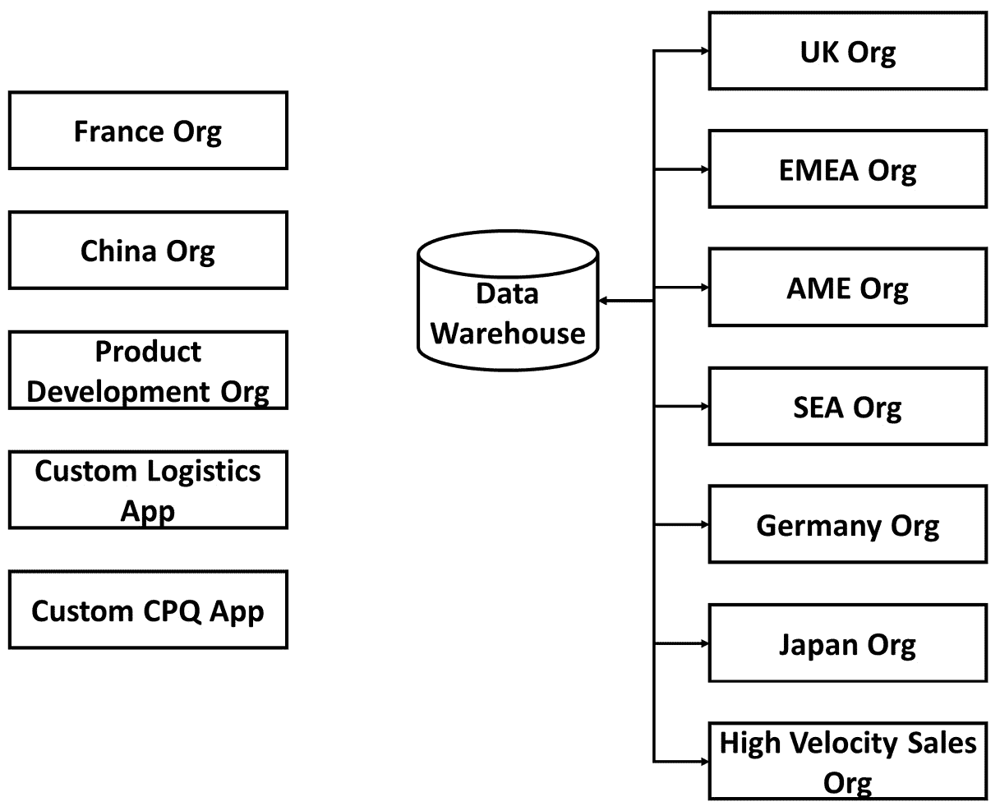
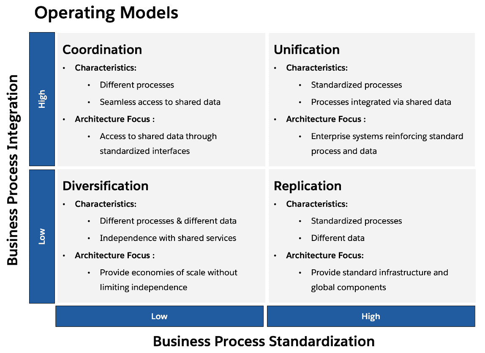

# 2

# 如何保持系统架构的整洁

本章将从探讨如何通过缺乏实施和治理的规范性方法来混乱你的系统架构开始。我们将审视经典的“烟囱”反模式，在这种模式中，系统是孤立建设的，几乎不考虑标准或共同的抽象，导致架构碎片化且难以维护。我们还将讨论“大泥球”反模式，它的特点是缺乏结构和组织，最终导致无法维护的系统。

接下来，我们将介绍“架构即需求”反模式，这是一种常见的陷阱，即将架构决策仅仅视为需求，而没有考虑更广泛的系统背景和长期影响。我们将深入探讨这种方法的后果，如技术债务增加、可扩展性问题和适应性有限等。

接下来，我们将讨论系统之间过度耦合如何使系统变得脆弱且难以修改，并强调定义清晰边界和倾向于采用更松散集成模式的重要性。我们还将涉及 Salesforce 环境中组织繁殖的挑战，以及为了防止蔓延并确保一致性，制定明确的组织战略的必要性。

在本章中，我们将强调架构治理、技术标准和最佳实践在避免这些反模式和创建强大、可维护的 Salesforce 系统中的关键作用。我们将提供关于如何应对组织孤岛、确保利益相关者的支持，以及如何平衡个别需求与长期架构可持续性之间的见解。

在当今快速发展的技术环境中，**人工智能** (**AI**) 和自动化在 Salesforce 架构中扮演着越来越关键的角色。在我们探索各种反模式的过程中，我们还将考虑 AI 驱动的功能和自动化流程如何加剧这些问题，或者在正确实施的情况下，如何帮助缓解这些问题。理解传统架构问题和新兴 AI 能力之间的相互作用，对于创建强大、未来-proof 的 Salesforce 解决方案至关重要。

到本章结束时，你将深刻理解需要避免的关键架构陷阱，并了解在设计和实施 Salesforce 解决方案时可以采用的策略。你将掌握创建可扩展、可适应、并与组织不断变化的需求对接的系统所需的知识和技能。

在本章中，我们将涵盖以下主要内容：

+   烟囱反模式如何让系统只能在孤立环境中工作，以及你可以做些什么来避免构建烟囱

+   大泥球反模式是什么，为什么系统会退化到这种状态，以及如何防止你的系统陷入这种境地

+   探索“架构即需求”反模式及其对 Salesforce 实施的影响

+   强耦合如何使系统脆弱且可能无法使用，以及如何划定更清晰的系统边界以避免此问题

+   Salesforce 环境中没有治理的组织增长问题以及制定清晰组织策略的重要性

+   架构治理、标准和最佳实践在创建可维护、可演进的 Salesforce 系统中的关键作用

完成本章后，你将牢牢掌握常见的架构反模式，这些反模式可能会影响 Salesforce 实施，并了解应对这些问题的策略。你将准备好领导团队为组织的 Salesforce 项目建立强大的架构基础，确保这些项目提供持久的价值并支持你的业务目标。

# 混乱的系统景观

混乱系统景观的最简单方式，正如我们将看到的，是以本地、无结构、治理不善的方式进行实施。虽然小型本地项目有许多吸引力，但它们很容易变成反模式，对整体企业架构产生严重的负面影响。我们将首先讨论经典的垂直烟囱反模式，这是这类项目的常见后果，然后看它的组织对等物——*垂直烟囱企业*。

## 垂直烟囱

垂直烟囱是一个系统，它的构建没有考虑标准或共同的抽象，导致系统可能能够运行，但难以维护、扩展或与其他系统互操作。

### 一个例子

John 是 DreamCo 的 CRM 经理，这是一家定制旅行配件的供应商。公司决定投资实施一个小型 Salesforce Sales Cloud 系统，取代已经运行超过十年的旧 Siebel 系统。虽然最初有些担心，但 John 对于这个项目变得相当兴奋，因为它承诺解决一些他们用旧 CRM 系统无法解决的棘手问题。

DreamCo 雇佣了一家小型本地 Salesforce 咨询公司来进行实施。最初，这项工作取得了巨大成功；销售团队喜欢这个新工具，John 要求的许多功能也得到了迅速实现。然而，过了一段时间，进展似乎变得缓慢，变更的成本也上涨了。DreamCo 的 CIO 评估认为，他们的业务需求现在已经过于复杂，本地小型咨询公司无法管理，于是聘请了一家领先的 Salesforce Summit 合作伙伴来接管。

与此同时，DreamCo 的客户服务负责人决定委托第三家 Salesforce 合作伙伴为公司呼叫中心实施 Salesforce Service Cloud。在最初的阶段，John 已经学到了很多 Salesforce 知识，并开始担心不同合作伙伴或实施之间没有共同的约定、标准、方法论或工具。销售部门和客户服务部门似乎也使用了非常不同的数据模型来表示基本相同的内容。

图 2.1 – 初步实施后的 DreamCo 组织结构

John 将这些问题提给了首席信息官，并请求预算来雇佣一名架构师，并对现有系统进行一些重构，以使它们更加一致。他被告知，虽然他的想法很好，但目前无法承担，但他应该为明年的预算提出预算请求。

此时，DreamCo 收购了一家较小的公司，该公司通过机场自动售货机销售旅游配件。该公司 reportedly 拥有非常强大的 Salesforce 实施，比 DreamCo 更为先进，包括销售、服务和现场服务模块。John 的任务是找到一种方法，将这两个 Salesforce 组织合并成一个，而不要求两个组织从根本上改变他们的流程。

John 与 Summit 合作伙伴进行沟通，探讨合并的选项。他们提出了一个满足基本要求的方案，但成本远高于预期。合作伙伴解释说，DreamCo 组织中的技术复杂性过高，导致与新组织的整合非常困难。此外，他们建议不要走合并的路线，而是建议 DreamCo 将所有人转移到最近收购的公司的组织中，并调整流程以使其正常运作，而不改变技术。

经过一些内部讨论，DreamCo 决定还是继续进行合并。然而，问题几乎立刻就开始出现：

+   首先，涉及的不同供应商之间的协作非常困难，导致了一个局面：主导合作伙伴实际上需要逆向工程许多功能，以便理解它们。

+   其次，实施进展非常缓慢，John 现实地认为项目无法按时完成。

+   第三，错误率非常高，每个测试周期都会出现许多重复的错误。所有这些都在朝着一个项目发展，这个项目将显著超出预算，延迟进度，并且质量远低于预期。

John 开始深入调查细节，从项目中涉及的各种技术人员那里，他得知了一些令人担忧的事实。首先，基本的命名约定完全不同，不仅在 DreamCo 和 NewCo 组织之间不同，甚至在 DreamCo 组织内部也存在至少三种完全不同的约定。此外，功能的实现使用了完全不同的方法和工具集，有时相同的功能在系统的不同部分以不同的方式重新实现。

系统的不同部分还存在一些自定义字段和对象，它们在不同的地方以细微不同的重复形式存在。最后，许多第三方工具被用来提供功能。然而，这些工具及其功能从未得到适当的文档化，在供应商更换后，组织中没有人知道如何使用它们。再加上 DreamCo 和 NewCo 两个组织之间找到共同语言所带来的内在复杂性，大多数技术团队开始绝望地举起双手。

图 2.2 – DreamCo 合并场景

约翰将此报告给高级管理层，情况升级成一场重大危机。最终，在经过长时间的争执后，DreamCo 放弃了合并两个组织的计划，决定暂时将它们分别保留，并将数据在其他地方合并用于报告。

### 问题

如何在一个部门独立、权力分散到各个封建领地、技术团队彼此独立且没有强有力的架构或技术标准中央权威的组织中实施 IT 系统？通常的答案是*烟囱式反模式*。鉴于这些组织特征的普遍存在，"烟囱式"反模式是你作为架构师最常遇到的反模式之一。

让我们不要忽视解决这些问题的困难。即使有高级管理层的支持，改变组织结构或文化可能需要数年的转型，即便如此，许多不幸的做法仍可能存在。

因此，当你是一个雄心勃勃的经理，在这样的组织中需要一个新的 IT 系统时，直接在你自己小小的王国里推进并实施某些东西，与那些你个人信任的人一起工作，以符合你需求的方式进行，而不太考虑其他部门，确实很有诱惑力。没有强有力的公司 IT 治理和企业架构支持，大多数 IT 部门对此无能为力。

因此，"烟囱式"反模式确实为一个真实的问题提供了答案，我们将在下一节中讨论。但它是一个可靠地导致不幸结果的答案。

### 提议的解决方案

从根本上讲，"烟囱式"解决方案试图通过在孤立的环境中构建解决方案来解决许多组织中固有的协调问题，而不考虑更广泛的关注点或需求，使用实施团队偏好的任何工具和标准。这样，你可以直接进行操作，同时绕过公司内部的官僚主义。

这是一个在许多方面都很有吸引力的解决方案：

+   你不必参与跨部门合作或解决棘手的内部政治问题。

+   你的技术团队通常很喜欢它，因为他们可以使用任何他们偏好的工具来完成工作

+   它在短期内通常效果很好，能够迅速满足需求并创造局部价值，通常价格也非常合理

+   对于没有强大中央 IT 领导力的组织来说，它可能是默认的操作方式，并且可能会变成“事情的做法”

如果我们生活在一个更简单的世界里，组织能够将其操作划分为彼此独立、不需要太多协作即可完成任务的不同小组，系统也不需要支持跨工作流或跨系统集成，那么烟囱式模式实际上是一个完全合理的软件开发方法。

然而，实际上，大多数组织确实需要让他们的系统跨多个部门和用例协同工作，这时问题就开始显现，正如我们在下一节中将看到的那样。

### 结果

如前所述，正如我们在示例中看到的，烟囱模式通常最初运行良好。对于一个由单一团队使用的特定解决方案，以这种本地方式构建并没有什么固有的缺点。正如我们所看到的，当我们有多个不同的参与者使用同一基础平台（例如我们提到的销售和服务部门）、尝试将系统扩展到它并未设计过的用例时，问题开始积累，而且当我们需要系统与其他外部系统良好协作时，问题更加明显。

在 Salesforce 上，多个不同的模块在同一个组织中同时运行并利用共享数据模型、用户界面和技术配置是很常见的情况。不幸的是，如果没有一致地实现这些模块，特别容易出现类似“烟囱”问题。

随着时间的推移，烟囱反模式的指示器通常包括以下几点：

+   理解代码库的难度增加，尤其是对于与系统合作的新团队

+   系统不同领域中的架构设计和实现模式不一致

+   由于系统的一致性和灵活性日益下降，用户体验和用户价值逐渐降低

+   每当需要实施新需求时，都会遇到极大的困难

+   系统与其他系统集成的难度很大

+   系统很难融入全球流程；例如，一个整合的 DevOps 管道

+   错误率不断增加，既包括开发过程中的错误，也包括生产环境中的错误

+   由于所有这些因素，变更的成本越来越高

炉膛管（stovepipe）往往会恶化的根本原因是缺乏共同的标准、实践、模式和工具。无一致性增加了技术团队的认知负担，使得一切变得更加困难且容易出错，同时也提高了整体的学习曲线。原本的团队可能理解它，但随着时间的推移，这种理解会丧失，结果往往是变得更加不一致，而不是为了将其重构成更易理解的状态而做出集中的努力。

通过将构建孤岛的团队与运作良好的敏捷团队进行比较，可以有效地理解出错的原因。一个敏捷团队也可能在相对孤立的环境中工作，由赋权的产品负责人做决策。然而，他们将遵循组织内已被接受和深刻理解的标准、实践、模式和工具，并且会使用稳定的接口进行关键集成和对关键系统组件的共同抽象。这样，协调会通过这些共同的基础标准自然而然地进行，而你最终不会构建出一个孤岛系统，而是一个良好调整的系统成员。

### 更好的解决方案

事实上，许多组织存在较强的孤岛现象，因此在构建、实施或变更系统时，解决业务层面的协调问题变得非常困难。作为架构师，处理这些问题应该是我们的日常工作的一部分，以避免构建孤岛系统，并确保我们的平台（如 Salesforce）在长期内继续发挥价值。

尽管一些能够组织上打破孤岛、提高协作的变革性举措通常超出了我们的能力范围，但我们可以可靠地做很多事情来改善这种状况：

+   定义清晰的架构模式和实践，以便不同团队之间使用，并创建共同的抽象层次

+   制定关于如何实现不同内容的约定，既包括宏观层面的（例如，何时使用流程，何时使用触发器），也包括微观层面的，例如编码规范

+   为所有技术领域（如报告、BI 或数据治理）采用标准，以确保一致性

+   为跨系统集成创建稳定接口提供强有力的指导，并为不同的使用场景提供集成模式

+   为 Salesforce 项目的实施制定共同的方法论，以确保一致性

+   为整个开发生命周期的所有元素采用一致的工具，以促进跨团队和跨系统的理解

+   强力执行这些标准和实践

作为 Salesforce 架构师，我们处于一个有利的地位，因为很多工作可以从已经存在的良好实践中获得，这些实践要么是 Salesforce 自己建立的，要么是更广泛的 Salesforce 社区所共享的。你可以在 Salesforce 架构师网站上找到许多优秀的资源，Salesforce 也最近推出了 **Salesforce 操作、治理和架构框架**（**SOGAF**），以帮助我们理解 Salesforce 治理的最佳实践：

图 2.3 – SOGAF 元素

然而，我们始终有责任在我们自己的组织中采纳、适应并实施这些方法。这也包括添加与我们特定情况相关的业务标准和实践，并以一种能够在整个组织中产生共鸣的方式传播这些标准和实践。

在 Salesforce 中实施 AI 能力时，要小心避免创建 AI 筒仓。与更广泛的 Salesforce 生态系统集成不良的孤立 AI 模型或预测分析工具，可能导致碎片化的洞察和不一致的用户体验。相反，应该制定一个与整体 Salesforce 架构相一致的统一 AI 战略，确保 AI 驱动的功能能补充并提升平台上的现有流程。

需要注意的是，有时候标准需要被打破。在某些情况下，你需要不同的工具、方法或模式来完成任务，但如果你希望避免最终建造出筒仓式系统，你应该有一个标准作为偏离的依据。

### 关于筒仓企业的说明

到目前为止，我们讨论的这个模式主要集中在系统层面。然而，敏锐的读者不会忽视，许多在系统层面出现的问题实际上与组织层面的问题相关，尤其是某些组织倾向于在孤立的环境中工作，并且存在低效的政治行为。

图 2.4 – 组成筒仓企业的筒仓景观

因此，存在一种组织层面的筒仓反模式，称为筒仓企业，重点关注组织因其结构性问题而倾向于产生筒仓式系统。虽然我们可以轻松认识到这种反模式，但作为 Salesforce 架构师，我们的职责通常不包括解决这种层面的问题，因此我们在讨论中主要关注系统层面。

## 架构即需求

*架构即需求* *反模式* *发生在组织将架构决策视为仅仅是另一组需要收集和实施的需求，而不是作为指导系统设计和演进的基础框架时。*

### 一个示例

Sarah Chen，GlobeTech Industries 新任命的企业架构师，靠在椅背上叹了口气。她被邀请来帮助公司现代化老旧的 CRM 系统，而 Salesforce 实施项目似乎是建立一个强大、可扩展架构的完美机会。拥有 15 年经验的她，以精密的规划和看大局的能力闻名。然而，当她凝视着挂在办公室墙上的项目时间表时，她不禁感到事情已经偏离了轨道。

Salesforce 实施的启动会议充满了兴奋和雄心勃勃的目标。销售、市场和客户服务的部门负责人都提出了他们的愿望清单，每一项都比上一项更复杂。Sarah 曾试图引导讨论，聚焦于建立整体架构原则，但她的建议只收获了空洞的目光和不耐烦的点头。

“我们没有时间做这些高层次的东西，”销售总监 Jack 不以为然地说，“我们需要尽快让这个系统上线。我们的竞争对手凭借他们花哨的 AI 驱动销售预测已经在抢占我们的市场。”

Sarah 曾尝试解释一个稳固架构基础的重要性，但她的话似乎没能引起任何反响。项目经理 Tom 更关心的是完成需求和按时交付，而不是考虑决策的长期影响。

随着时间的推移，Sarah 发现自己在进行一场艰难的战斗。她起草了一份全面的架构愿景文档，概述了数据治理、集成模式和可扩展性等关键原则。但当她将其呈交给指导委员会时，她遭遇了困惑和冷漠的反应。

“听起来很不错，Sarah，”CIO 看了看手表说，“但你能把这些内容提炼成我们能实际执行的需求清单吗？我们需要的是具体的交付物，而不是抽象的概念。”

尽管感到沮丧但不屈不挠，Sarah 尝试在项目的需求驱动方法框架内进行工作。她参加了冲刺规划会议，希望能将架构考虑因素融入开发过程中。但往往，她发现自己无能为力地看着团队做出一些决定，这些决定将对系统未来的灵活性和可维护性产生深远的影响。

一个特别具争议的问题出现在 AI 驱动的潜在客户评分系统的实施上。销售团队坚持认为这个功能至关重要，认为它是他们保持竞争优势的关键。Sarah 认识到其潜在价值，但对它如何与整体 Salesforce 架构进行集成感到担忧。

“我们需要仔细考虑这个 AI 系统如何与我们现有的数据模型进行交互，”Sarah 在项目会议中曾提出过这个观点。“我们还应该思考 AI 模型的长期治理，以及如何管理算法中的潜在偏见。”

但她的担忧被一旁忽视了。Sales 部门的 Jack 已经与第三方供应商进行了谈判，他们急于推进项目。

“听着，Sarah，”Tom 尝试保持外交辞令地说道，“我理解你的担忧，但我们有一个紧迫的截止日期要赶。我们先实施系统，架构方面的问题可以稍后再考虑。”

Sarah 离开会议时感到沮丧。她知道将 AI 实施视为只是另一个需要勾选的要求，很可能会导致后续问题。但在没有得到其他团队成员支持的情况下，她束手无策。

随着项目的推进，Sarah 的担忧开始变成现实。匆忙实施的潜在客户评分系统造成了性能问题，在高峰使用时段，整个 Salesforce 实例的运行速度大幅下降。数据模型变得错综复杂，冗余字段和不一致的命名规范使得生成准确报告变得困难。

与其他系统的集成变成了一场噩梦。团队选择了快速的点对点集成，而不是采纳 Sarah 提出的 API 优先方法。因此，各部门之间的数据不一致问题开始显现，而且任何一个系统的变动都会产生难以预测或控制的连锁反应。

用户采用率也在下降。缺乏连贯的架构愿景导致了支离破碎的用户体验，各个模块更像是独立的应用程序，而不是统一整体的一部分。Sarah 已经记不清她收到多少关于导航不一致和工作流程混乱的投诉。

项目进行到第六个月时，问题达到了顶点。首席执行官召开了一次紧急会议，讨论 Salesforce 实施中日益严重的问题。Sarah 坐在会议室里，周围是沮丧的高管和士气低落的项目团队成员。

“我以为这个新系统应该让我们的生活更轻松，”首席执行官说道，声音中带着失望。“结果，似乎我们只是制造了更大的混乱。有人能解释一下我们是怎么走到这一步的吗？”

所有人的目光都转向了 Sarah。她深吸了一口气，知道这是她终于可以为架构的重要性辩护的机会。

“我们问题的根源，”Sarah 开始说道，“是我们一直将架构视为仅仅是另一个需求，而不是它本应具备的基础框架。我们过于专注于交付单独的功能，以至于忽视了大局。”

她接着解释了缺乏架构治理如何导致当前的局面：一个支离破碎的系统，难以维护、扩展或适应变化的业务需求。她详细说明了一个正确的架构方法如何避免他们所面临的许多问题，并且仍然可以帮助他们纠正方向。

令她惊讶的是，她看到会议室里的人纷纷点头表示理解。即使是 Jack，他曾是最强烈反对她架构建议的人之一，此时也显得有些不好意思。

“我想我一直专注于那些炫酷的 AI 功能，没考虑到这些东西是如何结合在一起的，”他承认道。

CEO 向前靠了靠，显得很感兴趣。“那么，Sarah，你现在建议我们做什么？我们还能挽救这个项目吗？”

Sarah 感到了一线希望。她迅速制定了一个计划，暂停新功能的开发，专注于重构现有的实施，以使其符合正确的架构原则。她提议成立一个架构审查委员会，以确保未来的决策能从整体系统架构的角度出发。

“这不会容易的，”她提醒道，“这可能意味着一些短期的痛苦。但如果我们现在不解决这些架构问题，它们只会变得更加昂贵和难以修复。”

令她松了一口气的是，房间里的反应是积极的。CEO 批准了 Sarah 的计划，她离开会议时感到既被证明了自己的正确，也充满了重新振作的决心。

在接下来的几个月里，Sarah 领导了重新结构化 Salesforce 实施的工作。这是一项具有挑战性的工作，需要长时间的工作和艰难的对话。但渐渐地，她看到系统变得更加协调和可维护。

那个 AI 驱动的潜在客户评分系统被重新实现，这一次充分考虑了数据流和模型治理。团队采纳了更标准化的集成方法，创建了一个灵活的 API 层，能够更轻松地适应未来的变化。数据模型被重构，以消除冗余并提高一致性。

随着架构的逐渐稳固，Sarah 注意到团队的动态发生了变化。开发人员开始欣赏清晰的架构框架带来的好处。项目经理们发现规划和估算工作变得更容易了。即使是那些最初对“架构问题”持怀疑态度的业务利益相关者，也开始看到系统性能和适应性提升所带来的好处。

一年后，在那次关键会议之后，Sarah 站在公司年度全体员工大会的讲台上，讲述 Salesforce 实施的成功故事。这个系统现在已经成为 GlobeTech 的骄傲，拥有很高的用户采纳率，并具备了迅速推出新功能和适应市场变化的能力。

“我们学到的教训，”莎拉在总结她的演讲时说道，“是架构不仅仅是一组抽象的原则，或者在项目计划中要勾选的另一个框。它是构建系统的基础，使我们能够真正满足现在和未来的业务需求。”

### 问题

架构作为需求反模式试图解决的核心问题是如何设计一个满足多样化且有时相互冲突的利益相关者需求的系统架构。

在多个利益相关者参与的复杂项目中，每个小组通常都有自己的优先事项、技术偏好和功能需求。平衡这些相互竞争的需求，同时确保整体系统的一致性和长期可行性，是一个重要的架构挑战。

没有清晰的架构愿景和指导原则，项目团队可能会陷入将架构仅仅视为一组需要收集和逐步实现的需求的陷阱。他们专注于满足个别利益相关者的需求，而没有考虑整体视角以及设计决策的长期影响。

这种方法可能导致多个问题：

+   **缺乏系统级思维**：通过将架构视为一组离散的需求，团队失去了对整体系统环境的把握，未能考虑诸如性能、可扩展性、可维护性和互操作性等关键因素。

+   **短期关注**：将即时的利益相关者需求优先于长期架构可持续性，可能导致快速修复和临时解决方案，积累技术债务并妨碍未来增长。

+   **不一致的用户体验**：当每个模块或功能都是孤立设计时，缺乏统一的架构愿景，用户可能会在系统中遇到不一致的界面、导航和功能。

+   **集成挑战**：支离破碎的架构通常会导致点对点集成和定制接口的激增，使得系统脆弱，且随着时间推移，维护变得更加困难。

+   **有限的适应性**：缺乏明确抽象和**关注点分离**（**SoC**）的支离破碎架构使得随着业务需求变化，更难适应变动并增加新功能。

总体而言，导致架构作为需求的相关问题是常见的，因此，这种情况会时常发生。

### 提出的解决方案

架构作为需求反模式提出的错误解决方案是将架构决策视为仅仅是另一组需求，逐步收集并实现，而没有一个统一的整体愿景。

在这种方法下，项目团队与利益相关者进行沟通，收集他们的具体功能和技术需求，通常根据个人需求和偏好来优先考虑这些需求。然后，他们尝试逐步设计和构建系统，解决每个需求，而没有太多考虑更广泛的架构影响。

这个解决方案起初看起来很有吸引力，因为它似乎能够响应利益相关者的需求，并允许在各个功能上快速推进。利益相关者感到自己的声音被听到，并看到他们的具体需求得到了满足，从而产生了满足感和认同感。

然而，这种方法忽视了架构不仅仅是各个部分的总和。它是塑造系统结构、行为和演化的基础框架。将架构视为孤立需求的集合，忽略了它在确保系统级质量属性（如性能、可扩展性、安全性和可维护性）中的关键作用。

提出的解决方案往往更倾向于追求短期收益而非长期可持续性。通过优先满足利益相关者的即时需求，急于实施功能而没有深思熟虑的架构计划，团队积累了技术债务，导致了一个支离破碎、不一致的系统，随着时间的推移，维护和扩展变得越来越困难。

### 结果

陷入“将架构视为需求”反模式的后果可能是严重且深远的。随着时间的推移，系统会变成一个由紧密耦合的组件、定制集成和不一致的设计模式构成的复杂网络，使其变得脆弱、不灵活，并且维护成本高昂。

一些常见的结果包括以下几点：

+   **技术债务积累**：随着系统在没有统一架构愿景的情况下发展，快速修复和临时解决方案层出不穷，导致技术债务的积累。这些债务表现为复杂的代码、性能瓶颈以及增加的维护工作。

+   **可扩展性和性能问题**：缺乏精心设计的架构通常会导致可扩展性和性能问题，因为系统难以处理越来越大的负载和数据量。资源利用效率低、过多的数据库查询和未优化的代码都会导致系统性能缓慢。

+   **集成复杂性**：没有明确的架构边界和标准化的接口，不同模块或外部系统之间的集成变得混乱不堪，充斥着定制代码和脆弱的连接。系统中的一部分发生变化可能会引发不可预测的连锁反应，使集成变得脆弱且容易出错。

+   **有限的可重用性和可维护性**：缺乏模块化、松耦合的架构妨碍了代码的可重用性和可维护性。开发人员难以理解和导航代码库，导致开发时间增加，并且在做出修改时引入错误的风险也更高。

+   **抗拒变革**：随着系统的复杂化和纠缠，越来越难以引入新特性或适应不断变化的业务需求。架构的僵化和缺乏明确的 SoC（系统间隔分离）使得修改变得耗时、昂贵且容易产生意外副作用。

+   **用户的挫败感和应急处理**：不一致的用户体验、性能问题和有限的功能可能导致用户挫败感和不满。用户可能会诉诸于手动的应急处理或替代工具，以绕过系统的限制，这破坏了预期的好处和效率提升。

+   **成本增加和市场推向时间（TTM）延迟**：技术债务、维护挑战和开发低效的累积效应可能显著增加成本，并延迟新功能和增强的交付。组织可能会发现自己将更多资源投入到应急处理和系统大规模重构中，而非专注于创新和业务价值交付。

+   AI 的诱惑有时会导致组织将 AI 能力视为简单的功能需求，而非架构考量。这种做法可能导致草率的 AI 实现，无法充分利用 Salesforce 的本地 AI 能力，或与现有的数据模型和业务流程集成不良。为了避免这种情况，应以全局架构的思维方式来看待 AI 项目，考虑数据流、模型治理以及 AI 驱动的决策在 Salesforce 生态系统中的长期影响。

最终，作为需求的架构反模式可能导致系统未能实现其预期目标，阻碍组织的敏捷性，且成为企业的负担，而非推动者。

### 更好的解决方案

为了避免陷入“作为需求的架构”反模式，并为成功实施 Salesforce 奠定坚实基础，请考虑以下更好的方法：

+   **从清晰的架构愿景开始**：首先定义一个清晰的架构愿景和指导原则，使其与组织的目标、价值观和长期目标保持一致。该愿景应阐明关键的质量属性和设计原则，这些将决定系统的结构和行为。

+   **早期参与架构师**：从项目开始时就应聘请经验丰富的架构师提供战略指导，确保架构考量纳入需求收集和设计决策。架构师应与利益相关者紧密合作，了解他们的需求，同时保持全局视野。

+   **将架构视为基础**：将架构视为系统的关键推动力和基础，而不仅仅是另一组需求。在项目开始时定义清晰的架构模式、原则和指南，为设计决策提供指导。向利益相关者和开发团队传达这些架构选择背后的理由。

+   **使用参考架构和最佳实践**：利用已建立的参考架构、设计模式和针对 Salesforce 的最佳实践。这些经过验证的方法能够提供坚实的起点，并帮助确保系统遵循推荐的架构原则和指南。

+   **平衡需求与架构**：在满足个别需求和保持一致、可持续的架构之间找到平衡。做好权衡准备，并根据需求与整体架构目标的对齐程度优先考虑需求。持续评估需求对系统架构的影响，并做出明智的决策。

+   **拥抱模块化和松耦合**：设计系统时要考虑模块化和松耦合。将复杂的需求拆分为更小的、独立的组件，并定义清晰的接口。这种方法有助于提高可重用性、可维护性，并促进系统不同部分之间的更容易集成。

+   **投资架构文档**：创建并维护清晰简洁的架构文档，传达系统的结构、关键组件和设计决策。这些文档为开发团队、利益相关者和未来的维护人员提供参考，确保对系统架构的共同理解。

+   **持续评估和优化架构**：将架构视为一个与系统一起发展的活资产。定期审查和评估架构，发现改进的空间，解决新出现的问题，并与不断变化的业务需求对齐。积极进行架构重构和更新，以保持其相关性和有效性。

+   **促进协作和沟通**：鼓励架构师、开发团队和利益相关者之间的开放沟通与协作。创建讨论架构问题、分享知识和做出集体决策的论坛。培养一种持续学习和改进的文化，让团队成员可以贡献想法和见解，从而提升系统架构。

+   **使架构与组织目标对齐**：确保系统的架构与组织的更大目标和战略对齐。在做出架构决策时，要考虑可扩展性、性能、安全性和未来增长等因素。定期向利益相关者和决策者传达良好设计的架构所带来的价值和益处。

通过采用这些更好的解决方案，并采取积极的、全面的架构方法，组织可以为强大、可扩展且易维护的 Salesforce 实施奠定基础，从而提供长期价值，并支持业务不断变化的需求。

## 大泥球

“大泥球”是一个系统，它已经失去了所有内部结构和一致性，只有最初的创建者能够部分理解它，而其他人根本无法理解。

### 一个例子

DreamCo 已暂停对 Salesforce 实施的更多功能开发几个月。在此期间，约翰一直在制定一个计划，重构系统中的关键部分，使其更易维护。他与从第一天起就参与的不同团队中的大量技术人员进行了咨询，最终他认为找到了前进的道路。

然而，就在约翰准备与首席信息官（CIO）开会，推销他的想法时，地面上的情况发生了快速变化。DreamCo 最近聘请了 Ricky，一位来自大咨询公司的经验丰富的架构师，帮助理清如何整合 DreamCo 和 NewCo 的组织。虽然他通常支持约翰启动重构的努力，但显然这并不是他的工作重点。

反而，他提议将 DreamCo 的精力集中在 Salesforce 方面，开展一个整合项目，将两个组织合并。他建议亲自完成大部分技术工作，使用一个他之前在其他项目中使用过的第三方工具。这个整合将是点对点的，但它将可靠地在两个环境之间来回传输所需的数据，并终结业务方面不得不使用的复杂手动流程，这些流程是为了弥补过渡期间的差距。

鉴于业务的压力，CIO 决定按照 Ricky 的计划继续推进，并且在大约 2 个月的时间里几乎是单独实施了这个解决方案。约翰被告知，等整合完成后，他的重构项目将会获得批准。然而，一旦完成，CIO 批准了一套新的功能升级方案，涉及销售和服务团队的现有平台。约翰被告知，业务方面无法等待任何新功能，而是需要他领导开发一个新物流应用，该应用将被构建在一个单独的 Salesforce 组织中，由 Ricky 担任技术负责人。

新的应用程序在新环境中迅速构建，但约翰仍然担心它的构建缺乏结构或纪律。尽管业务方面似乎喜欢他们所看到的内容，约翰最终让步并允许事情继续推进，尽可能提供支持。虽然该应用程序本应是一个实验性原型，但业务决定按现有状态投入生产。主组织的升级需要很长时间才能完成，但生产部署的日子终于临近。

图 2.5 – DreamCo 大规模混乱架构

DreamCo 将在一个周末的单次部署中，将新的升级和新的物流应用程序部署到生产环境。所有人都在全力以赴，发布周围充满了积极的气氛，因为这些新功能以及新的应用程序都备受期待。最后几周略微受到了 Ricky 提交辞职的影响，因为他决定接受另一家咨询公司的工作机会。然而，他承诺在离开之前会做好文档并交接所有内容，因此没有人过于担忧。

在它即将上线的周末，约翰值班并急切等待结果。初始部署遇到了一些问题，完整的部署实际上直到周日下午才进入生产环境。测试团队开始进行冒烟测试，显然发布存在重大问题。主要功能区域似乎无法正常工作，DreamCo 与 NewCo 组织之间的集成开始出现错误，许多在主组织或物流组织中运行正常的测试脚本完全失败。关于 UAT 测试质量的问题被提出，但事实上，发布已经失败。

团队通宵忙碌，试图在早晨业务开始使用系统之前将其恢复到一个合理的状态。通信发布说明发布必须被撤回。DreamCo 的董事会要求首席信息官（CIO）就出了什么问题进行咨询。然而，没有人能够找出问题所在，而且对于物流应用程序和 DreamCo 与 NewCo 的集成，似乎由于 Ricky 的离开，尽管已经进行过知识转移会议，现在无法解决任何问题。

经过一周的相互指责后，CIO 被解雇并由新的人选接任。他委托了他个人信任的一家咨询公司对当前系统进行详细的技术审计。在与约翰及其他许多 DreamCo 利益相关者的咨询后，他们得出结论：许多组件的架构和代码质量极其薄弱，结构难以理解，唯一的选择就是重建系统的关键部分。

### 问题

大规模混乱（Big Ball of Mud）是指系统内部结构完全崩溃后，留下的一个无法理解或更改的无差异的大团泥土。与可以在其有限范围内运作良好的烟囱模型（stovepipe）不同，大规模混乱实际上是一个“可丢弃”的系统。你或许能通过不断的应急修复来让它保持运行，但你永远无法让它运行得好或做出重大改变。这是对一个系统的反应，这个系统在多个领域承受着巨大的功能交付压力，以至于随便采纳任何看似能够交付所需功能的想法，都显得是个不错的选择。

它通常是由于无知或绝望引起的，因为没有人会故意去制造一个大杂烩。然而，你经常会从那些由于某个人或几个人独立工作，且没有监督、清晰文档或良好决策过程的系统中，看到大杂烩的出现，就像我们例子中的 Ricky 一样。

你可以说，大杂烩有点像耐克的执行理念，“*Just Do It.*”虽然这在运动中可能是一个好的原则，但在企业 IT 中很少能取得好的效果。

### 提出的解决方案

大杂烩的解决方案通常是将信任寄托在某个团队或个人身上，只是为了完成某项任务而不顾后果。在压力大的情况下，这种方法常常具有吸引力，因为它看似能为你提供一个摆脱困境的好办法，而不需要承担有纪律的开发或实施的成本。

大杂烩（Big Balls of Mud）通常是从像烟囱（stovepipe）这样的系统中演变而来的，当所有的纪律和控制都丧失时。如果一个烟囱系统保持其内部结构的完整性，它可以独立运行很长时间，但一旦放弃这种内部纪律，它很快就会退化成一个大杂烩。

大杂烩也常常出现在实验性或原型系统被提升为生产环境的过程中，就像我们之前例子中的物流应用程序一样。一个系统到达大杂烩阶段的结果通常是灾难性的，正如我们在接下来的章节中讨论的那样。

### 结果

大杂烩是一个系统的最终状态。一旦系统达到完全内部混乱的状态，保持其运行的唯一方法就是让一个或两个人依然部分了解它如何工作的情况下，不断地进行紧急修复。你将无法做出任何非琐碎的更改，也不现实将系统重构成合理的状态。重建关键模块会更便宜，这也是这类系统最终通常会发生的事情。

正如介绍中所提到的，一些人喜欢成为英雄，并且也喜欢因不可或缺而带来的工作安全感，因此，大杂烩系统能够维持正常运行的时间在某些情况下出乎意料地长。

解决大杂烩问题的根本方法是采取各种形式的技术纪律，接下来我们将讨论这一点。

### 更好的解决方案

在许多方面，解决大杂烩反模式的更好方法类似于我们为烟囱反模式列出的那些方法。如果你有良好的技术标准和实践，并且它们在实际中得到遵循，那么你就不会最终陷入大杂烩。

然而，更根本的是，Big Ball of Mud 情景揭示了执行组织内缺乏技术纪律和对工艺的尊重。如果你的技术文化不重视良好的实践、架构、良好结构化的代码和抽象，而是更看重快速启动并运行的牛仔风格，无论多么粗糙，那么你很可能最终会陷入 Big Balls of Mud 的困境。

当然，有些情况下，快速而肮脏的编码是足够的。如果你正在为一个短暂的营销活动、研究项目或临时原型编写代码，那么你可以不必太在意你所创建的系统是否能够进化。然而，对于我们大多数人来说，大部分时间这并非如此。

## 过度耦合

以低耦合和高内聚设计系统是任何软件架构师的基础目标之一。然而，耦合很难避免，在许多情况下，通过与其他关注点进行权衡来合理化一定程度的耦合。然而，在本节中，我们将看到如何强耦合可能成为严重影响系统架构的反模式。

## 强耦合

强耦合是一个反模式，其中系统景观中的一个或多个系统未能与其他耦合系统保持清晰边界，导致系统变得脆弱且难以维护的状态。

### 一个例子

BigCo 拥有一个中等规模的 Sales Cloud 实施方案，用于管理他们的销售机会管道。然而，所有财务流程、报价和订单管理都在他们的主要 SAP 系统中完成，这些年来一直作为业务的真实来源。

销售部门喜爱他们的 Salesforce 系统，并希望通过 Salesforce 完成整个订单和履行流程，将 SAP 系统留给纯粹的财务流程。财务和供应链团队认为这个想法不仅是误导性的，而且可能危及 BigCo 多年来对数据的强大控制。

经过一些内部政治斗争后，财务总监和销售副总裁达成了一个折衷方案。订单和履行流程将继续留在 SAP 中，以及财务流程，但报价将完全迁移到 Salesforce 使用 Salesforce CPQ。这样一来，销售团队很少需要进入 SAP，可以主要留在他们喜爱的 Salesforce 界面中，但其他团队仍然控制所有主数据。安尼塔，一名 Salesforce 架构师，被委托将这一妥协变为现实。

她很快发现了这种方法的一些主要问题：

+   首先，所有产品和价格都直接保存在 SAP 中，而且没有迁移的意愿将其移至 Salesforce；因此，在报价过程中需要从 SAP 中访问它们，并且只能将桩数据复制到 Salesforce。

+   第二，报价过程中会进行一系列商业逻辑检查，确保报价符合公司的可接受参数。Anitha 考虑将这些检查移到 Salesforce 作为实施的一部分。虽然许多检查是可能的，但其中一些需要访问 SAP 财务模块中的数据，无法在 Salesforce 上完成。这些检查也需要通过集成访问 SAP。

+   第三，在报价过程中需要调用许多额外的服务，以获取当前的产品可用性和可能的交货日期，以便将其包括在报价单中。这些必须通过 SAP 调用，因为它们已经通过 Web 服务在该平台上暴露，而 BigCo 没有集成资源来直接连接到 Salesforce 或通过其他中间件进行连接。

图 2.6 – BigCo 集成场景

Anitha 启动警报，并表示，Salesforce 对 SAP 的依赖程度让她怀疑新系统能否满足销售团队的高期望。她建议考虑采用另一种方法，在 SAP 和 Salesforce 之间进行更清晰的划分。然而，财务和供应链团队排除了在实施过程中进行任何流程更改的可能性，因此，尽管心存疑虑，她仍决定继续推进。

与用户的初步研讨会进行得很顺利，销售团队的功能需求似乎与 Salesforce 提供的功能非常匹配。然而，Anitha 仍然担心，由于与 SAP 的耦合，最终产品的表现可能无法达到预期。

在解决方案的用户验收测试（UAT）过程中，出现了对用户界面性能和响应性的担忧，还有一些抱怨称测试因 SAP 的维护或故障而不得不多次中断。

然而，这些担忧不足以阻止上线，因为团队预计从迁移到生产环境中能获得性能提升，而且解决方案的基本功能方面是可以接受的。

不幸的是，迁移到生产环境后，问题不仅没有得到缓解，反而加剧了。性能显著下降，销售用户经常需要等待几分钟才能看到来自 SAP 的响应。此外，在一天中有很多时段，SAP 会执行大型的计划任务，导致销售用户无法进行任何操作。

团队拼命工作，试图改善情况。然而，几周后，团队不得不放弃，销售团队又回到了在 SAP 中生成报价单的方式。

### 问题

强耦合发生在系统或模块之间的边界被模糊到极点，以至于一个完全依赖另一个的操作。通常，作为架构师，我们努力减少耦合的同时保持一致性。然而，耦合——即使是紧密耦合——在某些情况下也是与其他需求之间的必要权衡。

然而，强耦合是这种权衡的最极端版本。在系统级别，它发生在系统边界未被尊重时，你试图设计一个解决方案，将另一个系统的显著部分集成并复制，使用另一个系统作为同步后端。

同样的模式可以在模块级别重复出现，在这种情况下，一个模块在不同的上下文中复制另一个模块的所有功能，并且大量调用原始模块的功能来实现这一点。

强耦合通常是出于合理的原因。遗留系统或模块的功能通常存在实际问题，解决起来相当困难，而且在不同的系统或模块上下文中似乎更容易解决。

正如我们将在接下来的章节中看到的那样，强耦合所提出的解决方案能够非常有说服力地应对这些问题，这也是它成为经典反模式的原因。

### 提出的解决方案

强耦合是一个承诺可以“一举两得”的提案。通过使用 API 或 SDK，或使用其他类似的机制，你可以获得你所习惯的所有功能和业务逻辑。此外，你还可以在一个新的用户体验中使其工作，以满足你不断变化的需求，而且你不必经历引入新系统或对遗留系统进行重大更改的痛苦。就像所有这种“蛋糕式提案”一样，你应该对这些表面上的说法持怀疑态度。

Salesforce 特别容易出现这种反模式，因为它拥有许多用户喜爱的用户界面，且业务习惯于在该平台上实现相对简单的功能。因此，常常会有请求，要求将其他系统的部分功能整合进 Salesforce 平台。

如果你小心处理边界，愿意进行必要的过程变更，并且具备强大的集成能力，这种做法是可以成功的。然而，也很容易陷入强耦合的情境中。

### 结果

强耦合往往会导致一个端到端的用户体验，这种体验通常表现为脆弱、不稳定和低性能。其背后的原因显而易见，因为强耦合的系统，实际上是一个面向单一用户的系统，涵盖了两个底层技术系统。它是一个分布式系统，但并没有意识到自己是一个分布式系统。

你越是依赖另一个系统，越需要频繁调用和访问它的功能。这意味着每当任何一个系统在解决方案涉及的领域中出现问题时，你都会遇到麻烦。

你还会遇到由于系统两侧相关功能的任何变动，都可能导致需要对你那个高度耦合的系统做出变更的问题。这意味着随着时间的推移，你可能会遇到比预期更多的错误和问题。

此外，强耦合系统中两方之间来回传输功能的累积等待会导致性能下降，有时甚至导致系统无法使用。

在模块级别，后果通常表现为可维护性降低、灵活性降低以及更高的变更成本，但性能问题也偶尔会出现。

### 更好的解决方案

虽然导致强耦合的问题往往是合理的，但作为架构师，你可以做许多事情来避免导致反模式的情况。以下列表提供了一个起点：

+   密切关注系统和模块的边界，确保如果它们发生变化，切割点是在可维护的地方。

+   设计跨界流程时，要非常明确系统的责任以及支持这些流程的集成架构。

+   调整流程，使其能够与修订后的系统边界无缝对接。如果流程不适合，不要试图通过额外的技术工作来弥补。

+   避免在多个系统中出现冗余功能。明确在哪个地方与特定功能集进行交互。

+   如果你所构建的实际上是一个分布式系统，请注意这一点，并使用低耦合的集成模式，如基于事件的集成，以实现目标。抵制大规模同步集成的要求。

+   随着人工智能在 Salesforce 实现中的应用越来越广泛，要小心避免在 AI 模型和核心 Salesforce 功能之间形成紧密耦合。虽然紧密集成可以提供强大的功能，但也可能导致系统脆弱，难以维护或演进。应追求模块化的 AI 集成方式，使用明确定义的接口和数据契约，以实现灵活性并便于更新 AI 模型，同时不会干扰核心 Salesforce 操作。

在讨论了许多适用于 Salesforce 的模式以及其他技术之后，我们将继续介绍第一个独特的 Salesforce 反模式——无序组织扩展。

# 组织复杂性

在 Salesforce 世界中，你不需要管理底层基础设施，这使你避免了许多可能导致反模式的诱惑。然而，你在 Salesforce 中通过不同组织结构化环境的方式本身也存在许多反模式。

## 无监管的组织扩展

无监管的组织扩展是 Salesforce 特有的一种反模式，由于缺乏明确的组织战略，导致组织数量不断增加，最终变得架构上无法管理。

### 例如

Miranda 已被聘为 BigCo 的新客户关系管理（CRM）迁移经理。该公司目前采取的是业务单元驱动的 IT 方法，并且尚未拥有任何集中式的 CRM 能力。相反，三个业务单元主要使用 Salesforce 来进行机会管理，同时还有来自多家供应商的至少 15 个其他系统在使用，以及各部门和地域间使用的内部开发系统。

Miranda 负责整合这个现状，并以 Salesforce 为主要平台。目标是整合系统并标准化流程，但目前缺乏足够的中央资源来推动这一转型。

Miranda 计划制定一个策略，整合现有的三个 Salesforce 组织。她曾经参与过 Salesforce 的组织整合项目，并认为在此情况下没有足够的价值去经历这一过程。

因此，她将创建三个核心 Salesforce 实施的变体，分布在三个地域，并将其他 CRM 系统映射到这三个中最合适的一个。她将使用已经从两个组织中导入 Salesforce 数据的公司数据仓库，在这三个组织之间实施报告流程。

然而，当她开始规划迁移时，面临着来自业务用户的强烈反对。尽管大多数团队愿意迁移到 Salesforce，但法国和中国两个 BigCo 最大的市场的用户要求拥有独立且隔离的环境。

根据各国负责人所述，这是法律要求，不容讨论。Miranda 将这个问题上报给法务部门，但无法迅速得到回应。因此，她不得不接受法国和中国的独立组织。

BigCo 的最大市场是英国，那里负责人一旦了解到可以拥有独立环境的可能性，便要求也为他们提供一个可以根据其需求定制的 Salesforce 组织。英国的运营非常高效，但也具有独特性，因此他们认为无法与其他业务使用相同的流程。

再次，Miranda 发现自己在政治斗争中处于劣势，不得不同意这些要求。然而，这导致了一个新的局面。产品开发团队认为他们的流程足够独特，需要一个独立的环境，其他部门和地域单元也纷纷提出类似的请求。

到最后，Miranda 将会查看十几个不同的 Salesforce 组织，其中许多已经实施了各具特色的流程。这比 Salesforce 之前使用的 15 个完全不同的系统要好，但仍远未达到最初的目标。至少，她终于找到了前进的方向。

图 2.7 – BigCo 组织概览

现在，一份期待已久的报告来自一家领先的管理咨询公司，报告内容是如何优化 BigCo 的全球销售流程。通过为所有现场销售人员实施全球统一的销售流程，报告承诺将实现全球范围内的销售和销售运营效率。这隐含地假设这个全球流程将会在 Salesforce 上实施。

Miranda 四处打听，看是否有人愿意根据新的目标改变实施计划。答案是坚决的“不”。她决定不再忍受，第二天递交了辞呈。

### 问题

在那些喜欢 Salesforce 但不喜欢标准化流程、用户界面或其他类似要求，并且没有对 Salesforce 平台进行强有力架构治理的组织中，常常会发生未受管控的组织扩展现象。

导致未受管控的组织扩展的主要问题通常出现在以下场景中：

+   不同的业务单元或地域有不同的流程，且无法就可实施的妥协达成一致。

+   不同的利益相关者对用户体验的结构有着截然不同的看法，无法就合理的妥协达成一致。

+   不同的利益相关者对要实施的数据模型有着截然不同的看法，无法就合理的妥协达成一致。

+   某些业务单元需要的关键功能在其他单元中无法使用——例如，不同的集成后端。

+   不同的业务部门正在与不同的 Salesforce 合作伙伴合作，这些合作伙伴将他们引导向不同的方向。

+   不同业务部门之间存在感知到的或实际的安全差异，这些差异对 Salesforce 的实施产生了重大影响。

+   不同业务部门之间在法律合规框架上存在感知到的或实际的差异，这些差异对 Salesforce 的实施产生了重大影响。

注意

值得注意的是，在过去，Salesforce 积极鼓励组织在多个不同的地方尝试软件，即所谓的*种子与成长*策略，这一策略在许多年里非常成功。在那些与 Salesforce 有着长期历史的大型组织中，你有时仍然可以看到这一遗留问题，体现在相对松散的组织结构中。

### 提出的解决方案

解决导致无序组织扩展问题的提议是，给每个需要它的人提供自己的 Salesforce 组织，让他们自行运作。这一方案之所以有吸引力，是因为它减少了协调问题和对齐问题，并且更容易解决棘手的合规问题。它还让有权势的利益相关者按自己的方式推动事情发展。

这种反模式有不同的变种和程度，其中一些相对无害，甚至是有益的。在我们之前的例子中，某些要求可能完全是合理的，应该是系统评估的组织战略的一部分。例如，产品开发过程通常会配置在与销售和服务使用的组织不同的组织中，有时确实存在需要多个组织来解决的合规性问题。

让我们明确一点。多组织战略本身没有问题；它既可以是正确的架构选择，也能在实践中良好运行。然而，面对无序的组织扩展问题时，我们谈论的是没有任何战略或架构支持的多组织运营，而这往往会导致严重的负面后果，正如我们将在以下部分中讨论的那样。

### 结果

无序组织扩展的结果是，组织无法从中心控制的多个组织扩展。这一问题的严重性将取决于组织文化的性质以及它需要多少中央控制。

一般来说，你会在无序组织环境中发现部分或全部这些缺点：

+   在实施跨业务单位或地理区域的流程时遇到困难，因为 Salesforce 实现因数据模型和组件不同而各异

+   报告对齐数据的困难，因为数据模型和字段的含义将在本地定义

+   开发报告时的复杂性，即使数据已被整合，仍因不同的数据使用语义差异而存在问题

+   集成通常需要在多个不同地方重复执行，并且可能很难控制

+   授权费用可能很高，因为一些用户需要多个许可证

+   系统知识严重分散，要找到任何特定方面的概述可能非常困难，因为技术团队也大多在本地环境中工作

+   由于上述因素的结合，实行任何形式的全球治理几乎是不可能的

+   由于组织合并困难，一旦进入这种局面，很难再去逆转

这个列表在很大程度上只是多组织战略缺点的更极端版本，这当然是有道理的。正如我们将在以下部分中讨论的，避免这种反模式的关键是事先明确你的组织战略，并为不可避免的缺点制定应对措施。

### 更好的解决方案

对于熟悉 Salesforce 架构的人来说，避免这一反模式的最重要因素是制定一个清晰定义的组织战略。这一战略应明确何时可以创建新的 Salesforce 组织（如果有的话），并提供明确的集成模式和组织间数据整合模式。

有许多优秀的资源可以帮助你学习组织战略。我建议你从 SOGAF 开始，这可以在 Salesforce Architects 网站上找到：[`architect.salesforce.com/well-architected/overview`](https://architect.salesforce.com/well-architected/overview)。这是来自权威的全面视角，尽管它不会涵盖所有可能需要的细节。

图 2.8 – SOGAF 模型

此外，在本书中已成为反复强调的一个观点是，你应该为治理定义一个共同的框架，理想情况下，这个框架应根植于一个**卓越中心**（**CoE**），该中心对所有与 Salesforce 相关的事务进行全球性监管，并且所有组织都应遵循此框架。这个框架还应该包括共同的标准和实践，并且理想情况下，必须在每个环境中使用一定的共同工具。

在制定组织战略时，考虑不同组织之间 AI 和**机器学习**（**ML**）能力的影响。AI 实施的不一致或孤立的预测模型可能会导致组织内部产生冲突的洞察和决策过程。目标应是建立一个统一的 AI 治理模型，确保所有 Salesforce 组织在数据质量、模型性能和道德考量方面的一致性，同时仍然允许根据特定业务单位的需求进行必要的定制。

### 这一模式的相反模式

值得注意的是，这一反模式有一个完全相反的模式，我喜欢称之为“普罗克鲁斯特斯之床”，以此向希腊神话人物普罗克鲁斯特斯致敬。

这一反模式试图将所有要求集中到一个组织中，涵盖不同的地理区域、业务职能和业务单元。尽管许多组织在单一全球组织中做得很好，但有时需要多个组织来避免为关键利益相关者创造不良的用户体验，真正使多样化且对业务至关重要的流程得以顺利运作，或者解决实际的法律问题。

也就是说，组织战略是一个平衡的过程，过度偏向任何一方都可能变成反模式。你应参考前面提到的 SOGAF 模型，以找到在你场景中前进的正确方式。

# 知道要点

在本节中，我们将从特定模式中进行抽象，而是尝试提取出一些广泛的学习点，帮助你在日常工作中作为 Salesforce 架构师使用，或者在准备 CTA 评审委员会时使用。

在构建 Salesforce 解决方案时，你应该注意以下事项：

+   许多组织内部是孤立且政治化的，在这些组织中，默认的操作模式可能是开发独立的功能模块或混乱的系统结构。

+   为了避免这种情况，作为 Salesforce 架构师，你需要强烈推动应对措施。

+   这将包括推动 Salesforce 项目中的强有力的架构治理和协调，包括建立相关的治理论坛来协调活动，制定正确的技术标准和实践，确保每个人都以一致的方式构建。

+   你需要为这些倡议争取足够的业务支持，以便在事情变得紧张时能够执行；这将需要精心培养和管理相关利益相关者。

+   设计你的系统时使用共同的抽象——例如，通过基于共享功能的通用包来构建不同的模块。这将促进项目之间的技术一致性。

+   对不同 Salesforce 项目之间共享的公共元素进行强有力的治理是必要的，例如几乎所有 Salesforce 解决方案都会使用的 Hero 对象。

+   这些必须一致使用并具有明确的所有权，否则你最终会在数据模型中造成混乱，并且很可能也会在自动化流程中出现问题。

+   不要在系统之间设定模糊的边界。明确指出需要在哪个地方进行处理，如果边界需要改变，确保伴随有流程变更，以避免紧耦合场景。

+   尽可能选择更简单的集成模式。在可能的情况下，优先选择异步集成模式而非同步集成模式。这有助于限制耦合。

+   有一个明确定义的组织策略，定义何时（如果有的话）适合创建新的生产环境组织。

+   确保在创建任何新组织之前咨询相关利益相关者。例如，你可以将其提交给设计权威或架构治理委员会批准。

+   确保在任何新组织中也使用共同的抽象、标准、实践和工具。

+   留意“架构作为需求”的反模式，确保架构被视为一个指导框架，而不仅仅是一个需要实施的需求集合。

+   持续评估和完善架构，以确保它与不断发展的业务需求和技术趋势保持一致。

+   在架构师、开发人员和利益相关者之间培养合作与知识共享的文化，以确保架构最佳实践得到广泛理解和遵循。

在准备 CTA 审查委员会时，你应该注意以下事项：

+   始终包括适当的治理结构，以确保你有一个结构化的实施方法。这些治理结构可能包括一个 CoE、**架构治理论坛**和**项目管理办公室**（**PMO**）。

+   同样值得提到的是，公共模式、实践和工具的重要性，它们可以作为协调团队间实施活动的方式，并确保系统的可维护性。

+   如果涉及多个不同部门或业务单元，通常会存在与利益相关者管理相关的风险。如我们所见，糟糕的利益相关者管理可能是选择反模式的一个重要因素。

+   设计一个清晰的系统架构，确保不同系统之间的角色易于理解。避免在核心功能上出现系统间大量重叠。

+   仔细考虑您解决方案中的不同元素（无论是在平台内还是平台外）应如何交互，以避免出现“烟囱式”问题，即某些元素的孤立。您的解决方案应呈现为一个连贯的整体。

+   避免系统之间的不必要耦合，尤其是避免在功能体验不完全关键的情况下产生过强的系统依赖。

+   如果没有直接的同步通信需求，应倾向于使用减少耦合的异步集成模式。

+   您应该始终拥有一个组织策略，并且应该在项目初期就明确说明，并能够为其辩护。

+   小心不要陷入拥有过多组织，导致难以有效治理，或在存在强烈分裂需求的场景中使用单一组织，例如高度可变的流程或明确的法律和合规要求。

+   无论如何，要准备好说明如何缓解与您的组织策略相关的问题，因为没有任何场景是完全明确的，都会有需要权衡的利弊。

+   强调在项目初期定义明确的架构愿景和原则的重要性，以指导整个项目中的设计决策。

+   讨论架构师在平衡个别需求与整体架构一致性和可持续性方面的作用。

+   解释如何通过采用模块化、松耦合和清晰的抽象，帮助创建更具适应性和可维护性的 Salesforce 系统。

+   强调持续进行架构评估和完善的价值，以确保系统与不断变化的业务需求保持一致。

+   讨论促进团队成员之间协作与知识共享的策略，以推动架构最佳实践。

我们现在已经涵盖了本章的内容，准备继续前进。然而，在此之前，我们将总结我们的学习成果。

# 总结

在本章中，我们探讨了当组织未能采取有纪律的架构驱动方法进行 Salesforce 实施时可能出现的几种反模式。

我们首先考察了“烟囱式”反模式，这种模式下系统被孤立构建，几乎不考虑标准或通用抽象，导致形成一系列断裂的、难以维护的应用程序。接着，我们分析了“大杂烩”反模式，其特征是缺乏结构和组织，导致系统无法维护。

接下来，我们介绍了“将架构视为需求”的反模式，这是一种常见的陷阱，其中架构决策被视为单纯的需求，而没有考虑更广泛的系统背景和长期影响。我们探讨了这种方法的后果，如增加技术债务、可扩展性问题以及适应性受限等。

我们还讨论了系统和模块之间紧密耦合的风险，强调了明确边界的重要性，并倡导采用较为松散的集成模式，以保持系统的稳定性和灵活性。

最后，我们提到了在 Salesforce 环境中组织泛滥的挑战，并强调了制定明确的组织战略和治理模型的必要性，以防止过度分散，并确保不同实施之间的一致性。

在整个章节中，我们强调了架构治理、技术标准和最佳实践在避免这些反模式中的关键作用。我们强调了确保业务支持、促进协作，并在个别需求和长期架构可持续性之间找到平衡的重要性。

通过理解这些反模式并遵循提供的指导，Salesforce 架构师可以创建更强大、可维护且易于演进的系统，为组织带来持久的价值。关键是要主动应对架构问题，全面思考，并持续优化和调整系统，以适应不断变化的业务需求。
