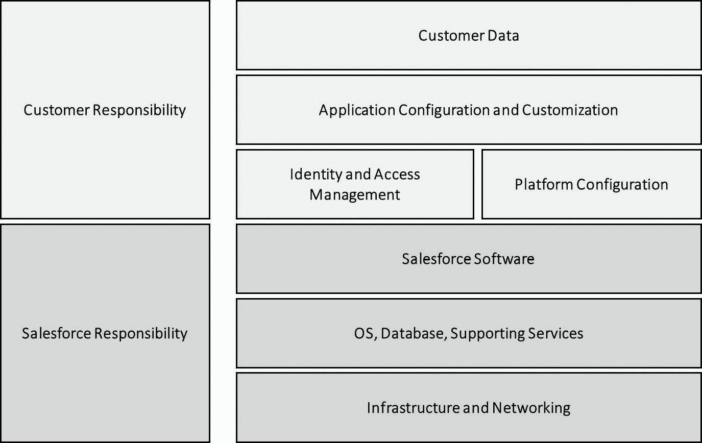
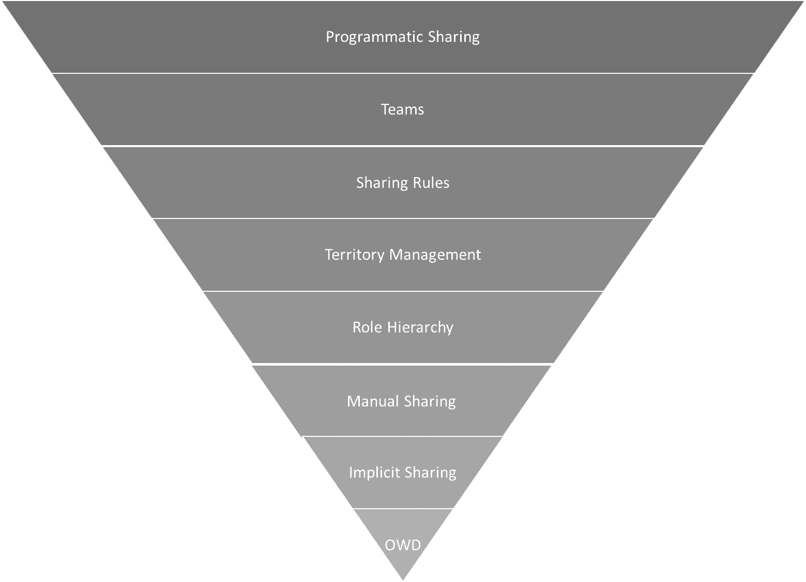

# 3

# 如何避免对安全产生困惑

本章讨论与确保 Salesforce 组织安全相关的反模式。我们将首先研究围绕 Salesforce 共享安全模型的关键反模式。然后，我们将探讨在将其他事物误认为是安全时可能出现的反模式。接着，我们将继续讨论如何避免搞砸共享模型，并再次总结关键要点。随着 Salesforce 不断整合 AI 技术，新的安全考虑因素不断涌现。本章还将涉及 AI 如何影响 Salesforce 中的安全格局。

本章将涵盖以下主要主题：

+   *共享属于 Salesforce* 反模式以及人们如何错误理解共享责任模型

+   *合规即安全* 反模式如何使你产生虚假的安全感，以及你可以采取的应对措施

+   *声明式永远安全* 反模式以及为什么你不能总是依赖声明式功能来保证安全

+   *意大利面共享模型* 反模式——为什么在 Salesforce 上很容易进入一个过于复杂的共享模型，以及如何防止这种情况发生在你的组织中

完成本章后，你将清楚如何避免 Salesforce 上常见的安全反模式，并了解可以采取哪些步骤来实施更好的安全实践。

# 对共享责任感到困惑

几乎所有的 SaaS 和 PaaS 平台都采用一种名为共享责任的安全模型。也就是说，供应商负责安全架构的某些部分，而其他部分则由客户负责。在这一部分中，我们将看到误解这一模型如何在 Salesforce 中引发问题。

## 共享属于 Salesforce

*共享属于 Salesforce 反模式* *认为 Salesforce 平台上的安全始终是 Salesforce 的首要责任*

### 示例

SmallCo 是一家为光学仪器提供特殊镜头的供应商。他们在全球销售，最近已采用 Salesforce Sales Cloud、订单管理和 B2B 商务，以直接推动电子商务，而不是仅通过分销商销售。

当他们进行实施时，Salesforce 平台经过了 James 这位 SmallCo 内部专职安全专家的安全审查。他对平台进行了整体评估，并确认 Salesforce 平台，包括 Salesforce 如何保障其数据中心、平台和 Web 应用程序的安全，符合 SmallCo 的所有标准。

James 评估了 Salesforce 在安全方面使用的共享责任模型，并认为在初始项目中，SmallCo 方面无需额外的安全控制措施。Salesforce 将充分确保安全，SmallCo 无需额外工作。

在一段时间的顺利运行后，SmallCo 想要扩展其数字体验和与在线社区相邻的网络商店，并且还希望吸引更多客户进入网络商店。Mika，作为 SmallCo 的 Salesforce 产品负责人，被赋予了这个扩展项目的任务。

由于预算有限，Mika 同意与实施伙伴达成一致，将大量功能扩展给匿名用户，以便许多任务无需登录即可完成。这样，SmallCo 可以选择一个相对较小的基于登录的许可 SKU。

系统顺利上线，并且如预期，用户数量增长了十倍以上。Mika 和团队庆祝成功，并在完成最后一些待改进的小问题后，开始为下一个项目做准备。

就在这时，Mika 收到了一份来自一个曾帮助 SmallCo 实施原始 Salesforce 方案的 Salesforce 咨询公司的安全建议。咨询公司指出，Salesforce APIs 中发现了一些新漏洞，这些漏洞在数字体验中被使用。如果存在对外部用户过于开放的模型，这些漏洞可能会导致严重的安全漏洞。

Mika 起初感到担忧，但他想起了自己在启动新项目之前与 James 讨论过的 Salesforce 安全性问题。APIs 听起来像是一个核心平台特性，因此 Salesforce 应该会负责处理它们。项目已经关闭，做任何新工作都需要找到新的预算，而这非常困难。因此，他决定忽略这个警告。

三周后，一封电子邮件送达了 SmallCo 的内部邮箱。邮件包含了一个数据转储，里面有 SmallCo 所有的专有产品信息以及客户和订单的列表。数据转储附带一项赎金要求，要求用加密货币支付至指定地址，否则数据将被公开。

事情迅速升级，外部顾问被召入协助管理这一局面。他们很快发现，为了帮助将功能提供给外部用户，进行了一些非常宽松的配置。这些配置可能是安全漏洞的根源，也是 Mika 收到来自另一方的安全建议的原因。

SmallCo 对 Salesforce 留下如此明显的安全漏洞感到非常失望，并向他们的客户经理提出了这一问题，然而客户经理却把责任推给了 SmallCo 的配置。SmallCo 最终决定，唯一的办法就是支付赎金并修补漏洞。

外部顾问协助了这两个操作，并且外部配置被锁定。SmallCo 必须更改其许可包，但此时，考虑到避免近期事件的再次发生，这笔费用已经变得微不足道。

根据外部顾问的建议，SmallCo 设置了一个流程并使用一些软件持续监控其 Salesforce 环境的安全性。此外，与 Salesforce 相关的人员以及来自安全部门的 James 还接受了一系列关于 Salesforce 安全模型的教育课程。Mika 松了口气，准备迎接下一个项目。

### 问题

"共享属于 Salesforce" 反模式本质上涉及谁负责维护系统和平台的安全性。在处理云系统时，总会有一定程度的共享责任。这意味着系统或平台提供商将负责一些安全部分，而你则负责其他部分。

图 3.1 – 共享责任模型

在 Salesforce 的术语中，Salesforce 负责维护基础设施和平台的安全性，并在应用层安全方面为你提供了很多帮助。Salesforce Shield，包括平台加密、事件监控和字段审计跟踪，提供了额外的安全层，但需要客户进行正确的配置和管理。然而，当你自己配置或编写某些内容时，最终其安全性仍由你负责。现在，强制性的多因素身份验证要求将更多的安全责任转移给客户，客户必须确保正确的实施和用户采纳。最后，Einstein 的功能引入了新的考虑因素，尤其是在数据使用、模型训练和预测解释方面，影响了共享责任模型。虽然我在这里讨论的是 Salesforce，但它同样适用于所有 SaaS 和 PaaS 提供商，尽管具体的共享责任边界会有所不同。

然而，关于这个边界很容易产生混淆，从而导致这种反模式的出现。"共享属于 Salesforce" 反模式试图解决的就是这个普遍的安全问题。也就是说，*“我们如何保持系统安全？”* 正如我们将在下一部分中看到的，它提出的解决方案是通过假设一切，或至少尽可能多的事情，都是软件提供商的问题，即使这并非如此。

### 提出的解决方案

"共享属于 Salesforce" 提出的解决方案是通过假设 Salesforce 作为世界领先的软件提供商已经考虑到了所有问题，因此会保持平台的安全性，从而解决系统安全问题。这样，你可以安全地忽略安全性作为解决方案的一部分，并专注于完成实际的配置工作。

这实际上意味着你没有认真参与共享责任模型，尽管其中存在不同的层次。例如，大多数组织会接受他们对授予用户的系统访问权限负责。

然而，这可能会延伸到你如何配置共享模型；你给谁访问 API 或自定义编码类的权限，或者谁被允许运行报告的问题变得更加模糊。当情况变得复杂时，采用这种反模式的人会做出简化的选择，因为他们认为 Salesforce 已经考虑过了这些复杂性。不幸的是，这并非总是如此，也不能总是如此。

这种反模式之所以吸引人，有几个原因：

+   你不必认真处理复杂的安全问题，这意味着你不需要雇佣或开发专业技能

+   在处理 Salesforce 时减少了你的内部工作量

+   它让你有一个故事可以向利益相关者传达，说明你手上有问题并且不必担心安全性

+   它让你有人可以指责或追究责任，如果事情出了问题

尽管你可以理解为什么人们可能倾向于通过采用这种反模式来简化自己的生活，但结果通常并不理想。

### 结果

人类倾向于通过简化和采取捷径来减少认知负荷。因此，共享属于 Salesforce 的反模式是一种自然现象，需要积极的安全意识来对抗它。

因此，这种反模式的第一个和最严重的结果是加强了组织内的低安全意识。如果你不意识到安全问题，问题迟早会发生。这种反模式会让你陷入麻烦。

其他典型的负面结果包括以下几点：

+   让所有人，从终端用户到高级管理人员，对其 Salesforce 系统的安全性产生虚假的安全感，导致事故发生时后果更严重，并且缺乏意识到实际上需要采取行动，而不是指望 Salesforce 来修复问题。

+   没有跟上 Salesforce 平台上不断变化的安全格局。这不仅包括忽视新的安全警报，正如我们的例子中所示，还包括不查看新的安全更新或功能，这些将提升你的安全状态。

+   最终，这种反模式导致组织的风险增加，这对大多数高级管理人员来说是无法容忍的，如果他们完全理解了它的话。

值得注意的是，你可以多年来一直采用这种反模式而不发现其负面后果。只有在发生足够严重的安全事故并且被发现时，才会真正不得不面对这种反模式。

因此，指出这种反模式的存在可能会显得有点无功而返，起初可能不会有所进展。然而，我们将在下一节讨论到，确实有些事情是应该做的。

### 更好的解决方案

解决这一反模式的方案对于任何至少在信息安全领域有些经验的人来说都是显而易见的。首先，这关系到提高对所面临的安全问题的意识，并获得内部的认可，采取积极措施解决 Salesforce 安全问题，而不是假设供应商会自动处理。

主要要点包括以下内容：

+   积极参与共享责任模型，清楚了解边界在哪里，如何确保你负责的部分安全，以及如何持续保持对那些你不直接负责但仍直接影响你的部分的警惕。

+   投资所需的技能，以便初期和持续执行你的安全任务。你可以在内部构建这些能力，也可以使用顾问；无论你如何做，责任在你，确保任务完成。

+   利用现代 DevOps 实践，结合 Salesforce DX 或第三方工具，实施版本控制和 CI/CD 实践，通过一致且可审计的部署流程增强安全性。

+   每当你在重要方面扩展你的解决方案时，评估新风险。这不仅仅是指添加新模块时。对现有功能的重大扩展也可能引入新的安全威胁。

+   转变公司的思维方式。从根本上讲，你需要将组织的思维方式转变为将安全视为组织韧性和增长的基础。这可能超出了我们大多数架构师能够实现的范围。然而，在我们能影响的范围内推动变化也是有帮助的。

+   考虑最小权限原则，这对于防止安全漏洞至关重要，它确保用户和进程仅拥有执行任务所需的最小访问权限。这种方法限制了被破坏账户或恶意内部人员可能造成的潜在损害，减少了攻击面，简化了审计和合规性，并有助于遏制恶意软件的传播。通过避免权限过高的账户和不必要的权限，组织可以显著降低与数据泄露、未经授权访问和权限升级攻击相关的风险，最终增强整体安全态势，并减少成为常见安全反模式的受害者的可能性。

+   持续监控你的组织，以评估 Salesforce 安全建议和关键更新。考虑实施事件监控，以跟踪用户活动、API 使用情况和其他关键事件。这有助于及早发现潜在的安全漏洞或滥用行为。

我们已经完成了本章第一个反模式的讨论，将进入另一个关于一般安全问题的讨论——“合规即安全”。

# 将其他事物误认为是安全

安全是一个复杂且多维的领域。这种复杂性在许多情况下可能是如此深刻，以至于人们有强烈的诱惑将其简化为更易管理的形式。在本节中，我们将看到如何发生这种情况的两个例子，以及其可能带来的负面后果。

## 合规即安全

*合规即安全* 认为，通过严格遵守一个或多个指定的*合规性框架*，组织的安全性可以得到保障。

### 示例

Alexandra 在 LifeCo 担任架构师，LifeCo 是一家主要提供用于连续测量生命体征的医疗设备的公司。他们在多个全球市场销售设备，因此需要遵守多种不同的监管体系。可以公平地说，LifeCo 文化的重要部分就是专注于满足这些监管要求并保持合规。

在 IT 安全方面，LifeCo 也采用了一种以合规性为中心的方法，将 ISO 27001、HIPAA 和 GxP 协议结合成一个全面的检查和控制集，这些内容会在每个项目开始时进行详细记录，并随后每年进行审计。虽然在一年中有维护合规性的流程，LifeCo 将大部分注意力集中在初始文档和审计事件上。

LifeCo 采用 Salesforce 进行现场销售和护理程序，使用 Sales、Service 和 Health Cloud 组件。在实施过程中，Alexandra 与来自 IT、安全、法律和数据保护办公室的业务相关方密切合作。

他们对 Salesforce 在平台层面以及每个单独云层面的所有控制措施进行了彻底评估。他们与 Salesforce 的安全代表花费了大量时间，深入了解安全实施的细节，努力获得关于敏感问题的真实答案。

此外，他们要求实施合作伙伴提供详细的检查表和文档，以确保所有配置工作符合必要的标准。这在实施和测试期间增加了相当大的开销，但 LifeCo 坚信 Salesforce 符合他们对所有内部系统所施加的相同标准。

系统文档在经过长时间的调整以满足详细要求后，最终被签署为合规。Alexandra 继续在 Salesforce 领域工作，但主要专注于为新版本准备需求并更新与安全无关的技术标准。

然后，九个月后，难以想象的事情发生了。首席执行官接到一个来自流行新闻网站的电话，询问他们对公司成千上万名患者个人信息被泄露到暗网一事的回应。毫无疑问，这些数据来自 LifeCo，因为其中包含了公司关于设备使用的专有信息。

首席执行官匆忙作出回应，但损害已经造成。LifeCo 的声誉遭遇重大打击，成为主流新闻、社交媒体和股市的攻击目标。亚历山德拉在事件发生后担任调查和清理的主导角色。

调查结果并不完全定论，但有良好的间接证据指向一名心怀不满的员工导出了含有个人信息的报告文件并将其上传到网上。然而，现有证据不足以提起正式指控。

根本原因分析得出结论，事件发生是因为将一种特殊程序用于赋予用户患者数据报告权限，从而扩展了 50 人团队的权限，其中许多人相对较初级，且在 IT 安全或合规方面的训练较少。这一做法得到了几位高级经理的支持，用以绕过系统中的多个管理报告问题。通过导出并手动在 Excel 中处理数据，团队能够弥补 Salesforce 实施中的某些功能缺陷。

问题已经得到修复，并进行了调查，以寻找其他类似的案例，看看是否有使用某种流程规避良好实践的情况。在审计时，Salesforce 通过了审计，没有严重的保留意见。然而，亚历山德拉心中仍然存在一个疑问，或许他们并没有真正弄清楚问题的根源。

### 问题

你可能会倾向于认为“合规即安全”试图解决的问题与“共享属于 Salesforce”相同。也就是说，这个反模式试图解决的是如何保持数据和系统安全的通用安全问题。然而，这种理解是微妙地错误的。

虽然我们上一条反模式试图解决的是一般性的安全问题，但“合规即安全”回避了真正的安全问题，转而关注的是如何通过所需的实践向某些外部方展示你是安全的。也就是说，文档和检查清单成为了焦点，而不是它们应当推动的实际安全实践。

这与“共享属于 Salesforce”类似，因为我们旨在将实际上保持安全的复杂、棘手问题，简化为勾选所有正确选项的简单问题。正如我们将在下一节看到的，通过将其简化为一组易于理解、可重复的流程来减少认知负担，这种策略对某些类型的组织具有很大吸引力。

### 提议的解决方案

“合规即安全”提议用遵循一套明确定义的标准来代替并从而解决保持系统和数据安全的问题。这样，你可以放心前进，确信自己已经遵循了良好的实践，因此，自己是尽可能安全的。

对于这个反模式，脑海中可以想象一个检查清单的形象。

让我们非常明确，合规性是一件好事！遵守那些定义行业和一般良好实践的标准确实至关重要。这适用于信息安全，也适用于一般情况。

遵守标准确实是鼓励组织内良好实践并将其嵌入文化中的一种极好方式。使这一情境成为反模式的原因在于，合规性变成了最终目标，而最终目标应该是合规活动所旨在促进的实践意识和改进。

换句话说，对于信息安全，你应该将合规性作为一种工具，旨在变得更安全、更具安全意识，而不是把它当作一个通过打勾所有框框就能摆脱安全问题的方式。然而，不难理解为什么组织会倾向于将重点放在合规性上：

+   合规性将信息安全这一模糊而复杂的问题转化为一个可以管理和治理的问题。管理者通常喜欢那些容易理解和清晰可衡量的问题。合规性容易理解，而安全性则不是。

+   为了建立和维持合规性所需的流程，往往与现有流程和技能相契合，特别是在那些运营于受监管行业的公司，如生命科学或国防部门。

+   当事情出错时，你有明确且不含糊的文档证明你已经遵循了规则。这对于外部解释事件和保护相关利益相关者都有帮助。

+   反正你必须保持合规。对于大多数大型组织，某种程度的合规性是强制性的，并且已经嵌入法律或行业标准中。既然你必须合规，那么将其作为最终目标的诱惑显而易见。

然而，从这种反模式中得到的结果往往是有问题的，正如我们将在下一部分讨论的那样。

### 结果

一般来说，通过“合规即安全”的反模式，你获得的是与某一标准的时点合规。你将在每次审计时保持合规，在审计之间，人们将遵循他们必须遵守的必要流程。

然而，你并没有在组织内建立起更深层次的安全重要性意识，也没有为人们提供进行有意义安全操作的培训和工具。这意味着你常常会发现许多解决方法，比如我们例子中描述的情况，人们做出某些在技术上合规的行为，却完全绕过了激发合规标准规则的安全精神。

在以合规为中心的组织中，你常常会看到两种模式出现：

+   **漂移与修正**：在这种模式下，标准实施后，你会看到组织逐渐偏离标准，因为人们将合规性视为一个时点的活动。这会定期进行修正，以使组织在审计时重新回到合规状态。

+   **结构化规避**：在这种模式中，你持续遵循规则，但在你的合规系统中包含了一些授予例外的方式，这些方式被系统性地利用，以在某种程度上使组织内的工作人员的工作变得更加轻松。这就是我们在前面例子中看到的模式。

从根本上讲，使用“合规即安全”反模式时，贵组织缺失了安全的“为什么”。他们做某些事情只是为了勾选合规框，但在那之后并没有进一步参与。这指向了帮助解决这个问题的关键干预措施，我们将在接下来的内容中讨论。

### 更好的解决方案

商业作家西蒙·西内克有一本著名的书叫做*从“为什么”开始*。在书中，西内克认为，最成功的组织（以苹果公司为典型例子）并不是从他们销售什么产品或如何生产它们开始，而是从一个基本的目的开始，这个目的体现在对公司为何存在的回答中。

虽然我不会对这个立场相对于商业的普遍性发表评论，但就信息安全而言，这个立场完全正确。“合规即安全”是一个反模式，因为它忽视了信息安全的根本“为什么”。

解决这个问题的办法，当然是从回答“为什么保持信息安全不仅仅是为了避免威胁，而且实际上使组织能够保持韧性并以安全的方式成长”开始。然后，你可以继续处理合规制度和具体控制的“如何”和“什么”。

对大多数 Salesforce 专业人员来说，这是一个庞大的任务。幸运的是，我们也可以做一些更小、更实用的事情来帮助：

+   持续让其他利益相关者意识到，勾选合规框并不意味着组织将保持安全。

+   培训人员了解 Salesforce 安全以及尽管合规，仍然可能发生的威胁。

+   找到“倡导者”来持续关注安全意识。

+   倡导这些经过培训和激励的人员持续对 Salesforce 组织的安全进行监控。

+   在技术层面，定期使用 Salesforce 的安全健康检查或第三方工具来识别并解决你组织安全设置中的潜在漏洞。考虑使用 Salesforce 的隐私中心来管理同意、跟踪数据主体请求，并保持对隐私法规（如 GDPR 和 CCPA）的合规性。工具支持有时有助于让人们持续参与活动。

+   通过定期在会议和专门的讨论中提出这个话题，在组织内传播知识和意识。

当然，还需要记住合规性很重要，您应该尽自己的一份责任保持合规。例如，Salesforce 在信息安全方面符合 ISO 27001 标准，在隐私管理方面符合 ISO 27701 标准，展示了他们对数据保护的承诺，但组织仍然必须确保自身流程与这些标准保持一致。在考虑过一个非常通用的安全反模式之后，我们将再次聚焦于 Salesforce 安全的一个具体反模式——“声明式功能始终安全”。

## 声明式功能始终是安全的

*陷入“声明式功能始终安全”的反模式意味着对声明式* *自定义功能的安全性抱有过于乐观的态度。*

### 示例

Rakesh 是 BigCo 公司 Salesforce 的技术负责人。BigCo 是 Salesforce 的长期用户，在多个不同云平台上有着广泛的应用。他们在 COVID 大流行期间大幅扩展了使用规模，以便推动许多远程进行的工作流程。

Rakesh 和他的团队与几个较小的合作伙伴一起开发了这些流程。由于时间压力，他们在构建流程时结合了开箱即用的功能和流程，暂时没有考虑复杂的需求，打算以后再处理。从开发速度和安全角度来看，架构师们建议采用基于流程的方法。

在业务的合作下，这种方法作为一种权宜之计证明是足够的，BigCo 相对顺利地实现了远程工作的过渡，部分得益于这项工作。在初始发布之后，Rakesh 和团队继续致力于改进和细化这些新流程，其中一些已经发展成复杂的、多方面的业务应用，拥有强大的功能来支持业务发展。

这包括执行大规模更新、创建和删除的能力；通过 API 调用其他系统的功能；甚至在员工承担新角色或职责时，授予他们新的安全权限。还有一些管理流程，超级用户可以用来管理后台功能。

从功能上来看，这对业务运作非常有效，但用户的多次失误导致了记录的意外删除。当一位特别不幸的超级用户在使用管理流程时不小心删除了大量机会后，CTO 决定让合作伙伴审查这些流程，因为他们担心可能会存在更广泛的问题。

合作伙伴对这些流程进行了审查，并反馈了一份列有不安全操作的清单。特别是，流程赋予了大量用户系统管理员级别的访问权限，而这些用户并没有接受过足够的培训来正确使用它们。这不仅带来了已经发生的意外删除问题，还存在真正的安全隐患。包括来自恶意员工和外部威胁的风险，因为部分流程理论上可以通过 API 更新触发。

由于 BigCo 拥有先进的备份解决方案，事件带来的损害很容易得到修复，但流程的修复则需要更长的时间。为了未来的所有开发，Rakesh 与外部合作伙伴共同制定了一套明确的安全指南，在创建流程时必须遵守这些指南。

### 问题

声明式始终安全试图解决的问题是安全开发或定制。换句话说，我们如何避免我们的代码和定制造成漏洞，进而被利用获取我们的数据和系统？

不足为奇的是，许多人倾向于认为低代码或无代码方法能解决安全问题。许多经典且广为宣传的漏洞都源自模糊的编码错误，因此如果你想要更安全，避免使用代码似乎是个好主意。

当然，低代码/无代码方法是一种相对较新的现象，因此它在实践中是否真的有效，仍然存在一些不确定性。然而，这种推理一般是合理的，因为像 Salesforce 这样的供应商会花费更多的时间来确保他们提供的低代码组件的安全性，而你可能无法在自己的代码上投入相同的精力。

然而，正如我们接下来将详细讨论的提议解决方案所示，这种推理并不是完全可靠的。

### 提议的解决方案

针对声明式始终安全提出的安全开发和配置问题的解决方案是通过只使用声明式功能来绕过问题，例如，假定默认安全的自定义对象、页面布局、流程，甚至 Omnistudio。这样，我们就不需要花费太多时间考虑安全问题，可以更快速地创建功能。

这对于许多不同的利益相关者来说显然是一个有吸引力的提议，原因如下：

+   这在某种程度上是正确的。低代码方法比基于代码的方法更不容易包含安全漏洞。

+   它通过明确界定可能性范围，简化了开发和配置。

+   它为技术团队提供了一种有效的方式，以应对过于复杂的业务需求。

+   它通过利用可以根据特定业务需求进行调整的预构建功能，加快了功能交付的速度。

因此，专注于声明式功能带来了许多好处，并且通常被认为是 Salesforce 社区中的一种良好实践。然而，过度强调这一点，可能会使其成为一种安全反模式，因为它忽视了即使在声明式解决方案中也可能存在的真正安全威胁。

### 结果

因此，声明式始终安全这一反模式的关键负面结果是对解决方案中可能存在的安全威胁视而不见，甚至没有意识到这些威胁的存在。这可能导致严重的负面后果，正如我们的示例所示。然而，随着 Salesforce 推出新的声明式功能，这个问题只会日益加剧。

从 Salesforce 平台发布功能的方式来看，Salesforce 希望低代码工具，如流程和 Omnistudio，成为平台上定制化解决方案的首选工具包。然而，这些工具越强大，越有可能执行一些可能导致安全问题的操作。

同样，外部服务虽然是声明式的，但如果配置不当，尤其是在处理外部端点和数据时，可能会引入安全风险。这也适用于日益突出的 AI 解决方案。例如，使用爱因斯坦预测构建器时，您需要确保敏感字段不会被无意地包含在预测模型中，并且模型访问应适当限制。自定义元数据类型虽然是声明式的，但可以存储敏感的配置数据，应通过适当的访问控制来保护。

然而，流程是最大的潜在风险领域。因此，让我们考虑一些可能在流程中发生的安全问题：

+   一般权限，如运行流程或流程用户许可，可能会赋予大量用户运行组织中所有流程的权限，从而导致类似我们示例中的问题。

+   如果用户可以访问 All_Flows 列表视图，他们就可以从 UI 运行组织中的任何流程。这包括外部用户。

+   流程执行上下文很复杂，容易因错误而将流程运行在系统模式下，从而可能导致用户权限的提升。

+   流程中的客户端验证在某些情况下可能会通过将数据包含在响应中，意外泄露信息。

+   组件可见性可能泄露信息，因为该组件仍然包含在 HTTP 响应中。

+   可能会从流程中调用具有广泛影响的 Apex 操作，而没有清晰了解其安全性影响。

+   在体验云站点中使用屏幕流时，确保实施适当的访问控制，以防止未经授权的访问敏感数据或操作。

我推荐阅读文章 *了解 Salesforce 流程和常见安全风险*，可以在[`appomni.com/resources/aolabs/understanding-salesforce-flows-and-common-security-risks/`](https://appomni.com/resources/aolabs/understanding-salesforce-flows-and-common-security-risks/)找到，这篇文章是了解一些常见流程问题的良好入门。

然而，关键问题在于，流程、Omnistudio，甚至更简单的声明式功能，确实存在一些实际的安全问题。新的流程功能，如流程编排，如果配置不当，可能会增加额外的复杂性和潜在的安全风险。因此，我们不能默认它们是安全的，而必须采取适当的预防措施，这将在下一节中讨论。

### 更好的解决方案

避免这一反模式的第一条也是最重要的建议是：像对待基于代码的解决方案一样，认真对待你的声明式解决方案。像流程和 Omnistudio 这样的工具越来越强大，已与 Apex 一样，能够解决复杂的业务需求。

这意味着，对于基于这些工具的解决方案，你应当遵循适合目的的软件开发流程，以符合解决方案的复杂性和重要性。具体来说，涉及安全性时，你应牢记以下几点：

+   应该为声明式解决方案制定标准和指南，就像你在编写代码时会制定一样

+   在处理敏感数据或部署大量功能的声明式解决方案时，提前进行风险和威胁评估

+   培训开发人员和配置人员理解相关问题，并提高他们对依赖声明式工具所能实现和无法实现的目标的普遍认知

+   关注声明式工具的长期发展趋势，并根据需要更新你的指南

+   监控外部环境，关注与 Salesforce 中声明式功能相关的问题或漏洞

话虽如此，我们将通过查看如何真正搞砸 Salesforce 中的共享模型，来结束我们关于安全相关反模式的讨论。

# 共享并不总是代表关怀

Salesforce 拥有世界上最强大且最复杂的共享架构之一。这既是福也是祸。然而，在本节中，我们将重点展示它如何出错以及如何防止这种情况发生。

## 意大利面共享模型

*意大利面共享模型对 Salesforce 组织的安全性，就如同意大利面代码对应用程序可维护性所做的影响一样。*

### 示例

GlobalCo 是一家跨多个 B2B 行业销售产品的多元化企业。GlobalCo 大部分组织运行在各业务单元内，但 IT 已成为强大的全球职能部门，它使得各业务单元之间能够通过 Slack 等简单工具高效协作。

几年前，GlobalCo 采用了 Salesforce Sales Cloud 和 Service Cloud 作为其企业 CRM。Huan 是该项目的首席架构师，现在在全球 Salesforce 卓越中心担任职务。尽管一些子公司在操作上仍然使用其他 CRM，但所有关于客户交易的基本数据都必须传输到 Salesforce。为了促进流程和数据的标准化，GlobalCo 采用了强有力的单组织战略来管理其 Salesforce 环境。

不幸的是，尽管 GlobalCo 希望能够全球共享尽可能多的数据，但许多法规阻止他们实现理想的共享范围。存在一些问题：

+   一些国家要求将其数据与其他国家的数据隔离，形成国家数据孤岛

+   许多司法管辖区的竞争法也阻止某些子公司与特定其他子公司共享数据，以防止串通。

+   在某些司法管辖区，销售人员对谁可以查看他们的机会感到有些偏执，担心其他人会窃取这些机会，因此采取了很多额外的保护措施。

+   最终，某些业务单元的高管习惯于将敏感的机会和客户支持案例保密，并只在少数人之间共享，这一要求也至少部分得到满足。

在上线后，很多人抱怨 GlobalCo 为满足这些需求而设立的结构过于僵化。至少有六个国家要求进行一系列例外处理。

图 3.2 – 共享机制

Huan 带领团队调查需求。最初，他认为通过对组织层级和企业区域管理进行小的调整可以解决问题。然而，这种方法过于简单，因此他设计了多个额外的公共组，以便捕捉到更多模型的细化调整。

然而，用户仍然在抱怨，于是 Huan 开始发挥创造力，利用账户和机会团队。由于所需的流程过于繁琐，无法手动管理，团队最终实施了一些自动化功能，根据特定标准自动将团队成员添加到账户和机会团队中。

然而，即便如此，这种方式仍然无法完全捕捉到何时应共享和不应共享特定记录的业务需求，尤其是在指定的业务单元和国家之间。Huan 指定了一种基于 Apex 的共享机制，并将其交给开发团队实施。

共享模型的完整调整在一个周末内全球上线。烟雾测试通过，但每个人都屏息以待，因为模型的测试非常困难，没有人能明确表示所有重要场景都已被测试。

尽管没有发生灾难，但在上线后的一个星期内，团队还是收到了持续不断的访问问题。很多情况下，要么某些人拥有不该有的访问权限，要么某些人缺少应该有的访问权限。

更糟糕的是，团队发现几乎无法定位错误。由于涉及的因素太多，确定具体案例中的错误变得非常复杂。每次团队认为解决了一个问题，似乎又会有两个新问题作为后果出现。

在几周的尝试解决问题的过程中，变更管理委员会决定回滚共享模型的更改，并找到一套手动的替代方案，直到找到更稳定的技术解决方案。

### 问题

在传统的软件应用中，有一个著名的概念叫做**意大利面条代码**。它发生在程序员在没有设计实践或必要经验的情况下编写系统时。相反，他们一次做一件事，只是当前能用的做法，而没有考虑整体框架。

随着时间的推移，这会导致代码看起来像盘子里的意大利面条。一切都纠缠在一起，系统的某一部分发生变化会以看似随机的方式影响其他部分，即使是代码的原作者也无法真正理解发生了什么。

幸运的是，在 Salesforce 上，我们很少看到如此程度的意大利面条代码。它是可能发生的，但根据我的经验，它是相当罕见的。频繁发生的是“意大利面条共享模型”反模式。也就是说，共享模型复杂到即使是其设计者也无法可靠地告诉你在特定情况下某人是否能够访问某条记录。

“意大利面条共享模型”反模式源于真诚地尝试按照记录共享的需求满足业务需求。问题在于，对于大型的全球性组织而言，这一领域的复杂度如此之大，以至于几乎不可能做到完全正确。

在我们的例子中，我们看到了一些原因：

+   隐私法律在不同国家之间有所不同，决定了哪些数据可以共享，哪些不能共享

+   竞争法可能会限制子公司之间的可见性

+   销售团队对奖金和佣金的关注极为重要，这可能导致关于数据共享的严重顾虑

+   高层管理人员通常因各种商业原因希望保密某些数据，同时共享其他类型的、不太敏感的数据

除了这一场景外，还有更多与特定法律和标准或组织内部政治因素有关的场景，例如保护敏感的健康或财务数据，可能会影响数据共享要求。

总体来说，如果你发现自己身处一个具有这种数据共享需求设置的组织中，你很可能会陷入“意大利面条共享模型”的反模式，单纯为了适应给定的需求而陷入其中。

### 提出的解决方案

“意大利面条共享模型”反模式建议以增量和迭代的方式解决共享需求，尽可能接近地满足业务需求。

这看起来十分合理，原因如下：

+   这正是我们为大多数其他类型的需求所做的事情

+   这与大多数 Salesforce 实施团队所采用的主流敏捷软件开发方法相符

+   你几乎总能在短期内实现目标

+   需要很长时间，复杂度才会达到使过程偏离轨道的程度

不幸的是，这一过程在某些规模和复杂度的组织中可能会崩溃，并导致我们正在讨论的反模式，正如我们在下一节中所看到的那样。

### 结果

“意大利面共享模型”反模式的结果是，某些或更多以下特征的情况出现：

+   记录与某些用户共享，但没有人完全理解原因

+   记录访问缺失，某些用户无法完全理解原因

+   确定访问问题非常困难

+   由于复杂性，修改共享模型被认为是完全禁止的

+   共享的变化往往会导致新的问题，这些问题难以理解和解决

值得反思的是，为什么共享更容易出现“意大利面共享模型”反模式，而其他配置领域则不然。答案主要在于 Salesforce 中控制共享的机制数量庞大且复杂，以及它们之间的相互作用。根据不同的统计方法，Salesforce 中有超过 20 种不同的方式来扩展对象和记录的共享。

下表展示了一些可以用于控制共享的机制示例：

| **机制** | **用途** |
| --- | --- |
| 所有权 | 记录所有者、用户或队列的访问权限 |
| 配置文件 | 对对象的基本访问（或不访问） |
| 权限集 | 对对象的基本访问（或不访问） |
| 全组织默认（内部） | 默认的内部共享级别 |
| 全组织默认（外部） | 默认的外部共享级别 |
| 角色层级 | 访问下属记录 |
| 使用层级授予访问权限 | 根据角色层级共享（或不共享） |
| 公共组 | 与特定用户组共享 |
| 基于所有权的共享规则 | 根据记录所有权配置的规则进行共享 |
| 基于条件的共享规则 | 根据记录字段值配置的规则进行共享 |
| 来宾用户共享规则 | 与来宾用户的特殊共享 |
| 账户团队 | 根据是否为账户团队成员共享 |
| 商机团队 | 根据是否为商机团队成员共享 |
| 案例团队 | 根据是否为案例团队成员共享 |
| 手动共享 | 手动共享记录 |
| 隐式共享 | 对某些标准对象，在父子之间自动共享 |
| 领域层级 | 根据配置的领域和领域成员共享 |
| 外部账户层级 | 根据账户层级授予访问权限 |
| 共享组 | 与门户用户共享记录 |
| 共享集 | 根据账户或联系人字段的匹配与门户用户共享记录 |
| 管理组 | 与管理链共享记录 |
| Apex 共享 | 通过编程共享 |
| 限制规则 | 限制访问特定类型的记录 |

表 3.1 – Salesforce 共享机制

如果这些大量机制使用不当，最终会导致“意大利面共享模型”反模式，因为它们的相互作用对于人类智能而言变得不透明。

### 更好的解决方案

正如我们所见，意大利面条共享模型反模式可能仅仅是因为人们在做他们的工作，并且逐步努力通过满足要求为企业创造价值。这意味着，这种反模式可能在没有任何人做错事情或做出特别错误决策的情况下发生。需要有人从日常工作中抽身出来，才能在问题发生之前发现这一点。

冒着激怒敏捷主义者的风险，我建议，如果你发现自己身处一个共享需求非常复杂的组织中，你需要停下来，退后一步，并为共享架构制定一个前期设计，同时建立治理机制来长期执行。例如，你可以引入一个原则：在使用共享机制时最好保持节俭，并且将新类型共享的采用纳入架构评审委员会或设计权威的批准范围。

这篇文章已经结束了关于安全反模式的介绍。接下来，我们将重点讨论从本次讨论中可以得出的关键点。

# 了解重点要点

在本节中，我们将从具体模式中抽象出来，尝试提取出你作为 Salesforce 架构师在日常工作中或准备 CTA 评审委员会考试时可以运用的更广泛的学习要点。

在架构 Salesforce 解决方案时，你应该注意以下事项：

+   安全问题不仅仅是技术问题；你如何构建问题框架和提高意识更加重要。

+   很容易通过各种方式忽视复杂的安全问题。虽然作为架构师你可能无法单独改变这一点，但你可以成为提高意识的一部分。

+   组织共享会议并发送相关材料是一种可以帮助改善情况的好方法。

+   你还可以确保技术层面的安全指南和实践能够反映出全面的威胁情况。

+   不要在没有充分证据的情况下认为某些事情是 Salesforce 的责任。

+   不要认为因为你使用的是声明性功能，就不能存在安全漏洞。

+   寻找方法，定期监控你的 Salesforce 组织的安全状况，并根据情报采取行动。

+   在治理论坛中定期讨论安全问题，在那里你可以影响议程。

+   除非你的需求非常简单，否则不要逐步构建共享模型。

+   相反，提前解决问题，制定一套在你的场景中可行的机制。

+   定期评估和更新你对共享责任模型的理解，特别是在 Salesforce 推出新的功能和服务，尤其是 AI 驱动的能力时。

+   实施持续的安全监控策略，包括自动化工具和定期的手动审查，以便在 Salesforce 环境中跟踪不断演化的威胁。

+   为你的 Salesforce 团队制定一项全面的安全培训计划，涵盖声明式和编程式开发，重点强调这两个领域中的潜在风险。

+   在你的 Salesforce 团队中建立安全优先的文化，将安全考虑融入到开发生命周期的各个环节，从需求收集到部署。

+   定期审计和优化你的共享模型，使用如 Salesforce Health Check 和 Optimizer 等工具，以防止不必要复杂性的逐渐积累。

在准备 CTA 评审委员会考试时，应注意以下事项：

+   安全嵌入在许多领域中，因此即使它是一个独立的领域，你仍然应当在相关的解决方案演练中简明扼要地涵盖安全问题。

+   安全是一个复杂的领域，因此要尽可能清晰简明。很容易陷入长时间的安全讨论，但在评审委员会上你没有时间做这个。

+   在审查治理模型和潜在风险时，考虑加入一些关于安全的评论。

+   在选择安全机制时要节俭。机制越少，就越容易解释，也更不容易出现导致意外后果的交互。

+   利用权限集组来更高效地组织和管理复杂的权限结构，从而减少过于复杂的安全模型的风险。

+   当然，不要过度简化或做出假设，以免忽视在安全领域中可能出现的问题。

+   分享特别容易出错，因此在设计复杂的共享解决方案时要非常小心。

+   不要在场景中没有明确提到的地方发明额外的安全要求。在阅读许多场景时，你很容易会误以为存在额外的隐含要求。

+   唯一的例外是处理隐私法，例如 GDPR，如果你的组织位于适用该法律的司法管辖区内。

+   在与外部系统集成时，确保遵循适当的 API 安全措施，例如 OAuth 2.0、IP 限制和定期令牌轮换。

+   准备好讨论在多云 Salesforce 实施中如何处理安全问题，考虑每个云的独特安全挑战。

+   练习用清晰简洁的方式解释复杂的安全概念，例如人工智能对数据安全的影响，以适应评审委员会的时间限制。

+   准备好解释在大规模 Salesforce 实施中，如何平衡安全需求与其他架构问题，如性能和用户体验。

我们已经覆盖了本章的内容，现在可以继续下一章了。不过，首先，我们将总结一下我们的学习成果。

# 总结

在本章中，我们已经看到，通过采取看似无害的行动或未能意识到职责和方法上的微妙区别，存在多种方式可能会危及你的安全。

这些包括了许多不同平台的通用安全反模式，例如“属于 Salesforce 的共享”和“合规即安全”，以及 Salesforce 特有的反模式，例如“声明式总是安全的”和“意大利面分享模型”。这些反映了安全领域的特殊复杂性。

在安全问题上，你既要关注组织文化的高层次问题，也要关注技术设计的细节，特别是如何为你所使用的技术量身定制机制。这正是让它既让人沮丧又极具趣味性的原因。

在涵盖了安全领域之后，我们将继续深入了解数据。
