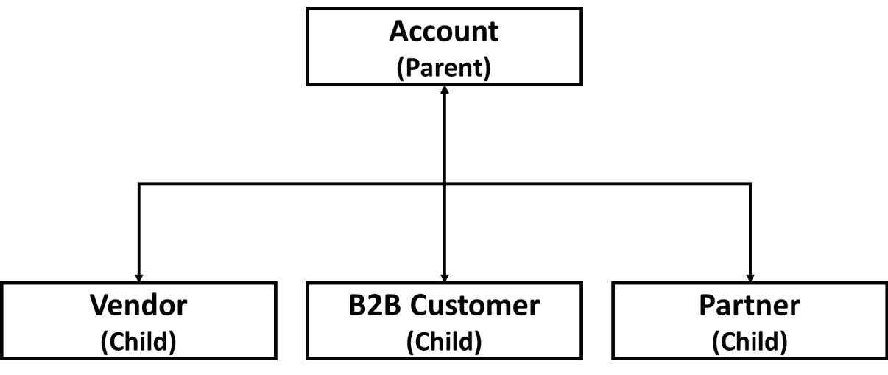
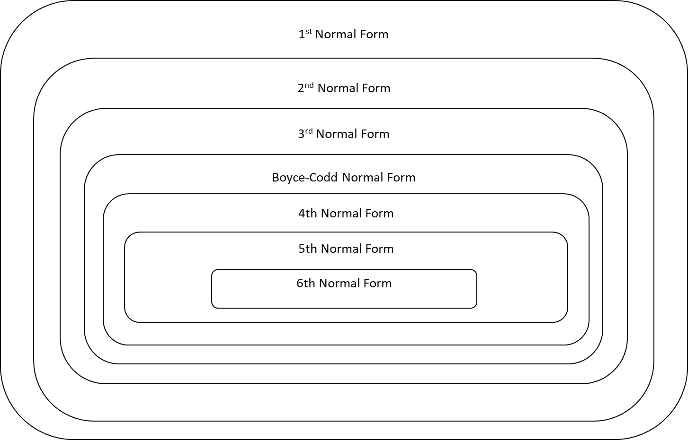
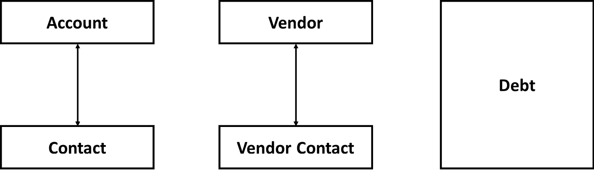
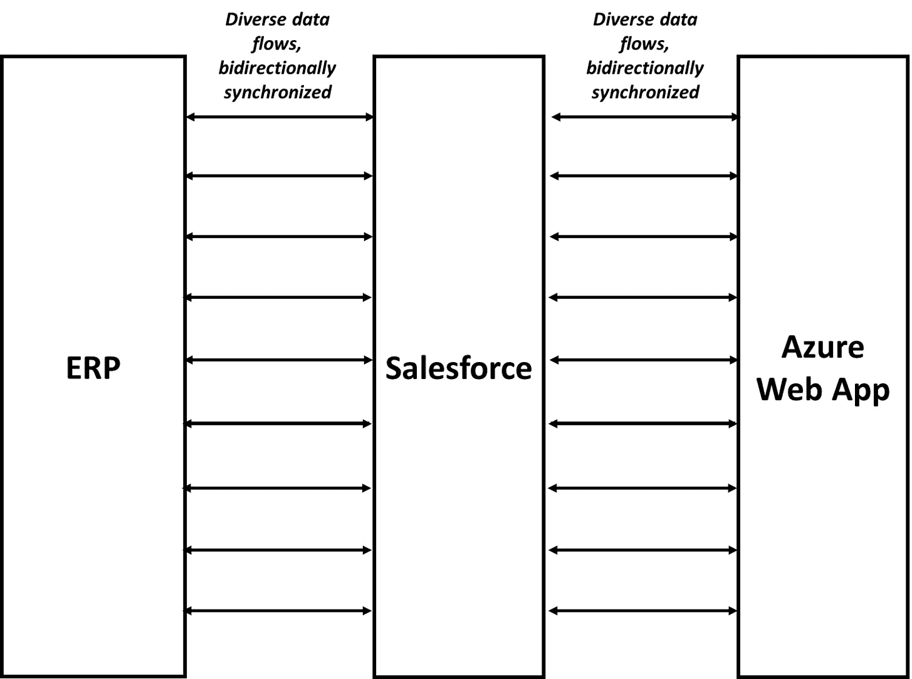

# 关于数据，绝对不能做的事

本章讨论了在 Salesforce 平台上如何使数据层受到妥协。整个章节中，我们将介绍在 Salesforce 环境中频繁出现的四种数据领域反模式，并为你提供识别和避免这些问题的建议。此外，我们还增加了关于 AI 相关反模式的新章节，以帮助你应对这些新兴发展。

本章将涵盖以下主要内容：

+   为什么将 Salesforce 当作关系型数据库处理不会带来令人满意的结果

+   没有协调活动会导致一个断裂的数据模型，并带来严重的负面后果

+   没有为数据库的增长做好规划，尤其是在你明知道该做时，会带来负面后果

+   为什么数据同步在小规模时可能是一个不错的解决方案，但在大规模时却可能成为噩梦

+   如何在 Salesforce 的背景下构建 AI 架构

完成本章后，你将清楚了解 Salesforce 与传统关系型数据库的区别以及为何这非常重要。你还将明白良好治理的重要性、数据建模和增长的规划，以及在没有治理的情况下可能出现的问题。最后，你将对数据同步的复杂性有更深入的了解。

# 将 Salesforce 误认为是普通数据库

许多人从其他技术背景进入 Salesforce 生态系统，他们通常会带着基于过去经验的先入之见，认为架构应该如何设计。虽然这能为平台带来一些丰富的经验，但也有一些情况可能会在架构设计上引导你走偏。最常见的错误之一，就是把 Salesforce 当作其他类型的数据库使用——通常是关系型数据库。

## 将 Salesforce 当作关系型数据库

*将 Salesforce 当作关系型数据库的反模式包括将 Salesforce 的数据层误认为是* *关系型数据库。*

### 示例

UmbrellaCo 是全球最大的旅游行业雨伞制造商。他们使用 Salesforce 来管理其 B2B 销售渠道，包括机会管理、报价和订单。

然而，在 UmbrellaCo 的整体系统架构中，Salesforce 只是一个相对较小的组件。总体架构由一套定制化的业务系统主导，这些系统是公司内部开发和维护的，同时还有一个老化的**制造资源计划**（**MRP**）系统。

还有一个相对现代化的中间件平台，UmbrellaCo 的企业 IT 架构在很大程度上依赖于在中间件中整合、转换和结合来自各系统的数据。这让他们在面对老旧和定制化的系统组合时，能够保持一定的灵活性。

Rishi 是 UmbrellaCo 负责 Salesforce 的经理。他是一个外部招聘人员，最近刚刚从一家中型生态系统合作伙伴公司加入 UmbrellaCo。作为他刚刚上任后的第一件事之一，他必须处理来自中间件团队的一系列关于 Salesforce 数据模型的投诉。

UmbrellaCo 长期以来有着一些针对特定类型数据建模的惯例，例如不同类型的账户，如中小企业账户与大型企业账户，以及严格的地址建模标准。Salesforce 模型未能以标准方式适应这些模型，导致中间件团队在将数据映射到其他系统时需要进行大量的工作。

John 是长期受雇于 UmbrellaCo 的一名集成架构师，他被分配到 Salesforce 团队，目的是使 Salesforce 数据模型保持一致。Rishi 在与 John 合作时立刻感到非常不舒服。John 对 Salesforce 数据模型表现出极大的反感，认为它从根本上无法符合良好的数据建模实践。

UmbrellaCo 的标准是使用关系型数据库，规范化到 **第三范式**（**3NF**），并遵循公司对关键数据类型的约定。Salesforce 并未达到这些期望，也无法轻易地做到这一点。Rishi 尝试解释，Salesforce 数据模型不应被视为经典的关系型数据库，无论它在表面上有多少相似之处，但他的反对意见未能得到回应。

经过一个月的工作后，John 提出了重新设计 Salesforce 数据模型的提案。该提案涉及用一组新的自定义对象替换标准的 Salesforce 地址字段，这些自定义对象包含地址和一个与主账户对象关联的任意数量的地址行。不同类型的账户将有各自的自定义对象，并通过类似继承的接口与主账户对象进行关联。

图 4.1 – 重构账户模型的提案

为了实现这一点，既需要在用户界面上进行重构，又需要在 Salesforce 内部进行数据迁移，但 John 坚持认为这将使系统与公司标准保持一致，并减轻中间件团队的工作负担。

Rishi 强烈反对，并且甚至让他的 Salesforce 客户经理带来了一位 Salesforce 的高级解决方案工程师，试图解释为什么按照这个计划进行操作无疑会削弱 Salesforce 平台的功能，并使额外的项目变得更加复杂和昂贵。这些反对意见最终被提交到公司架构论坛，但由于符合公司标准被认为是更重要的迫切任务，因此被拒绝了。

展望未来，Salesforce 上的数据建模应遵循常规的 UmbrellaCo 标准，并交付符合企业数据模型规格的良好规范化数据模型。Rishi 深吸一口气，决定未来主要在 Salesforce 上进行定制解决方案的开发。

### 问题

Salesforce 作为关系型数据库所解决的问题是与软件系统中业务实体建模相关的一般问题。在这种情况下，采用软件行业中最常用的建模范式：关系型数据库模型。

在这种方法中，你将业务领域的逻辑模型映射到一组数据库表中，使用一个叫做**规范化**的过程。规范化的具体细节我们不需要过多关注，但它本质上关注的是消除数据库中的冗余。换句话说，每一条信息应在数据库中只存储一次并且是唯一的，然后在所有使用它的地方进行引用。

此外，不应有重复字段，例如多个地址行，实体中的所有字段应明确依赖于主键：Salesforce 中的 ID 字段。你应该始终为实体拥有一个且仅有一个唯一的键。

通过应用这些以及其他一些更复杂的规则，严格或宽松地达到一定的规范形式，这是规范化模型的名称。最严格的应用形式是所谓的**第六范式**（**6NF**），在这种情况下，表只包含一个主键和另一个属性。然而，大多数企业应用程序都力求达到 3NF，这符合我们之前概述的标准。

图 4.2 – 范式层级

这一切都很好，并且是基于关系型数据库的系统中公认的做法。然而，Salesforce 尽管在表格（称为对象）和关系（以查找和主/从关系的形式，使其能够作为关系型数据库使用）上与关系型数据库有一些表面上的相似之处，但它并不是一个关系型数据库，且不应当被视为一个。

### 提出的解决方案

将 Salesforce 作为关系型数据库，忽略了 Salesforce 平台上数据建模的独特性，并用一个基于关系型数据库的模型替代。这意味着自由使用自定义对象作为表格，关系则作为外键关系。

它明确忽视了 Salesforce 标准的记录区分方式，如记录类型和页面布局，而选择了一个具有更多唯一自定义对象的关系模型。此外，这种反模式往往很少使用标准对象，因为它们与良好规范化的数据模型不兼容。

这个解决方案对于许多从其他平台转到 Salesforce 的有经验架构师来说非常有意义，特别是那些没有很多理解或培训的人。毕竟，这在所有传统企业系统中都是被接受的做事方式，与公认标准的一致性在企业架构中非常有价值。

然而，像这种模式对 Salesforce 造成的形态扭曲，说明了每个标准都有例外。

### 结果

正如我们在前面的例子中看到的，引入这种反模式的结果本质上是增加了 Salesforce 解决方案的复杂性，导致了解决方案和维护方面的额外成本。

通过几乎为所有事情依赖自定义对象，你减少了利用开箱即用功能的能力，因为关系模型往往需要更多的小对象，这使得一些 Salesforce 常用功能（例如跨对象报告或跨对象公式字段）几乎无法使用。

这意味着你很可能需要编写更多自定义代码或构建复杂的自定义流程，而这正是你在前期实施成本、时间以及之后的维护和扩展性方面遭受重大损失的地方。

还有一个机会成本，即无法在同样程度上使用标准功能，也无法以相同频率采用新发布的功能。总的来说，为了一致性而付出如此高的代价是不小的。

### 更好的解决方案

数据领域是你应该采用 Salesforce 方式来获得最佳结果的领域。虽然有时 Salesforce 的好实践会有例外，但在数据建模方面，几乎没有例外地应该遵循这些指导原则。

这意味着直接在系统中建模广泛的业务对象，而不是经过规范化过程并依赖平台来管理和优化数据，或者至少提供工具让你做到这一点。这还意味着在可能的情况下使用标准对象，尽量避免自定义对象，并确保数据模型得到良好的治理，以避免数据完整性和冗余问题。

这对于许多在 Salesforce 生态系统中成长的人来说显而易见，但对于大多数传统架构师来说却是违背直觉的。因此，这是少数几个更可能由经验丰富的架构师而非全新架构师发起的反模式之一。它在 AppExchange 应用中比在标准实现中更为常见，因为这些应用更接近其他平台上传统开发模型。

# 忽视治理

治理在所有架构领域中都很重要，但也许有几个领域在缺乏治理时会出错，其中之一就是数据领域。在接下来的章节中，我们将探讨这一现象的两个例子，从当你未能在统一平台上协调数据模型时会发生什么开始。

## 断开的实体

*断开的实体* 是一种反模式，其特点是在公共数据库中出现未连接的数据实体，通常是同一*业务级实体*的多个数据库表示。

### 示例

SmileCo 是一家主要提供牙科用品的公司，业务遍布多个全球城市。他们已经使用 Salesforce 数年，并采取了部门战略，每个部门独立在 Salesforce 上运行，且没有中央监督。

有三个部门在认真使用 Salesforce，分别如下：

+   **财务**，使用自家开发的应用程序进行债务催收

+   **物流**，使用由一个小型生态系统合作伙伴开发的应用程序进行供应商管理

+   **销售**，使用标准的销售云实现

这些应用中的信息分散，并且团队之间没有跨部门的可视性或合作。Kimmy 是 Salesforce Summit 合作伙伴的一位咨询经理，她带领一个小团队来实现对基础数据的全面视图。

然而，她很快发现这项工作比她预期的要复杂得多。财务应用程序使用扁平化的、非规范化的数据模型来建模债务催收。所有信息都存储在一个巨大的债务自定义对象中，包括所有的联系人和账户信息。这些数据未经过验证，乍一看数据质量似乎存在问题。

物流应用程序通过自定义对象有效地反映了标准 Salesforce 数据模型，用于表示供应商、供应商联系人以及与供应商的报价和购买信息。这些字段与标准 Salesforce 数据模型有很大差异，但通过一些创造性的数据显示映射，仍可与标准对象（如账户和联系人）相匹配。

销售云的实施相对标准，但使用了许多额外的自定义字段，这些字段与其他两个平台应用中的数据建模方式完全不匹配。Kimmy 向客户报告了她的发现，客户在犹豫了一会儿后，要求她继续制定合并计划。

图 4.3 – 三种不同的账户和联系人表示方式

她提出的计划旨在标准化所有三个部门使用账户和联系人对象，采用标准对象，并基于此编写一套报告和仪表板，提供所需的概览。她放弃了尝试整合其他对象，因为它们与任何标准对象的距离太远，尝试成功的可能性非常小。

对于财务应用程序，她建议对巨大的债务对象中的账户和联系人部分进行重新归一化。这需要进行数据迁移，并做大量的去重和数据质量提升工作。幸运的是，由于应用程序本身使用了简单的声明式功能，重做应用程序的工作量相对较小。

物流应用程序则面临更大的问题。大部分功能都在自定义代码中，且需要大量的重做。合作伙伴不愿意做 Kimmy 建议的更改，因为他们更喜欢在自己的空间中工作，但在一定的压力下，他们同意了。然而，这些更改非常昂贵，且需要几个月才能完成。

总体而言，本来是一个持续几周的小型咨询项目，最后却花费了超过三个月的时间，导致了可观的成本。在离开客户后，Kimmy 提出了一份新的提案，建议在 SmileCo 引入一些基本的 Salesforce 治理功能。他们对提案进行了审议，并承诺会及时回复 Kimmy。

### 问题

断开实体是另一种反模式，它发生在你没有意识到某些没有监督或治理的实践可能在更高层次的操作中引发严重问题时。它是由缺乏意识引起的，而非为了达成某个特定目标的尝试。

这种反模式通常出现在较小或高度去中心化的组织中，这些组织中不同的团队可能共享相同的基础设施，在这种情况下是一个 Salesforce 组织，但除了最基本的操作外，并没有真正协调其他活动。它还需要一个 IT 成熟度较低、IT 治理极为薄弱的环境。

### 提议的解决方案

到目前为止，如果我们要总结“断开实体”反模式所提出的解决方案，它可能是类似于“别担心数据模型，任何设计都足够好”的说法。至少，这可能是它的解释方式，因为没有标准、实践或指南可供遵循。

缺乏治理在许多领域可能带来不良影响，但在数据领域，断开实体反模式是最严重的之一。这意味着团队在没有意识到同一平台上还存在其他内容或其他团队如何使用相同元素（甚至是相同标准对象）的情况下，孤立地进行开发。

这意味着你可以在没有意识到的情况下产生跨组织的影响。而且，至少从反模式的角度来看，最终会导致我们之前示例中所描述的情景，其中跨部门的项目被数据模型所妨碍或阻塞。

### 结果

对于“脱节实体”反模式，结果可能和其产生的过程一样混乱。对于那些缺乏协调的团队来说，尽管他们的工作最终会导致反模式，但通常在短期内没有问题。

当你孤立地处理自己的事情时，做事不规范或不按常规其实并不会带来短期影响。影响只有在规模扩大、协调要求增多或需要将应用扩展到新的用例时才会显现。

因此，具体的负面后果可能会有很大差异，但一些常见的后果包括以下几点：

+   无法实现对联系人、账户或其他任何相关业务实体的 360 度可见性

+   无法进行跨部门或跨应用程序的报告

+   由于数据层的变异性和复杂性，新开发和维护的成本增加

+   无法连接应用程序或创建跨部门工作流，而不需要投入大量重工成本来使不同领域达成一致

+   不同领域之间的重复工作

+   因数据模型不一致，采纳新标准功能的空间较小

总的来说，这种反模式在数据领域中具有与“大杂烩”（Big Ball of Mud）在系统领域或“意大利面条共享模型”（Spaghetti Sharing Model）在安全领域中的许多相同特征。

### 更好的解决方案

毫不意外，避免由于缺乏治理和意识所导致的反模式的关键，是实施适当的治理和意识生成机制。这意味着首先必须建立适当的治理论坛，在这些论坛中，不同的领域可以以结构化的方式协调他们的活动。

这需要良好的数据治理标准和实践的支持，以支撑在相关论坛中开展的工作。这些标准和实践可以根据组织和文化的不同而有所变化，但为了避免“脱节实体”反模式，以下清单可以作为起点：

+   在可能的情况下，严格执行标准对象和字段的使用

+   确保团队一致使用标准对象和字段

+   对于创建新自定义对象，必须遵循的审批流程

+   对于创建自定义字段，采用更轻便的审批流程

+   定义所有对象的所有权，并确保对象所有者在对其对象做出任何更改时都能被咨询

+   让一到两位架构师从全球角度审视数据模型，并提供关于其演进的持续建议

在阐述了当你未能协调数据领域中的活动时会发生什么之后，我们将转向讨论如果你未能为增长做规划会发生什么。

## 未计划的增长

*“未计划的增长”反模式发生在组织未能为存储数据的增长做好计划时，尽管他们本可以或应该更好地预见到这一点。*

### 示例

HappyWorkoutCo 是一家全球拥有 200 多家门店的运动服零售商。他们开发了一款基于 Salesforce Industries 的定制零售管理应用，进行了大量的定制开发和一些专门的开发。该应用采用敏捷迭代开发方式，并且他们也计划以这种方式进行上线。

马丁负责向门店的推广工作。最初，他们将仅向少数几家主要市场的门店推出三个小型产品类别。尽管产品测试良好，但随着首批门店上线，马丁依然感到紧张。

但这一次，产品的上线取得了巨大的成功。产品运行无误，商店的员工也喜欢软件提供的新功能，这些功能帮助他们在不同渠道中与顾客进行更深入的互动。

在初步成功的鼓舞下，马丁和他的团队启动了一项增量上线计划，逐步推广到更多的门店和产品类别。一开始一切进展顺利，但过了一段时间，系统性能开始受到投诉。系统中的多个屏幕明显变慢，一些关键报告需要几分钟才能运行。

由马丁团队成员和开发合作伙伴的技术资源组成的专责小组开始调查这个问题。然而，最终决定继续推出新的产品和新门店。

专责小组开始工作，但在他们着手调查后不久，发生了一个重大事件：在一次大型上线后，20 家新门店和数千个新产品上线。系统渐渐停滞不前，多个屏幕完全无法使用。

马丁的团队执行了紧急回滚，恢复了系统的正常运行状态，但现在所有人的目光都集中在了性能小组。该团队迅速投入工作，焕发了新的活力和强度，并找到了他们认为是根本原因的地方。

在包含核心零售管理应用的包中，有一个连接对象，包含每个零售店可用的每种产品配置的记录。当系统上线时，共有 5 家门店，100 个产品，每个产品约 10 种配置，总共 5,000 条记录。

在大型上线后，门店数量增至 150 家，产品达到 17,000 个，每个产品平均有 35 种配置，总记录数为 89,250,000 条。更糟糕的是，连接对象不仅包含当前记录，还包括在上线过程中被覆盖的历史记录，导致连接对象中出现超过 117,000,000 条记录。

该对象在多个自动化任务、批处理作业和报告中被使用，并且被自定义用户界面组件频繁查询。设计似乎主要是出于开发便利性考虑，似乎没有人对要存储的数据量进行过任何计算。

特别工作组提出了其结论，并推荐了一些应急措施，包括移除自动化任务、归档所有历史记录、移除稀有产品配置、优化一些报告，以及在用户界面中实现一些缓存和优化。

这个工作计划解决了眼前的紧急问题，但系统的表现仍未达到预期。马丁开始与开发合作伙伴进行谈判，讨论如何重新设计系统，以消除根本原因。

### 问题

这是另一种反模式，它往往不是由主动选择引发的，而是由于为实现特定目标而降低某些实践的优先级。在未计划的增长情况下，团队为了在初期交付时提高速度，而降低了可扩展性的优先级。

在某些情况下，这种方法是合适的，例如，如果你是一家初创公司，正在努力证明产品与市场的契合性，并且预算非常有限，因此它可能具有一定的诱惑力。如今，许多大型组织都希望将自己塑造成敏捷初创公司的模样，采用许多这种世界中的实践。

然而，对于那些已经有一定规模的大型成熟组织来说，如果没有在前期就意识到这一点，那么后果将是灾难性的。

### 提议的解决方案

未计划增长反模式建议，团队应当专注于交付的重要任务，而不必过于关注未来可能由于规模增长而出现的问题。实际上，提议的方案是先做小规模进展，然后根据需要再做调整。

这种反模式不同于“断开的实体”等其他反模式，因为它不是由于缺乏意识引起的，而是由于主动选择降低了对可扩展性的规划优先级。同样需要注意的是，这种情况并不总是反模式。

在某些情况下，先从小做起，然后为后期的返工付出代价是一种可辩解的策略。通常，如果你无法事先知道你的想法是否可行，或者在部分构建应用程序时无法预测将需要容纳多少用户，这种策略是合理的，因为这时你是在获取更多的信息。

但对于那些已经知道其正在构建的应用程序最终需要达到某种可定义规模的大型组织来说，这始终是一种反模式。

### 结果

未计划增长的结果包括一系列较大的可扩展性问题，这些问题由应用程序的性质决定。最常见的是你会遇到**大数据量**（**LDV**）类型的问题，如下所示：

+   报告和仪表板的性能下降

+   列表视图的性能下降

+   数据加载或正常使用时的锁定问题

+   加载自定义组件时超时

+   关于治理限制的错误

+   第三方包失败

你可能还会看到一般用户体验停滞不前，特别是当它使用了许多自定义页面和组件时。集成也可能受到同样问题的影响，导致跨系统出现严重错误。即便是以前运作良好的自动化，也可能开始失败，尽管不一定是系统性的失败。

总而言之，如果不计划的增长足够大，它可能会让你的整个解决方案崩溃。

### 更好的解决方案

避免这种反模式的首要任务是从一开始就明确你要构建的规模。如果你计划构建一个小规模的系统来验证某个想法，那是可以的，但要明确说明这一点，并有一个计划，一旦你成功并需要扩展时，能够后退一步并重新设计。

如果你确切知道自己需要达到某个规模，事先不为其设计几乎可以说是犯罪。这意味着需要融入 LDV 缓解策略，例如以下几点：

+   使用选择性查询

+   使用平台查询优化器优化你的查询

+   避免在 LDV 对象上执行同步自动化

+   避免在 LDV 对象上执行同步代码运行的查询

+   使用精简表来优化特定查询和报告

+   使用自定义索引来优化特定查询和报告

+   持续归档非当前数据

+   尽可能使用外部对象存储数据

为增长设计也意味着以一种减少 LDV 问题的数据模型设计方式。在我们之前的例子中，可能会有许多替代的数据模型，这些模型不需要在一个单独的连接对象中保存所有按店铺划分的完整产品配置记录。

在考虑到数据领域中未考虑规模时会发生的情况后，我们将进入本章的最后一个反模式——无约束的数据同步。

# 避免过度同步

数据同步难以做到完美，但一旦成功，它非常有用。然而，开始实施同步方法时，很容易被带偏，导致一系列问题。我们将在接下来的章节中看到这些问题。

## 无约束的数据同步

*无约束的数据同步是一种反模式，其特征是过于雄心勃勃地同步系统之间的数据，而没有充分意识到所有可能出现的问题。*

### 示例

BusyCo 是一家大型生产力相关产品的供应商，最近实施了跨网络、社交、呼叫中心和合作伙伴渠道的 B2B 全渠道数字体验。他们使用基于 Microsoft Azure 的定制方法实施了 Web 应用，并使用 Salesforce 管理任何手动处理报价和订单以及机会管理，以及通过呼叫或现场销售产生的任何报价或订单。

所有信息最终都进入**企业资源规划**（**ERP**）系统，该系统处理订单过程的履行和财务方面，并作为财务预测的真实来源。由于其在生成财务信息方面的作用，ERP 中的信息必须始终具有最高可能的质量。

Oleg，Salesforce 方面的首席架构师，建议采用结构化方法来管理数据治理，明确定义每个系统在核心数据模型对象方面的角色和责任。此外，关键字段和对象应明确归属，以确保始终了解真实来源。

然而，BusyCo 采用了任何系统中的任何信息都可以随时修改，并且所有系统将几乎实时更新修改数据的方法。为了实现这一目标，他们在所有三个系统之间实施了双向数据同步。

图 4.4 – BusyCo 同步方案

在验收测试阶段没有发现问题，但 Oleg 并不感到特别安心。测试场景并没有涵盖一旦同步功能发布后可能出现的所有问题。然而，业务用户非常喜欢能够在任何系统上下文中更改任何内容的灵活性。

上线后，问题开始出现。虽然没有致命问题，但出现了许多恼人的错误。有一天，网站与其他系统之间的链接中断了几个小时，之后一些记录未能正确同步。更糟糕的是，几天后发现，一些地址更新从未同步到 ERP，导致一些客户订单发往错误的地址。

Salesforce 和 ERP 之间的报价似乎反复变化也是一个反复出现的问题。问题似乎是由 ERP 中运行的批处理作业执行一些例行维护引起的。由于作业无法关闭，短期内唯一的解决方案是支持团队每天手动处理错误状态的报价。

此外，在手动输入报价和订单的同步方面存在一些特殊情况。在所有情况下，它们似乎不能可靠地触发数据同步，因此一些订单卡在 Salesforce 中，最终没有发货。

随着错误的积累，业务领导层开始更加关注像 Oleg 这样提倡使用更简单模式来管理系统间数据的声音。然而，由于系统已经上线并且至少部分正常运行，任何重构都必须在不需要大规模停机的情况下进行。

Oleg 接受了寻找一种方法来重构系统，使其使用更简单的数据集成模式，同时建立更好的数据治理的挑战。这将不容易，但他相信只要时间和精力到位，BusyCo 能够成功。

### 问题

与之前由于缺乏意识或未及时采取措施导致的反模式不同，无约束数据同步反模式的发生是因为你尽最大努力去满足业务需求。有时，即便有最好的意图，仍然可能会造成巨大的混乱。

你在这种情况下试图解决的问题是如何在不同系统中同时使所有相关的业务数据可用并可编辑。用户讨厌在不同环境间切换。如果他们在系统 A 中，那么他们希望能够编辑系统 A 中所有相关的字段。如果他们在系统 B 中，他们希望能够编辑系统 B 中所有相关的字段。如果他们想编辑的字段在主数据角度上是相同的，例如一个地址或客户姓名，那么这个需求将迫使你同步数据。

从用户体验的角度来看，这是完全合理的。在不同系统和界面之间切换以更新数据是一件很麻烦的事，缺乏所需信息的即时访问也同样令人困扰。同样，你通常需要这些信息能够在系统间实时更新，以避免处理错误。

近乎实时的数据同步看起来像是万灵药，如果从技术角度来说，它确实会是，但它涉及的复杂性让人头疼。

### 提议的解决方案

无约束数据同步提出的解决方案是双向同步所有相关系统间的所有数据点，接近实时。正如所述，这可以被视为一种银弹，许多供应商愿意通过承诺提供能简化同步的工具来利用这一点。

问题在于同步过程中有许多失败模式。这些失败会随着数据同步使用的增加而积累，没有任何工具能够消除这种根本的复杂性。不同系统之间甚至同一系统内部的小差异可能会导致意外结果，某些平台的轻微故障或错误也可能会造成类似问题。这些错误会随着你同步的系统和对象数量的增加而不断叠加。

除非你能自信地说你完全掌握了所有系统和流程可能出错的方式，并且确信你完全控制了所有操作流程，否则**不受限制的数据同步将给你带来麻烦**。

### 结果

数据同步在小规模场景中通常工作得很好。在两个系统之间同步特定类型的数据很少会出现问题，单向同步大量数据也不会有什么问题。

问题出在你有多个系统、多个对象和双向连接的组合时。在这里，你将开始看到像我们示例中那样的小错误随着时间的推移积累成重大问题的场景。

通常，你会得到一系列需要技术支持团队处理的小规模修复活动，并且需要在业务层面采用若干变通方法来避免已知的同步问题。你的场景越复杂，你遇到这些问题的可能性就越大。

偶尔，这种反模式可能会导致灾难性后果，例如，当一个同步链路在长时间内默默失败，导致系统之间的数据严重不同步，业务错误在无人察觉的情况下蔓延，直到抱怨开始出现。

然而，大多数时候，你只会看到一连串的小问题，似乎永远不会停止。

### 更好的解决方案

你可能期待我们说你应该普遍避免数据同步。我们不会这么说。这将是天真且不必要的。

我们要说的是，你应该谨慎处理你所做的数据同步类型，特别是在以下情况下：

+   在两个系统之间进行双向数据点同步是可以的，但不要再加一个第三方。

+   如果你需要与多个系统进行同步，确保你是在单向同步，并且已定义谁拥有主数据。

+   中间件和同步工具可以帮助实现，但它们无法解决根本问题。

+   同一组织中的多个同步是可以的，只要它们不重叠；但是要小心不要对同一对象进行多个同步操作。

+   需要在近实时运行的同步比那些可以批量处理的同步复杂得多。

现在我们将继续介绍一些组织在开始采用 AI 时常见的反模式。

# 太多的 AI 未必是一件好事。

本节介绍了两个与 AI 相关的反模式，它们描述了当你没有正确思考 AI 的不同之处，以及何时在你的解决方案中使用它时会发生什么。

## 让我们将 AI 加进去

*这是一个反模式，当你使用 AI 是为了它的酷炫效果，而不是出于真正的商业理由时，就会发生。*

### 示例

MediCorp 是一家中型生命科学制造公司，一直在努力解决其产品线之间的定价一致性问题。尤其是销售团队中的客户经理，常常在应用正确的折扣和遵循公司定价策略方面遇到困难。经过多次商讨，领导层决定实施一项新的定价解决方案，将平台外的定价引擎与 Salesforce CPQ 结合使用。

项目开始时，大家充满热情。团队精心绘制现有的定价流程，识别痛点，并设计了一种解决方案，承诺简化定价决策，同时为复杂的交易保留灵活性。但在实施六个月后，一切发生了变化。

销售副总裁 Sarah 参加了一场备受瞩目的科技会议，会议的热议话题是人工智能（AI）。她听完了一场关于 AI 驱动的定价优化演讲，演讲中承诺通过此技术能将收入提升 15%，并将定价错误降至接近零。她对这种可能性感到兴奋，回到 MediCorp 后，决心将这项前沿技术融入他们的正在进行的项目中。

尽管项目经理和首席架构师对项目范围膨胀和复杂性增加提出了担忧，执行团队还是被 Sarah 的热情所打动。他们批准了引入平台外 AI 定价工具的提案，确信这将为他们带来竞争优势。

项目团队现在面临整合三个独立系统的挑战：Salesforce CPQ、原始定价引擎和新的 AI 工具。AI 应该为 CPQ 提供定价指导，并将结果反馈给定价引擎的计算。曾经相对简单的集成，现在变成了一个复杂的数据流和决策点的网络。

随着上线日期的临近，测试揭示了许多不一致之处。有时，AI 建议的价格与定价引擎中的规则相矛盾；有时，CPQ 中应用的折扣未能体现在最终价格上。团队加班加点解决这些问题，但由于 AI 决策过程的“黑箱”特性，往往很难找出根本原因。

尽管有不少红旗警示，MediCorp 仍然推动项目上线，部分是由于沉没成本谬误，部分是因为想要成为一个“AI 驱动的公司”。销售团队接受了关于新系统的广泛培训，特别强调了那些声称能让他们工作更轻松的 AI 驱动功能。

起初，大家都充满兴奋。客户经理们对界面的流畅性和所谓的智能定价建议感到惊叹。然而，随着时间推移，问题开始显现。销售代表们发现自己开始怀疑 AI 的建议，常常回到旧有的定价方法。客户们也开始质疑类似订单之间定价的不一致性。

财务团队注意到，尽管一些交易的定价较高，但整体利润率实际上在下降。他们怀疑 AI 有时会建议过于激进的折扣以促成交易，但没有充分考虑到 MediCorp 的成本结构。

最令人担忧的是，由于三方集成的复杂性以及 AI 决策过程的不透明性，没人能够自信地审计定价决策。当发现差异时，几乎不可能确定问题是出在 CPQ、定价引擎还是 AI 工具上。

上线六个月后，MediCorp 的 CFO 要求对定价系统进行全面审计。审计结果令人震惊。不仅承诺的 15% 收入增长未能实现，反而定价错误有所增加。系统的复杂性导致了缺乏透明度，使得销售代表很难向客户解释定价决策，从而破坏了信任。

在一次艰难但必要的决策中，MediCorp 的领导层决定撤回系统中的 AI 组件。他们重新审视了方案，计划重新实现一个更加专注于 CPQ 和定价引擎核心功能的版本，并且未来将更加谨慎地将 AI 纳入其中。

看似充满希望的“让我们加点 AI”的倡议，最终导致了成本增加、效率下降和定价公正性的短期丧失。MediCorp 通过痛苦的教训学到了，尽管 AI 具有潜力，但它不是一种魔法解决方案，不能随意地加入到现有项目中，必须经过仔细考虑和规划。

### 问题

“让我们加点 AI”的反模式源于广泛的信念，即 AI 能够普遍提升和优化现有的流程或产品。这种信念受到多种因素的推动，包括围绕 AI 的炒作和媒体关注、对 AI 能力的误解、害怕错失机会以及对创新的渴望。

许多决策者对 AI 的理解肤浅，导致他们高估了 AI 的能力或其对特定用例的适用性。来自利益相关者的压力常常促使他们在没有充分理解 AI 的影响或必要的前期准备的情况下，匆忙采用 AI。AI 平台和工具的普及让人们看起来很容易将 AI 融入到现有系统中。

这个反模式试图解决的核心问题是如何改进现有的产品、服务或流程。AI 被视为一种可以在任何情况下应用的通用增强工具，以实现更好的结果、更高的效率或更好的用户体验。然而，这种观点往往忽视了 AI 实施的复杂性、对高质量数据的需求、系统复杂性增加的潜力以及明确的使用案例和预期结果的重要性。

### 提出的解决方案

“让我们加上 AI”反模式提出了一种看似简单的解决方案，用于增强现有系统或过程：在可能的地方集成 AI 能力。这通常包括识别潜在的 AI 集成点、选择 AI 工具或平台、集成 AI 组件、训练 AI 模型，并启动增强了 AI 的系统。

该解决方案建议通过遵循这些步骤，组织可以获得许多好处。人们相信，AI 将改善决策、提高效率、增强用户体验、提供竞争优势、降低成本并提供可扩展性。随着 AI 组件处理更多数据，它们的性能预计会随着时间的推移得到改善，可能揭示人类可能忽视的新见解。

提出的解决方案看起来很有吸引力，因为它承诺利用尖端技术解决现有问题并创造新机会。它似乎提供了一种快速升级当前系统的方法，而无需进行完全的彻底改革。此外，随着 AI 即服务平台和预训练模型的兴起，它通常还具有相对容易实施的魅力。

然而，这种解决方案往往过于简化了 AI 实施和集成的挑战。它假设 AI 可以轻松地插入现有系统并立即提供价值，而没有考虑到对当前流程的潜在干扰，或对数据管理和决策框架进行重大变化的需求。

### 结果

当组织屈服于“让我们加上 AI”的反模式时，结果往往远未达到预期，且可能导致一系列负面结果。最直接的影响通常是整体系统复杂度的增加。将 AI 组件添加到现有系统中，通常会使架构更加复杂，难以维护、调试和更新。

数据质量问题经常浮出水面。许多组织在太晚时才发现他们现有的数据不足、偏见或质量差，导致 AI 输出结果不可靠。集成挑战也很常见，将 AI 组件与传统系统连接的过程通常比预期更加困难，导致项目延迟和预算超支。

许多 AI 模型，特别是深度学习模型，缺乏可解释性，这可能带来问题。当 AI 作为一个“黑箱”操作时，理解或解释它的决策变得非常困难。这在受监管的行业中或当透明度对用户信任或法律合规至关重要时，尤其具有挑战性。

用户体验通常会受到影响。如果 AI 组件没有按预期表现或犯明显的错误，可能会导致用户的沮丧和对系统的拒绝。还有过度依赖 AI 的风险，用户可能会过度信任 AI 的推荐，从而导致批判性思维能力或处理异常情况的能力下降。

如果 AI 实施匆忙，且未充分考虑伦理和隐私问题，可能会引发伦理和隐私担忧。这可能导致声誉损害或法律问题。

从资源角度来看，AI 项目可能会成为一个重大负担，消耗大量计算和人力资源。这可能会将注意力和资金从其他重要的项目中转移出去。AI 系统的维护往往比预期更具挑战性且资源密集，需要持续的监控、再训练和更新。

就性能和可靠性而言，匆忙实施的 AI 解决方案可能会导致不同场景或用户群体之间的结果不一致。它们可能会引入新的安全漏洞，或者无法按预期扩展。在某些情况下，AI 引入的复杂性使得追踪某些结果背后的逻辑变得困难，从而导致责任缺失。

也许最令人失望的是，许多组织发现很难衡量其 AI 项目的投资回报率。AI 系统的复杂性，加上它们对业务各个方面的影响，使得准确评估其价值变得具有挑战性。

本质上，“让我们为其添加 AI”的反模式通常会导致一个比其前身更复杂、可靠性更差、管理更困难的系统。它不仅没有提升现有产品或流程，反而可能引入新问题和低效。通过 AI 集成实现轻松改进的承诺被证明是一种幻觉，组织最终会面临意外的挑战和令人失望的结果。

### 更好的解决方案

为了避免陷入“让我们为其添加 AI”的反模式，组织应采取更加审慎和战略性的方法来实施 AI。关键是从明确的问题陈述开始。在考虑 AI 之前，必须清楚定义你要解决的问题。这有助于确保 AI 真的是最佳解决方案，而不仅仅是最流行的选择。

进行彻底的尽职调查至关重要。组织应研究并了解 AI 在其特定领域的能力和局限性。这可能涉及咨询专家和检查类似实施案例的研究。评估数据准备情况也很重要。应评估可用数据的质量、数量和相关性，并可能需要在实施 AI 之前投资数据基础设施和治理。

从小处着手并进行迭代是一种明智的做法。从一个试点项目或概念验证开始，使组织能够在扩展之前以最小的风险进行学习和调整。在此过程中，专注于用户需求至关重要。进行用户研究有助于确保 AI 功能真正增强用户体验并解决实际痛点。

组织应优先考虑 AI 实现中的可解释性。在关键应用中，选择能够提供透明决策过程的 AI 模型和方法尤为重要。这与考虑伦理影响密切相关。制定 AI 伦理框架可以指导实施，并确保技术的负责任使用。

在整个组织中投资于 AI 素养是非常有价值的。教育利益相关者，包括高管和最终用户，了解 AI 的能力、局限性和影响，有助于管理期望并促进更顺畅的采纳。

长期规划至关重要。组织应在规划和预算中考虑到 AI 系统的持续维护、更新和扩展。这包括建立明确的指标来评估 AI 随时间推移的表现和影响。

有时候，最佳解决方案是在添加 AI 之前先优化现有流程。对当前系统和工作流的简单改进，有时比复杂的 AI 解决方案能带来更好的结果。当 AI 被实现时，保持人类监督至关重要。系统应该设计为增强人类决策，而不是完全取代人类，尤其是在关键领域。

## AI 架构就像普通架构

*这是一个反模式，发生在 Salesforce 架构师将 AI 项目视为与其他项目相同的情况下。*

### 示例

CloudForce Solutions 是一家成功的 Salesforce **独立软件供应商**（**ISV**），多年来一直在为 Salesforce AppExchange 开发应用程序。他们的产品组合包括各种销售分析、客户管理和营销自动化工具。当 Salesforce 宣布新的 AI 功能时，CloudForce 看到了创建一个 AI 驱动的潜在客户评分和优先排序应用的机会。

这个名为“LeadGenius”的项目由 CloudForce 的资深 Salesforce 架构师 Sarah 领导。Sarah 和她的团队有着使用传统开发方法创建强大且成功的 Salesforce 应用的经验。他们决定将相同的方法论应用于 LeadGenius，将 AI 组件视为需要实现的另一组功能。

他们首先从潜在客户那里收集需求，并创建详细的规格说明。Sarah 设计了一个熟悉的架构：用于业务逻辑的 Apex 类、用于用户界面的 Lightning 组件和用于数据存储的自定义对象。团队计划使用 Salesforce Einstein 功能来实现 AI 功能，将其视为可以轻松集成到现有模式中的黑箱组件。

开发进行到一定阶段，团队遇到了第一个挑战。他们使用的**爱因斯坦预测构建器**（Einstein Prediction Builder）在给销售线索评分时，并未如他们预期的那样稳定。有时，它会给销售代表明确知道有潜力的线索分配意外低分。萨拉的团队将这视为典型的 bug，尝试向预测模型添加更多字段，并创建复杂的 Apex 逻辑以“修正” AI 的输出。

下一个障碍出现在他们尝试将 LeadGenius 与各种**客户关系管理**（CRM）系统集成进行测试时。AI 模型在处理来自不同组织的多样化且常常混乱的数据时遇到困难，导致结果不一致。团队的解决方案是在他们的 Apex 代码中实施更多数据清理和转换步骤，基本上试图强行使数据适应他们预定义的结构。

随着项目接近上线日期，CloudForce 在应用的线索优先级逻辑上遇到严重问题。在复杂的销售场景中，AI 有时会提出似乎与经验丰富的销售经理相悖的建议。团队的应对措施是在他们的 Apex 代码中添加更多的**if-then**语句和决策树，试图考虑每种可能的情况。

尽管面临这些挑战，CloudForce 依然推进 AppExchange 的上线，他们对自己的完善架构和严格测试充满信心，确信这将带来成功。最初，LeadGenius 受到早期采用者的积极反馈，他们对 AI 驱动的线索评分前景感到兴奋。

然而，随着时间推移，问题开始显现。应用的性能逐渐下降，难以处理新类型的线索和初期训练数据中不存在的行业。团队发现很难诊断问题，因为 AI 的决策过程并不像他们传统的 Apex 代码那样透明。

客户报告称，该应用无法适应他们特定的销售流程或处理复杂的线索资格标准。有些人注意到，LeadGenius 有时会对来自大公司的线索给出较高的分数，而不考虑实际适配度或兴趣，反映出训练数据中存在的偏见，这是团队之前未曾预料或考虑到的。

最令人担忧的是，有时该应用会提出道德上值得质疑的建议，例如基于可能被视为歧视性的因素对线索进行优先排序。

在上线后六个月，CloudForce 面临越来越多的客户投诉和取消订阅。他们要求对 LeadGenius 进行全面审查。结果令人失望。使用该应用的销售团队并未看到承诺的转化率增长，在某些情况下，由于误分类的线索，错失了宝贵的机会。

在与关键客户的困难会议中，Sarah 和她的团队不得不承认，他们传统的 Salesforce 应用开发方法未能解决 AI 系统的独特挑战。他们在意识到问题时已经太晚，才发现 AI 驱动的应用需要一种根本不同的思维方式，专注于数据质量、模型行为、伦理考量和持续学习——这些是他们在传统 Salesforce 开发方法中忽视的方面。

CloudForce 决定暂停新销售 LeadGenius 并启动应用的全面重设计。他们被迫重新回到设计阶段，这一次对 Salesforce 生态系统内 AI 架构的独特需求有了更深入的理解。

### 问题

“AI 架构就像普通架构”的反模式源于一种误解，即认为可以像传统 Salesforce 开发一样，使用相同的原则和方法设计和实施 AI 驱动的 Salesforce 解决方案。这种信念通常源于对 Salesforce 开发实践的熟悉，低估了 AI 的复杂性。许多团队觉得用过去在 Salesforce 项目中成功应用的技术会更舒适，但并没有完全理解确定性 Apex 代码与像 Einstein 这样的概率性 AI 系统之间的根本区别。

组织内部也经常面临快速实现 AI 功能的压力，以保持竞争力并最大化 Salesforce 投资。这种紧迫感，加上倾向于将 Einstein 功能视为简单的即插即用组件，可能导致对 Salesforce 生态系统内 AI 能力的过度简化。

这个反模式试图解决的核心问题是如何高效地将 AI 能力整合到 Salesforce 实施中。假设通过将 AI 架构视为普通 Salesforce 架构，团队可以利用现有的技能和流程有效地在平台上交付 AI 解决方案。然而，这种方法未能考虑 Salesforce 中 AI 系统的独特特性，如其概率性特征、对数据质量和数量的依赖、潜在的自主行为、决策过程的不透明性以及伦理问题。

### 结果

当组织在 Salesforce 实现中屈服于“AI 架构就像普通架构”反模式时，结果往往远远低于预期，可能导致一系列负面后果。

最直接的影响通常是人工智能性能差。人工智能模型在实际场景中的表现可能无法达到预期，导致预测或推荐不准确。这通常是由于对数据质量和数量考虑不充分，或缺乏对 Salesforce 生态系统内模型局限性的理解。

适应性也成为一个重要问题。AI 组件可能无法适应新数据或不断变化的业务环境，因为传统架构并没有考虑到 Salesforce 中持续学习和模型更新的需求。随着 Salesforce 组织的成长和数据量的增加，AI 解决方案可能难以应对多样化的数据集和使用场景，从而导致性能下降。

当没有充分考虑 AI 道德时，可能会引发伦理问题。Salesforce 的 AI 实现可能做出有偏见或不公平的决策，这可能使组织面临声誉或法律风险。由于 AI 决策过程的不透明性，排查 AI 问题时会更加困难。当出现问题时，由于 AI 的决策过程不像传统的 Salesforce 配置或 Apex 代码那样透明，Salesforce 管理员和开发者可能很难诊断出根本原因。

用户满意度往往因此受到影响。Salesforce 用户可能对 AI 功能在处理复杂场景或适应特定业务流程方面的能力感到沮丧，导致采用率低。随着 Salesforce 组织的演变，维护变得越来越困难，团队发现更新 AI 组件时可能会产生意外的后果。

资源消耗是另一种常见的结果。试图使用传统的 Salesforce 定制方法来“修复” AI 问题可能导致配置和代码变得越来越复杂，消耗更多的计算资源，并可能触及 Salesforce 的限制。

也许最令人失望的是错失了创新的机会。将 AI 仅仅视为一个附加功能，组织可能无法充分利用 Salesforce 的 AI 能力，错失了真正转变业务流程的机会。

集成困难经常出现，AI 解决方案难以与其他 Salesforce 功能或第三方工具顺利协作。这通常是因为 AI 系统的独特需求在初始架构中未得到妥善处理。

实质上，“AI 架构像传统架构”的反模式常常导致 Salesforce AI 实现未能兑现其承诺。它们不仅未能提升业务流程和提供有价值的洞察，还可能带来新的问题和低效。最初看似简单的 AI 集成，最终证明是一种幻觉，因为组织发现自己在 Salesforce 环境中面临着意想不到的挑战和令人失望的 AI 性能。

### 更好的解决方案

为避免陷入“AI 架构像传统架构”反模式，组织应采取更加细致和 AI 友好的 Salesforce 开发和实施方法。

首先，投资 AI 教育至关重要。整个 Salesforce 团队，包括管理员、开发人员和架构师，应对 AI 概念有扎实的理解，特别是在 Salesforce Einstein 能力的背景下。这一知识基础对于做出有关 AI 集成的明智决策至关重要。

采用以数据为中心的设计方法至关重要。组织应从彻底分析其 Salesforce 组织中的可用数据开始。AI 解决方案应围绕数据的质量、数量和与 AI 模型相关性进行设计，同时考虑 Salesforce 数据结构和关系如何影响 AI 性能。

模型监控和再训练的规划是另一个关键方面。应实施机制，跟踪模型随时间的表现，并根据需要对模型进行再训练。这可能涉及在 Salesforce 中创建自定义对象来存储模型元数据和性能指标。

采用迭代开发方法可以根据 Salesforce 环境中的实际表现和反馈持续优化 AI 模型。这种敏捷方法比传统的瀑布式方法更适应 AI 系统的不断发展。

强大的数据预处理至关重要。组织应开发 Apex 类或特别利用 Salesforce Flow 来清洗和准备数据，以适应机器学习算法的独特需求。

设计可解释性对于用户信任和合规性至关重要。在可能的情况下，应使用提供模型决策洞察的爱因斯坦功能。对于自定义模型，可以添加日志记录或可视化功能，帮助用户在 Salesforce 工作流中理解 AI 输出。

应优先考虑伦理问题。应制定关于 Salesforce 中伦理 AI 使用的指南，包括检测和减轻偏见的机制。这可能涉及创建自定义验证规则或 Apex 触发器，以标记潜在的问题决策。

组织应充分利用 Salesforce 的 AI 基础设施，例如爱因斯坦平台服务（Einstein Platform Services），该服务旨在与 Salesforce 的其他功能无缝集成并遵循平台治理。然而，同样重要的是要规划优雅降级，确保当 AI 组件失败或产生低置信度结果时，Salesforce 架构能够回退到基于规则的决策机制。

应实施全面的测试策略，不仅仅包括传统的单元测试，还应包括模型性能的 A/B 测试以及使用多样化数据集进行的基于场景的测试，所有这些都应在 Salesforce 测试框架内进行。

用户教育对于成功的 AI 采纳至关重要。应开发应用内指导和外部文档，帮助 Salesforce 用户了解 AI 功能的能力和局限性，设定现实的期望。

最后，保持人工监督至关重要。Salesforce 工作流应设计成允许人工审查和在适当情况下覆盖 AI 决策，特别是在高风险场景中。

通过遵循这些最佳实践，组织可以创建真正发挥 AI 潜力的 Salesforce 解决方案，同时解决 AI 系统在 Salesforce 生态系统中面临的独特挑战。这种方法有助于确保 AI 真正为 Salesforce 用户带来价值，而不仅仅是增加复杂性或跟风。

我们现在已经讨论了反模式，接下来准备着眼于数据领域的关键要点。

# 了解关键要点

在本节中，我们将稍微抽象一下具体模式，而是尝试提炼出您在日常工作中作为 Salesforce 架构师或准备 CTA 审查委员会时可以使用的更广泛的学习要点。

在设计 Salesforce 解决方案时，您应当注意以下几点：

+   Salesforce 采用了一种独特的数据建模方法，这种方法不容易与传统方法（如关系数据库设计）进行映射。

+   试图将 Salesforce 强行适配为这种方法只会导致灾难。

+   相反，您应遵循 Salesforce 自身建立的良好实践，并以平台自带的数据模型为例。

+   这包括使用广泛的业务对象建模，而不是采用规范化模型，强烈依赖标准对象，并限制在数据层面进行自定义工作的数量。

+   未能在团队之间协调活动可能会导致数据模型层出现严重问题，并大大降低您在未来项目中完成工作的能力。

+   因此，始终推动适当的协调或治理论坛，确保团队了解彼此的工作内容。

+   如果可能，将数据治理机制，如数据所有权、数据建模标准和指导方针以及对具有严重数据层影响的决策（例如添加新自定义对象）的审批过程，加入到这个协调论坛中。

+   如果知道需要达到某个规模却不进行必要的计算，来判断该规模是否应该在项目中积极规避，那就是一种重大的错误。

+   如果您决定不积极采取措施来缓解规模带来的潜在后果，您需要在完全了解风险的前提下进行决策，并制定计划，必要时进行重构和重新设计。

+   一般来说，忽视规模因素在初创公司和实验性项目中可能是适用的，但在企业级系统中则很少适用。

+   业务用户通常喜欢数据同步的概念，因为它能够提供更优秀的用户体验。然而，他们很少意识到其中的技术复杂性。

+   小规模的数据同步通常是解决问题的好方法，但要警惕过度扩展它们的规模和复杂度。

+   避免在超过两个系统之间双向同步相同的数据点，并小心同步大量对象和字段，除非是针对严格的单向用例，例如数据传输到数据仓库。

+   抑制在没有明确商业案例和数据需求理解的情况下添加 AI 功能的冲动。

+   将 AI 组件视为与传统 Salesforce 自定义功能根本不同，需要独特的架构考虑。

+   在设计 Salesforce 中的 AI 驱动解决方案时，优先考虑数据质量和数量。

+   在 Salesforce 组织内实施强大的 AI 模型监控和再训练机制。

+   设计 Salesforce 流程，确保在 AI 组件失败或产生低置信度结果时，能够优雅地降级。

在为 CTA 评审委员会做准备时，您应注意以下事项：

+   在为您的场景创建数据模型时，理解并遵循良好的建模实践。

+   这意味着以“Salesforce 方式”建模，而不是采取过多自由度，最终需要解释和辩护。

+   首先使用标准对象，只有在完全确信没有标准对象足以满足需求时，才应在解决方案中使用自定义对象。

+   明确哪些对象用于什么目的，避免在多个地方存储相同的数据。

+   在数据模型概述中，将所有非明细对象的数据所有权在角色级别上纳入考虑。

+   在描述治理模型时，您可能希望提及一些关于良好数据治理的建议。

+   对场景中的关键对象的数据量进行计算，并明确识别任何可能有 LDV 要求的对象。

+   通常，这些是系统中关键实体之间的连接对象，但也有例外情况。

+   为相关对象创建清晰且经过深思熟虑的 LDV 缓解方法。仅仅列出常见的 LDV 缓解技术是不够的。

+   在指定系统之间的数据流时要小心。您需要现实地考虑您提议传输的数据及其方式。

+   优先选择单向同步和集成，而非双向同步。

+   在当前场景中，尽可能优先选择数据虚拟化，而不是数据同步。

+   展示对传统 Salesforce 架构和 AI 驱动解决方案之间根本差异的理解。

+   阐明确保数据质量和相关性策略，以适应不同规模和复杂性的 Salesforce 组织中的 AI 模型。

+   解释在 Salesforce 环境中监控和维护 AI 模型性能的方法。

+   讨论将 AI 组件与现有 Salesforce 功能和第三方系统集成的方法。

+   概述在 Salesforce 组织数据和用户群体增长时，扩展 AI 解决方案的架构考虑。

我们现在已经覆盖了本章的内容，并准备继续深入解决方案架构领域。但在此之前，我们先总结一下我们的学习成果。

# 总结

在本章中，我们讨论了如果不小心，在数据领域可能出错的很多方面。数据层出错往往会影响到上层的所有内容，因此，如果你陷入任何这些反模式，未来的配置、集成和开发工作将面临严重后果。

因此，在数据领域，学习良好的结构、良好的实践和健全的治理尤其重要。并不是说它们在其他领域不重要，但如果你搞错了数据层，那么其他方面也很难做对。

这一点既适用于现实生活，也适用于 CTA 考试。正如许多有志成为或已经是 CTA 的人所说的那样，如果你在某个场景的数据模型中出现了任何重大错误，往往会影响到其他领域，从而使得通过整体场景变得非常困难。

在讨论完数据领域后，我们将继续讨论解决方案架构——这是一个充满反模式的领域，我们必须非常有选择性地决定哪些反模式需要包含在内。

# 第二部分：解决方案反模式

本部分将教你如何识别并缓解解决方案架构以及集成架构中的反模式。

本部分包括以下章节：

+   *第五章* , *解决方案架构问题解析*

+   *第六章* , *保持集成清晰*
