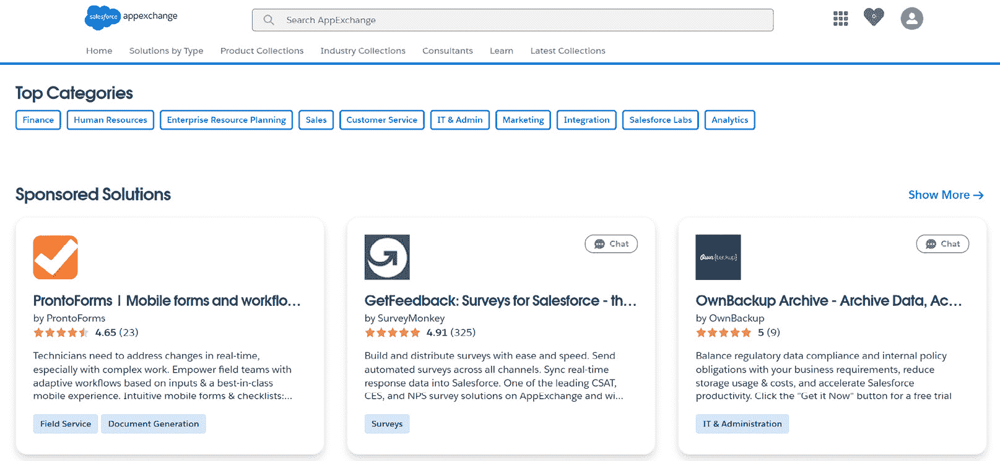
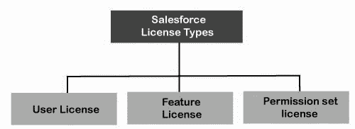
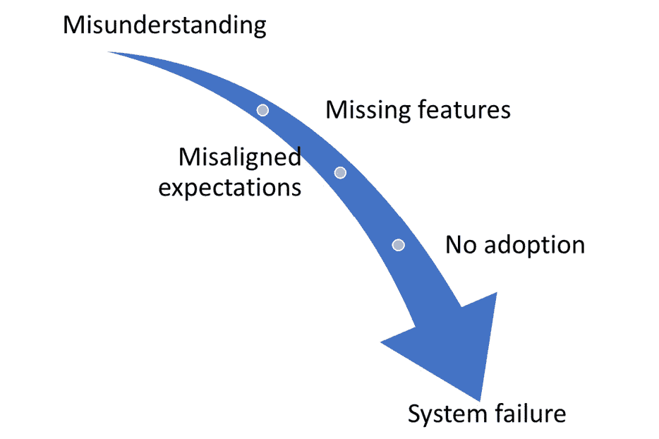
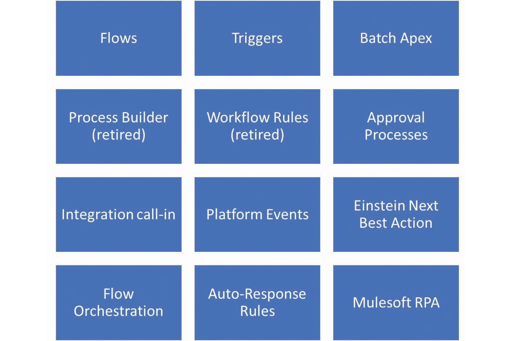
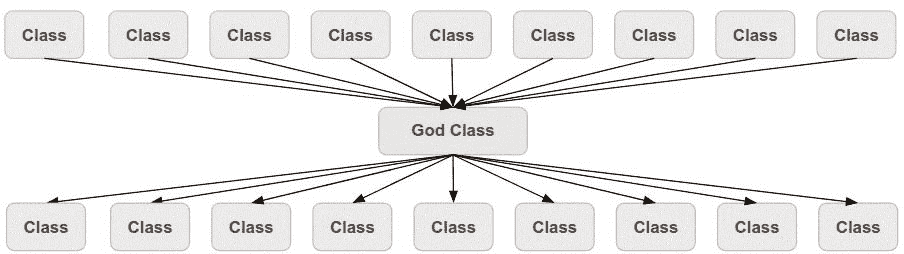
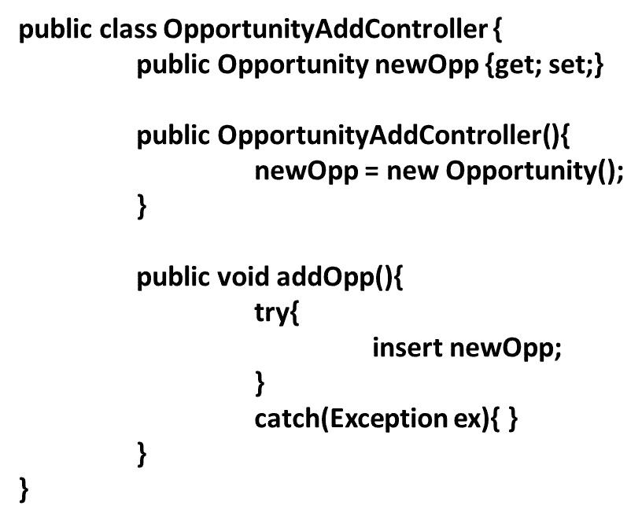

# 5

# 解决方案架构问题

本章将涵盖与你的解决方案架构相关的反模式。我们将从选择解决方案相关的反模式开始。然后，我们将探讨功能设计时可能出现的问题。第三，我们将探讨一些影响定制的特定反模式，首先是概念层面上的，然后是代码层面上的。我们将在本章的最后总结关键要点。

在本章中，我们将涵盖以下主要内容：

+   如何避免通过基于不良研究和分析选择错误的解决方案方法

+   为什么你的假设可能会误导你，使你的架构和设计走偏

+   在错误的方式下应用好的功能可能会出问题，如何通过良好的治理来克服这个问题

+   经典的代码反模式如何也会出现在 Salesforce 的实现中，以及你如何设计更有结构和模式的代码

完成本章后，你将对如何在 Salesforce 上设计解决方案时避免常见的反模式有一个很好的了解，并且知道可以采取哪些步骤来为合适的问题使用正确的解决方案。

# 选择错误的方案

本节将探讨解决方案选择中看似微小的决策如何对你的 Salesforce 实施产生深远的影响。我们将看两个与选择错误解决方案相关的反模式，这些反模式基于一些与技术无关的考虑。我们将首先探讨当你忽视更广泛的生态系统时会出现什么问题。

## 忽视生态系统

*故意忽视第三方选项而偏向内部解决方案可能会变成反模式。*

### 示例

SafeCo 是一家大型保险公司，为大众消费者市场提供各种保险产品。它拥有一个庞大的客户服务组织，目前正在最后阶段推出 Salesforce Service Cloud，以实现对客户咨询的 360 度全景视图。

Royce 是 SafeCo 公司 IT 部门的经理，曾间接参与过 Service Cloud 项目。然而，现在，他被指派领导一个团队，该团队的任务是找到几个新出现的通用需求的合适解决方案，这些需求在项目初期的范围之外，如下所示：

+   首先，SafeCo 在进一步了解 Salesforce 后，决定需要一个备份解决方案，因为他们不想仅仅依赖有限的开箱即用功能

+   其次，虽然政策文件是由**业务线**（**LOB**）系统生成的，但相关方已经发现有必要直接从 Salesforce UI 打印几封标准客户信件。

+   最后，在 IT 部门中，有几个人询问是否可以在 Salesforce 上使用项目管理工具，因为他们认为这将是与业务用户协作的一个好平台。

Royce 开始着手解决最紧迫的备份问题。他大致知道在 AppExchange 上有几种解决方案可以解决这个问题，但在简要查看之后，他发现它们太贵且过于复杂。而且，SafeCo 已经为其他系统建立了备份基础设施。Royce 请 IT 部门的开发人员写了一个脚本，将 Salesforce 对象一对一地复制到**结构化查询语言**（**SQL**）数据库中，方法是将它们导出为 CSV 文件，然后使用标准批处理过程进行导入。然后，可以使用 SafeCo 的标准备份解决方案对数据进行备份。

文档生成是另一个 Royce 知道有多个第三方解决方案存在的领域。然而，企业的**文档管理系统**（**DMS**）也有一些内部的文档生成能力，这正是他开始关注的地方。虽然解决方案并不完美，但 DMS 团队可以通过接受一个 web 服务请求来提供该能力，该请求将被放入队列中，而队列会定期被一个批处理作业清空，生成文档并将其放入文件共享中。然后，另一个作业会取出这些文档并将其上传回 Salesforce。这个过程稍显缓慢且笨拙，但应该还可以。

对于项目管理模块，Royce 运气不错。在一个周末，他的团队中的一名成员整理出一个小应用程序，似乎展示了 SafeCo 所需要的许多功能。他估计在几周内，他可以开发出足够好的东西，足以推广到业务中。Royce 赢得了这一小胜，并决定采用它。

现在，Royce 已经有了解决方案，他督促团队加快进度，确保按时完成全球服务的上线。然而，尽管没有出现灾难性的故障，但仍然有不少问题需要应对。备份脚本工作正常，但在新环境和部分环境中进行完整和部分恢复测试时，他们遇到了一个巨大的、意料之外的复杂性。他们放弃了**业务连续性**（**BC**）测试，并计划稍后开发一些更复杂的恢复脚本。

如预期所示，关于文档生成速度慢有一些抱怨，但最严重的问题是模板管理，这一点 Royce 在分析时并未详细考虑。事实证明，模板变动频繁，而在新方案中，所有模板的更改必须由 DMS 团队中的某人来完成，这让客户服务团队感到相当恼火。

项目管理应用程序顺利推出，没有出现重大问题，但反响平淡。出现了几处漏洞和误解，总体来说，团队原本期待的几个功能并没有包含在内。因此，各团队的采用情况不太理想。

Royce 深吸一口气。尽管一切大致正常，但存在很多问题。Royce 想知道自己是否在过程中错过了什么，但现在是时候结束这个项目，继续前进了。

### 问题

在*忽视生态系统*部分中解决的问题是如何处理与实施主要需求相关的常见功能，但这些功能不完全是核心需求的一部分。这些功能包括常见的备份和恢复、文档管理和生成、自动化部署流水线、将日志发送到中央日志服务器以及一系列类似的需求。

对于这种类型的需求（以及许多其他需求），AppExchange 上存在大量第三方解决方案，它们通用地解决了这个特定的需求，如下图所示。此外，许多 Salesforce 咨询合作伙伴也有标准方法，其中包括使用加速器或内部资产，这些也能帮助解决此类需求：

图 5.1 – AppExchange 的顶级类别部分

使用这种反模式，你可以忽略这些选项，甚至不认真考虑它们。

### 提议的解决方案

当你忽视生态系统时，你主动忽略了通用需求的第三方选项，而是继续采用定制或内部解决方案来处理常见功能。尽管对于通用需求采用定制答案是有正当理由的——例如，如果你拥有某项功能的高度开发基础设施，想要在所有企业系统中使用它——但如果不与现有的商业选项进行理性比较，这就是一种反模式，并且违背了 Salesforce 的核心理念。

也就是说，当你没有为重要但通用的功能做出经过深思熟虑的构建与购买决策，而是本能地选择内部解决方案时，就会出现反模式——无论是因为“这里没发明”症候群，还是因为这样对组织的关键利益相关者来说更容易处理。当用户熟悉其他平台并希望你在 Salesforce 上重建其功能时，这种情况也经常发生。

再次强调，这并不是说在这些能力上构建的方法永远无效。但根据我的经验，你很可能低估这些构建所涉及的复杂性和持续成本，并且最终可能会得到更少的功能，却花费比业务案例中预期的更多的钱。

### 结果

忽视生态系统的结果通常是可以预测的。然而，在详细层面，它们会根据所考虑的能力有所不同。然而，在更高的抽象层次上，它们往往如下所示：

+   一个功能较弱的解决方案，它满足的需求比你在生态系统中以类似成本能获得的要少。

+   随着时间的推移，增加到该功能的新特性越来越少，且其维护成本往往高于第三方解决方案的常规成本。

+   需要为开发和维护内部能力而维持额外的技能和知识储备。

+   新功能与现有系统之间的耦合度比使用第三方解决方案时要高。

+   成本情况可能复杂，但自己构建一个通用能力通常不会带来显著的节省。

总的来说，结果很少是灾难性的，但通常，最终的解决方案比第三方的同类产品更差，而且是以更大的痛苦和风险达成的。

### 更好的解决方案

有一个普遍的建议需要记住，以避免这种反模式，尽管实施它可能是一个挑战，那就是在遇到相对常见的功能需求时，做出经过深思熟虑且有充分理由的“构建与购买”决策。

对 AppExchange 解决方案的更全面评估对于像 SafeCo 这样的组织至关重要。通过仔细评估各种选项，公司可以发现不仅符合其独特需求的工具，还能提供额外功能和持续支持。这种积极的方式可以在长远来看节省大量时间和资源，确保所选解决方案有效促进业务增长和运营效率。

为此，你应该做以下几点：

+   仔细探索生态系统的替代方案，包括在 AppExchange 上的选项以及来自 Salesforce 合作伙伴的直接解决方案。

+   积极与供应商互动；他们通常比你想象的更愿意考虑你的独特问题。

+   详细列出潜在选项，以便做出有根据的决策，记得包括架构、运营和商业考虑因素。

+   在列出内部选项时，计算**总拥有成本**（**TCO**）。在这类比较中，运营、维护和进一步开发成本通常被低估。

+   与第三方供应商进行艰难的商业谈判——你通常能获得相当可观的折扣。定期进行**生态系统审计**，保持对新 AppExchange 产品的了解，以替代或增强自定义解决方案，可能减少技术债务。此外，定期审查现有解决方案，寻找优化机会，并能够集成与业务需求相符的新工具。

在审视忽视生态系统的后果后，让我们考虑将解决方案与许可相适配，而不是将许可与解决方案相适配的后果。

## 基于许可的解决方案

*基于你能够负担的许可集而非真正需要的许可集来创建解决方案，而不做出* *必要的妥协*。

### 示例

Alexis 是 Salesforce 一家主要合作伙伴的首席架构师，直接与 Salesforce 合作，处理位于中等规模的欧洲国家 Ruritania 的社会福利部的一个项目。该部门为数百万居民提供服务，拥有几千名社会工作者，分布在总部和几百个地方办事处之间，大约是 50/50 的比例。他们正在将 Salesforce 作为案件管理平台，用于一个旨在帮助因生活成本不断上升而受困的家庭的新高调倡议。

作为协议的一部分，Salesforce 的**客户代表**（**AE**）强烈推动了一种许可模式，使得总部用户可以拥有完整的 Salesforce 许可证，而地方办事处的用户仅拥有 Customer Community Plus 许可证。他认为，由于地方办事处的工作人员技术上是当地政府的成员，根据 Salesforce 的许可条款，这种方式是可以接受的，并且能够为客户提供更为可接受的许可证费用。

Alexis 迅速指出的一个含义是，社会工作者将基于社区在两个不同的界面中工作，一个是内部界面，一个是外部界面。然而，AE 认为这些差异很小，大部分为内部界面所做的工作可以直接在社区中复制。

虽然一般来说这是正确的，但随着工作持续进行，许多微妙的差异开始产生影响。系统中客户社区 Plus 用户能够访问的内容有所不同，此外，在 Lightning 页面和社区页面上可以显示的内容以及如何显示也存在差异。

这种情况迫使越来越多的功能被转移到自定义代码中，特别是转移到一系列小型**Lightning Web Components**（**LWC**）中，以适应这两个界面。此外，所有测试用例需要编写并执行两遍，每个界面各一次，这增加了相当大的工作量。

在应用程序推出时，他们还需要创建两个版本的文档、培训材料和实际的用户培训。Alexis 还指出，她的公司将需要提高应用程序的维护费用，因为维护的自定义功能更多，而且未来的许多更改都需要在两个版本中进行。

用户总体上对新应用程序感到满意，但由于地方办事处和总部之间界面的差异，很多沟通错误和失误发生。社会福利部的财务主管也对实施成本和应用程序维护费用的增加感到不满，他认为这并未完全通过较低的许可证费用得到补偿。

### 问题

基于许可证的解决方案解决的问题是一个老生常谈的问题：如何在我们给定的成本范围内交付所有必需的功能？如果你从未经历过将用户需求与预算紧张的情况相匹配的挣扎，我想知道你在哪里工作，我好去应聘。

几乎普遍适用的是，利益相关者希望拥有更多的功能，但他们的预算却不足以购买这些功能。为了解决这个问题，一种方法是尽可能优化购买的许可证，以获得最佳的性价比。这被称为许可证优化，是 Salesforce 平台上的一项基本技能。以下是 Salesforce 许可证模型的概览：

图 5.2 – Salesforce 许可证模型

基于许可证的解决方案通过明确哪些许可证是可负担的，并将解决方案的其他部分强行调整以使其适应，反而将这一可取的做法变成了反模式。

### 提议的解决方案

基于许可证的解决方案提议通过使用变通方法和自定义功能来填补所需许可证类型与可负担许可证类型之间的差距，从而为给定的一组需求创造一个可负担的许可证组合。这意味着，当存在一个标准的许可证类型可以满足用户需求时，你却选择采用一个定制或部分定制的解决方案，试图在你拥有的许可证功能和你希望拥有的许可证功能之间架起桥梁。

这里是一些常见的示例：

+   为内部用户使用社区许可证——虽然这些用户外部足够，不至于明显违反条款——如果不是因为价格过高，他们理想情况下会使用内部 UI

+   使用影像对象来复制未涵盖的标准对象——例如，拥有一个影像案例对象，通过双向复制 Case 中的信息，以便内部案例工作人员能够使用更便宜的平台许可证

+   复制行业云中的关键功能——例如，行动计划——因为不愿意采用额外的许可证

+   在具有相同组织角色的不同用户之间共享许可证，规避条款和安全性。

+   对某些功能使用更便宜的解决方案——例如，使用 WordPress 网站代替社区来节省许可证费用，然后在网站和 Salesforce 之间同步数据

虽然这些做法在商业上可能有其合理性，但从技术角度来看，它们无疑是适应不良的。

### 结果

结果可能会根据具体的使用案例有所不同，但通常包括以下几种情况：

+   需要更多的自定义工作以弥补许可证功能的不足

+   为了使不同部分合理地融合在一起，解决方案的整体复杂性增加

+   由于定制工作增加和整体复杂性增加，未来的维护工作会更多。

+   由于你需要考虑增加的定制工作，未来功能升级的价值会减少。

+   由于共享许可或重用单一许可处理多个功能，安全性可能降低。

因为实施解决变通方案和定制解决方案来绕过许可限制，可能会带来增加的技术债务。这些做法可能导致显著的长期维护成本，因为它们通常需要额外的资源来管理和支持，进一步增加了技术复杂性。

这可能会让你处于一个与 Salesforce 的灰色地带，因为许可协议对外行人来说不容易理解，而且 Salesforce 在如何执行条款方面并不透明，特别是在存在相当模糊的情况下。

话虽如此，从 TCO（总拥有成本）角度来看，有时确实是你最好选择不购买许可，而是做定制工作。Salesforce 的许可费用昂贵，如果你只需要功能许可中包含的一小部分内容，你可能能够以较低的价格重新构建它。

然而，我的建议是尽可能避免这样做，而是寻求替代选项，正如我们将在下一节中讨论的那样。

### 更好的解决方案

通常情况下，你最好是尝试与 Salesforce 谈判获得更好的交易，寻找第三方解决方案来满足你所需的特定功能，或者重新设计解决方案，避免使用你需要的特定功能，方法是改变范围或重新定义谁需要哪个功能许可。

让我们逐一看这些：

+   当面临无法负担的许可费用时，你的首选应该是更加强硬地推动你的 Salesforce 客户经理。他们通常有相当大的灵活性可以提供折扣，尤其是当我们讨论的是新类型的许可，或者你愿意承诺在交易中更长的周期时。在 Salesforce 财务季度结束前推动谈判也会有所帮助。

+   第二，你应该考虑第三方解决方案。你可以查看 AppExchange，看看是否有价格更低的产品满足你的需求，或者你可以询问你的实施伙伴是否有可用的资产可以利用。

+   第三，你可以返回公司，请他们重新优先排序功能，以便你可以削减其他内容以腾出空间来支付许可费用，或者删除需要额外许可的功能。

+   第四，你可以返回并进行另一轮许可优化，详细审查拟议的许可，并查看你能在哪里为特定用户减少特定许可。通常，某些许可对某些用户来说是必须的，但对其他用户则只是可选的。

如果你找不到好的解决方案，必须按照这种反模式进行，务必意识到其中涉及的实际成本和风险。话虽如此，让我们继续讨论下一个反模式：*假设驱动的定制*。

# 错误地应用方案

在本节中，我们将考虑两种反模式，这些反模式基于我们带到桌面上的假设失败，导致了不满意的解决方案。这些假设可能是关于用户需求或我们技术的能力——这两者都可能导致问题。

## 假设驱动的定制化

让一个小而不具代表性的群体的假设来代替更广泛用户群体的需求。

### 示例

Helene 是 LifeCo 一项新计划的产品负责人，负责推出 Health Cloud，这是 LifeCo 一家主要的慢性病监测医疗设备供应商。除了 Health Cloud 的推广外，LifeCo 还在开发一款定制的护理应用程序，主要供**卫生保健专业人员**（**HCPs**）使用，尤其是为 LifeCo 护理项目提供服务的诊所中的护士使用。

Helene 曾是一名护士，后来转入 IT 领域，并且曾担任过几款主要 IT 产品的**主题专家**（**SME**）。因此，她认为自己对需求有很强的理解，并且有几位仍在当护士的朋友，作为她的反馈渠道。

在经过一些内部讨论后，Helene 决定将应用程序交付为一种优化了平板电脑使用的应用程序，因为她知道平板电脑在诊所中很常见。这将允许卫生保健专业人员在与患者互动时记录与护理项目相关的信息。

团队开发了一个既具有吸引力又功能强大的平板应用程序，满足了 Helene 确定的所有关键需求。在与友好的用户群体进行初步测试时，该应用程序受到了高度评价，大家都期待着正式推广。

然而，当他们开始计划推广时，许多诊所却反对并拒绝实施新的应用程序。经过调查，问题的根源在于，尽管许多诊所的工作人员有平板设备可用，但他们不愿意直接在与患者互动时使用它们，因为他们觉得这会妨碍互动。

对于其他卫生保健专业人员（HCPs）来说，在与患者的互动中直接录入数据与他们长期以来的做法相违背——他们习惯于白天用纸质笔记收集信息，然后在下班后通过 PC 录入系统，这些 PC 的界面经过高度优化，便于快速录入数据。这些卫生保健专业人员觉得转用新系统会让他们花更多时间在数据录入上，从而减少与患者接触的时间。

Helene 有一长串反驳意见，来回应卫生保健专业人员提出的担忧，她坚信通过适当的培训和流程变更，最终用户将会看到新应用程序如何显著改善他们的工作实践。然而，她遇到了一个不幸的事实：拒绝采用新应用程序的诊所都不是 LifeCo 直接拥有的，所以无法强制它们进行改变。

这对 LifeCo 来说是一个重大问题，因为这意味着他们必须保持旧的护理项目管理系统运行，并且将同时使用两个不同的护理信息数据库，这会导致严重的整合问题。Helene 被迫寻找一个快速的解决方案，以满足那些拒绝使用的诊所。

解决方案与实际用户需求之间的这种不对齐，不仅影响了采用率，还导致了生产力的显著下降。用户在挣扎于操作一个不适合的系统时，采取了寻找变通方法的方式来完成任务，但这些替代方法却在数据管理中引入了不一致性和错误。因此，依赖于非正式流程降低了数据的完整性和可靠性，进一步复杂化了决策过程，并损害了整体组织的效率。

最终，她不得不妥协。她和团队一起坐下来，看看能做些什么，以创建一个可以在 PC 上使用的应用程序版本。他们迅速移植了关键功能，并发布了一个简化版本给那些拒绝接受平板应用程序的诊所。虽然反应冷淡，但至少这次没有人拒绝使用它。

### 问题

基于假设的定制化的问题在于，它比它试图解决的问题要少——理论上它可以是任何东西——更多的是关于你尝试解决问题的方式。通过基于假设的定制化，你是在尝试解决一个由产品管理、产品负责人或开发人员定义的问题。

然而，事实证明，你需要解决的真正问题完全不同。换句话说，基于假设的定制化问题在于，你无意中在试图解决错误的问题。

这与仅仅要求错误不同，因为它可能发生在遵循良好流程的优秀团队中。所需要的只是你所使用的样本在某种程度上系统性地偏离了真实的用户群体，就像我们在示例中所看到的那样。

### 提议的解决方案

提出的基于假设的定制化解决方案是让一群专家代替更广泛的用户群体，以促进所构建解决方案的快速交付。这是一个完全合理的方法。我们在大多数事情上都让专家引导我们，而且通常情况下，这样做效果非常好。

只有当你的代表性专家与真实的用户群体相比，出于某种原因，存在系统性的偏见时，事情才会出错——例如，有人曾经在某个职能部门工作，但现在已经脱离了日常现实，或者某人早些时候转行做了 IT，现如今已经从 IT 的角度来看待问题。

请注意，有时候，你可能会推出一些并不是用户群体所期望或要求的东西，以推动变革。这是一个完全不同的情形，关键在于你如何进行变更管理。然而，如果你无意中且未意识到这样做，那么你就是在使用反模式。

### 结果

假设驱动的定制化结果取决于与用户需求和期望的契合度：

+   在规模的一端，你有一组基本无害的误解，这些误解可以通过善意、培训和一系列替代方案来修复。

+   如果这样还不够，你可能需要添加或重新设计一些有限的功能，以让用户在新系统上能够愉快地工作。这仍然是相对可控的。

+   然而，有时你会遇到一个阶段，用户完全拒绝采用新系统，即使进行了大量修改。

+   此时，你有两个选择：要么强行推进并应对来自用户群体的反弹，要么放弃这个工具，回到旧的方式。

以下图表提供了结果规模的可视化表示：

图 5.3 —— 假设驱动的定制化结果恶化的规模

因此，这种反模式的后果虽然通常是轻微的，但也可能是灾难性的，你应该花时间注意避免它。

### 更好的解决方案

这是一个难以防范的模式，因为它发生在我们信任的代表用户群体的人在某些重要方面未能代表这些用户时。必须向产品经理或产品负责人提出这些问题时，可能会非常不舒服，他们通常对自己的立场非常有信心，公平地说，大多数情况下，他们会是对的。

然而，一些机制可以帮助解决这个问题：

+   与用户群体的更广泛咨询——例如，通过大型活动或共同的在线论坛。

+   来自更广泛用户群体的早期反馈。路演、演示视频和网络研讨会是不错的选择。

+   来自更大用户群体的逐步验收测试。

+   如果你希望创造深远的变革，要做好规划，并包括必要的变更管理。永远不要试图偷偷进行重大变更。

这就结束了我们对这种反模式的讨论。现在，让我们看看一个真正经典的例子：黄金锤。

## 黄金锤

黄金锤犯下的根本错误是把一个在某些使用场景下是好解决方案的工具，错误地当作适用于所有使用场景的工具。

### 示例

WheelCo 是一家大型轮胎制造商，特别专注于运输行业。它正在推出以制造云为核心的 Salesforce，以紧密连接其制造和销售流程。

根据与 Salesforce 达成的协议，WheelCo 获得了无限制使用 OmniStudio 的权限，并参与了与产品能力相关的多次培训和加速器。因此，WheelCo 的架构师、开发人员和业务用户都对 OmniStudio 能为他们的业务带来的价值感到非常兴奋。

在最初的架构讨论中，决定将整个解决方案建立在 OmniStudio 工具集上，包括所有 UI 过程（无论是内部的还是外部的）、集成和任何可以合理使用 OmniStudio 的附属流程。只有批处理和异步流程被排除在范围之外。通过这种方式，WheelCo 认为可以最大化从 Salesforce 购买中获得的价值。

项目启动后，在许多领域取得了快速进展。为了保持一致性，大多数标准用户界面（UI）部分被忽略，FlexCards 和 OmniScripts 几乎构成了整个**用户体验**（**UX**）。集成是通过集成流程开发的，除了少数在后台运行的集成。

开发的工作量远大于最初预期，但通过增加足够的资源，WheelCo 仍然设法按时完成了实施。尽管在寻找足够多具有所需 OmniStudio 经验的合格资源方面遇到了一些困难，但通过支付高薪，WheelCo 设法为项目招募到足够的人才，确保了项目的成功。

总体而言，上线是成功的，尽管有人抱怨并不是所有承诺的功能都已包括在发布版本中。在开发过程中，若干关键功能不得不被删减，以确保按时发布。

在接下来的年度中，解决方案开始显现出一些问题。集成的灵活性没有预期的那么高，无法适应业务希望添加的所有不同用例。另一个问题是 Salesforce 平台上的新功能发布。每当添加新的功能时，都需要对 OmniScripts、FlexCards 和有时是支持代码进行修改，才能使其对用户可用。

支持该解决方案的成本也很高。任何变更都需要高级技术人员的干预，这减少了平台的灵活性。在 WheelCo 内部，许多人开始质疑 OmniStudio 是否是满足项目中所有需求的正确解决方案。

这一点尤其适用，因为一些排除在 OmniStudio 工作之外的原生制造云功能似乎在没有任何人为干预的情况下迅速得到改善。

大约一年后，WheelCo 的首席技术官（CTO）任命了一位新的首席架构师，他将 Salesforce 平台的架构作为早期的优先事项之一进行审视。他发现大量定制化导致的高复杂性是成本和功能问题的主要根源。为了解决这一问题，他建议重构解决方案，使其采用更加标准化的用户界面，保留 OmniStudio 用于复杂的多步骤流程和需要特定数据视图及相关操作能够创造真正价值的领域，并在其他地方去除该功能。

### 问题

黄金锤子解决一切问题——这就是黄金锤子的特性。一旦你找到了黄金锤子，遇到的每个问题都会变得合适。没有对目标适配性的评估，因为黄金锤子就是解决方案。

技术行业通常很容易陷入黄金锤子陷阱。我们总是在寻找下一个酷炫的技术来解决我们的难题。Salesforce 以其激进的销售方式和 Kool-Aid 喝水般的社区，可能比大多数技术平台更容易陷入这一反模式。

请注意，黄金锤子通常在其解决方案空间内是技术上非常优秀的，但由于热情、炒作和兴奋，它们往往被拉得超出了这个空间。

### 提议的解决方案

黄金锤子提出的解决方案就是黄金锤子——无论问题是什么，无论问题的参数如何，它们都会被扭曲成黄金锤子可以解决的某种形式，或者黄金锤子会被扭曲成能够解决问题的某种形式。

如果必须选择，最好是将问题调整为适应不合适工具的形态，而不是将不适合的工具应用于问题。但无论哪种选择，都不是特别理想的。

检查是否受到黄金锤子影响的一个好方法是，查看你对新技术功能的讨论是否以寻找你的技术栈可以解决的问题开始，还是从问题入手然后寻找合适的技术栈。如果是前者，你需要小心，因为你可能已经拿到了一把黄金锤子。

### 结果

黄金锤子的结果取决于你所参与的技术适配不良的程度：

+   至少，你最终会发现与你本应满足的需求存在差距，因为黄金锤子未能解决某些问题，因为它不是为解决这些问题而设计的

+   随着黄金锤子被不断延伸超出其能力范围，成本和定制工作将增加

+   由于过度延伸的解决方案所产生的额外维护工作和由此带来的成本

+   即使黄金锤子确实是一个合适的解决方案，也会导致组织对黄金锤子的真实能力失去信心

+   在你企业的不同领域中，保持一个专门的技能集是必要的，即使当某个工具不再流行或趋势过时时，这种技能集仍然会持续存在。

总的来说，结果将取决于你在多大程度上拉伸了工具的能力，但在你还没有搞清楚问题之前就选择工具，往往是一个反模式。

### 更好的解决方案

建筑师在采纳新工具和技术方面的态度各不相同。根据我的经验，Salesforce 的架构师在采用新技术时相当积极，只要它们是在平台上。因此，当我说我的一般建议是对采纳最新的工具集保持相当保守的态度时，尤其是在 Salesforce 上，我可能会显得有些固执。

在 Salesforce 生态系统中，我们不断受到新功能、新工具集和新做事方式的轰炸。虽然这是好事，但改变一个过去对你有效且继续为你的组织带来价值的方法，应该在仔细考虑之后进行，而不是因为 Salesforce 刚刚发布了一个闪亮的新玩具。

实施定期审查你的技术栈的过程。这有助于确保你为每个任务使用最合适的工具，并允许你逐步淘汰过时或低效的解决方案。以试用的方式接触新工具集，选择有限的业务使用案例来收集见解并评估它们的价值。如果一个工具提供了真正的价值，可以考虑在整个组织中推广；如果它没有提供价值，无论它多么有吸引力，都应该停止使用。

# 工程溢出

本节中的两个反模式都代表了技术治理的失败，结果是将过多的工程工作投入到单一组件中，而没有应用适当的设计模式和实践来缓解这种情况。

## 自动化盛宴

*自动化盛宴是指当你没有对关键对象上的自动化使用进行治理时所发生的情况。*

### 示例

DrinksCo 是 Salesforce 平台的长期用户，使用它进行销售和客户服务，同时在 Marketing Cloud 上有着庞大而复杂的使用足迹。虽然整个系统中有多个组织正在使用，但有一个主要的组织管理着 Salesforce 使用的核心流程。

虽然这个组织已经有一段时间稍微有些吃力，但现在情况已经到了一个点，DrinksCo 的用户开始提出严重的投诉。像 Opportunity 和 Account 这样的关键对象上的记录保存时间，有时可能以分钟为单位来衡量。偶尔，记录会直接无法保存，显示一个模糊的技术错误信息。更糟糕的是，包含关于新潜在客户和机会的重要信息的同步作业，有时会随机失败，而且没有给出明确的原因。

Francesca 是一家精品 Salesforce 合作伙伴的 Salesforce 顾问。她受邀分析情况，并提出对组织的改进建议，理想情况下解决问题的根本原因，但至少能够迅速减少症状。

在一周的组织审查后，她不再怀疑：问题是由大量复杂的自动化在关键对象上相互作用引起的。例如，在 Opportunity 上，经过多年的演变，自动化形成了多个深层次的层次，合起来导致了严重的问题。

这包括一个大型复杂的 Apex 触发器，两个来自托管包的额外触发器，一些工作流规则，三个尚未迁移到 Flow 的流程构建器，一个前记录触发流，一个后记录触发流，几个操作该对象的批处理作业，以及多个直接使用本地 API 和自定义 Web 服务来操作 Opportunity 对象记录的集成。

Francesca 深吸一口气，开始有条不紊地绘制出不同事件序列的发生顺序，这些序列取决于 Opportunity 记录及其更新。她通过系统地跟随执行顺序，查看不同自动化之间是否可能存在不希望出现的相互作用效应。

经过一段时间，她得出结论，这些事件序列出错的方式太多，当前模型无法承受。如果不大幅减少自动化的复杂性，这个问题是无法解决的。

因此，她制定了一个重构计划，相信它能够有效缓解 Opportunity 对象最严重的症状，尽管可能无法完全消除问题。如果在 Opportunity 对象上成功，类似的计划将会应用于核心组织中的其他关键对象。

计划包括将流程构建器和一些工作流规则移入两个流中，合并集成使得只有一个集成定期处理 Opportunity 的导入，简化 Apex 触发器，并去掉那些已经不再严格需要的托管包。

该计划的实施远比最初预期的要长——需要考虑的因素太多，无法按计划进行。但最终，用户开始报告在使用 Opportunity 时的体验有所改善。旧的随机错误不再发生。尽管保存仍然比他们希望的慢，但已不再慢到成为严重问题。

在短暂享受成功之后，Francesca 深吸一口气，开始处理组织中其他关键对象的相关事务。

### 问题

自动化盛宴试图解决的问题是如何在 Salesforce 上创建自动化时适应不同的架构风格或偏好。当多个团队在不同项目中同时处理相同的对象，且通常来自不同的实施合作伙伴时，这几乎是不可避免的。

随着组织的成长，相互作用的自动化的复杂性可能呈指数级增加。不同的团队可能对自动化其特定需求有不同的处理方法，但这可能导致混乱和低效。因此，至关重要的是从一开始就建立清晰的自动化策略，以有效管理这些复杂性。

这时，你需要一种方法来指导架构随时间的发展，以保持一致性。如果你未能做到这一点，可能会陷入自动化盛宴。

### 提出的解决方案

自动化盛宴应对了多样化的自动化选项，其中一些选项在以下截图中展示，并且通过支持多样性，回应了自动化方法的多样性。这意味着团队可以选择最适合的孤立方法：

图 5.4 – 一些 Salesforce 自动化选项

这减少了团队之间的协调要求，通常不会导致短期问题。因此，发现问题或产生问题可能相当困难，直到事情已经出错。

### 结果

自动化盛宴的负面后果可能丰富多样。以下是一些经常发生的情况：

+   关键记录页面的性能下降——有时，保存操作可能需要很长时间才能完成

+   集成调用失败，特别是当这些调用以批量或批量方式更新记录时

+   批量作业或导入作业失败

+   在 UI 中发生奇怪、不可预测的错误，通常与保存或更新事件相关

+   调试平台上出现的问题时的困难，因为自动化的交互效应掩盖了整体情况。

总体来说，如果你陷入严重的自动化盛宴情境，可能会让事情一团糟。更糟糕的是，这种情况通常最先发生在你最珍贵的对象上，因为这些对象在各个项目中使用得最多。

### 更好的解决方案

避免自动化盛宴反模式的关键是对核心对象及其自动化进行良好的架构治理。为此需要注意的一些事项在此展示：

+   你应该从定义你希望在组织中使用的自动化类型以及对应的使用场景开始。

+   理想情况下，你希望每个对象的数量尽可能接近 1。选择流程或触发器作为首选自动化类型，并坚持使用它。

+   混合使用 Apex 和流程是可能的，但这需要仔细的规划和一个好的框架。

+   如果你使用流程作为主要机制，应该通过操作调用 Apex，而不是创建触发器，除非出于性能原因不得不这样做。

+   确保你有一个框架，帮助架构师使用流程。这个框架应包括使用子流程来保持灵活性。要有解耦的自动化流程，便于在出现问题时进行故障排查，而不是拥有一个包含所有业务逻辑的大型单体流程，后者通常紧密耦合且在长期维护上复杂且昂贵。

+   如果你使用触发器作为主要机制，可以使用一个触发器框架，例如 Apex Trigger Actions（[`github.com/mitchspano/apex-trigger-actions-framework`](https://github.com/mitchspano/apex-trigger-actions-framework)），该框架使你能够在触发器执行时调用流程。

+   避免使用 Process Builder 和工作流规则，因为这些功能将被逐步淘汰。

+   批处理流程和传入集成需要小心设计，并且要考虑现有的自动化流程。记住，可以使用某些机制选择性地绕过某些流程的自动化，例如绕过标志。

+   注意管理包触发器和流程。你无法控制它们，但它们仍然可能通过与你的功能交互而导致问题。

一般来说，尽量保持自动化方法简单和统一，将为你的 Salesforce 组织带来可观的长期利益。话虽如此，让我们来看下一个反模式：过度复杂的组件。

## 过度复杂的组件

过度复杂的组件是指一个单一组件，它已经发展成了一个独立的应用程序，但没有足够的架构和设计来支持它。

### 示例

HealthyMindCo 是英国的心理健康服务经纪公司，正在 Salesforce 上实施一个新的案例管理解决方案。在这个解决方案中，案件工作者收集新客户的相关信息，并确定哪个实际的本地服务提供者最适合帮助他们。此外，他们还跟踪客户进行的咨询，以评估干预的有效性。

公司在系统应为潜在治疗选项和转诊可能性提供的推荐方面有非常特殊的要求，这些要求只能通过使用自定义代码来真正满足。由于 HealthyMindCo 倾向于简单且高度优化的用户体验，负责实施解决方案的项目负责人 Amir 决定使用一个 Lightning 组件，该组件可以融合创建新案例所需的逻辑。

最初的想法是该组件仅用于新案例。然而，在初步用户测试后，显然还需要添加更新功能。因为有太多情况下需要检查初步假设，这可能会导致治疗计划在不同情况下的不同结果。

添加了更新功能后，组件再次进行了用户测试，显而易见的是，组件还需要支持活动和活动模板的管理，因为这是治疗计划初始设置中的关键部分。团队努力将此功能添加到组件中，组件也开始变得像一个相当复杂的工程项目。

一旦活动和活动模板被添加到组件中，几个用户指出，将活动管理部分放入这个新的组件（现在已经被称为案件处理组件）并且不能在组件中跟踪这些活动的 SLA（服务水平协议）是没有意义的。这也意味着需要增加访问跟踪功能，因为这是管理 SLA 所必需的。

此时，Lightning 组件是 HealthyMindCo 员工使用的主要界面。由于这个原因，多个从其他系统获取信息的集成调用直接被添加到组件的代码中，因为反正这里是它最终会被使用的地方。

系统上线时并不轰动。存在很多 bug，尤其是在案件处理组件中。但凭借大量的善意和辛勤工作，团队逐渐将质量提升到一个足够可接受的水平，使得客户能够勉强使用它。

上线后，HealthyMindCo 不断在案件处理界面中发现新的 bug。它通常相当不稳定。此外，公司仍然希望在其中添加大量的新功能。然而，公司对其变更请求的报价并不满意。

Amir 向公司中的一些高级架构师咨询。他们评估了情况并告诉他，组件太大、过于单一且难以维护。他需要重构代码库，并从客户或内部获得资金来实施这一点。他尝试了，但似乎没有人特别愿意承担费用。

### 问题

通常，重量级组件是为了适应对定制用户体验（UX）的实际或感知需求，这种需求远远超出了 Salesforce 开箱即用工具所能提供的范围。请注意，在某些情况下，认为需要这种定制用户体验的看法可能比实际情况更为强烈。

来自旧系统的用户，习惯于在专门的应用程序中工作，或者他们的旧系统根据需求进行了大量定制，可能会认为在像 Salesforce 这样的平台上也需要进行类似的定制。某些用户可能对使用标准功能持有较大怀疑态度。毕竟，我们都喜欢认为自己所做的事情是特别的。

并不是说没有真正需要独特且高度定制的用户体验的情况，但根据我的经验，它们比很多人想象的要少。无论如何，重量级组件尝试提供这种体验的方式并不理想。

### 提议的解决方案

一个重量级组件提出在 Salesforce 内提供独特的用户体验，使用如 LWC 这样的开发框架来创建一个实际上是嵌入式的单体应用程序，驻留在平台上。这对于几个原因来说可能很有吸引力：

+   你可以完全控制单一组件内的用户体验和界面，允许你响应几乎任何用户需求

+   所有功能都被集成，架构简单易懂

+   所有内容都集中在一个地方，所有变更都可以在那里进行，从而减少了对工具和协调的需求

+   该组件仍然嵌入在标准的用户体验中，通过巧妙的样式使用，它甚至可能看起来像是标准配置的一部分

+   你可以在组件内调整用户体验，提供更多用户需要的内容

这个解决方案在一开始也往往看起来不那么危险，即使是对经验丰富的架构师和开发人员而言，因为我们讨论的仅仅是“另一个”LWC 组件。只有当该组件的真正范围被意识到时，它才会成为问题。

### 结果

尽管该组件仍然相对较小，你不会看到任何负面结果，当然，轻量级组件是大多数 Salesforce 架构中有用且架构上合适的元素。然而，随着组件的持续增长，它开始类似于一个独立的应用程序——一个基于代码的单体应用程序，存在于更大的应用程序中，但仍有自己的生命。

通常，这种情况是在一个本应完成相对简单任务的组件，意外地演变成一个功能的“万用”地点。通常发生这种情况是因为最初的组件非常成功，用户希望它做更多的事情。

这种演变的后果是熟悉的：

+   随着新组件变得过大和复杂，开发人员开始难以处理，质量开始下降，错误率增加

+   维护变得缓慢，错误修复和功能请求需要更长时间才能通过流程

+   只有某些开发人员能够处理重量级组件，因为它变得过于复杂，其他人无法处理

+   由于质量下降和功能过于拥挤，整体用户体验开始恶化

+   这个组件越来越难以与平台的其他部分集成，并且越来越被视为一个独立的应用程序

随着组件的规模和复杂性增加，测试变得越来越困难且耗时。这可能导致潜在的质量问题，影响系统的功能，并导致发布周期的延长，最终影响交付时间表和资源分配。

偶尔，这种模式可能会恶化到一种程度，导致最终形成“庞大的乱麻”——请参见 *第二章*。然而，即使没有发展到这种程度，你最终也需要进行大规模重构来解决这些问题。

### 更好的解决方案

鉴于重型组件的问题是你最终得到的是没有清晰架构的单体应用，应该不意外的是，你必须通过改进你即将交付的自定义功能的架构来解决这一反模式。

通常，这可以通过将较大的组件分解为一组更小、更易管理的部分，同时尽可能利用标准功能来实现。使用**事件驱动架构**（**EDA**），使得较小的组件通过发送和响应事件来进行通信，也会有所帮助。

此外，架构治理在这种反模式中起着关键作用。你应该为新组件设立评估和审批流程，同时也应定期安排人员检查被批准的自定义组件，因为它们往往会膨胀。

这并不意味着你需要进行正式的代码审计来检查每个人的工作，除非你的项目非常大，但你应该有架构师参与治理流程，并且了解你组织中任何自定义开发的细节。这将帮助你及早发现潜在问题。

接下来，我们将探讨两个以代码为重点的反模式，从神类开始。

# 代码乱作一团

本章中我们将讨论的最后两个反模式集中在代码中发生的反模式。虽然这些在 Salesforce 的世界中并不常见，但作为架构师，我们仍应意识到，我们的基于代码的解决方案必须遵循良好的实践，否则可能会陷入常见的反模式。

## 神类

神类是一个包含了应用程序定义的所有或大部分业务逻辑的单一类。

### 示例

ShoeCo 是一家生产世界上最受欢迎运动鞋品牌的公司，拥有一个复杂的多云 Salesforce 组织，用来运营其业务的关键部分。由于它有许多自定义需求，并且平台上有大量遗留系统，它有大量的 Apex 类来处理业务逻辑和集成。

它最近已经开始转向流程化，并且在实践中，大多数功能是代码和声明性功能的结合。随着时间的推移，ShoeCo 希望简化其 Salesforce 功能，并避免目前面临的一些问题。

特别是，ShoeCo 的许多架构师开始觉得组织已经失控，他们对在系统不同部分激活的逻辑没有清晰的概览。Salesforce 架构师之一 Pranit 提出，通过创建一个**CentralDispatch** Apex 类来简化当前的系统架构，这个类将负责将调用分发到其他代码或流程。

由于所有业务逻辑都通过**CentralDispatch**类进行，Pranit 认为，识别在哪些情况下调用了哪些代码将变得更加容易，从而实现更大的透明度、更低的维护成本和更大的代码重用潜力。

这一方法的一个关键哲学要求是，**CentralDispatch**类不应该包含任何逻辑。它仅仅负责将请求转发到正确的处理器。然而，这一哲学原则在实践中很快就被废除了。

为了使类按预期工作，越来越多决定在不同上下文中调用哪些内容的业务逻辑必须移到**CentralDispatch**类本身。这意味着实际功能的越来越多部分将存在于一个日益膨胀的类中。

虽然最初这引起了一些担忧，但 Pranit 和他的同事们接受了这一开发，因为相较于**CentralDispatch**类引入之前，他们仍然比以前拥有更好的可视性。直到开发人员开始抱怨该类太大，并且无法在没有各种系统部分出现未知副作用的情况下进行更改，他们才开始认真关注这个问题。

该类已经增长到超过 5000 行 Apex 代码，并且有效地协调了从 ShoeCo 组织内其他地方调用的所有逻辑。从某种程度上来说，它成了自身成功的牺牲品，但此时，大多数开发人员认为它更像是障碍而非助力。

Pranit 决定制定一个新的计划来重构**CentralDispatch**类，并使其恢复到原本精简的状态。他希望将所有复杂的逻辑移出，将它保留为一个调度中心，决定在特定上下文中调用哪些其他 Apex 代码或流程。

然而，在检查代码时，他发现，在许多情况下，无法在不包括大量逻辑的情况下进行请求转发。失望之下，他开始考虑是否需要从根本上改变这个方法。

### 问题

God 类反模式被用来将技术问题解决集中到一个应用中。从概念上讲，使用一个单一的模式在单一类中处理所有在自定义开发过程中出现的技术复杂性，比花费大量时间进行详细的架构和设计要容易得多。

你可以在下图中看到 God 类代码结构：

图 5.5 – God 类代码结构

你在 Salesforce 实现中不常看到这种反模式，但它对于为 AppExchange 构建的独立软件供应商（ISV）或任何在 Salesforce 平台上构建定制应用程序的组织来说，都是一个真正的危险。

### 提议的解决方案

上帝类是一个单一文件——通常在讨论 Salesforce 时是一个 Apex 类——它托管了一个复杂应用程序的所有或至少大部分关键业务逻辑。以这种方式集中功能似乎是一个不错的设计决策，因为它使得整体架构和设计相对可管理，甚至有一些模式，例如我们在前面的示例中使用的 Dispatcher 模式，在这种集中方式下也可以有效使用。

通常，随着应用程序的发展，你可能开始失去大局。这在小应用程序逐渐演变成大型应用程序时尤为明显。你可能在最初并没有强烈的架构设计，因为它最初只是一个可以快速构建的小应用程序。

在这种情况下，集中管理代码库可以成为管理应用程序并重新掌控局面的一个方法。或者，你可能只是出于方便将所有逻辑放在一个地方，并且没有注意到该类已经扩展到几千行代码。

然而，正如所有功能进化管理不善的情况一样，最终你会为此付出代价。

### 结果

在本书的这个阶段，你应该能够预测由不当管理的应用程序增长导致的反模式的负面后果。我们已经看到了一些这样的模式，从重量级组件到“大球泥”，上帝类也共享了我们所期待的许多负面后果：

+   代码变得难以理解，导致更长的维护周期、更慢的新开发速度以及更高的错误率

+   只有某些程序员可能能够处理上帝类，以避免不幸的副作用

+   代码库中的所有更改，无论在任何地方，都需要对上帝类进行相应的更改

+   上帝类与系统其他部分之间经常发生奇怪的交互效应，导致难以调试的错误

+   该类在应用程序中呈现出**单点故障**（**SPOF**），如果它失败了，其他任何逻辑都无法被处理

总的来说，你最终会得到一个脆弱、易碎且有些杂乱无章的应用程序。

### 更好的解决方案

在 Salesforce 上构建自定义解决方案时，你通常会使用 Apex，这是一种与 Java 密切相关的**面向对象**（**OO**）语言。这意味着，如果你打算在该平台上构建任何复杂的应用程序，你应该遵循良好的**面向对象分析与设计**（**OOAD**）实践。虽然本书的范围远远不包括教学 OOAD，但一个很好的入门点是学习 SOLID 原则。

**SOLID** 原则是一组在设计软件时可以使用的指导方针，以使软件更易理解、维护和扩展。这个首字母缩略词代表了 **单一职责**，**开放封闭**，**里氏替换**，**接口隔离** 和 **依赖注入**（**DI**）。让我们简要了解一下它们：

+   **单一职责原则**（**SRP**）是指一个类或模块应该只有一个且仅有一个原因发生变化。这个原则通常与 **开放封闭** **原则**（**OCP**）一起使用。

+   开放封闭原则（OCP）指出，软件应该对扩展开放，但对修改封闭。这意味着应该通过扩展现有代码来添加新功能，而不是修改它。

+   里氏替换是 **面向对象编程**（**OOP**）中的一个原则，指出一个超类的对象应该能够被其子类的对象替代，而不需要改变程序的功能。

+   接口隔离是将单一接口分割成多个更小接口的过程。这可以出于多种原因，例如增加系统的模块化或减少接口的复杂性。

+   依赖注入（DI）是一种实现对象与其依赖关系之间松耦合的技术。它通过提供组件所需的依赖关系，而不是让组件自己创建或获取这些依赖关系来实现。这可以由程序员手动完成，也可以通过工具自动完成。

既然我们已经讨论完了“上帝类”，那么我们接下来讲解最后一个模式：错误隐藏。

## 错误隐藏

错误隐藏是指当你在没有采用结构化错误处理方法的情况下，隐藏技术错误信息给最终用户的行为。

### 示例

SailCo 是一家定制设计帆船的供应商，拥有一个复杂的配置应用程序，用于配置其销售的帆船，该应用程序构建在 Salesforce 平台之上。该应用程序以一种相对传统的方式构建，结合了 LWC 和 Apex 代码。

SailCo 的用户通常极少具备技术背景，而定制应用程序的一个关键要求是永远不向最终用户显示技术错误信息。因此，原始应用程序的开发人员设计了一种方式来捕获所有异常，并在显示给用户之前将其包装成通用错误信息。

这种以友好方式告知用户发生错误的通用信息是系统中看到的主要错误消息，因为开发人员无法或者没有足够的时间合理区分可能发生的错误。然而，用户似乎对这个解决方案感到足够满意，并且对于偶尔发生的错误的具体性质并不多加追问。

然而，过了一段时间，显然配置应用程序存在一些系统性的故障模式。多个客户投诉他们所需的配置没有成功记录在他们的订单中，而这些订单已经通过自定义应用程序在 Salesforce 中进行了注册。

没有人能准确指出错误所在，最后由相对较初级的 Salesforce 工程师 Sarah 来尝试调试这个问题。她首先回顾了她可以从生产系统中生成的日志，但发现她能看到的唯一错误是被包装机制抛出的通用错误信息，这些信息将技术细节隐藏在用户之外。在许多情况下，异常仅仅是被捕获了，却从未得到处理。

这意味着生产日志实际上对她的调试工作没有帮助。她尝试在做了一些代码更改后，在较低的环境中重现错误，以获得原始的堆栈跟踪，而不是被封装的错误信息。然而，她无法在较低环境中重现错误。

她寻求并最终获得了一个特殊的生产版本发布许可，以便向系统添加改进的日志记录功能。然而，她需要对现有代码库进行大规模重构，因为她最初使用的快速修补程序被认为不适合生产环境使用。

在几位其他 SailCo 开发人员的帮助下，经过大规模的代码重构，她成功将新的日志功能投入生产。幸运的是，问题证明只是一个微不足道的编码错误。

Sarah 修复了这个问题，并将新代码发布到生产环境，确信通过新的错误处理方法，她将能够发现问题，即使当前的修复并没有解决代码库中可能存在的所有问题。

### 问题

错误隐藏是出于一个很好的原因：为了不向最终用户展示那些会让他们困惑并导致他们失去对我们应用程序信任的丑陋技术错误信息。在理想的世界里，我们希望能够从所有错误中优雅地恢复，或者至少显示一条友好、易于理解的错误信息。

你可以在这里看到一个简单的错误隐藏示例：

图 5.6 – 错误隐藏的简单示例

实际上，我们通常只有时间在分析和设计阶段分析最常见的故障模式，留下了大量我们没有准备的潜在故障。采用错误隐藏反模式后，我们最终不仅把这些错误隐藏起来，不让最终用户看到，甚至连我们自己也看不见。

### 提议的解决方案

错误隐藏反模式通过简单地隐藏错误或将任何错误替换为通用的无害错误信息来解决不向最终用户显示技术错误信息的问题。技术上，这种做法是通过捕获异常并简单地丢弃该异常包含的信息来完成的，无论是否向最终用户显示消息。

这意味着我们没有日志记录或系统性捕获错误信息的方法。因此，我们无法知道应用程序中是否存在任何系统性问题，这些问题可能是我们之前没有考虑到的，也无法调试在生产环境中发生的、在低环境中无法立即重现的问题。

这种反模式节省了开发人员的时间，因为他们在开发过程中无需采用结构化的错误处理方法，同时它也满足了用户不想看到混淆信息的需求。然而，它带来了许多负面副作用。

### 结果

错误隐藏最明显的结果是你无法找到错误。错误被系统地隐藏，你只能依赖用户报告以及你重现问题的能力来解决任何问题。

在没有良好日志信息的情况下调试 Salesforce 中的错误可能非常困难，尤其是当错误可能与用户上下文、数据量或类似的难以控制的变量有关时。

这意味着你的维护成本将大幅增加，解决漏洞的周期也会变长。随着用户发现可能存在被掩盖的问题，他们也可能开始对系统失去信心，这会导致一个恶性循环，用户开始把所有问题归咎于隐藏的系统问题。

最终，你需要重构应用程序并引入系统化的日志记录和错误处理方法。通常，这比第一次就正确做事要昂贵得多。

### 更好的解决方案

错误隐藏的解决方案是采取结构化的错误处理方法，从项目的分析阶段开始。你应该分析常见的故障模式，并积极地为它们做好准备，而不仅仅是关注“顺利路径”。

你还应该制定一个错误处理标准，其中包括如何处理异常、如何记录错误以及如何在不同的上下文中向最终用户展示错误信息。你还应该采用一个好的日志框架。我倾向于推荐 Nebula（[`github.com/jongpie/NebulaLogger`](https://github.com/jongpie/NebulaLogger)）作为框架，但社区中也有许多不错的选择。

在寻找日志框架时，请记住以下几点：一个好的日志框架应该易于使用和配置，能够从多个来源（例如，Apex、流程、集成等）进行日志记录，而不会影响应用性能。此外，实施分层日志系统，捕获不同级别的详细信息（例如，**INFO**、**WARN** 和 **ERROR**），以平衡用户友好的消息和详细的诊断信息。理想情况下，你还希望能够轻松地可视化错误并跨越流程边界追踪它们。

在这一切中，当然，你希望将终端用户与技术错误消息隔离开。但你希望做到这一点时不依赖反模式。

现在我们已经讨论完了最后一个反模式，我们可以开始总结我们的关键要点。

# 了解关键要点

在本节中，我们将从具体模式中抽象一些，尝试提炼出你可以在日常工作中作为 Salesforce 架构师使用的更广泛的学习要点，或者在准备 CTA 审查委员会时使用的要点。

在架构 Salesforce 解决方案时，你应该注意以下事项：

+   不要急于基于组织的常规做法来寻找解决方案。仔细考虑你的选项。

+   在做购买与自建决策时，务必仔细计算定制解决方案的实际总拥有成本（TCO），包括长期运行和维护成本。

+   如果可以避免，不要为特定许可证集设计解决方案。

+   相反，争取更好的商业交易、更广的范围或不同的许可证组合。

+   你必须对用户群体做出假设，但要小心系统性偏见。

+   为了帮助减轻偏见，开发过程中应使用各种咨询方法以降低风险。

+   不要对新技术过于投入。无论它看起来多么酷，它都不是万灵药。

+   自动化是许多 Salesforce 解决方案中的一个特别痛点。它应该是技术治理的重点之一。

+   优先选择简化的自动化设置，而不是更复杂的设置。

+   如果需要复杂的自定义 UX，请以有意义的方式拆解功能，而不是将所有内容放在一个单一组件中。

+   在 Salesforce 上进行大量开发时，你应该应用所有适用于类似语言中其他面向对象开发项目的好实践。这包括如何构建你的类以及如何处理异常和错误。

+   定期回顾和重构你的解决方案架构，以确保其始终与不断变化的业务需求和 Salesforce 平台功能保持一致。

在准备 CTA 审查委员会时，你应该注意以下事项：

+   在你的解决方案中使用 AppExchange 产品是完全合适的，通常比定制解决方案更可取。

+   推荐你了解并能够证明其价值的产品，或者是市场上广为人知的产品，以避免不必要的问题。

+   假设预算不是限制因素，并推荐适合工作的正确许可证

+   然而，不要过度推荐大量额外的功能许可，如果不需要的话

+   自由地做出假设，但在过程中要表明假设的前提

+   要做好准备，假如评委让你考虑如果你临时改变了一个关键假设会发生什么

+   推荐适合的工具来完成任务，避免依赖过于片面的解决方案方法

+   不要过度依赖自动化，始终清晰地说明你推荐的方法以及推荐的理由

+   优先选择简单的自动化设置而不是复杂的自动化设置

+   推荐定制组件通常是合适的，但要小心不要过度开发其功能

+   请记住，在推荐基于代码的解决方案时，你还应该了解面向对象开发的良好实践，尽管这在问答环节时可能更为相关

+   有一个结构化的错误处理方法，这样如果评委提问时你可以清楚地说明

+   准备好讨论在长期的 Salesforce 实施中管理技术债务的策略，包括重构方法以及何时考虑重新架构

这样，我们已经覆盖了本章的内容，准备继续进行。但首先，让我们总结一下我们学到的知识。

# 总结

本章中，我们讨论了八个反模式，比迄今为止的任何一章都要多。这并非偶然。解决方案架构可能是大多数架构师最耗时的工作。即使我们不是直接负责解决方案的所有部分，我们也经常参与咨询特性。

解决方案架构是我们工作中最显眼的部分。虽然集成架构、数据架构和安全架构为我们创建解决方案设定了基础，但最终，用户判断的基础是我们为他们设计的解决方案。

如果我们正确地构建了核心架构，但未能交付一个好的解决方案，在大多数观察者眼中，我们就失败了。不幸的是，这也是一个非常难以做到的领域。

如同这些反模式所展示的，保持灵活性与规范之间的平衡，既能满足用户需求又能遵循良好的技术实践，这需要经验和良好的判断力。希望你现在能更深刻地理解这一点。

讲解了解决方案架构后，让我们继续讨论下一个领域：集成架构。
