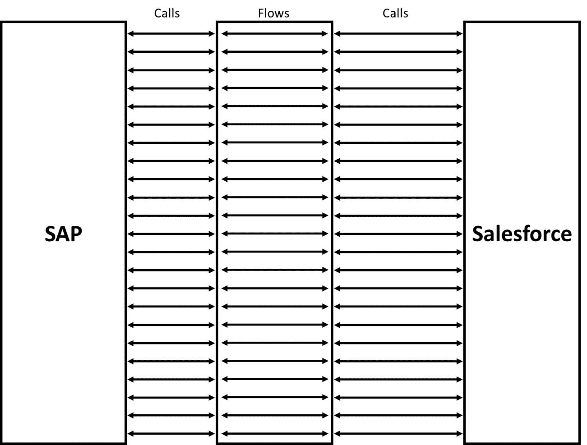
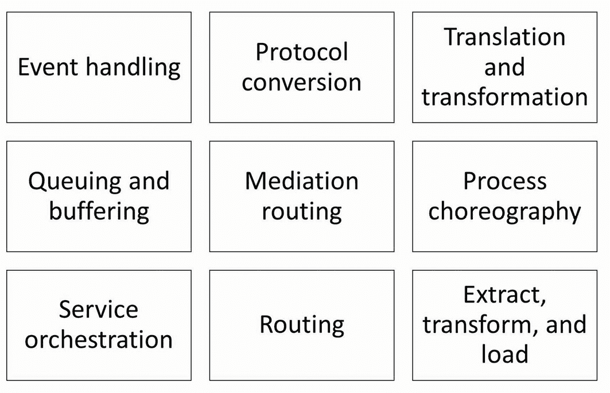
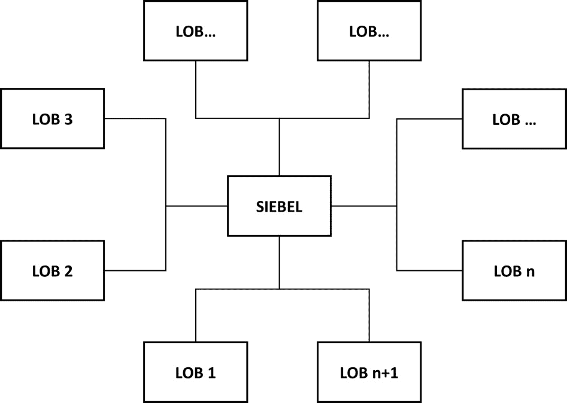
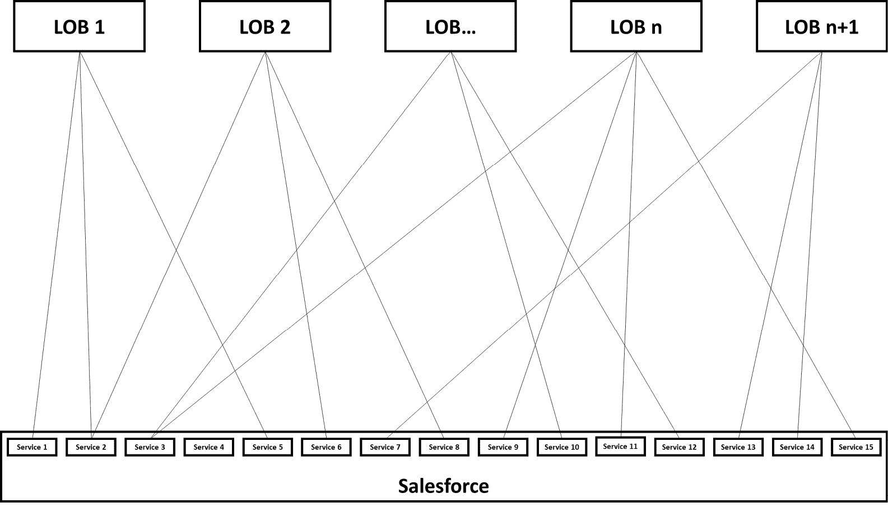
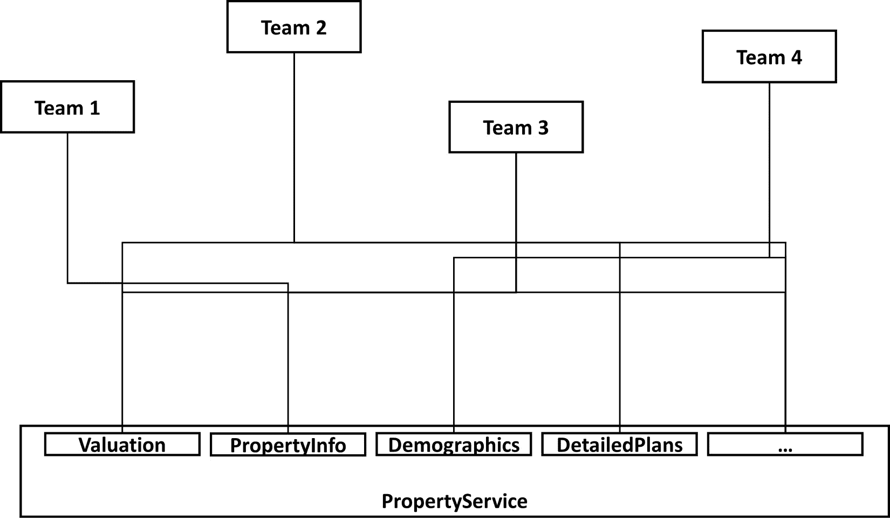
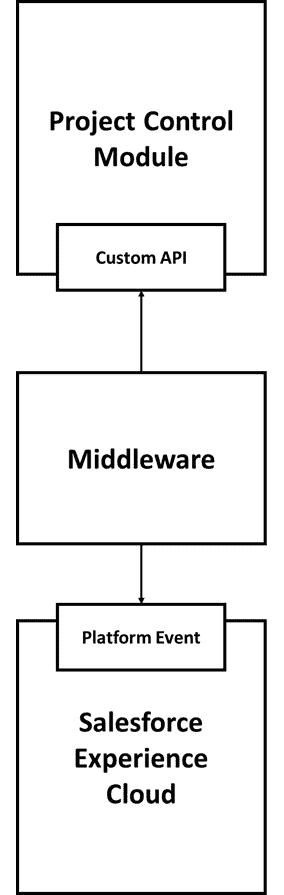
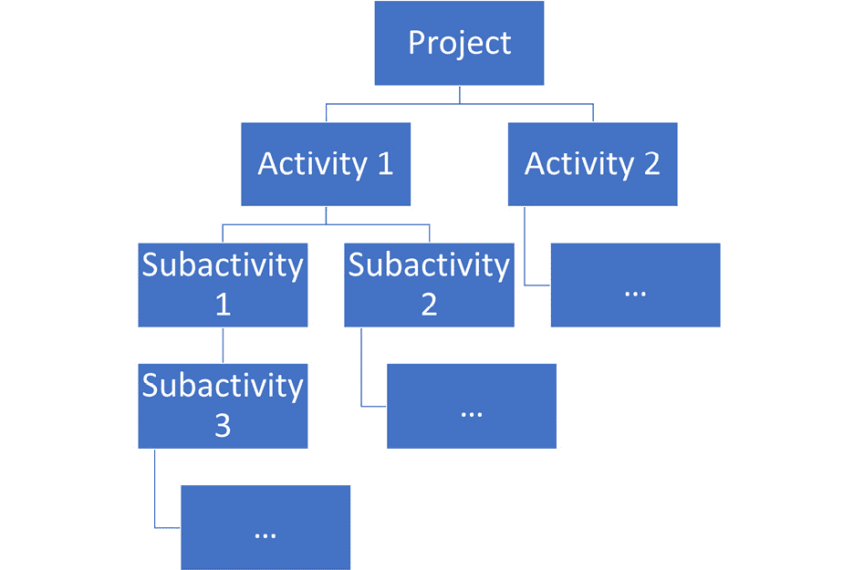
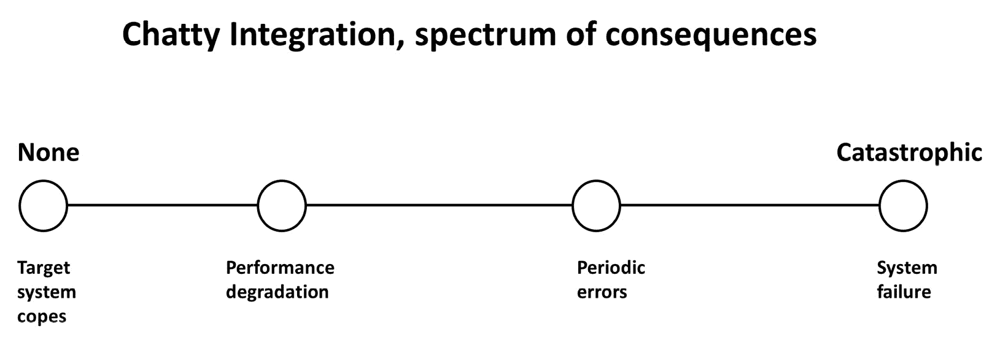
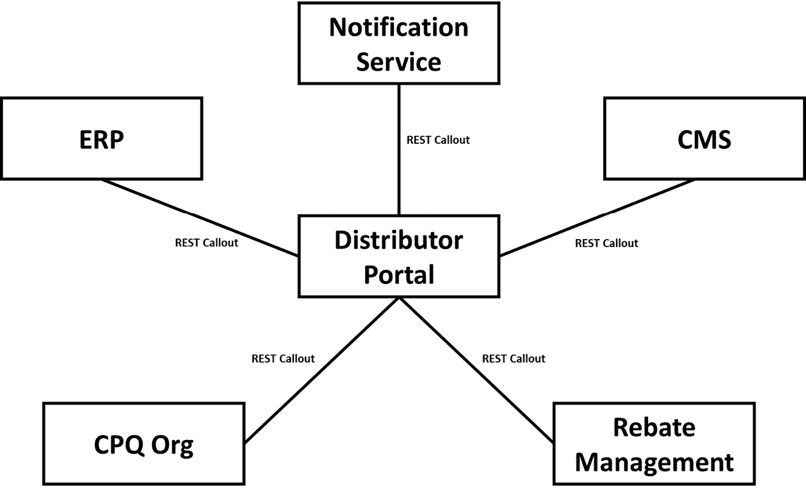
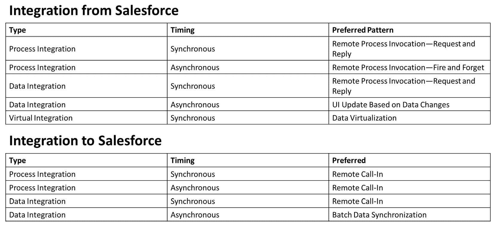

# 6

# 保持集成清晰

本章探讨了与其他系统集成相关的反模式，这是现代 Salesforce 实施中的一个关键方面。本章的第一部分讨论了集成架构和集成模式中的反模式，第二部分探讨了接口设计和使用中的潜在陷阱，第三部分集中讨论了集成风格的问题。像往常一样，我们通过总结关键要点来结束本章。

在本章中，我们将涵盖以下主要主题：

+   如何避免滥用技术，避免让系统架构过于复杂

+   何时适合，何时不适合为集成创建自定义服务

+   如何避免在设计接口时的常见失败

+   如何良好地使用基于事件的集成

+   如何正确地使用集成模式

+   AI 如何影响集成模式

完成本章后，你将对如何更好地选择集成模式和结构化集成架构有一个清晰的理解，通过学习各种可能出错的方式来避免这些问题。随着 Salesforce 的不断发展，理解这些集成反模式对于从事该平台工作的架构师和开发人员来说变得越来越重要。

# 搞乱集成架构

本节介绍了两种反模式，它们以不同的方式可能会在你的集成架构中造成混乱。我们将首先讨论如何避免错误地使用中间件。

## 名义上的中间件（MINO）

使用中间件来创建点对点连接，而不是利用其扩展功能

### 示例

PumpCo 是一家大型 B2B 公司，专注于为工业生产制造泵。它在 30 多个市场运营，历史上在 IT 系统上的投入较少，并且在销售上主要使用手工流程，这些流程在不同国家和产品线之间存在显著差异。

在过去的一年里，他们开始实施 Salesforce Sales Cloud 和 CPQ，以推动全球销售流程的标准化。他们过去在 IT 平台上的一项重大投资是 SAP，基本上，SAP 目前管理着公司所有关键业务。

Michelle 在 Salesforce 实施的早期阶段作为集成架构师加入。集成路线图非常雄心勃勃，因为业务希望看到所有相关数据和流程能够在 Salesforce/SAP 边界上无缝运作。从根本上讲，他们希望能够在 Salesforce 中直接访问所有相关的后台数据和流程，而不需要切换上下文。

一旦完成初步的映射，就有 75 个离散的集成点，涵盖从定价和物流到人力资源等各个方面，需要实现这些集成点，才能提供业务所期望的完整体验。然而，好消息是，许多集成点可以分为相似的领域，例如*客户*或*订单接口*。

来自 Salesforce 和 SAP 方面的架构师讨论了多种替代架构和实现方法，目的是创建少量稳定的接口，以满足大多数用例的需求，但不幸的是，进展缓慢，利益相关者和架构师之间没有真正达成一致。有许多潜在的解决方案和几种可能完成任务的技术，而各方愿意妥协的意愿较低。

双方最终同意让中间件团队来管理这个过程。PumpCo 刚刚购买了一个新的中间件平台，团队正在寻找机会开始工作。

中间件团队将向 Salesforce 暴露服务，并将调用转换为 SAP。任何 API 的修改也将是它的责任。因此，两个平台团队无需就方法达成一致，可以独立工作。

随着项目的推进，米歇尔统计了 Salesforce 调用中间件的接口数量。她数了 45 个。虽然比最初的 75 个少，但随着项目的推进，范围也有所缩小。

这是 PumpCo 集成架构的示意图：

图 6.1 – PumpCo 集成架构

从她所看到的，许多这些中间件接口几乎只是简单地将 Salesforce 的调用转发给 SAP，然后再返回。她在想，这真的是最好的方法吗？但这已不再是她的问题。

然而，随着时间的推移，随着 Salesforce 的使用量增加，集成开始出现问题。错误率较高，性能问题，维护变得越来越复杂。总体而言，集成导致了平台上的大多数技术问题。

一名顾问被请来评估情况，并建议对集成架构进行合理化，因为当前的设置实际上包含了通过中间件连接的 45 个日益定制的点对点连接。这种设置带来了很大的失败潜力，且通常很难理解。

米歇尔被要求参与重新设计过程，在几周的设计工作后，他们最终得出了一个与初期项目实施过程中所做的某个迭代方案相差无几的提案。当一位高级利益相关者直接询问为什么一开始不做这个时，没有人能够给出令人信服的回答。

### 问题

MINO 反模式试图通过引入中间件来减少创建良好集成架构的复杂性。然而，它的做法未能充分利用中间件平台的能力，而是通过中间件重新创建了本应出现在点对点场景中的流。

这种情况通常出现在具有复杂系统景观、系统间有许多接口和接触点的组织中。然而，在这些组织中，通常缺乏协调不同部门之间的技术治理，从而导致集成架构的混乱。

MINO 反模式的另一个常见特征是关键平台上存在过时且不灵活的系统 API，并且很难达成一致的标准表示法来表示这些关键平台上的核心业务实体，这使得无法就通用接口或 API 达成一致。

### 提出的解决方案

MINO 提出的解决方案仅仅是引入一个中间件平台，而没有过多关注如何使用它。通过引入现代中间件平台，至少可以部分掩盖遗留系统的复杂性和不灵活性，从而取得良好的初步结果。

也就是说，MINO 表面上看似正确，但如果中间件的实现只是以新的形式复制现有的混乱，那么收获相对较小。并不是完全没有收获；你仍然可能获得一些基本的中间件能力，如更好的错误日志记录、重试机制或更易于使用的协议转换。

另一个，往往更具影响力的原因是，这种反模式使得核心平台的团队不必直接处理彼此之间的关系。如果你在 CRM 方面工作，你的视角通常会与在 ERP 方面工作的视角非常不同，尤其是在关键集成的情况下。

MINO 允许不同的团队只需与共同的中间件团队打交道，后者则负责管理其余部分。不幸的是，这通常会导致架构只停留在基础层面。

### 结果

MINO 的结果往往是将你的系统景观变成比之前更加混乱的“意大利面条”式的架构。毕竟，现在中间件处于核心位置，因此你可以减少对集成细节的关注。

这种忽视通常会带来以下后果：

+   难以理解的集成架构，存在过多的单独接口和点对点连接，尽管这些连接通过中间件进行调解

+   维护成本增加，因为复杂度仍然很高，而且现在涉及更多的团队

+   缺乏技术治理，以及潜在的对这种治理必要性缺乏认知

+   集成中的错误率增加，以及由于团队试图跨平台追踪错误而导致的修复时间相应增加

+   性能下降，因为存在更复杂的流程，跨越多个平台

总体而言，如果你只是让中间件充当点对点连接的代理，可能完全不使用中间件更好。

### 更好的解决方案

MINO 反模式教给我们的是，没有捷径可以走来正确建立集成架构。你必须仔细考虑系统之间的连接和依赖关系，当前及未来的业务需求，主数据的分布情况，关键平台所具备的核心功能，以及如何构建接口和模式，以最佳方式支持这些元素。

以下图展示了一些常见的中间件功能：

图 6.2 – 常见的中间件功能

考虑到这一点，你可以选择适合的工具来完成任务，这很可能是一个中间件工具。然而，在你尚未思考清楚将支持哪些跨业务的接口、为不同场景支持哪些集成模式、并确定如何在不同团队之间进行技术治理之前，不能急于选择任何工具，不论它看起来多么酷。接下来我们将讨论下一个反模式——服务膨胀综合症。

## 服务膨胀综合症

*服务膨胀综合症是一种反模式，指的是在没有充分的理由或考虑替代方案的情况下，创建过多的自定义服务。*

### 示例

OmniCo 始终将自己定位为技术领导者，并在多个多元化的服务领域中部署了许多前沿的软件平台。该公司是**面向服务架构**（**SOA**）的早期采纳者，并结合**事件驱动架构**（**EDA**）在高速数据和流程中取得了巨大优势。

OmniCo 现在正在实施 Salesforce，作为其旧 Siebel CRM 系统的替代品，后者曾作为许多其他系统的集成中心。Siebel CRM 系统被高度定制以适应 OmniCo 的流程，公司期望新的 Salesforce 系统也能如此。虽然实施伙伴提出了保持标准功能的合理论点，但这与 OmniCo 历史上的做法相悖，且他们并不打算在 CRM 项目中改变这种做法。

下面是旧的 Siebel 设置：

图 6.3 – OmniCo 的旧 Siebel 设置

对于负责实施项目集成部分的咨询经理 Erhat 来说，这引发了很多焦虑。他正受到来自 OmniCo 的多位高级利益相关者的压力，要求构建一系列能够融入 OmniCo SOA 的特殊业务服务。

Erhat 曾尝试在纯净的 Salesforce 平台上构建定制的 API，虽然最终成功，但过程既不简单也不快。事实上，考虑到提到的定制服务数量，他对于在时间、预算和具备必要技能的人员限制下的基本可行性存有疑虑。

经过一些反对意见后，他同利益相关者达成一致意见，使用类似于旧 Siebel 系统中用于订单管理的接口来交付两项关键服务，这需要大量时间来在不同模式上重新设计。

这些服务已经交付，但在测试过程中证明非常困难，部分原因是服务的测试协议不完整，部分原因是复杂性异常高。

当头两项服务接近完成时，OmniCo 的企业架构委员会召开了一次危机会议。他们刚刚意识到在新的 Salesforce 设置中，并不是所有由 Siebel 提供的业务服务都将可用。在董事会的几位成员看来，这将从根本上破坏一系列业务流程，因为其他系统需要大幅改变它们的集成方法，或者转向某些步骤的手动处理。

Erhat 对 OmniCo 的流程不太了解，因此无法就案件的优点进行辩论。董事会成员向他提供了另外 13 项服务的定义，涵盖了从潜在客户到现金流程的不同部分，并且这些服务在之前的 Siebel 设置中是可用的。以下是集成的示意图：

图 6.4 – OmniCo Salesforce 集成的示意图，不包括 ESB

Erhat 实际上只能在实际层面上进行反对，他这样做了，认为这些服务超出了范围，不包括在定价内，并且他没有团队来提供解决方案。OmniCo 有些不满，并且进行了一些升级会议。然而，最终告诉 Erhat 不要担心——他们会以其他方式解决这个问题。

结果是引入了一个由各种承包商组成的团队，他们将快速构建这些服务，与主要的咨询合作伙伴的团队并肩作战。Erhat 只能等待和观察，看承包商们遇到不可避免的技术复杂性。他在项目上线前离开，留下一些不愉快的味道。

十二个月后，他再次回到了 OmniCo。他被引入作为该公司 Salesforce API 的专家，这些 API 显得非常容易出错且维护成本高昂。

OmniCo 正在寻找建立此类系统的原因以及如何修复它的理由。他们还在考虑不同的方法，比如改变集成模式或引入一些中间件。Erhat 深吸一口气，开始规划分析工作。

### 问题

服务扩展综合症所构成的问题是如何将 Salesforce 融入现有的企业架构中，同时又要满足这些架构中已经存在的对关键系统能力的期望。这可能是一个 SOA，正如我们例子中所示，或者是一个不同的组织原则，但通常来说，要求关键平台提供非常具体的功能。

这种反模式在各种平台中都很常见，因为它可能影响任何新的集成平台。在过去，这种情况更为常见，因为组织们忙于构建 SOA，而往往没有深入考虑具体服务的组织结构。

这种反模式通常源于对微服务架构的误解，或者是希望通过定制服务解决每个集成挑战的愿望。

今天，这种情况最常见于老旧系统被替换时，所需的接口与内建系统 API 的标准功能不完全匹配。虽然 Salesforce 提供了广泛的 API，但它们非常依赖于数据模型，而许多集成架构是基于不同的原则构建的，例如粗粒度的业务服务，而这些原则与 Salesforce 的数据模型完全不对齐。

### 提出的解决方案

服务扩展综合症处理的是在集成过程中如何应对这个问题，倡导为每个集成需求不必要地创建新的定制服务。这种方法忽视了利用现有服务或标准 API 的潜力，而这些现有服务或 API 足以满足这些需求，且不会增加不必要的复杂性。

这是另一个反模式，尽管它看起来似乎合乎逻辑，因为毕竟，你是在直接交付业务价值，并且有时符合跨公司技术治理论坛的预期。因此，你可能会在很大压力下走这条路，明知这样做会在长期内对平台造成损害。

因为平台上具备相关能力，而企业环境中又有这种需求，反抗这种反模式有时几乎是不可能的。这一点尤其正确，因为这些成本通常是随着时间的推移才逐渐累积的。

### 结果

你最先会遇到的服务扩展综合症问题是复杂性和构建成本的增加。尽管在 Salesforce 上创建定制服务是可行的，有时也是正确的选择，但它们很难做到完美。Salesforce 本身并不是一个 API 平台，这也是它几年前收购 MuleSoft 的重要原因之一。

随着时间的推移，复杂性增加将导致维护成本上升，而且不仅仅是 Salesforce 的成本。使用这些扩展服务的各个团队也可能面临重新工作和升级其连接的持续成本。

在 DevOps 环境下，服务过度繁杂会给 CI/CD 管道带来显著挑战，增加的复杂性使得自动化和编排变得更加困难。这种复杂性可能导致更频繁的部署失败，因为众多服务之间的相互作用是不可预测的。此外，潜在问题的增多会延长恢复时间，因为团队必须遍历更多组件以诊断和解决故障。因此，组织可能会发现更难实现 DevOps 旨在提供的速度和可靠性，最终影响软件交付的整体效率。

有时，自定义服务是正确的选择，且其好处可以超越初始构建和维护的成本。但对于我们示例中的 15 个自定义服务来说，这种情况几乎是不存在的。如果你认为你需要这些服务，那么你可能需要重新考虑你的方法。

### 更好的解决方案

第一个建议是，首先查看标准的集成模式，看看你是否能找到合适的标准技术。也许你可以使用标准的 API，也许你可以使用批处理过程，也许你可以发布事件并让其他系统订阅它们。

你应该广泛地考虑，而不是立刻跳到自定义接口，尽管这看起来是一个好的初步选择。危险在于，你可能会选择看起来光鲜的解决方案，却没有意识到这个决策在长期内的实际成本。

如果你确实决定需要大量的自定义 API —— 在某些情况下这可以被证明是合理的 —— 你应该选择一个专为此目的构建的平台来实施。对于 Salesforce，MuleSoft 是经典的选择，但市场上也有其他可以填补这个空缺的解决方案。

为了增强我们的服务产品，我们可以采取逐步推进的方法：

1.  识别核心业务能力。

1.  映射现有的服务和 API。

1.  识别我们服务中的空白。

1.  在选择自定义服务之前，考虑标准化解决方案。

此外，我们还可以考虑实施一个强大的 API 管理策略，以促进服务的重用并避免不必要的服务创建。

在 DevOps 环境下，服务过度繁杂可能导致 CI/CD 管道中的复杂性增加，发布管理变得更加困难。因此，采用更为规范的服务创建方法至关重要，因为这与 DevOps 的简化和自动化原则更为契合。这确保了流程的流畅性并提升了整体运营效率。

总体而言，如果盲目地构建服务，你会冒着使你的 Salesforce 界面和集成环境过于复杂的风险。像往常一样，考虑实际的利弊权衡，并基于真实的优缺点做出决策。接下来，我们将进入下一部分，讨论与接口设计相关的反模式。

# 不当的接口设计

在本节中，我们将探讨影响集成设计的两个常见反模式。在具体层面上，第一个是繁重接口，着眼于接口设计中的问题，而第二个是频繁通信集成，着眼于接口使用中的问题。

## 繁重接口

当一个接口开始处理太多任务时，你会遇到一系列问题。

### 示例

Joe 是一个集成架构师，供职于一家专门从事复杂实现的小型 Salesforce 合作伙伴公司，通常需要大量代码或其他类型的定制。他刚刚开始与 RealCo 签订的新合同，RealCo 是一家主要的房地产投资公司，Salesforce 是其整个业务中主要的互动系统。

他最初承包的工作包括为访问估值信息构建一个定制接口，供 RealCo 的合作伙伴在进行交易时使用。信息存储在 RealCo 的 Salesforce 组织中，需要实时可用。

Joe 在 RealCo 的中间件平台上设置了组成接口的 API，并协调对几个不同的 Salesforce 标准 API 和一个自定义 API 的调用，作为实现的一部分。然而，接近新接口上线时，一大堆新的用例掉到了他的桌子上。

这些不仅包括对估值 API 的扩展，例如获取历史估值和趋势数据，还包括完全不同类别的物业数据，包括通过平台事件进行的实时更新、使用**变更数据捕获**（**CDC**）的数据流变化、建筑结构信息、从各种评估中获取的关键指标访问，以及从 RealCo 合作伙伴进行看房时收集的反馈洞察。

Joe 稍微反驳了一下客户，说如果他早知道会有这么多新的功能进来，他可能会以不同的方式构建 API，可能会做一些在当前上线中不是最优的处理来包含这些功能。

RealCo 的经理专心地听 Joe 讲话，但最终表示，决定是继续增加额外的功能。RealCo 意识到潜在的弊端，但它可以接受这些问题。

在上线前一天，同样的事情再次发生。这一次，信息不仅包括更多与物业相关的信息，还包括完全不同类别的信息，如与物业所在区域相关的人口统计和细分数据，如下图所示：

图 6.5 – RealCo PropertyService 视图

没有办法在一天内完成这项工作，RealCo 虽然不情愿，但还是接受了这个事实。然而，它希望 Joe 提供一个计划，尽快将其包含进去。鉴于巨大的压力，Joe 只是扩展了当前的接口，而这个接口现在变得庞大，涉及到几十个 Salesforce 服务，包括标准和自定义服务。

幸运的是，初始上线和随后的更新都相对顺利。RealCo 合作伙伴组织的团队对接口的复杂性抱怨了一些，并报告了若干 bug。但它仍然能够正常工作，合作伙伴们可以继续处理接口所需驱动的各种应用程序。

变更请求的轰炸仍在继续。而且这些变更总是特别紧急，且对于某个合作伙伴的关键用例来说是必须的。更糟糕的是，越来越多的团队依赖于这个接口，这使得升级变得越来越困难。

即使有良好的 API 版本管理，版本之间的变化仍然让合作伙伴团队感到相当吃力，他们大声抱怨频繁的版本变化和 API 实现中逐渐出现的高错误率。

最后的压垮骆驼的稻草出现在新版本发布前发现了一个关键性 bug。Joe 被告知需要优先发布新功能，于是他将一个热修复与新版本一起发布，这实际上强制所有主要合作伙伴进行升级。

然而，事实证明新 API 版本中存在其他破坏性的 bug，这意味着关键合作伙伴失去了访问关键功能的权限，直到 Joe 能够控制住局面，至少一周的时间。

召开了一次升级会议，合作伙伴们可以在会上提出他们的各种投诉。Joe 尽力解释当前情况的历史背景和原因，但不幸的是，复杂的细节在嘈杂的讨论中被淹没了。

Joe 被告知他的合同不会续签，另外一个顾问将被引入来重构和重组接口。他松了一口气，开始期待下一个工作机会。

### 问题

“胖接口”所带来的问题本质上是接口结构的问题——也就是说，如何安排功能，使得那些需要接口提供服务的客户端可以调用它。

注意

最初，这种反模式更多地应用于 **面向对象编程**（**OOP**）中的接口。然而，它在集成环境中同样适用。

在接口设计上有几种不同的哲学观点。如今，大多数人本能地偏向于微服务，它们是执行一组单一、明确且连贯功能的小型服务。举个例子，一个通知服务，它的唯一作用就是发送通知。

然而，几年前，人们更倾向于使用粗粒度的业务服务，这些服务为业务流程提供了一个入口点——例如，处理订单。这就是与 SOA（面向服务的架构）相关的基础风格，我们之前曾提到过。

然而，使用臃肿接口时，你违反了大多数（如果不是所有）这些哲学中普遍适用的一个基本原则。这个原则叫做接口隔离，要求客户端永远不应被迫依赖它不需要的方法。

### 提议的解决方案

臃肿接口提议简单地将逻辑继续添加到现有接口中，因为这是最简单的做法。设计良好的隔离接口可能需要更多的工作和仔细思考，而将所有功能放在一个接口中则简化了问题。

此外，你有时可能会说服自己，所有功能确实应该放在一起，因为它们之间有一些间接的共同点，尤其是当你有大量消费者使用你所暴露的功能时，这种情况可能尤其成立。

这种反模式通常只是随着时间推移产生的结果。代码最初做一件事，然后做另一件事，接着做第三件事，最终它什么都做，甚至连狗都带走了。

如果不是因为有许多隐性成本需要考虑，这一切看起来应该是好的。我们接下来将探讨这些问题。

### 结果

如果你一直在阅读本书，你一定会熟悉臃肿接口反模式的结果。这类似于在多个领域中可能发生的糟糕结构后果。

当你的接口变得臃肿到不可管理的地步——也就是说，它现在包含了太多不同的功能，实际上已经变得无法管理——你可能会看到以下一些或全部后果：

+   复杂性增加，导致变更成本、周期时间和错误率的提高

+   维护成本增加，因为错误会带来额外的后果，客户端依赖接口的各种现有部分，且代码库庞大且难以理解

+   只有某些开发人员能够对臃肿接口进行更改，因为更改接口的互依性和对接口用户的影响需要对整个代码库有深入的了解。

+   接口中的 bug 可能会影响那些根本不使用失败方法中暴露功能的客户端

+   大量客户端依赖接口，使得解开现状变得困难

总的来说，尽管这种模式乍一看可能只是一个轻微的代码异味，但如果你在中心位置有一个失败的臃肿接口，它实际上可能会为你的公司范围的集成架构带来严重问题。

### 更好的解决方案

这种反模式是少数几个可以通过应用良好实践和开发过程中的自律来避免的。如果你严格遵循接口标准，并在添加新功能时始终应用接口隔离原则，这种反模式将永远不会发生。

尽管可能会有诱惑去走捷径，而这些捷径短期内可能不会带来严重后果，但你应该了解长期后果，并应用良好的设计和编程实践。这也是一个架构师或开发人员可能会有很多发言权的领域，因为这是一个技术性太强的领域，大多数业务用户难以真正发表意见。

难点在于，在面临巨大的交付压力时，如何保持所需的纪律性。当然，希望通过在描述中提到的要点，能帮助你抵制“速成思维”的诱惑。

## 聊天集成

聊天集成是一种反模式，其中集成了任意模式，导致对一个或多个接口发出过多的调用，常常导致性能下降。

### 示例

WoodCo 是一家有着悠久历史的家具制造商，专门为富裕客户定制高端家具。近年来，由于推出了基于 Salesforce Experience Cloud 并结合 B2B 电商的电商平台，WoodCo 的业务增长迅速，该平台将客户社区与指定负责其项目的家具制造商直接连接起来。

这样，客户和制造商可以直接连接并讨论定制建造的要求。客户还可以在家具的整个生命周期中跟踪其进度。

WoodCo 负责管理项目建设，包括预算，并确保尽可能通过友好协商解决任何冲突。他们在一个旧的项目控制模块中跟踪这些项目，该模块也用于管理他们自己的业务。

这个项目模块最近通过一个定制构建的 REST API 进行了扩展，该 API 建立在传统应用程序之上。供应商专门为 WoodCo 构建了这个 API，花费巨大，但这被认为是毫不犹豫的选择，因为它将直接实现门户与项目控制模块的集成，取代了当前由数据输入人员手动将所有数据重新输入项目控制模块的过程。

Lina 被 WoodCo 聘用，负责数字化项目，其中第一个项目是将电商平台与项目控制模块连接起来。她委托了一家专业的 Salesforce 合作伙伴来主导这一工作。

他们建立了一个轻量级的中间件平台，订阅 Salesforce 的事件并将其转换为新 REST API 格式的 REST 调用。由于 REST API 不支持任何聚合，所以它严格遵循一对一事件调用。

在 Salesforce 方面，事件最初仅在状态更新时触发，或者在输入或更改诸如项目标题之类的重要信息时触发。然而，随着时间的推移，应该扩展到跟踪项目中的活动状态以及制造商与客户之间的沟通。

你可以在这里查看 WoodCo 集成架构的概览：

图 6.6 – WoodCo 集成架构

集成成功上线，WoodCo 的每个人都为此欢呼。然而，尚未实现完全的好处，因为活动和客户沟通仍然仅存在于客户门户中，而 WoodCo 员工仍然通过重新输入数据并在多个系统间切换来绕过这个限制。

最终，更新的日子到来了，这次更新将包括完整的同步，大家兴奋地等待着上线。然而，在启动后的几分钟内，项目模块崩溃了。

供应商进行调查并将错误归因于与初始同步相关的可扩展性问题。上线被推迟到周末，并经过多次重启后，初始数据确实得以同步。

星期一到来，大家开始愤怒地使用系统。项目控制模块的慢速问题引发了一些抱怨，但至少集成似乎在工作，并成功传递了关键数据。

然后，在周二早上，一名管理员正在客户门户上运行一些常规批处理作业。几乎立刻，项目控制模块再次崩溃，新的集成被下线以便恢复。

WoodCo 的首席信息官（CIO）召集了一个危机会议。这一问题已经引起了 CEO 的关注，需要采取措施解决。Lina 委托她最有技术才能的下属 Aki 找出根本原因。

此时，两个供应商互相指责失败，并且都不肯采取单方面行动解决问题。因此，Aki 直接深入到技术设置的中间。

他检查了 Salesforce、中间件和项目控制模块的日志文件和代码，几个小时后，他确认找到了根本原因。问题出在一个递归更新规则上，该规则将某些更新（例如更改计费代码）应用于父项目的所有活动。

在新更新之前，这并不重要，因为活动层级的变动并没有进行同步。然而，更新后，每一次这样的变化都会触发 Salesforce 上成百上千个更新事件，每个事件都会触发对项目控制模块的调用。

你可以在这里看到 WoodCo 项目的整体结构：

图 6.7 – WoodCo 项目结构

这个遗留系统可能同时处理一到两个这样的更新，同时仍能正常服务用户，但任何超过这个数量的更新都会引发问题——首先是性能下降，最终导致崩溃。当管理员启动批处理作业以重新分配一些**项目标识符**（**PIDs**）时，这触发了数十个项目及其活动树的更新，在此过程中导致项目控制模块崩溃。

在晚上的会议上，气氛沉重。然而，随着 Aki 解释事情的事实，没人能真正反驳。决定是暂时禁用活动级别，并让 Aki 领导一个团队重新设计集成，以避免过载项目控制模块。

### 问题

聊天式集成反模式是解决其他集成问题的副产品，出于某些原因，这些问题需要系统之间非常频繁的通信。通常，像我们示例中的问题涉及在两个或更多系统之间转移状态。

它是一个在开发过程中很难发现的反模式，因为它通常只在规模扩大时才会变得成问题。毕竟，在大多数测试场景中，除非是明确的性能测试，否则我们更新的数据不足以真正达到一个有问题的集成调用数量。

问题的实施可能是由于不良的实践，例如在循环中为每个记录单独发出调用，或者可能更为隐蔽，如我们示例中的情况，订阅事件被 1:1 映射到中间件中的 REST 调用。不管是哪种情况，至少是浪费，最坏的情况下是灾难性的。

### 提出的解决方案

如前所述，聊天式集成往往是解决另一个问题的副产品；因此，它并不完全符合我们的模型。然而，就算我们可以说它提出了一个解决方案，那就是跨系统边界进行尽可能多的调用，以支持业务用例，而不考虑系统的限制。

这通常是出于简化的原因。一旦你开始引入批量处理、排队、系统延迟、调用聚合、限流或你可能考虑的任何其他机制来限制调用其他接口的速率，你也会在实现中引入复杂性。

你可能已经注意到，其他反模式表明，复杂性往往是导致严重负面后果的驱动因素，因此避免它通常看起来是件好事。然而，这是一个*让解决方案尽可能简单，但不要* *更简单*的例子。

在聊天式集成中，你实际上让解决方案变得过于简单，因为它在没有额外复杂性的情况下不能满足基本的功能需求。这可能意味着你需要更多的时间和额外的工具来使解决方案正常工作，但在这种情况下，真的没有捷径可走。

即使使用低代码集成工具，这一点依然成立，这些工具的销售目的是让你的生活变得更简单。如果集成策略错误，集成就无法按预期工作。毕竟，架构就是在权衡中做出选择。

### 结果

聊天式集成的结果形成了一个谱系：

+   通常，如果目标系统能够应对大量的调用，并且你也保持在 Salesforce 的限制内，那么不会立即出现后果。

+   有时你会看到性能下降。这可能是因为在 Salesforce 端，如果你在一定时间内发起了太多异步调用，而在目标端，如果你开始超载它的容量，也可能发生类似问题。

+   性能下降可能会转化为周期性错误，特别是当你开始遇到超时问题或目标服务器临时过载时。

+   最终，你有时可能会使目标系统彻底崩溃，导致严重错误。

你可以参考以下图示以获得可视化演示：

图 6.8 – 聊天型集成谱系

这并不意味着如果你恰好处于谱系的左侧，就不会存在反模式。它只是意味着目前，你尚未遇到问题。

### 更好的解决方案

避免聊天型集成反模式的一般建议是理解并在设计时考虑系统的限制。我们并不是在为理论系统创建理论架构。如果我们这样做，我们就会处于学术领域。

当你作为架构师设计集成时，通常是针对一个明确定义的目标环境进行设计。这意味着你应当考虑以下几点：

+   了解硬性限制，例如系统限制——例如，某一时间段内支持的最大调用次数。

+   获取目标系统在当前负荷下的实际性能信息

+   不要在没有考虑性能影响的情况下随意发起调用。

为了缓解这种反模式，组织可以利用 Salesforce 的批量 API 来高效处理大量记录，并使用复合 API 在一个请求中发起多个相关调用。这种方法可以最小化独立事务的数量，提升整体性能，同时确保数据完整性并减少潜在错误。

相反，可以使用以下一种或多种策略来确保目标系统能够应对：

+   **批量化**：将多个逻辑调用合并到同一消息中。

+   **合并**：将多个更新合并为一个调用。

+   **聚合**：将多个区域的变化合并为一个调用，涵盖多个领域。

+   **延迟**：在性能波动时引入延迟，推迟发送调用。

+   **减少频率**：减少更新的发送频率。

+   **缓冲**：将调用添加到一个队列中，随着目标系统的容量逐渐排空该队列。

+   **事件**：考虑使用 Salesforce 的流式 API，以减少调用次数并实现更加事件驱动的架构。通过利用流式 API，你可以实时监听 Salesforce 记录的变化，使你的应用能够迅速响应数据变化，而无需频繁轮询。这种方法提高了数据处理的效率和响应性，使其成为现代应用的重要集成方案。

总体来说，如果不小心，一个冗长的集成可能会让你的集成环境陷入困境。因此，即使你认为短期内不会遇到问题，也应避免使用这种集成模式。

# 错误的模式选择

本节中，我们将探讨过于执着于单一集成风格如何通过集成模式偏执症反模式造成严重问题。

## 集成模式偏执症

集成模式偏执症发生在仅使用单一集成模式，而忽略所有其他模式的情况下，不管该模式是否适合正在考虑的需求。

### 示例

WineCo 已经使用 Salesforce 技术超过十年，拥有多个核心云服务组织：营销云和商务云。

他们已经开发出了一种基于 Salesforce 的定制方法，包括一系列框架和库，这些框架和库在项目中一致使用。尽管其中许多需要更新，但出于一致性的考虑，它们仍然是首选。

Clare 被一家领先的咨询公司引入，负责领导 WineCo 为其分销商开发的一个新应用程序的构建。该应用程序将包括 WineCo 管理人员与分销商之间的沟通、标准商品的电子商务、返利管理、定制定价逻辑、联合机会管理以及为特殊需求请求报价的功能。

为了提供所需的功能并实现分销商门户所带来的商业价值，Clare 需要确保与多个系统的集成已经到位。

她必须将所有通信都通过中央通知服务进行处理，以确保所有通信都得到了适当的记录并且有正确的页脚。然后，她还需要与现有的返利管理系统进行集成，该系统根据分销商的细分和历史订单计算应支付给分销商的返利。

定价将来自 Salesforce CPQ，但在不同的组织中，因此需要进行 Salesforce 到 Salesforce 的集成。门户网页的内容将来自公司 CMS。然而，也有一些用户和行为跟踪服务需要从 CMS 集成到门户网站中。

最后，ERP 系统需要更新通过分销商门户生成的任何定制报价和标准订单。分销商门户还需要从 ERP 系统获取大量关于分销商的数据，包括他们的现有订单以及关于他们的基础数据。总的来说，虽然在 Salesforce 上的基础构建非常复杂，但集成环境则更加复杂。

提议的架构在下图中展示：

图 6.9 – WineCo 的提议集成架构

更加复杂的是 WineCo 的企业集成标准。它规定所有来自 Salesforce 的集成必须使用公司的集成库来实现。那本来是可以的；然而，这个库只支持同步或异步的 REST 调用，极大地限制了集成设计的选择。

Clare 和她的团队不管怎样继续进行。他们提前完成了大部分核心 Salesforce 的构建，但集成部分进展滞后，遇到了一些不同的问题。

第一，返利系统不支持任何形式的批量处理，导致大量调用其 API。系统所有者质疑当前的设置是否能在上线场景中扩展，最终，需要采购四台新服务器，以确保系统能够承受负载。

第二，对 ERP 系统的查询过多，导致响应时间慢，UI 界面等待时间长。现有架构下无法解决此问题，因此决定将其视为培训问题来处理。

第三，CMS 服务从服务器端调用时困难重重，最终作出妥协，通过 JavaScript 包含追踪代码，尽管这需要正式的例外，并且会导致显著的延迟。

最后，通知服务并不适合分销商门户的许多消息需求，导致格式异常的消息，许多情况下很难回复。这也被接受，并被视作一个培训问题来处理。

项目完成并上线，几乎没有太多宣传。内部用户不喜欢新界面，分销商的采用程度也不热烈。Clare 做出最后的论证，建议重新设计基本的集成架构，使其更合适，然后再进行下一个项目。

### 问题

集成模式的单一主义试图解决一个问题：设计一个好的集成架构是根本上困难的，确定具体集成的正确模式、设计和实施特征也同样困难。

因此，它试图通过专注于一种在许多情况下都有效的方法来简化问题。通过这种方式，你可以定义一个标准的做事方法，而不必在每个具体案例的细节上纠结。

这有几个吸引人的原因：

+   第一点，标准往往有效。在许多情况下，采用标准化的做事方式是正确的选择。然而，整个集成架构是一个太广泛的目标，难以使用这种方法来解决。

+   第二，一旦你选择了一个方法，你可以创建支持资产，比如代码库和框架，用于日志记录和错误处理，这些资产能够在不同的集成中使用，这通常是有益的。

+   第三，你只需要让开发者掌握一项技能。这样可以减少开发复杂度、培训和入职需求。

如果不是因为一个不方便的事实——没有任何单一的集成模式是普遍适用的——这一切本来都很完美。

### 提出的解决方案

集成模式偏执建议对所有—或者至少几乎所有—在集成架构中所需的具体集成使用单一的集成模式。这可以通过公司标准明确规定，或者通过架构师和开发人员的工作和思维方式隐性体现。无论哪种情况，当这种偏好变得过于强烈时，你就会遇到反模式。

集成模式偏执的目标通常是相当合理的：

+   通过限制架构师和开发人员需要做出的选择，来减少集成的复杂性。

+   在企业架构中强制一致性，以避免不良副作用。

+   通过为开发人员提供明确的前进方向，并支持他们使用相关工具和框架，使开发人员的工作更轻松。

问题在于，并非所有具体集成都能适配某一给定模式。更新速度、可接受的延迟、数据量以及**用户体验**（**UX**）等特征，意味着长远来看，过度依赖单一的集成模式是有害的。接下来我们将探讨这一点。

### 结果

集成模式偏执引发的问题归结为技术不匹配。这是我们在其他反模式中也看到的情况——例如“金锤法则”。虽然在特定情况下可能有一些积极影响，但总体来看，你可能会看到以下一些后果：

+   你的集成环境由于需要多种变通方法来适应所使用的集成模式的局限性，反而变得更复杂，而不是如预期那样减少复杂性。

+   一些集成可能由于技术不匹配而无法在预期的质量参数内运行。这可能意味着周期性错误、性能差或类似问题。

+   这些因素通常意味着需要在持续的基础上承担更高的维护和支持负担，以修正问题。

+   最终，在某些领域的用户体验（UX）将让终端用户失望，因为该模式无法满足期望。

总的来说，你不会得到预期的好处，反而会陷入一团乱麻。

### 更好的解决方案

集成模式偏执的解决方案很简单。不要过于专注于单一的集成模式，无论是 RESTful 调用、EDA 还是批量传输。

相反，你可以为应用开发人员和架构师提供明确的指导，告诉他们在什么情况下哪些模式是合适的。在其他条件相同的情况下，偏好是可以的，但在实践中，很少有事情是完全相同的。

以下是 Salesforce 集成模式的概述：

图 6.10 – Salesforce 集成模式概览

对选择集成模式持一定保守态度是有道理的。这可以带来一些好处，比如采用一致的方法，利用标准框架和库。

你还可以使用中间件在系统之间创建一定的集成共性，尽管这只是将复杂性转移到了另一个平台。然而，当关键时刻来临时，如果某种方法是适合你的集成需求的，那么你应该使用它。

# 事件地狱

*当基于事件的架构出现问题时，会导致这种反模式，涉及到可扩展性* *和控制的失败。*

## 示例

SalesCo 是一家中型公司，专注于定制制造设备，已经使用 Salesforce 作为他们的 CRM 多年。他们的实施是自然增长的，从基本的潜在客户和机会管理开始，逐渐扩展到包括用于管理复杂产品配置、报价和订单履行的自定义对象。

随着业务的增长，SalesCo 的领导层决定现代化他们的系统集成方法。他们听说了 EDA 的好处，并希望利用 Salesforce 的事件功能来创建一个更加灵活和集成的系统架构。

Sarah，SalesCo 的高级 Salesforce 开发人员，负责实施这种新的事件驱动方法。她对使用平台事件解耦不同的过程并创建更灵活的系统充满了期待。

Sarah 首先通过识别可以受益于事件驱动方法的关键业务流程来开始。她为销售过程的各个阶段、产品配置更新、报价生成和订单履行创建了平台事件。目的是让系统的不同部分对这些事件做出反应，而不是有紧密耦合的同步流程。

例如，当销售代表将一个机会标记为**Closed Won**时，系统会触发一个**OpportunityClosedEvent**。这个事件会触发多个操作：

1.  订单履行团队将收到通知，开始处理订单。

1.  财务系统将会收到通知以生成发票。

1.  库存管理系统将会预留所需的产品。

1.  客户成功团队将会被提醒开始客户入职。

类似地，当产品配置更新时，系统会发出**ProductConfigChangedEvent**，触发报价的重新计算、相关机会的更新以及通知相关销售代表。

最初，这种方法似乎运作良好。系统变得更加灵活，不同的团队可以更加独立地工作。在这种成功的鼓励下，Sarah 和她的团队继续添加更多的事件和事件驱动的流程。

然而，随着事件和事件处理程序数量的增加，问题开始显现：

+   调试变得越来越困难。当问题发生时，很难追踪导致问题的具体事件和处理器的顺序。

+   性能开始下降。随着每个事件触发多个处理器，一些处理器又会触发额外的事件，系统开始变慢，尤其是在高峰使用时段。

+   数据不一致开始出现。随着多个进程基于事件更新相关记录，维护数据完整性变得困难。

+   开发速度下降。随着事件驱动系统的复杂化，即使是小的变动也需要仔细考虑可能对整个系统产生的连锁反应。

+   新成员的入职变得具有挑战性，因为理解完整的系统行为需要了解分布在代码库各个部分的众多事件及其处理器。

尽管存在这些问题，SalesCo 团队仍然不愿意放弃他们的事件驱动方法。他们已经在这个架构上投入了大量时间和资源，许多流程现在都依赖于它。Sarah 发现自己处于一个困难的境地，试图维护和扩展一个变得庞大且难以管理的系统。

## 问题

事件地狱反模式发生在系统过度依赖事件进行组件间通信时，导致代码库变得复杂且难以维护。这个反模式在那些采用事件驱动架构（EDA）但没有充分理解其影响或没有为其使用制定适当指南的系统中尤为普遍。

在 Salesforce 环境中，事件地狱通常表现为过度使用平台事件、流媒体 API 和基于触发器的自动化。虽然这些技术为构建响应性强且解耦的系统提供了强大的能力，但其误用可能导致一张错综复杂的事件发出和处理器网络，这会掩盖系统的行为，并使其维护变得具有挑战性。

事件地狱的关键特征包括以下几点：

+   **过度使用事件**：事件被用于几乎所有的组件间通信，即使是那些不需要事件驱动设计复杂性的简单同步操作。

+   **复杂的事件流**：随着事件和处理器数量的增加，控制流变得越来越难以跟踪。一个单一的用户操作可能触发一连串的事件，这使得很难预测或理解任何给定操作的全部影响。

+   **缺乏明确的责任划分**：在事件地狱的场景中，通常难以明确哪个组件或过程对特定的数据或功能负责。多个组件可能会发出或响应相同的事件，从而导致对某些操作发生位置的混淆。

+   **调试难题**：在事件地狱场景中跟踪执行路径非常具有挑战性。当问题出现时，开发人员可能需要在多个组件中的众多事件处理程序之间筛选，以理解发生了什么。

+   **性能问题**：事件的不断发布和处理可能导致性能下降，尤其是在交易量较大的系统中。

+   **数据不一致**：由于多个进程基于事件更新相关记录，维护数据一致性变得越来越困难。

+   **测试挑战**：事件地狱使单元测试尤其困难，因为组件通常依赖于复杂的事件交互，而这些交互在隔离环境中很难模拟或模拟。

在 Salesforce 生态系统中，事件地狱尤其成问题，因为平台的限制条件。过多的事件发布和处理会迅速消耗 CPU 时间、SOQL 查询限制和 DML 操作，从而导致系统超时和故障。

## 提议的解决方案

**事件地狱反模式**通常作为解决实际架构问题的提议解决方案出现。它承诺通过利用 EDA 的强大功能，提供一个高度解耦、响应迅速且可扩展的系统。这种方法的吸引力很强，特别是在 Salesforce 生态系统中，平台事件和流式 API 提供了强大的能力，用于构建事件驱动的系统。

该方法的支持者认为，通过使用事件进行大多数组件间的通信，可以实现以下目标：

+   **松散耦合**：组件只需要知道它们发布或消费的事件，而不需要知道系统中其他组件的情况

+   **可扩展性**：事件驱动的系统理论上可以通过增加更多的事件消费者来处理增加的负载

+   **适应性**：可以通过创建新的事件消费者来添加新功能，而无需修改现有代码

+   **实时响应性**：事件允许对系统状态变化做出即时反应

+   **集成简化**：事件可以作为集成各种系统和服务的通用语言

在 Salesforce 上下文中，提议的解决方案通常涉及以下内容：

+   使用平台事件进行大多数对象间和进程间的通信

+   实现众多 Apex 触发器以响应记录更改发布事件

+   创建多个 Apex 类来订阅和处理各种事件

+   利用流程生成器或 Flow 响应事件并更新记录

+   主要通过事件发布和消费来集成外部系统

这种方法似乎解决了许多常见的架构挑战。它似乎减少了系统不同部分之间的直接依赖，允许轻松扩展功能，并提供了一个明确的实时更新和集成机制。

然而，正如我们在下一节中将看到的，这种解决方案在被不加区分地应用时往往会带来比解决更多问题。

## 结果

当事件地狱反模式占据主导时，系统的结果将是：尽管它承诺提供灵活性和解耦，系统却变得越来越脆弱、难以理解，并且难以维护。在 Salesforce 实现中，事件地狱的后果可能是严重的：

+   **系统稳定性下降**：随着事件和处理器的网络不断增长，系统变得更加容易出现意外行为。系统中某一部分的微小变化可能会产生深远且不可预见的后果，导致更多的 bug 和系统不稳定。

+   **性能下降**：事件的不断发布和处理可能对系统资源造成重大压力。在 Salesforce 中，尤其是在高负载情况下，这很快会导致治理限制异常。用户可能会体验到响应时间变慢和更频繁的超时错误。

+   **调试噩梦**：当问题发生时，追踪根本原因变得极其困难。开发者必须追踪复杂的事件发布和处理链，这些链通常分布在多个对象和类中。这大大增加了解决问题所需的时间和精力。

+   **数据一致性问题**：由于多个进程基于事件更新相关记录，保持数据一致性成为一大挑战。当多个事件处理器试图同时更新相同的记录时，可能会发生竞态条件，导致数据冲突和一致性问题。

+   **降低的开发者生产力**：随着系统复杂性的增加，即使是小的变更或功能添加，也需要仔细考虑它们在整个事件驱动架构中的潜在波及效应。这减慢了开发进度，并增加了每次变更的风险。

+   **入职困难**：新团队成员很难理解系统的行为，因为逻辑分布在众多事件处理器中，而不是集中在更传统的服务层或控制器中。

+   **测试挑战**：编写全面的单元测试变得极其困难，因为各个组件与事件系统紧密耦合。集成测试变得更加重要，但也更难配置和维护。

+   **扩展性问题**：具有讽刺意味的是，尽管事件驱动架构（EDA）通常因其潜在的可扩展性优势而被采用，但事件地狱可能导致相反的结果。随着事件量的增加，系统可能难以跟上，导致事件积压和处理延迟。

+   **增加的运营成本**：事件地狱引入的复杂性通常需要更强大的（且更昂贵的）计算资源来保持可接受的性能水平。这也可能需要更复杂的监控和警报系统，以跟踪事件流并识别问题。

+   **可见性有限**：理解系统当前状态变得更具挑战性，因为重要的业务逻辑和数据转换作为事件的副作用而不是通过更可见和可追溯的直接操作进行。

+   **集成复杂性**：虽然事件可以简化集成的某些方面，但事件混乱可能会使系统之间的清晰契约难以维护。对事件结构或处理逻辑的更改可能会对集成系统产生意外影响。

+   **治理挑战**：在受管制行业中，事件混乱可能会使提供清晰的审计跟踪和证明合规性变得困难，因为重现导致特定系统状态的操作顺序可能很难。

在 Salesforce 环境中，这些问题通常会因平台特定限制而加剧。例如，无法控制触发器执行顺序可能导致事件发布者和处理程序之间的竞争条件。类似地，复杂事件驱动场景中可能很快超出平台的治理限制，导致运行时错误和事务处理不完整。

## 更好的解决方案

要避免陷入事件混乱反模式，同时仍然利用 Salesforce 中事件驱动架构的好处，请考虑以下策略：

+   保留事件用于真正的异步或解耦操作。并非每个状态更改或业务流程都需要基于事件驱动。对于简单的线性流程，请使用直接方法调用或同步操作。

+   在 Salesforce 组织中建立明确定义的领域，并主要用于跨领域通信的事件。在一个领域内，更倾向于更直接的交互形式。

+   在设计事件结构时要考虑周全。使用版本化事件，并且每个事件中仅包含必要的信息。这可以帮助管理系统演化并减少事件生产者和消费者之间的耦合。

+   对于需要完整状态变更历史记录的复杂领域，请考虑实施事件溯源。这种模式可以提供更好的可追溯性，并使系统状态推理更加容易。

+   使用平台事件触发器来集中事件处理逻辑，与拥有多个独立处理程序类相比，这样做可以更容易地管理和调试。

+   使用断路器模式防止事件处理在高负载情况下或经历下游系统故障时压倒系统。

+   对于复杂领域，请考虑使用**命令查询职责分离（CQRS）**来分离读写模型。这可以简化您的事件处理逻辑并提高性能。

+   接受在某些情况下，最终一致性是足够的事实。这可以帮助简化您的事件处理逻辑并提高系统性能。

+   为事件处理实施一致的错误处理和死信队列。这可以帮助更快地识别和解决问题。

+   保持清晰、最新的事件模式、生产者和消费者文档。考虑使用工具生成事件流的可视化表示。

+   使用 Salesforce 的事件监控功能，并考虑实施额外的日志记录以跟踪事件的发布和消费。这有助于识别性能问题并协助调试。

+   在实现复杂业务流程之前，使用事件风暴会议与团队共同建模。这有助于识别适当的边界和事件使用。

+   对于某些场景，其他集成模式（如请求-响应或发布-订阅）可能比纯事件驱动方法更为合适。

+   对于可能接近治理限制的复杂事件处理，考虑使用 Queueable Apex 将处理分解为可管理的块。

+   使用 Salesforce 的平台缓存存储频繁访问的数据，这些数据源自事件，从而减少重复复杂事件处理的需求。

+   使用功能标志逐步推出事件驱动的功能，并在生产环境中出现问题时快速禁用有问题的事件流程。

通过应用这些策略，您可以在 Salesforce 中创建一个更易维护且高效的事件驱动系统，避免事件地狱的陷阱，同时仍能收获反应性、解耦架构的好处。记住，目标是将事件作为您架构工具包中的强大工具，而不是将其作为应对所有集成和通信挑战的万灵药。

我们现在稍作偏离，探讨新兴人工智能技术对集成反模式的普遍影响。

# 人工智能对集成的影响

随着人工智能的不断发展并渗透到软件开发和系统集成的各个方面，必须考虑其带来的潜在好处与风险。本节探讨了人工智能如何影响集成实践，可能引发新的反模式，同时也提供了避免现有反模式的机会。

随着人工智能技术的广泛应用，集成领域正处于重要转型的边缘。虽然人工智能驱动的集成前景令人振奋，但我们需要以批判的眼光看待这一新前沿。与任何技术进步一样，人工智能的引入可能会导致新的反模式，从而可能破坏它们本应带来的效率。

可能出现的一个潜在反模式是我们可能称之为*AI 过度依赖综合症*。当组织过度依赖 AI 驱动的集成工具，忽视人类监督和领域专业知识时，就会发生这种情况。例如，考虑一种情境，一家公司实施了一个 AI 驱动的集成平台，承诺自动映射数据字段并优化 Salesforce 与其遗留 ERP 系统之间的数据流。初期结果令人印象深刻，他们可能会减少集成团队的人员，并完全依赖 AI 系统。然而，AI 可能无法理解复杂的业务规则和数据关系，从而导致库存管理和订单处理中的关键错误。这种过度依赖可能会导致人类专业知识和背景的流失、由于误解业务逻辑而产生的系统性错误的可能性，以及在排查和解决复杂集成问题时的困难。

另一个我们可能会看到的潜在反模式是*黑箱集成*。当用于集成的 AI 模型变得如此复杂，以至于人类开发者和架构师无法理解时，就会出现这种情况。假设一家公司采用一个复杂的机器学习模型来管理 Salesforce 与多个外部系统之间的实时数据同步。该模型会根据数据模式不断演化。随着时间的推移，集成行为可能变得不可预测，团队可能会很难解释或控制某些数据转换。缺乏透明度和可审计性可能会导致在遵守数据法规方面遇到困难，并增加在关键业务流程中出现意外行为的风险。

我们还可能会遇到我们所说的*训练数据偏见放大*现象。当用于集成的 AI 模型在有偏见或不完整的数据集上进行训练时，可能会导致结果失真，并可能引发歧视性后果。例如，一家金融服务公司可能会使用 AI 模型将 Salesforce 中的客户数据与其信用评分系统进行集成。如果该模型主要在城市地区的历史数据上进行训练，它可能无法准确评估乡村客户的信用 worthiness，导致不公平的贷款拒绝。这可能会导致现有偏见的延续和放大、潜在的法律和道德问题，以及对 AI 驱动的集成系统的信任破坏。

尽管这些潜在的反模式描绘了一幅警示图景，但需要注意的是，AI 也为缓解现有的集成反模式提供了显著的机会。例如，AI 可以通过分析使用模式并建议最优的接口结构，帮助防止*臃肿接口*反模式。它还可以通过根据实时系统行为和需求，建议最合适的集成模式，从而解决*集成模式狂热*的问题。此外，AI 模型可以通过预测潜在的性能瓶颈并提出优化建议，帮助防止*多余的集成*。

为了在集成中利用 AI 的好处并避免潜在的陷阱，采用平衡的方法至关重要。这可能涉及将 AI 推荐与人工专业知识结合，用于关键集成决策，优先选择能提供明确决策解释的 AI 模型和工具，实施强大的监控系统来跟踪 AI 驱动的集成性能，确保 AI 模型在多样化和具有代表性的训练数据集上进行训练，以最小化偏差，并定期审计 AI 驱动的集成系统。

随着 AI 继续重塑集成领域，Salesforce 架构师和开发人员必须保持对其带来的机会和风险的了解。AI 在集成领域的旅程刚刚开始，随着技术的演进，新的反模式和解决方案可能会不断出现。保持灵活、批判性思维，并时刻保持信息更新，将是驾驭这一既激动人心又充满挑战的领域的关键。

我们现在已经完成了本章中的模式内容，将继续讨论关键要点。

# 了解关键要点

在本节中，我们将稍微抽象一下特定的模式，而是试图提取您在日常工作中作为 Salesforce 架构师或为 CTA 评审委员会准备时可以使用的更广泛的学习要点。

在架构 Salesforce 解决方案时，您应注意以下几点：

+   中间件可以是创建秩序并改善系统结构的绝佳方式。然而，您也可以以某些方式使用它，导致弊大于利。

+   如果您所做的仅仅是用中间件通过等效的点对点流替代直接连接，您可能已经进入了反模式的领域。

+   在某些情况下，自定义服务可以是 Salesforce 组织的一个极好的补充。然而，它们会带来相当大的复杂性。

+   您不应因为看似是业务需求的定制服务而冲动地添加大量服务。相反，您应该退一步，从大局来看需求，看看有哪些选项可以实现所需的特定集成流。

+   如果您正在构建自定义接口，无论是在 Salesforce 上还是在您的中间件平台上，都应确保有适当的治理措施，以避免最终产生一个做所有事情的臃肿接口。

+   如果可能的话，避免过于频繁的集成调用。

+   如果你确实需要高频率的状态传输，考虑使用像 CDC 这样的专用技术。

+   一般来说，设计集成时必须明确考虑系统的限制。例如，不要假设一个旧的 ERP 系统能够处理无限次的调用。Salesforce 当然也有明确的限制。

+   保持灵活的集成架构方法。不要对某一种风格过于执着并用它处理所有事情。仅仅因为事件驱动的微服务很流行，并不意味着它适合每个场景。考虑参考 Salesforce 的*集成模式*指南，帮助你选择合适的集成模式。

+   给出清晰的指导，帮助你团队成员和外部合作伙伴选择集成模式。不要认为他们能自行做出正确的决策。

在准备 CTA 审查委员会时，你应该注意以下几点：

+   几乎每个场景都会有中间件的需求。你应该了解常见平台（如 MuleSoft）的关键能力，并能够智能地讨论它们如何融入系统架构。

+   尽管你可能不会在场景中看到足够的集成，形成类似 MINO 模式的问题，但仍然值得思考中间件为你正在传递的每个集成流程所带来的具体价值。

+   不要一味地通过中间件处理所有的集成——往往有一些例外情况需要不同的处理方式。

+   建议定制 Web 服务是一项重要的定制内容，需要强有力的理由才能在审查委员会架构中包含。

+   如果你需要定制接口，那么在大多数情况下，你应该通过中间件来构建和暴露接口。

+   虽然在审查委员会中你不太可能遇到一个接口臃肿的情况，但仍然值得考虑如何构建你的集成接口，以及它是否平衡。

+   你需要考虑你所建议的设计可能带来的性能影响。通常情况下，场景会有高频率的要求，如果以明显的方式指定这些要求，可能会导致类似于多次集成模式的性能问题。

+   准备讨论如何在 Salesforce 环境中应用 DevOps 实践来管理和部署复杂的集成。

+   审查 CTA 审查委员会的关键目标，并准备好阐明你的经验如何与这些目标对接。

+   熟悉与你项目相关的最新 Salesforce 功能和最佳实践。

+   确保所有的支持文档和资料准备齐全，能够顺利展示。

+   你可能会被问到 Salesforce 平台的集成限制，因此值得事先记住这些限制，便于在委员会中作答。

您应该彻底掌握 Salesforce 平台上所有常见的集成模式。这包括关于何时选择哪种模式的决策指导。在工作中，您可能需要多种模式，并且应该能够清晰地阐明您为何做出这样的选择。

我们现在已经讲解完本章节的内容，可以继续进行。然而，首先我们将总结一下我们的学习内容。

# 总结

在本章节中，我们回顾了五种不同的反模式，这些反模式在不同方面可能导致集成架构失败。值得时刻牢记这些反模式。

集成领域极为复杂，且在多个层面上都可能出错。从选择错误的集成模式或误用中间件，到具体实现的技术细节，反模式可能会在项目层面，甚至企业架构层面，造成严重问题。

这种复杂性强调了为何经验丰富的架构师在处理集成时总是保持谨慎。集成是项目失败的最常见原因之一，无论是在 Salesforce 上，还是在一般情况下。

值得重申的是，本章节是唯一一个所有反模式不仅适用于 Salesforce，而且适用于所有企业软件系统的章节。学习了这些内容之后，您应该能够稍微更好地准备迎接集成领域中即将遇到的挑战。

在已经讲解了集成领域之后，我们将继续讨论适用于您部署过程和治理的反模式。

# 第三部分：流程和沟通反模式

本部分将教您如何识别和缓解与流程、治理和沟通相关的反模式。

本部分包含以下章节：

+   *第七章*，*避免开发生命周期偏离轨道*

+   *第八章*，*无误译的沟通*

+   *第九章*，*结论*
