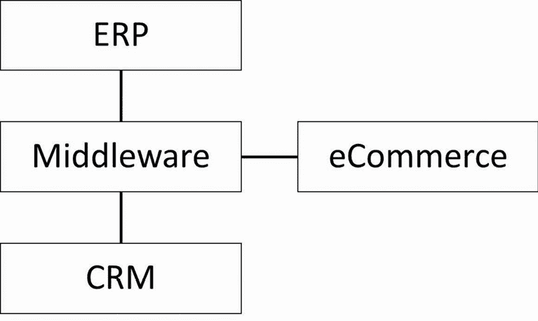
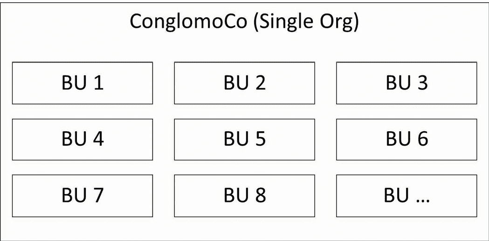
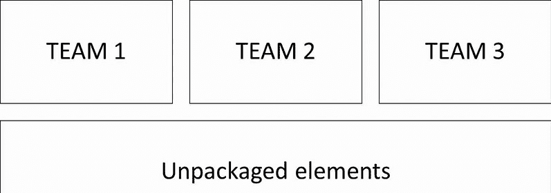

# 7

# 防止开发生命周期脱轨

在本章中，我们将探讨现代 DevOps 实践，特别是**持续集成和持续部署**（**CI/CD**），如何与软件开发中的各种反模式相关。我们将首先识别显著的过程级反模式，然后讨论 CI/CD 如何影响软件打包。最后，我们将探讨与测试相关的常见反模式。在本章末尾，我们将总结与现实应用和 CTA 复习委员会考试相关的关键要点。

在本章中，我们将讨论以下主要内容：

+   如何避免在项目交付中犯大方向性错误，例如如何结构化发布和处理关键权衡问题

+   如何避免以可能对组织有利但在架构上存在问题的方式来构建您的包

+   如何避免在面临交付压力时妥协代码和部署质量的陷阱

完成本章后，您将理解常见错误如何影响开发生命周期和相关活动，并掌握一些工具，帮助您避免这些问题。

# 过程对齐错误

在本节中，我们将讨论两种反模式，它们以不同方式使开发生命周期脱轨。首先，我们将探讨大爆炸发布如何在许多情况下导致灾难性结果。其次，我们将讨论项目分配主义——这种错误的信念认为可以避免做出重要的权衡。

## 大爆炸发布

*大爆炸发布反模式将所有功能的发布集中在项目的最终单一事件中。*

### 示例

RollerCo 是一家主要生产滑轮鞋和滑板的制造商，正在经历一场以创建一个数字化驱动的业务为中心的重大业务转型，以更好地满足当今买家的需求。尽管这场转型并非最终目标，但作为过程中一部分，计划了几个系统替换项目，旨在提供更大的 IT 灵活性。

Anandh 正在领导一个项目，该项目旨在替换 RollerCo 使用了 15 年的老旧自主开发 CRM 系统。该系统将被 Salesforce Sales Cloud 和 Service Cloud 的组合所替代，但由于老旧系统的高度定制化，已经证明无法使 Salesforce 设计保持接近标准。

高度定制化的另一个后果是，整个系统将需要作为一个整体上线。在全面上线之前，无法发布更小的**最小可行产品**（**MVP**）增量，因为那样会使客户支持人员的工作过于复杂。

在项目启动后不久，Anandh 被告知董事会已批准升级**企业资源规划**（**ERP**）到 SAP S/4HANA。由于 CRM 和 ERP 在多个流程中紧密耦合，这意味着 Anandh 不仅需要应对增加的集成积压，而且两个系统的上线计划也需要协调，以确保它们能同时上线。

很快就发现，ERP 升级带来的额外复杂性意味着原始的 Salesforce 实施计划必须推迟。特别是，集成的复杂性超出了任何人的预期。

首席信息官（CIO）在与一位可信的供应商代表会面后宣布，为了解决 CRM/ERP 集成问题，RollerCo 将投资建设一个新的战略中间件平台。这将替代现有的中间件，并与整体的 CRM/ERP 上线时间表同步上线。

当 Anandh 和他的团队忙于重新设计所有集成以适应新的中间件平台时，又有一个新发现。负责 RollerCo 网络商店的团队发现，让它与新的 CRM/ERP 设置兼容几乎是不可能的。

这需要更改应用程序数据层的基本架构，而当初构建该架构的开发人员已经不在公司。其他人无法弄明白如何操作，因此一个新的电子商务应用程序也被加入到整体项目积压中。为了方便起见，时间表与整体 CRM/ERP 上线时间表对齐：



图 7.1 – RollerCo 的新平台

该项目遭遇了不断的延迟。尽管有些领域比其他领域受影响更大，但没有一个主要平台在实施阶段表现得很好。三年过去了，初步版本终于接近完成。

RollerCo 已建立了一个复杂的部署流水线和切换计划，以处理多系统的同时上线，所有这些都计划在公司淡季的一个周末进行。上线前的测试花费了超过三个月的时间，并且需要进行一些范围缩减和紧急修复。

即便如此，参与该项目的人员也不敢明确说出系统会按预期运行。各种可变因素实在是太多了。

上线周末一开始表现不错，所有必要的数据迁移活动顺利完成。然而，一旦真实的业务用户进入系统，各种问题开始浮现。

到了周日晚，问题的数量已经达到一种让继续推进显得过于冒险的程度。虽然到目前为止没有任何单一问题是致命的，但由于小问题引起的整体干扰已经相当严重。在一个深夜电话会议中，指导委员会决定回滚并推迟上线。

后果是显著的。毕竟，项目已经有三年的时间来完成工作。然而，很快就变得清楚，问题无法在几周内解决。仍然有很多工作需要完成。

团队们将在接下来的六个月里共同寻找解决方案。在这段时间里，他们专注于缩小范围并简化功能，以便让推出过程更容易管理。

最终，包含 CRM、ERP、中间件和电子商务的综合平台上线。然而，它上线时带着一大堆已知问题和解决方法，而且其范围大大缩小，远低于最初的设计。

### 问题

大爆炸发布是一种反模式，通常尝试解决在发布过程中如何处理复杂依赖关系的问题。这些依赖关系可能存在于系统之间或系统内部。它最常出现在没有强有力的数字化转型领导的地方，而且现有的领导层往往高度规避风险。

依赖关系通常与某些业务流程相关，这些流程有着长期以来以某种方式进行的惯例，这意味着大量的功能必须作为一个整体进行部署。有时候，像我们在这个例子中所见的那样，这甚至可能导致系统级别的巨大依赖关系。

解构现有的业务流程并提出过渡架构（在部分解决方案存在的情况下，满足完成工作的需求）可能相当困难，像功能的最小可行产品（MVP）子集那样可以独立提供价值也同样困难。大爆炸发布通过简单地将一切推迟到未来的一个大事件来避免这些问题。

### 提议的解决方案

大爆炸发布反模式建议在漫长的交付过程中，最后进行一次大的发布，涵盖所有相关功能。这可能意味着几年积累的工作同时上线，而没有任何中间的反馈。

这种解决方案对于交付团队和客户来说，因各种原因可能非常有吸引力：

+   它将整个系统简化为一个单一的部署单位，可以作为一个整体进行管理。

+   它简化了规划过程，因为你不需要为多个发布、部分数据迁移和共存场景做规划。这意味着整体架构也被简化，因为不需要为项目的范围设计过渡架构。

+   你还避免了在什么时候包含哪些内容、可以满足哪些业务需求以及何时满足的艰难决策。

+   对于交付团队和客户来说，这很容易理解。

+   你成功地将问题推迟了，把它变成了以后再处理的事情。在某些情况下，到时候可能会有其他人来做这件事。

因此，你可以理解为什么——即使在小范围发布和 DevOps 思维已经成为主流范式的今天——许多项目仍然最终以大爆炸的方式进行部署。不幸的是，这通常不会顺利进行。

### 结果

Big-Bang 发布反模式的根本问题在于，你往往无意间承担了大量的风险。技术风险不会随着部署组件数量的增加而线性增长。相反，由于组件间连接和依赖关系的超线性增长，风险会以更快的速度增加。

简而言之，如果你只部署一个组件，你需要处理的风险仅限于该组件的故障。如果你部署了两个互联的组件，那么你就需要应对最多四种故障模式：

+   组件 1 独立故障

+   组件 2 独立故障

+   组件 1 故障并触发组件 2 的次级故障

+   组件 2 故障并触发组件 1 的次级故障

这四种故障模式可能会表现出独特的症状，根本原因可能并不明显。试想一下，如果你同时部署 20 个组件，并且它们之间有大量的相互连接，你将面临多少潜在的故障模式。

在软件开发中，流水线就像是代码的工厂装配线，每个步骤会自动流向下一个。就像汽车在不同的工位进行组装、测试和质量控制一样，代码也会经历构建、测试和部署的各个阶段。DevOps（开发和运维结合）是一套将软件开发和 IT 运维团队结合起来的实践，旨在加速、更可靠地交付软件。可以把它看作是打破了编写代码的人员与维护这些代码运行的系统之间的传统壁垒。

现代 DevOps 实践高度强调自动化测试和部署流水线，它们充当着防范“爆炸式”发布（一次性发布多个更改）风险的安全网。当开发人员修改代码时，这些更改会自动触发一系列的测试——单元测试检查单个组件，集成测试验证不同部分的协作，系统测试确保整个应用程序功能正常。这种被称为持续集成的自动化流程，帮助团队及早发现和修复问题，避免问题影响整个系统。持续交付会将这些经过验证的更改自动准备好发布，确保每次更改都能随时部署。

CI/CD 框架的实施将传统的、少量大规模发布的方法转变为一系列更小、更易于管理的更新。团队不再将数十个更改积累到一个重大发布中（这可能很冒险，就像试图同时更改发动机的多个部件一样），而是可以在每个更新准备好并经过验证后立即部署。这个增量方法使得识别和修复问题变得更加容易——如果出现问题，团队可以迅速定位到是哪个具体的更改导致了问题，并修复它或回滚这个更改，而不是一次性撤销多个更新。结果是更稳定的软件系统，因为团队可以监控每个小更改的影响，并在问题成为大问题之前解决它们。

由于大规模部署的故障模式非常多，这意味着测试变成了一个巨大的任务，通常你可能测试数周，仍然无法确定是否已经测试了所有重要的案例。调试错误也变得更加困难，因为追踪各个组件之间可能的连锁反应比仅仅找出单个组件中的错误要困难得多。

相同的困难也适用于推出和回滚任何需要完成的切换任务。在“大爆炸”场景下，甚至培训和变更管理也变得更加困难。

总的来说，发布越大，失败的风险越大。如果你不是赌徒，应该避免走这条路。

### 更好的解决方案

如果大规模发布是问题，那么小规模发布显然是解决方案。从风险管理的角度来看，每次发布的理想功能量是一个单独的特性或一个单独的用户故事。这正是**持续交付**（**CD**）的前提，正如许多领先的 DevOps 导向的组织所实践的那样。

然而，我们必须承认，并非所有组织都具备规模或技术成熟度来采用允许每次只交付一个功能的纯 DevOps 配置。然而，如果你追求小规模发布的理想，至少你将开始减轻这些问题。

小规模发布具有以下特点：

+   风险更小

+   更容易测试

+   更容易调试

+   更容易在发现错误后进行修复

+   更容易推出和回滚

+   更快地向业务用户交付价值

+   促进并增加系统的采纳

+   使变更管理更容易控制

总体来说，一旦完成了必要的技术和业务流程工作以启用小规模发布，那么几乎没有——如果有的话——缺点。

一般来说，旨在提高韧性将有助于避免本章中提到的问题。一个好的起点是使用完善架构框架：[`architect.salesforce.com/well-architected/adaptable/resilient`](https://architect.salesforce.com/well-architected/adaptable/resilient)。

## 项目派系主义

*Project Pieism 未能处理关键架构权衡，而是坚称你可以既享有它又能够使用它。*

### 示例

ConglomoCo 是一家大型多元化企业集团，拥有许多**业务单元**（**BU**），有些与业务领域相关，有些与地理位置相关。大多数业务单元在运营和信息技术基础设施方面相当独立。此外，业务单元负责人相对于**总部**（**HQ**）员工拥有更多权力，因为他们实际上是自己业务的主宰。

当 ConglomoCo 的 CIO 决定推动 Salesforce 的全球推广时，他们因此遇到了多个业务部门负责人强烈的抵制，这些部门有自己的 CRM 策略，并不希望总部插手。然而，作为新倡议的一部分，首席执行官（CEO）和首席财务官（CFO）要求提供全球销售漏斗的汇总视图，而 CIO 正是借此来推动他们的 Salesforce 战略。

金，作为 ConglomoCo 总部的高级 IT 项目经理，因此被赋予了推动 Salesforce Sales Cloud 和 CPQ 全球推广的责任。首席信息官（CIO）希望借此机会在各个业务单元之间标准化核心销售流程，并简化销售数据的报告。

因此，在与他的架构师进行沟通后，金提出了基于单一组织和标准流程的计划。业务单元内部将有一些本地化的变化，但这些变化的范围将被限制在一定程度上。

当金开始向利益相关者展示这个计划时，他发现这显然不是他们所期望的。各个业务单元（BU）有各自独立的流程、用户体验（UX）期望、本地集成以及他们希望新系统能满足的报告需求。

在一场高级领导研讨会上，许多问题浮出水面，并在最高层达成了妥协。新系统必须能够满足独立的销售流程、自动化、本地集成，并且能够为每个业务单元（BU）提供一定程度的用户体验（UX）定制：



图 7.2 – ConglomoCo 组织

然而，所有这些仍然必须在同一个 Salesforce 组织内进行，并利用相同的数据模型，以简化跨业务单元（BU）的报告。可以理解，这将导致更加定制化的实施，并带来成本上的影响，但首席信息官（CIO）仍然希望实施尽可能接近标准化。

实施过程漫长且缓慢。必然地，它包含了许多与不同业务单元相关的独立工作流。每个工作流似乎都有其复杂性，工作流之间的协调是一个持续且艰难的挑战。可以说，随着实施的推进，人员的疲劳感逐渐增加，大家对未来系统的期望也有所下降，更加看待它为一种必要的“恶”而非推动积极变革的工具。

金与业务部门进行谈判，并成功使两个较小的领域以试点方式上线。这些领域上线时并没有太大宣传，且存在许多漏洞。然而，比这些漏洞更糟糕的是，低采纳率。各业务单元的销售人员似乎尽一切可能避免将数据录入系统，而即使录入，数据质量也很低。

鉴于初期结果不理想，后续的推广被暂停。相反，一家管理咨询公司被请来调查为何采用情况如此差劲，并探讨如何改进。

### 问题

项目派系主义是一种反模式，其根本原因在于避免在实施系统时做出艰难的权衡。这可能是因为政治上的困难或项目领导力不足，但始终涉及未能承认一个需要决策的关键权衡。

从某种意义上来说，大多数软件架构中的工程问题，乃至一般问题，都涉及在一系列权衡之间找到平衡。然而，这些权衡往往令人不舒服，且往往无法取悦所有利益相关方。

因此，很多项目在没有做出必要的权衡的情况下继续进行，抱有后来可能找到解决方案的希望，或干脆闭眼不看事实。在任何情况下，这都是一种反模式。

### 提议的解决方案

项目派系主义建议，将一个或多个重要的权衡视为解决方案的一部分，认为这个权衡并不存在，你实际上不需要做出妥协，甚至可以既得到自己的“蛋糕”又能“吃掉”它。有时，这种做法通过忽视权衡或把它扫到地毯下完成；有时则是承认了权衡，但通过特殊请求来暗示这个情况是特殊的，因此这个权衡不适用。

这个位置显然很有吸引力。当在实施项目中需要做出关键权衡时，你可能不得不让一个或多个利益相关方失望。如果这些利益相关方在你的组织中很有权力，这可能并不是一件容易或愉快的事。你甚至可能发现自己由于公司政治被迫陷入项目派系主义（Project Pieism）的困境。

然而，即使是你组织中最有权力的高管，也无法改变软件架构的基本事实。总是存在权衡。每当在技术项目中出现你认为不需要做出权衡的情况时，你应该感到担忧。

### 结果

项目派系主义的结果是，你试图忽视的权衡最终会回归。根据墨菲定律，这通常会发生在项目生命周期中最不方便的时候，并对项目造成重大损害。

当然，具体的损害将取决于你忽视的权衡。在我们之前的例子中，我们忽视了全球与本地流程的优先级之间的权衡，以及标准功能与定制化之间的权衡。

ConglomoCo 曾试图建立一个具有全球流程的标准化系统，同时兼顾所有相关的本地变更。这导致了一个没人愿意使用的系统，因为它无法很好地满足任何人的需求。

其他权衡会产生不同的后果，但如果你未能做出关于推动架构的关键权衡的重要决策，你可以预见到不利的后果。

### 更好的解决方案

朝着更少的妥协未来迈进的方式，就是公开承认需要做出的权衡，并与利益相关者建设性地讨论选项。通常，确实有办法让利益相关者获得更多他们都想要的东西，但可能会以额外的成本或更长的时间线为代价。

让这个参与过程正式化的一种方式是，在项目早期建立良好的架构治理，并在架构论坛和业务论坛上讨论关键的架构权衡，以确保考虑到所有的视角。在我们的例子中，一个称职的架构委员会可能会指出，在 ConglomoCo 的情境中，根本无法让单一的组织策略有效运作。

作为架构师，我们需要对业务保持诚实，明确什么是可行的，什么是不可能的。我们是那些在技术方面了解可能性的专业人士，我们不应该假装我们最喜欢的技术能够超越必须做出艰难选择的现实。坚定立场，保持建设性，提供选项，且不忽视重要的权衡。

## 不频繁的检查

*不频繁的检查是一个反模式，指的是开发者长时间在隔离的环境下工作，而没有将他们的更改集成到主代码库中，这会导致显著的集成挑战、减少可视性，并可能导致* *项目延误*。

### 示例

CloudTech，一家快速增长的科技公司，一直在开发定制的 Salesforce 解决方案，以管理其复杂的合作伙伴生态系统。该项目涉及多个团队，分别负责解决方案的不同方面，包括合作伙伴入驻、认证管理和收入分成计算。

高级开发者莎拉被指派构建收入分成计算引擎，这是一个关键组件，需要与系统的多个部分进行接口。鉴于计算的复杂性和涉及的众多业务规则，她决定在与主代码库集成之前，先完成整个功能。

项目经理汤姆对这种方法感到满意，因为他相信这能让莎拉完全专注于正确完成复杂的计算，而不会被集成问题分心。团队的技术负责人马库斯对长时间的隔离期表示了一些担忧，但最终同意了，考虑到莎拉的经验以及该组件的重要性。

Sarah 花了六周时间工作在计算引擎上。在此期间，她取得了显著进展，并在站会期间定期向团队更新她的工作。然而，她将所有更改保留在本地开发环境中，认为这是最安全的做法，直到功能完成并经过彻底测试。

与此同时，其他团队成员继续他们的工作。合作伙伴入驻团队对数据模型进行了一些更改。认证团队添加了新的验证规则，这些规则影响合作伙伴状态。集成团队修改了计算引擎需要交互的几个 API。

当 Sarah 最终完成计算引擎并准备将其与主代码库集成时，出现了几个问题。合作伙伴入驻团队对数据模型所做的更改与 Sarah 对架构结构的假设发生了冲突。新的验证规则影响了合作伙伴状态的确定，而这正是计算引擎的关键输入。修改后的 API 需要不同的参数和返回结构，而这与 Sarah 代码的预期不符。

团队现在面临危机。冲刺截止日期临近，但集成 Sarah 的代码将需要大量重构。代码审查过程变得令人不堪重负，因为团队成员难以理解和验证庞大的变更集。在测试过程中发现了几个关键的 bug，但由于变更之间的相互关联，修复变得复杂。

在额外的三周密集工作后，解决了集成问题，功能最终合并到了主代码库。然而，延迟影响了其他依赖的功能，项目时间表需要调整。团队还发现，Sarah 的一些工作在她孤立工作期间与其他团队成员已经实现的解决方案重复。

### 问题

不频繁检查的反模式出现在开发人员长时间独立工作且不将更改合并到主代码库的情况下。这种模式通常出现在涉及复杂功能或关键组件的场景中，团队认为隔离可以带来更好的集中和更少的干扰。

反模式通过开发人员在数周或数月内没有合并代码而表现出来，导致大规模、单一的变更集，难以审查和测试。这种做法限制了开发进度的可见性，并与不断变化的代码库和团队决策之间隔离开来。

虽然这种做法对复杂功能来说似乎是合乎逻辑的，但它从根本上误解了软件开发的协作性质以及持续集成（CI）的重要性。

### 提议的解决方案

**不频繁检查合并**方法认为，复杂的特性最好独立开发。支持者认为，开发者可以完全专注于他们的任务，而不必担心集成问题，保持代码“干净”，并在特性准备好之前不受持续变化的影响。他们相信，在特性完成后，测试会更为彻底，代码审查也会在检查完整功能时更有意义。通过将功能视为单一工作单元，项目管理看起来会更简单。

这个解决方案看起来很有吸引力，因为它承诺通过避免持续集成（CI）的开销并处理代码库中持续的变化，来减少复杂性。它建议开发者能够完全专注于特定功能，避免外部干扰，从而提高质量。

### 结果

**不频繁检查合并**反模式会导致几个显著的问题。集成成为一个重大挑战，最终与主代码库集成时会出现大量的合并冲突。通常需要进行显著的重构，以适应在隔离期间所做的更改，并且集成错误和 bug 的风险也会增加。

在整个开发过程中，可见性受损。团队对实际开发进展的了解有限，难以及早识别潜在问题，降低了做出明智项目决策的能力。

随着团队成员独立工作，合作问题随之而来。知识共享和同行学习受限，关于设计决策和实现方法的反馈也会延迟。这通常会导致重复劳动，因为不同的团队成员在解决类似问题时，彼此并不了解对方的工作。

质量影响变得明显，代码审查可能会错过关键问题。由于大型变更集，全面测试变得困难，并且由于复杂的集成场景，bug 更有可能漏网。

项目延期是常见的，因为初步时间表中没有考虑到延长的集成周期。这会导致一系列的延迟，影响相关特性，并增加了解决冲突和问题所需的时间。

技术债务通过架构不一致的原因积累，因为开发过程中的分歧导致团队发现重复的解决方案和不一致的方法，同时很难维持代码历史记录并理解更改的理由。

### 更好的解决方案

为了避免**不频繁检查合并**反模式，团队应当实施真正的持续集成（CI）。这意味着要建立自动化的构建和测试流程，要求开发者每天至少集成一次更改，设置集成问题的监控和警报，并使用功能开关在主代码库中管理不完整的功能。

复杂的功能需要拆解成更小、更易管理的部分。团队应计划增量开发，明确集成点，尽早识别依赖关系，并主动管理它们。每个组件的明确验收标准有助于保持关注，同时允许定期集成。

明确的集成政策至关重要。团队应定义集成之间的最大可接受时间，以及变更集大小的指南。代码评审流程应鼓励频繁的小规模评审，并应制定功能切换使用的标准。

在开发过程中，必须优先考虑沟通与可视化，定期进行设计评审，并在复杂功能上进行结对编程。团队应保持最新的架构决策文档，并定期进行团队同步会议，讨论技术挑战。

现代开发实践在防止这种反模式中起着至关重要的作用。基于主干的开发最小化了长期存在的分支，而全面的自动化测试有助于及早发现问题。功能标志有效地管理不完整的功能，适当的监控和可观察性确保团队能够快速识别和解决问题。

团队文化是成功的基础。组织应鼓励知识共享与协作，同时促进集体代码所有权。应支持持续学习和改进，团队应为早期反馈创造一个安全的环境。

避免这种反模式的关键是认识到软件开发本质上是协作性和迭代性的。成功的关键不在于避免集成挑战，而在于通过频繁集成和清晰沟通，使这些挑战足够小，能够有效管理。通过实施这些解决方案，团队可以保持高质量，同时避免孤立开发的陷阱。

# 解开流水线

本节将介绍与如何为基于包的开发构建包结构相关的一个关键 DevOps 反模式。

## 使用包创建孤岛

*使用包创建孤岛*是根据团队结构将 Salesforce 项目的包划分，而不考虑*架构问题*。

### 示例

MillCo 是一家生产 CNC 铣床的公司，拥有遍布欧洲和北美的子公司，正在为其 B2B 销售实施 Salesforce。这包括 Sales Cloud、CPQ 和 B2B Commerce。

Abigail 是 MillCo 的 CRM 技术负责人，在加入 MillCo 之前，她曾在另一家 B2B 制造公司领导过一个 CRM 实施项目。她的主要职责是确保来自三个不同供应商的技术交付在实现新系统的不同元素时具有一致性和高质量。

在项目启动时，Abigail 邀请了三个供应商团队以及内部相关方，并多次强调，虽然每个人都为不同的公司工作，但大家应当把自己看作是一个团队的一部分。MillCo 希望大家在同一页面上，共同朝着一个共同目标努力。

事实证明，这一切都是徒劳的。一旦工作正式开始，三家供应商很快就互相对立。Abigail 发现很难让他们达成任何共同的方法和标准。

尽管她可以强制执行某些规定，但她没有团队支持，如果供应商不配合，她所能做的也有限。她将问题上报，但被要求找到一个能够让工作按计划继续进行的解决方案。

她决定的解决方案是将每个供应商隔离在独立的软件包中。这样，供应商可以独立开发，除了他们的工作在平台的关键元素上直接冲突的情况。Abigail 决定亲自监控并调解这些争端：



图 7.3 – 软件包结构

她最终将大部分时间都花在了调解这些跨供应商冲突上。这也意味着她几乎没有时间去调查供应商在那些不涉及争议领域中使用的通用方法。

然而，最终，系统被构建完成。由于每个供应商都只在自己的环境中工作，偶尔才将代码部署到经过薄弱测试的集成环境中，因此准备进行**用户验收测试**（**UAT**）的第一步是将所有软件包部署到一个共享环境中，并测试基本流程。每个软件包都在自己的环境中经过了彻底测试，但尚未对跨软件包进行系统性测试。

即使在测试结果开始出来之前，情况也开始恶化。事实证明，供应商之间存在不兼容的系统和软件包设置——例如，CPQ 管理的软件包上就存在这种情况。这意味着部署被迫停滞，直到找到解决方法。

当测试人员真正开始工作时，情况变得更加糟糕。软件包之间存在许多细微的不兼容问题。例如，对于公共字段的解释和使用存在差异，不同的软件包使用相同目的的重复字段，以及部分重叠范围的自定义对象和冗余数据的创建。此外，三个供应商之间在自动化模式上也存在很大差异，尽管这是 Abigail 在项目初期已经指定了标准的领域。

总的来说，差异太大，无法迅速协调一致，项目不得不后退。Abigail 的上司谈判延长了时间表，以便重构软件包并使其统一。虽然她对延期感到高兴，但 Abigail 并不喜欢为了让供应商真正完成这项工作而进行的拉锯战。

### 问题

有时候，你可能希望让团队独立工作，而不必依赖或协调其他团队。在 Salesforce 的上下文中，这可能是因为各个团队在不同的云环境中工作，来自不同的供应商，或代表着你组织内不同的部门或业务单元（BU）。

这完全可以理解，因为协调问题确实很难解决。然而，当这种情况成为将 Salesforce 平台划分为包的基础时，它就变成了一种 DevOps 反模式。

### 提议的解决方案

使用包来创建孤岛的提议解决方案是，给每个团队分配自己的包来工作，反映出它们将要处理的内容。这避免了协调问题，但也带来了一系列其他问题。

这意味着你根据组织需求而非架构来结构化你的项目包设置。一开始看起来这可能是个不错的主意，显然也能短期内满足各个团队的需求，但不幸的是，这也意味着潜在的隐藏冲突很可能会存在，并且可能会保持隐蔽很长时间。

### 结果

使用包来创建孤岛的可能结果是，你将会遇到隐藏的冲突，直到包集成时才会显现出来。

这些冲突包括以下情况：

+   数据模型的不同使用——例如，字段和对象

+   安全模型中的问题，当使用了冲突的配置时

+   冲突的流程、验证规则或其他业务逻辑

+   偏离最佳实践，例如，在同一对象上有多个触发器

+   在同一对象上使用不同的自动化模式

+   关于系统设置的冲突假设

+   在不同的包中复制的功能，经常只是部分重叠

这可能会导致严重问题，而且重构起来会非常麻烦，既昂贵又耗时。

### 更好的解决方案

通常来说，包设计应当被非常重视。基于包的开发是大多数大规模 Salesforce 项目的正确选择，部分原因是它比其他替代方案更具可扩展性。

为了避免陷入使用包创建孤岛的反模式，请遵循以下准则：

+   在设计包结构时要考虑架构。例如，在典型的按服务线拆分的架构中，你可以将公共功能放在一个“Common”包中，所有其他包都依赖于该包，然后为每个服务线创建包含相关组件的单独包。你还可以有跨服务线的高层次包，处理诸如常见集成之类的内容，并且可以将交叉功能拆分到单独的包中，尽管这可能有些难以管理。重点是，你应该确保干净地管理依赖关系，并避免潜在的冲突重叠。

+   小心处理依赖关系；分层方法可以有效地确保依赖关系仅朝一个方向流动。

+   在需要时，让团队跨包工作。

+   考虑让特定团队拥有特定的包，而其他团队如果需要任何东西，则向它们请求工作。

+   通过技术治理论坛进行协调——例如，架构委员会。

在现代 DevOps 工作流中，利用如 Salesforce CLI 这样的工具对于有效的源代码跟踪和版本控制至关重要。Salesforce CLI 简化了集成过程，使开发人员能够轻松管理和部署跨环境的变更。通过利用源跟踪功能，团队可以确保开发过程中的一致性和准确性，增强协作并减少错误。这种方法使得元数据和代码变更的高效管理成为可能，与敏捷开发的最佳实践保持一致。

Salesforce DX 解锁包是 Salesforce 生态系统中现代开发工作流的关键组成部分。它们使开发人员能够创建模块化和可重用的组件，促进代码组织并改善团队协作。通过有效管理包版本和依赖关系，团队可以简化其 CI/CD 流程。解锁包还支持更细粒度的源代码跟踪方法，允许团队在不影响整个代码库的情况下，专注于不同的功能。通过使用解锁包，组织可以提升其开发实践，使其更加灵活，能够快速响应业务需求的变化。

一般来说，你不想把包设计误认为其他东西。构建你的包结构时，确保它适合你的架构并且对开发人员可行。

# 无测试的测试

测试是任何大型软件项目中的关键活动。在本节中，我们将看到，试图避免编写必要的单元测试可能会在中长期内引发重大问题。

## 虚拟单元测试

*虚拟单元测试反模式通过编写虚拟测试绕过 Salesforce 内置的单元测试要求，这些虚拟测试优化了覆盖率，但* *什么都不做*。

### 示例

TruckCo 是一家初创的汽车公司，专注于构建下一代电动卡车。它更看重自己是科技公司而非制造公司，因此在顶级解决方案上的投资相当重，以保持技术领先。

一般来说，TruckCo 倾向于进行重度定制和高强度的敏捷项目，工作时间长且时间紧迫。TruckCo 目前在 Salesforce 上构建的供应链应用程序也不例外。

该应用程序将把他们的 B2B 商务门户与订单管理和供应链后端系统集成。它将实现来自备件供应商的 **准时**（**JIT**）订购，并且通常会显著缩短 **报价到收款**（**QTC**）过程，特别是在备件订单方面。

为了实现这些目标，TruckCo 计划将六个关键的后台系统与 Salesforce 集成，构建一个为其特殊流程优化的定制**用户界面**（**UI**），并构建一套跨平台的、支持 AI 的自动化系统，以提高订购过程的效率。

由于这个应用程序预计将是一个以代码为主、开发驱动的项目，TruckCo 决定将一支 Java 开发团队从固定员工中调过来参与，认为 Apex 与他们的背景足够接近，能够边做边学。Yana 是项目中唯一的传统 Salesforce 专家，她的角色是引导其他团队成员了解 Salesforce 的工作方式。

团队负责人 Matt 有点特立独行，其他团队成员也是如此。虽然他们使用单元测试，但并不总是坚持使用，通常更倾向于让用户报告错误，然后再修复它们。在 TruckCo 内部，虽然没有明确说明，但存在着强烈的偏好：即使这意味着发布一个有缺陷且不完整的产品，也要按时发布。

来自 Java 背景的开发人员很快开始对 Salesforce 强制要求的 75%单元测试覆盖率感到不满，而这一规定已被 Salesforce 部署工具所内置。Yana 在和团队其他成员共进午餐时，偶然提到了一些通过创建虚拟测试来欺骗 Salesforce 单元测试计算的方法。

尽管她开玩笑提到过此事，但令她懊恼的是，几天后，她发现虚拟单元测试开始出现在代码库中。当她向 Matt 提出这个问题时，他只是耸耸肩，表示他们已经落后于进度，因此没有时间全力编写测试代码。

然而，Yana 并没有气馁，在下次项目会议上，她正式提出了这个问题。她引用了 Salesforce 的指导方针，并得到了公司内部 Salesforce 架构师的支持。

项目赞助人承诺会派人调查这个问题。不幸的是，Yana 之后再也没有听到任何相关信息。似乎 Matt 曾表示，如果需要追溯性地编写完整的单元测试，将会导致项目出现重大延迟。按照 TruckCo 一贯的运营方式，这被视为不可接受，因此虚拟单元测试的问题被忽略了。

因此，随着项目进度的进一步落后，实践的加速也在持续。接近上线时，几乎每一个新的单元测试都是虚拟的。虽然自动扫描工具显示出令人印象深刻的 90%覆盖率，Yana 怀疑实际覆盖率是否高于 10%。

在上线前几周，来自业务利益相关者的一系列最后时刻的变更被提出。Yana 看不出有任何办法将这些变更纳入项目中，但 Matt 同意按时交付这些变更。

最后一段是来回变更的繁忙时期，测试人员发现了许多错误，接着是修复，这通常导致更多的回归问题。这种情况一直持续到实际的用户验收测试期间，又发现了大量问题。然而，没有人决定停止上线，并且在指定的日期，供应链应用程序正式上线。

当用户开始在应用程序上进行登记时，在主要流程中发现了几个严重的错误。这些错误出现在距离上线仅几周之前已经测试并且正常工作的区域，并且也是用户培训的一部分。

应用程序必须下线，并且召开了一次升级会议。在这里，应用程序的基本健全性和质量受到了严重质疑，并且达成了一个新的计划来研究质量问题并设计一种修复它们的方式，以便应用程序可以重新上线。

### 问题

虚拟单元测试旨在解决一个非常简单的问题：如何绕过 Salesforce 生产部署中严格的 75%单元测试限制？长期运行的 Salesforce 项目通常发现，无论是特定部署还是总体而言，它们都处于这一限制之下。

许多团队发现这种限制很烦人。特别是在开发人员从其他技术平台转移到 Salesforce 时，这一点尤为明显，在压力之下，或者在做一些“简单”的事情时。

### 提议的解决方案

提议的解决方案是创建虚拟单元测试，仅仅优化代码覆盖率，而不真正测试任何东西。这是少数几个接近糟糕实践的反模式之一。你可以在以下代码片段中看到一个虚拟测试的示例：

```
@isTest
class dummyTest{
  static testMethod void notRealTest(){
    //assume A is a class with two methods
    A aInstance = new A();
    aInstance.methodA();
    aInstance.methodB();
    //nothing is done to test anything
  }
}
```

然而，这是一种可能会引诱到否认严肃 Salesforce 从业者有时可能会参与的行为。当你在压力下要达到冲刺目标或部署期限时，写一堆单元测试只是为了提高覆盖率，看起来可能是在浪费时间。

但显然，这种态度未能认识到单元测试提供的真正价值以及覆盖率强制执行的原因：没有良好单元测试的代码比有这些测试的代码更加脆弱且容易回归。因此，即使在压力之下，跳过它们也是一个真正糟糕的主意。

### 结果

这种模式往往导致千刀万剐。虽然你可能短期内不会感受到不良影响，但是过段时间后，你将没有任何真正可靠的单元测试可以依赖。

更糟糕的是，如果你仍然认为你只是在几个地方偷了懒，并且通常可以依赖你的测试，你可能会在心理上产生一种错误的安全感。基本上，你正在欺骗系统，很可能会发布质量低劣的代码。此外，你正在创造大量的技术债务，组织在某个时候必须支付它们。

### 更好的解决方案

解决这种反模式的方法很简单：构建良好的单元测试，并始终满足最低标准。你绝不能妥协最低要求，否则会导致代码质量和交付质量随时间恶化。

关于构建良好的单元测试，有很多指导意见，所以我们只重复几个基本要点：

+   单元测试应该测试代码中的单一功能

+   测试应该在代码之前编写

+   测试应该以便于重复执行的方式编写

+   测试应该独立于其他测试

+   测试不应依赖于组织数据，而应创建自己的测试数据，理想情况下使用测试数据工厂

+   测试应该简洁

+   应使用断言来检查是否得到了预期的结果

+   测试应该同时测试正面和负面情况

+   测试应该经常运行，最好是自动运行

+   测试应该易于理解和维护

除了传统的测试方法外，考虑加入现代测试框架，如 ApexMocks、Jest 和 Mocha。这些框架提供了强大的功能，用于单元测试和在各种编程环境中的模拟，促进了更高效、更有效的测试过程。熟悉这些工具可以显著提升你的测试策略，并提高代码质量。

这是一个罕见的反模式，通过遵循良好的实践就可以避免，因此一定要避免这种情况。

# DevOps 集成的挑战

随着 Salesforce 平台的日益复杂化，组织推动更快的交付周期，许多团队发现自己在将现代 DevOps 实践融入其架构方法中时遇到困难。虽然 DevOps 的承诺非常吸引人——更快的发布、更高的质量和更可靠的部署——但现实往往未能达到这些期望，尤其是在 Salesforce 生态系统中，传统的开发模式可能与 DevOps 原则发生冲突。

考虑一下 FinTechCo，一家快速增长的金融科技公司，正在将 Salesforce 作为他们新的客户互动平台。像许多组织一样，他们以极大的热情开始了 DevOps 之旅，实施了所有正确的工具——Git 仓库、CI/CD 管道、自动化部署和用于开发的 Salesforce DX。它们的首席架构师 Sarah 精心设置了技术基础设施，相信这将改变他们的交付过程。

然而，随着项目的推进，团队发现，单单拥有 DevOps 工具还远远不够。开发人员仍然直接在沙盒中进行更改，只有在被提醒时才会提交到 Git。自动化测试套件依然稀缺，大多数测试仍然是手动执行的。由于不同团队成员遵循不同的流程，CI/CD 流水线经常中断。环境间的集成问题也日益严重——一个开发人员的临时组织中能正常工作的功能，在另一个开发人员的组织中就会失败，而那些通过所有自动化测试的变更，有时会在集成环境中导致功能故障。

这种情况在 Salesforce 生态系统中频繁发生，许多组织在实施 DevOps 工具时并没有充分接受所需的文化和架构变化。挑战不在于工具本身，而在于团队在开发和部署方式上所需的根本转变。团队常常发现自己处于短期内需要交付功能与长期内需要建立可持续交付实践之间的矛盾之中。

这种情况通常是逐渐恶化的。团队开始为紧急修复绕过 DevOps 流程，直接在更高级的环境中进行更改。环境状态变得不一致，跟踪变更也变得越来越困难。最初偶尔偏离流程的情况变成了常态，破坏了 DevOps 本应带来的好处。

在 FinTechCo 公司，这个问题在一次关键的部署过程中达到了高潮，该部署在计划的发布窗口期间反复失败。团队发现，各个环境中的不同组件有不同的版本，而且没有人能自信地说出哪个版本应该被视为正确的。发布不得不推迟，团队需要手动协调这些差异——这正是 DevOps 应该避免的情况。

根本原因通常在于将 DevOps 视为一种技术转型，而非架构和组织层面的转型。团队实施工具时，并未重新设计其开发流程和解决方案架构，以支持现代交付实践。这在理想流程与团队日常面临的实际现实之间制造了脱节。

在 Salesforce 中成功实现 DevOps 需要从根本上重新思考架构方法。这意味着要考虑如何打包和部署元数据，如何管理环境，如何自动化测试，以及如何跟踪和版本化变更。这意味着要做出支持持续交付的架构决策——例如，设计可独立部署的功能，并从一开始就在开发过程中构建自动化测试。

组织需要认识到，DevOps 不仅仅是加快部署——它还意味着在开发过程中构建质量和可靠性。这可能意味着做出架构上的权衡，例如在如何进行更改的灵活性上做出牺牲，以换取更可靠的部署。这也可能意味着重新设计功能，以支持部分部署，而不是要求全部或无部署。

前进的路径通常是从小做起，逐步扩展。成功的组织通常不会试图一夜之间完成全面转型，而是从一个团队或项目开始，允许实践逐渐成熟后再扩展。这种方法可以让团队在适当管理风险的同时学习和适应，也为展示成功提供了机会，从而为更广泛的采纳争取组织支持。

最重要的是，组织需要认识到，DevOps 转型是一段旅程，而非一个终点。它需要持续的改进承诺、从失败中学习的意愿，以及在团队发展新技能和习惯时的耐心。目标不是完美的 DevOps 实施，而是构建一种可持续的交付方法，平衡速度与可靠性。

成功来自于将架构决策与交付实践对齐，构建强大的自动化测试方法，围绕开发过程建立明确的治理框架，并投资于团队培训和文化变革。这意味着在标准化与灵活性之间做出艰难的选择，决定在哪些方面强制执行流程，在哪些方面允许偏差，以及如何平衡短期交付需求与长期可持续性。

通过将 DevOps 视为一种架构挑战，而不仅仅是工具挑战，组织可以避免表面化采用的常见陷阱，并建立真正支持其业务需求的交付实践。这需要仔细思考架构决策如何影响交付能力，以及交付实践如何影响架构选择。只有同时处理这两个方面，组织才能在其 Salesforce 实施中实现现代 DevOps 实践的真正好处。

# 了解要点

在本节中，我们将从具体的模式中提取一些更广泛的学习要点，帮助您在日常工作中作为 Salesforce 架构师使用，或者为准备 CTA 审查委员会考试做好准备。

在设计 Salesforce 解决方案时，您应该注意以下几点：

+   不要把所有的鸡蛋放在一个篮子里。在可能的情况下计划较小的发布，以降低风险并获得反馈。

+   面对将功能拆分成更小模块时可能出现的艰难决定。不要仅仅接受“从第一天开始必须包含所有内容”的说法。

+   总是在项目时间线的早期阶段就面对关键的架构权衡。这些问题通常不会随着时间推移变得更容易处理。

+   清楚和公开地沟通需要做出的权衡和各种选择的选项。试图取悦每个人并掩盖问题是灾难的开始。

+   不要让团队竞争或组织内部的信息孤岛来决定你的开发模型，无论是基于包的开发还是其他方式。

    相反，确保你的开发模型与你追求的架构一致，并相应地组织组件和包。

+   集成现代化的 DevOps 实践，包括 CI/CD 流水线、自动化测试和版本控制，以提升交付质量。

+   在 Salesforce 中，单元测试是一个必须。不要因为压力而妥协。

+   编写高质量的单元测试将确保你拥有更高的代码质量和更少的回归问题。

在准备 CTA 审查委员会考试时，你应该注意以下事项：

+   面对复杂的大型场景时，更倾向于敏捷的、多版本发布的流程，而不是单一的大爆炸式发布。

+   然而，有些情况似乎更适合瀑布/大爆炸式的方法。这可能是理事会最佳实践和现实之间差异的一个领域。在当今快速发展的技术景观中，对于 CTAs 来说，理解 DevOps 和现代开发实践日益关键。这种知识不仅增强了开发与运维团队之间的协作，还使 CTAs 能够更好地支持组织实施敏捷方法、CI 和持续交付，从而推动创新和效率。

+   你应该非常清楚你所做出的权衡，并将其包含在你的理由中。

+   如果你不能做出合适的选择，几乎可以肯定会在问答环节中使你的解决方案崩溃。

+   基于包的开发是 Salesforce 项目的新兴开发模型，但这并不意味着它适合你的场景。如果适合，对一个良好的包结构有所了解将可能给你带来额外的赞誉。

+   知晓单元测试的最低限度以及它们何时适用，以便在被问及时能够作答。

+   同时，准备好回答关于什么是好的单元测试以及如何利用它们提升代码质量的一般性问题。

现在我们已经完成了本章的内容，并准备进入下一章。但首先，我们将总结我们的学习。

# 总结

在本章中，我们看到了开发生命周期如何受到不同抽象层次的反模式影响的示例。在最高层次上，你如何处理关键的权衡以及如何结构化你的发布对项目的潜在成功有着巨大影响。

然而，我们也看到技术元素，比如你如何组织你的包和是否编写了良好的单元测试，可以成为项目成功或失败的重要因素。这意味着你必须掌握所有这些层次，才能在这个领域成为成功的架构师。

对于许多架构师来说，相较于解决方案架构或硬核技术领域，这个领域可能被视为优先级较低。然而，对这些问题的忽视，可能会导致严重的项目失败，就像一个设计糟糕的解决方案一样容易。

话虽如此，我们现在将继续讨论最后一个领域——即沟通——并看看我们如何通过错误的沟通方式弄乱我们的 Salesforce 项目。
