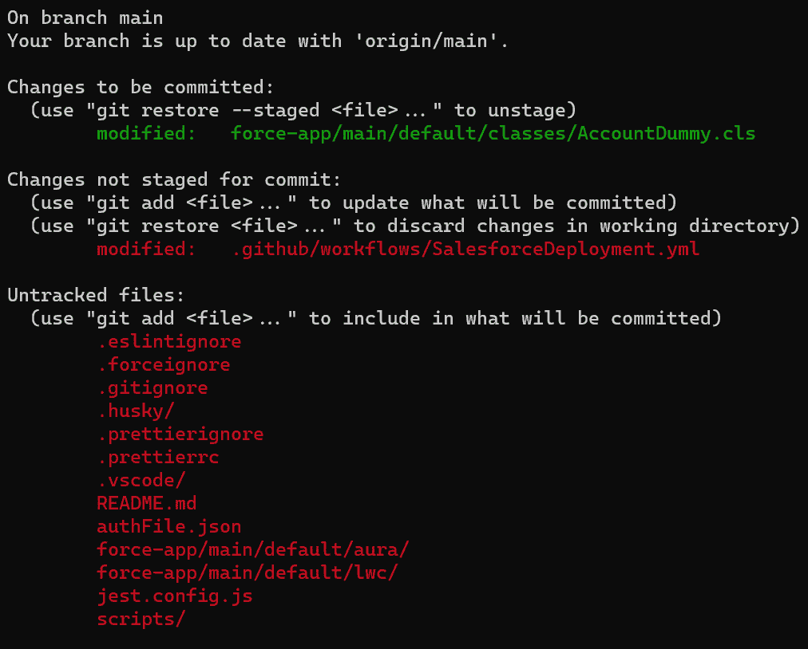
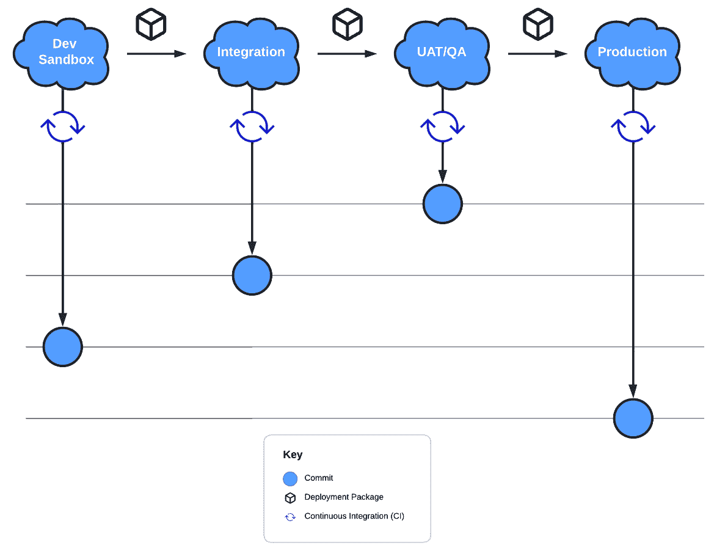
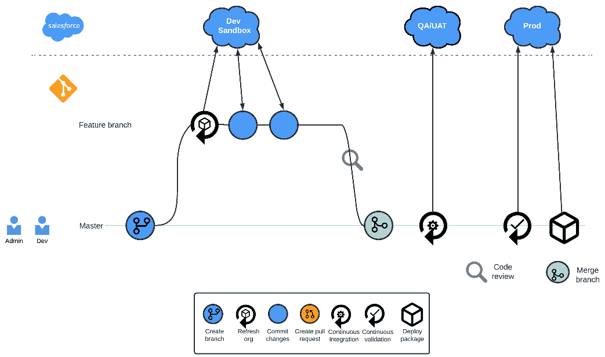
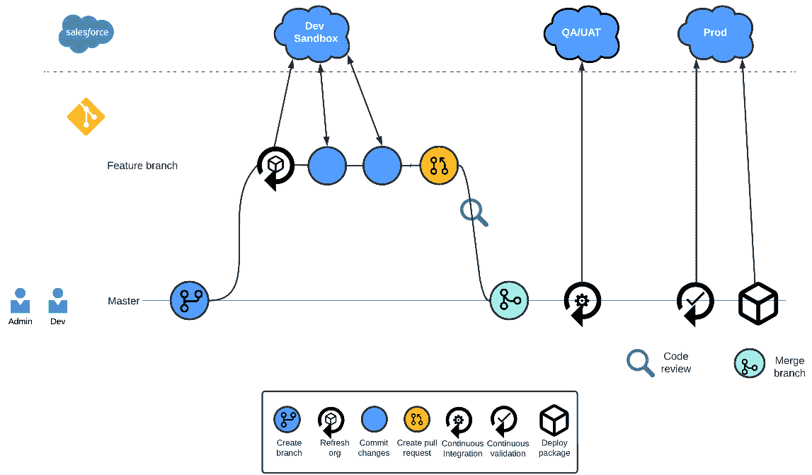
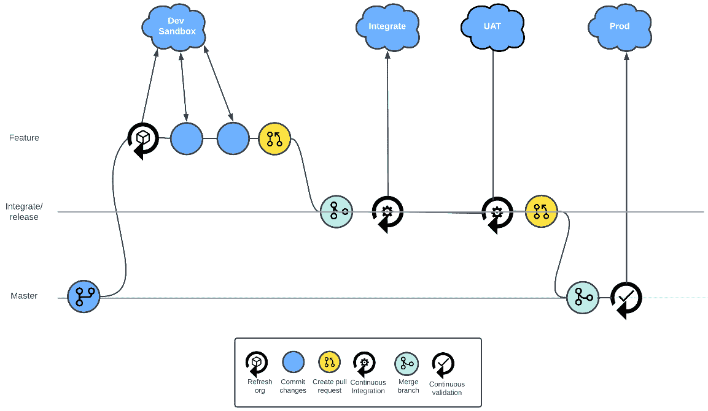
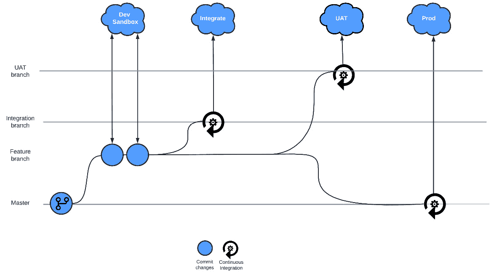

# 第三章：源代码管理的价值

在我们迈向 Salesforce DevOps 的技术细节之前，我们应该从探索**源代码管理**开始。本章将涵盖以下主要内容：

+   为什么源代码管理对实施 DevOps 流程至关重要

+   管理变更的基本 Git 操作

+   成功交付的有效 Git 分支策略与源代码管理

源代码管理，也称为**版本控制**，是现代 DevOps 的技术支柱，所有其他工具和技术都是建立在这个坚实基础之上的。首先讨论这个话题并了解它的一些常见任务后，你将为本书后续讨论的主题打下坚实的基础，例如 CI/CD 自动化。

# 技术要求

本章中的示例都与**Git**源代码管理系统相关，如果你希望跟随学习，建议你安装 Git。同样，推荐使用 Git 托管服务提供商，市面上有许多选择，如 GitHub、GitLab 和 BitBucket。然而，在我们的示例中，我们将使用 GitHub。

# 源代码管理的重要性

尽管从流程角度来看，建立 DevOps 文化是 DevOps 最重要的方面，正如我们在上一章看到的那样，但可以公平地说，源代码管理是最重要的技术方面。它支撑着所有其他工具和技术，推动着成熟的 DevOps 流程，并支持部署、同行评审、回滚以及作为 CI/CD 过程一部分的自动化。让我们来探索源代码管理及其构建的流程所带来的优势。

## 协作

DevOps 从根本上是一种协作的软件开发方法，因此有效的协作至关重要。源代码管理使得多个开发者可以同时在同一个代码库上工作，并能够指示他们在开发阶段可能会发生重叠或覆盖彼此的更改。更改稍后会合并，并且当结合适当的审核时，这样的过程能够实现快速开发并减少缺陷，因为变更会在开发周期的早期进行测试和审核。仅当手动和自动检查通过时，代码才会进入更高的环境，最终部署到生产环境。值得注意的是，与开发环境相比，生产环境中的问题更难追踪，并且处理成本更高。

## 可追溯性

随着良好治理在所有流程和业务中，包括软件开发中的重要性日益增长，软件变更的问责制和审计跟踪的需求也在增加。源代码管理通过记录所有代码和配置的更改历史，帮助实现这一点，详细记录了变更内容、变更人以及（通过提交信息、评论和对如 Jira 等变更管理工具的引用）为什么发生变更。除了这些审计跟踪的好处之外，完整的历史记录还有助于你找到错误和问题的源头。

## 自动化

DevOps 在很大程度上依赖于自动化，而源代码管理为自动化软件开发中许多过程提供了基础，例如构建、测试和部署代码。例如，借助源代码管理，每当提交代码更改时，便可以自动构建、测试并将代码部署到不同的环境中。

## 持续集成

**持续集成**（**CI**）允许开发人员将他们在开发分支或功能分支中的代码更改集成到共享的集成分支中，然后运行自动化测试，确保这些更改不会破坏现有系统。这个过程得益于源代码管理，它使开发人员能够轻松合并他们的更改并跟踪冲突。通过采用这种技术并定期将更改集成到主代码中，开发人员可以更早地发现问题，从而更容易修复它们。

## 持续部署

**持续部署**（**CD**）是一种实践，当代码更改通过 CI 过程后，它会自动部署到生产环境中。这个过程也得益于源代码管理，它使得部署过程能够实现自动化。这可以通过使用通用的 CI/CD 工具（如 Jenkins、Travis CI 和 CircleCI）或者 Salesforce 特定的工具（如 DevOps Center、Gearset 或 Copado）来实现。无论选择哪种工具，它们都可以配置为在代码通过 CI 过程后自动将代码更改部署到生产环境中。这就是为什么 CI 和 CD 通常被归类为 CI/CD 过程的原因。

## 持续交付（也称为 CD）

你可能会听到的另一个与 DevOps 相关的 CD 是 **持续交付**。它与持续部署共享相同的首字母，常常会引起很多混淆。CI/CD 的目标是持续交付：迅速且可靠地向用户交付增强的价值。与持续集成和持续部署不同，持续交付并非工作流程或具体过程，而是定义一种工作文化或方法论。持续交付基于渐进改进的实践，重点在于缩短交付时间并减少开发周期，其中包括来自各方的快速反馈。

这种方法使 Salesforce 团队能够帮助企业迅速且灵活地响应不断变化的优先级和市场前景。CI 和 CD 都是帮助团队实现持续交付的过程。

## 回滚

版本控制允许轻松回滚，这使得当出现问题时，你可以将代码库恢复到以前的版本。如果生产环境中出现了 bug 或其他问题，能够快速且轻松地回滚更改是非常重要的。版本控制通过保持对所有更改的历史记录，使得在需要时可以轻松回到之前的版本。然而，请记住，并不是所有的内容都可以在 Salesforce 中回滚。例如，如果你尝试回滚包含记录类型或新流程的提交，并且该更改已经部署到组织中，那么你可能会遇到回滚问题。记录类型无法通过元数据 API 移除，流程需要你指定版本号才能删除。

## 增量开发

另一大源自版本控制驱动的开发和部署方法的显著优势是它鼓励开发人员增量思考——一次提交一个。这进一步支持了之前提到的许多观点——将更改分成更小的增量进行提交，有助于更轻松地管理和合并其他团队成员的工作，减少代码冲突的可能性。它还使调试和跟踪问题变得更容易，因为你可以将当前版本与上一个提交进行比较，以查看两者之间的差异。最后，它鼓励更好的编码标准，因为较小的提交往往会推动更加模块化、解耦的代码架构。

现在我们已经看过使用版本控制的许多优势，以及它在成熟的 DevOps 流程中的重要性，接下来我们将了解一些核心的 Git 任务和命令，这些任务和命令将使版本控制发挥作用。

# 基本的 Git 操作

在我们深入了解 Git 命令及其应用之前，掌握版本控制的基础知识是至关重要的。

## 提交

提交是项目文件和目录在特定时间点的快照。每个提交都会分配一个唯一的标识符（称为 SHA 哈希），并包括如作者、时间戳和描述性消息等元数据，用以解释所做的更改。

然而，提交不仅仅是静止的时间点。它们还是反映项目演变的一个大叙事的一部分。在 Git 中，提交是按链条链接的，每个提交都引用其前一个提交。这使得你可以遍历项目历史，比较版本，甚至在必要时回滚更改。

## 暂存

在你提交更改之前，需要**暂存**这些更改。暂存区，也称为索引，就像一个准备区，你在提交之前收集和整理更改。暂存更改可以帮助你创建有意义且组织良好的提交，从而清晰地传达你做了什么和为什么这么做。

当你将文件添加到暂存区时，你是在告诉 Git 你希望将该文件的更新包含在下一次提交中。然而，重要的是要注意，Git 会按你暂存该文件时的状态来暂存它。如果你在暂存后继续修改该文件，你需要再次将其暂存，才能将最新的更改包含在下一个提交中。

## 仓库

仓库，通常通过 `git init` 命令在包含源代码的目录中创建。

## 将源代码控制付诸实践

虽然本书并不打算提供 Git 命令和选项的*详尽*概述，但有一些关键操作构成了 Git 的典型使用方式。

首先，重要的是要注意本地仓库和远程仓库之间的区别，因为许多 Git 命令专门用于在两者之间移动更改。

如名称所示，本地仓库存在于本地开发机器上，可以是一个新初始化的仓库，或者是你从另一个（通常是远程）仓库克隆过来的仓库。在该仓库上执行的操作将保持在本地机器上，直到你将这些更改推送到远程仓库。

远程仓库托管在远程服务器上——可能是使用 Git 托管服务商，或者是公司的物理服务器，可能位于公司自己的数据中心。这个远程仓库作为集中式的“真理来源”，其他开发者可以从中获取你的更改，反之亦然。考虑到本地和远程仓库之间的区别，我们可以开始了解一些常见的 Git 操作及执行这些操作的命令。

## 初始化新仓库

任何源代码控制工作流的初始步骤是创建一个仓库来存储你的工作，虽然你可能会处理一个已经存在的仓库，但通过在包含源代码的目录中运行以下命令，你可以创建一个全新的空仓库，本地创建的仓库，你可以开始在其中添加文件：

```
git init
```

## 将新文件添加到暂存区

默认情况下，Git 会认为所有文件都是未跟踪的，并且不属于源代码控制。添加文件（也叫做“暂存”文件）意味着这些文件应作为源代码控制的一部分。暂存这些文件是一个两步过程的第一步——首先，我们添加那些我们打算提交的文件；然后，一旦我们确认所有应归为一个提交的文件都已添加，我们就可以继续进行第二步。

你可以像下面这样将单个文件添加到本地 Git 仓库：

```
git add <file>
```

或者，你可以像下面这样将当前目录中的所有文件添加进去：

```
git add .
```

在这个阶段，直到你提交更改之前，这些更改不会成为本地仓库的一部分，正如下节所示。在这里需要注意的是，当前目录并不等同于本地仓库。尽管本地目录中可能有许多文件，但在你添加并提交这些文件之前，它们并不会成为本地仓库的一部分。

## 提交之前检查所有内容是否已添加

尽管这不是强制要求，但建议养成检查你希望提交的所有内容是否已被添加的习惯。这可以通过使用`git status`命令轻松实现。在以下示例输出中，我们可以清楚地看到已添加的更改、已修改但未添加的更改，以及当前未被追踪的文件。最后一种情况可能是因为这些文件已被添加到`.gitignore`文件中，正如其名称所示，这个文件包含了 Git 应该忽略的文件和路径，或者它们可能是空目录：



图 3.1 – git status 命令的示例输出

## 提交更改到本地仓库

一旦你使用`git add`命令暂存了更改，你可以使用`git commit`命令将这些修改的快照提交到本地仓库。当你提交更改时，重要的是要包含一个描述性的消息，说明提交的目的。这将使你和你的协作人员更容易理解版本控制历史。

许多与 Git 配合使用的工具，包括 GitHub，都会在提交信息中使用某些格式和标签。这些不仅有助于为开发人员提供额外的上下文，还可以驱动工作流集成，例如在错误跟踪工具中。以这种方式编写提交信息需要遵循一定的指南，以保持可读性和有效性。提交信息通常包括一个标题或主题、提交的类型（如`feat`、`fix`、`docs`等）、一个可选的范围来指定变更的区域，以及简洁描述变更的主题。它还可以包含详细的解释性正文和一个引用相关问题 ID 的页脚。主题和标题通常限制为 50 个字符，正文在 72 个字符处换行。提交信息应简洁明了，解释提交的内容和原因。要通过提交信息提交暂存的更改，请使用以下命令：

```
git commit -m "Commit message"
```

你可以使用`git log`命令查看提交到仓库的历史记录。默认情况下，它将显示一个 SHA-1 校验和，以及每次提交的作者、日期和提交信息。然而，Git 提供了许多选项用于过滤和搜索日志，你可以在 Git 的内置文档中找到所有这些选项。

## 连接你的远程仓库

在我们将更改提交到本地仓库后，我们需要确保远程仓库已正确连接，并且准备好推送我们的更改。如果尚未连接，我们可以使用`git remote`命令将其连接，并为其提供一个工作别名。通常，这个别名被称为`origin`，但你也可以使用任何你喜欢的名称。以下是这个命令的示例：

```
git remote add origin https://github.com/myuser/myrepo.git
```

该命令通过`origin`别名连接到我们指定 URL 的远程仓库。

## 将更改推送到远程仓库

一旦你确认本地的更改是稳定且经过充分测试的，你可以使用`git push`命令将这些更新传送到远程仓库。这确保了你的更改能够与其他协作者共享，并使得任何有权限访问该仓库的人都可以访问更新后的代码。

要执行`git push`操作，只需在终端或命令提示符中运行以下命令：

```
git push
```

默认情况下，该命令会将更改推送到你本地仓库当前检出的远程仓库分支。但是，如果需要，你也可以指定要推送到的远程仓库和分支：

```
git push <remote> <branch>
```

## 从一个分支合并更改到另一个分支

如果你正在使用一个已存在的 Git 仓库，可能会在与主分支不同的分支上工作——我们将在本章中探讨几种常见的分支策略。

如果是这种情况，你最终需要将更改合并到主分支中，这可以通过`git merge`命令实现。这确保主分支将你的分支中的更改合并进来，且没有冲突。Git 会自动尝试合并更改，但如果出现冲突，你将需要手动解决。

手动解决冲突涉及到逐一查看包含冲突的文件，比如两个分支都更改了的代码行，并决定最终应该保留哪个版本。Git 会自动在文件中添加`<<<<<<<`、`=======`和`>>>>>>>`标记，表示冲突所在的区域。以下代码片段展示了一个典型的例子：

```
public class ExampleClass {
    public void doSomething() {
<<<<<<<
        System.debug('This is the current branch code.');
=======
        System.debug('This is the code from the branch being merged.');
>>>>>>> branch-to-merge
    }
}
```

第一个标记表示冲突行的开始。第二个标记作为冲突版本之间的分隔符——标记前的内容属于当前分支，标记后的内容属于待合并的分支。

为了解决冲突，删除冲突标记并编辑代码，使其反映你希望保留的版本。考虑更改的上下文和意图非常重要。因此，建议尽可能与冲突更改的作者进行沟通。

## 合并策略

在处理分支之间的更改合并时，值得简要了解一下合并策略。这些是 Git 用于确定如何处理冲突更改并将其合并的不同方法，同时也是它如何管理合并过程中不同情况的方式。以下是一些例子，虽然还有许多其他策略：

+   **递归**：递归策略是 Git 的默认策略，适用于大多数常见场景。它分析两个分支的提交历史，以确定分支分歧前的共同起点，然后应用两个分支的更改。如果在过程中遇到冲突，它会提示进行手动干预。

+   **章鱼**：章鱼策略用于将多个分支合并为一个分支。例如，你可能想将多个特性分支合并到一个发布分支中。

+   **解决**：解决策略与递归策略类似，它会尝试自动合并更改，并在检测到冲突时暂停以进行手动干预。然而，这一策略的不同之处在于，它不会递归分析提交历史。

+   **我们的**：我们的策略旨在优先考虑被合并的分支。与其他策略一样，它会在没有冲突的情况下自动合并，但如果发生冲突，它会丢弃来自进入分支的更改，保留当前版本。正如你可能已经猜到的那样，与此相对的策略是优先考虑进入更改的**他们**策略。

+   **子树**：子树合并策略用于将远程仓库的更改合并到当前仓库的子文件夹中。这在非常模块化的项目中或希望将代码库集成到更大项目中的情况中特别有用。

这些策略只是 Git 中可用的合并选项的一部分。你可以通过使用命令行选项或配置设置来选择所需的合并策略。你选择哪种合并策略取决于项目的具体需求和复杂性。

## 创建新分支

正如我们将在下一节关于分支策略中看到的，当你准备开始处理新特性、修复 bug 或其他更改时，创建一个新分支（通常称为**特性分支**）是一个常见做法。这样可以确保你的工作与主分支隔离，主分支通常更加稳定并且适用于生产环境。

要创建一个新分支，你可以使用`git branch`命令，后跟所需的分支名称：

```
git branch <branch_name>
```

## 切换到另一个分支

要从当前使用的分支切换到另一个分支，只需检出该分支，如下所示：

```
git checkout <branch_name>
```

另外，你可以使用`-b`标志通过单个命令创建并切换到新分支：

```
git checkout -b <branch_name>
```

现在你已经创建并切换到新的分支，你可以开始修改代码库，而不会影响主分支。一旦工作完成并经过测试，你可以将特性分支合并回主分支，从而确保版本控制历史的清晰和有序。

## 查看提交历史

`git log` 命令可以让你查看当前分支的所有提交历史——这包括直接提交到该分支的提交、从其他分支合并过来的提交，或者从创建该分支的原始分支所做的提交。你可以这样查看这些历史记录，包括任何提交消息：

```
git log
```

## 回滚到文件的先前版本

你可以将特定文件回滚到先前的版本，而不是回滚包含多个文件更改的整个提交。通过使用提交历史中显示的提交哈希值和你想恢复的文件名，你可以将文件检出，如下所示：

```
git checkout <commit_hash> <file>
```

## Git 变基

**git rebase** 是一种将一个分支的更改集成到另一个分支的方法。它通过将特性分支的提交重放到基础分支之上，替换特性分支为一个更新版本，该版本包含基础分支的所有更改。

`git rebase` 的主要原则是保持线性历史，这使得理解和追踪代码随时间变化的更改更加容易。线性历史意味着没有合并提交（合并时创建的一种特殊类型的提交，用以维持两个分支历史的延续），只有一条直线的提交记录。

`git rebase` 还有助于解决在合并时可能出现的冲突。它不会创建合并提交，而是将提交逐一重放到基础分支之上，这样有助于更容易地解决冲突。需要注意的是，`git rebase` 会修改现有的提交，如果其他人已经拉取了特性分支，可能会引发问题。*因此，建议仅在尚未与他人共享的分支上使用 git rebase* *。*

总结来说，`git rebase` 是一个强大的命令，可以帮助保持 Git 历史的简洁和易于理解，但*应该谨慎使用*。现在我们已经了解了基础的 Git 命令及其在工作流中的应用，接下来我们来讨论分支策略。

# 有效的 Salesforce 分支策略

在版本控制中开发特性时，分支策略为如何使用和管理分支制定了指南。然而，并没有一种适用于所有团队的单一策略。适合你团队的最佳策略将取决于多个因素，比如团队规模、团队结构/复杂性、期望的发布计划和当前的工作流。

例如，较大的团队可能需要更复杂的策略来适应不同的角色，而较简单的策略可能更适合较小的团队。此外，业务需求可能要求特定的发布周期，分支策略应能够满足这些需求。此外，重要的是要考虑您当前的工作流程和环境设置（例如，沙盒的数量）如何与所选择的分支策略保持一致。

## Git 作为备份

我们可以考虑的第一个策略是使用 Git 作为你的 Salesforce 元数据的轻量级备份。这种方法通常是团队在开始对其元数据进行版本控制时采取的初始步骤。他们为每个环境建立一个分支，并开始将元数据从他们的组织转移到这些分支上。

虽然这是将元数据输入 Git 的一个很好的初始方法，但是开发生命周期并非真正源驱动。版本控制在这里不是主要的真实来源，而是对已发生更改的回顾记录。它仍然有用，但为了充分利用 Git 的好处，重要的是确保一旦开发了更改，就将它们放入版本控制中，以促进在环境之间的平稳流动。此外，这种模型通常会导致孤立的环境分支，在这些分支中，更改不会在源控制中进行交换。因此，从这种模型过渡到建立源控制作为真实来源的模型可能会具有挑战性。这主要是因为每个组织分支中的同一文件缺乏共享的提交历史，这可能会使 Git 难以处理它们。

例如，使用这种工作流程，很难适应多个功能的并行开发流。在这种模型中没有拉取请求，这使得您可以轻松地将同行评审集成到工作流程中。

此外，由于不会定期从版本控制中部署更改到环境中，因此可能会对通过从版本控制中部署旧版本来回滚发布的能力缺乏信心。

需要记住的是，版本控制主要是为了帮助团队创建、跟踪和部署新功能。不能把它视为灾难恢复目的的 Salesforce 环境的全面备份，因为这是综合 DevOps 策略中备份解决方案的角色。

您可以在以下图表中看到使用 Git 作为备份的示例，以及分支如何反映您的 Salesforce 环境：



图 3.2 – Git 作为备份

## 基于主干的开发

在**主干开发**（**TBD**）中，所有开发者都在一个单独的分支上工作，这个分支被称为**主干**或**主分支**。功能开关用于隐藏未完成的工作。分支的生命周期较短，并会尽快合并回主分支。尽管每天（甚至一天多次）将工作合并到主分支的想法可能看起来令人畏惧，但许多团队发现，TBD 的好处远远超过了最初的不适应。采用 TBD 可以促进更多的合作、更高质量的代码以及更加简化的开发过程。

在 TBD 中，开发者为新功能或修复创建分支，但这些分支的生命周期较短。它们会尽快合并回主分支，通常在一天内。为了避免未完成的功能被推送到生产环境，TBD 使用功能开关（也叫功能标志）。这使得团队可以隐藏功能，直到它们准备好投入生产使用。由于每个人都频繁将他们的更改合并到主分支中，因此需要持续集成（CI）。自动化测试确保主分支始终处于可发布状态。你会注意到，这种方法的图示（见*图 3.2*）与功能分支的图示（见*图 3.3*）非常相似。两者之间的根本区别在于，TBD 的分支范围更为细化，生命周期也更短：



图 3.3 – TBD

## 功能分支模型

功能分支模型是一种基本的开发方法，它将 Git 集成到开发过程中，而不仅仅是用于备份。虽然一些团队可能选择更复杂的分支方法，但由于其简单性，功能分支模型是一个很好的起点。主分支是唯一的长期存在的永久分支。当你在开发新功能或修复时，会从主分支创建一个独立的分支，完成后将其合并回主分支。

在这种模型中，最好将功能分支的生命周期保持尽可能短，并在使用后删除它们以保持清洁。大的功能应该分成更小的块，一次实现一个，以缩短反馈周期并减少合并冲突的可能性。需要注意的是，主分支中的任何失败都会阻碍整个发布过程，因为它依赖于所有生产就绪的测试都在每个功能分支上进行，而这并不总是现实的。

主分支通常通过 CI 流程自动部署到预发布环境，使最新版本可供测试。一旦预发布环境中的版本令人满意，就可以从主分支部署到生产环境，将更改发布给最终用户。作为一种选择，在部署到生产环境之前，可以将更改部署到**用户验收测试**（**UAT**）或**质量保证**（**QA**）环境中进行进一步测试。

以下图示显示了一个典型的功能分支模型，以及该分支中的更改如何重新集成到主分支中，以便在你的 Salesforce 环境中部署。



图 3.4 – 功能分支模型

## 受保护的主分支模型

受保护的主分支模型类似于功能分支模型，但它包括一个额外的长期存在的集成分支，在合并到主分支之前进行集成。在这种模型中，主分支在所有内容完全测试并准备好发布之前不会更新。主分支是一个更安全的真相来源，因为只有在用户验收测试（UAT）中经过彻底测试的工作才会被纳入该分支。

然而，这种模型的一个缺点是，如果某些更改尚未准备好，无法只传播一部分更改。如果某些工作已经在 UAT 中经过测试和批准，而其他工作还未准备好，那么很难选择性地将更改推广到主分支。相反，必须从发布分支中恢复尚未准备好的功能。这种刚性是许多团队关切的主要问题，这也是为什么这种模型不那么流行的原因。如果你发现自己需要定期选择性地推广更改，那么你可能没有为你的工作方式选择合适的分支策略。

以下图示展示了受保护的主分支方法，其中包括一个单独的集成分支，用于在更改进入生产环境之前进行测试：



图 3.5 – 受保护的主分支模型

## 扩展的分支模型

在将分支隔离的过程中，扩展的分支模型包括几个额外的长期存在的分支，这些分支分别对应集成和 UAT/QA 环境。功能分支不会直接合并到主分支，而是先合并到集成分支中。为了将已准备好的更改顺利推进到下一个环境，它们会先合并到 UAT/QA 分支，然后再合并到主分支。

这种方法可以更精确地控制哪些更改会被部署到每个环境，并允许对每个请求中的更改进行独立评估。扩展的分支模型非常适合那些更重视门控和质量控制而非频繁发布的团队。然而，像我们之前看到的其他分支策略一样，它也有一些重要的注意事项，特别是当遇到合并冲突时。例如，如果在合并到 UAT 时发现合并冲突，那么必须将整个 UAT 分支合并，以解决冲突，这意味着随后合并到主分支时，UAT 分支的所有内容都会被带入，无论这些内容是否已经准备好发布。

你可以在以下图示中看到分支与 Salesforce 环境之间的关联：



图 3.6 – 扩展分支模型

## 比较分支策略

那么，让我们回顾并总结这四种方法：

+   将 Git 用作备份是显而易见的：我们使用它作为一种机制，将我们的元数据保存到平台之外，从而允许我们回滚更改——虽然如果变更距离当前有好几次 Git 提交，并且存在深层依赖关系时，这并不容易。它也未能提供源驱动开发方法的主要优势。

+   TBD 方法提供了一系列优势，可以简化并加速软件开发。通过促进短生命周期分支的频繁集成，它大大减少了“合并地狱”现象的发生——即经常让人头痛的冲突变更情况。由于大部分工作都在主分支上进行，变更的可见性也得到了极大的提升，从而使得开发人员可以更清楚地了解变更如何影响项目。TBD 通过消除维护多个长期分支的需求，简化了开发过程，并使主分支始终处于可发布状态，从而支持随时部署，进而实现更快的功能交付。

+   特性分支模型非常适合快速迭代的团队——我们内部也在使用该模型，这让我们能够每天交付变更，或者更频繁地交付。如果你的流程需要更多的阶段性检查和验证，那么这种方式可能不适合你的较长开发周期。

+   保护主分支模型有多个测试环境和一个集成分支来支持它们，这意味着你的主分支或主干分支是事实来源。然而，这个模型仍然充当了一个队列，长周期测试的项目可能会阻塞其他变更，直到它们被推进。

+   扩展分支模型允许更为异步的变更方式，每个独立的工作单元可以在环境中流动。这让类似于“Bob，我们在 Jira 34533 上进展如何？”的问题能够被准确回答，比如“它正在 UAT 环境中，等待生产发布的签署，Sarah。”

# 总结

在本章中，我们探讨了源代码管理为何对 DevOps 的采用至关重要：

+   **协作**：DevOps 强调软件开发中的协作。源代码管理允许多个开发人员并行工作在同一代码库上，而无需干扰彼此的更改。通过在后期合并和审查变更，团队能够实现更快的开发并减少缺陷。

+   **可追溯性**：软件开发中对治理的需求日益增长，这要求具备问责制和审计追踪。源代码管理提供了代码和配置变更的完整历史记录，包括关于谁、什么、为什么的详细信息。这不仅有助于审计，还帮助识别错误和问题的来源。

+   **自动化**：DevOps 强调自动化，源代码管理作为自动化软件开发过程（如构建、测试和部署代码）的基础。这使得在提交更改到代码库后，可以自动执行这些任务。

+   **持续集成**：持续集成（CI）使开发人员能够频繁地将代码更改合并到共享仓库，并运行自动化测试，源代码管理在此过程中提供了便利。这种做法有助于及早发现和解决问题，从而简化开发流程。

+   **持续部署**：持续部署（CD）在通过持续集成（CI）测试后，自动将代码更改部署到生产环境，并通过源代码管理实现自动化。这种 CI 和 CD 的集成形成了 CI/CD 流水线。

+   **回滚**：源代码管理通过维护代码库历史记录来简化回滚操作，使您能够在生产环境中出现漏洞或问题时迅速恢复到先前的版本。这确保了您可以高效且可靠地处理意外问题。

接下来，我们探讨了一些您在创建 Salesforce 组织更改时可能会定期使用的典型 Git 操作。最后，我们还讨论了一些适用于 Salesforce 开发的常见 Git 分支策略，以及每种策略的优缺点。

在下一章，我们将探讨成熟的 Salesforce DevOps 流程中的下一个基本部分——有效地测试您的更改，以确保高质量的交付物。
