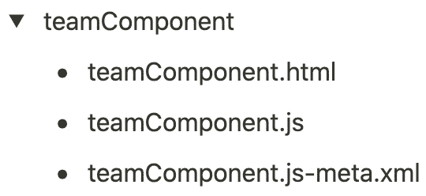
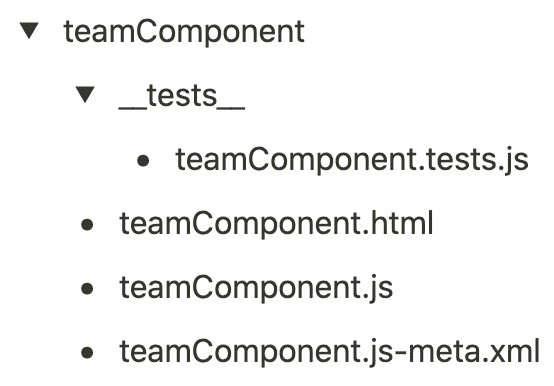
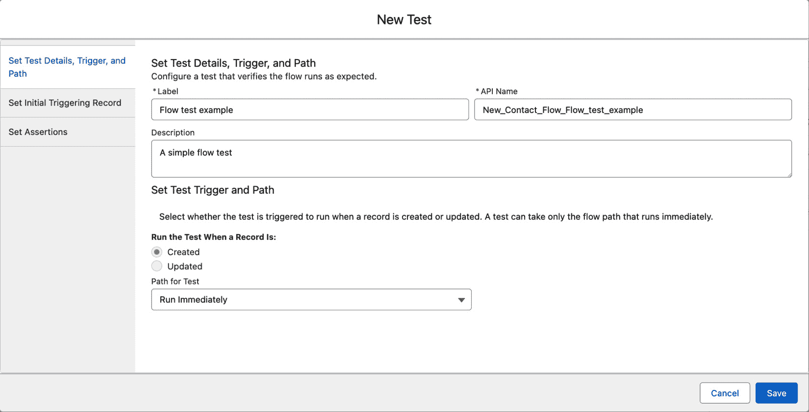
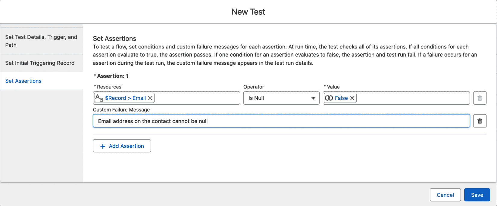

# 4

# 测试你的变更

DevOps 的核心原则之一是能够交付经过严格审查、缺陷更少的强大变更，最终减少**变更失败率**（**CFR**）指标。这可以通过测试我们的开发变更在很大程度上实现。

在本章中，我们将探讨对 Salesforce 变更进行全面测试的重要性，适用于你组件的不同测试类型，以及如何确保在 DevOps 过程中进行适当的测试。

我们将覆盖以下主要主题：

+   测试的重要性

+   Apex 测试

+   测试你的**Lightning Web** **组件**（**LWCs**）

+   测试你的流程

到本章结束时，你应该能够在 Salesforce 中创建并运行测试，覆盖你实现的许多功能，无论是编程实现还是声明式实现。这将有助于你在 DevOps 过程中成熟后交付更高质量的部署。

# 技术要求

如果你想跟随本章中的示例进行操作，至少需要安装以下软件：

+   Salesforce CLI

+   Visual Studio Code

+   Salesforce 扩展工具适用于 Visual Studio Code

此外，对于*测试你的 LWC*部分，你需要安装 Node.js（这将包括**Node 包管理器**（**npm**））。

# 测试的重要性

传统的观点认为，软件缺陷越早发现，修复起来越容易，其可能产生的影响和成本也越小。通常称之为**左移**方法——即在一个从左到右的流程图中，越早处理问题越好——这个理念是通过将强大且全面的测试纳入你的 DevOps 工作流，你有更好的机会尽早发现潜在问题。这种方法不仅适用于 Salesforce 变更的功能测试，也适用于你设计和开发的安全方面——这也是在更广泛的 IT 行业中被称为*DevSecOps*的部分内容。

如果我们从我们在*第二章*讨论的 DORA 指标的角度来看测试的影响，我们可以很容易地看出测试直接影响 CFR 指标。简而言之，你的变更经过充分测试，部署到后续环境中的错误发生的可能性就会降低。我在多年的软件开发中常常使用“*尽早测试，频繁测试*”这句话来很好地总结我的方法。

当我们从更广泛的 DevOps 角度来看待测试时，重要的是要考虑它不仅仅在应用生命周期的开发或交付阶段，而是贯穿于从设计到交付的每一步。作为架构师，我们应该在实施任何变更之前，就开始从思想上测试需求和设计——找出漏洞和缺陷是 Salesforce 架构师最重要的技能之一。通过确保请求有效且其设计经得起推敲，且问题得到了令人满意的解答，您已经在很早之前就测试了这个方案。这被认为是在投入开发者时间（及成本）之前发现缺陷的最经济的时机。它可以被视为软件开发领域的“*量好两次，裁剪一次*”，这一说法在建筑行业中也常被引用。

测试涉及的方面种类繁多，应作为您整体应用交付模型的一部分进行考虑。我们将在这里讨论一些特定于 Salesforce 平台技术栈的测试，但作为架构师，您应该考虑以下几种测试类型，以全面了解测试。

## 集成测试

彻底的集成测试对于验证不同组件和系统能否按预期协同工作至关重要。对于 Salesforce 项目，关键的集成测试包括 Salesforce 与外部数据库、第三方 Web 服务之间的连接，Salesforce 产品（如 Sales Cloud 和 Service Cloud）之间的交互，以及自定义 Lightning 组件或其他自定义功能的测试。

使用自动化的 API 和 UI 测试、**端到端**（**E2E**）流程验证，以及人工抽查相结合的方式，确保所有集成点从端到端始终按设计功能运作。跨系统导入和导出数据，检查数据的准确性和完整性。如有可能，向 Web 服务发送测试请求，验证响应处理，或者作为备选，提供这些请求的模拟响应。

## 回归测试

回归测试帮助验证在进行更改后，现有的功能和集成功能是否仍按预期工作。在部署重大更新、新功能或结构性变更（如修改权限或记录共享规则）后，应优先进行回归测试。通过构建自动化的回归测试套件，使其快速且频繁地运行，重点关注最可能受到更改影响的关键业务流程和集成点，您可以快速检查并解决任何破坏性变更。

使用自动化 UI 测试、Apex 测试以验证逻辑和处理程序、跨浏览器测试，以及 Salesforce API 检查数据验证，并将回归测试集成到部署流水线中，自动运行。

回归测试能够确保系统在持续改进和变更过程中保持稳定。

## 用户验收测试

**用户验收测试**（**UAT**）通常需要一个专门的 Salesforce 沙箱环境，里面有测试数据、角色和模拟的真实使用模式的流程。要让真实用户参与 UAT，以验证新功能是否满足业务需求，才能正式发布。在 **业务单元**（**BUs**）中，找出关键用户，作为 UAT 测试人员，他们对需求和工作流程有深入了解。

一定要制定正式的测试计划和报告，以确保充分的真实环境验证。在 UAT 测试过程开始之前，您应当为测试人员提供账户访问权限、样本数据和清晰的测试场景，并将其映射到业务用例。

跟踪并分类所有在 UAT 过程中发现的问题，明确与用户的需求，并在继续生产部署之前解决这些问题。需要注意的是，在许多较大的组织中，这一过程通常由业务分析师或专门的测试人员完成，而不是架构师（架构师的角色更多是监督过程并确保其顺利进行）。

## 大规模测试

特殊测试是必需的，以确认 Salesforce 平台能够处理大数据量和高用户负载。在测试环境中使用实际的大型数据集来验证性能和在大规模下的稳定性。将数据库加载到预期的最大数据大小，并导入具有代表性的样本数据。使用性能测试工具来模拟并发用户的高峰数量，识别治理限制或瓶颈。优化配置以支持缓存、索引和可扩展性最佳实践。随着数据量的增加，检查性能是否有所下降，并根据需要进行调优或增加资源。通过大规模测试模拟生产级使用情况，有助于验证系统是否能支持业务增长。

在 Salesforce DevOps 的世界里，最常见的两种测试类型是单元测试和端到端（E2E）测试，但正如我们接下来将看到的，其他重要的测试，如集成测试和回归测试，也应该纳入考虑范围。

单元测试集中于验证应用程序中的各个独立功能——这些功能通常与您正在开发的具体更改相关。需要注意的是，Salesforce 强制要求在整个组织内，Apex 测试覆盖率至少达到 75% 才能进行生产部署，更重要的是，这并不保证功能是正确的。编写不好的测试可能会掩盖或扭曲实际问题，因此单元测试只能被视为整体测试策略的一部分。此外，如果您指定了某些特定的测试类作为生产部署的一部分，那么每个被部署的 Apex 类都需要单独达到 75% 以上的覆盖率，而不是依赖于组织级或甚至部署包级的平均覆盖率。这更加证明了需要尽可能争取更高的覆盖率百分比。

单元测试在你将应用程序构建为小的、可测试的单元时效果最佳，而不是将其构建为单体的 Apex 类、流程，甚至是对象。创建简短、快速的单元测试，这些测试可以轻松执行，能够激励开发人员将其纳入开发、回归测试和**持续集成**（**CI**）过程中。因此，缺陷会被更早发现并解决。

# Apex 测试

编写没有适当测试的 Apex 代码可能会导致问题，比如缺陷和错误，这可能会负面影响用户体验，并最终损害项目的整体成功。在这方面，Apex 单元测试是开发过程中至关重要的一部分，帮助确保代码按预期运行，满足要求，并能处理不同的场景。在这方面，Apex 单元测试对于在 Salesforce 中创建高质量、强健且可维护的代码至关重要。

这些测试应该设计成模拟正面和负面场景。这意味着代码不仅要测试它是否能按预期完成任务，还要测试它*不会*做它不应该做的事。此外，Apex 单元测试应该编写成在单一上下文或批量上下文中进行测试，也就是说，它们可以测试单个记录或一次多个记录。为了提高测试效率并隔离被测代码，可以使用模拟和桩来模拟外部依赖，例如 Web 服务或数据库操作。通过编写覆盖所有可能场景的全面单元测试，并采用如模拟测试等最佳实践，Salesforce 开发人员可以构建可靠、可维护和可扩展的应用程序。

如前所述，Salesforce 要求代码的单元测试覆盖率至少为 75%，但作为优秀的架构师，我们应该始终争取尽可能接近 100%的覆盖率。现实情况是，确实会有一些角落案例是无法通过单元测试触及的——通过瞄准 100%的覆盖率，这些案例会落入高标准和要求的 75%之间的缓冲区，因此我们在编写良好的单元测试时，永远不应该有不足的覆盖率。

为了说明一个简单的 Apex 单元测试示例，首先，考虑以下 Apex 类。它包含一个静态方法，用于计算购物车中产品的总价格。这些产品使用一个`Product__c`自定义对象，该对象包含一个`Price__c`自定义字段——为了示例说明，这个自定义对象比标准的`Product2`对象及其关联对象要简单得多：

```
public class ShoppingCart {
    public static Decimal calculateTotal(List<Product__c> products) {
        Decimal total = 0;
        if (products != null) {
            for (Product__c p : products) {
                if (p.Price__c != null) {
                    total += p.Price__c;
                }
            }
        }
        return total;
    }
}
```

一个初步尝试的对应单元测试类，包含单个测试和批量化测试，覆盖了正面和负面场景，可能看起来是这样的：

```
@isTest
private class ShoppingCartTest {
    @isTest
    static void SingleProduct() {
        // Create a single product
        Product__c p = new Product__c(Description__c='Product A', 
        Price__c=100);
        insert p;
        // Calculate the total price
        Decimal total = ShoppingCart.calculateTotal(new 
        List<Product__c>{p});
        // Verify that the total is correct
        Assert.areEqual(100, total, 'Total should be 100');
    }
    @isTest
    static void testMultipleProducts() {
        // Create multiple products
        List<Product__c> products = new List<Product__c>{
            new Product__c(Description__c='Product A', Price__c=100),
            new Product__c(Description__c='Product B', Price__c=50)
        };
        insert products;
        // Calculate the total price
        Decimal total = ShoppingCart.calculateTotal(products);
        // Verify that the total is correct
        Assert.areEqual(150, total, 'Total should be 150');
    }
    @isTest
    static void testNullProducts() {
        // Calculate the total price with null products
        Decimal total = ShoppingCart.calculateTotal(null);
        // Verify that the total is zero
        Assert.areEqual(0, total, 'Total should be 0');
    }
    @isTest
    static void testProductsWithoutPrice() {
        // Create a product without a price
        Product__c p = new Product__c(Description__c='Product A');
        insert p;
        // Calculate the total price
        Decimal total = ShoppingCart.calculateTotal(new 
        List<Product__c>{p});
        // Verify that the total is zero
        Assert.areEqual(0, total, 'Total should be 0');
    }
}
```

在这个示例中，单元测试类包含四个测试方法：`testSingleProduct`、`testMultipleProducts`、`testNullProducts` 和 `testProductsWithoutPrice`。前两个方法分别使用不同数量的产品来测试 `calculateTotal` 方法，而第三个和第四个方法则分别使用空值和不完整的产品数据来测试。使用单个和批量化测试相结合，确保代码能够处理不同的场景并良好扩展。此外，正面和负面流程的结合使用有助于确保代码能够处理预期的和意外的输入数据。

尽管这个测试类能够正常工作，但许多代码场景将受益于一个 `@testSetup` 方法，用于创建测试中使用的数据。测试结束时，这些数据会被回滚。

如果我们考虑以下触发器和相应的处理程序类——这个示例是用于说明，并不是一个实际的应用案例——我们可以为它创建一个利用 `@testSetup` 注解的测试类。触发器、处理程序类及其测试在这里显示：

```
trigger ProductTrigger on Product__c (before insert, before update, after insert, after update)
{
  if (trigger.isBefore)
  {
    if (trigger.isInsert)
    {
      //before insert logic
    }
    else if (trigger.isUpdate)
    {
      //before update logic
    }
    }
  else if (trigger.isAfter)
  {
    if(trigger.isInsert)
    {
      //after insert logic
    }
    else if (trigger.isUpdate)
    {
      //after update logic
    }
  }
}
public with sharing class ProductTriggerHandler
  {
    public static void beforeInsert(List<Product__c> products)
  {
    Decimal total = 0.0;
    for(Product__c prod : products)
    {
      total += prod.Price__c;
    }
    System.debug(total);
  }
}
@isTest
public with sharing class ProductTriggerHandlerTest
{
    @TestSetup
    static void setup()
    {
        // Create multiple products
        List<Product__c> products = new List<Product__c>{
            new Product__c(Description__c='Product A', Price__c=100),
            new Product__c(Description__c='Product B', Price__c=50)
        };
        insert products;
    }
    @isTest
    static void testTotal()
    {
        List<Product__c> products = [SELECT Id, Description__c, 
        Price__c from Product__c];
        Decimal total = 0.0;
        test.startTest();
        for(Product__c prod : products)
        {
            total += prod.Price__c;
        }
        Assert.areEqual(150, total, 'Total should be 150');
    }
}
```

使用这种方法，`@testSetup` 注解用于创建多个产品，这些产品在后续的测试方法中使用。这避免了在每个测试方法中重复创建产品记录，使测试代码更加高效且易于阅读。我们原始测试类中的前两个测试方法现在依赖 `@testSetup` 方法来创建产品并计算总价格，而剩余的方法则测试不同的场景。使用 `@testSetup` 有助于确保测试数据的一致性，使得测试更可靠。

我们可以通过使用 `test.startTest()` 和 `test.stopTest()` 方法进一步改进这个测试类。这些方法用于分隔每个测试方法的设置阶段和执行阶段，应该在专门执行我们希望测试的代码之前和之后立即调用。这可以确保通过 `Limits.get*()` 方法捕获的性能指标以及由测试方法启动的异步操作是独立的，不会与测试执行前后进行的其他操作混合。使用 `test.startTest()` 和 `test.stopTest()` 也有助于避免在测试执行过程中触发治理限制，特别是在测试批量数据操作时。

在 Apex 单元测试中，仔细和勤奋地测试是非常重要的，但正如我们将在下一部分看到的，这不应是唯一应用质量承诺的地方。我们将从测试 LWC 开始。

# 测试你的 LWC（Lightning Web Components）

虽然 Salesforce 仍然有多种方法来开发 Lightning 组件，但我们将专注于测试 LWC，而不是较旧的 Aura 组件。Salesforce 于 2018 年 12 月发布了 LWC，并在 Salesforce Spring ’19 版本中推出。这一消息在 2018 年 12 月 13 日由 Salesforce 发布的博客文章中宣布，标题为《Introducing Lightning Web Components》，可在 [`developer.salesforce.com/blogs/2018/12/introducing-lightning-web-components`](https://developer.salesforce.com/blogs/2018/12/introducing-lightning-web-components) 阅读。

在测试 LWC 时，我们可以利用这种组件架构基于更常见的 JavaScript 标准和开放框架的事实。这使得我们能够使用流行的 Jest 测试框架来编写单元测试（[`jestjs.io/`](https://jestjs.io/)），该框架在 Salesforce 之外的更广泛的 JavaScript 社区中也已经在使用。Jest 本身是用 JavaScript 编写的，使用 Node.js 引擎执行，并使用 npm 进行安装和管理其依赖项。

在 Salesforce 的世界里，有一个名为 `sfdx-lwc-jest` 的插件，它可以让你轻松地将 Jest 及其依赖项添加到 Salesforce 项目中。

如果你在项目目录中运行以下命令，它将安装必要的 npm 工具和 `@salesforce/sfdx-lwc-jest` 包：

```
 sf force lightning lwc test setup
```

在你的项目中设置了运行 Jest 测试的能力后，你需要为 LWC 配置一些测试。这些测试在开发机器上本地运行，独立于 Salesforce，这使得在项目开发阶段运行它们更加容易，同时也便于将它们作为你在 DevOps 流水线中添加的任何测试自动化的一部分。

如果你使用标准模板创建了一个 SFDX 项目，它已经准备好了所有这些可以编写的 Jest 测试。`project.json` 文件和 `.forceignore` 文件已经配置好。这也会创建一个 `__tests__` 目录和一个测试文件框架。然而，如果你没有从模板创建项目，接下来的步骤将详细介绍如何创建适当的结构——在大多数情况下，模板会为你处理这些。

你的第一项任务应该是在每个组件的顶级文件夹下创建一个 `__tests__` 文件夹。例如，考虑这个 LWC 文件夹结构示例：



图 4.1 – 没有测试的示例 LWC 文件夹结构

在这个示例中，添加所需的 `__tests__` 文件夹后，结构会变成这样：



图 4.2 – 相同的 LWC 文件夹结构，包含测试文件夹和文件

您还应该在项目的`.forceignore`文件中添加一个通配符路径指向`__tests__`文件夹，因为您不应该将 Jest 测试部署到 Salesforce 组织中——事实上，如果您尝试这么做，系统会抛出错误。将以下行添加到`.forceignore`文件中应该能解决这个问题：

`**/``__tests__/**`

接下来，您需要在项目的`package.json`文件中的`script`部分添加以下行：

`"``test:unit": "sfdx-lwc-jest"`

您的项目现在已经配置好可以运行 Jest 测试，接下来我们将讨论如何为您的组件构建这些测试。

## 一个 Jest 测试示例

现在我们已经设置好了运行 Jest 测试的前提条件，接下来可以查看之前展示的`teamComponent`组件的一个轻量级示例测试：

```
import { createElement } from 'lwc';
import teamComponent from 'c/teamComponent';
describe('c-team-component', () => {
    afterEach(() => {
        // The jsdom instance is shared across test cases in a single 
        // file so reset the DOM
        while (document.body.firstChild) {
            document.body.removeChild(document.body.firstChild);
        }
    });
    it('renders the correct message', () => {
        const element = createElement('c-team-component', {
            is: teamComponent
        });
        document.body.appendChild(element);
        const pElement = element.shadowRoot.querySelector('p');
        expect(pElement.textContent).toBe('Welcome to the team!');
    });
});
```

在这个测试类中，我们从 LWC 导入`createElement`函数来创建`teamComponent`组件的实例，然后使用 Jest 的`describe`和`it`函数定义一个测试用例，检查组件是否正确渲染消息。

`afterEach`函数用于在测试用例之间重置 DOM，以确保每个测试用例从干净的状态开始。

在`it`函数中，我们使用`createElement`创建`teamComponent`组件的实例，使用`document.body.appendChild`将其添加到 DOM 中，然后使用`querySelector`查找包含消息的元素。最后，我们使用 Jest 的 expect 函数检查`p`元素的文本内容是否等于*欢迎加入* *团队！*。

这只是一个示例，您的测试类可能需要更复杂，涵盖更多的用例，但这应该能给您一个关于如何开始使用 Jest 为 LWC 编写单元测试的概念。Salesforce Trailhead 有更多关于测试 LWC 的详细示例，包括使用`@wire`服务的示例。现在我们已经编写了 Jest 测试，让我们来看看如何运行这些测试来验证我们的代码。

## 运行 Jest 测试

要使用 Jest 在 Salesforce 项目中测试 LWC，您可以按照以下步骤操作：

1.  在终端中导航到 LWC 组件的根目录。

1.  运行`npm run test`命令。这将执行 Jest 测试运行器并运行`__tests__`目录中的任何测试，或与正在测试的 LWC 在同一目录中的测试。

1.  Jest 测试运行器将在终端中显示测试结果。如果任何测试失败，Jest 运行器会输出有关测试失败的详细信息。

1.  您还可以通过指定要运行的测试文件或测试套件的名称来运行单个测试。例如，您可以通过运行`npm run test` `teamComponent.test.js`命令来运行名为`teamComponent.test.js`的测试。

1.  您可以使用额外的选项来定制 Jest 的行为，例如在`watch`模式下运行测试或生成代码覆盖率报告。您可以在 Jest 文档中找到更多关于 Jest 选项的信息。

到目前为止，我们已经有了测试我们的 LWC（Lightning Web Component）的方法，但这只是拼图的一部分。在接下来的部分，我们将开始探索如何测试 Salesforce 提供的主要声明式工具——流程。

# 测试你的流程

流程是 Salesforce 中另一种非常常见的开发复杂功能的方式，虽然它们属于*点击而非代码*的 Salesforce 开发类别，但对它们进行严格的测试与基于代码的解决方案同样重要。

在流程构建器中，你可以在不离开界面的情况下测试你的流程。UI 中有两个按钮用于测试你的流程：运行和调试。我们来看看它们的作用：

+   运行按钮执行的是当前在编辑器中打开的、最近保存的版本的流程。

+   调试按钮提供了比运行按钮更多的功能。除了运行流程，调试按钮还允许你为流程的输入变量输入值，并在流程执行过程中查看调试细节。这使你可以验证流程是如何处理数据的，并找出任何问题或错误。

每次在 Salesforce 中运行流程时，它都会启动一个流程访谈。流程访谈是流程的一个独特实例，根据提供的参数沿特定路径执行。这些参数可以包括输入变量或屏幕上的组件，这些都可以引导访谈沿不同路径执行流程并触发不同的动作。

通过创建覆盖正面和负面场景的流程访谈，你可以像 Apex 测试一样测试流程的条件。然而，将一个流程拆分成更小的测试可能具有挑战性，因为一个流程访谈测试的是整个流程，而不仅仅是一次决策。你可能需要创建多个流程访谈来覆盖流程中的所有可能路径。

为了简化测试并确保全面覆盖，将流程拆分成子流程可能是有益的。这个架构方法有助于创建更易于管理和高效的测试。

从 Summer ’22 Salesforce 版本开始，您可以将这些流程访谈转换为流程测试。在 Salesforce 的流程调试器中成功执行流程访谈后，页面右上角会出现一个**转换为测试**操作，紧挨着**编辑流程**。要将调试运行转换为流程测试，请点击**转换为测试**，然后会在弹出窗口中出现一个新的测试界面。每个流程最多可以创建 200 个测试，因此应该能够为流程的每个路径创建测试：



图 4.3 – 创建新的流程测试

在 Salesforce 中测试流程时，每个断言都会被评估，以确认流程是否按预期行为执行，如下图所示。然而，值得注意的是，测试只能验证流程元素是否执行，以及流程资源值是否正确设置：



图 4.4 – 为我们的新测试提供断言，以验证我们的流。

在撰写本文时，架构师在评估流测试作为整体 DevOps 设计的一部分时应考虑以下一些重要事项：

+   流测试仅适用于记录触发的流。

+   流测试不支持当记录被删除时运行的流。

+   流测试不支持异步运行的流路径。

+   流测试无法作为部署的一部分自动触发。

+   流测试可以基于特定的记录 ID，但这可能使测试变得脆弱，因为记录 ID 在其他环境中并不保证存在。

+   流测试不计入流测试覆盖率要求。

+   这一点尤其值得注意，因为如果你希望能够将流部署为**活动**，它们需要像 Apex 代码一样有测试覆盖（并且测试覆盖的最低标准为 75%）。

这一过程不如代码那样成熟，但作为参考，对于活动流程和自动启动流，至少一个 Apex 测试必须达到流测试所需的测试覆盖率百分比。然而，值得注意的是，流测试覆盖率要求不适用于包含屏幕的流。

流测试的不成熟主要体现在流测试在 Flow Builder UI 中生成的测试与覆盖范围所需的测试之间缺乏一致性。这些测试不仅需要以 Apex 单元测试的形式编写代码，而且要查看你组织中流的当前代码覆盖率，还需要查询`FlowTestCoverage`对象——例如，从开发者控制台中查询。

要确定 Salesforce 中流的测试覆盖率，你需要考虑所有活动版本，无论它们是否有测试覆盖，以及所有最新版本且具有测试覆盖的非活动版本。以下是为此目的提供的示例查询——要运行这些查询，你需要确保在开发者控制台中选中**使用工具 API**框。

首先，你需要确定具有测试覆盖的流的数量（每个流的最新版本），如下所示：

```
SELECT count_distinct(FlowVersionId)
FROM FlowTestCoverage
```

然后，获取所有活动版本的流的数量——无论是否有测试覆盖——以及那些是具有测试覆盖的最新版本的非活动版本：

```
SELECT count_distinct(Id)
FROM Flow
WHERE Status = 'Active' AND Id NOT IN (
    SELECT FlowVersionId
    FROM FlowTestCoverage )
```

要确定 Salesforce 流的测试覆盖率百分比，将具有测试覆盖的最新版本流的数量（第二个脚本）除以所有活动和非活动版本中具有测试覆盖的总和，同时包括那些没有测试覆盖的版本（初始脚本）。如果这一切听起来过于复杂，你是对的，我们只能希望随着 Salesforce 版本的更新，这一领域能够得到改进。

# 总结

在本章中，我们探讨了为什么测试变更是 Salesforce DevOps 的核心原则。我们还深入分析了一些示例测试，展示了根据你实施 Salesforce 功能的不同方法——Apex 代码、LWC 或流程——它们在构建上的差异。

现在我们已经了解了构建 Salesforce DevOps 流程的一些基础要素——文化、版本控制和强大的测试——在下一章中，我们将开始探讨如何通过一些示例工作流和日常交付场景，结合这些元素，使用 SFDX 工具和 Git 来实现这一目标。虽然这些工具只是 Salesforce DevOps 的众多方法之一，但通过将我们讨论的一些原则展示为现实世界的例子，你将能看到一个典型的工作流如何运作。
