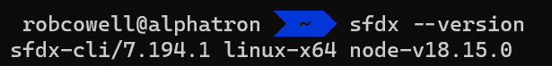

# 第五章：使用 SFDX 进行日常交付  

在本章中，我们将看到如何应用到目前为止学到的知识，使用 SFDX 工具套件结合 Visual Studio Code 和 Git 来管理变更交付。这并不是进行 Salesforce DevOps 的唯一方法，假设是从头开始启动一个全新的项目，但它将展示一些常见的任务和原则。  

我们将涵盖以下主要主题：  

+   设置工具和项目  

+   使用 Git 和 SFDX 的变更生命周期  

+   沙箱与临时组织  

在本章结束时，你应该能够在自己的 Salesforce 组织中复制一个简单的工作流，该工作流用于从 Jira 或 Asana 等票务系统中提取工作项，创建一个新的功能分支，使用 SFDX 和 VS Code 进行修改，并再次将代码提交。这是 DevOps 最直接的方法，将为你提供坚实的实践基础。  

# 技术要求  

如果你想跟随本章的示例，至少需要安装以下内容：  

+   Salesforce CLI  

+   VS Code  

+   VS Code 的 Salesforce 扩展  

你还需要一个 GitHub 账户（[`github.com/`](https://github.com/)），用来创建新的 Git 仓库，以及在本地计算机上安装 Git（[`git-scm.com/`](https://git-scm.com/)）。  

# 设置工具和项目  

在大多数实际场景中，你的工具和项目可能已经准备好用于现有实现的开发，但我们将从零开始设置所有内容，这样如果你想按照示例工作流操作，甚至可以从全新的开发者版 Salesforce 组织开始。  

## Salesforce CLI  

Salesforce CLI 是与 Salesforce 组织互动的主要工具，也是 CI/CD 过程自动化的基础。  

  

图 5.1 – Salesforce CLI 下载页面概览  

要在 Windows、macOS 或 Linux 上安装 Salesforce CLI，请按照所需操作系统的说明进行操作。  

### Windows  

1.  访问 Salesforce CLI 下载页面：[`developer.salesforce.com/tools/sfdxcli`](https://developer.salesforce.com/tools/sfdxcli)。  

1.  点击**Windows 安装程序**链接下载 Windows 安装程序。  

1.  运行下载的可执行文件（`.exe`）以启动安装过程。  

1.  跟随安装向导，接受许可协议，并选择所需的设置。默认设置通常对大多数用户来说足够了。  

1.  通过点击**安装**，然后点击**完成**来完成安装过程。  

1.  打开命令提示符或 PowerShell，输入 `sfdx --version` 来验证安装。如果安装成功，你应该能看到已安装的 Salesforce CLI 版本。


图 5.2 – 检查 Windows 上 Salesforce CLI 的安装

### macOS

1.  访问 Salesforce CLI 下载页面：[`developer.salesforce.com/tools/sfdxcli`](https://developer.salesforce.com/tools/sfdxcli)。

1.  点击 **MacOS 安装程序** 链接，下载适用于你 Mac 类型的 macOS 安装程序。

1.  打开下载的 `.pkg` 文件以开始安装过程。

1.  跟随安装向导，接受许可协议，并选择所需的设置。默认设置通常对于大多数用户来说是足够的。

1.  通过点击 **安装** 然后点击 **关闭** 来完成安装过程。

1.  打开终端并输入 `sfdx --version` 来验证安装。如果安装成功，你应该能看到已安装的 Salesforce CLI 版本。


图 5.3 – 检查 macOS 上 Salesforce CLI 的安装是否成功

### Linux

Salesforce CLI 的 Linux 版本提供为 tarball 格式。你可以在这里找到适合你系统架构的 tarball 下载 URL。

| **架构** | **清单文件** |
| --- | --- |
| x64 | [`developer.salesforce.com/media/salesforce-cli/sfdx/channels/stable/sfdx-linux-x64.tar.xz`](https://developer.salesforce.com/media/salesforce-cli/sfdx/channels/stable/sfdx-linux-x64.tar.xz) |
| Arm | [`developer.salesforce.com/media/salesforce-cli/sfdx/channels/stable/sfdx-linux-arm.tar.xz`](https://developer.salesforce.com/media/salesforce-cli/sfdx/channels/stable/sfdx-linux-arm.tar.xz) |

表 5.1 – Linux 安装包的清单文件

1.  要下载这些 tarballs 之一，可以使用 `wget` 命令。例如，对于 x64 平台，使用以下命令：

    ```
    sfdx:

    ```

    mkdir ~/sfdx

    ```

    ```

1.  解压你下载的 tarball 版本内容：

`tar xJf sfdx-linux-x64.tar.xz -C ~/sfdx --``strip-components 1`

`-C` 标志将内容提取到 `sfdx` 目录中，而 `--strip-components 1` 会移除根路径组件。

1.  修改你的 PATH 环境变量以加入 Salesforce CLI 的 `bin` 目录。例如，要配置当前终端会话，使用以下命令：

    ```
    ~/.bashrc or ~/.bash_profile file:

    ```

    使用 `sfdx --version` 来验证安装。如果安装成功，你应该能看到已安装的 Salesforce CLI 版本。

    ```

    ```



图 5.4 – 验证 CLI 安装

## Git

要在 Windows、macOS 或 Ubuntu Linux 上安装 Git，请根据相应操作系统的说明进行操作。对于其他 Linux 发行版，你可能需要搜索与你的包管理系统相匹配的文档。


图 5.5 – Git 客户端下载页面

### Windows

1.  从官方网站下载 Git for Windows 安装程序：

[`git-scm.com/download/win`](https://git-scm.com/download/win)

1.  运行下载的可执行文件（`.exe`）以启动安装过程。

1.  按照安装向导进行操作，选择所需的设置。默认设置通常对大多数用户来说足够。

1.  通过点击**安装**然后点击**完成**来完成安装过程。

1.  要验证安装，请通过在**开始**菜单中搜索或通过右键单击文件夹中的上下文菜单选择**Git** **Bash Here**打开 Git Bash 终端。

1.  在 Git Bash 终端中输入`git --version`并按*Enter*键。如果安装成功，你应该能看到已安装的 Git 版本。


图 5.6 – 确认在 Windows 上成功安装 Git

### macOS

1.  通过打开终端应用并输入`git --version`来检查 Git 是否已安装。如果 Git 已安装，你将看到版本号。如果没有，继续进行下一步。

1.  按照官方网站上的说明安装**Homebrew**，这是 macOS 的一个包管理器：[`brew.sh/`](https://brew.sh/)。

1.  安装 Homebrew 后，打开终端并输入`brew install git`。

1.  等待安装过程完成。

1.  通过在终端中输入`git --version`来验证安装。如果安装成功，你应该能看到已安装的 Git 版本。


图 5.7 – 确认在 macOS 上成功安装 Git

### Ubuntu Linux

1.  打开终端（*Ctrl + Alt + T*）。

1.  通过输入`sudo apt update`并按*Enter*键更新包列表。

1.  通过输入`sudo apt install git`并按*Enter*键来安装 Git。

1.  在提示时输入`Y`并按*Enter*键来确认安装。

1.  等待安装过程完成。

1.  通过在终端中输入`git --version`来验证安装。如果安装成功，你应该能看到已安装的 Git 版本。


图 5.8 – 确认在 Linux 上成功安装 Git

## VS Code 和扩展

Microsoft VS Code 适用于 Windows、macOS 和 Linux 系统。安装程序可以从[`code.visualstudio.com/download`](https://code.visualstudio.com/download)获取—只需按照你的操作系统的说明进行操作。

对于使用 VS Code 进行 Salesforce 开发，最重要的是一些允许直接在 IDE 内与 Git 和 SFDX 集成的扩展：

1.  打开 VS Code。

1.  单击侧边栏上的扩展视图图标，或按*Ctrl + Shift + X*（Windows/Linux）或*Cmd + Shift + X*（Mac）打开**扩展**面板。

1.  在搜索栏中搜索`Salesforce Extension Pack`。

1.  点击 **Salesforce Extension Pack** 上的 **Install** 按钮，这个扩展包由 Salesforce 提供。它将安装一系列扩展，包括 Salesforce CLI 集成、Apex、Aura 组件、Lightning Web 组件等。

## 创建一个新的 SFDX 项目并将其连接到你的 Salesforce 组织

现在我们已经安装了所有必需的工具，接下来可以开始构建一个可以工作的项目。我们将在 VS Code 中创建一个新的 SFDX 项目，并将其连接到我们的 Salesforce 环境。我们还会将它连接到我们的 Git 源代码控制，这样我们就能真正以源驱动的方式工作。让我们来看看将一切连接起来所需的步骤：

1.  使用命令面板设置 SFDX 项目：

    1.  使用 *Ctrl + Shift + P*（Windows/Linux）或 *Cmd + Shift + P*（Mac）打开命令面板。

    1.  输入 `SFDX: Create Project` 并按下 *Enter* 键。

    1.  选择 **Standard** 作为项目模板，并按下 *Enter* 键。

    1.  输入你希望为项目命名的名称，并按下 *Enter* 键。

    1.  选择一个文件夹来存储你的 SFDX 项目，并按下 *Enter* 键。这将在指定的文件夹中生成一个新的 SFDX 项目结构。

1.  使用命令面板设置项目的默认组织：

    1.  使用 *Ctrl + Shift + P*（Windows/Linux）或 *Cmd + Shift + P*（Mac）打开命令面板。

    1.  输入 `SFDX`，然后设置一个默认的组织并按下 *Enter* 键。

    1.  选择一个别名，用于在认证你的 Salesforce 组织时使用。

现在你已经使用命令面板安装并设置了 Salesforce 的 VS Code 扩展，并且准备开始开发 Salesforce 应用程序。

# Git 和 SFDX 的变更生命周期

在许多组织中，团队使用工作流管理系统，如 Jira 或 Asana，来捕捉、完善和分配开发团队的工作项。在这个示例中，我们假设使用的是 Jira，但这纯粹是为了说明目的，以复制一个相对典型的现实场景。要跟随这些示例，完全不必使用 Jira 或任何等效系统。我们将在 *第八章* 中更详细地探讨票务系统。

## 获取一个可以使用的 Git 仓库

在 *第三章* 中，我们查看了最常见的 Git 操作及其对应的命令。在大多数现实场景中，你可能已经有一个现成的仓库可以使用。然而，也可能有一些场景，你是第一次使用 Git 开始一个项目，那么我们来看看准备 Git 进行工作的主要方法：

1.  `git init` 会在你的机器上创建一个全新的本地仓库以供使用。此时，还没有对应的远程仓库。如果你需要提醒如何连接一个远程仓库，可以参考 *第三章*，例如在 GitHub 上的操作。

1.  `git clone` 将在您的本地计算机上创建一个远程仓库的副本——包括版本历史、所有分支和提交。它会为您创建正确的目录结构，准备好进行工作。

1.  `git checkout` 用于在现有仓库中切换分支。当您使用此命令时，您的本地工作文件夹将更新为该分支的内容。

## 获取主分支的最新更改

在开发前获取最新的主分支更改，可以确保代码库的最新性，最小化合并冲突，并简化新功能或修复的集成：

1.  在 VS Code 中，点击左侧边栏的 **源代码管理** 图标。

1.  点击顶部的 **...**（省略号）按钮，并选择 **Pull** 以获取并合并主分支的最新更改。

## 创建一个新的功能分支

功能分支模型是一种简单的基于 Git 的开发方法，非常适合初学者。它在主分支上维护最新的元数据，主分支应始终处于发布就绪状态。什么是“发布就绪”或“生产就绪”的定义可能会有很大差异，主要取决于所应用的测试级别，既包括单个更改的测试，也包括生产系统及其可能集成的整体测试。为了演示工作流，我们将极大地简化我们的定义，表示更改已在开发组织中进行了功能测试，所有代码审查（包括自动和手动）已完成，并且拉取请求已被批准。

开发人员从主分支创建新分支来实现功能或修复，完成后将其合并回主分支。短期存在的功能分支可以最小化合并冲突，并促进整洁性。较小的交付物减少了反馈周期的长度。要在 VS Code 中创建功能分支，请按照以下步骤操作：

1.  在 **源代码管理** 面板中，点击窗口左下角的分支图标。

1.  输入新功能分支的名称（例如，`feature/JIRA-1234`），然后按 *Enter* 键创建并切换到新分支。

## 正在处理您的更改

现在，您应该能够开始在功能分支上进行开发工作。这可以是在连接的 Salesforce 组织中的配置工作，或是在 Salesforce IDE 中进行的基于代码的开发。

Salesforce 的 VS Code 扩展简化了在本地计算机和开发组织之间来回移动元数据更改的过程。许多底层的 Salesforce CLI 命令可以通过组织浏览器、命令面板，或右键点击文件时作为上下文敏感菜单选项使用。

### 获取元数据

1.  在 VS Code 的侧边面板中打开组织浏览器（您可以通过一个类似云的图标找到它）。

1.  如果这是您第一次使用组织浏览器，或者如果您的组织的元数据发生了变化，点击刷新图标以从您的组织中获取元数据。

1.  Org 浏览器显示元数据类型的列表。您可以点击元数据类型旁边的箭头展开它，并查看该类型的各个组件。

1.  要检索元数据组件，请点击组件名称旁边的云下载图标。这会将组件检索并添加到您的本地项目中。

### 部署元数据

1.  导航到您在本地项目结构中要部署的文件或文件夹。

1.  右键单击选中的项目。

1.  从上下文菜单中选择**SFDX: 部署源代码到组织**命令。这会将元数据部署到您的组织中。

1.  请注意，Org 浏览器并不直接支持部署，但会使用 VS Code 中 Salesforce 扩展的标准部署命令。

一旦开发完成，请在 Salesforce 中使用 Scratch Org 或沙盒测试您的更改，具体使用哪一种取决于情况。我们将在本章后续部分对这两种 Salesforce 开发环境的差异进行详细讨论。

## 提交您的更改

提交更改的两步过程包括首先暂存更改，然后执行提交。暂存是选择更改进行提交，而提交则是将已暂存的更改记录为本地仓库中的新快照，从而保持开发历史。您可以这样完成暂存和提交您的更改：

1.  在**源代码管理**面板中，检查您所做的更改。

1.  通过点击每个已更改文件旁边的**+**图标，或点击**CHANGES**旁边的**+**图标以暂存所有更改。

1.  输入一个有意义的提交信息，描述与 Jira 票据相关的更改（例如，“`JIRA-1234: 实现了` `新特性`”）。

1.  点击顶部的对勾图标，将更改提交到您的功能分支。

## 将您的功能分支推送到远程仓库

一旦我们的更改添加到本地 Git 中，我们可以按如下方式将这些更改推送到远程仓库：

1.  在**源代码管理**面板中，点击顶部的**...**（省略号）按钮，并选择**推送**。

1.  如果提示，请选择您的功能分支（例如，“`feature/JIRA-1234`”）并将其推送到远程仓库。

## 创建拉取请求

在 Git 中创建拉取请求是一个协作过程，开发者提出将其更改从一个分支合并到另一个分支，通常是从功能分支合并到主分支。这允许代码审查、讨论以及在合并更改之前进行潜在的修改。这也是进行自动化检查的阶段，例如运行测试和静态分析，这使得拉取请求不仅是多人团队的有用工具，也对独立开发者有帮助。

要通过 GitHub 创建拉取请求，请按照以下步骤操作：

1.  打开浏览器并导航到您的 GitHub 仓库。

1.  单击您刚刚推送的分支旁边的**比较与拉取请求**按钮。

1.  审查更改，并添加与 Jira 票据相关的任何额外信息或上下文。

1.  指定适当的审阅者并点击**创建拉取请求**。

或者，如果你已经在 VS Code 中安装了 `GitHub Pull Requests and Issues` 扩展，你可以按以下方式在 VS Code IDE 中创建新的拉取请求：

1.  按下*Ctrl + Shift + P*（Windows 或 Linux）或*Cmd + Shift + P*（macOS）打开 VS Code 命令面板。

1.  输入 `Github: Create Pull Request` 并从出现的列表中选择该选项。

1.  为拉取请求选择基础分支和比较分支。

1.  输入拉取请求的标题和描述。

1.  审查你的更改并进行必要的调整。

1.  点击**创建拉取请求**按钮提交你的拉取请求。

## 处理反馈并更新拉取请求

在审查过程中，通常会有反馈并要求对你的拉取请求进行更改。这是审查过程的正常部分，有助于通过尽早捕获更改来交付高质量的生产版本。幸运的是，处理这些更改与最初的 Git 提交一样简单——让我们看看需要的步骤：

1.  如果在审查过程中要求更改，请在 VS Code 中进行必要的更新。

1.  像最初提交更改时一样，提交并推送更改到功能分支。

1.  拉取请求会自动更新你的新更改。

## 合并拉取请求

一旦我们达到了拉取请求被批准并且所有要求的更改都已完成的阶段，我们可以安全地将其合并到上游分支中，操作如下：

1.  一旦拉取请求被批准，点击 GitHub 中的**合并拉取请求**按钮。

1.  如果功能分支不再需要，请在 GitHub 或 VS Code 中删除它。

## 更新本地的主分支

现在我们需要做的就是刷新本地的主分支副本，确保我们有所有最新的更改，并且一切都已正确同步。以下步骤将帮助我们实现这一点：

1.  在 VS Code 中，点击左下角的分支图标并选择**main**，切换回主分支。

1.  像开始时一样拉取最新的更改。

我们现在已经完成了使用 SFDX 和 Git 开发 Salesforce 功能的典型生命周期。这代表了最基础的 DevOps 工作流——在许多团队中，这样的工作流可以保持简单。

在接下来的部分中，我们将查看 Salesforce 最常见的开发环境——沙盒和 Scratch org 之间的一些微妙差异，并了解每种环境的使用场景。

# 沙盒与 Scratch org

Scratch org 和 Salesforce 开发沙盒在提供开发和测试环境方面具有类似的目的；然而，它们在几个关键方面有所不同，我们将在这里讨论这些差异。

## 沙盒

Salesforce 沙盒是你 Salesforce 环境的副本，包括元数据和自定义内容。沙盒通常用于测试和开发目的，如创建和测试新功能、与其他系统集成或复制生产环境中的问题。开发人员可以使用沙盒测试新功能或自定义内容，而不会影响生产环境。沙盒也可以用于培训和**用户验收测试（UAT）**，确保在部署前充分测试更改。此外，沙盒还可以用于集成测试、灾难恢复，并作为数据丢失或系统故障的备份。

Salesforce 沙盒用于开发和测试，提供四种不同类型的沙盒，每种沙盒具有不同的功能、目的、刷新周期和存储限制：

+   完整副本沙盒是你生产环境的完整复制，包括所有元数据和数据。它通常用于需要完整复制生产环境的测试和开发目的，如性能测试、**用户验收测试（UAT）**和培训。然而，你需要注意，这些沙盒每 29 天只能从生产环境刷新一次。完整副本沙盒也不支持源跟踪，因此不适合作为你的主要开发环境来使用 SFDX。

+   部分副本沙盒包括生产环境数据的子集，以及所有元数据。它通常用于需要比完整副本更小数据集的测试和开发目的，如功能开发或回归测试。此类型沙盒并非标准提供，而是 Salesforce 额外授权的付费项目。与完整副本沙盒不同，部分副本沙盒每五天就可以刷新一次，但像完整副本沙盒一样，它们不支持源跟踪。

+   开发者沙盒是专门为个人开发者或小团队提供的环境。它包括所有元数据，但没有数据。通常用于单个功能的开发或测试。大多数组织将拥有比完整副本或部分副本更多的开发者沙盒（通常每种沙盒限制为一个，除非你购买额外的沙盒）。它们可以每天刷新，但不会带来任何数据，并且具有更小的数据容量。

+   开发者专业版沙盒类似于开发者沙盒，但具有更大的存储容量。它通常用于更复杂的开发和测试任务，如集成或应用开发。

## Scratch orgs（临时开发环境）

Scratch orgs 是一次性、临时的环境，可以快速创建和删除。它们主要用于敏捷开发，如在短时间内构建和测试新功能。

Scratch org 的生命周期本质上是临时的，最长为 30 天。这种短暂的特性鼓励开发者采用源驱动的开发方法，其中版本控制系统作为唯一的真实来源。相比之下，开发者沙箱是更持久的环境，可能存在较长时间，这使得开发者更容易无意中积累过时或未使用的代码和配置。

Scratch org 设计为轻量且可快速配置。通过调整 Scratch org 定义文件，它们可以根据特定项目的需求创建并定制所需的功能、设置和数据。这使得开发者可以轻松创建多个针对不同项目或任务定制的 Scratch org。另一方面，开发者沙箱是作为生产环境的副本创建的，包括所有自定义和部分数据，这使得它们的设置和配置较为繁琐且耗时。

默认情况下，当创建 Scratch org 时，它不会与生产 org 中启用的功能或元数据建立任何连接。它是根据一个通用模板创建的，包含一组基础功能。这意味着新创建的 Scratch org 不会反映生产 org 的特定特性或自定义设置，如果你正在开发和测试与这些特定设置或元数据相关的功能，可能会面临挑战。

为了克服这个问题，Salesforce 引入了定义文件的概念。定义文件是一个 JSON 文件，指定了 Scratch org 的形状或你希望 Scratch org 拥有的特性。它可以定义功能、设置和版本的偏好。例如，定义文件可能包含启用某些 Salesforce 功能的指令，如 Einstein Analytics 或个人账户。

手动创建定义文件使你可以根据生产环境定制 Scratch org。然而，手动创建一个与复杂的生产 org 完全匹配的定义文件可能会非常耗时，并且可能容易出错。

为了帮助解决这个问题，Salesforce 引入了 org 形状的概念。org 形状本质上是你生产 org 功能和设置的快照，你可以在创建 Scratch org 时将其用作模板。通过使用 org 形状，你可以快速而准确地在 Scratch org 中重建生产 org 的环境，而无需手动在定义文件中指定所有设置。

之前提到的短暂性、轻量化和可配置性的组合意味着，scratch org 更有利于支持**持续集成和持续交付**（**CI/CD**）流程。scratch org 的可丢弃性质使得开发者可以根据需要快速创建、测试和销毁环境，从而实现与 CI/CD 流水线的无缝集成。由于开发者沙箱的生命周期较长且设置更为复杂，它们可能不太适合这种自动化工作流。

# 总结

在本章中，我们回顾了使用 Salesforce 的标准堆栈和源代码控制工具的端到端生命周期。让我们回顾一下这个过程包括了哪些内容。

我们查看了如何将 Git 仓库初始化或克隆到本地机器，确保我们拥有最新的代码库版本。通过 VS Code，我们能够轻松访问和管理源代码，并在集成终端或 VS Code 内置的命令面板以及 Salesforce 扩展包中运行 SFDX 命令。

在开始开发过程之前，我们在 Git 仓库中创建了一个新的分支，以表示我们正在开发的特定功能或任务。这个分支通常根据关联的 Jira 工单命名，以保持可追溯性和组织性。一旦创建了特性分支，我们切换到该新分支，并开始实施所需的更改。

作为开发过程的一部分，我们利用 SFDX 工具来创建、检索和部署元数据组件。尽管我们在示例中使用了沙箱环境，但我们也可以利用 scratch org——临时的 Salesforce 环境——在最终确定代码之前对更改进行测试和迭代。在这个过程中，我们将更改提交到特性分支，并提供清晰简洁的提交信息，以维护全面的历史记录。

开发完成且更改经过充分测试后，我们将特性分支推送到远程 Git 仓库。这时，我们就可以创建拉取请求，将特性分支合并到主分支。拉取请求为团队成员提供了一个机会，审查更改、提供反馈并建议改进。它还作为一种质量保证措施，确保代码库保持稳定并维持所需的质量水平。

在获得团队批准后，我们可以通过拉取请求将特性分支合并到主分支。然后，主分支准备好进行部署到暂存环境或生产环境，以进行进一步的测试和验证。

一旦部署成功，特性分支可以在本地和远程仓库中删除，以保持干净和有序的代码库。

使用拉取请求、基于 Jira 工单的特性分支和协作评审过程，确保了在整个 Salesforce 开发生命周期中代码库的高质量、可追溯性和可维护性。

整个工作流程是通过免费工具实现的，并为 Salesforce DevOps 过程提供了最简单的入门点。随着需求的增长，自动化的力量变得更加重要，特别是在 CI/CD 的背景下。

我们将在*第七章*中更详细地讨论 CI/CD。在此之前，在下一章中，我们将通过探讨打包来采用另一种 Salesforce 变更管理的方法。
