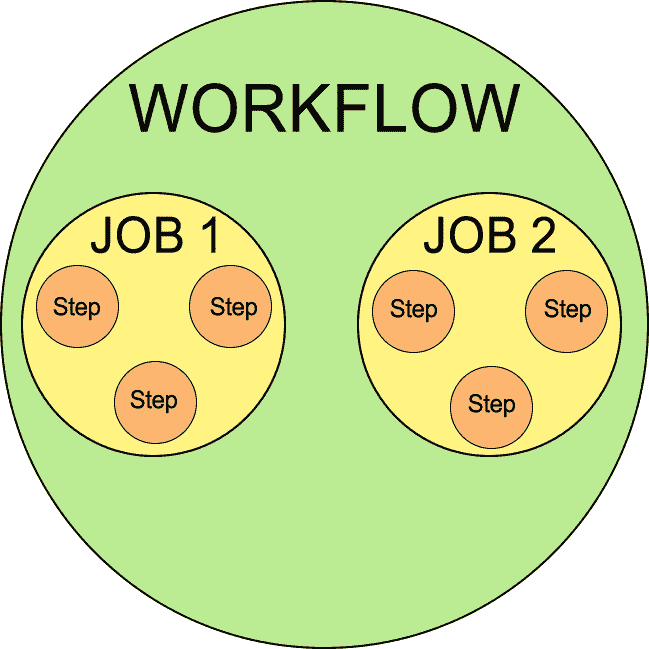

# CI/CD 自动化

在本章中，我们将学习如何利用 **持续集成和持续交付** (**CI/CD**) 自动化我们的 DevOps 流程。我们还将介绍一些流行的工具来实现这一目标。

利用 CI/CD 的力量，我们可以为 Salesforce 的开发和运维创建更高效、可靠和流畅的工作流。这种方法使我们能够快速响应变更，降低部署失败的风险，最终帮助我们交付更高质量的软件。

我们将涵盖以下主要主题。

+   **CI/CD 管道简介**：首先，我们将定义 CI/CD，解释其优点，并讨论它如何适用于 DevOps 策略。我们还将强调在实施 CI/CD 时应遵循的关键原则和最佳实践。

+   **GitHub Actions**：本节将重点介绍 GitHub Actions，这是一个灵活且强大的 CI/CD 工具，可以直接与您的 GitHub 仓库集成。我们将探讨如何设置工作流程，自动化测试以及处理部署，所有这些都在 GitHub 平台内完成。

+   **Jenkins**：Jenkins 是 CI/CD 社区中广受欢迎的工具，我们将深入探讨它。我们将展示如何为 Salesforce 项目配置 Jenkins，创建流水线，并利用其广泛的插件生态系统。

+   **Salesforce 特定工具**：Salesforce 提供了几个工具，可以帮助 CI/CD，例如 **Salesforce DX** (**SFDX**) 和 Salesforce CLI。我们将讨论如何利用这些工具来简化您的 CI/CD 流程并解决 Salesforce 特定的挑战。

+   **CI/CD 管道的实际应用**：最后，我们将查看新建的 CI/CD 管道作为强大 DevOps 实施的优势。

通过本章末尾，您应该对 CI/CD 在 Salesforce DevOps 中的角色有了扎实的理解，了解了实施它的可用工具以及开始自动化您自己流程的步骤。

# 技术要求

对于 Jenkins，您需要一个能够托管 Jenkins 软件的服务器。这可以是物理服务器、虚拟机或基于云的服务器。具体的要求将取决于项目的规模，但至少应规划至少 1 GB 内存、50 GB 硬盘空间和一台现代 CPU。值得注意的是，出于学习目的，您可以在本地开发机上运行 Jenkins，如果您想跟随本书中的过程和步骤进行，但是对于实际的 DevOps 工具链使用，建议使用专用的托管解决方案。

SFDX 和 Salesforce CLI 是 Salesforce DevOps 的关键工具。要使用它们，您需要在系统上安装 Salesforce CLI。如果您尚未完成安装，可以重新查看 *第五章*，详细介绍了设置过程。

要在 Salesforce 中实施 CI/CD，您需要一个有效的 Salesforce 开发者账户。如果您与团队一起工作，您还需要一个 SFDX “hub” 组织，在其中创建和管理 scratch org。

CI/CD 的一个关键部分是版本控制。GitHub 是最广泛使用的平台，并且由于与 CI/CD 工具的出色集成，推荐使用它。您需要一个 GitHub 账户以及一个用于存储 Salesforce 代码的仓库。

本章的源代码可在 [`github.com/PacktPublishing/Salesforce-DevOps-for-Architects/tree/main/Chapter7`](https://github.com/PacktPublishing/Salesforce-DevOps-for-Architects/tree/main/Chapter7) 上获取。

# 引入 CI/CD

软件开发的世界多年来发生了显著变化，越来越注重敏捷性、效率和质量。在这种背景下，CI 和 CD 成为了推动开发工作流程显著改进的关键实践。在本节中，我们将探讨 CI/CD 的核心概念、它们的好处以及它们在 DevOps 策略中的作用。

## 持续集成（CI）

CI 是一种开发者将代码频繁提交到共享仓库的过程。每次提交都可以经过自动化构建和测试周期，以便在开发生命周期的早期阶段识别问题。这个 CI 过程有助于减少集成问题，并使开发团队能够及时反馈任何问题。

## 持续交付（CD）

CD 将 CI 的理念进一步拓展。它将软件发布过程自动化，直到准备好生产环境，但稍微缺少实际的生产部署。这一实践确保了存储库中的代码和配置（通常是主分支或 master 分支）始终处于生产就绪状态，减少了部署的风险和工作量，并使团队能够更快、更频繁地向客户交付更新和改进。经过自动化测试后，软件已准备好部署，但仍需要人工决策来确定何时部署到生产环境。

CI 和 CD 一起构成了现代 DevOps 实践的基础。它们促进了协作文化、快速反馈周期，并专注于高质量的输出。实施 CI/CD 可以带来更高效的开发流程，减少生产环境中出现的 bug，并为用户提供更好的产品。

在 Salesforce 环境中，CI/CD 可以带来额外的好处。Salesforce 项目通常涉及多个开发者在复杂系统的多个方面进行工作。通过 CI/CD，您可以确保变更频繁地集成和测试，从而减少冲突和错误的风险。同时，自动化部署可以简化将变更推送到测试、预发布和生产环境的过程。

然而，值得注意的是，实现 CI/CD 不仅仅是使用某些工具或遵循特定步骤的问题。它是一种文化转变，需要整个团队的认同，专注于自动化和测试，以及持续改进流程的承诺。这可能涉及改进现有的测试实践，或者解决技术债务和糟糕的架构——这些都是正确实施 CI/CD 的先决条件。虽然这些变化可能看起来令人生畏，但采用 CI/CD 的好处通常超过所需的努力。在接下来的部分中，我们将深入探讨可以帮助您将 CI/CD 的好处带入 Salesforce 项目的具体工具和实践。尽管最初的努力可能很大，但从改进的自动化、测试和交付流程中获得的回报是值得的。只要团队承诺并专注于持续改进，CI/CD 可以改变您在 Salesforce 上构建和交付的方式。

## CI/CD 流水线

在 CI/CD 的领域中，一个关键的概念是流水线。CI/CD 流水线是一系列步骤，您的更改（无论是代码、元数据还是数据）将通过这些步骤，从开发到生产环境。它自动化了代码更改的集成过程、通过测试验证这些更改，并将它们交付给最终用户。通常，它被可视化为一系列阶段，每个阶段都有特定的目的。当引入更改时（例如，当开发者将代码推送到仓库时），它会触发流水线，改变会通过各个阶段。让我们来看看一些典型的流水线阶段：

+   **构建阶段**：这是代码被编译、依赖项被获取并且软件被打包部署的地方。在 Salesforce 项目中，这可能包括创建一个新的 SFDX scratch org，将代码推送到该组织，并运行所需的脚本。

+   **测试阶段**：自动化测试会针对构建运行，以确保它的行为符合预期。这可能包括单元测试、集成测试和功能测试。在 Salesforce 的上下文中，这必须包括运行 Apex 测试，并可能测试其他组件，如 Visualforce 页面或 Lightning 组件。

+   **部署阶段**：如果构建通过了所有测试，它可以被部署到一个预发布环境中进行进一步测试，如果在那里也通过了测试，它就可以被部署到生产环境中。像 SFDX 和变更集这样的 Salesforce 特定工具可以用于这些部署。最终，这些工具是对元数据 API 的封装，而元数据 API 仍然是部署更改的唯一底层方式。

+   **监控阶段**：部署后，应用程序会被监控，以确保它在生产环境中正常运行。任何出现的问题都可以反馈到开发过程中。

这些阶段中的每个通常都是自动化的，这意味着在所有检查通过的前提下，变更可以从一个阶段推进到下一个阶段，而无需人工干预。自动化是 CI/CD 流水线的一大优势，因为它减少了人为错误的风险，加快了交付过程，并为开发团队提供了快速反馈。

每个阶段都旨在捕捉不同类型的问题。例如，构建阶段可能会捕捉到语法错误，而测试阶段可能会捕捉到功能性错误，监控阶段则可以识别性能问题或实时环境中的错误。使用像 PMD 这样的静态代码分析工具，或者其他代码检查工具，如针对 Lightning Web Components 的 ESLint，可以增强整个开发团队的一致性代码风格和最佳实践。通过将规则编码到这些工具中，开发人员如果违反了规范，就能得到即时反馈。这有助于推动可读、可维护的代码，当然也可以添加到流水线中自动运行。

在 Salesforce 的背景下，CI/CD 流水线可以帮助管理在多租户、元数据驱动环境中开发的复杂性。它允许团队以受控、可重复的方式开发、测试和部署变更，从而减少手动部署相关的风险，并确保高质量的输出。在接下来的章节中，我们将讨论如何使用流行的工具（如 GitHub Actions 和 Jenkins）来实现这样的流水线。

# GitHub Actions

在我们进入 CI/CD 领域的过程中，我们会遇到许多有助于促进这些实践的工具。其中一个工具以其简单性和与 GitHub 平台的紧密集成而脱颖而出，那就是 GitHub Actions。这个强大的自动化工具允许你直接在 GitHub 仓库中创建自定义的**软件开发生命周期**（**SDLC**）工作流。

GitHub Actions 使你能够在自己的代码库中自动化、定制和执行软件开发工作流。你可以在存储代码和协作项目的同一个地方部署工作流。这意味着开发周期更快、更简化，因为你可以在 GitHub 项目内部管理 CI/CD，而无需依赖外部工具。

在 GitHub Actions 中，工作流、任务和操作具有层级关系，这允许你组织和结构化你的 CI/CD 过程。这个层级关系具有以下几个级别：

+   `.github/workflows` 目录包含定义工作流的 `.yml` 或 `.yaml` 文件。

+   `runs-on` 指令。单个工作流可以执行多个任务，默认情况下这些任务并行执行，尽管你可以将它们调整为顺序执行。每个任务由多个步骤组成，每个步骤执行特定任务。这些任务可以使用相同的运行器，也可以使用不同的运行器。

+   **步骤**：步骤表示作业中最细粒度的工作。每个步骤负责执行一个单一的命令或 Action。它们可以执行命令，这些命令是任何 shell 命令，也可以执行 Action，Action 是可重用的代码块。这些 Action 可以是由你开发的，也可以是 GitHub 开发的，或者是从社区的公共仓库中获取的。



图 7.1 – 工作流、作业和步骤之间的层次关系

作业中的一步可以是一个在 shell 中运行的命令，或者是一个 Action。在下面的示例中，作业中的每一步要么运行 shell 命令（例如 `npm install sfdx-cli --global`），要么使用 Action（例如 `actions/checkout@v2`）。

GitHub Actions 提供的不仅仅是建立 CI/CD 流水线的能力，它还允许自动化广泛的任务，如问题分诊和软件包发布。这使得它成为任何开发者工具包中不可或缺的多功能工具。

对于 Salesforce 开发者和架构师来说，可以通过 GitHub Actions 自动化任务，例如运行 Apex 测试、将代码部署到 Scratch org，以及将更改推广到暂存和生产环境。接下来的部分，我们将深入探讨如何设置和使用 GitHub Actions 来实现 Salesforce CI/CD。

## GitHub 工作流实例

让我们先来看一个实际的 Git 工作流示例，然后逐步分析它在做什么。考虑下面这个 GitHub 工作流：

```
name: Salesforce CI
on:
  push:
    branches: [ main ]
  pull_request:
    branches: [ main ]
```

该 GitHub 工作流会在主分支上发生推送或拉取请求事件时启动。接下来，我们需要在工作流中定义一个或多个作业：

```
jobs:
  deploy:
    runs-on: ubuntu-latest
```

在这个实例中，我们定义了一个名为 `deploy` 的作业，它将在 `ubuntu-latest` 环境中执行。GitHub Actions 工作流中的 `runs-on:` 字段配置作业将运行的机器类型。该字段可以具有多种值，进而确定执行作业所使用的 Runner 类型。

Runner 是一台配备了 GitHub Actions Runner 应用程序的服务器，负责执行任务。`ubuntu-latest` 值表示任务应在 GitHub 托管的最新稳定版 Ubuntu 虚拟机上运行。

接下来，我们将定义作业应执行的步骤。首先，我们通过检出仓库中的代码并安装 Salesforce CLI 来进行一些准备工作，以便使用代码执行后续步骤：

```
  steps:
      - name: Checkout
        uses: actions/checkout@v2
       - name: Install Salesforce CLI
        run: |
              wget https://developer.salesforce.com/media/salesforce-cli/sfdx/channels/stable/sfdx-linux-x64.tar.xz
              mkdir ~/sfdx
              tar xJf sfdx-linux-x64.tar.xz -C ~/sfdx --strip-components 1
              echo "$HOME/sfdx/bin" >> $GITHUB_PATH
              ~/sfdx/bin/sfdx version
```

第一步使用 `actions/checkout@v2` 来检出当前仓库的源代码。通过 GitHub Actions，可以使用包含在你自己仓库中的 Action，公共仓库中的 Action，或者在 GitHub 自有发布镜像中的 Docker 容器镜像中的 Action。`uses:` 关键字用于在 GitHub Actions 工作流中指定这些 Actions。

在这种情况下，`actions/checkout@v2` 是指来自 `actions` 仓库的 checkout 动作，`v2` 是你想要使用的版本标签。这个 checkout 动作会将你的仓库检出到 `$GITHUB_WORKSPACE` 下，以便工作流可以访问它。

通过指定 `v2`，你指示工作流使用 checkout 动作的第二个主要版本。与之前的版本（`v1`）相比，这个版本可能包含新功能、变更或 bug 修复。动作的维护者根据语义版本控制规则定义这些版本。

最佳实践是指定一个版本（而不是使用默认的分支，通常是 `main` 或 `master`），以保护你的工作流免受这些分支中可能引入的破坏性变更。

第二步是全局安装 Salesforce CLI。Salesforce CLI 用于与你的 Salesforce 组织进行身份验证并运行 Apex 单元测试。然而，Salesforce CLI 并没有预装在 GitHub 的虚拟环境中，因此你需要在工作流中安装它。

Salesforce CLI 有两种主要的分发方式——作为二进制可执行文件和作为通过 npm 安装的 Node.js 包。我们在脚本中选择使用二进制分发，因为 npm 安装在尝试添加额外插件时可能会遇到权限问题。npm 包需要 Node.js，并且需要全局安装，这通常需要 sudo 权限。使用 sudo 可能会导致文件系统权限问题。二进制分发避免了这些问题，这也是我们选择这种方法的原因。Node.js 的 npm 包也可以使用，但我们避免了它，因为在添加插件时可能会遇到权限问题。现在，我们可以进入下一个步骤：

```
# The URL is stored in the Github Secret named DEVHUB_SFDX_URL
# so here we store the URL into a text file
      - name: 'Populate auth file with SFDX_URL secret of integration org'
        shell: bash
        run: |
                echo ${{ secrets.DEVHUB_SFDX_URL}} > ./DEVHUB_SFDX_URL.txt
```

在前面的步骤中，我们利用了 GitHub 的每个仓库密钥来检索存储的值，并将该值复制到一个临时文件中，*仅在此作业的生命周期内有效*。该文件包含一个 SFDX 授权 URL，允许作业轻松连接到我们的 Salesforce Developer Hub 组织。

有三种方法可以创建这个身份验证文件。最简单的方法是将 `sf org display --verbose --json` 命令的输出重定向到一个文件中。例如，假设你正在使用一个已经授权的组织：

```
sf org display -o <OrgUsername> --verbose --json > authFile.json
```

在生成的 JSON 文件中，你可以找到存储在 `sfdxAuthUrl` 属性中的 URL，该属性位于 results 对象内。请注意，`force:org:display --verbose` 命令只会显示使用 Web 服务器流授权的组织的刷新令牌，而不会显示使用 JWT 承载流授权的组织。

此外，你还有选择生成一个 JSON 文件，其中包含一个名为 `sfdxAuthUrl` 的顶级属性，该属性包含身份验证 URL。或者，你可以创建一个纯文本文件，只包含 URL，而不包含任何其他内容。

SFDX 授权 URL 的格式如下：

`force://<clientId>:<clientSecret>:<refreshToken>@<instanceUrl>`

URL 使用 `force://` 而不是 http:// 或 `https://`，并且 `instanceUrl` 不包含 `https://`，它只是域名。

下一步使用新创建的文件对 Salesforce 组织进行认证，该文件包含授权 URL，并为其指定别名 `HubOrg`：

```
- name: Authenticate to Salesforce
        run: |
           sf auth sfdxurl store -f DEVHUB_SFDX_URL.txt -a HubOrg
```

在认证我们的 Dev Hub 后，我们现在可以自动生成一个新的临时组织以供测试使用，并将代码传输到其中：

```
- name: Create A New Scratch Org
        run: |
           sf org create scratch --target-dev-hub HubOrg --set-default --definition-file config/project-scratch-def.json --alias ciorg --wait=10
      - name: Push changes to new Scratch Org
        run: |
           sf project deploy start --target-org ciorg
```

有了这个新的临时组织，并使用 `ciorg` 别名，我们可以执行我们的 Apex 测试：

```
- name: Run all Apex tests
        run: |
           sf apex run test -o ciorg -l RunLocalTests -r tap -d test-results
```

最后，当我们完成时，会删除临时组织。这是一个重要步骤，因为 Salesforce 对每个 Dev Hub 中可以拥有的活动临时组织数量有严格限制：

```
- name: Delete scratch org
        run: |
           sf org delete scratch --target-org ciorg --no-prompt
```

每个工作中的步骤都在其独特的上下文中运行。然而，使用 GitHub 工作流语法，这些独立的步骤可以协调互动并相互配合。工作流配置提供了建立步骤之间依赖关系的能力，例如指定一个步骤必须等待另一个步骤成功完成后才能开始。它还允许一个步骤利用另一个步骤的输出，及其他交互。这种灵活的配置使得可以从一系列独立步骤构建复杂的自动化过程。

GitHub Actions 提供了一个多功能平台，便于在使用 SFDX 时定制你的 CI/CD 管道。凭借其执行各种任务的能力，从执行 shell 命令到运行脚本甚至是第三方软件，GitHub Actions 可以根据你的特定需求进行独特定制。

这种适应性同样适用于 SFDX，在其中你可以利用 GitHub Actions 来自动化多个任务。这些任务可以包括执行单元测试、将代码部署到不同的环境，甚至监督数据迁移。通过利用 GitHub Actions 的强大功能，你可以创建一个高效、可靠的自动化 CI/CD 管道，增强 SFDX 项目的开发和部署过程。

虽然前面的步骤为你提供了一个使用 GitHub Actions 进行 Salesforce CI/CD 的基本自动化工作流，但你可以通过更多的自动化测试、静态代码分析、审批流程等来扩展它。在 [`docs.github.com/en/actions/learn-github-actions`](https://docs.github.com/en/actions/learn-github-actions) 的官方 GitHub Actions 文档中，你可以找到大量的文档和教程。

如果你想尝试不同的 CI/CD 方法，可以考虑 Jenkins。它拥有大量的插件，支持自托管，可以让你更好地控制实现过程，并且具有更加直观的用户界面来设置和管理你的管道。在接下来的章节中，我们将更详细地介绍 Jenkins。

# Jenkins

Jenkins 是一个开源自动化服务器，已经稳固地成为 DevOps 社区中不可或缺的工具。由于其丰富的功能集、插件生态系统以及高度的灵活性和控制能力，Jenkins 成为许多组织的首选。

Jenkins 被设计用来管理各种 DevOps 活动和流程，从简单的 CI 服务器到全面的 CD 中心，可以容纳任何类型的项目，无论其规模或复杂性。它允许你自动化交付管道的不同阶段，为项目团队提供关于项目健康状况的持续反馈。

Jenkins 的一个重要优势是它通过插件的可扩展性。在更新中心有超过 1,000 个插件，Jenkins 可以与几乎所有 CI/CD 工具链中的工具进行集成。你可以使用它来构建、测试并交付任何语言的代码，部署到任何平台。这种可扩展性使得 Jenkins 成为一个多功能工具，可以适应各种项目需求。

Jenkins 使用分布式架构，能够随着需求的增长轻松扩展。你可以设置 Jenkins，将工作分配到多台机器上，从而加速项目的构建、测试和部署。这种分布式特性对于大型和复杂的项目特别有利。

与 GitHub Actions 类似，Jenkins 可以配置来处理任务，例如运行 Apex 测试、创建和管理 SFDX scratch org、以及将元数据部署到各种 Salesforce 环境中。Jenkins 还可以与版本控制系统（如 Git）集成，增强其在 Salesforce CI/CD 管道中的功能。

设置 Salesforce 的 Jenkins CI/CD 管道的第一部分是安装 Jenkins 本身。根据操作系统的不同，这个过程会有所不同。Jenkins 是一个基于 Java 的应用程序，因此它可以在任何支持 Java 的平台上运行。在开始任何新的安装之前，建议始终确保系统的所有软件包都是最新的。

如果你使用的是 Ubuntu Linux，首先需要通过终端运行 `apt update` 和 `apt upgrade` 命令来更新系统软件包。然后，你需要安装 Java，因为 Jenkins 需要它才能运行。OpenJDK 包是一个不错的选择，可以通过 `apt install openjdk-17-jdk` 命令进行安装。在撰写本文时，JDK 20 是 Java SE 平台的最新版本。然而，JDK 17 LTS 作为 Java SE 平台的最新**长期支持**（**LTS**）版本，仍然是最为推荐的版本。

接下来，你应该将 Jenkins 仓库添加到你的源列表中，这是安装 Jenkins 的前提条件。你可以通过使用 `wget` 命令获取 Jenkins 仓库的密钥并将其添加到系统的软件仓库列表中。此密钥用于身份验证，并确保你系统上安装的软件包来自受信任的来源。你可以使用以下 `wget` 命令从 Jenkins 服务器直接下载 Jenkins 仓库密钥：

```
wget -q -O - https://pkg.jenkins.io/debian/jenkins.io.key | sudo apt-key add –
```

`-q` 选项告诉 `wget` 安静地运行，这意味着它不会输出进度信息。`-O -` 选项则告诉它将下载的内容写入标准输出，表示为 `-`。然后，使用 `|` 符号将这些内容传递到 `sudo apt-key add -` 命令中，该命令将密钥添加到系统的受信任密钥列表中。

接下来，你需要将 Jenkins 仓库添加到系统的软件仓库列表中。这是通过将 Jenkins 仓库 URL 附加到存储在 `/etc/apt/sources.list.d/` 目录中的仓库列表来完成的。你可以使用以下命令来执行此操作：

```
echo deb http://pkg.jenkins.io/debian-stable binary/ | sudo tee /etc/apt/sources.list.d/jenkins.list
```

`echo` 命令打印其参数，在本例中是 Jenkins 仓库的 URL 和要使用的软件包类型（binary）。此输出会被传递给 `sudo tee` 命令。`tee` 命令用于将接收到的输入附加到文件中，本例中是将输入追加到 `/etc/apt/sources.list.d/` 目录中的 `jenkins.list` 文件。

一旦这些命令执行完毕，你的系统包管理器就设置好了，能够安装 Jenkins 并保持其更新。接下来的步骤是通过 `sudo apt update` 更新软件包列表，然后你可以继续通过 `sudo apt install jenkins` 安装 Jenkins。

对于 macOS 用户，首先需要安装 Homebrew，这是一个简化 macOS 上软件安装的包管理工具。安装 Homebrew 后，你可以使用它来安装 OpenJDK，然后再安装 Jenkins。和 Ubuntu 一样，安装 Jenkins 后，你应该启动 Jenkins 服务，并确保它在系统启动时自动启动。

在 Windows 上，过程略有不同。你需要直接从 Jenkins 网站下载 Jenkins WAR 文件，并从 Oracle 网站安装最新版本的 JDK。设置好 `JAVA_HOME` 环境变量后，你可以通过进入存放 Jenkins WAR 文件的目录，使用 `java -jar` 命令来运行 Jenkins。

在这三种情况下，一旦 Jenkins 启动，你可以通过在 web 浏览器中访问 http://localhost:8080 来进入 Jenkins 仪表盘。接下来会引导你完成其余的设置过程，包括创建管理员用户和配置安全设置。

在安装并启动 Jenkins 后，您需要为 SFDX 做好准备。SFDX 包含一套旨在增强和简化开发与部署过程各个阶段的工具。它需要 Salesforce CLI，因此您需要在与 Jenkins 相同的机器上安装它。如果您需要提醒，之前在 *第五章* 中已经介绍过 Salesforce CLI 的安装过程。

Salesforce CLI 安装完成后，您需要确保 Jenkins 可以与其交互。通过在 Jenkins 系统配置设置中添加 Salesforce CLI 的路径来完成此操作。您可以通过 Jenkins 仪表板上的 **Manage Jenkins** | **Configure System** 菜单导航到这些设置。

Jenkins 通过使用插件来完成特定任务和集成。对于 SFDX，您需要安装的关键插件包括 Pipeline 插件、Git 插件，以及根据您选择的版本控制解决方案，可能需要 GitHub 插件、Bitbucket 插件，或者任何可能与您的 Git 提供商相关的插件。在这个例子中，我们将专注于 GitHub 选项。Pipeline 插件使得在 Jenkins 中创建 CD 管道成为可能，而 Git 和 GitHub 插件使 Jenkins 能够与 Git 仓库进行交互。

这些插件可以通过 Jenkins 仪表板中的 **Manage Plugins** 菜单安装。安装后，Jenkins 将能够与 SFDX 交互，并从 GitHub 仓库拉取代码，为您的 CI/CD 管道奠定基础。

通过插件添加的 Git 支持使 Jenkins 能够监控 Git 仓库的更改，发生更改时拉取这些更改，并根据这些更改采取某些行动。Jenkins 通过使用 Webhooks 和轮询来实现这一点。Webhooks 是当更改发生时从 GitHub 发送到 Jenkins 的触发器，而轮询则意味着 Jenkins 会定期询问 GitHub 是否有更改。

要设置 webhook，您需要导航到 GitHub 上的仓库，进入 `/github-webhook/` （例如，[`your-jenkins-url/github-webhook/`](http://your-jenkins-url/github-webhook/)）。确保选择了 `application/json` 和您感兴趣的事件（例如 `仅推送事件`）。

如果由于网络限制无法使用 Webhooks，您可以选择让 Jenkins 定期轮询 GitHub 查找更改。通过在作业配置中选择 **Poll SCM** 选项来实现。

Jenkins 对检测到的更改所采取的操作在 **Jenkinsfile** 中定义，该文件包含了 Jenkins 管道的所有阶段。它被提交到源代码管理中，提供了一种便捷的方式来管理版本，并允许在多个作业间共享。

一个基本的 Jenkinsfile，用于 CI/CD 工作流 —— 拉取更改、运行单元测试、检查是否通过，然后如果通过则部署到下一个环境 —— 可能类似于这样：

```
#!groovy
node
{
    def SF_CONSUMER_KEY = env.CONNECTED_APP_CONSUMER_KEY_DH
    def SERVER_KEY_CREDENTALS_ID = env.JWT_CRED_ID_DH
    def TEST_LEVEL = 'RunAllTestsInOrg'
    def SF_INSTANCE_URL = env.SFDC_HOST_DH
    def SF_USERNAME = env.HUB_ORG_DH
    def sfdxcli = tool 'sf'
```

在这一部分，我们设置了一些变量。由于我们要引用凭证，建议不要将它们硬编码到 Jenkinsfile 中，而是从运行 Jenkins 的服务器上的环境变量中获取它们。设置好这些后，我们可以开始管道的第一阶段，具体如下：

```
    stage('Pull changes')
    {
            echo 'Pulling changes from the repository'
            checkout scm
    }
```

管道的这一阶段仅仅是从我们的源代码管理中拉取最新的更改，以便 Jenkins 使用。在文件的下一部分，我们可以将所有其他内容封装在我们希望用于与 Salesforce 交互的凭证集内，以便代码块中的所有阶段都使用相同的详细信息。这些凭证是以 **JSON Web Token** (**JWT**) 文件的形式提供的，并通过引用该文件将其添加到配置中——有关创建此文件以及在 Salesforce 中连接应用的说明，可以在官方文档中找到，网址为 [`developer.salesforce.com/docs/atlas.en-us.sfdx_dev.meta/sfdx_dev/sfdx_dev_ci_jenkins_config_env.htm`](https://developer.salesforce.com/docs/atlas.en-us.sfdx_dev.meta/sfdx_dev/sfdx_dev_ci_jenkins_config_env.htm)：

```
    withCredentials([file(credentialsId: SERVER_KEY_CREDENTALS_ID, variable: 'jwt_key_file')])
```

在设置好这些凭证后，我们可以对工作环境做类似的操作，这样所有的命令都会在我们刚刚从源代码管理中提取的代码上下文中运行：

```
    {
        withEnv(["HOME=${env.WORKSPACE}"])
```

现在我们已经设置好了构建环境，我们可以开始将代码移动到我们的 Salesforce 环境。在这第一步中，如下所示，我们使用我们的凭证来进行 SFDX Dev Hub 的身份验证：

```
        {
            stage('Auth to Salesforce')
            {
                    echo 'Authenticating to Salesforce'
                     rc = bat returnStatus: true, script: "\"${toolbelt}\\sfdx\" force auth jwt grant -i ${SF_CONSUMER_KEY} --username ${SF_USERNAME} -f \"${jwt_key_file}\" -d -r ${SF_INSTANCE_URL} -a HubOrg"
                    if (rc != 0) { error 'hub org authorization failed' }
                    println rc
            }
```

一旦我们的 Dev Hub 认证通过，我们就可以为我们的代码测试创建一个新的临时组织，如下所示：

```
            stage('Create scratch org')
            {
                        echo 'Creating scratch org'
                        script
                        {
                             rc = bat returnStatus: true, script: "\"${toolbelt}\\sf\" org create scratch --target-dev-hub HubOrg --set-default --definition-file config/project-scratch-def.json --alias ciorg --wait=10"
                            if (rc != 0)
                            {
                                error 'Salesforce test scratch org creation failed.'
                            }
                            println rc
                        }
            }
```

现在我们可以在下一个阶段将更改推送到新创建的临时组织，具体如下：

```
            stage('Push To Test Scratch Org')
            {
                echo 'Pushing changes to test scratch org'
                    script
                    {
                         rc = bat returnStatus: true, script: "\"${toolbelt}\\sf\" project deploy start --target-org ciorg"
                        if (rc != 0)
                        {
                            error 'Salesforce push to test scratch org failed.'
                        }
                        println rc
                    }
            }
```

此时，我们已经有了一个新创建的临时组织，里面包含了我们最新的更改。我们可以使用它来运行完整的单元测试套件，并确保我们的测试通过，在我们的 CI/CD 管道的另一个阶段中，如下所示：

```
            stage('Run tests in scratch org')
            {
                echo 'Running tests in scratch org at test level ${TEST_LEVEL}'
                    script
                    {
                        rc = bat returnStatus: true, script: "\"${sfdxcli}\\sf\" apex run test -o ciorg -l ${TEST_LEVEL} -r tap -d test-results"
                        if (rc != 0)
                        {
                            error 'Salesforce test run failed.'
                        }
                        println rc
                    }
            }
```

最后，我们通过删除临时组织来整理工作——这有助于保持我们 Salesforce 开发中心中活动临时组织的数量在上限之内：

```
            stage('Delete scratch org')
            {
                echo 'Deleting scratch org'
                    script
                    {
                         rc = bat returnStatus: true, script: "\"${toolbelt}\\sf\" org delete scratch --target-org ciorg --no-prompt"
                        if (rc != 0)
                        {
                            error 'Salesforce test scratch org deletion failed.'
                        }
                        println rc
                    }
            }
        }
    }
}
```

这个 Jenkinsfile 使用的是声明式管道语法，它比脚本化管道语法结构更加严格。它以 `node` 关键字开始，表示管道的开始。

每个阶段包含一个或多个要执行的步骤。正如你所看到的，这种结构与我们在上一节中介绍的 GitHub Actions 相似。

`checkout scm` 命令是一个内置的 Jenkins 命令，用于从 Jenkins 作业中定义的仓库中获取源代码。

其他各种步骤都运行 Salesforce CLI 中的命令。这是一个非常基础的例子；一个真实的 Jenkinsfile 会更为复杂。例如，您可能想要添加错误处理、根据作业结果发送通知，或者为代码分析或集成测试等任务添加阶段。值得注意的是，Jenkins 功能强大，但设置比 GitHub Actions 更为复杂，因此值得花时间熟悉这个工具，并更详细地了解 Jenkinsfile 的工作原理。官方 Jenkins 网站 [`jenkins.io`](https://jenkins.io) 提供了大量的资料，其中包括《Jenkins 手册》 – [`www.jenkins.io/doc/book/`](https://www.jenkins.io/doc/book/)。

# Salesforce 特定工具

在 Salesforce 开发的世界里，迫切需要一些专门为适应 Salesforce 独特架构和开发范式而设计的工具。其中两款具有特别重要性的工具是 SFDX 和 Salesforce CLI，它们在 Salesforce 开发过程中扮演着核心角色，并提高了 CI/CD 流水线的效率。

SFDX 是 Salesforce 开发的一种方法，得到了 Salesforce 提供的一套开发工具的支持，它不仅促进了源驱动开发，还促进了团队协作，并持续协调测试和部署。它采用了以生态系统为中心的方法，确保与 DevOps 领域内其他工具的无缝集成。Salesforce CLI 是 SFDX 的一个基本组件，作为命令行工具，它允许跨 Salesforce 组织脚本化执行多种任务，从创建临时组织和管理数据到执行 Apex 代码。

SFDX 和 Salesforce CLI 的真正潜力在于与外部 CI/CD 工具（如 Jenkins 和 GitHub Actions）集成时展现出来。尽管这些工具功能强大，但它们缺乏对 Salesforce 元数据驱动和多租户架构的内在理解。这正是 SFDX 和 CLI 的优势所在，它们在这些外部工具与 Salesforce 特定任务之间架起了桥梁。

想象一下这样一种场景：一个开发者将代码推送到 GitHub 仓库。GitHub Actions 可以启动一个工作流，利用 Salesforce CLI 创建一个新的临时组织，推送更新后的代码并执行 Apex 测试。类似地，Jenkins 可以在其构建步骤中加入 Salesforce CLI 命令，使其能够处理诸如创建和管理临时组织或部署元数据等任务。

除了触发动作和促进工作流外，SFDX 和 Salesforce CLI 还在 Salesforce 开发中强制执行最佳实践。SFDX 的源驱动方法鼓励开发人员将版本控制系统作为真相的来源。Salesforce CLI 拥有广泛的命令范围，促进了自动化，从而减少了错误并提高了 Salesforce 代码库的质量。

SFDX 和 Salesforce CLI 由 Salesforce 持续更新。它们与 Salesforce 自身的开发保持紧密集成，始终与最新的 Salesforce 功能和改进保持一致。因此，将这些工具纳入 CI/CD 流水线，不仅满足了当下的需求，还为未来 Salesforce 开发的进步做好了准备。

SFDX 和 Salesforce CLI 是构建高效、有效的 Salesforce CI/CD 流水线的重要工具。它们提供了 Salesforce 平台与外部 CI/CD 工具（如 Jenkins 和 GitHub Actions）之间的关键连接，能够处理 Salesforce 特定的任务。通过充分利用这些工具，你可以构建一个强大、自动化并具有未来适应性的 CI/CD 流水线，彻底革新你的 Salesforce 开发流程，减少手动操作，最小化错误，加速交付。

# CI/CD 流水线的实际应用

一旦为 Salesforce 开发建立了自动化的 CI/CD 流水线，新的纪律和实践便会涌现，从而充分利用其能力。最直接的好处是流水线仪表板提供的实时可视化，能够清晰展示整个流程的健康状况。构建状态、测试结果、部署记录以及其他关键指标都可以进行监控，从而快速识别流水线故障，并在问题成为重大问题之前迅速进行故障排除。

增强的可视化有助于将质量门控等实践纳入流程中。例如，可以强制执行代码覆盖率等必需的标准，确保发布前的质量。通过 CI，开发人员有信心频繁地将代码合并到共享的主干仓库中，从而促进有效的基于主干的开发。

另一个主要优势是流水线如何缩短并加紧反馈周期。自动化测试和快速构建/部署周期意味着开发人员可以在任何更改后几乎即时收到反馈。问题可以立即被发现并解决，避免了更多工作的堆积。

自动化还降低了频繁发布时的风险。高级团队可以实现自动回滚程序，直接从流水线中即时逆转不良部署。当然，流水线指标的数据可以进行分析，寻找调整的机会——如交付时间、部署频率和变更失败率等关键指标能够揭示持续改进的领域。

借助流水线所提供的新可视化和自动化，开发人员不再需要进行繁琐的手动质量检查，而可以将精力集中在编写高质量的代码上。他们可以更加自信地加速发布，因为自动化在背后处理测试、质量执行和流水线推进。这使得团队能够充分利用现代开发实践，从而提高敏捷性。

# 总结

在本章中，我们探讨了使用免费工具实现 Salesforce CI/CD 流水线的几种解决方案。在查看 GitHub Actions 和 Jenkins 的设置时，我们发现流水线的基本步骤是相同的，但在具体实施上有所不同。

我们还看到，这些工具在很大程度上依赖于 Salesforce CLI 工具和 SFDX 方法来管理元数据，以执行构成 CI/CD 流水线的步骤。当然，使用 SFDX 并非强制要求——任何能够利用 Metadata API 的工具都可以替代，但值得注意的是，构建用于管理整个流程的必要脚本是一个相当大的开发和维护工作量，需要由负责管理 DevOps 工具链的人来完成。通过采用专为 Salesforce 设计的 DevOps 解决方案和平台，可以减轻这一负担。我们将在后续章节中介绍市场上的一些选项。

在下一章中，我们将继续完善我们的整体 DevOps 实施，通过了解工单系统来实现，这些系统可以更好地管理工作项，不仅有助于清晰地呈现开发变更的进展，还能将这些变更拆分成更小的工作单元，从而有助于 DevOps 原则中的早期发布和频繁发布。
