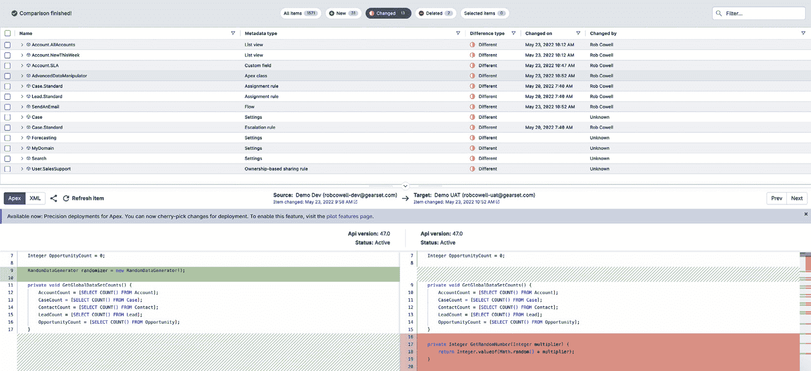
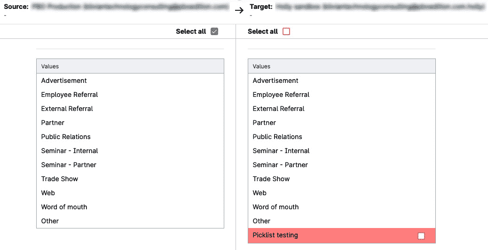
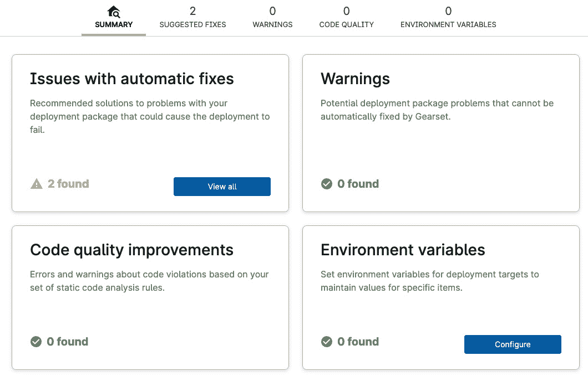
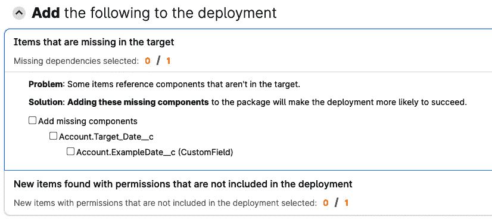
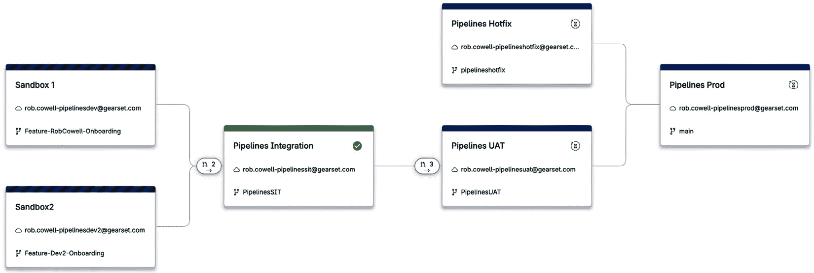
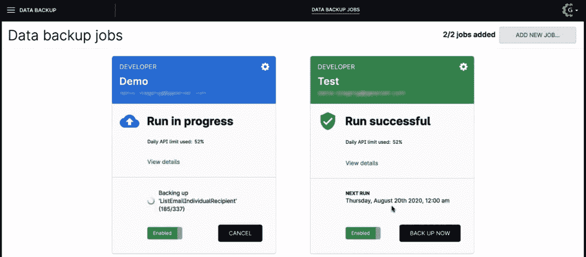

# Salesforce DevOps 工具 – Gearset

在本章中，我们将通过查看**Gearset**来开始探索 Salesforce DevOps 解决方案的市场，它是一个在 Salesforce 生态系统中广泛使用的领先 DevOps 平台。

我们将覆盖以下主要主题：

+   Gearset 概述 – Gearset 及其主要功能概览

+   Gearset 的优势 – Gearset 平台的关键优势分析

+   Gearset 的劣势 – 探讨 Gearset 在 DevOps 方法中的一些潜在劣势

到本章结束时，你应该对 Gearset 有足够的了解，以便能够决定它是否是适合你 Salesforce DevOps 需求的平台。

# 技术要求

本章的明显技术要求是，如果你希望跟着本章内容进行操作，你需要一个 Gearset 许可证。如果没有许可证，你可以通过[gearset.com](http://gearset.com)获得一个为期 30 天、功能齐全的免费试用版来试用。

# Gearset 概述

Gearset 于 2015 年诞生，是一个专为 Salesforce 生态系统内的发布管理设计的工具。它由一支来自微软开发生态系统的团队创建，他们对 Salesforce 缺乏类似于微软世界中的 DevOps 工具感到惊讶。随着 Gearset 的成长和成熟，它提供了一整套全面的功能，涵盖了部署和数据管理的各个方面。

Gearset 的核心功能是它能够快速可靠地部署变更。通过简化部署过程，Gearset 使用户能够更多地专注于发布管理的战略层面，而不是陷入复杂的过程中。

该平台将多个关键功能整合在一个平台上，提供无缝和集成的体验。这种集成不仅简化了工作流程，还确保用户可以访问广泛的工具，这些工具对于有效的发布管理至关重要。从自动化发布流水线到提供先进的数据管理和备份能力，Gearset 提供了一个强大而多功能的解决方案，满足 Salesforce 专业人士的多样化需求。

Gearset 全面的功能集，加上直观的设计，使其成为希望优化 Salesforce 部署流程的专业人士不可或缺的工具。让我们现在来看看一些功能，这些功能按照它们最相关的 DevOps 领域进行分组：

| **功能类型** | **功能** | **描述** |
| --- | --- | --- |
| 部署 | 实时元数据比较 | 允许用户查看即时的比较结果，并通过逐行差异查看，突出显示元数据、Apex、HTML 等方面的变化 |
|  | 版本控制支持 | 支持部署到任何基于 Git 的版本控制仓库，包括本地选项 |
|  | 部署回滚 | 使用户能够轻松回滚不需要的元数据更改 |
|  | 完整的部署历史 | 用户可以注释部署并查看每次更改的详细报告 |
| 自动化 | 部署管道 | 提供完整的发布管道可视化和管理，具有强大的集成能力 |
|  | **持续** **集成** (**CI**) | 促进在 Salesforce 上最可靠的 CI，简化交付过程 |
|  | 监控 | 跟踪每日组织快照和变化，确保没有被覆盖 |
|  | 单元测试 | 自动化 Apex 测试，跟踪代码覆盖率和测试状态，并提醒用户失败的测试 |
| 数据管理 | 数据种子 | 允许用户从 Salesforce 组织中选择特定数据并将其部署到其他环境，保持对象之间关系的完整性 |
|  | 智能关系处理 | 自动检测和处理父子关系及循环引用 |
|  | 数据迁移工具 | 允许在一次运行中部署多个对象的记录，查看数据部署历史，并共享部署模板 |
|  | 支持 Salesforce **配置、定价、** **报价** (**CPQ**) | 部署复杂的 CPQ 配置数据和 CPQ 记录 |
|  | 数据掩码 | 掩盖敏感数据以确保保密性和合规性 |
| 备份 | 自动备份 | 对数据和元数据的频繁备份，最小化数据丢失 |
|  | 快速恢复 | 允许轻松恢复丢失的记录或整个组织 |
|  | 分析和警报 | 提供浏览备份、跟踪趋势以及配置异常变化的警报功能 |
|  | 安全性与控制 | 提供加密密钥管理和与**Amazon Web** **Services** (**AWS**)的安全数据存储 |

表 12.1 – Gearset 在 Salesforce DevOps 各关键领域的能力

如您所见，Gearset 是一个全面的 Salesforce DevOps 平台，涵盖了成熟解决方案的核心需求。接下来，我们将更详细地了解它的工作原理，识别其关键优势和任何不足之处。

# Gearset 的优势

Gearset 技术的核心是其元数据比较引擎，它可以快速识别源和目标元数据集之间的变化，无论是在源控制中还是在 Salesforce 组织中，双向都能处理。这使得 Salesforce 从业人员能够快速查看发生了什么变化，并将其构建成部署内容或提交到源控制的一组更改，界面直观易懂。在下图中，我们可以看到 XML 元数据的逐行对比：

图 12.1 – Gearset 的 XML 元数据比较。此截图的目的是展示页面布局；文本的可读性并不是重点。

相比之下，下一张截图展示了一个更丰富的用户界面，用于管理选项列表值元数据：

图 12.2 – Gearset 的选择列表值比较，使用自定义用户界面代替 XML

Gearset 吸引力的核心在于其对 Salesforce 元数据的深刻理解，使用户能够以极为详细和深入的方式管理和部署变更，这在 DevOps 工具领域是罕见的。这一能力在处理复杂部署时尤为重要，因为这类部署常常伴随挑战和风险。

因此，Gearset 的元数据处理能力不仅仅是一个功能；它代表了 Salesforce 部署管理方式的根本变化，使部署变得更加易于访问，且减少了错误的发生。Gearset 对减少错误的承诺最直接的体现就是其问题分析器，它会检查每个部署中的工件，找出可能阻碍部署成功的问题。通过将静态代码分析与对元数据依赖关系和常见问题的理解相结合，许多问题不仅能得到预防，还能在实际部署之前自动解决。下一张截图展示了 Gearset 如何识别出一些问题：

图 12.3 – 问题分析器检测问题

点击**查看所有**按钮可以查看具体问题并解决它们，如下图所示：

图 12.4 – 问题详情及在 Gearset 中自动解决问题的选项

除了基本的部署功能，Gearset 在持续集成（CI）和测试方面表现出色。在软件开发中，保持高质量的代码标准至关重要，而 Gearset 在这一领域的工具确保这些标准不仅得到满足，而且始终如一地保持。通过自动化测试和集成过程中的关键环节，Gearset 帮助团队专注于开发，而不是被测试和集成的繁琐机制所困扰。这一自动化功能是一个改变游戏规则的工具，尤其对那些在大型或复杂 Salesforce 项目上工作的团队而言，错误发生的风险较大。

Gearset 的旗舰自动化功能被称为**管道（Pipelines）**，它是一个可视化的表示，展示了构成你持续集成和持续部署（CI/CD）管道的各种环境和代码库（因此得名），使团队能够更高效地管理整个发布管道。它与版本控制工具和 Jira 等工具无缝集成，并提供先进的分支管理功能，可以同时处理多个分支：

图 12.5 – 一个示例的 Gearset 管道视图，显示 Git 提交等待在不同环境之间移动。此截图的目的是展示页面布局；文本可读性并不重要。

Gearset 的数据备份和恢复功能解决了 Salesforce DevOps 中的另一个关键需求——数据安全。在数据不仅具有价值而且容易受损的时代，拥有强大的备份和恢复机制是不可妥协的。Gearset 对数据备份的方法全面，确保数据不仅安全备份，而且在丢失或损坏时易于恢复。这种数据安全和管理水平是一个重要的优势，为 Salesforce 团队提供了安心和运营稳定性：

图 12.6 – Gearset 数据备份作业

作为 Salesforce DevOps 平台，Gearset 的优势根植于其对 Salesforce 管理的全面性方法。它不仅仅是一个工具；它是一个全面解决 Salesforce DevOps 多方面挑战的解决方案。从部署到测试，从数据管理到恢复，Gearset 作为一个理解并有效应对 Salesforce DevOps 社区需求的平台脱颖而出。

# Gearset 的弱点

有人看到优势，有人看到弱点，而 Gearset 在这方面并不免疫，特别是与其他 Salesforce DevOps 解决方案相比较时——这在组织开始他们的 DevOps 之旅并确定最适合其需求的解决方案时经常发生。

可灵活选择您希望如何管理 DevOps 流程的方法，这在需要更多指导和协助的团队看来往往被视为弱点。同样，虽然有些人认为 Gearset 作为一个独立于 Salesforce 平台并通过 API 集成进入的应用程序具有优势，但其他人则认为它不是 Salesforce 原生应用程序是一个弱点。

Gearset 专为 Salesforce 核心平台量身定制，同时支持诸如**CPQ**和 Salesforce Industries（之前称为**Vlocity**）的功能。对于寻求覆盖不仅其他 Salesforce 产品（或“云”），而且其他非 Salesforce 平台的全能 DevOps 解决方案的团队来说，Gearset 可能并不是最佳选择。一些技术领袖更倾向于投资于整体 IT 资产的全能解决方案。

对于更高级的 DevOps 从业者来说，缺乏直接的代码编辑能力和 API 访问限制了与其他工具的集成以及在更脚本化的方式上自动化某些流程，这在其他解决方案中是可能的。

以下是这些观点的总结，以帮助您的决策过程：

| **弱点** | **描述** |
| --- | --- |
| DevOps 管理的灵活性 | Gearset 在 DevOps 管理方面的灵活性被认为是一个劣势，尤其是对于那些需要更具指导性和特定方法论的团队。 |
| 非 Salesforce 原生 | 作为一个外部应用而非 Salesforce 原生应用被认为是一个缺点，因为它通过 API 集成，而不是直接集成在 Salesforce 平台内。 |
| 功能范围有限 | Gearset 针对 Salesforce 核心平台量身定制，支持 CPQ 和 Salesforce Industries 等功能，但它并不是一个覆盖更广泛 Salesforce 产品或非 Salesforce 平台的全能型解决方案。 |
| 限制的高级 DevOps 功能 | 缺乏直接的代码编辑功能和受限的 API 访问被视为对需要更深入集成和自动化能力的高级 DevOps 用户的一种限制。 |

表 12.2 - Gearset 弱点总结

# 总结

Gearset 已成为专门为 Salesforce 生态系统量身定制的领先 DevOps 解决方案。其全面的功能集使其能够满足与部署、测试、数据管理以及备份/恢复相关的广泛需求。Gearset 简化并优化了诸如元数据部署和持续集成（CI）等流程，减少了手动操作并最小化了错误。这种高效性不仅来自于自动化常规任务，还得益于 Gearset 对 Salesforce 元数据的深入洞察。

虽然有些人可能会认为 Gearset 相较于更广泛的、全能型 DevOps 平台，其灵活性和专注于 Salesforce 的方法是劣势，但 Gearset 无疑在管理核心 Salesforce 开发和发布流程方面表现出色。对于那些希望优化 Salesforce DevOps 工作流的团队来说，很少有工具能与 Gearset 在强大功能与直观可用性上的结合相匹敌。随着 Salesforce 项目的规模越来越大，复杂性也在增加，Gearset 提供了可靠性和精确度，使得团队可以自信地发布更新。对于大多数 Salesforce 团队来说，Gearset 应该是一个值得考虑的 DevOps 解决方案。

在接下来的章节中，我们将探讨 Salesforce DevOps 领域的另一个主要参与者：Copado。我们将以类似的方式，分析它作为一个即用型解决方案在 Salesforce DevOps 中的关键优势和劣势。
