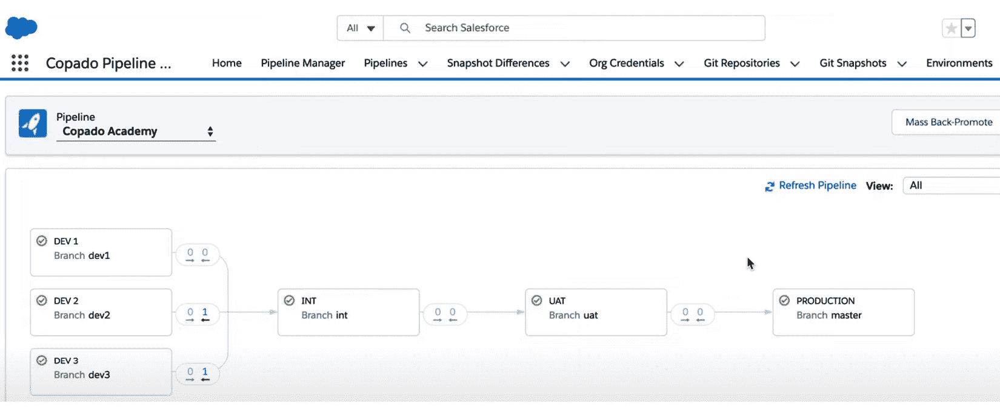
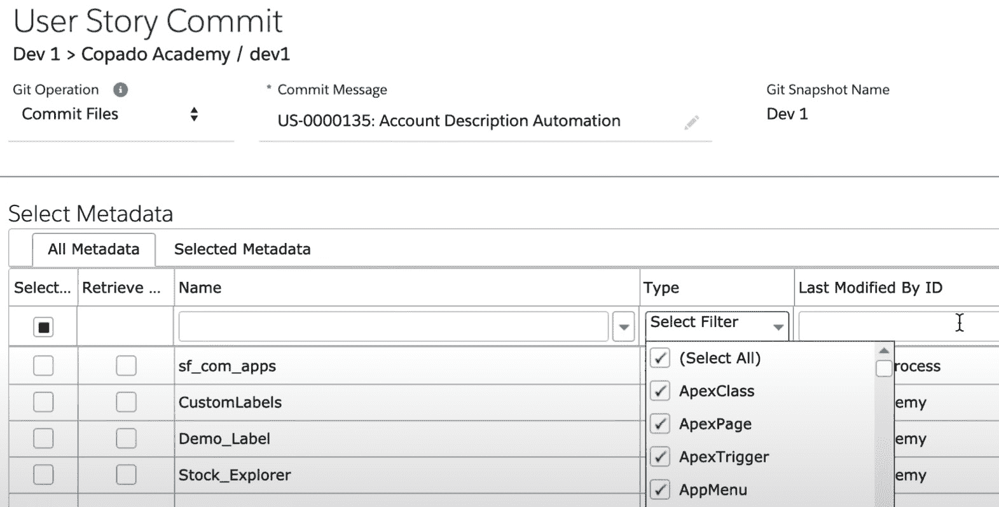
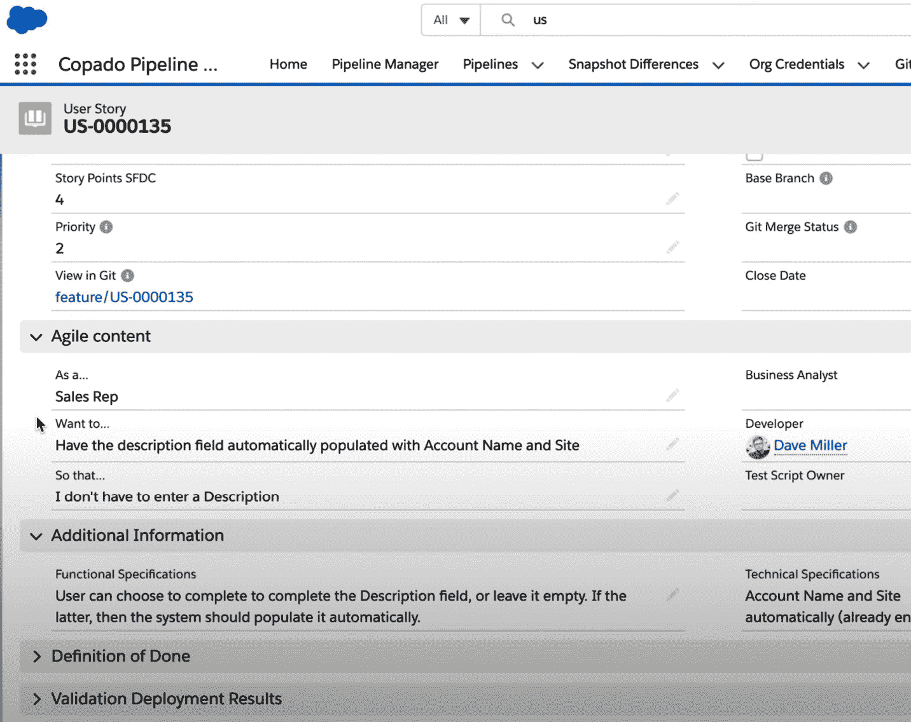
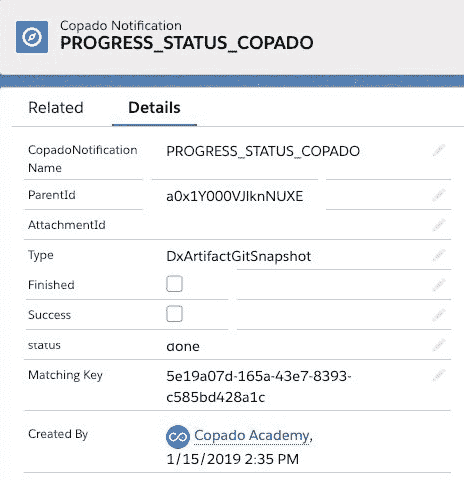

# 13

# Copado

本章将深入探讨 Copado 的关键功能和能力，涵盖其底层数据模型和管理。我们将研究 Copado 如何通过自动化和简化任务，如版本控制、构建自动化、测试和部署，来解决 Salesforce 开发中的挑战。我们还将探讨 Copado 如何与 Salesforce 本地对象集成，以实现集中式报告和过程监控。

除了探索 Copado 的技术能力外，我们还将讨论平台的优势和不足；理解这些对考虑实施 Copado 的组织至关重要，因为它有助于他们对齐预期并有效规划资源。

本章将涵盖以下主题：

+   Copado 概述

+   了解 Copado 的优势

+   探索 Copado 的不足之处

到本章结束时，你将全面了解 Copado 及其在 Salesforce DevOps 中的角色。你将获得的见解将帮助你做出有关如何在自己的 Salesforce 环境中利用 Copado 的明智决策，并帮助你更轻松、高效地应对 Salesforce 开发中的复杂性。

# Copado 概述

Copado 提供一个端到端平台，用于在**Salesforce**中应用**DevOps**原则和实践进行开发。作为一个建立在 Salesforce 平台上的原生应用，Copado 旨在解决 Salesforce 核心产品中的一些缺口，这些缺口妨碍了**持续集成和交付**（**CI/CD**）的有效实施。本概述将详细介绍 Copado 的底层数据模型、关键技术能力以及基于公开文档的管理。

Copado 允许团队完全在 Salesforce 内部实现 DevOps 工作流，而无需广泛使用外部工具。它集成了版本控制、构建自动化、测试和部署，同时保留了本地报告和过程可视性。平台围绕一个核心抽象层展开，自动处理许多复杂任务，如分支管理。

## 平台

Copado 利用**以用户故事为中心的数据模型**，即以用户故事为中心的部署模型，将任何需求与特定的元数据变更关联。用户故事实体将代码与其业务目的和工作范围相关联，以实现增量交付。故事通过预定义的管道流动，从低级开发环境一直延伸到生产环境，类似于其他配置管理数据库。以下截图展示了一个示例管道：

图 13.1 – Copado 管道示例

Copado 平台通过使用语义冲突解决引擎，在复杂的**Git**分支和合并操作之上进行抽象。这避免了开发者需要手动处理合并冲突和 Git 命令。相反，平台通过使用从低环境到高环境流动的流水线以声明性方式处理分支。

Copado 中的所有用户操作都与本地 Salesforce 对象集成，以便集中报告和流程监控。这保留了审计性和可见性，用户可以在管理员已经熟悉的 Salesforce 界面内进行操作。不需要外部仪表板或报告来监控 DevOps 流程。

Copado 的功能涵盖了整个 DevOps 生命周期，从初始需求到生产部署：

+   用户故事的需求管理

+   自动化版本控制

+   持续集成，触发质量门控

+   协调的环境间提升

+   部署流水线配置

+   通过回传促进组织同步

+   内置可见性和报告

这些功能共同为开发团队提供一个全面的系统，帮助团队在 Salesforce 中实现敏捷、迭代的 DevOps 模式。

## 版本控制

Copado 通过自动为每个用户故事提交的元数据组件创建功能分支，来集成 Git 版本控制。精确的分支结构反映了用户故事在不同 Salesforce 沙箱和环境之间流动的进程，这些环境在流水线中有定义。

以下截图展示了与版本控制的集成：

图 13.2 – Copado Git 集成

双向部署和分支合并确保所有环境和沙箱在变化通过测试和生产过程中上下游流动时保持同步。开发者和管理员无需进行手动的 Git 操作。

Copado 的冲突检测利用语义分析来处理元数据，而不仅仅是语法代码对比。这使得它能够检测组件之间的逻辑冲突，这些冲突可能无法合并，比如冲突的字段级安全规则。平台会提前警告用户这些冲突，以避免部署失败。

管理员可以通过 Copado 中的流水线定义组织的分支策略和环境拓扑，而无需了解 Git 的内部机制。复杂性被隐藏在抽象层下。

## 构建集成

持续集成是 Copado 的关键功能。在每次代码提交或提交操作时，平台可以自动触发配置的测试、验证和其他质量门控。这些可以包括 Apex 测试、代码检查、静态分析或任何其他自定义步骤。

测试和验证的输出直接记录到 Salesforce 中相关的用户故事中，以便追踪。开发人员可以立即看到结果，无需单独的 CI 服务器。您可以通过原生报告保持代码质量的合规性。

第三方工具，如**Jira**和**Azure DevOps**，可以通过内置的 Webhooks 或自定义的**Apex**适配器与 Copado 的 CI 管道集成。自定义插件允许管理员修改和定制 Copado 的标准 CI/CD 流程，以插入自定义质量门。例如，您可以配置一个 Webhook，在代码部署到 UAT 或生产环境之前，通过其 API 调用您首选的安全扫描工具。

Copado 旨在通过将左移测试和质量保证自动嵌入提交过程中来推动左移测试。强制性门确保所有提交的代码通过一致的自动执行保持在最低质量标准上。

## 部署

在部署过程中，Copado 引入了“推广”概念，用于在管道中移动用户故事之间的环境。推广通过声明性的 Copado 界面定义的管道向下拉取元数据更改。

以下截图展示了一个示例用户故事：

图 13.3 – 一个示例的 Copado 用户故事

权限方案授予在管道阶段之间推进所需的批准。强制性的手动审批门可以确保任何更改都已获得授权。Copado 的选择性回滚功能还可以重新部署以前的元数据提交（根据需要），以快速恢复生产环境。

重要说明

“阶段”被分类为具有相似业务角色的环境集合，如开发、测试、生产等。它们为发布经理提供了以视觉和系统化的方式组织其管道和环境的能力。此外，阶段还便于在执行时配置和操作各种功能。例如，在涉及质量门规则、自动化规则或使用 Copado 的**持续交付**和**部署**步骤的场景中，可以选择在特定阶段应用这些流程。

连接行为配置了额外的操作，例如在管道的每个阶段执行的自动电子邮件通知。例如，您可能希望所有生产部署都向安全审核员发送电子邮件。行为标准化了这些过程。

推广将代码移动与审批和通知政策结合起来，以避免*影子 IT*（非 IT 员工执行 IT 任务），并实现合规性。回滚通过允许在发现问题时自动将不安全的更改从环境中移除，从而降低风险。

## 环境

Copado 保持 Salesforce 沙盒在严格的事务同步状态中，无需重复的手动刷新操作。在低环境之间刷新会在开发工作流中造成显著的摩擦。

重要提示

**回退推广**是一个旨在将用户故事从高环境传输到低环境的过程，具有三个主要目的：它通过保持一致的更改确保跨环境的同步，促进将生产环境中的热修复传播到下游环境，并通过推荐回退推广来减少合并冲突，从而简化集成。

相反，回退推广（见提示）会根据需要自动将上游代码更改合并到下游环境。平台持续监控每个组织的部署准备状态，然后执行下游分发。

有限的金丝雀发布将新元数据的子集引入沙盒，以便在完全分发之前进行增量发布。这限制了风险，并允许对较小的更改批次进行测试。

这些功能的结合使开发人员能够在无需刷新页面的情况下访问最新的共享更改，即使更新持续流向生产环境。它提供了一个紧密的内部开发循环。

## 变更管理

在此语境中，变更管理指的是控制用户权限和访问权限的能力；这在 Salesforce 中构成挑战，因为权限和访问控制分布在各个互联的元数据实体中，如配置文件、权限集和字段级安全规则。

Copado 中的完整配置文件部署将所有相关元数据封装为一个原子单元，作为一个整体来部署配置文件。这避免了随着更改传播，权限不同步的情况。类似地，权限集在各环境间保持一致的字段级访问。

该平台跟踪所有修改，将它们归因于特定的开发人员、用户故事和承诺，以便进行完全的审计。您可以生成关于敏感配置或属性（如记录所有者）的详细修改报告。

总结来说，变更跟踪在变化双向流动的过程中保持安全合规性和配置完整性，避免了多次部署可能带来的碎片化。相关的元数据作为一个整体包部署。

## 管理

Copado 的一个关键目标是实现无需 extensive 培训或专业化的实施。所有配置都利用类似于 Salesforce 核心界面的声明式、点选式自定义。已经熟悉 Salesforce 的用户会发现该工具直观易用。

报告与 Salesforce 核心对象（如用户故事和推广）集成，生成流程指标和仪表盘，以便于可视化。预构建模板开箱即用。

管理员通过使用与 Salesforce 核心相同的工具来监督访问控制、使用策略和其他平台治理。变更集可以在环境之间推送策略，个人资料控制访问权限。

最终，Copado 管理的声明性特点保持了较低的学习曲线。随着实践的成熟，组织可以在不打断的情况下逐步优化角色和权限。

Copado 提供了一个可扩展的平台，用于通过不可变基础设施和基础设施即代码等实践实施 Salesforce 应用程序的持续部署。它的核心价值来源于 Salesforce 平台固有的部署复杂性的本地集成和自动化处理。

总体而言，Copado 旨在消除在 Salesforce 开发中实施现代 DevOps 实践时的许多重复性任务和障碍。通过提供版本控制、CI/CD 和环境管理，它使团队能够扩展敏捷和迭代开发。Salesforce UI 中的整合简化了采用过程。

## 机器人测试

旨在显著减少开发和部署测试用例所需的时间和精力，**Copado 机器人测试**（**CRT**）提供了测试用例的详细分析，增强了测试过程的有效性。作为一个主要的云解决方案，它可以通过 www.robotic.copado.com 访问，同时也具有作为本地服务的灵活性。为了满足多样化的用户群体，CRT 提供了一个有限的免费版本，非常适合用来学习和理解该框架。

CRT 的突出特点之一是它在为广泛应用编写测试用例方面的多功能性。这包括基于 Web 的应用程序、移动应用程序、Salesforce 应用、ServiceNow 应用、SAP 系统、简单网站和 REST API。它作为低代码和专业代码平台的双重特性使其特别易于使用；即使用户没有广泛的测试脚本语言或框架知识，也能凭借其基于关键词的开发功能高效开发测试用例。

CRT 通过其实时测试和视频流测试用例执行的功能，进一步简化了测试过程。此功能显著加速了调试过程，允许实时识别和解决问题。此外，该框架还提供了根据组织政策安排测试用例执行的灵活性。

总结来说，Copado 机器人测试作为一个全面、灵活且高效的自动化测试框架，在适应广泛应用和不同用户专业水平方面表现突出。其结合了实时测试能力、集成选项和对测试基础设施的结构化方法，使其成为软件开发和质量保证领域的宝贵工具。

# 理解 Copado 的优势

Copado 成立于 2013 年，已经发展成为一个领先的端到端 DevOps 平台，专为 Salesforce 开发和发布管理量身定制。凭借来自 Salesforce Ventures 和其他投资者的可观增长资本，Copado 提供了一整套全面的功能，支持并加速 Salesforce 部署。

Copado 的一个关键优势是它与 Salesforce 平台的深度原生集成。Copado 最初是为了应对当前市场中的一个巨大需求而构建的：帮助支撑 Salesforce DevOps 生命周期。

通过原生构建在 Salesforce 上，Copado 继承了该平台的安全性、认证以及其他优势，同时保持开发与运维之间的紧密集成。这与其他在 Salesforce 外部运行的工具形成对比，后者可能会导致集成问题。

与此相关，Copado 的元数据智能让它在理解依赖关系、检测冲突和合并 Salesforce 环境中的更改方面具有优势。Copado 的“秘密武器”在于它能够（代表你）通过转换用户故事之间的一对一关系，在特定功能的分支上构建分支。

重要提示

合并冲突发生在两个更改分别在不同环境中对相同的元数据组件进行修改，且无法自动和解时。

Copado 并非在文件层面工作，而是在元数据 API 层面操作，这使它在合并和部署更改时具有优势。这有助于解决用户在处理 Salesforce 元数据时常遇到的合并冲突问题。

Copado 在提供端到端应用生命周期管理方面同样表现出色，不仅仅是部署。它的缺陷追踪、用户故事、流水线和工作流支持开发团队从构想到发布的规划、协调和跟踪工作。例如，Jira 工单会转化为 Copado 用户故事，将开发工作与下游发布流程连接起来。这可以通过将业务需求与开发者的努力相连接，来加速开发。

对于较大的开发团队来说，Copado 在功能和集成方面难以匹敌。它结合了 Salesforce 平台的优势与 Heroku 可扩展的基础设施，用于计算密集型任务，如元数据处理。Heroku 架构在提供必要性能的同时简化了安全审计。这使得 Copado 能够提供 **应用生命周期管理** (**ALM**)、测试、合规性和其他大多数部署工具无法提供的功能。

# 探索 Copado 的弱点

Copado 已经成为一个强大的解决方案，提供一整套支持 Salesforce 开发生命周期各个方面的功能。然而，和任何工具一样，它也有其局限性和挑战。本节将探讨这些潜在的弱点，提供平台能力与局限性的平衡视角。

与 Copado 相关的一个关键挑战是其复杂性。该工具提供了广泛的功能和能力，这对于新用户来说可能会感到不知所措。有效利用所有功能所需的学习曲线可能很陡峭，这可能会减慢实施和采纳的速度。

一个相关问题是，将 Copado 集成到现有的 Salesforce 和 CI/CD 生态系统中，尤其是那些具有复杂技术堆栈的系统，可能会有一定的困难。与各种工具的兼容性和无缝集成可能需要额外的配置和努力，对于资源有限的团队来说，这可能是一个挑战。

此外，Copado 需要持续的维护，以使其与 Salesforce、您的 CI/CD 管道以及组织不断变化的需求保持一致。管理这些持续的变化可能会耗时，并且可能会加剧资源压力，尤其是对于较小的团队来说。

Copado 的另一个潜在弱点是其处理后端处理的方式。尽管使用 Heroku 进行后端处理使 Copado 能够利用 Heroku 在元数据检索、处理和部署方面的强大功能和速度，但它也有启动成本。如果 Heroku 用于从代码库部署元数据，首先必须克隆该元数据，这就为每个作业带来了一定的性能成本。

然而，值得注意的是，Copado 声称已优化此过程，仅获取最小的历史记录来启用合并。但即便如此，启动成本仍可能成为潜在的瓶颈，尤其是在更大规模的部署中。

此外，虽然 Copado 使用 Salesforce 作为其用户界面和数据存储提供了一些好处，但它也带来了一些挑战。例如，所有日志和其他文件都作为附件存储在 Salesforce 包中，这可能使得它们难以阅读。此外，由于 UI 是基于 Salesforce 构建的，一些用户可能觉得它看起来略显笨拙，并且可能并不总是提供最直观的用户体验。

此外，Copado 关于作业结果的通知并不总是显而易见，这可能导致混淆或错过通知。特别是在 DevOps 环境中，关于部署、测试和其他过程的及时通知至关重要。举例来说，下面是一个未正确更新的通知截图，因此，它被标记为完成，但既未完成也未成功：

图 13.4 – 一个停滞的 Copado 通知

最终，虽然 Copado 无疑是一个强大而全面的 Salesforce DevOps 工具，但它并非没有挑战。了解这些潜在的弱点对于考虑实施 Copado 的组织至关重要，因为这使得他们能够为这些挑战做好计划，并确保他们具备必要的资源和策略来克服这些挑战。

# 总结

总之，Copado 提供了一套强大且全面的 DevOps 工具，专门为 Salesforce 设计。通过深度的原生 Salesforce 集成，它有效地填补了平台中的空白，自动化了版本控制、CI/CD 和环境管理等复杂任务。

它以用户故事为中心的数据模型和与第三方工具的无缝集成，使其成为敏捷和迭代开发的宝贵资产。然而，像任何工具一样，它也有其局限性。复杂性和陡峭的学习曲线可能对新用户构成挑战。此外，通过 Heroku 进行的后台处理，虽然强大，但可能会为较大规模的部署带来性能成本。

尽管存在这些潜在的障碍，但通过适当的规划和资源，Copado 可以显著简化 Salesforce 开发和发布管理，成为组织在提升 Salesforce DevOps 生命周期方面的一个值得关注的选择。

为了解决 Copado 的复杂性和学习曲线带来的挑战，采取一种战略性的方法，包括彻底的培训和资源分配是至关重要的。组织可以为团队投资全面的培训项目，重点培养实际操作经验和现实场景中的技能，以提高熟练度。利用 Copado 丰富的文档和社区资源也能帮助这一学习过程。此外，逐步实施的策略有助于团队逐步适应工具的复杂性，从基本功能开始，逐步过渡到更高级的特性。

关于通过 Heroku 进行后台处理时与较大规模部署相关的性能成本，优化 Heroku 内的配置和扩展策略可以缓解这些问题。这可能包括利用更高效的资源分配，优化工作流以提高性能，并确保 Heroku 环境针对部署的特定需求进行定制。此外，定期监控和审查性能指标有助于及时识别并解决任何低效问题。通过解决这些方面，组织能够充分发挥 Copado 的潜力，使其成为 Salesforce DevOps 工具包中的强大资产。

通过这些措施，Copado 的优势能够得到充分体现，克服其初期的障碍，为 Salesforce 开发和发布管理提供一个简化且高效的解决方案。在接下来的章节中，将介绍 Flosum，这是 Salesforce DevOps 领域中的另一款工具，并探索其特点和功能。
