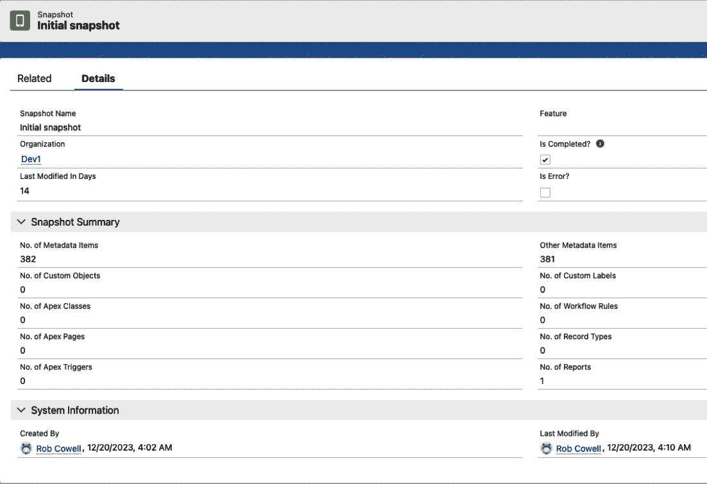
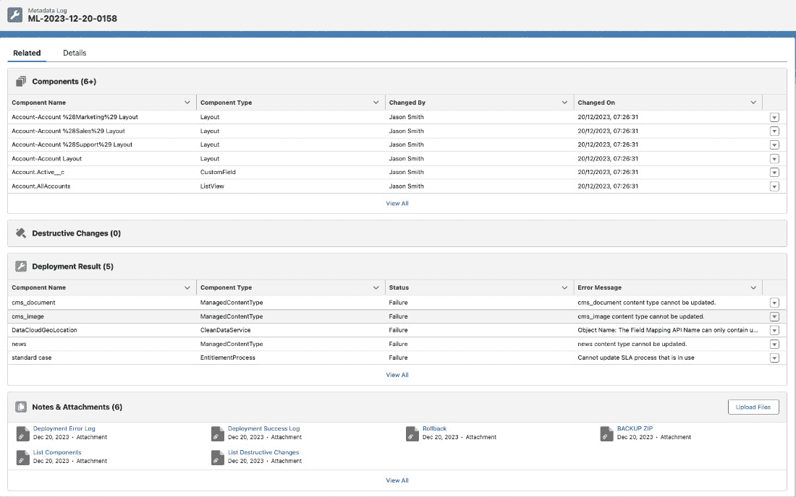
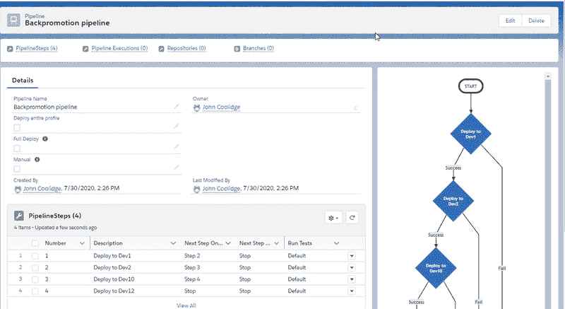

# Salesforce DevOps 工具 – Flosum

Flosum 是 Salesforce DevOps 生态系统中的重要参与者之一，提供了一套旨在增强和简化开发过程的工具。本章深入探讨了 Flosum 的多面性，探索其模块、集成功能以及在 Salesforce 生态中的独特地位。

我们的旅程将揭示，Flosum 的原生 Salesforce 平台构建不仅有助于无缝集成，还允许显著的定制和扩展性。

我们将涵盖以下主要内容：

+   Flosum 概述 – Flosum 及其关键功能概览

+   Flosum 的优势 – Flosum 平台的关键优势分析

+   Flosum 的弱点 – 观察 Flosum 在 DevOps 方法中的一些潜在弱点

本章结束时，您应已充分了解 Flosum，以便决定是否将其作为您的 Salesforce DevOps 需求的合适平台。

# 技术要求

如果您希望进一步探索 Flosum，并通过其网站 [flosum.com](http://flosum.com) 提供的产品演示，您可以通过开始 Flosum 专家认证，在 [success.flosum.com](http://success.flosum.com) 获取试用 Flosum 实例。

# Flosum 概述

正如您所期望的，Flosum 作为一款现代化的 Salesforce 特定 DevOps 解决方案，提供了涵盖 Salesforce DevOps 主要方面的广泛功能。在本节中，我们将探讨这些核心元素，并看看 Flosum 如何应对它们。

## 部署

Flosum 提供的核心是其 DevOps 模块，这是一个全面的套件，旨在促进整个开发生命周期。它提供了一个集成的环境，用于管理代码、配置和持续集成，从而简化了交付过程。

Flosum 在部署和变更管理方面的方法既创新又实用。它有效地处理部署前后的变更，将修改视为增量分支。这种粒度确保只有相关变更被部署，从而最大限度地减少错误风险并提高部署效率。

Flosum 中的“域”功能彻底改变了多生产组织的管理，提供了结构化和统一的方式。与此并行，部署经理作为关键工具，协调不同 Salesforce 组织之间的部署，简化了本来复杂的任务。

Flosum 的高级功能，如预部署修复能力和覆盖保护，展示了其复杂性。这些工具能够主动识别并解决常见问题，如 API 版本不匹配，从而提供更简化的部署过程。类似 Git 的拉取请求的同行评审过程，进一步强调了 Flosum 在促进协作和无错误开发方面的承诺。

Flosum 独特的地方在于它管理配置文件和权限集的方式。它支持部分检索和部署，只关注当前分支相关的组件。这种特定性不仅节省时间，还减少了部署的复杂性。

Flosum 的 DevOps 工作流以多功能性为特点，提供两种主要的操作方法 —— **通过 Salesforce Tooling API 进行源代码跟踪** 和 **基于快照的差异跟踪**。源代码跟踪功能利用了 Salesforce 自身的源代码跟踪功能，该功能是为 Salesforce DX 引入的，并且在 Flosum 中以相同的方式工作，而快照功能不仅有助于识别变化，还能促进高效的回滚，增强了开发过程的整体稳定性。下面是 Flosum 中的一个示例快照：

图 14.1 – Flosum 组织快照

注

上图中的文本细节最小化，并且与图形展示无直接关系。请参考免费下载的电子书以访问图形中的详细信息。

Flosum 中的部署验证过程非常细致，生成了全面的元数据日志。这个日志作为一个关键记录，提供了每次部署历史的洞察，帮助未来的审核和分析。下图展示了与部署相关的广泛元数据日志示例。

图 14.2 – 最近的部署，显示自动生成的元数据日志

注

上图中的文本细节最小化，并且与图形展示无直接关系。请参考免费下载的电子书以访问图形中的详细信息。

Flosum 对管道和自动化的处理方式既灵活又强大。用户可以创建单独的自动化流程，并根据需要对它们进行编排，而不必受限于固定的顺序。这种灵活性使得团队能够根据特定项目需求调整他们的 DevOps 流程。下图展示了一个示例管道，完整地呈现了自动化流程的可视化表示。

图 14.3 – 示例自动化管道

注

上图中的文本细节最小化，并且与图形展示无直接关系。请参考免费下载的电子书以访问图形中的详细信息。

部署管理器是 Flosum 对 CI/CD 编排的回答。它允许自动化管道的堆叠，提供了一种集中高效的方式来管理跨多个项目和环境的持续集成和交付。

## 信任中心

信任中心作为 Flosum 安全性的基石，提供了强大的工具来监控和确保合规性。该模块定期扫描 Salesforce 组织，生成任何检测到的安全漏洞或政策违规的警报，是 Flosum 对安全和合规承诺的体现。它不仅监控 Salesforce 组织的潜在安全漏洞，还自动生成违规警报和修复变更。Flosum 采取这种积极的安全策略，确保组织始终保持合规和安全。

## 备份和数据迁移

认识到数据完整性的重要性，Flosum 的备份和数据迁移模块为全量和增量备份提供了强大的解决方案。该模块支持大对象和二进制数据，确保全面的数据保护。

## 集成和自定义

Flosum 的集成功能证明了它的灵活性。虽然它提供了内置的源代码控制和票务追踪工作流，但它还可以与外部应用程序（如 Jira 和 Azure DevOps）连接，增加了灵活性，而 Flosum Scan 和 AccelQ 涵盖了代码扫描和回归测试的全方位功能。分支管理功能如权限设置、同行评审和合并跟踪，进一步证明了 Flosum 对简化和安全 DevOps 流程的承诺。这种互操作性使团队能够在现有工作流中利用 Flosum，从而提高生产力，而不会打乱已建立的流程。

Flosum 原生构建在 Salesforce 平台上，提供了前所未有的可扩展性。用户可以根据特定需求定制报告、仪表盘和布局，确保高度个性化和高效的 DevOps 体验。这种自定义不仅限于外观，还允许团队根据其独特的工作流需求调整工具。

通过使用 Salesforce 的全面报告和仪表盘功能，Flosum 提供了有关部署指标的重要见解。这些工具对于跟踪进展、识别瓶颈以及做出数据驱动的决策至关重要。

现在让我们总结一下这些功能，按照每个功能最相关的 DevOps 领域进行分类。

| **功能类型** | **功能** | **描述** |
| --- | --- | --- |
| **源代码控制** **管理** | 内置源代码控制 | 提供集成的源代码控制系统，允许在 Salesforce 环境中有效管理代码变更、版本控制和协作。 |
|  | 与外部工具的集成 | 支持与外部源代码控制工具（如 GitHub）集成，使团队能够在保持现有工作流的同时，利用 Flosum 的能力。 |
| **部署** **管理** | 部署管理器 | 一个关键工具，用于跨多个 Salesforce 组织编排复杂的部署，简化部署过程。 |
|  | 基于快照的差异跟踪 | 使用 Salesforce Org 的定期快照跟踪变更，帮助识别差异并在需要时进行回滚。 |
| **安全和合规性** | 信任中心 | 监控 Salesforce Org 的安全违规和策略违规，提供警报和自动化修复更改，确保合规性。 |
|  | 覆盖保护 | 包括带有内置合并编辑器/差异查看器的合并冲突管理，增强代码集成的安全性和准确性。 |
| **备份和恢复** | 备份和数据迁移工具 | 提供完整和增量备份 Salesforce 数据的解决方案，确保数据完整性和可用性，用于灾难恢复。 |
| **代码质量和测试** | Flosum 扫描 | 内置的代码扫描器，有助于在开发过程早期保持高代码质量并识别潜在问题。 |
|  | 与 AccelQ 的集成 | 支持与 AccelQ 的集成，进行全面的回归测试，确保 Salesforce 应用程序的可靠性和稳定性。 |
| **协作和审阅** | 同行审阅框架 | 促进协作的代码审阅流程，类似于 Git 的拉取请求，允许逐行评论和彻底审查。 |
|  | 分支权限和合并跟踪 | 有效管理分支权限并跟踪合并，确保受控和安全的开发实践。 |
| **自动化和效率** | 自定义流水线和自动化 | 允许创建和编排自定义流水线和自动化，为特定项目需求量身定制 DevOps 过程。 |
|  | 部分检索配置文件和权限集 | 允许选择性检索和部署与分支组件相关的配置文件和权限集，提升效率。 |
| **报告和见解** | 部署指标的报告和仪表板 | 提供全面的报告和仪表板，提供关键的部署指标见解，支持数据驱动的决策制定。 |

表 14.1 – Flosum 的 DevOps 能力摘要

现在我们已经看到 Flosum 提供的各种 DevOps 功能范围，让我们深入了解产品的优势和劣势所在。

# Flosum 的优势

Flosum 在许多领域都表现出色，肯定能满足大多数 Salesforce 团队的需求。以下是此平台的一些关键优势：

+   **与 Salesforce 的原生集成**：为习惯于 Salesforce 的用户提供无缝兼容性和直观的用户体验，简化操作并增强用户体验。

+   **全面的工具集**：包括源代码控制管理、部署自动化、备份和恢复以及安全和合规性监控功能，涵盖广泛的 DevOps 流程。

+   **定制化和可扩展性**：它允许广泛定制报告、仪表板和布局，以满足特定的工作流需求，适应多样化的团队需求。

+   **高级部署管理**：部署管理器能够处理复杂场景，包括管理多个 Salesforce Org，简化部署生命周期。

+   **安全性和合规性**：它具备一个信任中心模块和其他安全功能，提供强大的安全监控和合规性，保持数据完整性并遵守监管标准。

+   **与外部工具的集成**：它兼容 GitHub 和 Jira 等工具，提供灵活性，可以使用内置的或偏好的外部源代码控制和问题追踪工作流。

+   **质量保证**：它包含内置的代码扫描功能，并支持外部代码质量工具，专注于高代码质量和早期问题识别。

+   **备份和数据迁移**：它提供强大的数据完整性和可用性解决方案，对于灾难恢复和业务连续性至关重要。

+   **分支和合并管理**：它提供如分支权限和同行评审框架等功能，促进协作和高效的开发工作流。

+   **用户友好的界面**：它拥有直观且易于访问的用户界面，适合广泛的用户群体，降低了学习曲线。

+   **管道和自动化灵活性**：它使团队能够创建和编排自定义管道，自动化流程以提高效率并满足动态 DevOps 需求。

# Flosum 的弱点

Flosum 虽然是一个强大的 Salesforce DevOps 解决方案，但也存在一些可能影响其适用性的局限性。主要的限制之一是它的特定平台聚焦。Flosum 专为 Salesforce 设计，在这一环境中表现出色，但对于寻求更多平台无关的 DevOps 工具的公司来说，它可能不是理想的解决方案。这种专业化虽然对以 Salesforce 为中心的操作有益，但在多平台使用的技术环境中，它的实用性有限。

对于那些没有深入融入 Salesforce 生态系统的团队来说，Flosum 呈现出明显的学习曲线。其功能和操作紧密结合 Salesforce 平台，这对于不熟悉 Salesforce 细节的人来说可能会具有挑战性。这一方面可能会减缓 Flosum 在非 Salesforce 熟练环境中的采用和高效使用。

成本是另一个不能忽视的因素。Flosum 的专业性质和丰富功能伴随而来的高价可能对预算有限的小型组织或初创企业构成压力。这使得 Flosum 对于寻求经济高效 DevOps 解决方案的小型团队来说不够可及，但值得注意的是，所有付费供应商提供的解决方案都存在这一问题，而不仅仅是 Flosum。

与非 Salesforce 工具的集成，尽管支持大量解决方案，但并非总是无缝的，需要额外的插件或手动设置和安装。这一限制对于依赖于多种外部工具和系统的团队来说可能是一个重大缺点。特别是在 Salesforce 仅是多个平台之一的环境中，对更广泛集成能力的需求可能更加突出。

Flosum 对 Salesforce 平台的依赖意味着其性能和功能受到 Salesforce 自身性能水平和治理限制的制约。这种依赖可能导致瓶颈，正如在测试中观察到的某些页面加载速度缓慢的情况。对 Salesforce 基础设施和限制的依赖可能会影响 Flosum 的效率和可扩展性，特别是在复杂或大规模的操作中。

Flosum 的综合性质虽然是一种优势，但也带来了过度复杂化的风险。一些团队可能会被其广泛的功能所压倒，许多功能在简单的部署场景中可能并未被使用。这种复杂性可能导致效率低下，特别是对于那些更倾向于使用简化工具集的团队。

根据前几章对主要 Salesforce DevOps 平台的介绍，下面是一个简要的总结表格，帮助您做出决策。

| **弱点** | **描述** |
| --- | --- |
| 平台特定的聚焦 | 专为 Salesforce 设计，限制了其在多平台环境中的实用性。对于寻求平台无关 DevOps 解决方案的公司来说并不理想。 |
| 对非 Salesforce 用户的学习曲线 | 对于不熟悉 Salesforce 的团队来说，由于其深度集成，可能会导致采用和效率降低。 |
| 成本考虑 | 对于较小的组织或初创公司来说可能过于昂贵，影响预算有限的团队的可及性。 |
| 非 Salesforce 集成 | 尽管支持一些外部工具，但与非 Salesforce 工具的集成可能不易配置，这会影响依赖多样化外部系统的团队。 |
| 依赖 Salesforce 生态系统 | 性能和功能紧密依赖于 Salesforce，包括其性能水平和治理限制。Salesforce 中的问题直接影响 Flosum 的有效性，在某些情况下观察到页面加载速度慢。 |
| 过度复杂化的潜力 | 广泛的功能可能导致复杂性，这可能让人感到不知所措，并且在简单的部署场景中未被充分利用。 |

表 14.2 – Flosum 弱点概览

# 总结

Flosum 通过其灵活性和复杂性在市场中脱颖而出。它挑战了传统的 DevOps 方法，特别是与“Git 正统派”保持距离。这种立场，再加上其在 Salesforce 平台基础上对安全性和合规性的高度重视，使 Flosum 成为 Salesforce DevOps 领域中一个独特且有吸引力的选择。

从先进的部署选项到强大的安全措施，它的众多功能使其成为任何希望简化 DevOps 流程的 Salesforce 架构师必不可少的工具。正如我们在本章中探讨的，Flosum 的集成功能、可定制性和复杂的工具集使其在 Salesforce DevOps 领域中脱颖而出。

在下一章，我们将继续探讨另一个流行的 Salesforce DevOps 工具选择——AutoRABIT。
