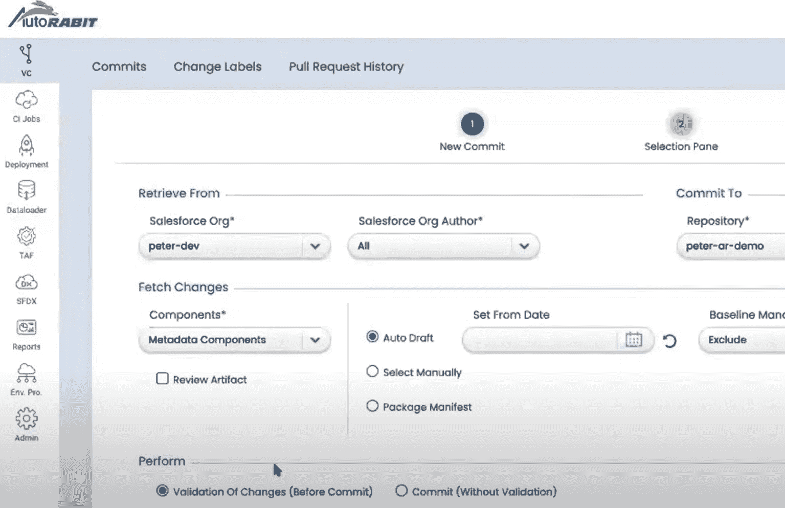
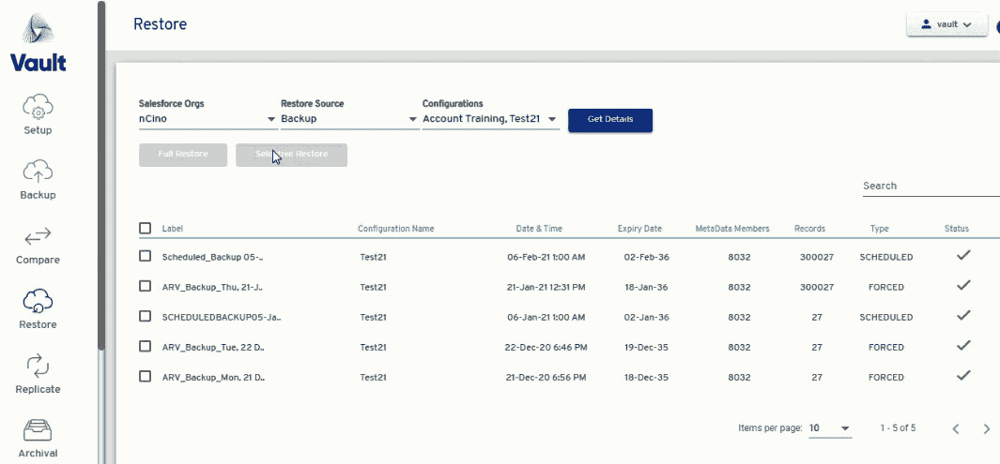
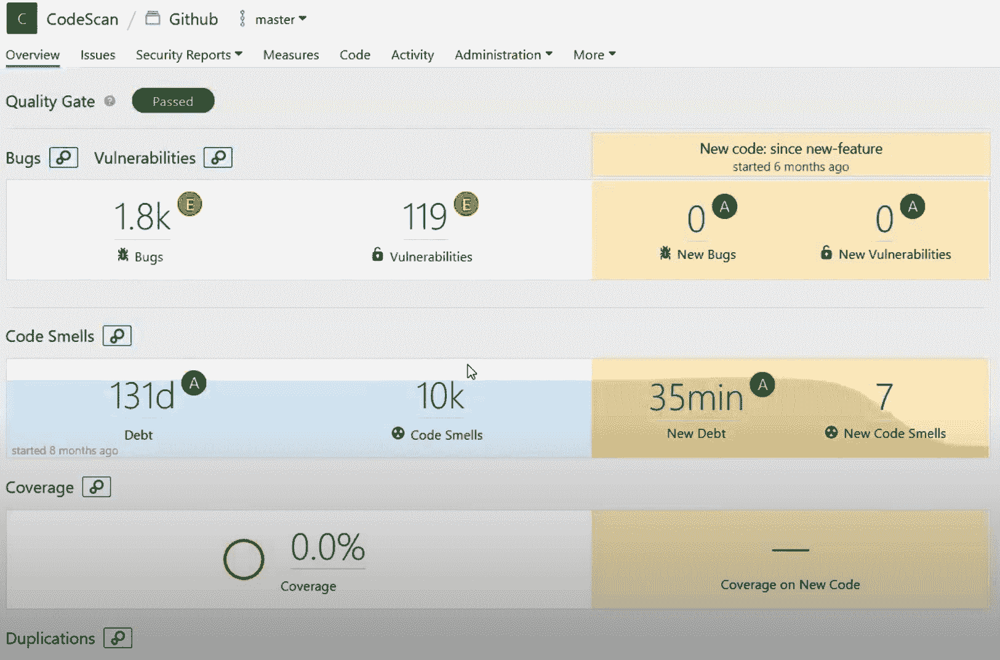
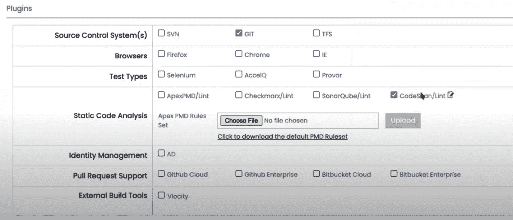

# 第十五章：AutoRABIT

在本章中，我们将深入探讨 AutoRABIT 平台，研究其核心模块如何在 Salesforce 生态系统中提供针对发布管理、数据保护和代码质量的端到端协调。我们将探索关键能力，如元数据处理、测试自动化、合规性控制、**持续集成/持续交付**（**CI/CD**）管道等。

本节旨在为读者提供 AutoRABIT 的概览，并解释它如何解决 Salesforce 团队在采用 DevOps 实践时常遇到的痛点。你将根据实际使用情况清晰地了解 AutoRABIT 的优缺点，帮助你判断它是否是适合你项目的 DevOps 解决方案。

本章将涵盖以下主题：

+   AutoRABIT 概述

+   了解 AutoRABIT 的优势

+   探索 AutoRABIT 的弱点

本章结束时，您将充分理解 AutoRABIT 针对企业级 Salesforce DevOps 量身定制的解决方案。

# AutoRABIT 概述

在动态变化的 Salesforce 开发世界中，组织常常面临碎片化流程、测试瓶颈和严格合规控制等挑战。AutoRABIT 凭借其全面的 DevOps 工具套件，成为解决这些挑战的关键方案。本节将深入探讨 AutoRABIT 平台，阐明其集成组件——**自动化发布管理**（**ARM**）、数据保护（AutoRABIT Vault）和代码质量（AutoRABIT CodeScan）——如何共同提升 Salesforce DevOps 流程。

我们不仅会探索这些解决方案的技术方面，还会展示它们如何产生实际影响；例如，缩短部署时间，同时增强合规性遵循，或简化 Salesforce 开发，确保数据完整性和安全性，符合复杂的法规。这些实际的见解突显了 AutoRABIT 在不同组织环境中的变革性影响，为读者提供对其能力和实际应用的全面理解。

## AutoRABIT 平台概述

AutoRABIT 平台包含三个支柱：

+   **ARM**：AutoRABIT ARM 为开发团队提供端到端的发布过程协调。它无缝集成了版本控制、CI 测试、合规控制和部署管道。

+   **数据保护**：AutoRABIT Vault 提供 Salesforce 数据和元数据的备份和恢复功能。它使团队能够保护信息的完整性，并满足数据隐私法规要求。

+   **代码质量**：AutoRABIT CodeScan 执行 Apex 和 Lightning 代码的静态分析，以识别漏洞并强制执行安全编码标准。

这些解决方案共同提供对整个 **软件开发生命周期**（**SDLC**）的统一可见性和控制。让我们更详细地探讨每一个。

## ARM

AutoRABIT 的 ARM 平台解决了在扩展 Salesforce 上的开发和配置时，由于缺乏强有力的流程而带来的沮丧，例如冲突的更改或缺乏可视性。

对于遭遇部署困难的团队，ARM 通过提供一个强大的工具集来管理和监控发布，帮助将混乱整理成秩序。通过自动化测试，集成测试瓶颈消失，在部署过程中自动执行测试。代码进程从提交到生产遵循一致、可预测的路径，这意味着你可以清楚地看到各个环节的进度。全面的控制和度量标准提供了进一步的防护措施和可见性，持续检查代码的状态。下图展示了**用户** **界面**（**UI**）：

图 15.1 – AutoRABIT ARM 用户界面

注意

上图中的文本细节最小化，且与图形的显示无关。请参考免费下载的电子书，查看图形中的详细内容。

使用 ARM，发布变成了一个无关紧要的事件。代码快速从开发流向部署，没有意外。让我们来看看关键功能。

AutoRABIT 提供先进的版本控制、合并和依赖关系管理，适用于复杂的 Salesforce 元数据关系。具体来说，它执行以下操作：

+   它检测跨分支的元数据和组件之间的细微差异。AutoRABIT 仅检索部署所需的更改元素。这种*增量部署*方法避免了对无关文件的重复处理。

+   合并引擎整合了来自多个流的并发更改。可定制的规则解决冲突而不会影响无关组件。

这些功能消除了在功能分支中跟踪元数据更改的头疼问题。AutoRABIT 能够清晰地合并代码而不修改无关元素。部署仅包含相关更改。

另一个导致部署延迟的原因是测试不足。AutoRABIT 通过以下方式将强大的测试自动化融入到管道中：

+   它在验证、提交和部署过程中运行 Apex 测试，并具有可配置的通过率规则。将测试作为强制步骤可以防止意外回归。

+   AutoRABIT 根据变更包中的组件即时解决测试类依赖关系。仅执行相关测试以提高速度。

+   它与 Selenium 等自动化测试框架集成，用于 UI 测试。

通过将测试前移，问题会在到达生产之前尽早显现。测试变成了一项日常活动，而不再是发布瓶颈。AutoRABIT 在交付的各个阶段提供可靠的自动化支持。

在医疗保健和金融等受监管行业中，发布需要严格的合规控制，以确保安全性和访问控制。AutoRABIT 自动化以下功能：

+   预部署时审查访问权限更改。添加字段时需要检查权限。

+   所有部署事件的不可变审计日志提供了后续证明。

+   静态代码分析集成能在部署前暴露潜在漏洞。

+   备份和恢复保护数据完整性

这些功能确保部署能够遵循诸如**系统和组织控制 2**（**SOC 2**）、**国际标准化组织**（**ISO**）*27001*、**通用数据保护条例**（**GDPR**）以及**健康保险携带与责任法案**（**HIPAA**）等标准。

AutoRABIT 开箱即用地支持 CI/CD 流水线，具有以下优势：

+   提交后对目标环境进行验证，能及早发现问题，防止合并前的错误。

+   自动化工作流在通过检查后推动代码通过流水线。

+   链式作业连接部署事件以进行发布编排

+   部署可以触发进一步的步骤，例如测试

+   回滚控制台有助于在失败时恢复到部署前的状态

使用 AutoRABIT，团队可以设置结构化的流水线，确保每个阶段无缝过渡到下一个阶段，避免不必要的延迟。

参数化

在 DevOps 环境中，参数化通常是指将配置和部署变得更加可重用、可维护和标准化，通过将可配置值外部化为参数，而不是硬编码。

AutoRABIT 的一个主要优势是能够灵活建模复杂的发布过程。对于那些犹豫采用高度结构化流水线的团队，AutoRABIT 允许他们按照自己的节奏推进：

+   它支持复杂的 Git 工作流，如 GitFlow，并具备广泛的分支功能。

+   参数化使得只需配置一次部署步骤，便可在各处重复使用。流水线阶段变得**即插即用**（**PnP**）。

+   AutoRABIT 允许创建自定义角色，如开发人员、管理员和包管理器。通过集中的身份和基于上下文的策略，权限可根据需要进行自定义，按每个用户/组的基础限制数据和功能。

+   脚本扩展内置功能，而无需触及核心代码。快速定制增强了平台功能。

AutoRABIT 允许从简单开始，并根据需要通过扩展流水线功能演化发布自动化。

AutoRABIT 优化核心部署过程的性能，采用增量部署机制，仅推送环境之间的组件差异。这避免了全量重新部署的重复开销。还可以选择忽略非关键元数据组件，防止无价值的更改。这些优化即使对于大型复杂包也能最大化部署吞吐量和可靠性。

AutoRABIT 提供了针对 Salesforce 独特平台方法的广泛功能；例如，全面的元数据类型支持，包括 Lightning 组件，管理包命名空间的处理，以及对 CloudSense 和 Conga 等产品的 ISV 合作伙伴解决方案支持。

AutoRABIT ARM 旨在为整个 DevOps 工具链提供一个控制塔。接下来，我们将探讨它如何管理和保护 Salesforce 数据。

## AutoRABIT Vault 数据保护

AutoRABIT Vault 提供了一种强大的 Salesforce 环境备份和恢复解决方案，能够有效服务于开发人员、管理员和发布经理。该工具使得这些专业人员能够自信地保护他们的信息资产，提供便捷的自助服务模式。对于关心数据完整性的组织，Vault 提供了所需的保护。它允许团队根据需求或预定的计划进行备份，有效地为潜在的数据丢失提供了保障。它还提供了比较和恢复选项，使用户能够比较他们在 Vault 中的数据状态与实时系统中的数据，确保用户信息的安全。以下截图展示了 Vault UI 的示例：

图 15.2 – AutoRABIT Vault 用户界面

注意

上述图中的文本细节已简化，并且与图形的显示无直接关系。请参考免费的电子书下载，以查看图形中的详细内容。

该工具的主要特点包括定期备份，确保 Salesforce 数据和元数据的定期自动保存。这些备份可以根据不同的需求进行定制，包括每日、每周或增量备份，并且由于其批处理过程，能够很好地应对大量数据，减少部分故障的风险。组织不仅限于完整备份，还可以选择增量备份，增量备份只捕捉自上次备份以来的变化，使得备份过程更加高效。为了进一步保证安全，用户可以通过简单点击随时发起按需备份。

高效的存储是另一个优点，因为 Vault 提供了在不同位置存储备份的灵活性，包括**Amazon Web Services 简单存储服务**（**AWS S3**）、Azure Blob、**Google Cloud Storage**（**GCS**）等主流云服务，以及本地解决方案，如**存储区域网络**（**SAN**）或**网络附加存储**（**NAS**）。它支持**自带密钥**（**BYOK**）加密方法，允许制定一个安全的备份策略，满足组织在预算、安全性和数据管辖方面的特定需求。

在恢复方面，Vault 提供了良好的细粒度控制来满足特定的恢复需求。例如，用户可以深入备份进行法医分析，从而简化审计流程。他们可以选择恢复单个记录、记录组或整个对象。此外，在某些字段受影响的情况下，Vault 提供了仅恢复受影响字段的能力，从而避免了更广泛的恢复操作。这种精确度确保了数据的完整性，同时保留元数据和关系，帮助避免后续的技术问题。

沙箱填充是另一个重要功能，通过用具有代表性的数据子集填充沙箱和临时组织，能够加快测试周期。Vault 允许用户在较小的环境中复制生产数据，同时提供过滤记录、屏蔽敏感字段以及保持参照完整性的选项，这些都对于有效的测试至关重要。

合规性也是一个关键考虑因素，Vault 包含了一些有助于遵守隐私法律和标准的功能。这些功能包括对数据进行静态加密和传输加密、对备份访问的 IP 限制、数据生命周期管理的自动保留策略以及支持 GDPR 和**加利福尼亚消费者隐私法案**（**CCPA**）等法规的匿名化工具。这些集成的合规性措施为组织提供了维护高标准数据安全和隐私所需的工具。

现在我们来讨论一下 AutoRABIT 的静态代码分析解决方案。

## AutoRABIT 静态分析的 CodeScan

AutoRABIT CodeScan 提供了一款全面的静态分析工具，旨在评估 Salesforce 代码，提前发现潜在的缺陷和安全问题，从而可以以更具成本效益的方式进行解决。该工具提倡持续检查的方法，允许采取主动而非被动的方式解决问题，这有助于提升代码的健壮性和完整性。

对于面临技术债务和安全漏洞挑战的组织来说，CodeScan，和其他静态代码分析工具一样，作为一个宝贵的资产，有助于在各个项目和团队之间强制执行一致的标准。它坚决采用客观的方法来评估代码质量，从而有助于开发出更具韧性的应用程序。以下截图展示了 CodeScan 用户界面的示例：

图 15.3 – CodeScan 用户界面示例

注意

上图中的文字细节已被最小化，并且与图形的展示无直接关系。请参考免费下载的电子书以获取图形中的详细信息。

深入了解 CodeScan 的主要功能，该工具广泛支持 Salesforce 中多种编程元素，包括 Apex、Visualforce、Lightning 组件和 Flow。它配备了超过 600 条预定义规则，涵盖了安全性、性能和风格的最佳实践，同时还遵循行业标准，如 **全球应用安全项目**（**OWASP**）十大风险和 **常见弱点枚举**（**CWE**）前 25 名。

此外，CodeScan 能够与 CI/CD 管道无缝集成，帮助在开发过程中更早地推动安全性，也就是 *shift-left* 安全性。扫描提交并分析拉取请求可以防止不合格代码的合并。构建可以配置为在政策违规时失败，从而防止未经验证的部署，开发人员通过对最近修改的组件进行增量分析，快速获得反馈。

另一个特点是团队可以创建反映其独特组织政策的自定义规则。团队可以在利用如 OWASP 十大风险等核心规则集的同时，封装其特定的编码指南，并为规则违规设置严重性等级，从而区分关键问题与警告。

AutoRABIT 的 CodeScan 一致地执行安全标准，为开发人员提供即时反馈，旨在培养安全和韧性的代码库。

在介绍了产品的基础功能后，我们将讨论 AutoRABIT 的优缺点。

# 了解 AutoRABIT 的优势

AutoRABIT 是一个为大型 Salesforce 客户设计的先进解决方案，提供了一整套旨在提高操作效率和效果的工具。其平台超越了通常在单一解决方案中看到的局限，提供了一个统一的端到端 DevOps 环境。AutoRABIT 的每个工具，包括用于部署的 ARM、用于数据安全的 Vault 和用于质量分析的 CodeScan，都经过精确调校，能够协同工作。这种一致性为用户提供了全面的可视性和治理，消除了操作盲点，避免了需要整合不同工具的情况，从而使 AutoRABIT 成为专为 Salesforce 生态系统量身定制的 DevOps 工作流的核心。

AutoRABIT 在测试方面的 approach 非常全面。测试贯穿整个开发过程，成为一个持续的活动，从代码提交到部署阶段，每个环节都会进行测试。通过提前并频繁地标记问题，AutoRABIT 确保代码在推进之前满足严格的质量标准。频繁且系统化的测试可以避免技术债务的积累，防止缺陷进一步扩展，这种一致性在所做的修改中建立了深厚的保障感。

对于在严格监管框架下运营的组织，尤其是在医疗、金融和保险等行业，AutoRABIT 提供了一套强大的合规性和安全措施。它所提供的工具，如静态代码分析、全面的访问审查、防篡改审计日志和安全的数据加密，强化了公司应对风险的能力。AutoRABIT 的全面解决方案在发布管理中引入了一种纪律，这是手动方法难以实现的，确保通过**基于角色的访问控制**（**RBAC**）和严格的代码扫描和备份执行来遵守**最小权限原则**（**PoLP**）。

通过在多个数据中心之间引入冗余，并保持全面的**灾难恢复**（**DR**）协议，该平台让用户对**高可用性**（**HA**）和**业务连续性**（**BC**）充满信心。这种可靠性还得到了严格**服务级别协议**（**SLA**）的支持。

AutoRABIT 在自动化方面也表现突出，避免了不必要的手动操作。通过智能地辨别上下文，例如在元数据比较时忽略无关的组件，AutoRABIT 精简了操作。自动化是有选择性的，只在必要时鼓励人工干预，从而让团队可以将更多时间投入到创新而非单调重复的工作中。

在讨论了 AutoRABIT 相对较强的领域之后，我们将继续探讨一些相对较弱的地方。

# 探索 AutoRABIT 的弱点

AutoRABIT 已经确立了自己作为一个强大的 DevOps 解决方案提供商的地位，但客户反馈强调了某些领域仍有改进空间。对用户评论和反馈的深入分析揭示了一系列问题，特别是关注于性能、系统固有复杂性、客户支持水平以及可能影响用户体验的各种限制。

关于性能，用户报告中曾出现 AutoRABIT 在处理大量复杂元数据时的延迟问题。当提交大量包或执行重大部署变更时，系统似乎偶尔会出现卡顿。性能下降通常归因于元数据中复杂的依赖关系，平台必须在其中进行导航。随着复杂性水平的提高，这些慢速反应变得越来越明显，暗示着性能调优和优化是亟待发展的方面。

除了性能问题外，AutoRABIT 的深度定制性虽然强大，但也带来了一定的复杂性，可能让人感到望而却步。对于经验较少的人群，如新开发人员，众多的管理设置和选项可能会让人不知所措。界面呈现了大量的参数和调整选项，虽然赋予了相当的控制权，但也可能导致混淆。即便是经验丰富的管理员，也需要面对陡峭的学习曲线，才能掌握 AutoRABIT 的全部功能。以下截图展示了一个复杂的 UI 示例：

图 15.4 – 配置插件 – 选择项众多

注意

上图中的文字细节已最小化，并且与图形展示无直接关联。请参考免费下载的电子书，查看图形中的详细内容。

除了这些可用性问题外，用户对于 AutoRABIT 支持材料的质量存在一定的负面情绪。文档，通常是排除故障和学习的第一资源，被描述为缺乏必要的细节，导致了冗长的问题解决过程。

客户支持响应速度是用户强调的另一个关键问题。寻求帮助时长时间等待的报告表明，需要一个更及时和更广泛的支持网络。此外，关于可能的延迟的透明沟通有助于设定合理的期望，并缓解用户的不满情绪。

该平台的 Salesforce DX 集成主要针对 GUI 方式进行定制，虽然界面优雅，但并未完全满足那些偏好使用 **命令行界面** (**CLIs**) 进行自动化和工具需求的用户。对于依赖 CLI 的团队而言，目前对 GUI 的重视显得不足，表明更强大的基于 CLI 的 DX 集成将会是一个有益的改进。

最后，一些客户表示，预测与 AutoRABIT 基于消费的定价模型相关的长期成本存在困难。预测扩展团队和增加使用量所需资源的挑战增加了复杂性。更透明的定价结构以及帮助预算预测的工具，将极大地帮助团队管理财务，并可能防止因意外成本上涨而导致的客户关系紧张。

尽管存在这些限制，为了成功地使用 AutoRABIT，客户应当注意遵循平台文档中的限制，避免性能问题。此外，尽管 AutoRABIT 提供了高度可定制的环境，但客户应当避免在尚未熟悉标准工作流程之前过度配置。学习基础知识后再调优高级参数将获得更好的结果。建议通过利用现有培训并逐步增加配置更改，而不是一开始就尝试掌握完整的平台复杂性。

尽管 AutoRABIT 在某些方面存在不足，客户仍然可以采取积极措施，确保顺利采用。通过审慎使用平台，并利用现有的文档和支持渠道，客户可以在基础功能随着后续版本的发布逐步完善的同时，实现他们的目标。

# 总结

最后，AutoRABIT 提供了广泛的功能，专为 Salesforce DevOps 定制，具有处理复杂元数据、嵌入式测试、合规控制和跨模块集成等方面的优势。然而，像任何复杂的平台一样，基于客户反馈，仍然有一些领域需要改进，尤其是在性能、可用性、文档和支持响应方面。

总体而言，AutoRABIT 在发布自动化、数据保护和代码分析方面，作为 Salesforce 团队寻求集成 DevOps 解决方案的领导者，具有良好的市场定位。尽管并不适合每个组织，但 AutoRABIT 为那些需要高级监督和治理的用户提供了强大的选择。

接下来，我们将稍微转换一下话题，讨论下一章节与 Salesforce DevOps 相关的其他工具。
