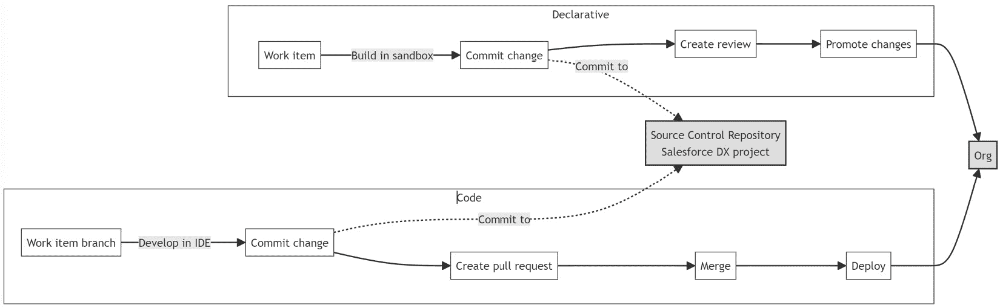

# 其他 Salesforce DevOps 工具

在本章中，我们将探讨一系列工具，这些工具补充并增强了 Salesforce DevOps 生态系统。这些工具提供不同的功能，涵盖 DevOps 生命周期的各个方面，从规划、开发到部署和监控。了解这些工具的功能和应用将帮助您为 Salesforce 实施选择最合适的工具。

本章将涵盖以下主题：

+   Salesforce DevOps Center

+   其他商业工具

+   开源工具

本章结束时，您将全面了解 Salesforce DevOps 生态系统，包括每个工具如何融入您的 DevOps 策略的见解。您还将具备做出明智决策的能力，以选择哪些工具最能满足您的 Salesforce 项目的特定需求。

# Salesforce DevOps Center

Salesforce DevOps 生态系统庞大且持续发展，许多工具应运而生，以满足开发生命周期中不同需求。在这一部分，我们将探讨一些与 Salesforce 集成的主要工具和平台概述，提供更高效的开发、协作和自动化体验。首先，我们将介绍一个新的重要角色——Salesforce 自家的 DevOps 解决方案：DevOps Center。

DevOps Center 是一个 Salesforce 解决方案，旨在通过将 DevOps 最佳实践融入 Salesforce 开发团队的变更和发布管理流程，无论他们位于低代码到专业代码的哪个位置，来增强这一过程。该平台是在 Salesforce 社区反馈的基础上开发的，用户寻求替代变更集的方案。虽然变更集仍然可用，但 DevOps Center 被认为是一个更先进、更高效的工具，用于管理 Salesforce 环境中的变更。

DevOps Center 具有以下关键功能：

+   **自动化变更跟踪**：DevOps Center 消除了手动跟踪变更的需求，如使用电子表格或便利贴，通过自动跟踪开发环境中的更改。

+   **源代码控制集成**：它使用源代码控制库，如 GitHub，作为项目更改的**唯一真实来源**（**SSOT**），确保团队成员之间的工作保持一致。

+   **分支管理**：该平台简化了分支的创建和管理，通过一个简单的点击界面，促进了变更通过发布管道的进程。

+   **工具灵活性**：开发人员可以使用他们在 DevOps Center 外偏好的工具，并且仍能通过集中源代码控制系统保持团队间的变更可见性。

+   **Salesforce DX 兼容性**：在后台，DevOps Center 利用 Salesforce DX，包括与 Salesforce CLI、Metadata API 和源代码控制的兼容性，而无需用户熟悉这些工具。

+   **用户界面 (UI)**：基于点击的 UI 使用户能够与 DevOps 流程互动，而无需直接接触底层技术，如 Salesforce CLI 或 GitHub。

使用 DevOps Center，不同类型的开发者可以更有效地协作。例如，声明式开发者可以创建工作项、拉取更改并提交到源代码管理库，而程序开发者可以在推广之前审查这些更改。发布经理可以通过 DevOps Center 内的发布管道或使用 Salesforce CLI 来部署更改，从而改善发布管理过程。请参见下图，了解支持的不同工作流程：

图 16.1 – DevOps Center 的开发流程

该平台还包括识别工作项之间冲突的功能，并提供帮助解决冲突的信息，这对于多并行开发的团队尤为有用。DevOps Center 可以检测开发环境与 SOT（目标状态）不同步的情况，并提供同步环境的工具，从而减少在部署过程中发生冲突或错误的机会。

该平台提供了对变更和发布过程的增强可见性，包括活动历史记录，便于审计和错误跟踪。工作项、冲突管理和仅验证部署等功能有助于提高生产力和优化工作流程。

初始版本的 DevOps Center 仅支持 GitHub 作为源代码管理系统。其他系统用户，如 Bitbucket，可能需要切换到 GitHub 或等待未来的更新。DevOps Center 目前还只支持基于组织的开发，而非基于包的开发（2GP），这可能与所有开发团队的工作流程不完全一致。最后，尽管计划推出多个外部集成功能，但目前它能连接的外部系统数量有限。

总的来说，DevOps Center 为 Salesforce 开发团队提供了一个简单的平台，以更有效地管理变更和发布过程。

# 其他商业工具

商业工具提供一系列针对 Salesforce 开发和操作的功能。这些平台通常提供一些专门的功能，如部署管理、影响分析和自动化能力。它们对于那些寻求简化开发流程并增强团队成员之间协作的组织尤其有益。在本节中，我们将探讨一些在 Salesforce DevOps 生态系统中做出重大贡献的商业工具。

## Salto

Salto 是一个 DevOps 平台，旨在简化和增强 Salesforce 环境的开发和操作流程。作为一个 SaaS 产品，Salto 管理 Salesforce 配置和元数据，旨在提供更高效的方式来处理不同 Salesforce 实例之间的部署、版本控制和依赖关系跟踪。

Salto 的核心功能包括以下内容：

+   **配置和元数据探索**：Salto 提供了工具，帮助用户在变更之前检查和理解 Salesforce 配置的影响。通过一个用户友好的界面，Salto 将底层的 XML 数据抽象为更易读的格式，采用 Salto 的专有 **非配置语言** (**NaCI**)。

+   **部署管理**：Salto 允许用户轻松地将变更从一个 Salesforce 环境迁移到另一个环境。该平台支持预部署验证过程，可以识别潜在的部署问题，例如缺失的依赖项，从而减少部署失败的频率。

+   **自动化和持续集成/持续部署 (CI/CD)**：Salto 引入了 CI/CD 自动化功能，使用户能够将平台集成到现有的 CI/CD 流水线中。这使得自动化测试、构建和部署过程成为可能，从而帮助团队实施 DevOps 最佳实践。

+   **版本控制集成**：Salto 与 **版本控制系统** (**VCS**) 集成，如 Git，一般包含 NaCL 元数据，允许用户为部署到 Salesforce 环境的变更创建审计跟踪。此集成还支持通过保持变更记录来满足监管要求，以便进行审计。

Salto 适用于多种用例，例如简化跨多个 Salesforce 沙盒和生产环境的部署过程，或管理复杂的 Salesforce 环境，其中配置之间的相互依赖关系是常见的。

它提供了一个用户友好的界面，将复杂的 XML 数据抽象为更易访问的格式。这有助于主动识别配置依赖关系，从而帮助防止部署问题。然而，用户需要学习 Salto 的专有 NaCl 语言，这可能带来一定的学习曲线。

总结来说，Salto 将自己定位为一个强大的 Salesforce DevOps 工具，旨在简化部署流程、增强变更智能，并提高整体效率。

## Panaya

Panaya ForeSight 是一个变更智能平台，旨在帮助组织管理、维护和调试他们的 Salesforce 组织。该平台提供了一整套工具，旨在提供对 Salesforce 环境复杂生态系统的可视化和控制。

ForeSight 使用户能够对其 Salesforce 组织的元数据进行深入分析，从而生成组织结构中依赖关系的详细映射。此映射对于理解各个组件之间的相互联系至关重要，这在规划对系统的更改或添加时非常重要。ForeSight 的一个关键功能是其 Discovery Chrome 扩展，它使用户能够直接从任何 Salesforce 页面获取洞察，帮助预测对相关组件（如 Apex 类、流程构建器、流程和字段）的影响。

ForeSight ExplAIn 是该平台的一个 AI 驱动扩展，通过以人类可读的格式提供关于 Salesforce 中自定义和自动化的解释，为平台增添了另一层智能。此功能有助于故障排除并自动生成文档，可以大大减少处理这些任务的时间。

ForeSight 可用于多种 Salesforce 管理任务，包括发布规划、减少技术债务、**根本原因分析**（**RCA**）和优化测试工作。它对于正在迁移到新 Salesforce 功能或管理从工作流规则到流程的过渡的组织尤其有用。该平台使组织能够清晰地理解变更的影响，自动化影响分析，并通过提供全面的组织洞察，帮助新团队成员高效入职。

Panaya ForeSight 的主要优势之一是该平台能够减少与理解和管理 Salesforce 组织相关的人工工作量，从而实现更准确、更快速的影响分析。AI 驱动的文档和人性化的解释增强了新员工的入职过程，并为组织功能提供了快速参考。通过实现主动管理，ForeSight 帮助组织从被动管理转变为战略性管理，可能会带来创新并优化工作流。

尽管该平台提供了全面的 Salesforce 组织管理工具集，但其效果的程度可能取决于组织的复杂性以及用户对平台的熟悉程度。此外，与任何 AI 驱动的工具一样，输出的质量取决于输入的数据，AI 的输出可能并不总是完全符合需求。

## Prodly

Prodly 旨在简化开发和运营过程，特别是对于 Salesforce 管理员和低代码开发人员等业务用户。产品套件包括环境管理、工作管理集成、发布自动化以及合规性和安全控制工具。

Prodly 在 Salesforce 中提供了一个用户友好的界面来管理各种开发环境，包括无需命令行工具即可创建 scratch org 的功能。此功能利用了 Salesforce DX 的特性，但简化了非开发人员的操作流程。Prodly 的环境管理还包括沙箱种子功能，允许用户用示例数据或特定数据集填充环境。此功能支持环境之间的自动数据迁移，遵循依赖关系和插入顺序，防止重复数据，并节省手动配置的时间。

在工作管理方面，Prodly 与 Salesforce 的 Agile Accelerator 和 DevOps Center 集成，使用户能够创建和管理项目及工作项，并将其与 DevOps Center 检测到的元数据变更关联。此集成确保了管理应用生命周期和相关元数据的过程顺畅。

Prodly 中的发布自动化功能允许对源环境和目标环境之间的元数据进行比较，提供变更预览和引导部署过程。这可以通过在执行部署之前提供洞察，帮助防止部署错误。此外，Prodly 支持从一个组织到另一个组织或从组织到分支的元数据部署，支持不同的开发工作流，包括使用源代码控制系统的工作流。

Prodly 适用于需要为管理员和低代码开发人员提供 DevOps 功能的 Salesforce 用户组织。它对于管理复杂应用程序的企业尤其有用，例如 Salesforce CPQ 或 B2B Commerce，这些应用程序中配置数据与元数据同样重要。

## Elements.cloud

Elements.cloud 是一个旨在提升 Salesforce 环境管理和文档编制的 DevOps 平台。其主要功能包括捕获反馈、管理需求、定义工作项（如发布和用户故事），并将其与 Salesforce 元数据关联进行影响分析。该平台与 Salesforce 集成，允许用户将流程图嵌入到 Salesforce 记录页面中，并提供上下文敏感的帮助。

Elements.cloud 的一个关键使用场景是简化 Salesforce 组织内变更的文档编制和分析过程。通过自动化元数据字典的创建，并与生产和沙箱环境同步更新，Elements.cloud 促进了更高效的影响分析过程。此功能帮助开发人员和管理员理解 Salesforce 元数据组件之间的关系和依赖关系，从而将影响分析所需的时间和精力减少多达 50%。

Elements.cloud 的优势在于其提供的可视化层级流程映射工具，该工具具有版本控制并可以直接嵌入 Salesforce。这增强了用户验证业务流程需求的能力，并且平台的风险评估功能有助于从合规性和技术角度跟踪变更的潜在影响。此外，该平台还自动化了元数据项的文档记录，通过识别低影响字段来支持清理，并提供多层级依赖关系分析以进行深入的影响评估。

该平台还通过绘制业务流程并识别优化领域，帮助用户推动流程改进节省。通过将流程步骤与用户故事或需求关联，并附加相关文档，Elements.cloud 促进了对为何做出某些变更的理解，从而促进了机构知识的积累和未来开发的前瞻性保障。

## Opsera

Opsera 是一个持续编排平台，旨在解决 DevOps 领域的问题，特别是连接交付流水线中各种工具并为该流水线创建可视性的挑战。它旨在提供产品交付的速度、质量和安全漏洞的洞察。Opsera 将这些工具的管理整合在一个 **单一视窗**（**SPOG**）中，为不同的工具集和流程提供编排和可视性。

Opsera 提供工具链自动化、声明式管道和洞察模块。工具链自动化模块允许用户管理和部署应用程序交付所需的工具，支持 SaaS 和传统应用程序。它包括与 Jenkins、Argo CD、Artifactory 和 SonarQube 等多种工具的集成，并具有根据需要添加其他工具的灵活性。Opsera 基于 SaaS 平台运行，客户被配置为单租户 VPC 和个性化门户。

声明式管道模块提供了一个低代码环境，用户可以在其中创建应用程序的工作流，包括为 Kubernetes 设计的 Salesforce 和容器化应用程序。它通过提供任务驱动的操作，迎合低代码开发者和高代码开发者的需求，使用户能够直接从组织推送变更到 Git 分支，促进 GitOps，无需命令行 Git 知识。

Opsera 的洞察模块提供了包含 **DevOps 研究与评估**（**DORA**）、**完成定义**（**DoD**）和 **国家标准与技术研究院**（**NIST**）指标的 100 多个关键绩效指标（KPI）的全面仪表板。它提供了软件交付生命周期的可视性，包括成功的部署、管道状态和单元测试指标。这种可观察性扩展到 Salesforce 特定的指标，提供对备份、回滚、迁移和 Jira 交付时间的洞察。

Opsera 的使用案例包括 Salesforce 应用程序的部署，它可以同时处理代码和低代码元素，以及将容器化应用程序交付到 Kubernetes。它支持各种环境，并能够管理应用程序从沙盒到生产环境的迁移。此外，它通过直接集成、API 交互和命令行步骤提供对应用生命周期管理工具的可见性。

Opsera 的主要优势在于其能够将不同的工具和流程整合到一个编排平台中，提供统一的 DevOps 方法。其基于 SaaS 的单租户 VPC 架构确保了安全性和隔离性。该平台的低代码环境对各种技术水平的用户都能访问，促进了不同团队成员之间的协作。

# 开源工具

开源工具在 Salesforce DevOps 生态系统中扮演着至关重要的角色。它们为社区提供灵活、可定制且通常无成本的解决方案，能够根据特定需求进行调整。这些工具由用户和贡献者共同开发和维护，大家协作改善和更新这些工具。在本节中，我们将探讨几种因其在 Salesforce DevOps 实践中的实用性和影响力而广受关注的开源工具。

## Happy Soup

Happy Soup 是一个开源项目，旨在对 Salesforce 环境中的影响和依赖关系进行分析。该工具基于 JavaScript 和 Node.js 构建，其源代码在 GitHub 上公开，便于透明和协作。它主要面向需要理解 Salesforce 组织中复杂依赖关系的 Salesforce 管理员和开发人员。

Happy Soup 的核心功能包括分析对 Salesforce 组织所做更改的影响，以及了解各个组件之间的依赖关系。当修改像自定义字段这样的元素时，这一功能尤其有用，它有助于识别此类更改可能在系统中引发的潜在问题。

例如，如果修改了一个自定义字段，Happy Soup 可以迅速识别组织中所有依赖该字段的组件。这包括报告过滤器中的依赖、Apex 类、**Lightning Web Components**（**LWC**）中的 JavaScript 控制器、工作流规则等。该工具提供了这些依赖的可视化表示，便于理解潜在影响的广度和深度。

Happy Soup 的使用案例包括以下几种：

+   **影响分析**：在更改自定义字段之前，可以使用 Happy Soup 来确定依赖关系和潜在风险，从而做出明智的决策。

+   **依赖分析**：该工具对于独立顾问或新加入的团队成员来说非常有用，可以帮助他们快速了解特定组件或对象在不熟悉的 Salesforce 组织中的使用情况。

+   **页面布局优化**：Happy Soup 可以将页面布局的字段导出到 Excel 表格中，方便与业务用户讨论每个字段的相关性和必要性。

Happy Soup 是一款对 Salesforce 专业人士非常有价值的工具，旨在帮助管理其组织的元数据依赖关系的复杂性，并最小化与 Salesforce 环境变更相关的风险。

## SFDX-Hardis

SFDX-Hardis 是一款为 Salesforce 开发团队增强 DevOps 过程的 Salesforce DX 插件。它旨在提供一种模块化、可脚本化的 DevOps 方法，将 Salesforce DX 命令的标准执行序列或脚本封装为单一且更易于访问的命令。

SFDX-Hardis 既作为 Salesforce DX 插件，也作为 Visual Studio Code 扩展，提供了一个用户友好的界面来启动 DevOps 任务。它允许用户启动新任务、创建字段，并通过向导管理分支合并，将复杂的命令行操作抽象为简单的界面驱动操作。该插件支持如创建分支、初始化沙盒、检索元数据和准备提交等操作。它还包括一个 Visual Studio Code 扩展，为那些可能不熟悉命令行工具的用户提供了图形化界面来执行命令。

该插件特别适用于需要结构化且灵活的方式来管理 DevOps 流水线的 Salesforce 开发团队。它支持同时使用临时组织（scratch orgs）和沙盒（sandboxes），因此适用于各种开发工作流。它的功能扩展至自动化元数据检索、部署模拟和质量检查，包括 Apex 测试覆盖率验证。SFDX-Hardis 可以与 GitLab、GitHub Actions 和 Azure DevOps 等 CI 服务器集成，从而在成功合并请求后自动化部署过程。

SFDX-Hardis 与流行的 CI/CD 系统的集成以及其对用户体验的关注，使其成为希望采用或增强 DevOps 实践的 Salesforce 开发团队的宝贵工具。

## DX@Scale

DX@Scale 是一个为 Salesforce 实施设计的 DevOps 解决方案。它旨在通过利用 Salesforce DX 原则和定制工具，解决管理大型 Salesforce 项目时所面临的复杂性和挑战。该解决方案围绕几个核心原则构建，包括模块化设计、自动化和 CI/CD 实践。

DX@Scale 允许创建多个工件，如解锁包和源包，这些工件可以独立开发、测试和部署。它利用 Scratch Org 池来减少配置开发环境所需的时间，使开发人员可以即时访问。该解决方案实现了简化的分支模型，主分支作为生产分支，功能分支用于开发工作。它还包括自定义库、SF PowerScripts 和 SF PowerKit，这些是开源工具，提供了额外的功能，如包版本控制、构建优化和配置文件对账。

DX@Scale 对于大型 Salesforce 项目，特别是涉及多个团队和复杂部署需求的项目尤为有用。它通过允许高效管理依赖关系并促进创建更小、更易管理的包，从而简化了开发过程。该解决方案还适用于需要快速配置环境的场景，以及需要快速反馈循环的场景，在这些场景中，代码更改与部署验证之间的时间尤为重要。

DX@Scale 的主要优势之一是能够快速交付部署，完整构建的时间不到 25 分钟，单元测试执行时间在 2 到 5 分钟之间。它使用 CI/CD 管道和工件仓库，确保部署过程的可追溯性和控制。

## CumulusCI

CumulusCI 是 Salesforce.org 开发的一个工具链，旨在自动化 Salesforce 项目的应用生命周期。它通过提供一套协同工作的自动化工具，旨在促进 Salesforce 应用的开发、测试和部署，从而创建一个紧密结合的开发流程。

CumulusCI 与 VCS 集成，利用 Salesforce DX Scratch Org 作为所有开发工作的基础。它自动化创建这些 Scratch Org，处理依赖关系、包安装、元数据部署、组织配置和数据填充。CumulusCI 通过流程和任务来协调这些过程，流程和任务是项目仓库中定义的自动化模块。任务是在 Salesforce 组织中的单独操作，而流程则是这些任务的序列，能够实现特定的结果。它们可以在 YAML 中配置，并且可以通过 Python 扩展。

CumulusCI 用于构建适应应用生命周期中各种角色的复杂环境，从开发人员和管理员到最终用户。它支持即时和独立的环境创建，确保团队可以在没有基础设施限制的情况下工作。CumulusCI 的可移植性意味着自动化不仅限于 CI 服务器，还扩展到本地机器和像 MetaCI 和 MetaDeploy 这样的 Web 界面。

工具链通过允许每个团队成员在他们的组织中工作，显著提高了开发速度，并大幅减少了对共享环境的冲突和依赖。它将现代最佳实践，如源代码控制和 Salesforce DX，嵌入到开发工作流程中。CumulusCI 是开源的，符合 Salesforce 社区驱动的倡议，并鼓励贡献和协作。

# 总结

在我们结束本章时，显而易见，Salesforce DevOps 生态系统提供了多种工具，能够满足各种开发场景的需求。从 Salesforce 自己的 DevOps Center 到第三方工具以及社区驱动的开源项目，市场上有丰富的选择，可以根据任何组织的独特需求量身定制。

我们讨论的每个工具都有其独特的优势和专长领域。通过选择这些工具的正确组合，Salesforce 团队可以创建一个不仅简化开发和部署流程，而且促进持续改进和协作文化的 DevOps 环境。

例如，Salesforce DevOps Center 是一个强大的原生 Salesforce 解决方案，能够与平台无缝集成，提供自动化的变更跟踪和源代码控制集成。它是寻求与 Salesforce 自身最佳实践和未来发展紧密结合的团队的理想选择。

商业工具，如 Salto、Panaya、Prodly 和 Elements.cloud，提供了一系列功能，如影响分析、部署管理和流程文档化。这些工具通常非常适合需要强大支持、先进功能和指导式用户体验的组织。

开源工具，包括 Happy Soup、SFDX-Hardis、DX@Scale 和 CumulusCI，为团队提供了灵活性和定制 DevOps 过程的能力。开源项目的协作性质通常意味着这些工具处于创新的前沿，融入了社区的最新想法和技术。

在为你的 Salesforce DevOps 工具包选择工具时，要考虑你组织的复杂性、开发团队的规模以及你面临的具体挑战。例如，如果快速环境配置是优先事项，工具如 DX@Scale 和 CumulusCI 可能特别有用。如果影响分析和依赖管理至关重要，那么 Salto 和 Panaya 可能会提供必要的洞察。

还需要考虑你 DevOps 实践的未来方向。随着 Salesforce 的不断发展，支持它的工具也将不断演进。关注新兴技术和现有工具的更新，将帮助确保你的 DevOps 策略保持当前并有效。

最终，任何 DevOps 工具的目标都是支持团队高效、可靠地交付高质量的软件。通过仔细评估各种选择并了解每个工具在更广泛生态系统中的适配方式，你可以创建一个不仅能够满足今天需求，而且能够应对明天挑战的 DevOps 环境。

通过本章获得的知识，你已经做好了充分准备，可以在 Salesforce DevOps 生态系统中顺利导航，做出明智的选择，从而推动你所在组织的成功。随着 Salesforce 平台的持续发展和演变，围绕它的工具和实践也会不断变化，提供创新和卓越的新机会。在接下来的最后一章，我们将总结主要发现，并规划出你未来可以走的路径。
